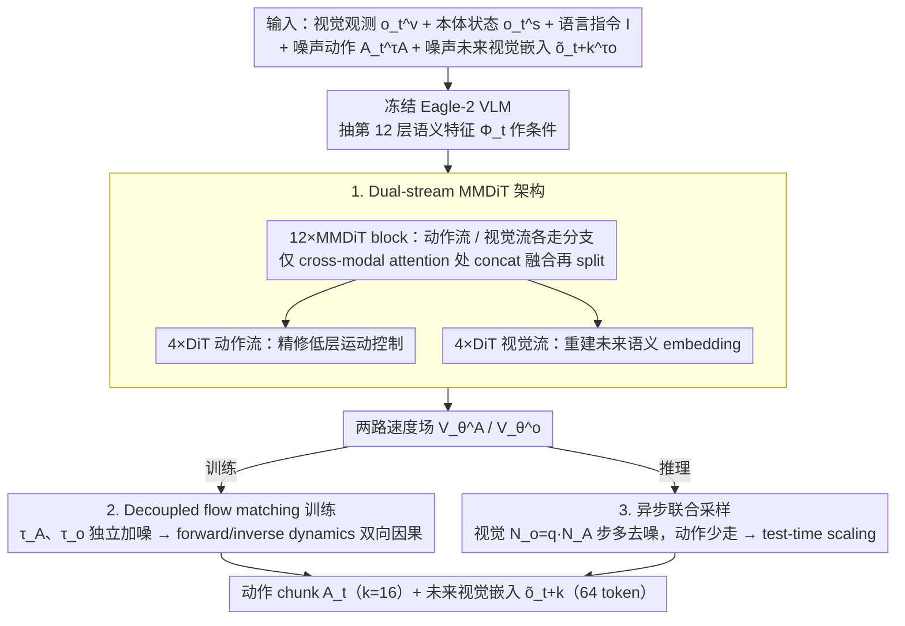

# Dual-Stream Diffusion for World-Model Augmented Vision-Language-Action Model

**会议**: ICML 2026  
**arXiv**: [2510.27607](https://arxiv.org/abs/2510.27607)  
**代码**: 项目主页已公开（论文中以"Project page here"形式给出）  
**领域**: 机器人  
**关键词**: VLA、世界模型、多模态扩散、flow matching、异步采样  

## 一句话总结
DUST 用一套"分流式"多模态扩散 Transformer（MMDiT）把动作流与未来视觉嵌入流并排走，靠共享 attention 做跨模态融合，再配独立噪声调度和动作-视觉异步采样，让 VLA 同时学会"做什么动作"和"动作会产生什么后果"，在 RoboCasa / GR-1 / Franka 真机上稳定刷过 GR00T-N1.5+FLARE。

## 研究背景与动机
**领域现状**：基于扩散的 Vision-Language-Action 模型（π0、GR00T-N1.5 等）是目前通用机器人策略的主流路线——VLM 当感知头，diffusion action expert 当行动头，用 flow matching 学动作分布。

**现有痛点**：纯 VLA 只学"观察→动作"映射，对"动作会把世界变成什么样"没有显式建模，物理常识贫乏，容易在新场景失败。前人加 world-model 目标的方法分两派，但都有结构缺陷：(a) **Unified joint diffusion**（PAD/EnerVerse）把动作 token 和视觉 token 拼起来送进同一个扩散模型——但动作是低维、时序光滑的轨迹，视觉是高维、空间复杂的图像，单一 latent 空间会被高维视觉主导；(b) **Causal diffusion**（Video Policy/VPP）拆成两个模型、视觉→动作单向条件——避免了模态打架，但彻底切断了反向信息流，动作无法影响视觉表征学习。

**核心矛盾**：跨模态融合（一起学才能挖出因果耦合）与模态专属保真度（各自的统计性质差别太大）之间的零和 trade-off。

**本文目标**：(1) 在一个模型里同时承载两条 token 流，让它们各自走自己的去噪路径；(2) 让模型显式学到"动作↔未来状态"的双向因果依赖，而不是单向条件；(3) 推理时按模态需求差异分配算力，把世界模型的额外开销转化成 test-time scaling 收益。

**切入角度**：作者借鉴 Stable Diffusion 3 的 MMDiT 思路——两条 token 流大部分时间走分支，只在 attention 层临时合并——再叠加 diffusion forcing 风格的逐模态独立噪声，使得训练时模型必须在"动作干净 / 视觉带噪"和"动作带噪 / 视觉干净"的所有组合下都能预测正确速度场，从而显式承担起 forward dynamics（动作→状态）和 inverse dynamics（状态→动作）两种推理。

**核心 idea**：把动作和视觉视为两条平行扩散流，靠共享 attention 互通有无，靠独立噪声逼出双向因果，靠异步采样吃掉高维视觉的算力开销。

## 方法详解
DUST 在 GR00T-N1.5 这种"冻结 VLM + 可训扩散 action expert"的标准骨架上做手术，扩散模块同时吐出动作 chunk 和未来视觉 embedding 两路输出。整个 pipeline 可以拆成"架构怎么搭—训练怎么噪—推理怎么采"三段。

### 整体框架
**输入**：当前视觉观测 $o_t^v$、本体状态 $o_t^s$、语言指令 $I$；扩散过程额外吃噪声动作 $A_t^{\tau_A}$ 与噪声未来视觉嵌入 $\tilde{o}_{t+k}^{\tau_o}$。

**主干**：冻结的 Eagle-2 VLM 抽第 12 层语义特征 $\Phi_t$ 作为条件；扩散模块 $\pi_\theta$ 由 12 个共享 MMDiT block + 各自 4 个模态专属 DiT block 组成。

**输出**：动作 chunk $A_t=(a_t,\ldots,a_{t+k-1})$（$k=16$）+ 未来视觉嵌入 $\tilde{o}_{t+k}$（在 SIGLIP-2 表征空间，256 token 经 $2\times 2$ 平均池化降到 64 token）。

**目标**：训练时联合最小化动作 flow matching loss 与视觉 flow matching loss；推理时联合采样并通过控制视觉/动作的去噪步数比 $q$ 实现 test-time scaling。

### 关键设计

**1. Dual-stream MMDiT 架构：让两条 token 流大部分时间各走各的，只在 attention 这一个口子上融合**

跨模态融合和模态专属保真度是一对零和 trade-off：unified joint diffusion 把动作和视觉拼进同一 latent，低维时序光滑的动作会被高维空间复杂的视觉淹没；causal diffusion 拆成两模型单向条件，又彻底切断了反向信息流。DUST 借 Stable Diffusion 3 的 MMDiT 找折中：每个 MMDiT block 内，动作流和视觉流分别走自己的 FFN/LayerNorm，只在 cross-modal attention 层临时 concat 做 self-attention，然后再 split 回各自分支；两条流各拿一份 AdaLN 时间步嵌入（对应自己的 $\tau_A$ 或 $\tau_o$），从底层就解耦动力学。MMDiT 之后还各接 4 层模态专属 DiT 精修——视觉流重建语义一致的未来 embedding，动作流专注低层运动控制。

核心思想是把"信息流通"压缩到 attention 这一个口子，其余地方各算各的，等于在融合粒度上做了精细调度：既保证模态能互通（否则学不到耦合），又不强制共享 latent（否则被高维视觉主导）。

**2. Decoupled flow matching 联合训练：用逐模态独立噪声逼出 forward / inverse dynamics 双向因果**

传统 joint diffusion 用同一个 $\tau$ 同步加噪，模型永远在"两边一起脏 / 一起干净"的对角线上训练，学不到模态间的因果不对称。DUST 让动作侧采 $\tau_A\in[0,1]$、视觉侧独立采 $\tau_o\in[0,1]$，构造 $A_t^{\tau_A}=\tau_A A_t+(1-\tau_A)\epsilon_A$ 与 $\tilde{o}_{t+k}^{\tau_o}=\tau_o\tilde{o}_{t+k}+(1-\tau_o)\epsilon_o$，网络输出两路速度 $[V_\theta^A, V_\theta^o]$ 各按自己的 flow matching loss 优化：

$$\mathcal{L}_A=\mathbb{E}\|V_\theta^A-(A_t-\epsilon_A)\|^2,\quad \mathcal{L}_{WM}=\mathbb{E}\|V_\theta^o-(\tilde{o}_{t+k}-\epsilon_o)\|^2,\quad \mathcal{L}_{Joint}=\mathcal{L}_A+\lambda_{WM}\mathcal{L}_{WM}\ (\lambda_{WM}=1.0).$$

独立噪声把训练分布从对角线扩到整个二维方格：碰上"视觉几乎干净 + 动作几乎纯噪声"时，模型被逼着回答"什么动作导致这个状态"（inverse dynamics）；反过来则是 forward dynamics。一个损失项就把所有动力学推理方向的子任务一次性塞了进去。

**3. Vision-action 异步联合采样：让高维视觉多去噪几步、动作少走几步，把世界模型的算力盈余变成 test-time scaling**

视觉扩散要很多步才收敛，动作扩散步多了反而掉点——这是两者维度差异决定的，同步采样必然按"短板"选步数、浪费视觉模态算力。DUST 把两者解耦：设动作步数 $N_A$、视觉步数 $N_o=q\cdot N_A$（$q\in\mathbb{N}$），用全局视觉步长 $\Delta\tau_o=1/N_o$ 推进，每一小步都更新视觉 token，但动作 token 只在 $\tau_A N_o \bmod q=0$ 时按大步长 $\Delta\tau_A=q\Delta\tau_o$ 更新一次。$q=1$ 退化为同步采样（与 baseline 公平对比），$q>1$ 时世界模型多算几轮、动作借此读到更精细的未来视觉信号。

于是两个步数被独立调节，自然落出一个 inference-time scaling 的旋钮——实测视觉多算几步带来 2–6 pp 提升，几乎是无代价的 free lunch。

### 损失函数 / 训练策略
- 联合损失 $\mathcal{L}_{Joint}=\mathcal{L}_A+1.0\cdot\mathcal{L}_{WM}$，时间步采样沿用 $\tau\sim\mathrm{Beta}((s-\tau)/s;1.5,1.0)$，$s=0.999$。
- VLM backbone 全程冻结，diffusion expert 从头训；动作 token 16 个、状态 token 1 个、未来视觉 token 64 个一同进 MMDiT。
- 世界模型目标用 SIGLIP-2 embedding 作监督（不是像素），避开像素重建对纹理/光照的浪费式建模。

## 实验关键数据

### 主实验
RoboCasa（24 个操作任务）+ GR-1（24 任务）+ Franka Research 3 真机（7 任务）三大平台，统一 baseline 为 GR00T-N1.5、π0、π0-FAST，并实现 FLARE 做对照。

| 数据集 | 设置 | 指标 | 本文 (GR00T+DUST) | 之前最强 (GR00T+FLARE) | 提升 |
|--------|------|------|------|------|------|
| RoboCasa | 100 demos/task | Avg. success (%) | 50.1 | 44.6 | +5.5 |
| RoboCasa | 300 demos/task | Avg. success (%) | 58.5 | 55.3 | +3.2 |
| RoboCasa | 1000 demos/task | Avg. success (%) | 66.3 | 64.6 | +1.7 |
| GR-1 | 300 demos/task | Avg. success (%) | 36.0 | 33.7 | +2.3 |
| GR-1 | 1000 demos/task | Avg. success (%) | 42.0 | 36.3 | +5.7 |
| Franka 真机 | 7 任务平均 | Success (%) | 59.9 | 49.5 | +10.4 |

DUST 在每个 demo 规模下都稳定领先 FLARE，对 vanilla GR00T-N1.5 的相对提升尤其明显（RoboCasa 100 demos 直接 +8.4 个百分点）。真机上 PnP/Insert/Tool-Use 三类任务全面提升，最难的 Cord-insertion 从 12.5% 跳到 29.2%。

### 消融实验
| 配置 | 关键指标 | 说明 |
|------|----------|------|
| Full DUST | Avg. 58.5 (RoboCasa 300 demos) | 完整模型，$q=1$ |
| + test-time scaling ($q>1$) | +2~6 pp | 视觉去噪步数翻倍即可白送精度 |
| w/o dual-stream（改回 unified joint diffusion）| 显著掉点 | 模态被强行合并，低维动作被高维视觉淹没 |
| w/o decoupled noise（$\tau_A=\tau_o$ 同步）| 显著掉点 | 失去 forward/inverse dynamics 信号 |
| 像素级 world-modeling 替代 embedding 目标 | 掉点 | 模型容量被纹理/光照吞噬 |
| Joint training (RoboCasa+GR-1+EgoDex) | RoboCasa Avg. ↑ | 多机器人/人手数据混训仍有正向迁移，DUST 框架原生支持异构数据 |

### 关键发现
- **跨模态对称耦合是关键**：从"causal 单向→dual-stream 双向"的收益比"unified→causal"还大，说明 inverse dynamics 监督被以前的工作严重低估。
- **异步采样是几乎无代价的 free lunch**：vision tokens 多算几步带来 2–6 pp 提升，而动作 token 增加步数反而掉点——这就是为什么必须把两者解耦。
- **预训练 + 异构数据兼容性强**：DUST 可以只用 action-free 视频做预训练（视觉流在干、动作流随机噪声仍学 inverse dynamics），再迁移到下游任务时仍有显著增益；和 EgoDex 人手数据联合训练也不会拖累机器人任务。
- **真机收益 > 仿真收益**：仿真 +5%，真机 +10%，说明显式世界建模对分布外/物理细节扰动尤其有用。

## 亮点与洞察
- **MMDiT 复用得很巧**：原本是图像生成里给"图像 token + 文本 token"分流的架构，本文搬到"动作 token + 视觉 token"上几乎天然契合，工程改动小、增益大。
- **独立噪声 = 隐式课程学习**：训练时不同 $(\tau_A,\tau_o)$ 组合对应"已知未来求动作 / 已知动作求未来 / 同时未知"等不同子任务，单一损失项就把它们全部塞进去，比设计多个 auxiliary head 要简洁很多。
- **异步采样的思想可以迁移**：任何包含多模态扩散（如视频+音频、点云+图像）的生成/控制任务，只要模态维度差异大，就可以用类似 $q$ 旋钮把高维模态的去噪步数独立放大，等于免费的 test-time scaling。
- **embedding 级 world model 已经够用**：本文再次验证 DINO-WM/FLARE 路线——不需要重建像素，只需要预测 VLM 后端的语义 embedding，就能给策略提供足够的物理约束。

## 局限与展望
- VLM backbone 全程冻结，未来视觉嵌入空间被 SIGLIP-2 锁死，对"VLM 本身没编码进去的物理细节"（如细微力觉、接触状态）依然瞎眼。
- 异步采样的 $q$ 是离散整数，且需手动选——能否做成连续的、按当前不确定度自适应的 schedule 是个开放问题。
- 真机实验仅在 Franka 单臂 + 7 任务上验证，对双臂、移动底盘、灵巧手等更复杂形态尚未覆盖。
- 训练成本相对 vanilla VLA 增加：每步要算两路 flow matching loss，且视觉 token 数比动作 token 多 4 倍，单步显存与算力翻倍。
- 论文没明确比较 DUST 与 video generation 路线的 WAM（Cosmos Policy / Fast-WAM / DreamZero），二者技术路线正交，融合空间值得继续探索。

## 相关工作与启发
- **vs FLARE (Zheng et al., 2025)**：FLARE 也用 embedding 目标做隐式世界建模，但只做单向 feature alignment、共享单一 latent；DUST 做显式双向 diffusion + 独立噪声，跨模态因果信号更强，在所有 benchmark 上稳定领先 FLARE。
- **vs PAD / EnerVerse (unified joint diffusion)**：他们把动作和视觉拼成一个长 token 序列、单一时间步同步去噪；DUST 用 MMDiT 拆流 + 异步 schedule，本质上是允许"分而治之 + 受控融合"。
- **vs Video Policy / VPP (causal diffusion)**：他们用两个模型、视觉单向条件动作；DUST 单一模型、双向耦合，避免了 causal 设计的信息瓶颈。
- **vs Diffusion Forcing (Chen et al., 2025a)**：DF 提出 per-token 独立噪声学因果，DUST 把它降到 per-modality 粒度更适合"两个性质差异巨大"的模态组合。
- **vs WAMs (Cosmos Policy / Fast-WAM / DreamZero)**：那些工作把预训练视频生成大模型当作 policy；DUST 是给 VLA 加 world model 目标，方向正交，可以预期未来会有混合方案。

## 评分
- 新颖性: ⭐⭐⭐⭐ 把 MMDiT 引入 VLA 是有创意的迁移，独立噪声+异步采样的组合在 robot learning 圈第一次出现。
- 实验充分度: ⭐⭐⭐⭐⭐ 仿真 (RoboCasa/GR-1/CALVIN/LIBERO) + 真机 (Franka 7 任务) + 预训练 + 联合训练全覆盖，对比和消融都做到位。
- 写作质量: ⭐⭐⭐⭐ 架构图清晰、公式推导完整，部分章节（异步采样）若多一张时间轴图会更友好。
- 价值: ⭐⭐⭐⭐⭐ 给"VLA + 世界模型"这一火热方向给出了一个简洁、强 baseline，思路可以直接套用到下一代 robot foundation model。

<!-- RELATED:START -->

## 相关论文

- [\[ICML 2026\] Discrete Diffusion VLA: Bringing Discrete Diffusion to Action Decoding in Vision-Language-Action Policies](discrete_diffusion_vla_bringing_discrete_diffusion_to_action_decoding_in_vision-.md)
- [\[ICML 2026\] From Abstraction to Instantiation: Learning Behavioral Representation for Vision-Language-Action Model](from_abstraction_to_instantiation_learning_behavioral_representation_for_vision-.md)
- [\[CVPR 2026\] Global Prior Meets Local Consistency: Dual-Memory Augmented Vision-Language-Action Model for Efficient Robotic Manipulation](../../CVPR2026/robotics/global_prior_meets_local_consistency_dual-memory_augmented_vision-language-actio.md)
- [\[CVPR 2026\] Chain of World: World Model Thinking in Latent Motion (CoWVLA)](../../CVPR2026/robotics/chain_of_world_world_model_thinking_in_latent_motion.md)
- [\[CVPR 2026\] Motus: A Unified Latent Action World Model](../../CVPR2026/robotics/motus_a_unified_latent_action_world_model.md)

<!-- RELATED:END -->
