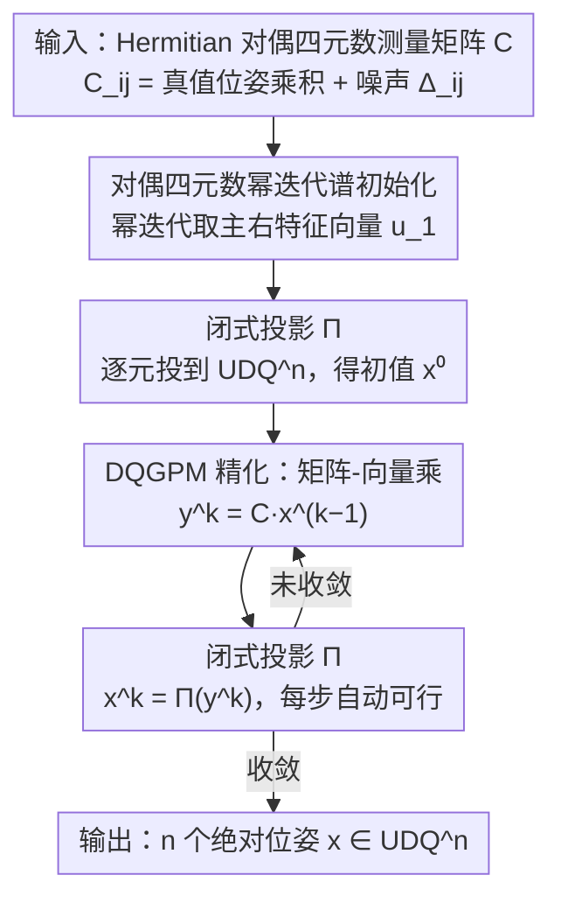

# Dual Quaternion SE(3) Synchronization with Recovery Guarantees

**会议**: ICML 2026  
**arXiv**: [2602.00324](https://arxiv.org/abs/2602.00324)  
**代码**: https://github.com/jnzhao333/dq_sync  
**领域**: 3D视觉 / 优化 / 位姿同步  
**关键词**: SE(3) 同步、对偶四元数、谱方法、广义幂法、多扫描点云配准  

## 一句话总结
本文用单位对偶四元数（UDQ）替代 $4\times4$ 矩阵来参数化 SE(3) 同步问题，先用 Hermitian 对偶四元数矩阵的幂迭代算出谱初始化，再用每步逐元投影到 $\mathrm{UDQ}^n$ 的广义幂法（DQGPM）做迭代精化，首次给出 SE(3) 同步的有限步线性收敛与显式误差界，并在多扫描点云配准上把旋转/平移误差和算法时间都打到了矩阵方法之下。

## 研究背景与动机

**领域现状**：SE(3) 同步——从一堆带噪声的相对位姿 $T_{ij}$ 反推所有节点的绝对位姿——是 SLAM、多点云配准、SfM 的基础原语。主流做法是用 $4\times4$ 矩阵表示位姿，跑谱松弛（EIG）、半定松弛（SDR）或者 Lie 代数平均/Riemannian 优化，再在最后一步把解 "圆整"（rounding）回 SE(3)。

**现有痛点**：矩阵表示有个结构性问题——**表示间隙（representation gap）**。在 $\mathrm{SO}(2)$ 上用复数表示时，特征空间的等距群恰好就是 $\mathrm{SO}(2)$，rounding 退化为简单归一化；在 $\mathrm{SO}(d)$ 上用矩阵表示时，等距群是 $\mathrm{O}(d)$，引入一个温和的反射歧义但能被 SVD 解决；可一旦到 SE(3)，由于 $\mathrm{SE}(3)=\mathrm{SO}(3)\ltimes\mathbb{R}^3$ 是**非紧的**，而松弛后的特征空间几何是紧致正交的，松弛解会远离流形，rounding 不再是 "纠错" 而成了 "强加结构"，必须依赖多步启发式（拆分旋转/平移、再各自投影），既不稳定也很难分析。

**核心矛盾**：要选一种参数化，使得**谱松弛产生的特征空间歧义群恰好和 SE(3) 的全局规范对称性对齐**，这样 rounding 才能是良性的投影，理论分析才走得通。对偶四元数刚好提供这种对齐——单位对偶四元数 $\mathrm{UDQ}$ 是个紧致的 7 维流形，能同时编码旋转和平移，并且 Hermitian 对偶四元数矩阵的特征结构和 SE(3) 同步的规范对称性匹配。

**本文目标**：(1) 把 SE(3) 同步形式化为 $\mathrm{UDQ}^n$ 上的最小二乘 QPQC；(2) 设计一个有理论保证的两阶段算法——谱初始化 + 迭代精化；(3) 给出有限步收敛和噪声相关的显式误差界。

**切入角度**：作者注意到对偶四元数 $\mathbb{DH}$ 虽然是带零因子的环（不是域）、模长只是对偶数取值的伪范数、主特征对要按字典序定义——这些性质让经典的同步理论无法直接套用，但只要：(a) 把 $\mathrm{UDQ}$ 上的规范化映射 $\mathcal{N}(\cdot)$ 写成闭式并证明它是 Lipschitz；(b) 用对偶数的"标准部 + 对偶部"分别控制误差，就能把矩阵情形下的谱+GPM 分析框架平移过来。

**核心 idea**：把每个位姿写成单位对偶四元数 $x_i\in\mathrm{UDQ}$，求解 $\min_{\bm{x}\in\mathrm{UDQ}^n}\|\bm{C}-\bm{x}\bm{x}^*\|_F^2$，先用 Hermitian DQ 矩阵 $\bm{C}$ 的对偶四元数幂迭代得到初始化，再用每步投影到 $\mathrm{UDQ}^n$ 的广义幂法（DQGPM）精化——这样每个迭代点都自动可行，且能证明线性收敛到 $O(\|\bm{\Delta}\hat{\bm{x}}\|_2/n)$ 的误差地板。

## 方法详解

### 整体框架
输入是 Hermitian 对偶四元数测量矩阵 $\bm{C}\in\mathbb{DH}^{n\times n}$，其中 $C_{ij}=\hat{x}_i\hat{x}_j^*+\Delta_{ij}$，$\Delta_{ij}$ 是观测噪声。输出是 $\bm{x}\in\mathrm{UDQ}^n$，即 $n$ 个绝对位姿的对偶四元数估计。整个流水线分两阶段：

1. **谱初始化**（Algorithm 1）：对 $\bm{C}$ 跑幂迭代得到主特征向量 $\bm{u}_1\in\mathbb{DH}^n$（约束 $\|\bm{u}_1\|_2^2=n$），然后逐元素投影 $\bm{x}^0=\Pi(\bm{u}_1)\in\mathrm{UDQ}^n$；
2. **DQGPM 精化**（Algorithm 2）：每步先做矩阵-向量乘 $\bm{y}^k=\bm{C}\bm{x}^{k-1}$，再投影 $\bm{x}^k=\Pi(\bm{y}^k)$，迭代到收敛。

把问题写成 QPQC：$\arg\max_{\bm{x}\in\mathrm{UDQ}^n} \bm{x}^*\bm{C}\bm{x}$（Proposition 2.1 证明这与原最小二乘等价，目标差一个常数因子 2）。如果把 $\mathrm{UDQ}^n$ 松弛成 $\|\bm{x}\|_2^2=n$ 的对偶四元数球面，最优解就是 $\bm{C}$ 的主右特征向量 $\bm{u}_1$，这就是谱估计的来源。贯穿两阶段的共用算子是闭式投影 $\Pi$——谱初始化末尾投一次得初值，DQGPM 每步迭代各投一次，正是它把"启发式 rounding"换成了可分析的一步操作。

### 关键设计

**1. 闭式投影 $\Pi:\mathbb{DH}^n\to\mathrm{UDQ}^n$ 与 $\mathcal{N}(\cdot)$ 的 Lipschitz 性质**

矩阵方法的 rounding 是一串启发式——先 SVD 投影旋转、再算质心、再修平移，既没有解析式又难分析。本文把它换成一步可控的算子。先定义单点规范化 $\mathcal{N}(x)$：当标准部 $x_{\mathrm{st}}\neq 0$ 时给闭式 $u_{\mathrm{st}}=x_{\mathrm{st}}/|x_{\mathrm{st}}|$，对偶部 $u_{\mathcal{I}}=x_{\mathcal{I}}/|x_{\mathrm{st}}| - (x_{\mathrm{st}}/|x_{\mathrm{st}}|)\cdot\mathrm{sc}(x_{\mathrm{st}}^*/|x_{\mathrm{st}}|\cdot x_{\mathcal{I}}/|x_{\mathrm{st}}|)$——这一步显式扣掉了对偶部里和标准部"平行"的分量，正好对应 SE(3) 中平移在旋转方向上的投影；$\Pi$ 在 $y_i=0$ 处用 fallback $\mathcal{N}(\bm{e}^*\bm{y})$ 保证良定义。关键工具是 Lemma 2.5：$|\mathcal{N}(y)-z|\le 2|y-z|$，即投影前后到任何可行点的距离最多放大 2 倍。正是这条 Lipschitz 性把谱解的误差界 $4\|\bm{\Delta}\|_{\mathrm{op}}/\sqrt{n}$（Proposition 2.4）平移成投影后的 $8\|\bm{\Delta}\|_{\mathrm{op}}/\sqrt{n}$（Theorem 2.8）——常数被严格 bound 住，而不是"希望它够小"。

**2. 对偶四元数幂迭代谱初始化**

把问题写成 QPQC $\arg\max_{\bm{x}\in\mathrm{UDQ}^n} \bm{x}^*\bm{C}\bm{x}$ 后，若松弛成 $\|\bm{x}\|_2^2=n$ 的对偶四元数球面，最优解就是 $\bm{C}$ 的主右特征向量——这就是谱估计的来源。迭代是 $\bm{y}^k=\bm{C}\bm{w}^{k-1},\ \bm{w}^k=\bm{y}^k\cdot(\|\bm{y}^k\|_2)^{-1}$，只需 $\lambda_{1,\mathrm{st}}\neq 0$ 和初值标准部不正交于主特征向量标准部就良定义，收敛速度由 $r=|\lambda_{1,\mathrm{st}}/\lambda_{2,\mathrm{st}}|>1$ 控制，要落入 DQGPM 吸引域只需 $K_{\mathrm{init}}\ge\log_r(70|\alpha_{2,\mathrm{st}}|+69M_{\mathrm{st}})/|\alpha_{1,\mathrm{st}}|$ 步。难点在于对偶四元数环有零因子、向量除法不再总良定义，作者的化解办法是把分析切成两层——标准部主导收敛、对偶部跟着标准部走——从而规避零因子。Proposition 2.4 还在算子范数噪声下给出 $\mathrm{d}(\bm{x},\hat{\bm{x}})\le 4\|\bm{\Delta}\|_{\mathrm{op}}/\sqrt{n}$ 的 nonasymptotic 界，比"希望初值靠近真值"强得多。

**3. DQGPM：每步可行的广义幂法及其有限步收敛保证**

从谱初值出发，DQGPM 交替做 $\bm{y}^k=\bm{C}\bm{x}^{k-1}$ 和投影 $\bm{x}^k=\Pi(\bm{y}^k)$，每个 $\bm{x}^k$ 都自动落在 $\mathrm{UDQ}^n$ 上，可以任意时刻停掉拿来用（stop-anytime feasible）。它把 GPM（Journée et al. 2010）扩展到对偶四元数：Theorem 3.2 证明在噪声 $\|\bm{\Delta}\|_{\mathrm{op},\mathrm{st}}\le n/350$ 时，标准部误差按 $\mathrm{d}_{\mathrm{st}}(\bm{x}^k,\hat{\bm{x}})\le (1/10)^k\cdot\sqrt{n}/25 + (700/53n)\|(\bm{\Delta}\hat{\bm{x}})_{\mathrm{st}}\|_2$ 线性收缩，对偶部误差通过引入"残差对偶部上界 $B$"和"标准-对偶耦合常数 $\gamma$"两个辅助量同样线性收缩，地板项是 $O(\|\bm{\Delta}\hat{\bm{x}}\|_2/n)$。矩阵法的 GPM 在 SE(3) 上一直缺收敛证明，根子是 $\mathrm{SE}(3)$ 非紧、平移可任意大、对偶数模长只是伪范数；作者用"标准部用 Euclid 度量、对偶部用条件依赖标准部的耦合不等式"绕过非紧性。最终 DQGPM 的 $O(\|\bm{\Delta}\hat{\bm{x}}\|_2/n)$ 比谱估计的 $O(\|\bm{\Delta}\|_{\mathrm{op}}/\sqrt{n})$ 紧一个 $\sqrt{n}$ 量级（因为真值不会和噪声主奇异方向对齐，$\|\bm{\Delta}\hat{\bm{x}}\|_2\lesssim\sqrt{n}\|\bm{\Delta}\|_{\mathrm{op}}/2$），这也是它在稀疏观测下精度碾压矩阵法的根源。

### 损失函数 / 训练策略
不是学习方法，没有训练，只有迭代算法。停止准则用 $\|\bm{x}^k-\bm{x}^{k-1}\|_2$ 阈值即可；初始化幂迭代步数 $K_{\mathrm{init}}$ 按 Corollary 3.4 给出的显式下界估计。

## 实验关键数据

### 主实验
合成数据：节点数 $n$ 个，相对位姿在 ER 图（边概率 $p$）上观测，加 i.i.d. Hermitian 对偶四元数噪声，噪声等级标记为 (平移噪声 $\sigma_t$, 旋转噪声 $\sigma_r$)；对比谱分解 EIG（Arrigoni 2016b）、谱松弛 SPEC（Doherty 2022）、半定松弛 SDR（Rosen 2019）。

| 设定 (噪声 / 观测率) | Error_r (DQGPM) | Error_r (SPEC) | Error_r (EIG) | Error_t (DQGPM) | Error_t (SPEC) | Error_t (EIG) |
|---|---|---|---|---|---|---|
| (0.05, 5°), p=0.05 | **0.132 ± 0.042** | 1.639 ± 1.971 | 0.174 ± 0.156 | **0.102 ± 0.032** | 0.480 ± 0.530 | 0.551 ± 1.109 |
| (0.20, 20°), p=0.05 | **0.424 ± 0.060** | 2.035 ± 1.823 | 0.585 ± 0.572 | **0.369 ± 0.078** | 0.660 ± 0.455 | 1.043 ± 1.359 |
| (0.05, 5°), p=0.30 | **0.027 ± 0.001** | 0.032 ± 0.013 | 0.098 ± 0.618 | **0.021 ± 0.001** | 0.023 ± 0.001 | 0.137 ± 0.441 |
| (0.20, 20°), p=0.30 | **0.111 ± 0.005** | 0.141 ± 0.126 | 0.219 ± 0.613 | **0.085 ± 0.005** | 0.090 ± 0.005 | 0.194 ± 0.257 |

可以看到：在稀疏观测（$p=0.05$，即每条边只有 5% 概率被看到）这种最难的设定下，DQGPM 的旋转误差只有 SPEC 的 1/10、EIG 的 1/3 左右，平移误差也是数量级优势；在稠密观测（$p=0.30$）下提升收窄但依旧稳定占优，且方差远小于对手。SDR 因为可扩展性差，被作者从表中剔除。

### 多扫描点云配准（真实数据）

| 数据集 (sparse) | Missing | DQGPM 时间 (s) | DQGPM Err | 最佳基线 |
|---|---|---|---|---|
| Bunny | 48.00% | 0.0010 | 最佳 | EIG/SDR 慢 1-2 个数量级 |
| Buddha | 66.67% | 0.0021 | 最佳 | 同上 |
| Dragon | 60.44% | 0.0014 | 最佳 | 同上 |
| Armadillo | 58.33% | — | 最佳 | 同上 |

在 Bunny / Buddha / Dragon / Armadillo 四个 Stanford 数据集上，DQGPM 在 sparse 和 dense 两种设定下都拿到最低的旋转/平移误差，并且单次迭代在 ms 级别，比基于 SDR 的 SE-Sync 快 1-2 个数量级。

### 关键发现
- **稀疏观测才是真正的差异点**：$p=0.30$ 时各方法差距很小，但 $p=0.05$ 时 SPEC 直接退化到接近随机（rotation error 1.6+），EIG 方差爆炸；DQGPM 几乎不受影响——说明对偶四元数表示的 "rounding gap 小" 在样本不足时尤其重要。
- **误差地板符合理论**：DQGPM 的渐近误差是 $O(\|\bm{\Delta}\hat{\bm{x}}\|_2/n)$，比谱估计的 $O(\|\bm{\Delta}\|_{\mathrm{op}}/\sqrt{n})$ 紧一个 $\sqrt{n}$ 数量级，这在 dense + 大 $n$ 设定下体现得最明显。
- **算法效率来自 "无 SDP"**：DQGPM 只做对偶四元数矩阵-向量乘和逐元投影，单步复杂度 $O(n^2)$，可以在笔记本（Ryzen 7 + 16 GB）上跑实测；相比之下 SDR 求解 PSD 锥规划，在 $n>500$ 时基本无法扩展。

## 亮点与洞察
- **表示对齐的视角非常清爽**：Table 1 把 $\mathrm{SO}(2)$/$\mathrm{SO}(d)$/$\mathrm{SE}(3)$ 的 "特征空间-同步问题" 间隙摆在一起，一眼能看出为什么矩阵法在 SE(3) 上注定要打补丁、为什么对偶四元数是 "天然的"选择。这种 representation-induced gap 分析方法可以迁移到其他流形优化问题（如 $\mathrm{Sim}(3)$、$\mathrm{SE}(2)\times\mathbb{R}$ 等）。
- **闭式投影是整个分析的支点**：Lemma 2.5 的两步证明（Cui-Qi 度量投影 + 算子单调性）非常简洁，把投影从 "启发式步骤" 提升到 "可微分析的算子"。这个套路对任何 "松弛-rounding" 流程都有借鉴价值。
- **"标准部主导收敛、对偶部跟随" 是处理对偶数迭代的通用技巧**：作者在 Theorem 3.2 里把对偶部误差控制拆成 $\delta_{\mathcal{I}}^{k+1}\le\|(\cdot)_{\mathcal{I}}\|_2+\gamma\|(\cdot)_{\mathrm{st}}\|_2$ 的耦合不等式，规避了 "对偶数模长是伪范数" 这个老大难。任何用对偶数做参数化的优化算法都可以借鉴。
- **第一份 SE(3) 同步的有限步收敛保证**：之前的 GPM 类方法都只给渐近结论，本文给出显式的 "跑 $k$ 步误差有多大" 的界，可以直接用来设计自适应停止准则。

## 局限与展望
- **噪声常数偏紧**：Theorem 3.2 要求 $\|\bm{\Delta}\|_{\mathrm{op},\mathrm{st}}\le n/350$，比 $\mathrm{SO}(d)$ 同步的 $n/100$ 类界严苛；实际跑实验时观察到方法在更大噪声下也工作，说明理论界不紧——还有改进空间。
- **缺非均匀噪声分析**：合成实验都假设 i.i.d. Hermitian 噪声，但点云配准里 ICP 给出的初值噪声往往与轨迹相关、与节点度数相关；这种异方差情形下 $\|\bm{\Delta}\hat{\bm{x}}\|_2$ 与 $\|\bm{\Delta}\|_{\mathrm{op}}$ 的关系会变化，需要新分析。
- **未利用 GPU**：算法主要操作是稠密矩阵-向量乘，理论上很适合 GPU；但对偶四元数算术没有现成 CUDA kernel，作者也只在 CPU 上跑，工程化还差一步。
- **未覆盖外点（outlier）情形**：现在的分析全是高斯型噪声，但 SLAM 实际中常有完全错误的回环（gross outlier）；未来值得把 truncated least squares 或 IRLS 框架套到 DQGPM 上。

## 相关工作与启发
- **vs SE-Sync (Rosen 2019)**：SE-Sync 用 $4\times4$ 矩阵 + Burer-Monteiro + Riemannian truncated Newton，需要 SDP 验证全局最优；DQGPM 不用 SDP，用一阶幂迭代就能给收敛保证，单步复杂度 $O(n^2)$ 而非 $O(n^3)$，在 sparse 观测下精度反而更好。
- **vs SPEC (Doherty 2022)**：SPEC 也是矩阵谱方法但用 $\mathrm{SE}(3)$ 自身的张量积表示；本文 Table 2 显示 SPEC 在 $p=0.05$ 时几乎崩溃，验证了 "矩阵表示在稀疏观测下 rounding gap 致命" 的论点。
- **vs Cheng et al. (2016) / Srivatsan et al. (2016)**：之前也有用对偶四元数做 SE(3) 同步的工作，但都是启发式（无收敛保证）；本文是第一份理论分析。
- **vs Hadi et al. (2024)**：Hadi 等人在多扫描配准上用对偶四元数但没给同步分析；本文沿用其评估协议（gauge alignment + $\mathrm{d}_R/\mathrm{d}_T$），结果具有可比性。
- **vs Zhao et al. (2026)**：同期工作仍走矩阵路线，只是加了 anchoring 解决右正交歧义；本文用对偶四元数直接消除这一歧义。

## 评分
- 新颖性: ⭐⭐⭐⭐⭐ 第一份对偶四元数 SE(3) 同步的完整理论 + 算法，representation-gap 分析框架本身就值得发表
- 实验充分度: ⭐⭐⭐⭐ 合成 + 真实数据 + 4 个对比方法，但缺多种噪声分布、缺大规模数据
- 写作质量: ⭐⭐⭐⭐ 公式密集但结构清晰，Table 1 的对比表很有说服力；附录里的细节估计要花点功夫
- 价值: ⭐⭐⭐⭐⭐ 多扫描配准、SfM、SLAM 后端可以直接换 backbone，工程上不需要 SDP solver

<!-- RELATED:START -->

## 相关论文

- [\[ICLR 2026\] Statistical Guarantees for Offline Domain Randomization](../../ICLR2026/robotics/statistical_guarantees_for_offline_domain_randomization.md)
- [\[ICML 2026\] Dual Advantage Fields](dual_advantage_fields.md)
- [\[ICML 2026\] Dual-Stream Diffusion for World-Model Augmented Vision-Language-Action Model](dual-stream_diffusion_for_world-model_augmented_vision-language-action_model.md)
- [\[CVPR 2026\] FLARE: A Failure-Aware Framework for Autonomous Correction and Recovery in Visual-Language Robotic Manipulation](../../CVPR2026/robotics/flare_a_failure-aware_framework_for_autonomous_correction_and_recovery_in_visual.md)
- [\[ICLR 2026\] JanusVLN: Decoupling Semantics and Spatiality with Dual Implicit Memory for Vision-Language Navigation](../../ICLR2026/robotics/janusvln_decoupling_semantics_and_spatiality_with_dual_implicit_memory_for_visio.md)

<!-- RELATED:END -->
