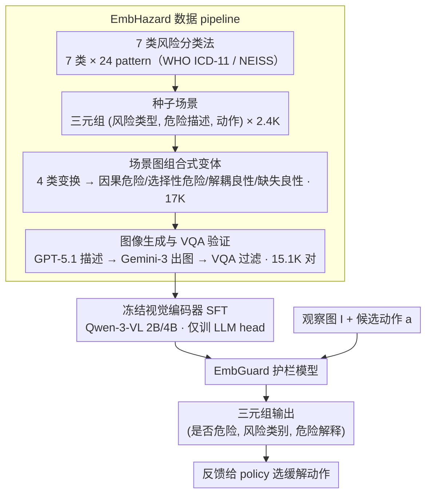

# EMBGuard: Constructing Hazard-Aware Guardrails for Safe Planning in Embodied Agents

**会议**: ICML 2026  
**arXiv**: [2605.30924](https://arxiv.org/abs/2605.30924)  
**代码**: 论文承诺公开（code/data/models）  
**领域**: 具身智能 / AI 安全 / 多模态 VLM  
**关键词**: 具身 agent、安全护栏、动作条件风险、合成数据、MLLM

## 一句话总结
EmbGuard 把"具身 agent 的物理安全判断"从策略里剥离成独立的小模型 guardrail——输入 (观察图, 候选动作)，输出 (是否危险, 风险类别, 危险解释)；2B/4B 规模就追平 GPT-5.1/Gemini-2.5-Pro，并把 baseline 普遍存在的"动不动就 false positive"问题压下去。

## 研究背景与动机

**领域现状**：MLLM 驱动的具身 agent（PaLM-E、RT、CogAct、GR00T 等）已经能做长 horizon 物理任务，但把安全也丢给同一个 policy 模型来一并搞定。

**现有痛点**：把安全和任务塞进同一个大 policy 出来的结果两边都不讨好：要么只盯 task 忘了风险（漏报）、要么过度保守一点点危险就摆烂（误报）。IS-Bench 的数据显示像 Gemini-2.5-Pro 这样的强模型有 83.3% 的良性场景被它判成危险。

**核心矛盾**：(i) 物理风险不来自"环境本身"也不来自"动作本身"，而来自二者的**交互**——盆栽放在插座上方并不危险，"给盆栽浇水"才危险；(ii) 但 MLLM 的视觉先验偏爱感知显著的火/电/锐器，对挤压/污染/化学这类需要因果或时序推理的风险系统性漏报；(iii) 把安全推理 dump 给越来越大的策略模型不仅贵、延迟也撑不住实时控制。

**本文目标**：(1) 把安全推理从 policy 解耦成一个独立 guardrail 模块；(2) 让它对"动作条件的物理风险"做细粒度判定（是/否 + 类别 + 自然语言解释）；(3) 既保住精度也压住误报，且小到可以实时部署。

**切入角度**：作者把任务建模成对 (image $I$, action $a$) 输出 (risk binary $r_{\text{bin}}$, risk type $r_{\text{type}}$, hazard description $h$) 的函数 $\mathcal{R}:(I,a)\to(r_{\text{bin}},r_{\text{type}},h)$；同时手工 + GPT-5.1 + Gemini 3 Image 三段式合成大规模 (图像, 动作) 配对数据，让小模型靠数据多样性而非参数堆叠学到"动作触发风险"的因果直觉。

**核心 idea**：用 scene-graph 做可控的危险结构表示，按 (causal risky / selective risky / decoupled benign / absent benign) 四类做组合式变体扩展，生成 15.1K 训练样本，把 2B/4B Qwen-3-VL 微调成专用 guardrail。

## 方法详解

### 整体框架
EmbGuard 由 (i) 一个数据生成 pipeline、(ii) 一个 SFT 阶段、(iii) 一个推理期 guardrail 三件套组成：

1. **数据 pipeline**：风险驱动场景生成 → 组合式变体多样化 → 图像生成与 VQA 验证，产出 EmbHazard (15.1K (image, action) 对 / 8.7K 图像) 训练集 + EmbGuardTest (329 真实场景手工标注) 测试集。
2. **训练**：在 EmbHazard 上 SFT Qwen-3-VL-2B/4B，4 epoch，lr=1e-5，8×A6000；vision encoder 冻结。
3. **推理**：把 guardrail 串在具身 agent 的 plan 循环里，每步用 (观察, 候选动作) 查 EmbGuard，输出 (safe/unsafe, risk_type, hazard_description) 反馈给 policy。

### 关键设计

**1. 风险解耦的任务公式 + 7 类风险分类法：把"安全 vs 任务"明确拆开，并约束三种粒度同时输出**

把安全 dump 给 policy 之所以两头不讨好，是因为它没把"要不要拦 / 拦什么 / 为什么拦"分清楚。EmbGuard 直接定义函数 $\mathcal{R}:(I,a)\to(r_{\text{bin}}\in\{0,1\},\ r_{\text{type}},\ h)$，其中风险类别 $r_{\text{type}}$ 限定 7 类（Fire / Electrical / Slip-Trip-Fall / Cut-Sharp / Crush-Pinch / Contamination / Chemical-Toxic Exposure），按 WHO ICD-11 + CPSC NEISS 事故库取，每类再细化成 24 个 risk-inducing pattern；危险解释 $h$ 用自由文本而非闭集标签，方便迁移到没见过的物体组合。评估也分三层 Potential Risk Acc → Risk Type Acc → Hazard Acc，且后两者条件在 $r_{\text{bin}}$ 判对的样本上算，避免"猜对但理由错"被算成功。

这种分层直接对应"先回答要不要拦 → 拦什么 → 为什么拦"，policy 拿到 partial 信息也能 fallback。后续实验印证三层都必要：完整 (risk_type + hazard) 正确时 mitigation 对齐率 90.4%，全错时跌到 28.4%。

**2. 基于 scene graph 的组合式变体生成：在结构层做反事实配对，教模型区分"动作触发风险"而非"看见火就喊危险"**

物理风险来自环境和动作的交互——盆栽放在插座上方不危险，"给盆栽浇水"才危险。要教会这点，关键是造出反事实配对。EmbGuard 把每个 hazard 表成场景图的子图（如 (power_strip, beneath, plant_pot)），然后在图上做四种变换覆盖四象限：scene augmentation 加无关物体保持原 hazard、hazard addition 引入新 hazard 形成 Selective Risky、action modification 改动作切断交互得 Decoupled Benign、hazard removal 删掉 hazard 得 Absent Benign。把 2.4K 种子场景跑完这四种变换得到约 17K 增广场景。

在图层而非文本层操作是要害——直接改 prompt 文字容易无意破坏关键空间关系、又难以验证。"hazard 存在但动作安全"（Decoupled Benign）和"hazard 不存在动作就安全"（Absent Benign）这两组反事实，正是削平 baseline 那种 over-conservative bias 的核心监督信号。

**3. 图像生成 + VQA 验证闭环：把场景图渲成保真图，再剔掉关键关系丢失的样本**

护栏的输入是真实图像而非文本，所以每个场景图变体都要落地成照片级图像。pipeline 先用 GPT-5.1 把场景图变体转成一段文本场景描述（保留布局和物体关系），再喂 gemini-3-pro-image-preview 出图。但生成模型不保证把"插座在盆栽下方"这种关键空间关系画对——画错了，上一步辛苦构造的反事实监督信号就失效了。于是再加一道 VQA 过滤：从 hazard 子图 $\mathcal{H}$ 的每条边自动生成验证问题（如"插座是否在盆栽下方"），用 GPT-5.1 检查生成图是否保住了这些关键关系，没保住的直接丢弃。

这道"生成→验证"闭环是反事实数据真正能用的前提：少了 VQA 过滤，组合式变体在图上就只是名义上的反事实。最终留下 15.1K (图像, 动作) 对、8.7K 图像（7.8K risky / 7.3K benign），三段式 pipeline 工业可复用。

**4. 冻结视觉编码器的 SFT 配方：让小模型只把容量用在风险因果上，不去重学视觉**

在 EmbHazard 上 SFT Qwen-3-VL-2B/4B（LLaMA-Factory，lr=1e-5，4 epoch，8×A6000），关键 trick 是**冻结 vision encoder**。这是从消融里反推出来的反直觉发现：解冻 ViT 后 risk binary 检测确实涨了，但 hazard 解释质量塌方——小模型容量不够同时迁移视觉和推理两个方向。把视觉能力当成"借来的现成感知器"、只让 LLM head 学风险因果，是小模型多任务避免互相挤占的可复用策略。

### 损失函数 / 训练策略
标准多任务 SFT，目标是同一个生成式 loss（输出 JSON 三元组），无额外辅助损失；evaluator 用 GPT-4o-as-judge 评 hazard 描述自由文本（与人工 $\kappa=0.90$）。

## 实验关键数据

### 主实验
EmbGuardTest（329 真实样本）+ Held-out（563 合成）上对比 11 个开源 MLLM、4 个闭源 MLLM、EmbGuard-2B/4B。指标全部 = (Potential Risk Acc / Risk Type Acc / Hazard Acc)。

| 模型 | 规模 | EmbGuardTest | Held-out | 备注 |
|------|------|--------------|----------|------|
| Qwen-3-VL-2B（未微调）| 2B | 47.2 / 37.5 / 5.9 | 59.4 / 32.5 / 27.4 | 同尺寸 baseline |
| EmbGuard-2B | 2B | 51.6 / 44.6 / 7.4 | 68.3 / 59.5 / 36.6 | 微调后全面超基底 |
| Qwen-3-VL-4B（未微调）| 4B | 47.3 / 51.0 / 10.5 | 58.3 / 53.5 / 48.6 | 同尺寸 baseline |
| EmbGuard-4B | 4B | 54.3 / 50.3 / 14.6 | 71.2 / 67.6 / 50.1 | 接近 GPT-5.1 |
| GPT-5.1 | 闭源 | 55.8 / 58.1 / 33.4 | 69.1 / 62.0 / 57.0 | 当前最强商用 |
| Gemini-2.5-Pro | 闭源 | 58.4 / 56.8 / 29.3 | 61.4 / 68.3 / 63.8 | recall 极高但误报多 |
| Qwen-3-VL-235B | 235B | 49.5 / 56.4 / 26.7 | 71.3 / 60.0 / 51.2 | 100× 参数 |

推理延迟：EmbGuard-2B 0.535s/sample、EmbGuard-4B 0.719s/sample（单卡 RTX 6000 Ada），可实时插具身循环。

### 消融 / 部署实验

| 实验 | 关键指标 | 说明 |
|------|---------|------|
| 人类 vs MLLM (EmbGuardTest 子集) | Human 85.6 / 90.9 / 63.6 vs GPT-5.1 55.5 / 42.0 / 31.9 | 人类大幅领先，模型有大量 headroom |
| IS-Bench Step Acc / Precision / Recall / F1 | EmbGuard-4B 63.1 / 25.7 / 71.7 / 38.3，Gemini-2.5-Pro 49.9 / 22.2 / 88.2 / 40.7 | Gemini recall 高但 precision 差，EmbGuard step acc 最高 |
| Mitigation 对齐率（policy 拿 guardrail 输出选缓解动作）| 两层都对 90.4% → risk type 错 78.5% → hazard 错 58.6% → 都错 28.4% | 验证细粒度 risk + hazard 都正确才能选到对的缓解动作 |
| Over-conservative bias | Gemini-2.5-Pro 把 83.3% benign 误判成 risky；EmbGuard 显著更均衡 | 解释为啥 baseline 在 IS-Bench 上 precision 低 |

### 关键发现
- 小模型靠数据多样性追上闭源大模型：2B/4B EmbGuard 三项指标全面超过同尺寸 Qwen/InternVL/Gemma，且与 GPT-5.1/Gemini-2.5-Pro 在 EmbGuardTest 上同一档（Potential Risk 差 1–4 个点，Risk Type 持平）。
- baseline 模型对火/电/锐器这种**感知显著**的风险过度敏感，对挤压/污染/化学这种需要因果推理的风险系统性漏报；EmbGuard 通过 7 类均衡训练数据 + 反事实变体把这种 bias 削平。
- IS-Bench 上发现单纯堆 recall 没用：Gemini-2.5-Pro recall 88.2% 但 step accuracy 只有 49.9%，因为它把太多 safe step 也判 unsafe，导致 policy 被无意义打断；EmbGuard 选择性更准。
- 即使是闭源最强 MLLM，Hazard Acc 也只有 33.4%（EmbGuardTest），Human 是 63.6%，说明"为什么危险"这种因果解释远未饱和，留给后续工作大量空间。

## 亮点与洞察
- "把安全从 policy 解耦成 guardrail"这一架构选择是核心 thesis，对应到 LLM 安全里的 LlamaGuard/ShieldAgent 思路第一次系统化迁移到具身物理安全，定义了 guardrail 这一新组件类别。
- 用 scene graph 在结构层做反事实变体是数据生成的关键 trick——直接在文本层改 prompt 会随机破坏关键空间关系，VQA filter 又把生成失败的图剔除，三段式 pipeline 工业可复用。
- 冻结 vision encoder 的"反直觉"发现（解冻反而让小模型解释能力崩）值得任何在小 VLM 上做多任务 SFT 的工作借鉴。
- Figure 8 的 mitigation alignment 实验把 guardrail 价值闭环了：单纯报"危险"没用，必须报对 risk type + hazard 才能让 policy 选到正确缓解动作，这套层次化输出设计被实证为必要而非过度工程。

## 局限与展望
- **视觉传感器覆盖假设**：guardrail 默认观察图已经包含所有危险信息，真实机器人 FOV/遮挡/噪声下漏掉的视觉外危险（如视野外的明火灶）无法检测。
- **不适用连续控制 policy**：当前 guardrail 接受文本级动作描述，VLA 这类输出连续关节扭矩的模型不能直接接入，作者把"low-level 控制下的安全推理"列为 future work。
- 真实 robot 上未做物理验证，全部评测在 OmniGibson/IS-Bench 仿真和静态图上。
- 7 类风险分类法虽来自 ICD-11/NEISS，但仍可能漏掉特定场景特有风险（如工厂化工组合反应、医疗交叉污染场景）。
- 数据 pipeline 重度依赖 GPT-5.1 / Gemini 3 Image，复现成本高且未来 API 漂移会影响数据可重现性。

## 相关工作与启发
- **vs IS-Bench (2025)**：IS-Bench 提供仿真环境评估 agent 是否会做安全规划，但没出 guardrail 模型；EmbGuard 正好是 IS-Bench 期待的"主动避险机制"实现侧，二者互补。
- **vs LlamaGuard / SafeWatch / ShieldAgent**：这些都是 LLM 文本/视频/数字 agent 上的 guardrail，EmbGuard 第一次把同一架构思想搬到物理具身领域，新增"动作条件 + 视觉 hazard"维度。
- **vs Sermanet et al. (2025)**：他们在概念上讨论 embodied guardrail，EmbGuard 把概念落地成可训练模型 + 公开数据集 + 部署实验。
- **vs 安全感知 planning（Khan 2025 等）**：那一脉是改 planner 让它 risk-aware，EmbGuard 则是"换个分工"——planner 别动，外挂 guardrail；架构上更模块化，给不同 policy 用同一 guardrail 提供可能。

## 评分
- 新颖性: ⭐⭐⭐⭐ 第一个 embodied 物理安全 guardrail，task formulation + 数据 pipeline 都是新设计；不过 guardrail 范式本身来自 LLM 安全。
- 实验充分度: ⭐⭐⭐⭐ 11+4 个 baseline、EmbGuardTest+Held-out+IS-Bench 三套评测、mitigation alignment 闭环、人类对照齐全，扣分在缺真机验证。
- 写作质量: ⭐⭐⭐⭐ 四象限场景定义 + 三层指标 + 图 8 的因果传递实验讲得很顺，技术报告范本级。
- 价值: ⭐⭐⭐⭐⭐ 数据集（15.1K 训练 + 329 真实测试）+ 2B/4B 公开模型 + 即用 guardrail，对具身安全社区是立即可用的基础设施。

<!-- RELATED:START -->

## 相关论文

- [\[ICLR 2026\] REI-Bench: Can Embodied Agents Understand Vague Human Instructions in Task Planning?](../../ICLR2026/robotics/rei-bench_can_embodied_agents_understand_vague_human_instructions_in_task_planni.md)
- [\[ICML 2026\] Drift is a Sampling Error: SNR-Aware Power Distributions for Long-Horizon Robotic Planning](drift_is_a_sampling_error_snr-aware_power_distributions_for_long-horizon_robotic.md)
- [\[ICML 2026\] Embodied Task Planning via Graph-Informed Action Generation with Large Language Models](embodied_task_planning_via_graph-informed_action_generation_with_large_language_.md)
- [\[ICLR 2026\] OmniEVA: Embodied Versatile Planner via Task-Adaptive 3D-Grounded and Embodiment-aware Reasoning](../../ICLR2026/robotics/omnieva_embodied_versatile_planner_via_task-adaptive_3d-grounded_and_embodiment-.md)
- [\[CVPR 2026\] RoboAgent: Chaining Basic Capabilities for Embodied Task Planning](../../CVPR2026/robotics/roboagent_chaining_basic_capabilities_for_embodied_task_planning.md)

<!-- RELATED:END -->
