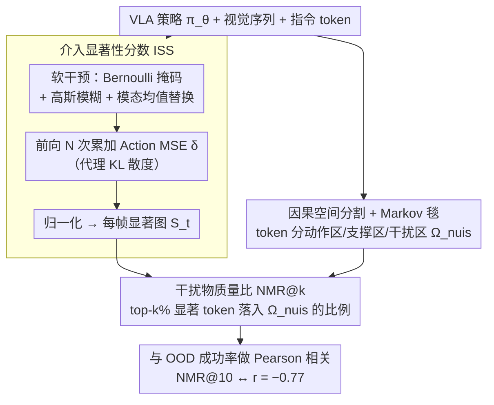

# Embodied Interpretability: Linking Causal Understanding to Generalization in Vision-Language-Action Models

**会议**: ICML 2026  
**arXiv**: [2605.00321](https://arxiv.org/abs/2605.00321)  
**代码**: 无  
**领域**: 具身智能 / VLA 可解释性 / 因果推断  
**关键词**: VLA 模型, 介入显著性, 干扰物质量比, OOD 泛化, Markov 毯

## 一句话总结
本文把「视觉—动作归因」重新表述为干预估计问题，提出 ISS（介入显著性分数）和 NMR（干扰物质量比）两个指标，用 Bernoulli 掩码 + 高斯模糊扰动 + Action MSE 代理 KL 散度的方式量化 VLA 策略到底依赖哪些视觉区域，并证明 NMR 与 OOD 任务成功率呈 $r = -0.77$ 的强负相关——是预测 VLA 泛化能力的便宜诊断工具。

## 研究背景与动机

**领域现状**：Vision-Language-Action（VLA）大模型在抓取、装配等具身任务上越做越强（OpenVLA、$\pi_{0.5}$、CoT-VLA 等），但社区对「模型究竟看了哪、靠什么决策」基本还是黑盒。已有可解释性工具大致分三类：注意力分析、潜在状态线性探针、特征解耦（FFN 投影到 token 空间）。

**现有痛点**：作者实证发现两个反常：(1) 注意力权重大量落在背景上；(2) 把视觉输入整张 mask 掉，动作输出仍然保持类似轨迹。这意味着 VLA 很可能记住了任务到动作的统计映射，而不是学到底层因果机制。注意力 / 探针都只能告诉「哪里出现」而不能告诉「哪里被实际使用」，存在「观察—控制脱节」。

**核心矛盾**：可解释性方法的本质是相关性测度（注意力权重、激活范数都是被动观察），而泛化诊断需要的是因果测度（「如果我把这一块换成基线，动作是否变化？」）。前者无法回答 OOD 失败的根因。

**本文目标**：(1) 提出一个能区分「因果必要」与「伪相关」视觉证据的归因方法；(2) 把这种归因变成一个可以预测 OOD 成功率的标量指标；(3) 给该指标无偏估计的理论保证。

**切入角度**：借鉴 Pearl 的 do-演算和 Markov 毯概念——给定专家策略 $\pi^*$ 和任务空间分割 $\Omega = \Omega_{act} \cup \Omega_{sup} \cup \Omega_{nuis}$，理想策略对 $\Omega_{nuis}$ 应满足条件独立，任何对 $\Omega_{nuis}$ 的依赖都是「因果幻觉」。

**核心 idea**：用「均值 token 替换 + Bernoulli 掩码 + 高斯模糊填充」实现软干预，并用 Action MSE 代理 KL 散度（在各向同性高斯策略假设下二者闭式等价），得到可计算的 ISS 显著图，再用其 top-k 与 $\Omega_{nuis}$ 的交集质量比定义 NMR。

## 方法详解

### 整体框架
输入是一个 VLA 策略 $\pi_\theta$ 和一段视觉序列 $V_{1:T}$ 与指令 token。先做 token 级因果干预产出每帧的 ISS 显著图 $S_t \in \mathbb{R}^{H \times W}$；再按预定义的「动作关键区 / 环境支撑区 / 视觉干扰区」三分割计算 NMR@k，作为模型「因果错位」程度的标量；最后把 NMR@k 与真实 OOD 成功率做 Pearson 相关，验证它能否预测泛化。整个流程是**离线介入协议**，不依赖仿真器执行，避免动力学误差累积。

### 关键设计

**1. 介入显著性分数 ISS：用因果干预而非被动观察量化每个 token 对动作的影响**

注意力和探针的根本问题是它们只是相关性测度——告诉你"哪里出现"而非"哪里被实际用到"。ISS 直接做干预：把 token $i$ 替换成它模态条件下的均值嵌入 $\boldsymbol{\mu}_i$（视觉/语言分别取 $\mathcal{D}_{vis}$、$\mathcal{D}_{text}$ 上的均值）构造反事实输入 $\tilde{X}^{(i)}_t$，再量化动作分布的变化 $\text{ISS}_i=\sum_t D_{KL}(\pi_\theta(\cdot | X_t) \| \pi_\theta(\cdot | \tilde X^{(i)}_t))$。在 VLA 常用的各向同性高斯策略下，Fisher 信息矩阵退化为标量恒等，KL 散度与动作均值的平方差闭式等价，所以实现里直接用 Action MSE 当代理（附录给出闭式推导）。

具体计算走 Monte Carlo：抽 $N$ 个 Bernoulli 掩码 $m_k \sim \text{Bernoulli}(p)$，被 mask 的区域换成高斯模糊版 $V_t^{blur}$，把每次扰动后的动作差 $\delta_k = \|\hat a_{t,k} - a^*_t\|^2$ 按 $(1 - m_k)$ 累加进显著图，再除以 $N(1-p)$ 归一化。两个实现细节是有讲究的：用模态均值替换而非 zero-ablation，是因为涂零会把 token 推到 OOD 区域引入伪影，均值替换能保证序列仍在合法语义子空间内；用模糊而非整张涂黑，则能保留低频结构、只突出高频信息的缺失。

**2. 因果空间分割 + Markov 毯：把"因果错位"从模糊概念变成可量化的几何对象**

要判断策略是否在偷偷依赖伪相关，先得有一个"什么才算伪相关"的明确标准。作者借 Pearl 的 Markov 毯把 token 空间 $\Omega$ 显式三分：动作关键区 $\Omega_{act}$（机械臂、末端执行器）、环境支撑区 $\Omega_{sup}$（待操作物体、支撑桌面）、视觉干扰区 $\Omega_{nuis}$（墙面、阴影、纹理），并证明 $\mathcal{M}(a) = \Omega_{act} \cup \Omega_{sup}$ 正是动作变量的因果 Markov 毯——理想策略对 $\Omega_{nuis}$ 应条件独立。

这个分割刻意发生在 token 空间而非像素空间：像素层面一个光照变化会牵动所有像素、纠缠无法拆分，而 token 已经具备语义抽象，能干净地归类。一旦有了这个分割，"因果错位"就有了几何定义——只要 ISS 显著质量泄漏进 $\Omega_{nuis}$，就说明策略在依赖伪相关证据。

**3. 干扰物质量比 NMR@k：把显著图压成一个能预测泛化的标量**

有了 ISS 显著图和三分割掩码，还需要一个标量才能跟成功率做相关分析。NMR@k 取显著图上累积质量前 $k\%$ 的 token 集合 $\mathcal{H}_{ISS}^{(k)}(X)$，算"重要 token 落进干扰物的比例"

$$\rho_{ISS}^{(k)}(\Omega_{nuis}) = \mathbb{E}_X \big[|\mathcal{H}^{(k)} \cap \Omega_{nuis}| / |\mathcal{H}^{(k)}|\big].$$

理想策略应有 NMR@k $\approx 0$。把"显著图 + 分割掩码"压成单一标量后，可解释性指标第一次具备了"预测泛化"的能力——实测 NMR@10 与 OOD 成功率呈 $r=-0.77$ 的强负相关，意味着不跑仿真器、不要标签，就能提前预判某个 VLA 会不会在 OOD 场景翻车。

### 损失函数 / 训练策略
本工作不训练新模型，只在已 fine-tune 好的 $\pi_{0.5}$ 上做离线干预分析；3600 条 seen 任务 episode 用于 SFT，575 条 unseen episode 用于评测。理论上作者还证明：基于 Bernoulli 掩码的 Monte Carlo 估计是连带因果效应（coalitional causal effect）的一致估计；并在附录 A 给出 KL ↔ Action MSE 等价性的闭式推导，是该指标可解释性的关键支撑。

## 实验关键数据

### 主实验

| 评测维度 | 指标 | ISS / NMR | 基线（注意力 / Token Norm） |
|----------|------|-----------|------------------------------|
| NMR@10 vs 任务成功率 | Pearson $r$ | $-0.77$ | 不可用 |
| 噪声鲁棒性 Pareto | (余弦相似 ↑, Action MSE ↓) | (0.995, 0.002)，最优右上角 | 注意力 (0.959, 0.002)、Norm (0.999, 0.011) |
| 保真度 (3 种扰动 Pearson) | 几何 / patch / 纹理 | 0.78 / 0.64 / 0.72 | 注意力 0.64 / 0.49 / 0.56；Norm 0.47 / 0.33 / 0.40 |

### 消融实验

| 配置 | Seen MSE ($\times 10^{-3}$) | Unseen MSE ($\times 10^{-3}$) | 说明 |
|------|------------------|----------------|------|
| $N=100, p=0.3$ | **1.0 ± 0.1** | **6.4 ± 0.2** | 最佳超参组合 |
| $N=50, p=0.3$ | 1.5 ± 0.2 | 9.5 ± 0.5 | 干预次数不足 |
| $N=100, p=0.5$ | 1.2 ± 0.1 | 7.5 ± 0.3 | mask 太多导致语义崩 |
| $N=150, p=0.3$ | 1.2 ± 0.1 | 7.0 ± 0.2 | 边际收益递减 |

### 关键发现
- **NMR@10 几乎线性预测成功率**：在 41 个 RLBench 任务 × 5 个随机种子上扫 5 个 $k$ 值，$k=10$ 时拿到峰值负相关 $r=-0.77$，意味着可以用一个不依赖仿真器、不依赖标签的离线指标提前预判某个 VLA 模型是否会在 OOD 场景翻车。
- **ISS 同时压住相似性和动作偏差**：在 Pareto 图上 ISS 同时位于「显著图最稳 + 动作扰动最小」的右上角，注意力 / Norm 任选其一都被压一头，验证了「因果干预 > 被动相关」这一论点。
- **失败 / 成功轨迹差异显著**：失败 episode 的 ISS 质量集中在背景、纹理、阴影；成功 episode 集中在末端执行器、目标物体——这是定性证据，把「VLA OOD 失败 = 依赖伪相关」从猜想坐实成可视化事实。

## 亮点与洞察
- **把可解释性从相关性升级到因果性**：注意力 / Norm 是「策略看了哪」，ISS 是「策略真的用了哪」。这一区分对 VLA 类大模型的诊断有方法论上的重要意义。
- **离线协议设计漂亮**：teacher forcing 条件下做单步干预，避免轨迹分叉带来的复合误差，理论上有「KL = 平方动作差」闭式等价加持，工程上又便宜，是一个典型的「理论可落地」案例。
- **NMR 作为部署前筛选器**：可以想象一个用法——多个 VLA 候选模型上线前都跑一遍 NMR@10，按指标从低到高排序，把预算花在最可能成功的候选上，避免大量真机回归测试。

## 局限与展望
- 三分割 $\Omega_{act} / \Omega_{sup} / \Omega_{nuis}$ 依赖人工或半自动标注；当任务空间复杂（如野外操作）时分割标准会模糊，指标稳定性需要重新验证。
- 只在 $\pi_{0.5}$ 单一模型 + AGNOSTOS 单一基准上做了完整评测，跨模型 / 跨 benchmark 的普适性需要后续工作验证。
- KL ↔ Action MSE 等价性建立在「各向同性高斯策略 + 固定方差」假设上，对扩散策略、Flow Matching 等非高斯策略不直接适用。
- ISS 计算需要 $N=100$ 次前向，对实时部署（每步 ms 级）压力较大；论文未给出 token 级近似或缓存方案。

## 相关工作与启发
- **vs CoT-VLA / PhysiAgent**：他们做的是系统级透明性（生成可读理由链），本文做的是 token 级因果归因，两者互补而非竞争。
- **vs Robotic Steering（Mitra et al.）**：那篇用 attention head 做行为修正，但没量化哪些 head 是因果必要；ISS 可以直接给「因果重要 head / token」排序。
- **vs RISE / Grad-CAM 类视觉显著性**：思想类似（Bernoulli mask + 预测差），但本文把对象换成动作分布而非分类 logits，并且加上 Markov 毯分割形成可预测 OOD 的标量指标。
- **vs Linear Probe**：探针只能证明「信息存在」，不能证明「信息被用」——本文是对探针类工作的因果性升级。

## 评分
- 新颖性: ⭐⭐⭐⭐ 把 do-演算干预严格搬进 VLA 可解释性，定义清晰的 ISS / NMR 标量是首次。
- 实验充分度: ⭐⭐⭐ 单模型单基准上做得很扎实，但跨模型 / 跨任务覆盖度有限。
- 写作质量: ⭐⭐⭐⭐ 理论与实证交织清楚，Markov 毯叙事干净易懂。
- 价值: ⭐⭐⭐⭐ 给具身大模型部署提供了一个真正可计算、可预测泛化的诊断工具。

<!-- RELATED:START -->

## 相关论文

- [\[ICML 2026\] Contrastive Representation Regularization for Vision-Language-Action Models](contrastive_representation_regularization_for_vision-language-action_models.md)
- [\[ICML 2026\] LangForce: Bayesian Decomposition of Vision-Language-Action Models via Latent Action Queries](langforce_bayesian_decomposition_of_vision_language_action_models_via_latent_act.md)
- [\[ICML 2026\] Embodied Task Planning via Graph-Informed Action Generation with Large Language Models](embodied_task_planning_via_graph-informed_action_generation_with_large_language_.md)
- [\[ICML 2026\] StableVLA: Towards Robust Vision-Language-Action Models without Extra Data](stablevla_towards_robust_vision-language-action_models_without_extra_data.md)
- [\[ICML 2026\] SpecPrune-VLA: Accelerating Vision-Language-Action Models via Action-Aware Self-Speculative Pruning](specprune-vla_accelerating_vision-language-action_models_via_action-aware_self-s.md)

<!-- RELATED:END -->
