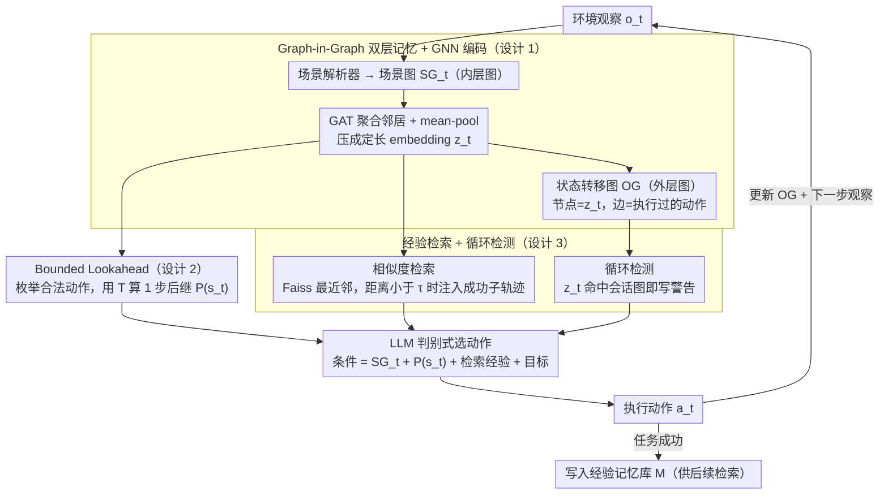

# Embodied Task Planning via Graph-Informed Action Generation with Large Language Models

**会议**: ICML 2026  
**arXiv**: [2601.21841](https://arxiv.org/abs/2601.21841)  
**代码**: 待确认  
**领域**: 具身智能 / LLM Agent / 任务规划  
**关键词**: 具身规划、图记忆、GNN 编码、Bounded Lookahead、经验检索

## 一句话总结
GiG 用"图中图"双层记忆（场景图 + 状态转移图）+ GNN 编码 + 1 步 lookahead 武装 LLM 规划器，让具身 agent 在 Robotouille 同步/异步以及 ALFWorld 上的 Pass@1 比 ReCAP 提高 6–37 个百分点。

## 研究背景与动机

**领域现状**：当 LLM 被用作具身 agent 的"大脑"时，主流做法是 ReAct/Reflexion 这类 action-observation 交错生成，或 ReCAP 这类用上下文树做层次化分解+回溯。

**现有痛点**：纯文本交错把所有历史塞回 prompt，长 horizon 下会 *context drift*——窗口被冲掉后高层目标丢失，agent 开始原地打转或动作矛盾；而 ReCAP 的上下文树把并行可做的子任务硬串成序列，"煮汤"在等水开时，"摆碗"这种同辈子任务被树结构 block 住，agent 只能干等。

**核心矛盾**：长 horizon planning 需要同时满足三件互相冲突的事——(i) 高层意图持久可见、(ii) 同辈/并行子任务可自由穿插、(iii) 状态表示要紧凑可检索。线性历史满足不了 (i)+(iii)，树满足不了 (ii)。

**本文目标**：把 agent 的工作记忆换成一种结构化容器，既能压缩观察、又能表达并行依赖、还能按结构相似度检索过去成功经验。

**切入角度**：作者注意到具身场景天然就是图（物体-关系），而行动序列天然是另一层图（状态-转移）。把场景图嵌套进状态转移图，就同时拿到了空间结构与时间动力学。

**核心 idea**：用 GNN 把每一步场景图压成 embedding 节点，节点之间用真实执行过的 action 当作边，组成 episodic 记忆图；新决策时按 embedding 相似度从记忆库里取过去成功轨迹做 in-context demo，并叠加 1-step 转移仿真做"先看再选"。

## 方法详解

### 整体框架
GiG 的运行单位是 (观察 → 解析 → 编码 → 检索 → 选动作) 五步循环。每一步 t 的输入是环境观察 $o_t$，输出是动作 $a_t$。中间维护两层图：

- **内层场景图** $SG_t=(V_t,E_t)$：节点是实体（物品/机器人），边是空间关系（"cheese1 on-top-of table1"），由确定性解析器或 LLM 解析器从原始观察构建。
- **外层状态转移图** $OG$：节点是 GNN 把 $SG_t$ 压成的固定长度 embedding $z_t$，边是 agent 实际执行过的 $a_t$，组成 $z_1 \xrightarrow{a_1} z_2 \xrightarrow{a_2} \cdots$ 这样的链。

记忆库 $M=\{E_j\}$ 存的是若干条历史成功 trajectory（每条是一个 OG + 目标 $G_j$）。新一步时用当前 $z_t$ 查 $M$，命中相似过去状态就把后续 action 作为软提示喂回 LLM；同时 BL 模块枚举合法动作的 1 步后继、循环检测比对会话内已访问状态，三路上下文一起拼进 prompt，让 LLM 在显式信息上做判别式选择。

### 关键设计

**1. Graph-in-Graph 双层记忆 + GNN 编码：把观察压成结构感知 embedding，再把整段轨迹组织成可检索的图**

线性历史满足不了"高层意图持久可见 + 紧凑可检索"，树又满足不了"并行子任务自由穿插"。GiG 的破解是嵌套两层图：内层场景图节点初始特征用轻量句编码器初始化，经多层 GAT 聚合邻居 $h_u^{(l)}=\sigma\big(\sum_{v\in N(u)}\alpha_{u,v}W^{(l)}h_v^{(l-1)}\big)$，最后 mean-pool + BatchNorm 压成定长 embedding $z_t$；外层状态转移图则以 $z_t$ 为节点、实际执行过的 action 为边，串成 $z_1 \xrightarrow{a_1} z_2 \xrightarrow{a_2} \cdots$。

训练用 triplet loss + uniformity 正则 $L=L_{triplet}+\lambda L_{uniformity}$，anchor/positive 取自同一轨迹相邻步、negative 跨轨迹采样，背后的假设是"物理状态渐变 → 时间相邻的 embedding 应该更近"。学出来的 embedding intra-trace 距离 <0.1、inter-trace 距离 ~0.8 自然分离，retrieval threshold $\tau=0.1$ 就直接来自这个分布。相比把场景拍平成文本塞 prompt，结构化 embedding 既保留拓扑（"patty 在 bun 上"这种垂直依赖被注意力突出），又把不定长观察压成定长向量，从根上治住 context drift。

**2. Bounded Lookahead（BL）模块：把 LLM 从"想象未来"换成"看着真实后继选"**

LLM 自己脑补后果容易产生违反动力学的幻觉动作。在动力学 $T$ 已知时（Robotouille 用 PDDL 描述），BL 枚举当前合法动作集 $A(s_t)$，逐个调用 $T$ 算出后继，得到投影集合 $P(s_t)=\{(a,s')\mid a\in A(s_t),\ s'=T(s_t,a)\}$，再把它和当前场景图、检索经验、目标一起拼进 prompt，让 LLM 在显式后继上做判别式选择 $a_{t+1}\sim \text{LLM}(\text{Prompt}\mid SG_t,P(s_t),R_{z_t},G)$。ALFWorld 这种部分可观察、拿不到 $T$ 的环境就退化为 $P(s_t)=\emptyset$，框架自动 fallback 到纯图+经验。

这一招把"信不信 LLM 脑补"的风险转嫁给真动力学，而且只暴露 1 步后继、不展开完整搜索树——因为 $A(s)$ 在任务规划里通常是个小有限集，全枚举一步成本可控，延迟也稳定。本质是把世界模型当判别器用，而不是当搜索器。

**3. 结构相似的经验检索 + 循环检测：用过去成功轨迹做 demo，并在兜圈时主动喊停**

把 50 条 Qwen3-235B 成功轨迹的所有 $(z,a)$ 索引进 Faiss；每一步用 $z_t$ 找最近邻 $(z_k,d)$，若 $d<\tau=0.1$ 就取该状态后的子轨迹（实际只用紧接的下一个动作）注入 prompt 当 one-shot demonstration。同时单独维护当前 session 的状态转移图，每步把 $z_t$ 和已有节点比，命中即触发 Loop Detection，把环路路径写进 prompt 警告 LLM"你刚刚 stack→unstack→stack 兜了一圈"。

关键在于检索用的是局部场景结构相似度而非任务文本，所以能跨任务迁移——做"三明治"时学到的"切→拿→放"动作链可以被"做汉堡"复用，由 LLM 当语义过滤器决定是否采纳。这也是为什么经验记忆能当成 model-agnostic 插件：大模型采集的轨迹直接喂给小模型推理就能涨点。

### 损失函数 / 训练策略
只有 GNN 需要训练，LLM 完全冻结。GNN 损失 $L=L_{triplet}+\lambda L_{uniformity}$，triplet margin $\gamma=1.0$，uniformity 项是所有 pair 余弦相似度平方的均值，防止 embedding 坍缩到单一方向。所有评测温度设 0、单次生成上限 4096 token、统一 Pass@1 协议（一次执行不重试不集成）。

## 实验关键数据

### 主实验
在三个具身规划 benchmark 上测，每个 LLM 后端都对比 GiG / GiG+Exp / ReCAP / ReAct / CoT。

| 数据集 | 后端 | GiG | GiG+Exp | 之前最佳 | 提升 |
|--------|------|-----|---------|----------|------|
| Robotouille Sync | Qwen3-235B | 93 | 97 | 74 (ReAct) | +19 / +23 |
| Robotouille Sync | DeepSeek-R1 | 91 | 88 | 72 (ReCAP) | +19 |
| Robotouille Async | Qwen3-235B | 72 | 82 | 35 (ReCAP) | +37 / +47 |
| Robotouille Async | DeepSeek-R1 | 59 | 86 | 27 (ReCAP) | +32 / +59 |
| ALFWorld | Qwen3-235B | 97 | – | 91 (ExpeL) | +6 |
| ALFWorld | DeepSeek-R1 | 97 | – | 82 (ReCAP) | +15 |

异步任务因需要并发管理，提升幅度最大；ALFWorld 因物品位置随机化，作者主动关掉经验记忆，只靠双层图聚合也拿到 97%。

### 消融实验

| 配置 | Robotouille Sync (Qwen3-30B) | 说明 |
|------|------------------------------|------|
| ReCAP baseline | 19 | 树式上下文 + 回溯 |
| ReAct baseline | 28 | action-observation 交错 |
| GiG（无 Exp）| 27 | 仅双层图 + BL，已超过 ReCAP |
| GiG + Exp | 42 | 加经验记忆 +15 个绝对点 |
| GiG + Exp (Gemini-Flash-Lite) | 26 | 同样配置下小模型 +7 |

### 关键发现
- 经验记忆作为 model-agnostic plug-in 效果最显著：用 Qwen3-235B 收集的轨迹直接喂给 Qwen3-30B/Gemini-Flash-Lite 推理，无需任何微调就拿到 +7~+15 的绝对提升。
- GiG 在难任务上"成功步数比 baseline 多"看似矛盾，实则因为 baseline 在这些任务直接失败；把失败 trial 也算进去后 GiG 平均步数反而更低，说明它是"宁可多走几步也要完成"的稳健 trade-off。
- intra-trace 距离 <0.1 vs inter-trace ~0.8 的分离度（图 3）直接证明 GAT+triplet 学到的 embedding 既能区分不同轨迹又能识别相邻状态，这是把 $\tau=0.1$ 当成阈值能 work 的底层依据。

## 亮点与洞察
- 把"图作为记忆容器"做到双层是真正的差异点：内层吃观察解决"压缩"，外层吃 action 解决"并发"，比纯图 RAG（PoG/HiRAG）多了时间维度，又比 ReCAP 的树多了并行表达力。
- BL 模块的设计哲学很值得借鉴："不要让 LLM 想象后果，让它在真后果上选"——只暴露 1 步后继而非完整搜索树，把世界模型当判别器而不是搜索器，延迟可控而错误幅度大幅下降。
- 经验记忆是 model-agnostic plug-in 这一点对工业部署最有价值：大模型采集 + 小模型推理这一范式可以直接复用到任何具身 LLM agent，无需重训。

## 局限与展望
- 场景解析器目前用 deterministic parser（依赖 PDDL 或环境元数据），换到真实视觉具身环境时需要鲁棒的 VLM 解析器，本文未实证。
- BL 模块要求显式转移函数 $T$，没有 $T$ 时只能退化；学到的 world model 替代尚未验证。
- 经验记忆在 ALFWorld 这种"物品位置随机化"环境下被作者主动关掉，说明结构相似度对"几何重排"敏感，跨布局迁移能力存疑。
- 50 条轨迹的初始记忆库规模偏小，未讨论记忆膨胀到上千条后检索质量/延迟如何变化。

## 相关工作与启发
- **vs ReCAP (2025b)**：都用结构化记忆，但 ReCAP 用树做递归分解 + 回溯，GiG 用图做并行调度 + 经验复用；ReCAP 在 sync 任务接近 GiG，但 async 任务被 GiG 甩开 30+ 点，正好印证"树压不住并发"。
- **vs ReAct / Reflexion**：纯 action-observation 交错把所有上下文留在 prompt，long horizon 必然 drift；GiG 把上下文压成图节点，prompt 永远短。
- **vs ExpeL**：ExpeL 蒸馏文本 insight 做检索，对 ALFWorld 随机布局水土不服；GiG 用图结构相似度跨布局仍然 work（不过自己也承认 ALFWorld 上不用 Exp 更稳）。
- **vs GraphRAG / PoG / HiRAG**：它们做的是静态 KG 上的 QA 检索，GiG 把图 RAG 思想搬到 embodied dynamic 场景，且 KG 是动态生长的。

## 评分
- 新颖性: ⭐⭐⭐⭐ Graph-in-Graph 是一个干净的抽象，把场景结构 + 动力学统一进一个可检索容器，独立创新点。
- 实验充分度: ⭐⭐⭐⭐ 三个 benchmark × 5 个 LLM × 4 个 baseline，小模型 plug-in 也跑了，但缺少真实视觉具身环境验证。
- 写作质量: ⭐⭐⭐⭐ 算法 1 + 图 2 把整套 pipeline 讲得很清楚，公式记号一致。
- 价值: ⭐⭐⭐⭐ Pass@1 提升幅度可观，model-agnostic 记忆插件对部署友好，结构化记忆这条线值得跟踪。

<!-- RELATED:START -->

## 相关论文

- [\[ICML 2026\] Embodied Interpretability: Linking Causal Understanding to Generalization in Vision-Language-Action Models](embodied_interpretability_linking_causal_understanding_to_generalization_in_visi.md)
- [\[CVPR 2026\] RoboAgent: Chaining Basic Capabilities for Embodied Task Planning](../../CVPR2026/robotics/roboagent_chaining_basic_capabilities_for_embodied_task_planning.md)
- [\[NeurIPS 2025\] ESCA: Contextualizing Embodied Agents via Scene-Graph Generation](../../NeurIPS2025/robotics/esca_contextualizing_embodied_agents_via_scene-graph_generation.md)
- [\[ICML 2026\] Contrastive Representation Regularization for Vision-Language-Action Models](contrastive_representation_regularization_for_vision-language-action_models.md)
- [\[ICML 2026\] LangForce: Bayesian Decomposition of Vision-Language-Action Models via Latent Action Queries](langforce_bayesian_decomposition_of_vision_language_action_models_via_latent_act.md)

<!-- RELATED:END -->
