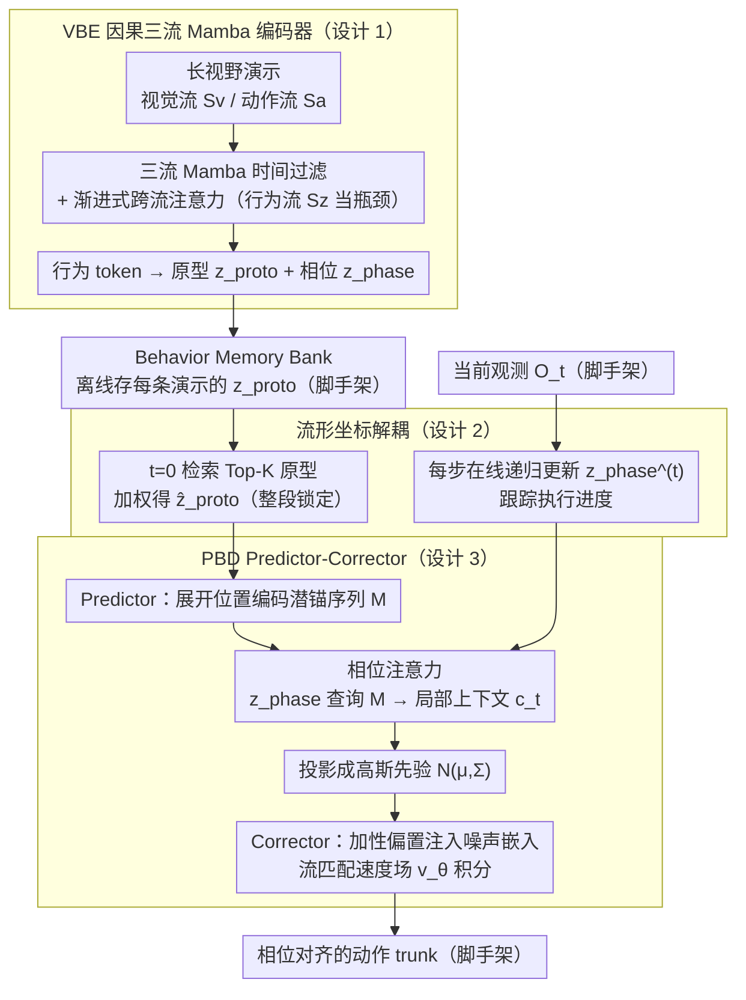

# From Abstraction to Instantiation: Learning Behavioral Representation for Vision-Language-Action Model

**会议**: ICML 2026  
**arXiv**: [2605.22671](https://arxiv.org/abs/2605.22671)  
**代码**: [BehaviorVLA.github.io](https://BehaviorVLA.github.io)  
**领域**: 机器人 / 具身智能 / VLA  
**关键词**: VLA、行为表示、Mamba、流匹配、Sim-to-Real

## 一句话总结
BehaviorVLA 用因果三流 Mamba 编码器 (VBE) 把长视野演示压缩成时间不变的"行为原型 $z_{\text{proto}}$"+ 时间变化的"相位状态 $z_{\text{phase}}$"，再用相位条件解码器 (PBD) 以 Predictor-Corrector 方式把行为骨架展开成相位对齐的高斯先验去引导流匹配策略，在 LIBERO/RoboTwin 2.0/CALVIN 三套基准刷新 SOTA，并且只用 50% 真机数据就追平 OpenVLA-OFT。

## 研究背景与动机

**领域现状**：VLA 模型（OpenVLA、$\pi_0$、$\pi_{0.5}$、UniVLA 等）把视觉-语言主干直接映射到动作序列，靠大规模仿真数据撑起通用操控能力。

**现有痛点**：分布漂移下性能崩塌——光照、物体材质、相机视角一变就翻车。Sim-to-Real 通常要靠大量真机微调来兜底，代价高且难扩展。已有的"潜变量动作空间"路线（BeT、VQ-BeT、ACT）也只能缓解局部平滑性，但有两个根本问题：(i) **短视野时间碎片化**——把轨迹切成独立 chunk/离散码本，丢了长程依赖；(ii) **静态执行对齐**——从一个固定潜变量解码动作，不感知当前执行进度，导致动作和实际场景错位。

**核心矛盾**：高维视觉动作轨迹在流形假设下应当集中在低维流形附近，但标准 VLA 直接在环境空间学映射，没有显式的流形约束；想引入流形约束又会牺牲实时反馈和精度。

**本文目标**：同时实现 (1) specific-to-general 的**抽象**——把多样演示蒸馏成统一行为表示；(2) general-to-specific 的**实例化**——把抽象行为投射回精确、对齐当前状态的动作。

**切入角度**：把潜空间显式拆成"时间不变的全局任务拓扑 $z_{\text{proto}}$" + "时间变化的执行进度 $z_{\text{phase}}$"——前者由 episode 开头检索一次就锁定，给整个轨迹一个稳定骨架；后者随每一步观测在线更新，让动作生成始终与物理执行进度同步。

**核心 idea**：用 Mamba 三流架构做"抽象"，用 Predictor-Corrector + 相位注意力把"骨架"展成"动作先验"，再以加性偏置注入流匹配速度场，把全局拓扑稳定性和局部反应控制精度同时拿到。

## 方法详解

### 整体框架
模型在 $\pi_{0.5}$ 主干上加两个模块：(1) **VBE (Visuomotor Behavior Encoder)**：因果三流 (视觉 $S_v$ / 动作 $S_a$ / 行为 $S_z$) 架构，每流用 Mamba 做长视野时间过滤，再跨流注意力融合，把整个轨迹压成 $\{z_{\text{proto}}, z_{\text{phase}}\}$；离线把每条演示的 $z_{\text{proto}}$ 存入 Behavior Memory Bank。(2) **PBD (Phase-conditioned Behavior Decoder)**：检索 Top-K 全局原型加权得 $\hat z_{\text{proto}}$，展开成位置编码的潜锚序列 $\mathbf M$；用 $z_{\text{phase}}^{(t)}$ 做查询做相位注意力得局部上下文 $c_t$，投影成高斯先验 $\mathcal N(\mu_\psi(c_t), \Sigma)$；最后把先验通过加性偏置注入流匹配策略的噪声嵌入，由速度场 $v_\theta$ 积分出最终动作 trunk。整条 pipeline 推理时每个 episode 检索一次原型 + 每步更新一次相位，流匹配负责局部修正。

### 关键设计

**1. VBE 因果三流 Mamba + 渐进式跨流注意力：把长视野的视觉/动作序列压成"行为 token"**

标准帧级编码器丢长程因果，简单 cat 多模态又丢空间结构。VBE 用三条独立的 Mamba 流（视觉 $S_v$ / 动作 $S_a$ / 行为 $S_z$）分别做长视野时间过滤。每条流按 ZOH 离散化得到时变参数 $\bar{\mathbf A}_t = \exp(\bm \Delta_t \mathbf A)$、$\bar{\mathbf B}_t = (\bm \Delta_t \mathbf A)^{-1}(\bar{\mathbf A}_t - \mathbf I)\bm \Delta_t \mathbf B$，其中 $\bm \Delta_t = \text{Softplus}(\text{Linear}(x_t^{(m)}))$ 让步长依赖输入，相当于一个选择性滤波器，自动抑制背景杂讯、保留关键事件；状态递归 $h_t^{(m)} = \bar{\mathbf A}_t h_{t-1}^{(m)} + \bar{\mathbf B}_t \text{LN}(x_t^{(m)})$ 加门控连接。空间维度用渐进式跨流注意力处理：先让视觉流和动作流互相 cross-attn 对齐低层语义，再让行为流以 $[\tilde h^{(v)}_t; \tilde h^{(a)}_t]$ 为 key/value 提取全局任务结构，于是行为流成了信息瓶颈，过滤残余噪声、留下行为拓扑。三流分流加 Mamba 的线性复杂度 $\mathcal O(L)$ 记忆，把时间与空间分开处理，避免一上来就逼 Transformer 在长序列 × 多模态上同时挣扎。

**2. 流形坐标解耦：全局原型检索 + 在线相位状态**

一个潜变量同时承担"任务是什么"（要稳）和"现在做到哪儿"（要灵敏）是矛盾的，BehaviorVLA 干脆把它拆成两个不同时间尺度的变量。全局原型 $z_{\text{proto}}$ 在训练时对每条轨迹的行为 token 做时间均值池化 $z_{\text{proto}} = \tfrac{1}{T} \sum_t \tilde h_t^{(z)}$ 得到、存进 Memory Bank，推理时只在 $t=0$ 用 $q = \text{MLP}(\Phi(O_0, L))$ 检索 Top-K 加权

$$\hat z_{\text{proto}} = \sum_{i \in \mathcal N_K} \text{softmax}(\langle q, k_i\rangle/\kappa) \cdot z_{\text{proto}}^{(i)}$$

整个 episode 锁住不变，给轨迹一个稳定骨架。本地相位 $z_{\text{phase}}^{(t)} = \text{VBE}_{\text{causal}}(z_{\text{phase}}^{(t-1)}, O_t, a_{t-1})$ 每步在线递归更新、跟踪执行进度。把长程任务结构塞进一个固定向量稳住语义不漂移，把当前步进度留给在线状态实时对齐物理执行——这种正交分解正是后面动作生成"既稳又灵敏"的前提。

**3. PBD Predictor-Corrector：相位对齐先验 + 流匹配几何偏置**

标准潜变量解码从一个静态变量出 action，跟不上场景实时变化。PBD 让全局结构和局部精度各司其职。Predictor 端先把 $\hat z_{\text{proto}}$ 用生成器展开成 $H$ 步潜锚 $\mathbf M = \mathcal G_\phi(\hat z_{\text{proto}}) \oplus \mathbf P_{\text{pos}}$（位置编码赋予典范时间几何），再用相位状态做查询 $c_t = \text{Progress-Attn}(Q=z_{\text{phase}}^{(t)}, K=\mathbf M, V=\mathbf M)$ 在锚点上插值，投影成高斯先验 $\mathcal N(\mu_\psi(c_t), \Sigma)$。Corrector 端是条件流匹配，关键一步是把先验通过加性偏置注入噪声嵌入：

$$\tilde e(a_\sigma) = e(a_\sigma) + \lambda \cdot \text{Proj}_\phi(\mu_{\text{prior}})$$

速度场 $v_\theta$ 在这个被偏置过的嵌入上预测 OT 路径速度 $u_\sigma = a_1 - a_0$（训练时用伯努利 dropout mask 替代固定 $\lambda$ 防后验崩塌）。把先验加在嵌入而非动作上，数学上等价于把流匹配的注意力流形朝高概率区域偏移，相当于"软约束"流策略往任务拓扑方向走——既保留了生成式策略处理多模态分布的能力，又强制了全局拓扑一致。

### 损失函数 / 训练策略
**两阶段训练**。Phase 1（行为流形学习）：$\mathcal L_{\text{Stage1}} = \mathcal L_{\text{rec}} + \alpha \mathcal L_{\text{global}} + \beta \mathcal L_{\text{local}}$。其中重建损用 JEPA 思想，同时回归下一步动作和下一步 EMA 视觉编码 $\Phi_{\text{ema}}(O_{t+1})$（stop-gradient）；全局损用监督对比把同行为标签的 $z_{\text{proto}}$ 拉近；局部损用 InfoNCE 把不同时间步的 $z_t$ 区分开防拓扑塌缩。Phase 2（先验引导策略调优）：$\mathcal L_{\text{Stage2}} = \mathcal L_{\text{flow}} + \lambda_{\text{prior}} \mathcal L_{\text{prior}}$，流匹配损是 OT 路径速度的 MSE，先验损是专家动作在预测高斯下的 NLL。

## 实验关键数据

### 主实验
RoboTwin 2.0 Hard 设定（域随机化 + 杂讯，20 任务 / 100 rollouts）平均成功率：

| 方法 | 调瓶 | 大箱倾倒 | 移擀面杖 | 放面包 | 放汉堡 | 放容器 | 平均 |
|------|------|---------|---------|--------|--------|--------|------|
| DP3 | 3% | 2% | 3% | 1% | 18% | 1% | 偏低 |
| RDT | 75% | 43% | 11% | 2% | 27% | 17% | 20.3% |
| $\pi_0$ | 56% | 80% | 22% | 4% | 4% | 45% | ~25% |
| $\pi_{0.5}$ | 75% | 82% | 32% | 28% | 46% | 55% | ~50% |
| **BehaviorVLA** | **83%** | **90%** | **41%** | **36%** | **61%** | **62%** | **58%** |

LIBERO 四套件平均成功率：

| 方法 | Spatial | Object | Goal | Long | 平均 |
|------|---------|--------|------|------|------|
| Diffusion Policy | 78.5 | 87.5 | 73.5 | 64.8 | 76.1 |
| OpenVLA-OFT | 97.6 | 98.4 | 97.9 | 94.5 | 97.1 |
| $\pi_{0.5}$ | 98.8 | 98.2 | 98.0 | 92.4 | 96.9 |
| **BehaviorVLA** | **99.2** | **99.4** | **98.8** | **94.6** | **98.0** |

LIBERO 的 Long 套件提升最显著（+2.2 over $\pi_{0.5}$），印证 VBE 长视野建模 + PBD 相位对齐对"长操控"的特殊价值。

### 消融实验
| 配置 (VBE / PBD) | LIBERO Long | Real-World Gen. | Real-World Long |
|------------------|-------------|------------------|------------------|
| — / —（baseline） | 92.4 | 57.0 | 41.0 |
| ✓ / — | 93.8 | 65.0 | 48.0 |
| — / ✓ | 93.4 | 60.0 | 45.0 |
| ✓ / ✓ (Full) | 94.6 | 70.0 | 55.0 |

真机 Real-World：BehaviorVLA 在 8 个真机任务上平均成功率比强基线高 63%，且只用 50% 演示数据就追平全量微调的 OpenVLA-OFT。

### 关键发现
- 去掉 VBE 真机掉 16%（具体见消融行）——没有抽象端，模型过拟合环境噪声丢失任务不变结构。去掉 PBD 真机掉 9.6%——没有相位对齐，长视野执行时动作和场景错位。
- 引导强度 $\lambda$ 有明显甜点：太小先验起不到结构约束，太大则压制流匹配的局部修正能力。
- 检索原型数 $k$ 在 5 时最佳：太少先验受单条原型偏差影响，太多引入无关原型扰乱结构指引。
- t-SNE 显示三流缺一不可——去视觉流让"擀锅 vs 擦桌"这类动作相似但视觉语义不同的任务塌缩到一起；去动作流让模型只剩静态视觉描述，无法分辨同视觉下不同操控动力学的任务。

## 亮点与洞察
- **把潜空间显式拆成"任务拓扑 + 执行进度"**——一刀切的潜变量做不到"既稳又灵敏"，BehaviorVLA 把矛盾的两个需求分给两个不同时间尺度的变量，是这套架构成立的根。这种"按物理量纲拆潜变量"的思路可以迁移到任何长视野序列决策任务。
- **加性偏置注入流匹配速度场**是个工程上极简的"先验注入"技巧：不改流匹配训练目标，只改噪声嵌入，等价于把流形约束以软偏置形式加进生成过程，比直接条件化或重写损失函数更易调优。
- **真机 50% 数据追平 OpenVLA-OFT** 是这篇论文最有冲击力的实用结论——把数据效率提升直接挂钩到表示学习（VBE 抽象 + 原型检索）而不是更大的模型/更多 demo，给社区给出了"少数据，巧表示"的可行性证据。

## 局限与展望
- 全局原型检索依赖**离线 prototype memory bank 的拓扑覆盖**——遇到与训练分布显著不同的新任务，检索到的骨架可能是"几何上一致但功能上错误"的，PBD 就被误导。需要在线 manifold expansion 机制。
- 流匹配 Predictor-Corrector 要做迭代 ODE 积分，相比纯回归基线推理延迟高，对高频控制（compute-constrained 硬件）是负担；作者提出未来用 consistency distillation 把多步流压成一步。
- 评测主要在桌面双臂操控（GALAXEA R1 Lite）+ 仿真，移动操控、长程任务规划（开门、跨房间）等更复杂场景未覆盖。
- 行为标签依赖人工预定义，监督对比损 $\mathcal L_{\text{global}}$ 需要有"同一行为"的成对标注，标注质量直接影响原型空间几何，弱监督/无监督版本是自然的下一步。

## 相关工作与启发
- **vs $\pi_{0.5}$ / OpenVLA-OFT**: 都是 VLA + 流匹配/扩散策略，但前者只有隐式的视觉-动作映射，没有显式的"行为表示"中间层；BehaviorVLA 在主干上加了一层流形坐标解耦，提升了泛化和数据效率。
- **vs BeT / VQ-BeT / ACT**: 同为"潜动作空间"思路，但这些方法把轨迹切成 chunk 或离散码本，丢长程依赖且解码静态化；BehaviorVLA 用 Mamba 守全局连续性，相位状态实时跟踪，避开了短视野碎片化和静态对齐两个老问题。
- **vs MemoryVLA / RPT / ICRT / MTIL**: 这些工作把历史作为上下文输入直接预测动作，BehaviorVLA 则把历史**显式分解**为检索得到的全局原型 + 在线相位状态，区分了"任务记忆"和"执行进度"两种历史用法，更清晰也更适合长程任务。

## 评分
- 新颖性: ⭐⭐⭐⭐ 三流 Mamba + 相位条件流匹配 + 原型检索这套组合在 VLA 里少见，潜空间显式拆分的思路有原创性。
- 实验充分度: ⭐⭐⭐⭐⭐ 仿真三基准 + 真机 8 任务 + 数据效率消融 + t-SNE 可视化，覆盖面非常完整。
- 写作质量: ⭐⭐⭐⭐ Method 节按"动机—架构—参数化"层层推进，公式编号干净，图表丰富。
- 价值: ⭐⭐⭐⭐⭐ 50% 数据追平 OpenVLA-OFT 给社区指了一条"少数据靠表示"的路，工程意义大。

<!-- RELATED:START -->

## 相关论文

- [\[ICML 2026\] Dual-Stream Diffusion for World-Model Augmented Vision-Language-Action Model](dual-stream_diffusion_for_world-model_augmented_vision-language-action_model.md)
- [\[ICML 2026\] Contrastive Representation Regularization for Vision-Language-Action Models](contrastive_representation_regularization_for_vision-language-action_models.md)
- [\[ICML 2026\] Seeing Realism from Simulation: Efficient Video Transfer for Vision-Language-Action Data Augmentation](seeing_realism_from_simulation_efficient_video_transfer_for_vision-language-acti.md)
- [\[ICLR 2026\] AutoFly: Vision-Language-Action Model for UAV Autonomous Navigation in the Wild](../../ICLR2026/robotics/autofly_vision-language-action_model_for_uav_autonomous_navigation_in_the_wild.md)
- [\[ICML 2026\] Spatial Memory for Out-of-Vision Manipulation in Vision-Language-Action](spatial_memory_for_out-of-vision_manipulation_in_vision-language-action.md)

<!-- RELATED:END -->
