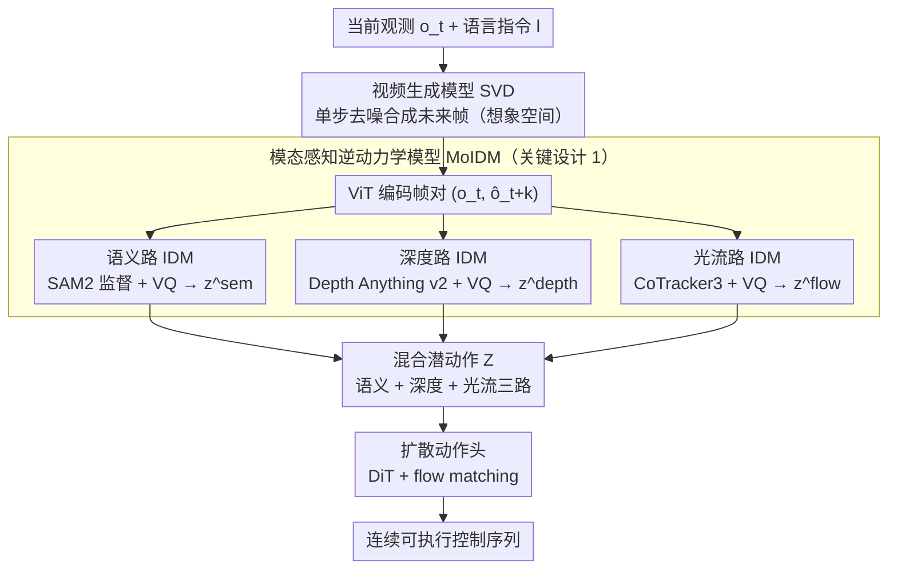

# From Imagined Futures to Executable Actions: Mixture of Latent Actions for Robot Manipulation

**会议**: ICML 2026  
**arXiv**: [2605.12167](https://arxiv.org/abs/2605.12167)  
**代码**: https://logosroboticsgroup.github.io/MoLA (有)  
**领域**: 机器人
**关键词**: 潜动作、逆动力学、视频生成、机器人操控、模态感知

## 一句话总结
MoLA 用一组在大规模机器人数据上预训练好的"模态感知逆动力学模型 (IDM)"，把视频生成模型预测出的未来帧翻译成语义/深度/光流三路离散潜动作，再让策略头基于这些动作中心的表征做控制，从而在 CALVIN、LIBERO、LIBERO-Plus 以及真实 UR5e 上把"想象-执行"接口做得既稳又准。

## 研究背景与动机

**领域现状**：当前机器人操控有两条主流路径。一条是 VLA (RT-1/π0/OpenVLA 这类)，直接从视觉+语言学一个端到端的动作头；另一条是基于想象的策略 (UniPi/VPP/DreamGen 这类)，先用视频生成模型预测未来若干帧，再把这些"想象的未来"喂给策略。视频想象路线天然能预想长时序结果，是个很有吸引力的方向。

**现有痛点**：用想象帧驱动策略有两种朴素做法，都不太好用。第一种把预测帧当成额外视觉条件丢给动作头，等于把"从视觉变化里提取控制信号"这件事全部塞给动作头去学；第二种直接把视频解码成动作，让控制完全依赖视频预测精度，一旦视频长程预测漂移，动作就跟着漂。

**核心矛盾**：视频生成模型的优化目标是"感知逼真"——像素 MSE、感知损失之类——而不是"控制相关"。所以即便预测帧画面逼真，它并没有显式暴露状态之间到底是被什么物理动作驱动的；从图像空间到动作空间这条路天然就是间接的、不稳定的。

**本文目标**：在视频想象和策略执行之间插一层"动作中心的接口"，让策略不在像素空间推理，而在动作空间推理；同时这层接口要能够从生成的（带噪声的）未来帧中可靠地推出动作，并兼容多模态信息。

**切入角度**：作者发现逆动力学模型 (IDM) 天然就是干这事的——它的定义就是"观察到从 $o_t$ 到 $o_{t+k}$ 的视觉变化，推出中间是什么动作"。把 IDM 用在生成的未来帧上，就相当于把视频生成产物再"反向解码"成动作。但单一 IDM 容易把所有信号挤进一个 codebook，作者进一步观察到操控其实依赖语义（任务意图）、深度（3D 结构）、光流（交互动力学）这三种互补线索。

**核心 idea**：用"在大规模机器人数据上预训练的、按模态分工的多路逆动力学模型"，把生成的未来视频统一翻译成一组离散潜动作 (Mixture of Latent Actions)，作为视频想象和策略头之间的接口。

## 方法详解

### 整体框架
给定当前 RGB 观测 $o_t$ 和语言指令 $l$，MoLA 分四步走：(1) 视频生成模型（用 Stable Video Diffusion 当 backbone，推理时单步去噪）合成未来若干帧 $\hat{o}_{t:t+H}$，作为"想象空间"；(2) 三路 IDM（语义/深度/光流）分别对 $(o_t, \hat{o}_{t+k})$ 这一对帧做推断，各自吐出离散潜动作 $z_{t \to t+k}^{(m)}$；(3) 把三路潜动作拼成混合 $\mathcal{Z}$；(4) 一个基于 Diffusion Transformer + flow matching 的动作头吃下潜动作和生成视觉特征，吐出连续可执行控制序列。训练分三阶段：先 fine-tune 视频生成模型、再预训练 MoIDM、最后端到端微调 MoIDM + 动作头（视频生成模型保持冻结）。

> 关键设计 2（大规模预训练 + 联合微调）是 MoIDM 块的训练方式，不单列为数据流节点；关键设计 3 即上图的扩散动作头。

### 关键设计

**1. 模态感知的逆动力学模型（MoIDM）：按语义/深度/光流分工把两帧变化翻译成潜动作**

视频生成模型优化的是"画面逼真"，并不显式暴露状态之间是被什么物理动作驱动的。逆动力学模型（IDM）的定义恰好是"看两帧变化、推中间动作"，正好填这个缺口。但单路 IDM 会把任务语义、几何结构、交互运动全挤进一个 codebook 互相干扰，所以 MoLA 拆成三路，每路有独立的时空 Transformer $T^{(m)}$ 和独立 VQ codebook：先用 ViT 把 $o_t$、$o_{t+k}$ 编码，再让一组可学习的潜动作 query 与两帧特征交互得 $\tilde{h} = T^{(m)}(q^{(m)}, h_t, h_{t+k})$，最后过 VQ 得 $z^{(m)} = \text{VQ}^{(m)}(\tilde{h})$。三路共享 RGB 推断流水线，但用不同的重建监督拉开模态偏置——SAM2 管语义、Depth Anything v2 管深度、CoTracker3 管光流。这样每个 codebook 被显式约束去捕捉"任务意图 / 3D 结构 / 交互动力学"中的一种，互补性最强，消融里把三路合并或共享 codebook 都明显掉点。

**2. 大规模预训练 + 联合微调：让 IDM 在带噪的生成帧上也能稳定推断**

IDM 不能只在真实帧上工作，还得能从生成的、轻度漂移的未来帧里可靠推出动作。MoLA 用两步达成：先在 Open X-Embodiment + AgiBot 这类大规模机器人数据上用真实未来帧独立预训练三路 IDM，让它们学到通用的动作语义；再在下游任务上冻结视频生成模型、把 MoIDM 和动作头一起端到端微调，让 IDM co-adapt 到"生成帧"这个新分布上。消融显示这两步缺一不可——from scratch（去预训练）会严重掉点，因为 IDM 没见过足够多的视觉变化；而冻结 MoIDM（不让它跟下游一起调）又会让它跟不上策略的进化。换句话说，MoIDM 必须既"被预训练得见多识广"又"在下游能跟着策略一起调"。

**3. 基于 flow matching 的扩散动作头：把离散潜动作解码成连续控制序列**

潜动作只是从想象中蒸馏出的中间线索，最终控制仍是连续、时间相关、多模态的分布。MoLA 的动作头用 Diffusion Transformer（DiT）从头训练，但训练目标是 flow matching 而非标准扩散损失，学的是从噪声动作样本到目标动作的连续变换，条件输入是三路潜动作加预测帧的视觉特征。消融显示，用更轻的自回归 token 头也能工作（说明潜动作信息量足够），但 DiT + flow matching 在长时序依赖、多模态、以及对不完美潜动作的鲁棒性上都更强——这正是真实机械臂控制需要的。

### 损失函数 / 训练策略
IDM 预训练阶段每路用两个重建目标：共享 RGB 解码器重建未来 RGB 帧，再用模态专属解码器重建对应基础模型的特征/标签。下游阶段视频生成模型冻结，MoIDM + 动作头一起端到端用 flow matching 损失训。整体走"视频微调 → MoIDM 预训练 → 端到端微调"三段式，每段干一件事。

## 实验关键数据

### 主实验
评测覆盖 CALVIN ABC-D 长程任务、LIBERO 四个 lifelong 子套、LIBERO-Plus（10,030 个加扰动的鲁棒任务）以及 UR5e 真机。

| Benchmark | 指标 | MoLA | 之前最强 | 提升 |
|-----------|------|------|----------|------|
| CALVIN ABC-D | Avg. Len. | 4.55 | DreamVLA 4.44 | +0.11 |
| LIBERO (四套均值) | Success % | 97.0 | VPP 90.9 | +6.1 |
| LIBERO-Plus | Avg. % | 92.7 | OpenVLA-OFT+ 79.5 | +13.2 |
| 真机 (in+OOD 平均) | Success % | 73.0 | VPP 62.0 | +11.0 |

CALVIN 上 MoLA 把"连续完成 5 个子任务"的成功率从前 SOTA 的 76.9% (VPP) 推到 82.6%；LIBERO-Plus 上 13.2 个点的提升尤其说明它在"加干扰、换光照、换初始"这类鲁棒性维度上明显更稳。真机上虽然没能压过商业级 π0.5，但和同类"视频想象 + 策略"路线 (VPP) 相比有 11 个点的稳定优势。

### 消融实验

| 模态组合 | CALVIN Avg. Len. ↑ | 说明 |
|---------|--------------------|------|
| Baseline（无 MoIDM，直接喂未来帧） | 4.24 | 最弱 |
| Sem only | 4.31 | 任务语义单独有用 |
| Depth only | 4.35 | 3D 结构信息更强 |
| Flow only | 4.39 | 单模态最强（交互动力学最重要）|
| Flow + Depth | 4.46 | 双模态互补 |
| All（Sem + Depth + Flow） | **4.55** | 三模态完整最优 |

### 关键发现
- 三路 IDM 加进来 Avg. Len. 单调上升 (4.24→4.31→4.35→4.39→4.46→4.55)，说明它们是真正互补的，不是冗余。其中单模态里光流贡献最大——印证了"操控的本质是交互动力学"。
- 消融 Q1 还显示：连"baseline (无 IDM)"都比把 IDM 拿掉之后单纯喂视觉特征的方案弱，说明 VQ 离散潜动作瓶颈本身就是个有效的归纳偏置，把"图像→动作"这个映射变得更容易学。
- 数据效率上 MoLA 在 10% CALVIN 数据下就显著超过 VPP，说明"预训练 IDM + 潜动作接口"提供了很强的先验，少数据场景下优势特别明显。
- 推理时把"想象未来"换成"同一帧的两份/加噪当前帧"会显著掉点，说明潜动作机制和真正的未来线索缺一不可，不能只靠 MoIDM 的归纳偏置硬扛。

## 亮点与洞察
- **"为什么单一 IDM 不够"这一观察直接催生了模态分工的方案**，避免了把所有信号塞进一个 codebook 互相打架的常见坑；这种"为每种模态训一个专家 + 用基础模型当监督信号"的套路完全可以迁移到其他要桥接视觉和动作/语言的任务上。
- **离散 VQ 瓶颈比想象的更关键**：baseline 在无 IDM 时还不如有 IDM 的最弱单路，说明把高维视觉变化压缩到离散 token 这个步骤本身就在帮策略剔除控制无关的细节，这点对其他"高维条件→低维决策"问题（比如 GUI agent）同样适用。
- **视频生成模型只做"产生器"、IDM 做"解释器"、动作头做"执行器"这种三段分工**，让 MoLA 可以无缝换底层视频模型（消融 Q5 用 Wan2.2 替换 SVD 直接涨点），这是把视频生成进展自动接入机器人控制的简洁方式。

## 局限与展望
- 视频生成模型保持冻结，限制了三方协同优化的上限；如果未来用更轻的视频模型让它也跟着 fine-tune，可能能进一步缩小生成帧和真实帧的分布差。
- 真机实验里 π0.5 这类"超大公司级 VLA"在平均分上仍超过 MoLA，说明"视频想象 + 接口"路线对极大数据集训出来的端到端 VLA 还不构成全面替代，目前是更适合中等数据规模的折中方案。
- 模态选择固定为语义/深度/光流三路，是否要加触觉、运动学、力反馈等真实机器人传感模态没有讨论；多模态扩展和模态间的权重学习是自然的下一步。
- 推理时虽然只用了单步去噪，但仍需要跑一次视频生成 + 三路 IDM + DiT 动作头，整体延迟对高频控制场景可能偏紧。

## 相关工作与启发
- **vs VLA (OpenVLA / π0 / GR00T)**: 这类直接把感知映射到动作，没有显式"想象"中间步骤；MoLA 加了想象层，在长程任务和分布外场景上更稳，但代价是推理成本更高。
- **vs VPP (Video Prediction Policy)**: 同样是"先预测未来再驱动策略"，但 VPP 直接把生成帧当条件，要让动作头自己学"视觉变化→控制"；MoLA 在中间塞了 MoIDM 把这件事预消化好，CALVIN 上 Avg. Len. 从 4.33 提到 4.55。
- **vs DreamGen / UniPi**: 这俩把视频生成当 policy backbone，直接解码动作；MoLA 强调 latent action interface 才是关键，比纯视频→动作更鲁棒。
- **vs LAPA / UniVLA**: 同样用 IDM/潜动作思路，但都是单一编码、没有显式模态分解；MoLA 的"按模态分工 + VQ codebook"是这条线的进一步细化。

## 评分
- 新颖性: ⭐⭐⭐⭐ "三路模态感知 IDM + 离散潜动作接口"是个挺干净的设计，但 IDM 本身和单路 LAPA 在文献里已有原型，更多是把这条线做扎实。
- 实验充分度: ⭐⭐⭐⭐⭐ 三个仿真套 + 真机 + 数据效率 + 7 个消融问题，覆盖面相当全面。
- 写作质量: ⭐⭐⭐⭐ 故事讲得很清楚，从"视觉真实 vs 控制相关"的矛盾一路推到 MoIDM，逻辑链顺；公式略密但都必要。
- 价值: ⭐⭐⭐⭐ 给"视频想象驱动机器人"提供了目前最有说服力的接口设计，会成为后续 video-based VLA 工作的强基线。

<!-- RELATED:START -->

## 相关论文

- [\[ICLR 2026\] From Spatial to Actions: Grounding Vision-Language-Action Model in Spatial Foundation Priors](../../ICLR2026/robotics/from_spatial_to_actions_grounding_vision-language-action_model_in_spatial_founda.md)
- [\[CVPR 2025\] UniAct: Universal Actions for Enhanced Embodied Foundation Models](../../CVPR2025/robotics/universal_actions_for_enhanced_embodied_foundation_models.md)
- [\[ICML 2026\] Mixture of Horizons in Action Chunking](mixture_of_horizons_in_action_chunking.md)
- [\[ICML 2026\] Latent Reasoning VLA: Latent Thinking and Prediction for Vision-Language-Action Models](latent_reasoning_vla_latent_thinking_and_prediction_for_vision-language-action_m.md)
- [\[ICML 2026\] Lagrangian Perturbation Diffusion Steering: Latent Reinforcement Learning for Generative Policies](lagrangian_perturbation_diffusion_steering_latent_reinforcement_learning_for_gen.md)

<!-- RELATED:END -->
