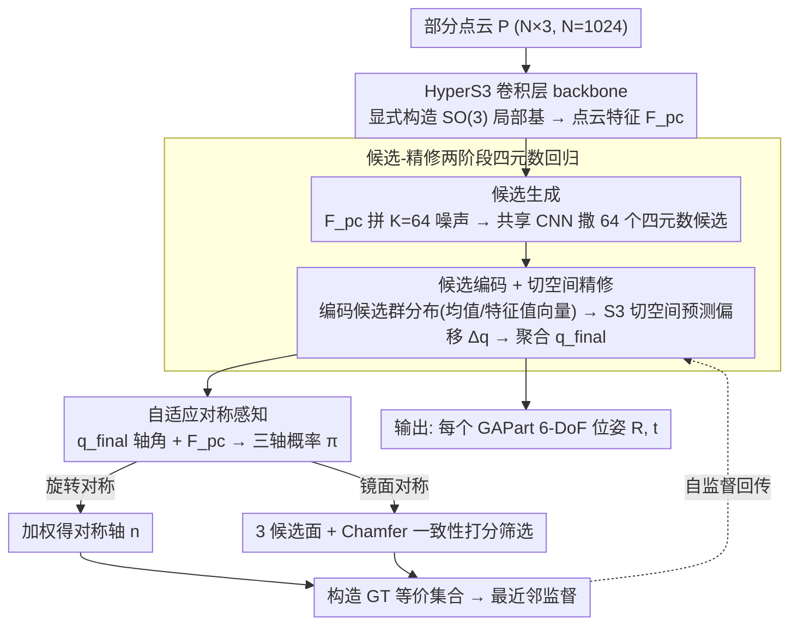

# SAFAG: 无对称性标注的可泛化可操作部件位姿估计

**会议**: ICML 2026  
**arXiv**: [2605.17033](https://arxiv.org/abs/2605.17033)  
**代码**: 待确认  
**领域**: 机器人 / 具身智能 / 6D位姿估计  
**关键词**: GAParts, 6D 位姿, 对称性自监督, 四元数细化, 机器人操控

## 一句话总结
SAFAG 把 GAPart 6D 位姿估计拆成"候选四元数生成 + 切空间精修"的两阶段框架，并用自适应概率分布在 $x,y,z$ 三轴上隐式学习对称轴/面，从而在完全没有对称性标注的情况下，把跨类别可操作部件的旋转误差从 5.51° 压到 3.23°。

## 研究背景与动机

**领域现状**：具身智能里跨类别的物体操控依赖高质量的部件级 6D 位姿感知。Geng 等人提出 GAParts（Generalizable and Actionable Parts，可泛化可操作部件，如滑动抽屉、铰链门、按钮），把位姿估计的对象从整体物体下沉到 9 类可交互部件，让机器人能够"按部件"做操作策略。后续 GAPartNet、GASEM、DFGAP、GenPose++、RFMPose 等沿着这条线推进。

**现有痛点**：GAPart 比整体物体含有更丰富的对称性（圆形旋钮绕轴 360° 等价、抽屉滑盖 180° 等价），现有方法在这上面有两类毛病：(1) **多解问题**：GAPartNet 用 NPCS 强行规整唯一解，等价集合被压成单一标签，精度受损；(2) **强标注依赖**：GASEM、DFGAP 等设计了对称感知损失，但都需要预先标注对称轴/对称面，这种标注在真实场景里非常贵且经常不可得。

**核心矛盾**：要正确处理对称导致的"一对多"，就要知道对称轴在哪；要知道对称轴在哪，就要密集标注；想去掉标注，又会回到无监督下"一对多"映射 ill-posed 的老路。

**本文目标**：在零对称性标注的前提下做 GAPart 的 6 DoF 位姿估计，且要同时覆盖旋转对称和镜面对称两种情况。

**切入角度**：作者把对称轴/面看作一个 $x,y,z$ 三轴上的离散概率分布（混合权重 $\pi_x,\pi_y,\pi_z$），让网络从点云重建一致性中自监督地把这个分布学出来；位姿本身则用四元数（紧凑、无奇点、不解耦）做"候选 → 切空间精修 → 聚合"。

**核心 idea**：把"找对称轴"换皮成"估三轴上的概率分布"，用 Chamfer 镜像一致性当自监督信号，从而把"对称性标注"从训练 pipeline 里整个抽掉。

## 方法详解

### 整体框架
输入是部件的部分点云 $P \in \mathbb{R}^{N \times 3}$（$N=1024$），输出是每个 GAPart 的 6 DoF 位姿（旋转 $R \in SO(3)$ + 平移 $t \in \mathbb{R}^3$）。Pipeline 是四块叠起来：(1) **HyperS3 backbone**：把 3D-GCN 改造成对 $S^3$ 流形友好的特征提取器，输出点云特征 $\mathcal{F}^{pc}$；(2) **候选生成**：拿 $\mathcal{F}^{pc}$ 拼上 $K=64$ 个随机噪声向量，共享 CNN 并行生成 64 个四元数候选；(3) **切空间精修**：先用 candidates encoder 把 64 个候选的统计量（均值、二阶矩特征、特征值/向量）编码成 $\mathcal{F}^{embedding}$，再让 CNN 在 $S^3$ 切空间里给每个候选预测偏移 $\Delta q_i$，最后一个线性层聚合得到 $q^{final}$；(4) **自适应对称网络**：拿 $q^{final}$ 的轴角表示和 $\mathcal{F}^{pc}$ 一起预测三轴概率 $\pi_{x,y,z}$，旋转对称直接加权得到对称轴，镜面对称再加一个 Chamfer 一致性筛选三个候选面，最后用预测的对称结构构造 ground truth 的等价集合反过来监督 $q^{final}$。下面三个关键设计正好对应论文的三个核心贡献（HyperS3 卷积 / 候选-精修两阶段回归 / 自适应对称感知），训练策略另起一段。

### 关键设计

**1. HyperS3 卷积层：把"旋转感知"显式焊进 backbone 的局部坐标系**

之前的 backbone 在 $S^3$ 上回归四元数时旋转敏感性不够，下游候选生成得从头学这个不变性，事倍功半。HyperS3 的做法是给 3D-GCN 加一层显式构造 $SO(3)$ 局部基的卷积：对每个点 $p_i$ 找 KNN（$M=8$），算局部协方差 $S_i = \frac{1}{M}\sum_{j} R_{ij} R_{ij}^\top$，用一步幂迭代取主方向 $e_{1,i}=\frac{S_i v_0}{\|S_i v_0\|}$，再叉乘参考向量补出 $e_{2,i}, e_{3,i}$ 拼成局部正交基 $E_i$。邻居向量被同时投到两条分支——投进局部坐标系得到旋转敏感的 $\mathcal{F}^{align}$，保留欧氏坐标得到几何结构分支 $\mathcal{F}^{euclid}$。

两条分支不是平均混合，而是按局部几何的可靠程度自适应加权：用协方差迹 $\mathrm{tr}(S_i)$ 与各向异性 $a_i=\|S_i - S_i^{iso}\|_F^2$ 算置信权重 $\alpha_i$，融合成 $\mathcal{F}_i = \alpha_i \mathcal{F}^{align} + (1-\alpha_i)\mathcal{F}^{euclid}$，再拼上 HS-Pose 的 STE/ORL 模块得到最终点云特征 $\mathcal{F}^{pc}$。这样一来，旋转不变性在 backbone 层面就已经具备，候选生成阶段可以专注于"撒多解"而非补这块基础能力。

**2. 候选-精修两阶段四元数回归：用"先撒点再切空间精修"匹配对称导致的多解结构**

对称部件天然是一对多映射，直接回归单解会把等价集合压成一个点而精度受损；而直接回归整张旋转矩阵会撞 $SO(3)$ 的不连续，回归两个正交列又难处理。SAFAG 用四元数（紧凑、无奇点）走两阶段：候选生成阶段把 $K=64$ 个随机噪声向量 $z_i$ 分别拼到 $\mathcal{F}^{pc}$ 上，共享 CNN 并行吐出 64 个候选 $\{q_i\}$，相当于显式撒点覆盖等价集合。

精修前先让候选"互相看一眼"再修，避免孤立单点修正的不稳定。具体是对齐符号取均值 $q_{mean}$，算残差 $r_i = q_{mean}^{-1}\otimes q_i$ 映到切空间得轴角偏移 $\delta_i$，再统计平均余弦相似度 $\bar{\mu} = \frac{1}{K}\sum_i |q_i^\top q_{mean}|^2$ 和偏移二阶矩矩阵的三大特征值/向量 $\{\lambda_j, v_j\}_{j=1}^3$，这些"候选群分布的形状"被 candidates encoder 编码成 $\mathcal{F}^{embedding}$。它与 $\mathcal{F}^{pc}$ 融合后，CNN 在 $S^3$ 切空间为每个候选预测偏移 $\Delta q_i$，最后线性层把修正后的 $\Delta q_i \otimes q_i$ 聚合成 $q^{final}$。在切空间做更新等价于流形上的一阶变化、几何意义清晰，比生成式（GenPose++）或流匹配（RFMPose）更轻却精度反超。

**3. 自适应对称感知：把"找对称轴"换成"估三轴概率分布"，从而抽掉对称标注**

这是整篇去掉标注依赖的关键。要正确处理对称多解就得知道对称轴在哪，而知道对称轴一向意味着要密集标注。SAFAG 的破局点是把对称推理建模成 $x,y,z$ 三轴上的离散混合分布 $\pi_x,\pi_y,\pi_z$：旋转对称时，取 $q^{final}$ 的轴角表示 $\mathcal{F}^{rot}$ 和 $\mathcal{F}^{pc}$ 各过 CNN 拼接预测三轴概率，对称轴直接加权得到 $n = \pi_x n_x + \pi_y n_y + \pi_z n_z$。

镜面对称更棘手，因为平面数量和位置都未知，于是把 $n$ 当主法向，额外预测一个正交副法向 $n'$，叉乘得到 $n''$ 凑出三个候选面。监督信号则来自纯几何一致性而非标注：对每个候选法向 $u_j$ 算镜像点云 $p_i^{(j)\prime} = p_i - 2((p_i-p_c)\cdot u_j) u_j$，用双向 Chamfer 距离

$$\mathcal{L}_{geom}(P, u_j)=\tfrac{1}{2}\big(d(P,P^{(j)\prime})+d(P^{(j)\prime},P)\big)$$

度量镜像前后的一致性，归一化成几何分数 $s_j = \frac{1/(\mathcal{L}_{geom}+\varepsilon)}{\sum_j 1/(\mathcal{L}_{geom}+\varepsilon)+\varepsilon}$ 来抑制不一致的候选面。因为"原点云 vs 镜像点云"的一致性本身就能当自监督信号，整套对称推理彻底不需要任何对称轴/面的 ground truth。

### 损失函数 / 训练策略
最终四元数监督来自"用预测对称结构构造的 GT 等价集合"——选等价集合中与预测最近的那一个做回归目标，从而把多解问题转成可监督的最近邻回归；对称网络靠 Chamfer 镜像一致性 $\mathcal{L}_{geom}$ 做自监督，无需对称 ground truth；旋转/镜面对称类型作为先验类别给入，但具体轴/面参数完全由网络学出。

## 实验关键数据

### 主实验（GAPartNet，跨 9 类部件平均）

| 设定 | 方法 | Rot. (°) ↓ | Trans. (cm) ↓ |
|------|------|-----------:|--------------:|
| Seen | GAPartNet | 7.71 | 0.037 |
| Seen | GASEM | 9.11 | 0.036 |
| Seen | GenPose++ | 15.86 | 0.035 |
| Seen | RFMPose | 17.03 | 0.060 |
| Seen | DFGAP | 5.51 | 0.020 |
| Seen | **SAFAG (Ours)** | **3.23** | **0.016** |
| Unseen | GAPartNet | 27.59 | — |
| Unseen | GASEM | 29.45 | — |
| Unseen | GenPose++ | 31.66 | — |
| Unseen | RFMPose | 33.39 | — |

SAFAG 在 Seen 上把旋转误差相对最强基线 DFGAP 再砍掉 41%（5.51° → 3.23°），平移误差也降到 0.016 cm；尤其在高度对称的 Sd.Ld（滑盖）、Hg.Ld（铰链盖）、Rd.F.Hl（圆形固定把手）这几类上提升最显著，说明对称建模直接受益。

### 消融实验（关键模块对 Rot. 的贡献，定性描述）

| 配置 | Rot. (°) | 说明 |
|------|---------:|------|
| 完整 SAFAG | 3.23 | Full |
| w/o HyperS3 conv | 上升 | 退化为原始 3D-GCN，旋转敏感性下降 |
| w/o 候选-精修两阶段 | 上升 | 直接单解回归撞 $SO(3)$ 不连续 |
| w/o 自适应对称 | 大幅上升 | 退化到单一 GT 监督，对称类部件多解问题回流 |

### 关键发现
- 自适应对称模块的贡献最大：去掉后高对称类部件（滑盖、圆形把手、旋钮）退化最严重，验证了"概率分布建模对称 + Chamfer 自监督"是把无标注做通的关键。
- HyperS3 的旋转感知局部基让 backbone 直接输出对旋转更稳的特征，下游候选生成不用再补这块。
- $K=64$ 候选 + 切空间精修在精度和效率之间取得平衡，更小的 $K$ 在不对称类上够用，但对称类需要候选数足够才能覆盖等价集合。
- 真实世界 demo 显示 SAFAG 的高质量 GAPart 感知能直接接 GAPartNet 的交互策略完成抓取，落地链路是通的。

## 亮点与洞察
- **把"对称标注"问题转写成"三轴概率分布 + 几何一致性自监督"**：这一招很巧——它没有去回避对称多解，而是承认"对称结构本身就是分布"，让 Chamfer 镜像距离作为天然的自监督信号；这种"把先验从标注里解放出来"的范式可迁移到其他需要对称/等价信息的任务（如 NOCS 类别级位姿、SLAM 中对称物体）。
- **候选 → 切空间精修 → 聚合的三段式四元数回归**：把"多解回归"做成显式候选撒点 + 流形精修，比直接生成式（GenPose++）/流匹配（RFMPose）更轻，且精度反超，说明"候选 + 几何感知精修"在 $S^3$ 上是个性价比很高的范式。
- **候选 encoder 编码分布二阶矩**：用候选分布的均值、特征值、特征向量当 encoder 输入，让精修知道"候选群分布的形状"再去修偏移，避免单点孤立修正的不稳定，这个思路在任何 candidate-based 范式里都好用。

## 局限与展望
- 对称类型（旋转 / 镜面）作为先验类别需要给入，没有做"对称类型本身也自动判别"的更彻底版本。
- 主实验只在 GAPartNet（PartNet-Mobility + AKB-48）评估，对真实世界遮挡、噪声严重场景的鲁棒性仅靠少量 demo 展示，定量评估不足。
- 候选数 $K=64$ 固定，对极端对称（如完美轴对称的旋钮）是否需要自适应 $K$ 未讨论。
- 后续可结合关节运动信息做时序联合估计，进一步消除单帧歧义。

## 相关工作与启发
- **vs GAPartNet (Geng et al., 2023)**：GAPartNet 用 NPCS 强行收敛到单解，丢失等价集合信息；SAFAG 显式建模等价集合并用对称分布生成监督目标，精度大幅领先（Seen 7.71° → 3.23°）。
- **vs GASEM / DFGAP**：两者都需要对称轴/面标注配合对称感知损失；SAFAG 用 Chamfer 自监督把这部分标注完全去掉，且 Seen 精度仍优于 DFGAP 41%。
- **vs GenPose++ / RFMPose**：生成式/流匹配方法把多解问题建模为分布采样，理论优雅但需要对称标注，且训练成本高；SAFAG 用候选 + 切空间精修 + Chamfer 自监督，达到更低误差且无标注。

## 评分
- 新颖性: ⭐⭐⭐⭐ "对称当概率分布 + Chamfer 自监督"把标注依赖彻底去掉，思路干净。
- 实验充分度: ⭐⭐⭐⭐ GAPartNet 9 类部件 Seen/Unseen 全覆盖 + 真实世界 demo，但缺定量真实场景评估和系统的消融。
- 写作质量: ⭐⭐⭐⭐ 框架四块拆解清晰，公式标注规范，HyperS3 与 candidates encoder 的几何动机讲得透。
- 价值: ⭐⭐⭐⭐ 直接服务于具身智能跨类别操控，去标注的设定对真实部署有强落地价值。

<!-- RELATED:START -->

## 相关论文

- [\[ICML 2026\] From Imagined Futures to Executable Actions: Mixture of Latent Actions for Robot Manipulation](from_imagined_futures_to_executable_actions_mixture_of_latent_actions_for_robot_.md)
- [\[ICML 2026\] Towards Efficient and Expressive Offline RL via Flow-Anchored Noise-conditioned Q-Learning](towards_efficient_and_expressive_offline_rl_via_flow-anchored_noise-conditioned_.md)
- [\[ICML 2026\] ManiSoft: Towards Vision-Language Manipulation for Soft Continuum Robotics](manisoft_towards_vision-language_manipulation_for_soft_continuum_robotics.md)
- [\[ICML 2026\] Turning Adaptation into Assets: Cross-Domain Bridging for Online Vision-Language Navigation](turning_adaptation_into_assets_cross-domain_bridging_for_online_vision-language_.md)
- [\[ICML 2026\] Neural Low-Discrepancy Sequences](neural_low-discrepancy_sequences.md)

<!-- RELATED:END -->
