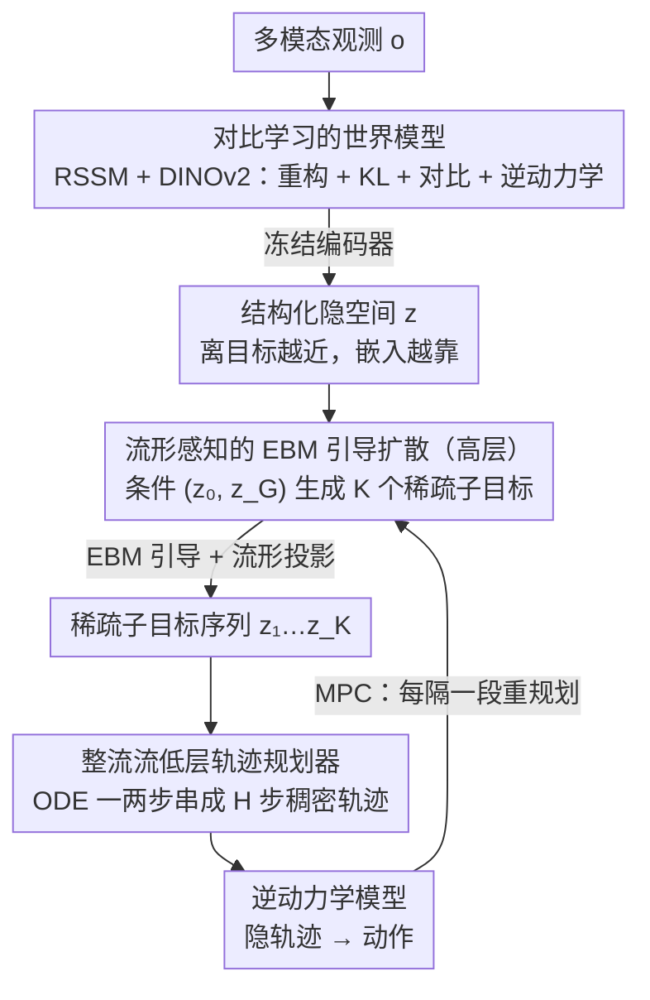

# HDFlow: Hierarchical Diffusion-Flow Planning for Long-horizon Tasks

**会议**: ICML 2026 Spotlight  
**arXiv**: [2605.04525](https://arxiv.org/abs/2605.04525)  
**代码**: https://hdflow-page.github.io/ (项目页)  
**领域**: 机器人 / 长程规划 / 生成式规划  
**关键词**: 层级规划, 扩散模型, 整流流, 能量模型, 流形投影

## 一句话总结
HDFlow 用扩散模型生成稀疏战略子目标、用整流流生成稠密轨迹，再叠加能量引导和流形投影，构建一套快慢分工的双层规划器，把家具组装等长程稀疏奖励任务的成功率拉高 20~30 个百分点。

## 研究背景与动机

**领域现状**：长程机器人操作（家具组装、迷宫导航等）目前主流走两条路线：模仿学习直接克隆专家轨迹，或者用扩散模型把规划当成"条件生成"问题，从噪声里采样出整条轨迹。后者代表是 Diffuser、Decision Diffuser，以及把扩散叠加成层级的 SHD、HDMI。

**现有痛点**：纯扩散规划器在每一步都要跑多步去噪，推理速度慢，难以实时控制；同时长程任务里很容易"看起来合理但走进死胡同"，标准条件扩散没有显式机制评估子目标序列的长期可行性。把扩散用在层级的所有层（高层 + 低层）会把速度瓶颈进一步放大。

**核心矛盾**：高层规划需要的是 **探索性**——能生成多样的战略子目标候选；低层执行需要的是 **速度和确定性**——把子目标转换成平滑稠密轨迹。一个生成范式（要么都用扩散，要么都用流）不可能同时把两件事做到最优。

**本文目标**：(1) 让高层和低层分别用最合适的生成模型；(2) 给高层加上能"识别死胡同"的引导信号；(3) 防止引导信号把样本推离可行流形。

**切入角度**：把扩散和整流流当作两种互补工具——扩散适合多样性高的探索，整流流通过 ODE 求解器一两步就能生成轨迹，速度快。再训一个能量模型 (EBM) 当作"长期可行性评估器"，对成功轨迹打低能量、失败轨迹打高能量。

**核心 idea**：高层用 "EBM 引导 + 流形投影" 的扩散规划器在隐空间里产稀疏子目标，低层用整流流快速串起稠密轨迹，前提是有一个对比学习训出来的世界模型把隐空间组织得"靠近目标的状态嵌入相近"。

## 方法详解

### 整体框架
两阶段训练：**阶段 1** 训世界模型 (RSSM + DINOv2 编码器)，用观测重构 + KL + 对比学习 + 逆动力学损失联合训，让隐空间既预测得准又能反映"离目标的距离"；之后冻结编码器。**阶段 2** 在冻结隐空间里训层级规划器：高层扩散模型 $\epsilon_\theta$ 学着从 $(z_0, z_G)$ 条件生成 $K$ 个稀疏隐子目标 $z = (z_1, ..., z_K)$；低层整流流 $v_\theta$ 学着在两个相邻子目标之间生成 $H$ 步稠密隐轨迹。MPC 推理时，高层每隔一段就重规划一次，低层把第一个子目标展开成稠密轨迹，再用逆动力学模型映射成动作。

### 关键设计

**1. 对比学习的世界模型：把隐空间组织得"离目标越近，嵌入越靠"**

标准世界模型只保证预测得准，没保证对规划友好——隐空间里"离目标的距离"是混乱的，下游引导无从下手。HDFlow 在 RSSM 标准的重构 + KL 目标 $\mathcal{L}_{WM}$ 之外加一项 InfoNCE 对比损失 $\mathcal{L}_{contrastive}$：把成功轨迹的中间隐状态和它的最终目标 $z_G$ 当正对，与失败轨迹的中间状态拉远；再补一项逆动力学 MSE，逼模型把"相邻状态对"编码成动作可预测的形式。这相当于在隐空间里挖出一条"通向目标的方向"，后面的高层扩散和能量模型正是踩在这种距离结构上才能有效引导，所以它是整套方法的地基。

**2. 流形感知的 EBM 引导扩散（高层）：给探索加一个"识别死胡同"的信号，再把它拉回可行流形**

标准条件扩散没有显式机制评估子目标序列的长期可行性，长程任务里很容易生成"看着合理却走进死胡同"的计划。HDFlow 先用对比损失训一个能量模型当"长期可行性评估器"，对成功子目标序列打低能：

$$\mathcal{L}_{EBM} = \log(1 + \exp(E_\phi(z_{pos}) - E_\phi(z_{neg})))$$

采样时分两步：先做 EBM 引导采样 $z_{\ell-1}^{temp} \sim \mathcal{N}(\mu_\theta(z_\ell) + w_{ebm}\Sigma^\ell g, \Sigma^\ell)$（$g = \nabla_{z_\ell} E_\phi$），再把它投影回局部流形——用 Tweedie 公式得去噪估计 $\hat z^{0|\ell-1}$，检索 $k$ 个最近邻做秩-$r$ PCA 拿到投影基 $U$，最后 $\mathcal{P}(z) = \mu + UU^T(z - \mu)$。为什么要补这一步投影？作者证明能量引导的误差下界正比于 $\sqrt{d}/\sqrt{1-\bar\alpha_\ell}$，在高维隐空间里近似 EBM 必然把样本推离可行流形；投影把引导带来的偏离硬拉回来，相当于在"高质量"和"可行性"之间加了一道硬约束。

**3. 整流流低层轨迹规划器：用 ODE 一两步串起稠密轨迹**

低层不需要多样性，只需要把子目标快速、确定地连成平滑轨迹——而纯扩散每步都要多步去噪，正是层级规划器的实时性瓶颈。HDFlow 把"在隐空间从 $z_{k-1}$ 走到 $z_k$"看成最优传输，其最优解是尽可能直的直线轨迹，正好契合整流流。训练用 flow-matching：

$$\mathcal{L}_{LL} = \mathbb{E}\big[\| v_\theta((1-u)\tau_0 + u\tau_1, u, c_k) - (\tau_1 - \tau_0)\|^2\big]$$

推理时直接解 ODE，一两步就生成整段 $H$ 步稠密轨迹，速度比扩散快一个数量级。高层要探索就用扩散、低层要快就用整流流，这种"用对工具"的分工正是 HDFlow 能同时兼顾成功率和实时性的关键。

### 损失函数 / 训练策略
两阶段：第一阶段联合优化 $\mathcal{L}_{WM\text{-}total} = \lambda_{WM}\mathcal{L}_{WM} + \lambda_{IDM}\mathcal{L}_{IDM} + \lambda_{contrastive}\mathcal{L}_{contrastive}$；第二阶段冻结世界模型，联合训规划器 $\mathcal{L}_{planner} = \lambda_{HL}\mathcal{L}_{HL} + \lambda_{LL}\mathcal{L}_{LL} + \lambda_{EBM}\mathcal{L}_{EBM} + \lambda_{proj}\mathcal{L}_{projection}$。其中 $\mathcal{L}_{projection}$ 让高层生成的子目标尽量贴近学到的隐流形。高层用 100 步去噪、CFG 缩放 2.0；低层用 DiT 4 层 8 头，隐维 512。

## 实验关键数据

### 主实验

| 基准 / 任务 | 难度 | SHD (前 SOTA) | HDFlow | 提升 |
|-------------|------|---------------|--------|------|
| FurnitureBench one_leg | Low/Med/High | 71/31/15 | **92/71/39** | +21~+24 |
| FurnitureBench lamp | Low/Med/High | 43/22/16 | **68/49/34** | +18~+27 |
| FurnitureBench round_table | Low/Med/High | 41/21/12 | **61/43/27** | +20~+22 |
| OGBench antmaze-giant-v0 | — | 19 | **48** | +13 (vs 35 DV) |
| OGBench humanoidmaze-giant-v0 | — | 7 | **25** | +9 |
| RLBench Insert Peg | — | 65.6 (3D Actor) | **93.3** | +27.7 |

RLBench 18 任务上 HDFlow 在 7 个任务取得最佳，平均显著优于 RVT-2、3D Diffuser Actor 等专门视觉操作模型。

### 消融实验

| 配置 | lamp 成功率 (%) | 推理时间 (ms/步) |
|------|----------------|------------------|
| 完整 HDFlow | **68** | **88** |
| w/o 流形投影 | 57 (one_leg 84) | — |
| w/o 流形感知 EBM | 33 (one_leg 61) | — |
| w/o 对比世界模型 | 27 (one_leg 58) | — |
| FD (平扩散) | 24 | 197 |
| HF (层级整流流) | 24 | 53 |
| HD (层级扩散) | 43 | 142 |

### 关键发现
- 对比训练的世界模型是大头：去掉之后掉点最猛，说明 EBM 和扩散都依赖隐空间本身有"距离结构"才能工作。
- "层级 + 混合范式"比单一范式优势明显：HD (全扩散) 43% vs HDFlow 68%，HF (全流) 24% vs HDFlow 68%，证明高/低层任务性质确实不一样。
- 推理时间从 HD 的 142 ms 降到 88 ms，又比单层扩散 FD 的 197 ms 快一倍多，证明整流流低层确实把速度拉起来了。
- 真机 Franka 上 50 条演示微调后仍能成功，一定程度验证模拟到真实的迁移性。

## 亮点与洞察
- **"用对工具"的层级哲学**：把扩散的探索性放在高层、整流流的速度放在低层，这种"分工"思路非常具有借鉴价值，可以推广到任何需要"先想好策略再快速执行"的任务（VLA、文档分析等）。
- **流形感知 EBM 引导**：理论上证明高维引导必然偏离流形、然后用 PCA 局部投影把它拉回来，这个 trick 几乎可以即插即用到任何 guided diffusion 任务（图像编辑、分子设计），不止机器人。
- **EBM 当作"长程评估器"的妙处**：不是去拟合奖励函数，而是直接对"整条计划"打分，避免了奖励稀疏问题；用对比训练，正负样本来自成功 vs 失败 demo，标注成本极低。

## 局限与展望
- 需要成功 + 失败演示同时存在才能训 EBM 和对比世界模型，作者也承认"数据收集成本不低"，尤其是失败演示在真实机器人上较难系统采集。
- 高层每次重规划仍要跑 100 步去噪，虽然低层快，但整体延迟相比纯模仿学习仍偏高；可以考虑蒸馏成少步采样。
- 子目标间隔 $H$ 是任务相关的超参，没有自适应机制；长任务里可能需要分段细化。
- 多模态条件（语言指令）尚未集成，目前只能 "图像目标条件"，落地家庭通用机器人还差一步。

## 相关工作与启发
- **vs SHD / HDMI**：同样是层级扩散，但全用扩散造成低层慢；HDFlow 用整流流替换低层 + 加 EBM 引导，速度和成功率都明显领先。
- **vs Diffuser / DD**：单层扩散没有显式层级，长程任务下子目标错误会一路放大；HDFlow 的高低分工 + 重规划机制天然能容错。
- **vs Manifold Preserving Guided Diffusion (He et al., 2024)**：本文把流形投影 idea 从图像生成搬到了机器人规划，并且与 EBM 引导结合，是一个有意思的跨域迁移。

## 评分
- 新颖性: ⭐⭐⭐⭐ "扩散 + 整流流 + EBM + 流形投影"四件套组合是新的，但每个组件都有先例。
- 实验充分度: ⭐⭐⭐⭐⭐ 三个基准 + 真机 + 详细消融 + 推理时间对比，覆盖很全。
- 写作质量: ⭐⭐⭐⭐ 动机推理清晰，理论部分 (附录 A) 推得很认真，但主文有些公式跳跃。
- 价值: ⭐⭐⭐⭐ 对长程机器人规划是实打实的 SOTA 推进，跨领域 trick 也值得借鉴。

<!-- RELATED:START -->

## 相关论文

- [\[ICML 2026\] Drift is a Sampling Error: SNR-Aware Power Distributions for Long-Horizon Robotic Planning](drift_is_a_sampling_error_snr-aware_power_distributions_for_long-horizon_robotic.md)
- [\[NeurIPS 2025\] RDD: Retrieval-Based Demonstration Decomposer for Planner Alignment in Long-Horizon Tasks](../../NeurIPS2025/robotics/rdd_retrieval-based_demonstration_decomposer_for_planner_alignment_in_long-horiz.md)
- [\[CVPR 2026\] AGiLe: Learning Robust Long-Horizon Manipulation via Affordance-Grounded Bidirectional Latent Planning](../../CVPR2026/robotics/agile_learning_robust_long-horizon_manipulation_via_affordance-grounded_bidirect.md)
- [\[ICML 2025\] Closed-loop Long-horizon Robotic Planning via Equilibrium Sequence Modeling](../../ICML2025/robotics/closed-loop_long-horizon_robotic_planning_via_equilibrium_sequence_modeling.md)
- [\[ICLR 2026\] RoboPARA: Dual-Arm Robot Planning with Parallel Allocation and Recomposition Across Tasks](../../ICLR2026/robotics/robopara_dual-arm_robot_planning_with_parallel_allocation_and_recomposition_acro.md)

<!-- RELATED:END -->
