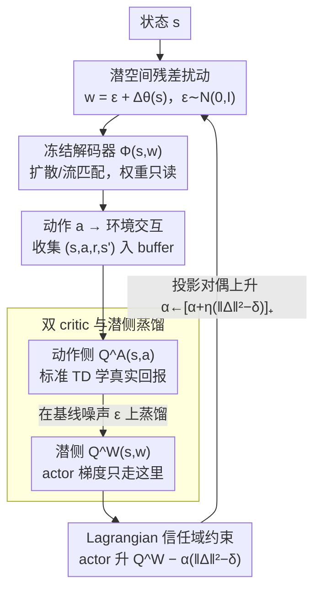

# Lagrangian Perturbation Diffusion Steering: Latent Reinforcement Learning for Generative Policies

**会议**: ICML 2026  
**arXiv**: [2606.01151](https://arxiv.org/abs/2606.01151)  
**代码**: https://sites.google.com/view/lp-ds/home (project page)  
**领域**: 强化学习 / 生成式策略 / 信任域方法  
**关键词**: 扩散策略、潜空间 RL、信任域、Lagrangian、模式坍缩

## 一句话总结
LP-DS 把冻结的扩散/流匹配策略当成黑盒解码器 $\Phi(s,w)$，只在它的初始噪声 $w=\epsilon+\Delta_\theta(s)$ 上学一个状态条件残差，用 Lagrangian 信任域 $\mathbb{E}_s[\|\Delta_\theta(s)\|_2^2]\le\delta$ 把扰动幅度卡住，从而在保留多模态先验的前提下做样本高效的在线 RL 微调，在 RoboMimic / Gym / Adroit / LIBERO 上比 DSRL 与 DPPO 更稳，回报最多 +25%。

## 研究背景与动机

**领域现状**：高容量生成式策略（Diffusion Policy、流匹配 π0 系列）凭借多模态动作分布，已经成为连续控制和操作的主流 BC 范式。

**现有痛点**：纯 BC 受演示覆盖与分布偏移的天花板限制，需要做 RL 微调；但直接更新庞大的扩散/流匹配解码器会因为长链去噪/ODE 积分梯度不稳，样本效率差。最近的 DSRL 把 RL 搬到潜噪声空间（黑盒解码），但它直接学一个新的潜策略**替换**预训练先验，会出现两个失效模式：(i) 噪声漂出 $\mathcal{N}(0,I)$ 解码器训练支撑，触发 off-manifold 行为；(ii) 把多模态先验塌成单一模态。

**核心矛盾**：解码器是在 $\mathcal{N}(0,I)$ 上训出来的，但 RL 价值梯度会把潜变量推向越来越极端的高价值区——"提升回报"和"留在解码器训练支撑里"形成了直接对立。论文 Figure 2 给的证据：DSRL 在 HalfCheetah 上潜变量模 $\|w\|$ 单调增长直到解码失效、成功率反向掉到 0。

**本文目标**：在不改解码器一行权重的前提下做 online RL 改进；用一个能"夹回先验"的显式机制控制潜空间扰动的幅度；同时给 user 一个可解释的旋钮在"任务收益"和"多模态保留"之间打分。

**切入角度**：把潜空间 RL 重新写成 **constrained optimization**——不学新的潜策略而学一个残差 $\Delta_\theta(s)$，并把"残差幅度 = 与先验的近似 KL"作为硬约束放进 Lagrangian。

**核心 idea**：$w=\epsilon+\Delta_\theta(s)$ + 信任域约束 $\mathbb{E}_s[\|\Delta_\theta(s)\|_2^2]\le\delta$ + 投影梯度更新的对偶变量 $\alpha$，让"超出信任域→自动收紧、回到信任域→放松"成为内禀机制。

## 方法详解

### 整体框架
LP-DS 把冻结生成策略写成黑盒解码器 $\Phi:\mathcal{S}\times\mathcal{W}\to\mathcal{A}$。每个状态 $s$ 上采样基线噪声 $\epsilon\sim\mathcal{N}(0,I)$，再加上一个小型 MLP $\Delta_\theta(s)$ 产生潜查询 $w$；用 $a=\Phi(s,w)$ 与环境交互。值学习采"双 Q"结构：动作侧 $Q_\psi^\mathcal{A}(s,a)$ 走标准 TD，潜侧 $Q_\phi^\mathcal{W}(s,w)$ 通过在基线噪声上做"$Q^\mathcal{A}\circ\Phi$"蒸馏得到——actor 更新走潜侧 Q，避免穿过解码器反传。所有训练只更新 $\Delta_\theta,Q_\psi^\mathcal{A},Q_\phi^\mathcal{W},\alpha$，解码器永远 frozen。整条回路是个闭环：扰动→解码→交互→双 critic 学价值→actor 与对偶变量更新→再回到扰动模块，下面三个关键设计正对应这条回路上可学的三块。

### 关键设计

**1. 潜空间残差扰动：用 RL 修策略时不替换先验，只在 $\mathcal{N}(0,I)$ 上加一个可学的状态条件偏移**

DSRL 的失效根源在于它直接学一个新潜策略 $w\sim\pi_\theta^\mathcal{W}(\cdot\mid s)$ 把预训练先验整个替换掉，价值梯度会把潜变量越推越极端，最终漂出解码器训练支撑。LP-DS 改成残差形式 $w=\epsilon+\Delta_\theta(s)$，$\epsilon\sim\mathcal{N}(0,I)$，只在基线噪声上叠一个小型 MLP 产生的状态条件偏移。偏移作用在 ODE 积分的起点（diffusion 的 $x_T$ 或 flow 的 $x_n$），与 DDIM/flow 的确定性解码组合后，相当于把生成分布以先验为锚做了一次轻量平移。

这个设计的好处是把先验当 reference 而非 baseline 替换。当 $\Delta_\theta(\cdot)\approx 0$（初始化）时严格恢复 BC 行为，训练只是从先验出发小步改进；而先验本身才是策略多模态结构的真正载体，以它为锚就能在提升回报的同时显式保护"覆盖多种行为模式"的能力，不至于一上来就塌成单一模态。

**2. Lagrangian 信任域约束：用一个可解释旋钮 $\delta$ 把扰动幅度卡在先验支撑内**

光有残差还不够——价值梯度仍会不断把 $\Delta_\theta(s)$ 推大直到 off-manifold。LP-DS 把"扰动幅度 = 与先验的近似 KL"做成硬约束。对"基线 + 残差"的高斯，KL 的主导项恰好是均值偏移的平方，于是有轻量闭式近似 $D_{\mathrm{KL}}(q_\theta(\cdot\mid s)\|p_0)\approx\frac{1}{2}\|\Delta_\theta(s)\|_2^2$，把目标写成约束式

$$\max_\theta\mathbb{E}\big[Q^\mathcal{W}(s,\epsilon+\Delta_\theta(s))\big]\quad\text{s.t.}\quad \mathbb{E}_s\|\Delta_\theta(s)\|_2^2\le\delta.$$

对偶化成 $\mathcal{L}(\theta,\alpha)=\mathbb{E}[Q^\mathcal{W}(s,w)-\alpha(\|\Delta_\theta(s)\|_2^2-\delta)]$，$\theta$ 走主问题梯度上升，对偶变量 $\alpha$ 走投影对偶上升 $\alpha\leftarrow[\alpha+\eta_\alpha\mathbb{E}_s(\|\Delta_\theta(s)\|_2^2-\delta)]_+$。这条回路天然自适应：扰动一超过 $\delta$，$\alpha$ 被推高、actor 立刻变保守；扰动小了 $\alpha$ 滑落、actor 又敢探索。于是"探索激进度 vs 留在先验支撑"被自动调节，同一份超参在 RoboMimic / Gym / Adroit 跨域都不用大改，$\delta$ 也从脆弱超参变成可解释的"粗调旋钮"。

**3. 双 critic 与潜侧蒸馏：把价值学习和梯度通路在解码器边界处解耦，避免反传穿过解码器**

要用真实环境奖励驱动学习，最朴素的做法是对 actor 反传穿过解码器，但扩散/流匹配的长链去噪/ODE 积分梯度极不稳，对 π0 这种大 VLA 更是连算图都留不下来。LP-DS 用两个 Q 把这件事拆开：动作侧 $Q_\psi^\mathcal{A}(s,a)$ 走标准 TD，$y=r+\gamma\bar Q^\mathcal{A}(s',a')$，其中 $a'=\Phi(w';s')$、$w'=\epsilon'+\Delta_{\theta'}(s')$，让真实回报进入价值估计；潜侧 $Q_\phi^\mathcal{W}(s,w)$ 则在基线噪声分布上把动作侧 Q 蒸馏过来，

$$\mathcal{L}_\phi=\mathbb{E}_{s,\epsilon}\big[(Q^\mathcal{W}_\phi(s,\epsilon)-Q^\mathcal{A}_\psi(s,\Phi(\epsilon;s)))^2\big].$$

actor 更新只对 $Q^\mathcal{W}$ 求梯度，根本不需要解码器可微。这样"以真实回报为信号"和"梯度不穿解码器"两个要求被同时满足，大型生成解码器对整个训练过程保持完全只读。

### 损失函数 / 训练策略
单循环：每环境步采集 1 步 → 一次 $Q^\mathcal{A}$ TD 更新 → 一次 $Q^\mathcal{W}$ 蒸馏更新 → 一次 actor 主问题更新 + 一次 $\alpha$ 投影对偶更新。$\delta$ 大多数实验取 0.35（Hopper 0.5、Lift 0.10、Pen 0.66 等），ODE/DDIM 解码，动作 chunk 大小 $T_a=8$。

## 实验关键数据

### 主实验

跨域对比（汇总自 Figure 3，6 seeds 平均，单位：成功率/回报）：

| 域 | 任务 | LP-DS | DSRL | DPPO | IDQL/DQL | 备注 |
|------|------|-------|------|------|----------|------|
| RoboMimic | Square | ≈最高，最快达到高成功率 | 收敛慢 | 中 | 低 | LP-DS 在精度敏感任务上优势明显 |
| Gym 运动控制 | Walker2D-v2 | ≈5000 | ≈4000 (最强基线) | — | — | 回报 **+25%** |
| Adroit | Pen/Hammer/Door/Relocate | 全面最佳 | 第二 | 略差 | 差 | 灵巧操作成功+回报均最优 |
| LIBERO-90 | cream cheese | 显著高于冻结 π0 | — | — | — | 仅训轻量扰动模块即可拉起大 VLA |
| Franka 真机 | Pick-and-Place | 33/40 | — | — | 18/40 (冻结基线) | 仿真训扰动→直接部署 |
| Franka 真机 | Mug hanging | 17/20 | — | — | 11/20 (冻结基线) | 同上 |

### 消融实验

| 配置 | Pen 成功率 EMA | k-NN 动作熵 | 说明 |
|------|--------------|------------|------|
| Full LP-DS | 最高 | 高 | 信任域 + Lagrangian 双管齐下 |
| w/o Lagrangian | 中等→不稳 | 单调下降 | 缺自动收紧后慢慢塌成单一行为 |
| w/o Lagrangian & noise bound | 最低，剧烈震荡 | 极低 | 潜变量飞出 $\mathcal{N}(0,I)$ 支撑 |
| DSRL | 低 | 最低 | 直接学新潜策略，最早塌 |
| LP-DS-A (动作空间残差) | 早期 plateau | — | 只在解码后修动作，效果远不如改噪声起点 |

### 关键发现
- $\delta$ 是"多模态-专精化"旋钮：在四模态对称玩具环境上，$\delta=0.01$ 保持四模态覆盖、$\delta=0.05$ 收得更直但仍多模、$\delta=0.1$ 直接坍到一个目标；DSRL 一启动就只剩一个模态。
- 在 0.1~0.66 区间 $\delta$ 对最终回报不敏感，作者称之为"粗调旋钮"而非脆弱超参——把信任域设计的工程友好性证清楚。
- 在"动作空间残差 vs 潜空间残差"对比里，潜空间始终大幅胜出，说明对于高容量生成解码器，"修起点 $w$ 让整条 ODE 走向不同模式"比"修终点 $a$ 做局部纠偏"信息量大得多。
- 物理 Franka 实验展示纯仿真训扰动模块 → 直接迁移到真机也能拉起冻结策略，说明 LP-DS 对模拟到现实的差异有一定鲁棒性。

## 亮点与洞察
- 把 KL trust region 写成 $\frac{1}{2}\|\Delta\|^2$ 是一个被低估的实用近似：对"基线 + 偏移"的高斯，KL 的主导项就是均值偏移的平方，作者直接把它当约束，整个 Lagrangian 推导一行内闭合，工程上极简。
- 把"梯度不穿解码器"做成显式架构（双 Q + 蒸馏），是绕过"扩散反传不稳"的干净办法；对 π0 这种大 VLA 尤其重要——根本没条件把解码器算图保留下来反传。
- $\alpha$ 的投影对偶更新 $[\cdot]_+$ 自动实现"约束自适应"，所以同一份 hyperparameter 在 RoboMimic / Gym / Adroit 跨域都不用大改，这是相对纯固定权重 KL 正则的明显优势。

## 局限与展望
- 信任域用 $\frac{1}{2}\|\Delta\|^2$ 近似 KL，前提是"残差小且作用在 $\mathcal{N}(0,I)$ 上"；当解码器先验明显非各向同性（比如条件 flow），这套近似会有偏差，作者没在这种场景做对照。
- 论文承认对部分可观测、长视野场景没做系统覆盖，未来要把信任域目标做成自适应的（按状态/时间变 $\delta$）。
- 物理实验任务依然偏中等难度（pick-and-place、mug hanging），缺乏高接触/dexterous 抓握长链任务，迁移结论的强度受限。

## 相关工作与启发
- **vs DSRL**：DSRL 学的是 $\pi_\theta^\mathcal{W}(w\mid s)$ 直接替换先验，LP-DS 改学 residual $\Delta_\theta(s)$ 并显式约束幅度——同一张图（Figure 1/Figure 2）就能看到 DSRL 的塌方和 LP-DS 的克制。
- **vs DPPO**：DPPO 直接对扩散策略做 policy gradient 微调全部解码器参数；LP-DS 只动一个轻量扰动 MLP，样本效率/稳定性显著占优，但理论收益上限取决于先验质量。
- **vs IDQL / DQL**：这些 offline-to-online 方法把扩散策略当 actor 的一种参数化，仍要更新主网络；LP-DS 的"解码器只读 + 潜空间 RL"是更轻量的部署友好路线。
- **vs 视觉/文生图的噪声优化**（ReNO、Noise Hypernetworks）：那边噪声修法服务的是单次生成质量，LP-DS 借用同思路但把目标换成 long-horizon return + 显式 trust region，这是把"噪声空间优化"从生成搬到决策的一次完整改造。

## 评分
- 新颖性: ⭐⭐⭐⭐ 把 KL trust region 通过残差近似落到潜空间 RL 上很优雅，但单点组件（潜空间 RL、KL trust region、双 Q 蒸馏）都不新。
- 实验充分度: ⭐⭐⭐⭐⭐ 4 类仿真域 + 大 VLA 骨干 + 物理 Franka 双任务，全面覆盖了"是否依赖小骨干""能否上真机"两个常被质疑点。
- 写作质量: ⭐⭐⭐⭐ Algorithm 1 + 公式推导紧凑清晰，玩具环境可视化把"多模态保留 vs 性能"讲得直观。
- 价值: ⭐⭐⭐⭐ 给"想在不动大型生成策略权重的前提下用 RL 拉一把"的实际场景提供了一套可直接复用的训练管线，对 π0 类大模型尤其有用。

<!-- RELATED:START -->

## 相关论文

- [\[ICML 2026\] Discrete Diffusion VLA: Bringing Discrete Diffusion to Action Decoding in Vision-Language-Action Policies](discrete_diffusion_vla_bringing_discrete_diffusion_to_action_decoding_in_vision-.md)
- [\[CVPR 2026\] GraspLDP: Towards Generalizable Grasping Policy via Latent Diffusion](../../CVPR2026/robotics/graspldp_towards_generalizable_grasping_policy_via_latent_diffusion.md)
- [\[ICML 2026\] Latent Reasoning VLA: Latent Thinking and Prediction for Vision-Language-Action Models](latent_reasoning_vla_latent_thinking_and_prediction_for_vision-language-action_m.md)
- [\[ICML 2026\] RoboMME: Benchmarking and Understanding Memory for Robotic Generalist Policies](robomme_benchmarking_and_understanding_memory_for_robotic_generalist_policies.md)
- [\[ICML 2026\] STEP: Warm-Started Visuomotor Policies with Spatiotemporal Consistency Prediction](step_warm-started_visuomotor_policies_with_spatiotemporal_consistency_prediction.md)

<!-- RELATED:END -->
