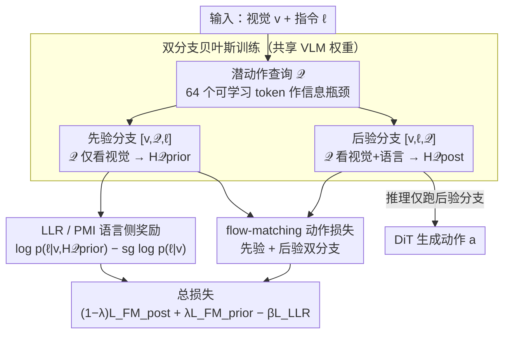

# LangForce: Bayesian Decomposition of Vision-Language-Action Models via Latent Action Queries

**会议**: ICML 2026  
**arXiv**: [2601.15197](https://arxiv.org/abs/2601.15197)  
**代码**: 论文末尾标注 "Code and videos are available"，实际仓库未给出 URL  
**领域**: 机器人 / 具身智能 / VLA  
**关键词**: VLA、视觉捷径、贝叶斯分解、潜动作查询、点互信息

## 一句话总结
LangForce 把 VLA 策略写成 $\pi(a\mid v,\ell)=p(\ell\mid a,v)\,p(a\mid v)/p(\ell\mid v)$ 这一贝叶斯分解，引入可学习的 Latent Action Queries 在同一套 VLM 权重上同时跑"只看视觉"和"视觉+语言"双分支，并通过最大化动作与指令的对数似然比来直接惩罚"视觉捷径"，在 SimplerEnv 上相对 QwenGR00T 基线提升 11.3 个绝对点。

## 研究背景与动机

**领域现状**：当前主流 VLA（OpenVLA、π0、GR00T、StarVLA 系列）把预训练 VLM 接上扩散动作头，在大批人类演示上做模仿学习，意在用 VLM 的世界知识把自然语言指令落到连续动作上。

**现有痛点**：作者发现这些模型在 OOD 场景和多任务模糊场景下普遍崩溃。LIBERO Goal（同一桌面对应多个任务）下，把语言指令屏蔽后只喂视觉的"vision-only"模型仍能拿到接近完整模型的成功率（如 RoboCasa 上 vision-only 44.6 vs full 47.8；BridgeData+Fractal 的动作 loss vision-only 0.13 vs full 0.08），说明指令在训练时根本没起多少作用。

**核心矛盾**：goal-driven 数据采集让 $v\to\ell$ 几乎是单射——看到柜子就意味着 "open the cabinet"，看到瓶子就意味着 "pick up the bottle"。这导致条件熵 $H(\ell\mid v)\approx 0$，进一步把条件互信息 $I(\ell;a\mid v)\le H(\ell\mid v)$ 压成 0，模型只能学到 $\pi(a\mid v,\ell)\approx p(a\mid v)$，作者称之为"信息坍缩"。

**本文目标**：在不重新采数据、不改 inference 计算量的前提下，把策略对语言的真实依赖强行从训练目标里"逼"出来。

**切入角度**：用贝叶斯公式 $\pi(a\mid v,\ell)=p(\ell\mid a,v)\,p(a\mid v)/p(\ell\mid v)$ 把后验拆成"视觉先验 × 似然 / 语言边际"，再以似然比 $\log p(\ell\mid a,v)-\log p(\ell\mid v)$（即条件 PMI）作为正则，奖励那些"动作里真的能反推出指令"的策略。

**核心 idea**：用同一套 VLM 权重 + 一组可学习的潜动作查询 token，靠 decoder-only 因果掩码同时模拟"视觉先验分支"与"视觉+语言后验分支"，把两支语言 log-prob 之差当作 PMI 奖励显式优化。

## 方法详解

### 整体框架
LangForce 在原生 VLA（这里是 StarVLA 的 QwenGR00T，VLM 用 Qwen3-VL-4B，动作头是 DiT）之上加了三件东西：(1) 在词表里塞 $K=64$ 个新 token $\mathcal{Q}=\{\langle\text{action}_1\rangle,\dots,\langle\text{action}_K\rangle\}$ 作为潜动作查询；(2) 同一 batch 同时跑两条共享权重的分支，分别构造 $[v,\mathcal{Q},\ell]$ 和 $[v,\ell,\mathcal{Q}]$ 两种 token 顺序；(3) 总 loss 把两条分支的 flow-matching 动作损失和一项语言对数似然比 LLR 拼在一起。推理时只跑后验分支，所以与普通 VLA 同等开销。

### 关键设计

**1. 潜动作查询作信息瓶颈：把动作相关语义压成 64 个可切换条件的 token**

π0/GR00T 这类模型把全部 vision-language hidden state 都喂给动作头，DiT 注意力复杂度高达 $O(N^2)$，而且没有干净的"条件切换"接口。LangForce 在 VLM 词表里加 $K=64$ 个可学习 token $\mathcal{Q}=\{\langle\text{action}_1\rangle,\dots,\langle\text{action}_K\rangle\}$，让它们把动作相关语义浓缩成固定长度的隐状态 $\mathbf{H}_{\mathcal{Q}}\in\mathbb{R}^{K\times D}$，DiT 只吃这 $K$ 个查询、不吃全部 token，注意力复杂度降到 $O(K^2)$。更关键的是，利用 decoder-only 的因果掩码，把 $\mathcal{Q}$ 放在 $\ell$ 之前它就只能看 vision，放在 $\ell$ 之后它就同时看 vision+language——同一份权重于是能实例化"先验"和"后验"两种条件，为后面的双分支贝叶斯分解提供了"可切换条件"的结构基础。

**2. 双分支贝叶斯训练：把视觉先验和全条件后验摆到显式对照位置**

goal-driven 数据下直接训 $\pi(a\mid v,\ell)$ 会塌成 $p(a\mid v)$——这就是作者诊断出的"信息坍缩"。要修它，必须先把这两个分布同时估出来并放在能对照的位置。LangForce 用共享权重跑两条分支：先验分支输入 $[v,\mathcal{Q},\ell]$，因果掩码下 $\mathcal{Q}$ 只看得到 $v$，得到 $\mathbf{H}_{\mathcal{Q}}^{\text{prior}}$，并对它做 stop-gradient，让先验损失只更新 DiT、防止 VLM 主干把视觉捷径内化；后验分支输入 $[v,\ell,\mathcal{Q}]$，$\mathcal{Q}$ 同时看视觉和语言，得到 $\mathbf{H}_{\mathcal{Q}}^{\text{post}}$ 走主流 flow-matching。动作损失用 Rectified Flow Matching 同时作用在两条分支：

$$\mathcal{L}_{\text{FM}}(\psi;\mathbf{C})=\mathbb{E}\|v_\psi(\mathbf{a}_t,t,\mathbf{C})-(\mathbf{a}_1-\mathbf{a}_0)\|^2$$

共享权重 + prefix prefill 让这套对照的额外开销很小，又把"先验 vs 后验"的差异显式暴露出来，等着下一步用 PMI 去拉开。

**3. LLR / PMI 语言侧奖励：直接惩罚"动作里读不出指令"的解**

有了两条对照分支，还需要一个目标真正去逼策略依赖语言。作者把要最大化的点互信息 $\log[\pi(a\mid v,\ell)/p(a\mid v)]$ 在实现上等价转写成一条对数似然差，并用 VLM 自己的 LM 损失近似 $\log p(\ell\mid\cdot)$：

$$\mathcal{L}_{\text{LLR}}=\log p(\ell\mid v,\mathbf{H}_{\mathcal{Q}}^{\text{prior}})-\mathrm{sg}\big(\log p(\ell\mid v)\big)$$

分子让 $\ell$ 反向 attend 到含动作信息的 $\mathcal{Q}$，分母走只看视觉的边际并用 stop-gradient 钉死——这一步至关重要，否则模型会靠"把分母弄烂"来骗奖励，反而毁掉 VLM 的通用语言能力。最终损失把三项拼起来：

$$\mathcal{L}_{\text{total}}=(1-\lambda)\mathcal{L}_{\text{FM}}^{\text{post}}+\lambda\mathcal{L}_{\text{FM}}^{\text{prior}}-\beta\mathcal{L}_{\text{LLR}}$$

作者取 $\lambda=0.3,\beta=0.1$。奖励"动作里真能反推出指令"的策略，这才把指令对动作的真实贡献从训练目标里逼了出来，而推理时只跑后验分支、与普通 VLA 同等开销。

### 损失函数 / 训练策略
8 张 H100、AdamW (lr=1e-5 + cosine)、DeepSpeed ZeRO-2、grad clip 1.0；SimplerEnv 上 BridgeData V2 + Fractal 微调 50k 步（batch 16/卡）。inference 只跑后验分支，与 baseline 等成本。

## 实验关键数据

### 主实验

SimplerEnv（WidowX，Avg@480 成功率，%）：

| 方法 | Put Spoon | Put Carrot | Stack Block | Eggplant | 平均 |
|------|-----------|------------|-------------|----------|------|
| OpenVLA-OFT | 34.2 | 30.0 | 30.0 | 72.5 | 41.8 |
| CogACT | 71.7 | 50.8 | 15.0 | 67.5 | 51.3 |
| π0 | 29.2 | 62.5 | 29.2 | 91.6 | 53.1 |
| π0.5 | 49.3 | 64.7 | 44.7 | 69.7 | 57.1 |
| Isaac-GR00T-N1.6 | 64.5 | 65.5 | 5.5 | 93.0 | 57.1 |
| QwenGR00T (baseline) | 87.5 | 50.0 | 29.2 | 54.2 | 55.2 |
| **LangForce** | **89.6** | **63.8** | **33.3** | 79.2 | **66.5** |

RoboCasa GR1 Tabletop 24 任务平均成功率：LangForce 52.6 vs QwenGR00T 47.8 vs Isaac-GR00T-N1.5 48.2 vs VisionOnly 44.7。

真机 Franka Pick-and-Place（OOD 红色方块 1 个）：LangForce 9/30 vs QwenGR00T 2/30 vs π0.5 7/30。蔬菜分拣总体 LangForce 97/120 (80.8%) vs QwenGR00T 71/120 (59.2%)。

### 消融实验

| 配置 | Spoon | Carrot | Stack | Eggplant | Avg |
|------|-------|--------|-------|----------|------|
| QwenGR00T (基线) | 87.5 | 50.0 | 29.2 | 54.2 | 55.2 |
| + Latent Action Queries | 74.6 | 58.3 | 29.2 | 67.9 | 57.5 |
| Full LangForce | 89.6 | 63.8 | 33.3 | 79.2 | 66.5 |

### 关键发现
- 双分支 + LLR 才是主增量：单加查询只涨 2.3 个点，加 PMI 才再拉 9.0 个点，证明"贝叶斯分解 + 对照 loss"而非"换个 head"是核心。
- LangForce 同时保留了 VLM 的通用对话/推理能力：QwenGR00T 微调后在纯文本数学题上输出重复 gibberish，LangForce 仍能完整解题，说明 LLR 项保护了语言表征不被覆盖。
- 在精细操控类任务（Stack Block）涨幅有限，提升集中在"靠语言区分目标"的任务（Eggplant +15、Carrot +13.6），与作者"主要修语言落地"而非"提升底层控制"的定位一致。

## 亮点与洞察
- 把"指令被忽略"这种工程现象上升到信息论：$H(\ell\mid v)\approx 0\Rightarrow I(\ell;a\mid v)=0$，于是 PMI 自然成为唯一正经的修复目标，论证链条干净。
- 用 decoder-only 因果掩码 + token 重排来"无成本地"切换条件分布，是非常工程化的小把戏：同一组权重既能算 $p(a\mid v)$ 又能算 $\pi(a\mid v,\ell)$，不用真的训两个 VLM。
- stop-gradient 钉住语言基线 $p(\ell\mid v)$ 是一个被反复证明有用的 trick：在所有"对比式 loss"（DPO、PPO ratio、本文 LLR）里，"别让模型靠摆烂分母骗奖励"几乎都是关键。

## 局限与展望
- 训练时确实要跑两条分支，作者用 prefix prefill 缓解视觉前缀重复计算的开销，但相比单分支 baseline 仍然有额外显存/算力成本。
- 真机实验只覆盖 pick-and-place，没碰高接触/灵巧操作；论文承认这类任务考的是底层控制而非语言落地，因此本方法的优势可能不会同样明显。
- LLR 损失把 VLM 自己的 LM head 当作 $\log p(\ell\mid\cdot)$ 的近似，质量受 VLM tokenizer 与 instruction 风格影响；指令模板换风格时 $\beta$ 可能需要重新搜。

## 相关工作与启发
- **vs BayesVLA**：同样用贝叶斯分解，但 BayesVLA 必须先训视觉先验再冻结、再训语言后验，是两段式；LangForce 用共享权重 + token 重排实现单段端到端训练，更便于直接接入既有 VLA pipeline。
- **vs π0 / GR00T**：这两类把全部 VLM hidden state 喂给动作头，复杂度 $O(N^2)$；LangForce 把信息压成 64 个查询 token，并把"先验/后验对照"作为额外正则，强调的是"信号整理"而非"喂更多 token"。
- **vs ChatVLA**：都关心 VLA 训练后语言能力被破坏的问题，但 ChatVLA 走的是任务路由解耦，LangForce 是靠 LLR 项把语言依赖直接写进 loss，自带"防遗忘"作用。

## 评分
- 新颖性: ⭐⭐⭐⭐ 把信息坍缩→PMI→双分支落到 VLA 上，思路清楚但单点 trick（stop-gradient、共享权重对照）都不新。
- 实验充分度: ⭐⭐⭐⭐ SimplerEnv/RoboCasa/LIBERO 全套 + 真机 Franka 两种任务 + 通用能力保留可视化，覆盖到位。
- 写作质量: ⭐⭐⭐⭐ 三段 motivation pilot 实验讲得很清楚，方法节排版严格按贝叶斯公式展开。
- 价值: ⭐⭐⭐⭐ 给"VLA 装作听话"这一普遍现象提供了可直接套用的训练侧修复方案，对工程团队复刻成本低。

<!-- RELATED:START -->

## 相关论文

- [\[ICML 2026\] Latent Reasoning VLA: Latent Thinking and Prediction for Vision-Language-Action Models](latent_reasoning_vla_latent_thinking_and_prediction_for_vision-language-action_m.md)
- [\[ICML 2026\] Neural Implicit Action Fields: From Discrete Waypoints to Continuous Functions for Vision-Language-Action Models](neural_implicit_action_fields_from_discrete_waypoints_to_continuous_functions_fo.md)
- [\[ICML 2026\] StableVLA: Towards Robust Vision-Language-Action Models without Extra Data](stablevla_towards_robust_vision-language-action_models_without_extra_data.md)
- [\[ICML 2026\] Spatial Memory for Out-of-Vision Manipulation in Vision-Language-Action](spatial_memory_for_out-of-vision_manipulation_in_vision-language-action.md)
- [\[ICML 2026\] Contrastive Representation Regularization for Vision-Language-Action Models](contrastive_representation_regularization_for_vision-language-action_models.md)

<!-- RELATED:END -->
