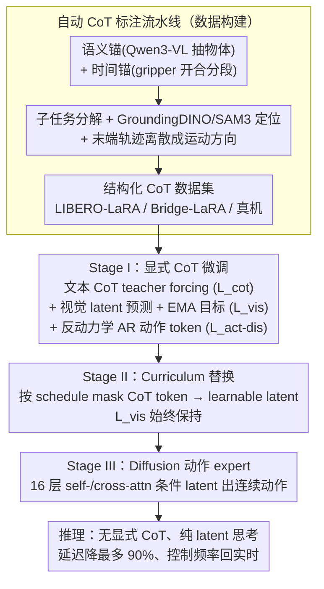

# Latent Reasoning VLA: Latent Thinking and Prediction for Vision-Language-Action Models

**会议**: ICML 2026  
**arXiv**: [2602.01166](https://arxiv.org/abs/2602.01166)  
**代码**: 公开 (Project Page)  
**领域**: 多模态 VLA / 具身智能 / 机器人  
**关键词**: VLA、Latent CoT、视觉预测、curriculum 训练、推理效率

## 一句话总结
LaRA-VLA 把 VLA 模型里的文本 CoT 和视觉 CoT 全部内化为连续 latent，通过三阶段 curriculum 训练（显式 CoT → latent 替换 → 动作专家适配）让推理留在 latent 空间里完成，推理延迟相比显式 CoT 降低高达 90%，控制频率重回实时区间。

## 研究背景与动机
**领域现状**：VLA 模型希望端到端把"图像+指令"映成"连续动作"。近期主流增强思路是引入 Chain-of-Thought：文本 CoT (ECoT、$\pi_{0.5}$、ThinkAct) 把任务分解成显式语言推理链；视觉 CoT (CoT-VLA、DreamVLA) 用 VQ-VAE 之类的离散视觉 token 预测未来观测；少量工作 (UP-VLA) 把两者结合。

**现有痛点**：(i) 文本 CoT 推理时要生成长 token 链，KV-cache 暴涨，控制频率掉到 5 Hz 甚至 1 Hz，无法实时机器人控制；(ii) 文本 CoT 用离散语言 token、视觉 CoT 用 VQ 离散视觉 token，但感知和动作本就是连续空间——离散表示是天然的**表征失配**，把"沿桌面平滑滑动"这种连续运动硬切成 vocabulary index。

**核心矛盾**：CoT 之所以有效不是"必须用自然语言"，而是"暴露结构化中间推理"。在具身场景下，把推理硬塞到语言 token 里既慢又错位。

**本文目标**：构造一个 VLA 框架，把结构化 CoT 内化为**连续 latent**，从而同时拿到 (i) 推理效率（无显式生成）、(ii) 与感知/动作空间对齐的连续表示、(iii) 比 Fast-ThinkAct 更彻底——后者只 latent 化文本 CoT，视觉部分仍是离散 trace。

**切入角度**：把推理看成 latent 状态序列演化，用 curriculum 训练把显式 token 一步步替换成 learnable latent，再用未来视觉 latent 预测做隐式监督，保证 latent 推理仍然结构化、可解释。

**核心 idea**：文本 CoT 用连续 latent 替换、视觉 CoT 用未来图像 latent 对齐（EMA 编码器稳定）、动作用 diffusion expert，三者通过 curriculum 训练协同。

## 方法详解

### 整体框架
LaRA-VLA 以 Qwen3-VL 为 VLM backbone，加一个特殊 token `<img_next>` 表示未来视觉 latent；动作端在 Stage I-II 是自回归动作 token (沿用 Pertsch et al.)，在 Stage III 切换为 16 层 Diffusion Transformer 动作 expert，通过自注意+交叉注意条件于 latent 表示输出连续动作轨迹。训练数据由"语义锚 (Qwen3-VL 抽对象) + 时间锚 (gripper 状态分段)"驱动的自动 CoT 标注流水线生成，分别构造 LIBERO-LaRA、Bridge-LaRA 和真机数据。整个训练分三个 stage：显式 CoT 微调 → 渐进式 latent 替换 → 动作 expert 适配。

### 关键设计

**1. 自动 CoT 标注流水线：anchor-first 生成多模态推理标注**

VLA 的 CoT 监督要同时覆盖长程子任务结构、目标物体空间定位、动作级运动方向，但现有标注流水线各管一段——ECoT 堆砌穷举式 bounding box 显得冗余，Emma-x 又漏掉目标定位。本文用一条全自动的"先锚定、后生成"流水线把三者统一：先抽两类锚——语义锚用 Qwen3-VL 从首帧 + 指令里认出被操作物体，时间锚按 gripper 开合把轨迹切成原子操作段；再以锚为条件批量生成——Qwen3-VL 写子任务描述，GroundingDINO + SAM3 做开放词表 grounding 得到时序一致的物体框，末端执行器轨迹算出目标导向 / 局部运动并离散成方向描述符。三路标注拼成结构化 CoT，落成 LIBERO-LaRA、Bridge-LaRA 和真机数据集，为后续三阶段训练提供干净对齐的监督。

**2. Stage I：显式 CoT 微调 + 视觉 latent 对齐 + 反动力学监督，先把结构装进模型**

直接学 latent 推理很难收敛，所以第一阶段先借显式 CoT 把"任务分解、空间定位、运动方向"这套结构注入模型。三条监督并行：CoT 端用 teacher forcing 优化 $\mathcal{L}_{\text{cot}} = -\sum_t \log p_\theta(c_t \mid c_{<t}, \mathbf{v}, \mathbf{x})$；视觉端预测下一帧 latent $\hat{\mathbf{z}}_{t+1}$ 做 $\ell_1$ 对齐 $\mathcal{L}_{\text{vis}} = \|\hat{\mathbf{z}}_{t+1} - \mathbf{z}_{t+1}\|_1$；动作端用 inverse dynamics $f(\mathbf{v}_t, \mathbf{v}_{t+1} \mid \mathbf{x}, c) = \mathbf{a}_t$ 把预测视觉当桥接。

关键细节是视觉对齐的目标 latent 由**同一个视觉编码器**的 EMA 副本 $\bar{\theta}_v^t = \tau_v \bar{\theta}_v^{t-1} + (1 - \tau_v) \theta_v^t$ 提供——这是 BYOL/JEPA 的标准技巧，防止预测目标和被预测目标共同坍缩到平凡解。这一步埋下的视觉一致性约束，是后两阶段 latent 不退化的保险。

**3. Stage II：Curriculum 逐步把离散 CoT token 换成 latent，软化 explicit-to-implicit**

直接全切到 latent 会丧失结构化推理，让 latent 退化成"啥也不学的占位符"。第二阶段保持 $\mathcal{L}_{\text{cot}} + \mathcal{L}_{\text{vis}}$ 不变，但按预设 schedule 把 CoT 序列里的 token 随机 mask 掉、替换成 learnable latent，离散 token 比例单调下降直至零，全部由 latent 承载推理。

这套 curriculum 比 Coconut 那种直接换 latent 更稳：每一步都还留一部分显式 token 当锚点，模型逐步适应而非骤变。而始终保留的 $\mathcal{L}_{\text{vis}}$ 是命门——latent 必须被视觉一致性约束，才不会塌成 trivial 表示，视觉 latent 在这里充当文本 latent 的隐式 grounding。

**4. Stage III：换上 Diffusion 动作 expert，彻底弃用显式 token 输出**

前两阶段动作专家与自回归 token 并存只是为了训练稳定，最终部署要的是"latent 推理 + 连续动作"的最短路径。第三阶段移除自回归动作 token，换上 16 层交替 self-/cross-attention 的 Diffusion Transformer 作为动作 expert，条件于 latent 表示生成动作 chunk；VLM 推理时不再吐 CoT，KV-cache 占用大幅下降，控制频率重回实时。

选 Diffusion 而非离散动作 token，也是因为它对精细控制更友好，与 $\pi_0$、OpenVLA-OFT 的发现一致。省下来的 token budget 在 LIBERO-Long 这类长程任务上能直接转化为更多实际执行步，所以长程任务受益最大。

### 损失函数 / 训练策略
总损失 = $\mathcal{L}_{\text{cot}} + \mathcal{L}_{\text{vis}} + \mathcal{L}_{\text{act-dis}}$（Stage I-II），Stage III 切到 diffusion 训练目标 + $\mathcal{L}_{\text{vis}}$ 维持。Curriculum schedule 通过逐步增大 mask 概率实现。EMA 衰减率 $\tau_v$ 是关键超参，过小则 collapse，过大则跟不上在线 encoder 更新。

## 实验关键数据

### 主实验
LIBERO 上对比 SOTA (Table 2，部分结果)：

| 类型 | 方法 | Spatial | Goal | Object | Long | Avg. |
|------|------|---------|------|--------|------|------|
| No CoT | OpenVLA | 84.7 | 88.4 | 79.2 | 53.7 | 76.5 |
| No CoT | OpenVLA-OFT | 97.6 | 98.4 | 97.9 | 94.5 | 97.1 |
| Textual CoT | ThinkAct | 88.3 | 91.4 | 87.1 | 70.9 | 84.4 |
| Textual CoT | $\pi_{0.5}$ | 98.8 | 98.2 | 98.0 | 92.4 | 96.8 |

LaRA-VLA 在该表里持续领先所有 CoT 类方法，并报告推理延迟相比显式 CoT 基线降低**最多 90%**。

### 消融实验

| 配置 | 平均成功率 | 推理延迟 |
|------|-----------|---------|
| Stage I (显式 CoT) | 高 | 慢（~1-5 Hz） |
| Stage II 中段（部分 latent） | 接近 | 中等 |
| Stage III (全 latent + expert) | 持平/略升 | **快**（实时） |
| w/o EMA target | 显著下降（latent 塌缩） | — |
| w/o 视觉 latent 预测 | 长程任务下降 | — |

EMA 和视觉预测两条监督都对维持 latent 结构性不可或缺；curriculum 跳步训练会让 latent 不收敛。

### 关键发现
- **效率 vs 性能不需要折中**：latent 化后推理延迟降一个数量级，性能持平或更高，因为离散 token 本就引入了表征噪声。
- **多模态 latent 互相监督**：视觉 latent 充当文本 latent 的"隐式 grounding"，没有它单独训文本 latent 会失去语义。
- **长程任务受益最大**：Stage III 在 LIBERO-Long 这种长程任务上提升最显著，因为节省下来的 token budget 可以用于实际执行。

## 亮点与洞察
- 把"CoT 的有效性来自结构化而非文本性"这个命题落地为完整算法栈，避免了把 LLM 的离散先验硬塞进连续控制场景。
- Curriculum 替换是把"explicit-to-implicit"软化的优雅做法——比 Coconut 那种直接换 latent 更稳，比 SIM-CoT 的稳定化技巧更系统。
- 视觉 latent + EMA 目标实质上把 BYOL/JEPA 引入了 VLA 训练，作为"latent 推理"的物理约束源，避免 latent 退化成可有可无的占位。

## 局限与展望
- 推理 latent 数量是手设超参，与任务复杂度的最优配比未探究；过少会损能力，过多则浪费。
- 真机数据规模有限，长期具身泛化（光照、新物体、灾后场景）尚未验证。
- VLM backbone 锁定 Qwen3-VL，缺乏对不同 VLM 容量的 scaling 实验，难以判断 latent 推理是否随模型规模继续受益。

## 相关工作与启发
- **vs Fast-ThinkAct**：Fast-ThinkAct 只 latent 化文本、视觉仍是离散 trace；LaRA-VLA 双模态全 latent，且视觉 latent 还反过来监督文本 latent。
- **vs CoT-VLA / DreamVLA**：他们用 VQ-VAE 把视觉变离散 token 做 CoT，本文直接用连续视觉 latent，避免离散化损失。
- **vs Coconut (LLM latent CoT)**：把语言领域的 latent CoT 技术迁移到 VLA，且加上视觉锚 + 动作锚解决"latent 失去语义"风险。

## 评分
- 新颖性: ⭐⭐⭐⭐ Latent CoT 跨模态延伸到 VLA 是清晰的 incremental + integration 创新。
- 实验充分度: ⭐⭐⭐⭐ LIBERO 多 split + 真机 + 多 baseline，覆盖到位。
- 写作质量: ⭐⭐⭐⭐ Three-stage 框架讲得很清楚，Table 1 的 taxonomy 帮助理解定位。
- 价值: ⭐⭐⭐⭐⭐ 解决 VLA + CoT 的实时性瓶颈，对真实机器人部署直接有价值。

<!-- RELATED:START -->

## 相关论文

- [\[ICML 2026\] LangForce: Bayesian Decomposition of Vision-Language-Action Models via Latent Action Queries](langforce_bayesian_decomposition_of_vision_language_action_models_via_latent_act.md)
- [\[CVPR 2026\] Fast-ThinkAct: Efficient Vision-Language-Action Reasoning via Verbalizable Latent Planning](../../CVPR2026/robotics/fast-thinkact_efficient_vision-language-action_reasoning_via_verbalizable_latent.md)
- [\[ICML 2026\] Discrete Diffusion VLA: Bringing Discrete Diffusion to Action Decoding in Vision-Language-Action Policies](discrete_diffusion_vla_bringing_discrete_diffusion_to_action_decoding_in_vision-.md)
- [\[ICML 2026\] SpecPrune-VLA: Accelerating Vision-Language-Action Models via Action-Aware Self-Speculative Pruning](specprune-vla_accelerating_vision-language-action_models_via_action-aware_self-s.md)
- [\[CVPR 2026\] Chain of World: World Model Thinking in Latent Motion (CoWVLA)](../../CVPR2026/robotics/chain_of_world_world_model_thinking_in_latent_motion.md)

<!-- RELATED:END -->
