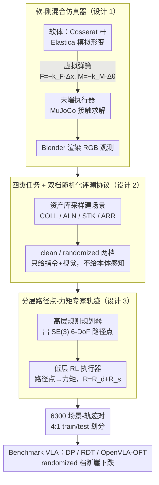

# ManiSoft: Towards Vision-Language Manipulation for Soft Continuum Robotics

**会议**: ICML 2026  
**arXiv**: [2605.18617](https://arxiv.org/abs/2605.18617)  
**代码**: https://buaa-colalab.github.io/ManiSoft （项目页）  
**领域**: 机器人 / 软体连续体机械臂 / VLA Benchmark  
**关键词**: 软体机械臂, vision-language manipulation, benchmark, 混合仿真, 分层专家轨迹

## 一句话总结
本文针对"视觉-语言操作研究几乎只覆盖刚性臂、忽视软体连续体臂"这一空白，构建了 ManiSoft 基准：用"Cosserat 杆软体动力学 + MuJoCo 刚体接触 + 弹性力约束耦合"的混合仿真器，定义 4 类反映软臂控制难点的任务，并通过"高层规则规划器 + 低层 RL 力矩执行器"自动生成 6300 个场景与专家轨迹，系统揭示 DP/RDT/OpenVLA-OFT 在干净场景下中等可解（30% 左右），在随机化场景下断崖式下跌（最高跌 29.4 个点），失败根因在于无法从视觉估计本体感知态、也不会利用软体可形变性绕障。

## 研究背景与动机

**领域现状**：vision-language manipulation 已经成为 embodied AI 的核心，RLBench、ManiSkill、CALVIN、LIBERO、RoboVerse、RoboTwin 等基准把"看图说话→执行"的训练/评测做到了相当成熟。但这些基准里出现的机械臂**清一色是刚性臂**——关节角可读、运动学低维、感知到控制的链路简单直接。VLA 模型如 OpenVLA、$\pi$ 系列、RDT-1B、CogACT、DexVLA 也在此假设下迅速演化。

**现有痛点**：刚性臂在杂乱或狭窄空间里有结构性短板——关节硬约束意味着夹爪到达不了被障碍物挡住的目标，必须"绕到正面"才能抓。软体连续体臂（Cosserat 杆、气动/腱驱、低弹性模量材料）能整体弯曲变形、绕过障碍直达目标，但与之而来的是三个全新难题：(i) **无可靠本体感知**——软臂没有刚性关节编码器，得从外部视觉反推姿态；(ii) **底层执行是力矩/张力/气压**而非关节目标位姿，运动学逆解极复杂；(iii) **分布式执行器**让动作空间维度爆炸且高度耦合。这些问题让现成 VLA 直接迁移到软臂上几乎不能工作。

**核心矛盾**：刚性臂 VLA 的成熟假设（精确本体感知 + 低维关节空间 + 解析逆运动学）与软臂的物理现实（视觉本体感知 + 高维力矩空间 + 强耦合柔性动力学）几乎处处冲突，需要一个能"诚实暴露这些差异"的基准来牵引研究。

**本文目标**：(i) 提供能精确模拟弹性变形又能处理接触摩擦的软臂仿真器；(ii) 设计能区分"基础轨迹控制 / 精细位姿 / 接触密集堆叠 / 复杂避障"四类难点的任务；(iii) 给出可规模化的数据生成 pipeline 与 6.3k 条专家轨迹；(iv) 在该基准上 benchmark 主流 VLA 模型，定位失败模式。

**切入角度**：作者发现现有软体仿真器（Elastica、SOFA）擅长弹性动力学但接触建模弱，刚体仿真器（MuJoCo、SAPIEN、Habitat）擅长接触摩擦但不会变形——那就**把两类仿真器用一根"虚拟弹簧"耦合起来**：软体由 Elastica 模拟变形，末端执行器由 MuJoCo 模拟接触，二者通过 Hooke 律的弹性约束相互拉扯。专家轨迹也分而治之——高层规则规划器出 6-DoF 路径点、低层 RL 执行器把路径点翻译成力矩。

**核心 idea**：用"软-刚混合仿真 + 分层路径点-力矩专家"把软臂 VLA 研究做成可规模化的基准，并通过随机化清洁/复杂两档评测把现有 VLA 的失效模式暴露出来。

## 方法详解

### 整体框架
ManiSoft 由三块组成：(1) **混合仿真器**——把软臂建模为"软体（Cosserat 杆，Elastica 模拟）+ 末端执行器（MuJoCo 模拟）+ 弹性力约束（虚拟弹簧）"三段耦合体系；环境视觉由 Blender 渲染。(2) **四类任务**——Collecting (COLL，把目标物放进容器)、Alignment (ALN，6-DoF 精确摆位)、Stacking (STK，按尺寸大→小堆叠餐具)、Arrangement (ARR，按空间约束摆放并避障)。(3) **自动数据 pipeline**——程序化采样 263 个 3D 对象与候选抓取位姿构造干净/随机化场景，配合 GPT 模板生成多样化指令；专家轨迹用"高层规则规划器（出 SE(3) 路径点）+ 低层 RL 力矩执行器（追踪路径点）"两段式生成。最终发布 6300 条场景-轨迹对、109 个可操作物体 17 类、154 个障碍 35 类、平均轨迹 1272 步、4:1 train/test 划分。

### 关键设计

**1. 软-刚混合仿真器（Cosserat 杆 + MuJoCo + 弹性力约束）：用一根虚拟弹簧把两类仿真器拼起来**

软臂操作之所以难仿，是因为现有仿真器两边都缺一块——纯软体仿真（Elastica、SOFA）擅长弹性形变但接触建模弱，纯刚体仿真（MuJoCo、SAPIEN）擅长接触摩擦但不会变形。ManiSoft 没去重写一个新仿真器，而是把软臂解成两个耦合子系统各取所长。**软体**用 Elastica 离散为 $N$ 段 Cosserat 杆，外部驱动力矩 $\boldsymbol{\tau}_e\in\mathbb{R}^{N\times 3}$ 沿杆产生轴向/剪切/弯曲/扭转四种应变，进而生出内部力 $\mathbf{f}_i$ 与内部力矩 $\boldsymbol{\tau}_i$ 决定瞬时形变；**末端执行器**及其与环境的接触摩擦交给 MuJoCo 成熟的接触求解器。两者用一根零静长的虚拟弹簧耦合：当软体尖端与末端执行器的相对位移 $\Delta\mathbf{x}\in\mathbb{R}^3$、相对旋转 $\Delta\boldsymbol{\theta}\in\mathbb{R}^3$ 不为零时，按 Hooke 律产生恢复力与恢复力矩 $\mathbf{F}=-k_F\Delta\mathbf{x}$、$\mathbf{M}=-k_M\Delta\boldsymbol{\theta}$（$k_F, k_M$ 可调），把两边拉回协同运动。视觉观测由 Blender 用固定相机渲染 RGB。这根"软连接器"既保证了物理意义上的力闭合，又解耦了两个仿真器各自的数值积分，使 STK 这种长时密集接触任务真正可仿。

**2. 四类任务 + 双档随机化的评测协议：故意不给本体感知，逼模型从视觉看形变**

刚臂基准通常"为模型好"把关节角作为本体感知喂进去，但真实软臂根本没有刚性关节编码器。ManiSoft 做了个反常但诚实的决定——每个时间步 $t$ 只给指令 $\mathbf{L}$ 和视觉观测 $\mathbf{V}_t$、不给软体内部状态，策略输出 $\mathbf{A}_t=(\boldsymbol{\tau}_e, S)$（外部力矩 + 夹爪开合 $S\in\{0,1\}$），环境自回归推进到成功或超 $T$ 步。任务设成四档难度阶梯：COLL（放进容器，不需精细朝向，最易）、ALN（6-DoF 精确摆位）、STK（按尺寸大→小堆叠，需持续接触，最难）、ARR（按空间约束摆放并避障）。每个任务再做 clean / randomized 两档：clean 只有目标物、固定布局外观；randomized 加干扰障碍、随机纹理光照，还为每个物体生成多种属性化描述（"yellow bottle"/"bottle with green cap"/"tall plastic bottle"）增强语言多样性。不给本体感知正好把软臂最薄弱、最需研究的"从视觉估形变"能力顶到台前，双档随机化把"刷固定场景成功率"和"真鲁棒泛化"区分开，四任务阶梯则给出诊断信号——COLL 高但 ALN/STK 低就说明模型能粗定位不能精控。

**3. 分层路径点-力矩专家轨迹生成（高层规则 + 低层 RL）：把逻辑结构和动力学跟踪分开学**

直接用 RL 学整段力矩序列扛不住高维耦合加长时距稀疏奖励，纯规则力矩控制器又应付不了软体动力学的不确定性。ManiSoft 把生成拆成两步：**高层**用人工规则规划器出一串 6-DoF 路径点 $\hat P\in\mathrm{SE}(3)$，编码"靠近 / 抓取 / 抬起"等语义子目标；**低层**用一个 RL 执行器以（目标位姿 $\hat P$、若干段本体感知、当前位姿 $P$）为输入、输出力矩 $\boldsymbol{\tau}_e$，位姿差用 SE(3) 对数 $[\mathbf{d}_p,\mathbf{d}_r]=\log(P^{-1}\hat P)$ 度量、标量距离 $d=\|\mathbf{d}_p\|_2+\alpha\|\mathbf{d}_r\|_2$。奖励有两项：位姿差奖励 $R_d=-d+k_1\mathbbm{1}_{d<d_1}+k_2\mathbbm{1}_{d<d_2}$ 在接近目标时按阶梯加奖，稳定性奖励 $R_s=-\mathrm{sgn}(\partial d/\partial t)\cdot\beta$（仅当 $d\le D$ 时生效）在靠近目标后只奖励"误差还在减小"、惩罚震荡，最佳超参经消融定为 $\beta=1, D=0.3$。逻辑结构留给规则、动力学跟踪留给 RL，各做所长；$R_s$ 是关键细节——加了它末端位姿差波动显著减小、轨迹更光滑，下游模仿学习才更可用。训练好的执行器单步成功率达 54%，组合 roll out 即得完整专家轨迹。

### 损失函数 / 训练策略
- 低层 RL 执行器：总奖励 $R=R_d+R_s$，含位姿差与稳定性两项，最佳 $\beta=1, D=0.3$ 经消融选定。
- 数据规模：6300 条场景-轨迹对（2100 clean + 4200 randomized），平均 40 条语言指令/场景，4:1 train/test 划分。
- 评测策略：DP、RDT 从零训，OpenVLA-OFT 用 LoRA 微调；指标为 success rate 与 #Steps。

## 实验关键数据

### 主实验
四任务在 clean 与 randomized 两档下的成功率（ACC%）与完成步数 #Steps：

| 模型 | COLL ACC | ALN ACC | STK ACC | ARR ACC | 平均 ACC | 平均 #Steps |
|------|----------|---------|---------|---------|----------|-------------|
| **Clean** | | | | | | |
| DP (~400M) | 63.0 | 18.3 | 15.0 | 30.0 | 31.6 | 520 |
| RDT (~1B) | 13.8 | 11.7 | 10.0 | 1.3 | 9.2 | 496 |
| OpenVLA-OFT (~400M) | 45.4 | 25.0 | 20.0 | 31.3 | **30.4** | 527 |
| **Randomized** | | | | | | |
| DP | 3.8 | 1.7 | 2.5 | 0.6 | 2.2 | 613 |
| RDT | 1.2 | 4.2 | 0.0 | 1.3 | 1.6 | 368 |
| OpenVLA-OFT | 32.7 | 26.7 | 35.0 | 13.7 | **27.0** | 554 |

clean 设置下 DP 与 OpenVLA-OFT 大致打平（31.6% vs 30.4%）、RDT 远落后（9.2%）——后者 1B 参数对 6.3k 样本明显过拟合。task 维度上 COLL 永远最容易（不需精细朝向），STK 最难（堆叠需要持续接触控制）。**真正的诊断信号在随机化设置**：DP 暴跌 29.4 个点至 2.2%、RDT 跌 7.6 点至 1.6%，OpenVLA-OFT 只跌 3.4 点保持 27.0%——pretrained VLM 主干带来的视觉泛化优势在此显现得淋漓尽致。

### 消融实验
ARR 任务按物体类别拆解（randomized 设置）：

| 模型 | Rubik's Cube ACC | Bottle ACC | Pen Cup ACC | Shoe ACC | ARR 平均 |
|------|------------------|------------|-------------|----------|----------|
| DP | 0.0 | 0.0 | — | 2.5 | 0.6 |
| RDT | 0.0 | 2.5 | 2.5 | 0.0 | 1.3 |
| OpenVLA-OFT | 15.0 | 7.5 | 25.0 | 7.5 | 13.7 |

低层 RL 执行器稳定性奖励 $R_s$ 的超参消融（控制稳定性 = 末端位姿差方差，越小越好）：

| $D \backslash \beta$ | 0 | 0.5 | 1 | 1.5 |
|-----|-----|------|------|------|
| 0.05 | 0.176 | 0.157 | 0.074 | 0.121 |
| 0.10 | 0.176 | 0.149 | 0.153 | 0.071 |
| 0.20 | 0.176 | 0.070 | 0.135 | 0.064 |
| 0.30 | 0.176 | 0.145 | **0.053** | 0.091 |
| 平均 | 0.176 | 0.130 | 0.104 | **0.087** |

### 关键发现
- **物体几何决定难度排序**：Rubik's Cube（规则方形）成功率始终最高，shoe（不规则非凸）始终最低，且随机化后 shoe 全部跌破 10%，提示几何复杂度与抓取稳定性的耦合是软臂瓶颈。
- **OpenVLA-OFT 的"stop-moving"是简单任务掉点的根因**：可视化显示它经常在成功抓取后停滞不动，导致 COLL 任务 ACC (45.4%) 反而低于 DP (63.0%)，作者归因为夹爪闭合产生的细微视觉变化诱导出了"自我抑制"反馈环。
- **失败模式 1：本体感知歧义**——目标靠近基座时需要大幅弯曲，内部力矩占主导，策略没法准确估姿态导致残余控制力不足，末端横向漂移。
- **失败模式 2：不会"用软"**——遇障碍时策略直接把臂伸向目标导致碰撞，而不是利用软体形变绕过障碍，说明现有 VLA 完全没学到软臂特有的形变可用性，需要更多针对性专家数据或物理先验。

## 亮点与洞察
- **"两类仿真器 + 虚拟弹簧"是个非常巧妙的工程抉择**：既不重新写一个能同时支持变形与接触的新仿真器（工作量极大、稳定性难调），又把现有最优组件的能力以模块化方式拼起来，是软体机器人仿真的可复用范式。
- **故意不提供本体感知**：这是基准设计层面的勇敢选择——大多数基准会"为模型好"把所有可用信息给上，ManiSoft 选择反映物理真实，直接逼出"从视觉估姿态"这一软臂特有研究问题，会引导社区开发针对性方法（如视觉本体感知头、形变估计模块）。
- **分层 + 稳定性奖励的细节值得借鉴**：高层规则 + 低层 RL 已是常见组合，但 $R_s$ 用"位姿差变化率的符号"来鼓励单调收敛、且只在 $d\le D$ 时生效，这种"近端稳定整形"思路在其他高自由度连续控制（柔性手、绳缆驱动）也能照搬。
- **诊断梯度的设计很有教学价值**：四任务从基础轨迹到复杂避障构成清晰难度阶梯，加上 clean/randomized 双档，使 benchmark 结果天然可解释——能直接告诉研究者"模型卡在哪一层"。

## 局限与展望
- **绝对成功率仍偏低（最高 27%）**：基准本身很有挑战性，但也意味着距离"可用方法"还远，短期内能否吸引到足够算力的方法投入是基准存活的关键。
- **物理保真度的代价**：Cosserat 杆 + MuJoCo + Blender 三件套渲染与仿真都不便宜，平均轨迹 1272 步意味着训练数据生成与策略 rollout 都很慢，可能阻碍大规模 RL/online 算法在此基准上的应用。
- **指令多样性有限**：作者用 GPT 模板加属性槽位生成，丰富度强于单 canonical 描述但仍是模板派生，可能低估真实自然语言带来的难度。
- **未提供 sim-to-real**：所有评测都在仿真内，软臂的 sim-to-real 隔阂以材料参数差异闻名，benchmark 上 SOTA 的方法是否真能驱动真实硅胶/气动软臂仍未验证。
- **基线选择偏少**：只测了 DP、RDT、OpenVLA-OFT 三家，没纳入 $\pi$ 系列等更新的 VLA，纵向对比不够全。

## 相关工作与启发
- **vs. LIBERO / CALVIN / RLBench**：这些都是刚臂语言条件操作基准，假设精确本体感知，与 ManiSoft 形成"刚 vs 软"的对照基准对。
- **vs. ManiSkill / RoboTwin / RoboVerse**：在场景多样化、双臂、多仿真器上更广，但全是刚体；ManiSoft 复用了 RoboTwin-OD 的资产库，但任务定义与仿真栈完全针对软体重做。
- **vs. Elastica-RL-Control**：本文的低层 RL 执行器奖励函数直接改编自它，但把"欧氏距离"替换为 SE(3) 对数距离以处理姿态，是合理的工程升级。
- **vs. Soft DAgger / Centurelli LSTM 控制器**：这些工作集中在软臂**底层控制**，缺乏 vision-language 入口；本文把视觉-语言推理与软体底层控制贯穿起来，是更接近"通用具身"愿景的设定。
- **vs. OpenVLA-OFT / DexVLA / RDT**：这些 VLA 主战场是刚臂，本文证明它们直接迁移到软臂会暴露出 stop-moving、本体感知失真、不会用软体形变等新型失败模式，提示后续 VLA 训练需要混入软臂数据或加入形变估计模块。

<!-- RELATED:START -->

## 相关论文

- [\[CVPR 2026\] SaPaVe: Towards Active Perception and Manipulation in Vision-Language-Action Models for Robotics](../../CVPR2026/robotics/sapave_active_perception_manipulation_vla_roboti.md)
- [\[ICML 2026\] Spatial Memory for Out-of-Vision Manipulation in Vision-Language-Action](spatial_memory_for_out-of-vision_manipulation_in_vision-language-action.md)
- [\[NeurIPS 2025\] Bridging Embodiment Gaps: Deploying Vision-Language-Action Models on Soft Robots](../../NeurIPS2025/robotics/bridging_embodiment_gaps_deploying_vision-language-action_models_on_soft_robots.md)
- [\[ICML 2026\] Contrastive Representation Regularization for Vision-Language-Action Models](contrastive_representation_regularization_for_vision-language-action_models.md)
- [\[ICLR 2026\] MoMaGen: Generating Demonstrations under Soft and Hard Constraints for Multi-Step Bimanual Mobile Manipulation](../../ICLR2026/robotics/momagen_generating_demonstrations_under_soft_and_hard_constraints_for_multi-step.md)

<!-- RELATED:END -->
