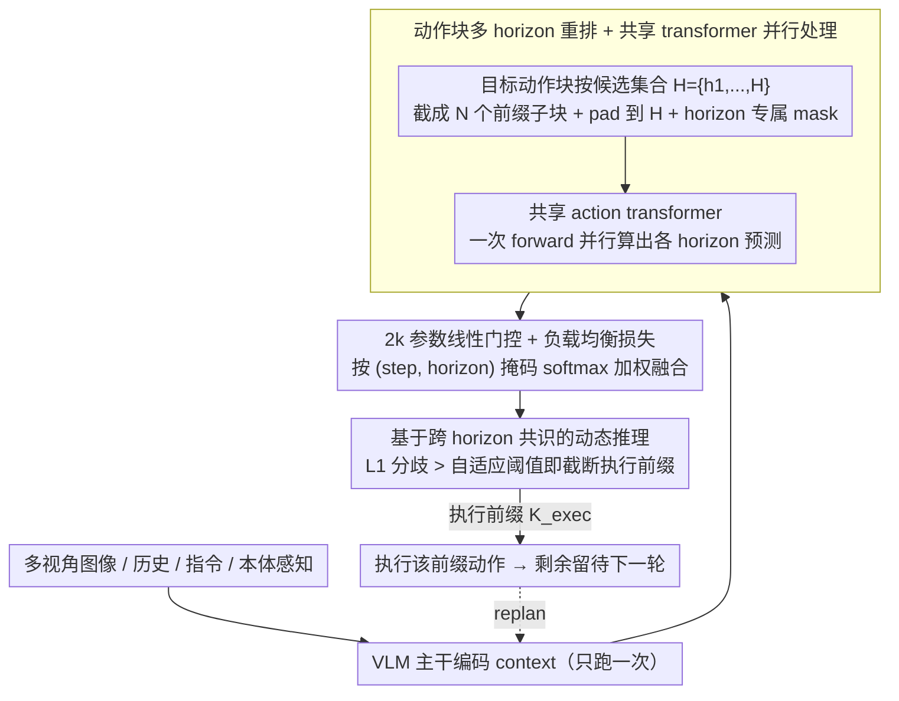

# Mixture of Horizons in Action Chunking

**会议**: ICML 2026  
**arXiv**: [2511.19433](https://arxiv.org/abs/2511.19433)  
**代码**: 待确认  
**领域**: 机器人 / VLA / Action Chunking  
**关键词**: VLA, 动作分块, 多尺度 horizon, 门控融合, 动态推理

## 一句话总结
本文针对 VLA 模型中"动作块长度（horizon）选择"导致的"长视野规划 vs. 短视野精控"权衡问题，提出 Mixture of Horizons (MoH)：把同一条动作块拆成多个不同长度的子块，用共享的 action transformer 并行预测，再用 2k 参数的线性门控融合，配合负载均衡损失和"跨 horizon 共识"的动态推理，使 $\pi_{0.5}$ 在 LIBERO 上首次达到 99% 平均成功率，并把吞吐量提高到基线的 2.5 倍。

## 研究背景与动机

**领域现状**：现代 Vision-Language-Action (VLA) 模型（如 $\pi_0$、$\pi_{0.5}$、OpenVLA-OFT、StarVLA）几乎清一色采用 Zhao 等人提出的 action chunking 策略——一次性预测未来 $H$ 步动作 $A_t=(a_t,\dots,a_{t+H-1})$，再以 full-attention 的轻量 action transformer 处理这些动作 token，理论基础是平滑执行、减少策略调用次数、利用时间结构信息。"VLM 主干 + chunk 化动作头"已经成为事实上的标配。

**现有痛点**：作者在 LIBERO 上把 $\pi_0$ 的 horizon 分别设为 10/20/30，在 Spatial、Object、Goal、Long 四个任务集上跑了一遍，结果发现一个朴素却普遍被忽视的事实——成功率对 $H$ 极度敏感，且不同任务的最优 $H$ 不一样：Long 任务偏好长 horizon（要规划），Spatial/Object 偏好短 horizon（要精控）。任何固定 $H$ 都注定在某一类任务上吃亏。

**核心矛盾**：长 horizon → 远期可规划但每一步精度被"摊薄"；短 horizon → 精控但缺乏前瞻。这是 chunk-based 表达本身带来的结构性 trade-off，光靠调超参解决不了，而且部署时还没法在线切换 horizon。

**本文目标**：(i) 系统刻画 horizon 对 VLA 的影响；(ii) 用单一模型同时拿到长视野与短视野的好处；(iii) 让推理时的 chunk 长度能根据置信度自适应缩放。

**切入角度**：既然不同 horizon 各擅胜场，那就别选——把多个 horizon 同时放进训练，让模型学会"该长就长、该短就短"。关键是要让这件事几乎零成本：VLA 计算瓶颈在 VLM 主干，action transformer 本身只有 ~300M 参数，多 horizon 的并行 forward 走 tensor parallelism 几乎不增加 wall-clock。

**核心 idea**：把动作块按多个候选长度 $\mathcal{H}=\{h_1,\dots,h_N\}$ 重排成多个子段，用同一个 action transformer 并行预测，再用 2k 参数线性门控按 step 与 horizon 加权融合，副产物——跨 horizon 的预测一致性天然成为执行置信度信号，可驱动动态截断。

## 方法详解

### 整体框架
给定时刻 $t$ 的多视角图像 $V_t$、历史 $h_{<t}$、指令 $T$、本体感知 $s_t$，VLM 主干编码成 context；接着 MoH 把目标动作块 $A_t\in\mathbb{R}^{H\times d_a}$ 拆成 $N$ 个长度递增的截断子块 $A_t^{(h)}=(a_{t,1},\dots,a_{t,h})$，对每个子块 padding 到 $H$ 并配 horizon-specific attention mask（mask 掉 $k>h$ 位置），由**共享的 action transformer 在一次 forward 中并行处理**所有 horizon，得到 horizon-wise 预测 $\hat A_t^{(h)}$；最后一个线性 gating head 输出 logits $g_{t,k,h}$，经掩码 softmax 得到融合权重 $\alpha_{t,k,h}$，组合出最终预测 $\hat a_{t,k}=\sum_{h:k\le h}\alpha_{t,k,h}\hat a_{t,k}^{(h)}$。整套设计对 flow-matching（$\pi_0$/$\pi_{0.5}$/StarVLA）与一步回归（$\pi_{\text{reg}}$）通用，对 backbone 零侵入。推理时再把多 horizon 的预测分歧当成置信度信号驱动动态截断，三个贡献模块依次串成一条 pipeline：

### 关键设计

**1. 动作块多 horizon 重排 + 共享 transformer 并行处理：把"选一个 horizon"变成"同时用多个 horizon 训练"**

固定 horizon 之所以两头不讨好，是因为一条动作块只有一个长度，要么长得能规划、要么短得能精控。MoH 干脆不选：固定最大 horizon $H$，定义候选集合 $\mathcal{H}=\{h_1,\dots,h_N=H\}$，对每个 $h$ 从同一条目标块里截出前缀 $A_t^{(h)}\in\mathbb{R}^{h\times d_a}$，统一 pad 到 $H$ 并配一个 horizon-specific attention mask 把 $k>h$ 的位置屏蔽掉。所有 horizon 共享同一组 action transformer 权重和同一份 VLM context，靠 batching + 并行 attention 在一次 forward 里全部算完。训练时损失分两路：融合预测损失 $L_{\text{mix}}$ 盯着最终输出的质量，各 horizon 独立损失 $L_{\text{ind}}=\sum_h L^{(h)}$ 则保证每个分支单拎出来也能用。

这套设计之所以几乎零成本，是因为 VLA 的算力瓶颈全在 VLM 主干，而它只跑一次；action transformer 本身只有 ~300M 参数，多 horizon 并行 forward 的额外开销被 tensor parallelism 吃掉，wall-clock 几乎不变。共享权重还有个隐含好处——它强迫同一个网络真正学会"既能短又能长"，而不是简单堆几个独立模型做 ensemble；padding + mask 则让所有 horizon 走齐序列长度，避免动态 shape 拖慢 GPU。

**2. 2k 参数线性门控 + 负载均衡损失：在每个时间步按"谁更可信"加权融合，并防止门控只宠少数 horizon**

有了多个 horizon 的预测后，怎么把它们合成一条最终动作？MoH 在共享 transformer 顶部只加一个**线性层**（仅 ~2k 参数），输出每个 (step, horizon) 的 logits $g_{t,k,h}$；对每个时间步 $k$ 只保留 $h\ge k$ 的有效 horizon 做掩码 softmax，得到权重 $\alpha_{t,k,h}=\exp(g_{t,k,h})/\sum_{h':k\le h'}\exp(g_{t,k,h'})$，再加权求和。门控这么轻是刻意的——几乎所有信息已经编码在共享 transformer 的隐状态里，门控只需做一次轻量加权决策，结构一复杂反而过拟合。

光有门控还不够：它很容易塌缩成只青睐某几个 horizon，让长 horizon 形同虚设。为此引入 MoE 风格的负载均衡损失：按 horizon 边界把时间轴切成区间 $S_i$，在每个区间统计各 horizon 的平均使用率 $\bar\alpha_h^{(i)}$，再取使用率的均方变异系数

$$L_{\text{bal}}=\frac{1}{|\mathcal{I}|}\sum_i \mathrm{CV}^2(\{\bar\alpha_h^{(i)}\}_h),$$

最小化它就逼门控公平分配。消融印证了这一项的作用：去掉 $L_{\text{bal}}$ 仍优于基线（98.5%），但加上后 Long 任务再涨约 1.6 个点——正是它让长 horizon 真正被门控调用、而不是被冷落。总目标 $L=L_{\text{mix}}+\lambda_{\text{ind}}L_{\text{ind}}+\lambda_{\text{bal}}L_{\text{bal}}$，默认 $\lambda_{\text{ind}}=1$、$\lambda_{\text{bal}}=10^{-3}$。

**3. 基于跨 horizon 共识的动态推理：用多分支的"分歧度"自适应决定执行多长前缀**

以往 chunk-based VLA 把执行前缀写死（LIBERO 默认 5、RoboTwin 20），既浪费又脆——平稳运动其实可以一口气多执行几步省下 VLM 调用，而决策关键帧附近又必须频繁 replan 才稳。MoH 不用额外训练就能把这件事做对：在每步 $k$，把每个 horizon-wise 预测 $\hat a_k^{(h)}$ 看成对融合结果 $\hat a$ 的"投票者"，用加权 $\ell_1$ 分歧度量它们的共识

$$\bar d_k=\sum_{h\in\mathcal{H}_k}\alpha_{k,h}\cdot\|\hat a-\hat a_k^{(h)}\|,\qquad \mathcal{H}_k=\{h\ge k\}.$$

先用前 $n$ 步分歧的均值乘缩放因子 $r$ 得到数据自适应阈值 $\textit{thres}=\mathrm{Mean}(\{\bar d_k\}_{k=1}^n)\cdot r$；再从 $k=n+1$ 起逐步检查，一旦有效 horizon 数小于 $m$ 或 $\bar d_k>\textit{thres}$ 就 break，把执行前缀 $K_{\text{exec}}$ 定在此处，剩下的动作留到下一轮 replan。这样自然形成"运动平稳时长前缀、决策关键处短前缀"的自截断行为。妙处在于这个置信度信号完全是多 horizon 设计的副产品，零额外参数、零额外训练，实测 $\pi_{0.5}$+MoH 在 2.5× 吞吐下仍超固定前缀基线，是名副其实的"免费午餐"。

### 损失函数 / 训练策略
- 总目标：$L=L_{\text{mix}}+\lambda_{\text{ind}}L_{\text{ind}}+\lambda_{\text{bal}}L_{\text{bal}}$，$\lambda_{\text{ind}}=1$、$\lambda_{\text{bal}}=10^{-3}$。
- 对 flow-matching 策略，$L_{\text{mix}}$ 与 $L^{(h)}$ 都是速度匹配损失 $\|v_\theta(A_t^{(\tau)},\tau,\cdot)-(A_t-\epsilon)\|_2^2$；对一步回归策略是 $\ell_1$；对分类型是交叉熵。
- 默认 $\mathcal{H}=\{3,6,\dots,30\}$（步长 $d=3$，共 10 个 horizon），在 4 张 A100 上 30k 迭代、batch size 32，单次训练 <10 小时。

## 实验关键数据

### 主实验

LIBERO（4 任务集、500 trial/集、统一执行前 5 步）：

| 基线 | Spatial | Object | Goal | Long | 平均 |
|------|---------|--------|------|------|------|
| $\pi_{\text{reg}}$ (3B, 30k) | 97.8 | 98.2 | 94.6 | 90.2 | 95.2 |
| $\pi_{\text{reg}}$ + MoH | 99.0 (↑1.2) | 98.8 (↑0.6) | 96.4 (↑1.8) | 91.4 (↑1.2) | **96.4 (↑1.2)** |
| $\pi_0$ (3B, 30k) | 97.4 | 98.2 | 95.4 | 84.2 | 93.8 |
| $\pi_0$ + MoH | 97.6 (↑0.2) | 98.8 (↑0.6) | 96.4 (↑1.0) | 87.4 (↑3.2) | **95.1 (↑1.3)** |
| StarVLA (3B, 30k) | 98.0 | 98.2 | 95.8 | 91.4 | 95.9 |
| StarVLA + MoH | 98.4 | 99.6 | 97.6 | 92.4 | **97.0 (↑1.1)** |
| $\pi_{0.5}$ (3B, 30k) | 98.8 | 99.0 | 97.6 | 95.4 | 97.7 |
| $\pi_{0.5}$ + MoH | 98.8 | **100** | 98.8 | 98.4 (↑3.0) | **99.0 (↑1.3)** |

$\pi_{0.5}$+MoH 仅 30k 迭代就以 99% 平均成功率刷新 LIBERO SOTA（此前最好为 Spatial Forcing 7B 的 98.5%），且模型只有 3B。Long 任务上 +3.0 是最大单点提升，恰好印证 MoH 真正缓解了"长 horizon 才能长规划"的短板。RoboCasa 五任务上 GR00T+MoH 平均涨 3.4 个点（28.0→31.4），证明在远未饱和的家庭场景同样有效。RoboTwin 2.0 七任务也观察到 easy/hard 两种模式下 $\pi_0$+MoH 一致最优。

### 消融实验

固定 $H_{\max}=30$，所有变体在 $\pi_{0.5}$ 上跑：

| 配置 | Spatial | Object | Goal | Long | 平均 | 说明 |
|------|---------|--------|------|------|------|------|
| $\pi_{0.5}$ baseline ($\mathcal{H}=\{30\}$) | 98.8 | 99.0 | 97.6 | 95.4 | 97.7 | 单 horizon |
| + MoH, $d=10$（3 个 horizon） | 98.8 | 99.8 | 97.6 | 96.8 | 98.3 | 仅 3 个 horizon 已涨 0.6 |
| + MoH, $d=3$（10 个 horizon） | 98.8 | 100 | 98.8 | 98.4 | **99.0** | 默认配置，最佳 |
| + MoH, $d=1$（30 个 horizon） | 99.0 | 99.4 | 98.4 | 96.2 | 98.3 | 过密反而下降 |
| + MoH 10 个相同 horizon ($H=30$) | 98.6 | 99.4 | 98.6 | 94.8 | 97.9 | 排除"ensemble effect" |
| + 仅时间维 loss reweight，无 MoH | 99.2 | 99.6 | 99.2 | 94.4 | 98.1 | Long 反而掉，未根治 trade-off |
| + MoH，无门控用均值融合 | 98.8 | 99.2 | 98.6 | 96.8 | 98.4 | 最朴素 MoH 已可用 |
| + MoH，无 $L_{\text{bal}}$ | 98.2 | 100 | 99.0 | 96.8 | 98.5 | 平衡损失主要补 Long |

### 关键发现
- **horizon 多样性才是关键，不是"多分支 ensemble"**：10 个相同 $H=30$ 的分支只能把均值从 97.7% 抬到 97.9%，而 10 个不同 horizon 涨到 99.0%，且只在 Long 任务上拉得开差距。
- **3 个 horizon 已经够用，10 个最佳**：从 1 个加到 3 个最大单步收益，加到 10 个达峰，30 个反而下滑——说明 horizon 集合的"密度"存在最优区间，过密会让训练信号互相干扰。
- **loss reweighting 不能替代 MoH**：单纯按 step 加权可以改 Spatial/Object/Goal，但让 Long 进一步退化（95.4→94.4），证实 MoH 的提升不来自隐式 loss 重权。
- **动态推理是免费午餐**：$\pi_{0.5}$+MoH 在动态截断（$r=1.1$）下吞吐 2.5×、平均执行步数随场景在简单运动时拉长、决策点变短，性能仍超固定前缀基线。

## 亮点与洞察
- **把"超参选择"问题变成"模型内部决策"问题**：horizon 一直被当成需要 grid search 的脆弱超参，MoH 干脆把多个 horizon 全塞进训练让门控学习选择，是一种很优雅的去超参化思路，可直接迁移到 diffusion step 数、history length、temporal stride 等其它"必须选一个"的离散尺度。
- **MoE 思想从 expert 维迁到 horizon 维**：本文证明 MoE 的"门控 + 负载均衡"模板换个变量轴照样有效。负载均衡用 $\mathrm{CV}^2$ 而非传统 KL/熵的细节也值得借鉴——它对 horizon 数变化更稳定。
- **跨预测一致性 = 内生置信度**：以往 chunk-based 模型靠固定前缀执行，本文把多 horizon 的预测分歧当成 confidence 信号驱动自截断，整个过程**零额外训练、零额外参数**，是 MoH 设计的"副产品赚到"——这种"用模型内多视角差异做不确定性估计"的思路在分类模型里也有先例（如 deep ensemble），用到序列动作预测里还是新颖的。
- **几乎零开销**：2k 额外参数 + 一次 forward 共享多分支，对 VLA 这种 VLM 主干占大头的架构尤其友好，使该方法成为标准 chunk-based VLA 的"应当默认开启"组件。

## 局限与展望
- **只对 full-attention action transformer 有效**：纯 causal 自回归（如某些 token-level VLA）无法在一次 forward 中得到不同 horizon 的并行预测，需要做架构调整。
- **horizon 集合仍需手工挑**：虽然消融给出"stride=3、$H_{\max}=30$"的经验最优，但跨平台/跨任务最优值未必稳定，理想做法是让 $\mathcal{H}$ 也可学。
- **评估集中在桌面级 manipulation**：LIBERO/RoboTwin/RoboCasa 都偏短到中等 horizon，论文未涉及真正长时距任务（如多分钟整理房间），MoH 在更极端长 horizon 下是否仍能拉开差距尚未验证。
- **门控可解释性有限**：作者在附录给出 horizon 使用率统计，但具体什么场景偏好哪个 horizon、是否可通过指令显式控制 horizon 偏好，留待后续。

## 相关工作与启发
- **vs. ACT (Zhao 2023)**：ACT 首次提出 chunk-based prediction，固定 $H$；本文指出固定 $H$ 是性能瓶颈，给出多 horizon 解。
- **vs. CogACT (Li 2024)**：CogACT 用相似度加权融合**同一 horizon 内**重叠帧；MoH 融合的是**不同 horizon**的预测，正交且互补。
- **vs. $\pi$ 系列 / OpenVLA-OFT**：这些工作专注 backbone（flow-matching、PaliGemma、OFT 微调），MoH 不动 backbone，作为通用 chunk 模块插上即用，可与它们叠加增益。
- **vs. Switch Transformer / MoE**：思想血缘明显——门控 + 负载均衡损失直接借鉴；区别在 expert 替换为 horizon，意义从"扩容"变成"消除超参 trade-off"。
- **vs. 动态 action chunking / replan 文献**：以往动态 replan 靠值函数或 RL 信号；MoH 用同一模型的多 horizon 一致性免费得到置信度，无需额外训练。

<!-- RELATED:START -->

## 相关论文

- [\[ICLR 2026\] Real-Time Robot Execution with Masked Action Chunking](../../ICLR2026/robotics/real-time_robot_execution_with_masked_action_chunking.md)
- [\[NeurIPS 2025\] Reinforcement Learning with Action Chunking](../../NeurIPS2025/robotics/reinforcement_learning_with_action_chunking.md)
- [\[CVPR 2026\] Adaptive Action Chunking at Inference-time for Vision-Language-Action Models](../../CVPR2026/robotics/adaptive_action_chunking_at_inference-time_for_vision-language-action_models.md)
- [\[ICML 2026\] Neural Implicit Action Fields: From Discrete Waypoints to Continuous Functions for Vision-Language-Action Models](neural_implicit_action_fields_from_discrete_waypoints_to_continuous_functions_fo.md)
- [\[ICML 2026\] From Imagined Futures to Executable Actions: Mixture of Latent Actions for Robot Manipulation](from_imagined_futures_to_executable_actions_mixture_of_latent_actions_for_robot_.md)

<!-- RELATED:END -->
