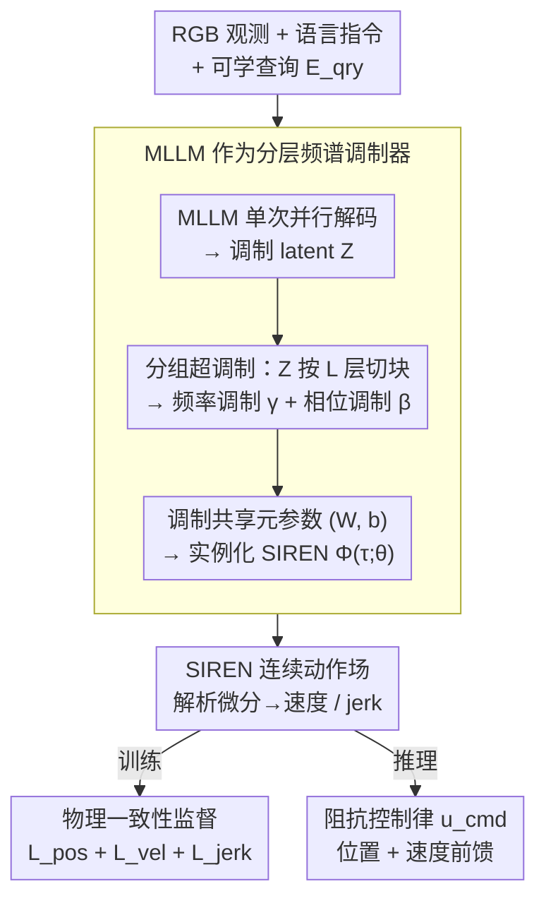

# Neural Implicit Action Fields: From Discrete Waypoints to Continuous Functions for Vision-Language-Action Models

**会议**: ICML 2026  
**arXiv**: [2603.01766](https://arxiv.org/abs/2603.01766)  
**代码**: 待确认  
**领域**: 机器人 / VLA / 具身智能  
**关键词**: VLA, SIREN, 隐式神经表示, 阻抗控制, 动作分块  

## 一句话总结
NIAF 把 VLA 模型的"动作块"从一串离散 waypoint 改成一个连续时间函数 $\mathcal{A}(\tau)=\Phi(\tau;\theta)$，让 MLLM 当 SIREN 的"分层频谱调制器"输出参数 $\theta$，从而获得 $C^\infty$ 平滑轨迹、任意频率查询和解析可导的速度/加加速度信号，在 CALVIN/LIBERO 上刷 SOTA 并在真机阻抗控制上消除抖动。

## 研究背景与动机

**领域现状**：VLA（Vision-Language-Action）模型已经从 RT-2 / OpenVLA 的单步 token 自回归预测，演进到 ACT / Diffusion Policy 的"动作分块"（action chunking），再到 BEAST / FAST 用 B-spline 控制点或 DCT 系数把动作序列压缩成离散 token。共同点是：最终动作都被表示成一串离散 waypoint，与训练数据采集频率绑死。

**现有痛点**：连续物理运动被强行离散化带来三个具体问题。(1) **时间分辨率绑死**：模型只能输出训练频率下的点，要更高频率执行就得插值，引入伪影；(2) **缺高阶动力学监督**：BEAST 把控制点量化进码本破坏了 spline 的解析连续性，其他方法直接没有高阶约束，速度曲线不连续导致电机抖动；(3) **无法解析微分**：离散表示要靠数值差分恢复速度，量化噪声被放大，无法给阻抗控制提供干净的前馈项 — 因此机器人只能用刚性位置控制，柔顺操作（如插装、堆叠）效果差。

**核心矛盾**：物理控制本质上是连续函数 $\mathcal{A}: t\to \mathbb{R}^{\dim}$，但 LLM-token 范式天然产出离散序列。两套数学结构错位 — 想要平滑速度/加加速度就必须放弃 token 化、或者付出量化损失。

**本文目标**：定义一个"动作=参数化连续函数"的新表示，把 MLLM 重新利用为"参数预测器"而非"waypoint 预测器"；同时保证表示本身 $C^\infty$ 连续、解析可导，使得阻抗控制所需的位置+速度前馈一次性可得。

**切入角度**：神经隐式表示（INR）在 NeRF 里已经证明能用连续函数高保真表示信号；SIREN（sinusoidal representation network）的 $\sin$ 激活让所有阶导数都解析可写。如果把动作块表示成 SIREN，再用 hypernetwork 机制让 MLLM 预测 SIREN 参数，就同时拥有 LLM 的语义理解与连续函数的物理光滑性。

**核心 idea**：动作分块 $\mathcal{A}(\tau)=\Phi(\tau;\theta)$，$\theta$ 由 MLLM 通过一组可学查询 embedding 映射出来；MLLM 输出的 latent 不是 waypoint，而是 SIREN 每层的"频率调制 $\gamma$ + 相位调制 $\beta$"，去扰动一份共享的 motion-prior 元参数。

## 方法详解

### 整体框架
两段式：

1. **多模态上下文编码**：把 RGB 观测 $\mathcal{o}$ + 指令 $\mathcal{t}$ + 一组可学查询 embedding $\mathbf{E}_{qry}\in\mathbb{R}^{Q\times d}$ 喂给预训 MLLM 解码器，**一次并行解码**输出 $\mathbf{Z}=\text{MLLM}(\mathbf{E}_{qry};\mathcal{o},\mathcal{t})\in\mathbb{R}^{Q\times d}$。
2. **动作流形解码**：把 $\mathbf{Z}$ 切成 $L$ 块、每块投影成 SIREN 第 $\ell$ 层的 $(\boldsymbol{\gamma}^{(\ell)}, \boldsymbol{\beta}^{(\ell)})$，去调制一份所有任务共享的 meta-参数 $(\mathbf{W},\mathbf{b})$，得到 instance-specific SIREN $\Phi(\tau;\theta)$；任意时间 $\tau\in[-1,1]$ 一查即可拿到位置，自动微分可拿速度、加速度、加加速度。

输入端只有一次 forward；推理时按需要采样 $K$ 个时间点 $\tau_k = -1 + \frac{2k}{K-1}$ 得到动作序列，与训练频率完全解耦。

### 关键设计

**1. MLLM 作为分层频谱调制器（hypernetwork）：用语义理解调制一份共享运动先验，而不是从零回归整套 SIREN 权重**

如果让 MLLM 直接吐出整个 SIREN 的权重，参数量会爆炸且极易过拟合到单一任务。NIAF 改成调制式：约束查询数 $Q = L\times (G+1)$，把 MLLM 输出 $\mathbf{Z}$ 按 SIREN 层分块，每层前 $G$ 个 token 投影成频率调制 $\boldsymbol{\gamma}^{(\ell)} = \text{Concat}(\psi_{\gamma_1}(\mathbf{Z}_{(\ell,1)}),\dots,\psi_{\gamma_G}(\mathbf{Z}_{(\ell,G)}))$，最后一个 token 投影成相位调制 $\boldsymbol{\beta}^{(\ell)} = \psi_\beta(\mathbf{Z}_{(\ell,bias)})$，再去扰动一份所有任务共享的 meta-参数：$\hat{\mathbf{W}}^{(\ell)} = \mathbf{W}^{(\ell)}\odot(\mathbf{1}+\boldsymbol{\gamma}^{(\ell)})$、$\hat{\mathbf{b}}^{(\ell)} = \mathbf{b}^{(\ell)} + \boldsymbol{\beta}^{(\ell)}$。

这套划分有清晰的物理意义——$\gamma$ 改频率、$\beta$ 改相位，"通用运动规律"沉淀在共享 $(\mathbf{W},\mathbf{b})$ 里、"任务差异"只放进轻量的 $(\gamma,\beta)$，接近 LoRA / 调制式 INR 的设计哲学。逐层（layer-wise）调制比单一全局 embedding 表达力更强，避免把所有任务信息挤过一个瓶颈。

**2. SIREN 实现 $C^\infty$ 连续 + 解析高阶导数：让位置、速度、加加速度共用一套同构导数链**

离散 waypoint 想拿速度只能数值差分，量化噪声被放大；ReLU 的 INR 不可二阶导，B-spline 控制点一量化又破坏可微性。SIREN 的 $\sin$ 激活是唯一能让所有阶导数解析闭式可写的选择：前向 $\mathbf{h}^{(\ell)} = \sin(\omega_0(\hat{\mathbf{W}}^{(\ell)}\mathbf{h}^{(\ell-1)} + \hat{\mathbf{b}}^{(\ell)}))$、$\mathcal{A}(\tau) = \mathbf{W}_{out}\mathbf{h}^{(L)} + \mathbf{b}_{out}$，速度顺着链式法则递归 $\dot{\mathbf{h}}^{(\ell)} = \cos(\mathbf{u}^{(\ell)})\odot(\hat{\mathbf{W}}^{(\ell-1)}\dot{\mathbf{h}}^{(\ell-1)})$，加加速度再求两次导即可。

因为 $\sin/\cos$ 导数同构，"位置预测器"同时就是"速度预测器"和"加加速度预测器"，从根上规避了数值差分噪声；频率因子 $\omega_0$ 让网络一开始就工作在合适的尺度上。这正是后面阻抗控制能用上干净前馈信号的前提。

**3. 物理一致性监督：用位置 + 解析速度 + jerk 正则把轨迹钉在物理上自洽**

光拟合 waypoint 还不够，柔顺操作需要的是平滑且物理一致的速度曲线。仿真因环境无速度反馈只用位置项 $\mathcal{L}_{\text{pos}} = \frac{1}{K}\sum_k \|\Phi(\tau_k) - \mathbf{a}_{gt,k}\|_2^2$；真机则额外加速度监督 $\mathcal{L}_{\text{vel}} = \frac{1}{K}\sum_k \|\frac{2}{T}\nabla_\tau \Phi(\tau_k) - \mathbf{v}_{gt,k}\|_2^2$（速度真值来自机器人 FOC 驱动器内部估计）和加加速度正则 $\mathcal{L}_{\text{jerk}} = \frac{1}{K}\sum_k \|(\frac{2}{T})^3 \nabla_\tau^3 \Phi(\tau_k)\|_2^2$，合成 $\mathcal{L}_{\text{real}} = \lambda_p \mathcal{L}_{\text{pos}} + \lambda_v \mathcal{L}_{\text{vel}} + \lambda_j \mathcal{L}_{\text{jerk}}$。

妙处在于位置和速度来自两个独立测量源（视觉 vs. FOC 编码器），同一个 $\Phi$ 被两者同时约束就形成一种 cross-signal 正则——鼓励模型丢掉任一信号里的不一致噪声，得到物理上自洽的轨迹；jerk 正则进一步压制电机震颤。推理时阻抗律 $\mathbf{u}_{cmd} = \mathbf{K}_p(\Phi(\tau)-\mathbf{a}_{curr}) + \mathbf{K}_d(\frac{2}{T}\nabla_\tau\Phi(\tau) - \mathbf{v}_{curr})$ 一次性吃到位置和速度前馈，这是离散表示给不了的。

### 损失函数 / 训练策略
- 仿真（CALVIN / LIBERO）：仅 $\mathcal{L}_{\text{pos}}$（环境无速度反馈），SIREN 的 $C^\infty$ 偏置当隐式正则；
- 真机：$\mathcal{L}_{\text{real}}$ 三项；
- 采用 single-pass 并行解码（不需 flow-matching 那种迭代去噪），推理速度优势明显；
- 不同 backbone 都做了实验：Florence-2 Large / Qwen3-VL / $\pi_{0.5}$。

## 实验关键数据

### 主实验

| 数据集 | 指标 | NIAF (ours) | 之前 SOTA | 提升 |
|--------|------|------|----------|------|
| CALVIN ABCD→D | Avg. Len | **4.66** | 4.62 (FLOWER) | +0.04 |
| CALVIN ABC→D | Avg. Len | **4.47** | 4.44 (FLOWER) | +0.03 |
| LIBERO-Object (Florence-2) | 成功率 % | **100.0** | 98.8 ($\pi_0$) | +1.2 |
| LIBERO 平均 (Florence-2) | 成功率 % | **97.9** | 95.7 (FLOWER) | +2.2 |
| LIBERO 平均 (Qwen3-VL) | 成功率 % | **97.7** | 96.6 (OFT) | +1.1 |
| 真机 Item Placement | 成功率 % | **90** | < (BEAST/OFT) | 显著 |
| 真机 Cup Stacking | 成功率 % | **80** | < (BEAST/OFT) | 显著 |

特别说明：NIAF 在 CALVIN 上以 0.77B 参数击败 9B 的 UniVLA，且**无大规模机器人数据预训**。

### 消融实验

| 配置 | 关键指标 | 说明 |
|------|---------|------|
| Full NIAF (Florence-2) | LIBERO-Long 95.5 | 完整模型 |
| BEAST-F (离散控制点) | LIBERO-Long ~86 | 量化丢精度 |
| BEAST-CT (连续控制点) | LIBERO-Long < NIAF | 排除"非离散即赢"的假设 |
| OFT (MLP 直出 waypoint) | LIBERO-Long < NIAF | 无解析连续性 |
| FAST (autoregressive) | LIBERO-Long < NIAF | token 串行慢且不光滑 |
| $\pi_{0.5}$-NIAF vs. $\pi_{0.5}$-BEAST | Shape Insertion 显著优 | 高精度插装下连续表示决定性 |

### 关键发现
- **连续 ≠ 不离散就够**：BEAST-CT 也是连续控制点，但仍落后 NIAF — 真正赢的是 $C^\infty$ 平滑 + 解析可导，而不仅仅是"不量化"。
- **真机速度曲线对比**：BEAST/OFT 的实测速度高频抖动并围绕 0 振荡（被迫用刚性位置控制），NIAF 的速度曲线则跟着真实运动趋势走非零均值连续线 — 这是阻抗控制可用的本质。
- **小模型 + 无预训也能赢**：0.77B 的 NIAF 在 CALVIN 上超过 9B UniVLA，说明对动作表示的结构性改进比单纯堆参数/数据更有效。

## 亮点与洞察
- **把 hypernetwork 思路用对了场景**：HyperVLA / Trans-INR 等已经证明 "MLLM 当 hypernet" 可行，但 NIAF 第一次把它用在"输出连续动作函数"这个原本被 token 范式占据的位置上，并把分层调制（每层 $\gamma,\beta$）做实 — 设计的物理意义清晰（$\gamma$ 改频率、$\beta$ 改相位）。
- **共享 motion-prior 是个 underrated 设计**：只调制不重写，让一份共享 $(\mathbf{W},\mathbf{b})$ 承载"机器人通用运动语法"，所有任务只学差异 — 既减少了 MLLM 的输出负担，也降低了过拟合到单一任务的风险。这一思路可以迁移到任何需要"快速任务适应"的生成场景。
- **解析微分作为系统级杠杆**：很多论文把"训练目标加速度/jerk 项"当成 nice-to-have，但 NIAF 让这件事变成"阻抗控制可不可用"的二元开关 — 离散 → 数值差分 → 噪声放大 → 必须刚性位置控制；连续可导 → 解析速度 → 阻抗律 (14) 直接可跑。这是从表示到系统的关键链条。

## 局限与展望
- 作者承认：NIAF 改的是 action head，不提升 base VLM 的高层推理 / 零样本泛化能力，未见物体/未见指令上的优势主要还来自 backbone 与数据多样性。
- 真机速度监督依赖 FOC 高频反馈，低成本平台只能数值差分位置 → 把示教噪声放大，可能反而降低 $\mathcal{L}_{\text{vel}}$ 质量。
- 适用域偏柔顺操作 / 长程 / 异频执行；对短程、固定频率、不要求光滑速度的简单 pick-and-place，离散 waypoint 仍然简单实用。
- $\pi_{0.5}$-NIAF 在 Towel Folding 上不如原生 $\pi_{0.5}$ — 替换 action head 会"遗忘"原 flow-matching head 的预训知识，如何安全继承预训仍是开放问题。

## 相关工作与启发
- **vs BEAST** (Zhou et al., 2026)：BEAST 用 B-spline 控制点压缩动作但量化进码本破坏可微；NIAF 用 SIREN 同时保留压缩与连续可导。
- **vs $\pi_0$ / GR00T N1** (Black et al., 2024; Bjorck et al., 2025)：flow-matching 要多步迭代去噪；NIAF 单步并行解码即可拿到完整连续函数 — 推理快、且天然平滑。
- **vs ACT / Diffusion Policy** (Zhao et al., 2023; Chi et al., 2025)：早期 chunking 解决了 trajectory coherence 但仍是 waypoint；NIAF 把分块本身重写成函数。
- **vs OpenVLA-OFT** (Kim et al., 2025)：OFT 用 MLP 把 query 投到一步 waypoint；NIAF 用 query 投到 SIREN 参数，表达力与可微性都更强。

## 评分
- 新颖性: ⭐⭐⭐⭐⭐ "MLLM 当 SIREN hypernet" + "分层频谱调制" + "解析动力学监督"三件套是真正的范式跃迁。
- 实验充分度: ⭐⭐⭐⭐⭐ CALVIN + LIBERO + 4 个真机任务 + 3 个 backbone，对比维度全；速度曲线可视化非常说明问题。
- 写作质量: ⭐⭐⭐⭐⭐ 三个 Definition 把范式转换讲得很清晰，公式推导链 (6)-(14) 完整且自洽。
- 价值: ⭐⭐⭐⭐⭐ 直击 VLA 行业从"能动"到"能柔顺动"的关键瓶颈，预期会被广泛采用为新的 action head 默认选项。

<!-- RELATED:START -->

## 相关论文

- [\[ICML 2026\] Discrete Diffusion VLA: Bringing Discrete Diffusion to Action Decoding in Vision-Language-Action Policies](discrete_diffusion_vla_bringing_discrete_diffusion_to_action_decoding_in_vision-.md)
- [\[ICML 2026\] LangForce: Bayesian Decomposition of Vision-Language-Action Models via Latent Action Queries](langforce_bayesian_decomposition_of_vision_language_action_models_via_latent_act.md)
- [\[ICML 2026\] StableVLA: Towards Robust Vision-Language-Action Models without Extra Data](stablevla_towards_robust_vision-language-action_models_without_extra_data.md)
- [\[ICML 2026\] Latent Reasoning VLA: Latent Thinking and Prediction for Vision-Language-Action Models](latent_reasoning_vla_latent_thinking_and_prediction_for_vision-language-action_m.md)
- [\[CVPR 2026\] Closed-Loop Neural Activation Control in Vision-Language-Action Models](../../CVPR2026/robotics/closed-loop_neural_activation_control_in_vision-language-action_models.md)

<!-- RELATED:END -->
