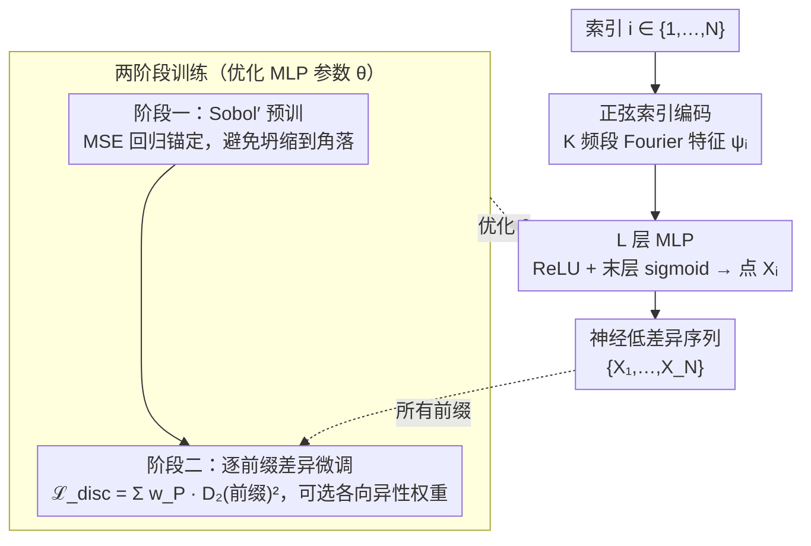

# Neural Low-Discrepancy Sequences

**会议**: ICML 2026  
**arXiv**: [2510.03745](https://arxiv.org/abs/2510.03745)  
**代码**: https://github.com/camail-official/neuro-lds  
**领域**: 科学计算 / 准蒙特卡洛 / 神经网络采样  
**关键词**: 低差异序列, 准蒙特卡洛, MLP, Sobol, 路径规划  

## 一句话总结
NeuroLDS 用一个把整数索引经正弦位置编码送入 MLP 的小网络，先回归 Sobol' 再用闭式 $L_2$ 差异损失在所有前缀上微调，得到第一个支持任意长度、可扩展的神经低差异序列，在 4 维差异指标、Borehole 积分、RRT 运动规划与 Black–Scholes PDE 求解上全面优于 Sobol'/Halton。

## 研究背景与动机

**领域现状**：准蒙特卡洛（QMC）依赖低差异点集 / 序列在 $[0,1]^d$ 上以接近 $\mathcal{O}(N^{-1})$ 的速率逼近 $\mathcal{O}(N^{-1/2})$ 的 IID Monte Carlo 误差。经典构造（Halton、Sobol'、rank-1 lattice、数字网）都基于数论 — 用素数基底的 radical-inverse 或 $\mathbb{F}_2$ 上的本原多项式生成方向数。最近 Message-Passing Monte Carlo (MPMC) 第一次把"找最小差异点集"形式化为可微分优化问题，用 GNN 在固定 $N$ 下端到端学一个映射，在小规模上拿到了历史最低差异值。

**现有痛点**：MPMC 只能给"集合"，不能给"序列"。一旦固定 $N=1024$ 训完，加一个点就要重训整个网络；而 RRT 这种增量采样规划器需要的是"边采边用、每个前缀都尽量均匀"的扩展型序列。另一方面，经典 LDS 的差异在 $N=2^m$ 处特别小，在 $2^m < N < 2^{m+1}$ 区间显著波动 — 例如 van der Corput 在前 $2^{14}$ 个点里，"非 2 的幂" $N$ 永远比对应的 $2^m$ 更差。

**核心矛盾**：QMC 里"低差异"和"可扩展"是一对结构性矛盾。集合可以全局优化拿到极低差异，但加点就破坏均匀；序列必须满足"每个前缀都差异低"的强约束，因此差异曲线天然会比同长度的最优集合差。MPMC 走的是前者，经典 Sobol'/Halton 走的是后者，但二者都不在同一条曲线上 Pareto 最优。

**本文目标**：训一个神经网络 $f_\theta: \{1,\dots,N\}\to [0,1]^d$，使得对任意前缀 $P\le N$，$\{f_\theta(i)\}_{i=1}^P$ 的差异都尽量小，并且差异要在 $N$ 全程光滑下降而非锯齿震荡。

**切入角度**：经典 LDS 的本质是"用 $i$ 的数字展开（radical-inverse / Gray-coded 方向数）当输入特征，做一次确定性变换得到点"。这天然适合用神经网络模仿 — 把 $i$ 喂进网络，让网络自己学一套"广义数字规则"。差异有闭式的 $L_2$ 核形式（公式 2），完全可微，因此可以直接当损失。

**核心 idea**：把"索引→点"用一个小 MLP 表示，输入端用 $K$-band 正弦特征模拟数字展开，训练分两阶段 — 先监督拟合 Sobol' 作 inductive bias（避免坍缩到角落），再以"所有前缀差异之和"为无监督损失微调。

## 方法详解

### 整体框架
NeuroLDS 是一个确定性序列生成器 $f_\theta: \{1,\dots,N\}\to [0,1]^d$。流水线：

1. 索引 $i$ → $K$-band 正弦位置编码 $\psi_i \in \mathbb{R}^{1+2K}$；
2. $\psi_i$ 经 $L$ 层 MLP（ReLU + 末层 sigmoid）→ 点 $\mathbf{X}_i \in [0,1]^d$；
3. 整体序列 $\{\mathbf{X}_1,\dots,\mathbf{X}_N\}$ 即为生成的 LDS。

训练分两阶段：先用 MSE 回归到 Sobol' 序列（pre-training），再以所有前缀差异的加权和为损失微调（fine-tuning）。

### 关键设计

**1. 正弦索引编码模仿数字展开：把整数 $i$ 暴露成多频率连续特征**

经典 LDS 之所以差异低，是因为它们把"$i$ 的不同位"映射到点的不同尺度上、彼此不打架——Halton 用 base-$b$ digit，Sobol' 用二进制方向位 $g_k(i)$。NeuroLDS 想让 MLP 自己学这套"数字规则"，第一步就得把整数索引变成网络好用的特征，于是借 NeRF / Transformer 的 Fourier feature 把 $i$ 编码成

$$\psi(i) = \big[\,i/N,\; \sin(2^k\pi i/N),\; \cos(2^k\pi i/N)\,\big]_{k=0}^{K-1} \in \mathbb{R}^{1+2K}$$

每一条频率轴 $2^k\pi$ 概念上就对应一个"基底位"，是 base-$b$ digit 的连续放松。这么做的好处是 MLP 可以自由组合多频段、产生经典构造里没有的新型数字规则；消融显示 $K\in\{8,16,32\}$ 越大差异曲线越平稳（小 $K$ 会大幅震荡），代价只是训练时间略增。

**2. 两阶段训练（Sobol' 预训 + 闭式 $L_2$ 差异微调）：先锚定再优化，避免坍缩**

直接拿差异损失从零训会出大问题——网络会塌缩到 $[0,1]^d$ 的一角（这是个退化解），消融里 2/3/4 维全部失败。NeuroLDS 用两阶段绕开它：阶段一先把网络回归到 Sobol' 序列（丢掉前 128 个 burn-in 点），

$$\mathcal{L}_{\text{pre}}(\theta) = \frac{1}{N}\sum_i \|f_\theta(\psi_i) - q_i\|_2^2$$

把网络拽到一个"已知不错"的初始流形上；阶段二再最小化所有前缀差异的加权和

$$\mathcal{L}_{\text{disc}}(\theta) = \sum_{P=2}^N w_P \cdot D_2^\bullet\big(\{\mathbf{X}_i\}_{i=1}^P\big)^2$$

其中 $D_2^\bullet$ 取核积分闭式（star / sym / ctr / per / ext / asd 任选），每条前缀复杂度 $\mathcal{O}(dN^2)$。Sobol' 拓扑作为强 inductive bias 是成功的关键——有它后续微调稳定收敛、确实进步，没它就坍缩；而这个差异损失天生可微、不依赖任何替代估计。

**3. 逐前缀差异损失 + 可选高维权重：把"序列"的扩展性约束直接写进目标**

序列和集合的根本区别在于：序列要求**每个前缀**都差异低，而经典 LDS 的差异只在 $N=2^m$ 处特别小、区间内锯齿震荡。NeuroLDS 的办法是对任意 $P\le N$ 都用 $L_2$ 差异闭式计算并一起进 loss：

$$\big(D_2^k(\{\mathbf{X}_i\}_{i=1}^P)\big)^2 = \iint k\,d\boldsymbol{x}\,d\boldsymbol{y} - \frac{2}{P}\sum_i \int k(\mathbf{X}_i,\boldsymbol{y})\,d\boldsymbol{y} + \frac{1}{P^2}\sum_{i,j} k(\mathbf{X}_i,\mathbf{X}_j)$$

把所有前缀平等加权天然把差异曲线"压平"、消掉锯齿。高维下再换成乘积权重核 $\tilde k(\boldsymbol{x},\boldsymbol{y}) = \prod_j (1 + \gamma_j\, k(x_j,y_j))$，把不重要坐标的影响压低；Borehole 案例验证了用敏感度分析估出的 $\boldsymbol{\gamma}$ 能让 NeuroLDS 在各向异性积分上进一步胜过 NM-Greedy。

### 损失函数 / 训练策略
- 阶段一：MSE $\mathcal{L}_{\text{pre}}$，目标为 burn-in 后的 Sobol' 序列；
- 阶段二：$\mathcal{L}_{\text{disc}}(\theta) = \sum_{P=2}^N w_P D_2^\bullet(\{\mathbf{X}_i\}_{i=1}^P)^2$，$w_P$ 默认均匀 $1/(N-2)$；可选长度成比例 $w_P^* = 2P/(N^2+N-2)$ — 后者在长前缀上更优，短前缀略差；
- 核函数 $\bullet \in \{\text{star, sym, ctr, per, ext, asd}\}$ 可换；Optuna 调每个损失下的最佳超参（学习率、宽度、深度、$K$）。

## 实验关键数据

### 主实验

| 数据集 | 指标 | NeuroLDS (ours) | 之前 SOTA | 提升 |
|--------|------|------|----------|------|
| Borehole 8D 积分 ($N=460$) | 绝对误差 | **0.0657** | 0.1086 (Sobol') | 误差降 ~40% |
| Borehole 8D 积分 ($N=260$) | 绝对误差 | **0.0239** | 0.4516 (Halton) | 大幅领先 |
| RRT Kinematic Chain (宽 0.64) | 成功率 % | **96.58** | 87.95 (Halton) | +8.6 |
| RRT Kinematic Chain (宽 0.40) | 成功率 % | **80.00** | 67.32 (Halton) | +12.7 |
| 2D Black–Scholes PDE 训练 | MSE ($\times 10^{-4}$) | **3.34** ($D_2^{\text{ctr}}$) | 4.04 (Sobol') | 误差降 ~17% |

要达到 NeuroLDS 同等平均成功率，Sobol' 需要 2.50× 点数、Halton 需要 1.55×、均匀采样需要 2.27×。

### 消融实验

| 配置 | 关键指标 | 说明 |
|------|---------|------|
| Full model (Pre-train + FT) | 收敛稳定 | 完整模型 |
| w/o Sobol' 预训（Direct） | 坍缩到 $[0,1]^d$ 一角 | 直接最小化差异损失在 2/3/4 维全部失败 |
| 索引编码 $K=8$ | 高方差曲线 | 频段不够多无法覆盖各尺度 |
| 索引编码 $K=32$ | 最平稳曲线 | 训练时间略增 |
| 线性层（无 ReLU） | 完全无法拟合 Sobol' | 验证深度非线性必要 |
| AR-GNN 替换 MLP | 几百点后差异退化 | 长上下文训练信号衰减 |
| LSTM 替换 MLP | 略优但慢 6× | 收益不足以抵消代价 |
| $w_P^*$ 长度加权 | 长前缀更优、短前缀略差 | 符合"加权偏向后段"的直觉 |

### 关键发现
- Sobol' 预训是关键 — 没有它差异损失从零训会"塌缩到角落"，所有维度均失败；这与 Clément et al., 2025 报告的现象一致。
- 在 RRT 上，差异低不仅提升平均成功率，更关键是在窄通道（passage width 0.4）这类"难穿"场景下提升最大 — 验证了"扩展型 LDS 比集合更适合增量探索"的直觉。
- 在 Black–Scholes PDE 上，连续型核（centered $D_2^{\text{ctr}}$ 与 average squared $D_2^{\text{asd}}$）下降最多，说明核选择应匹配任务的光滑性假设。

## 亮点与洞察
- **把"数字展开"重新解释为"位置编码"**：Halton 的 radical-inverse digit 和 Sobol' 的 Gray-code 方向数本质都是把 $i$ 的不同位映射到点的不同尺度；NeuroLDS 用正弦多频编码做同样的事，但把"映射规则"从硬编码改成可学。这一视角让 QMC 与 NeRF / Transformer 在数学结构上对上了。
- **差异闭式当损失，本身就是设计哲学**：很多 deep-learning 求 LDS 的工作要么用 Stein discrepancy 替代，要么用 surrogate；NeuroLDS 直接用经典 $L_2$ 差异的闭式 $\mathcal{O}(dN^2)$ 表达式 + 自动微分，理论与实践完全对齐，并保留了任意核可替换的灵活性（包括加权各向异性核）。
- **预训作为 inductive bias 的"安全锚点"**：神经网络优化非凸损失天然倾向坍缩；但只要先把网络拽到一个"已知不错"的初始流形（Sobol'），后续的差异最小化就稳定且确实进步。这一套路在其他几何优化问题（如最优传输、采样设计）里也值得借鉴。

## 局限与展望
- 作者承认：成功依赖 Sobol' / Halton 这种数论构造作为预训目标，这意味着"完全摆脱数论"的 ML-only LDS 还没做到；预训选哪条经典序列、它本身的偏置如何流入最终结果，仍是开放问题。
- 差异计算 $\mathcal{O}(dN^2)$ 在大 $N$ 时仍然贵 — 论文里只展示到 $N=10^4$；扩展到 $N=10^6$ 量级（实际 QMC 高分辨率采样常见量级）需要近似差异或随机化加速。
- 验证应用偏 "传统 QMC 友好" 任务（积分、PDE、PRM/RRT 规划），是否能迁移到强化学习的探索、生成式模型的样本质量等更"开放"场景还需检验。
- 高维下加权 $\boldsymbol{\gamma}$ 依赖 a-priori 敏感度知识，对未知函数的盲场景需要先做一次粗采样估权重，会引入一次"启动"开销。

## 相关工作与启发
- **vs MPMC** (Rusch & Kirk, 2024)：MPMC 用 GNN 学固定 $N$ 的最优集合，差异极低但不可扩展；NeuroLDS 用 MLP + 索引学序列，差异略高于 MPMC 的"目标点数"处但全程平滑下降。两者是"集合 SOTA" vs "序列 SOTA" 的互补关系。
- **vs Sobol'/Halton 经典构造**：经典构造在 $N=2^m$ 处差异最优、区间内振荡；NeuroLDS 把所有前缀平等加权，曲线整体下移且无锯齿。
- **vs NM-Greedy** (Chen et al., 2018)：NM-Greedy 同样支持加权差异最小化，但是 Nelder–Mead 全局搜索，无法泛化、加点要重跑；NeuroLDS 一次训完即可任意长度取点。
- **vs 神经场（NeRF / SIREN）**：NeuroLDS 把 "索引 → 点" 的关系实现为坐标网络 — 这是把 INR 思路从"信号表示"扩展到"采样设计"的有趣迁移。

## 评分
- 新颖性: ⭐⭐⭐⭐⭐ 第一个真正能生成可扩展神经 LDS 的方法，并把"数字展开↔位置编码"这层联系讲清楚。
- 实验充分度: ⭐⭐⭐⭐ 差异、积分、规划、PDE 四类应用都覆盖，但 $N$ 规模偏小（$\le 10^4$），且只到 $d=8$。
- 写作质量: ⭐⭐⭐⭐⭐ 数学推导清晰，附录详尽给出 6 种核闭式与 Borehole 公式，复现门槛低。
- 价值: ⭐⭐⭐⭐⭐ 对所有需要均匀采样的科学计算流水线都有立刻可用的影响，且 MIT-CSAIL/Rus Lab 已开源。

<!-- RELATED:START -->

## 相关论文

- [\[CVPR 2026\] Contact-Aware Neural Dynamics](../../CVPR2026/robotics/contact-aware_neural_dynamics.md)
- [\[ICML 2026\] Neural Implicit Action Fields: From Discrete Waypoints to Continuous Functions for Vision-Language-Action Models](neural_implicit_action_fields_from_discrete_waypoints_to_continuous_functions_fo.md)
- [\[NeurIPS 2025\] BEAST: Efficient Tokenization of B-Splines Encoded Action Sequences for Imitation Learning](../../NeurIPS2025/robotics/beast_efficient_tokenization_of_b-splines_encoded_action_sequences_for_imitation.md)
- [\[ICLR 2026\] RRNCO: Towards Real-World Routing with Neural Combinatorial Optimization](../../ICLR2026/robotics/rrnco_towards_real-world_routing_with_neural_combinatorial_optimization.md)
- [\[CVPR 2025\] Mitigating the Human-Robot Domain Discrepancy in Visual Pre-training for Robotic Manipulation](../../CVPR2025/robotics/mitigating_the_human-robot_domain_discrepancy_in_visual_pre-training_for_robotic.md)

<!-- RELATED:END -->
