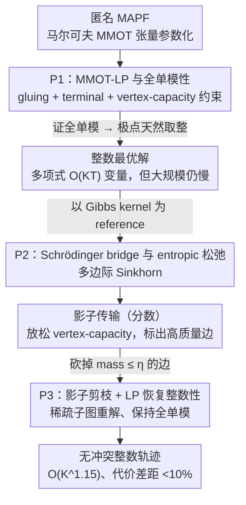

# Optimal and Scalable MAPF via Multi-Marginal Optimal Transport and Schrödinger Bridges

**会议**: ICML 2026 Spotlight  
**arXiv**: [2605.10917](https://arxiv.org/abs/2605.10917)  
**代码**: 未公开  
**领域**: 机器人 / 多智能体路径规划 / 最优传输  
**关键词**: MAPF, 多边际最优传输, Schrödinger bridge, 全单模性, Sinkhorn

## 一句话总结
本文把匿名多机器人路径规划（MAPF）证明为一类**马尔可夫多边际最优传输（MMOT）**，从而把原本 $K^{T+1}$ 维的传输张量压缩成多项式规模 LP（P1），并通过全单模性保证最优解整数性；再把它推广为 Schrödinger bridge 得到 Sinkhorn 风格 entropic 松弛 P2 产出"影子传输"，最后在影子上做剪枝并解 LP（P3）恢复整数解，在 $K^{1.15}$ 复杂度下实现 3.6×–7.1× 加速、代价差距 <10%。

## 研究背景与动机

**领域现状**：MAPF（在共享图上让多个机器人无冲突到达目标）经典解法以 Conflict-Based Search (CBS)、SAT 编码、时间扩展流网络等为主，最优性算法在中等规模上可行，大规模 anonymous MAPF（任何机器人去任何目标）仍是难点。

**现有痛点**：现有 IP/LP 公式（time-expanded network flow）虽然能给最优解，但**没人系统刻画其 LP 的整数性来源**——大家凭经验知道某些 case 整数解存在，但缺乏"哪些结构性条件足以保证全单模 (TU)"的统一框架；同时面对大规模（数千节点、上万变量）就只能近似。

**核心矛盾**：要"最优性 + 整数性"通常意味着 IP（NP-hard），要"可扩展"通常意味着分布式启发式（无保证）。MAPF 缺少一个把这两端连起来的、有理论保证又能跑大规模的统一框架。

**本文目标**：1) 给 MAPF 找一个统一的最优传输视角；2) 在该视角下证明 LP 可以多项式且整数；3) 通过概率松弛（Schrödinger bridge）得到可扩展的 Sinkhorn 算法；4) 把概率松弛的好处变回整数可执行轨迹。

**切入角度**：把 $N$ 个机器人在 $T$ 步内的所有可能联合轨迹看作一个 $(T+1)$ 阶张量 $\mathbf{P}\in\mathbb{R}_{\ge 0}^{K\times\cdots\times K}$，每个条目是一条 path 的概率质量；MAPF 就是要找最小代价 transport plan，满足起止 marginals。这天然就是 MMOT，但因为机器人运动是马尔可夫的，张量有标准因子分解 $\mathbf{P}_{i_0,\ldots,i_T} \propto \prod_t [\Pi_t]_{i_{t-1}i_t}$，把变量从 $O(K^{T+1})$ 砸到 $O(K^2T)$。

**核心 idea**：MAPF = Markovian MMOT；其 anonymous 设定下的 LP 在自然假设下全单模，所以多项式时间能得整数最优解；用 Schrödinger bridge 引入概率松弛得到可扩展求解器，再用剪枝 LP 恢复整数性。

## 方法详解

### 整体框架
全文走"先严谨建模，再概率松弛，再剪枝回整数"三步：(1) **P1**：在马尔可夫张量参数化下把 MAPF 写成相邻时刻间 transport plan $\{\Pi_t\}_{t=1}^T$ 的 LP，证全单模性给出整数最优；(2) **P2**：以 Gibbs kernel $\bar g_{ij,t} \propto \exp(-c_{ij,t}/\varepsilon)$ 为 reference distribution 写 Schrödinger bridge，得到 P1 的 entropic 正则化，用多边际 Sinkhorn 求"影子"分数传输 $\tilde\Pi_t$；(3) **P3**：用影子高质量边做图剪枝（保留 mass 大的边），在缩小后的图上重解 LP 恢复整数解 $\hat\Pi_t$。pipeline 把"最优性 + 整数性"和"可扩展性"两段拼起来，整体复杂度从经典 IPM 的 $O(K^{1.68})$ 降到 $O(K^{1.15})$。

### 关键设计

**1. P1：MAPF 的 MMOT-LP 与全单模性保证**

经典的 time-expanded IP 公式能给 MAPF 最优解，但一直缺一个干净的回答——"为什么这些 LP 的最优解恰好是整数？"大家凭经验知道某些 case 整数解存在，却没有统一的结构性条件。P1 把这件事讲清楚了。它的决策变量是相邻时刻间的转移矩阵 $\{\Pi_t\}$，目标是总传输代价 $\sum_t \langle \Pi_t, C_t\rangle$，三组约束分别管三件事：**gluing** 约束 $\Pi_t^\top\mathbf{1} = \Pi_{t+1}\mathbf{1}$ 保证相邻时层质量守恒（即马尔可夫性），**terminal** 约束 $\Pi_1\mathbf{1}=\mu, \Pi_T^\top\mathbf{1}=\nu$ 固定起止分布，**vertex-capacity** 约束 $0\le\Pi_t^\top\mathbf{1}\le\mathbf{1}$ 不让同一个 vertex 上挤进多于一个机器人。在 Assumption 3.1 的自然结构下（允许 self-loop、不共享端点的边可并行、move cost > wait cost > 0、target wait cost = 0），Lemma 3.3 证明这个 LP 的约束矩阵是全单模 (TU) 的，于是所有极点解天然取整，变量数还只有多项式 $O(KT)$ 个；Theorem 3.4 再把整数解翻译回"机器人互不碰撞、轨迹时空不重叠、各自到达独立目标"。TU 这个第一性原理不只解释了整数性，还把 min-cost / min-move / min-makespan 等不同目标统一成"换一个 $C_t$"——例如 Assumption 3.5 用指数增长 $c_{ij,t} = B^t \tilde c_{ij}$ 隐式逼出 min-makespan，Lemma 3.7 给出 makespan 上界 $T^* \le N + K - 1$，配合 $O(\log K)$ 次二分搜索就能找到最小 horizon。

**2. P2：Schrödinger bridge 与 entropic 松弛**

P1 虽然多项式可解，但大规模（数千节点、上万变量）下直接解 LP 仍然慢。P2 把 P1 推广成一个概率问题：在约束集 $\mathcal{C}$ 上找联合分布 $\mathbf{P}$ 最小化 $\mathrm{KL}(\mathbf{P}\,\|\,\mathbf{G})$，$\mathbf{G}$ 是参考马尔可夫张量。Lemma 4.1 证明这个 KL 可以逐时层分解为 $\sum_t \mathrm{KL}(\frac{1}{N}\Pi_t\|\mathbf{G}_t)$ 加 boundary 项；当参考取 Gibbs kernel $g_{ij,t}=\exp(-c_{ij,t}/\varepsilon)$ 时，Lemma 4.2 进一步把目标化成 P1 的 entropic 正则版：

$$\min \sum_t \langle\Pi_t,C_t\rangle + \varepsilon\sum_{i,j}\pi_{ij,t}(\log\pi_{ij,t}-1)$$

这就是 P2，可以用多边际 Sinkhorn 块坐标下降高效并行求解。代价是 P2 放松了 vertex-capacity，解可能是分数的——但这恰恰是"影子"的价值所在：它不给可执行路径，却告诉你最优传输倾向于走哪些边，$\varepsilon\to 0$ 时影子会收缩到 min-cost 几何走廊上。关键在于，本文用 Schrödinger bridge 把 P2 和 P1 严格对接，所以 P2 不是一个临时的工程加速器，而是有概率诠释的"先验感知"求解器——换不同的 reference $\mathbf{G}$ 就能注入风险规避、行驶偏好等结构性偏好。

**3. P3：影子剪枝 + LP 恢复整数性**

P2 快但给的是分数解，没法直接执行。P3 把 P2 的影子当成"特征选择器"用：对 $\Pi_t$ 加一个拉向影子 $\tilde\Pi_t$ 的 KL penalty 并线性化，得到目标 $\sum_t \sum_{i,j}\pi_{ij,t}(c_{ij,t} - \lambda\log(\tilde\pi_{ij,t}+\delta))$，再把质量 $\le\eta$ 的边全砍掉（即把搜索限制在 $\Pi_t \subseteq [\tilde\Pi_t]_\eta$）。这等价于在影子高亮出的稀疏子图上重新解一遍 P1——仍然全单模、仍然整数，但变量数从 $|\mathcal{E}|T$ 缩到 $\zeta|\mathcal{E}|T$（实验里 $\zeta\in[0.2, 0.4]$）。三个超参连成一条"最优—可扩展"滑杆：$\lambda=\eta=0$ 退化回 P1，$\varepsilon$ 越大影子越糊、剪枝越狠、代价上升越多。把分数解的 mass 分布当作问题结构先验来加速整数 LP，这在 OT 文献里少见，既保住了 P1 的最优性证书，又借到了 P2 的可扩展性，整体复杂度因此从经典 IPM 的 $O(K^{1.68})$ 降到 $O(K^{1.15})$。

### 损失函数 / 训练策略
非学习方法，无 loss/训练；超参选择基于 260 次 $K=10000$ 实验：$\varepsilon=0.2, \lambda=0$ 是稳健默认值，给出 4.3% 代价差距、5× 加速。Sinkhorn 迭代数在实践中很少（几十轮即足以构造剪枝图）。

## 实验关键数据

### 主实验
在 $K = W\times H$ 网格（边长 50–150，5% 机器人密度，$T=30$，Gurobi 求解器）上做 162 次独立运行：

| 方法 | 求解时间随 $K$ 缩放 | 加速倍数 | 代价差距 | 整数性 |
|------|--------------------|---------|---------|--------|
| P1（原始 LP） | $O(K^{1.68})$ | 1× | 0%（最优） | 100% |
| P2 + P3 pipeline | $O(K^{1.15})$ | **3.6× – 7.1×** | **< 10%** | 100%（每个解都验证为整数） |

### 消融实验

| 设置 | 关键现象 | 说明 |
|------|---------|------|
| 边保留比例从 100% 降到 ~20-40% | 代价差距 < 10%，可行性保持 | 影子剪枝高效 |
| $\varepsilon = 0.2, \lambda = 0$（默认） | 4.3% 代价差距，5× 加速 | 鲁棒平衡 |
| $\varepsilon$ 增大 | 影子越扩散，剪枝越多，代价差距随之增大 | $\varepsilon$ 是 dominant factor |
| $\lambda$ 变化 | 影响较小 | 线性化 KL 的权重次要 |
| 与 CBM (Ma & Koenig 2016) 对比 | P2+P3 在大规模上更稳 | 附录 H.5 |

### 关键发现
- 影子剪枝在问题规模越大时收益越大：$K\uparrow$ 时只需越来越少边即可保持可行，60-80% 的边都可被砍掉。
- TU 性在剪枝后仍保持，这是 P3 能稳定给整数解的核心。
- 最优性 (P1) 与可扩展性 (P2 → P3) 的 trade-off 由三个超参连续调节，给工程师一条平滑滑杆。

## 亮点与洞察
- 把 MAPF 嫁接到 MMOT/Schrödinger bridge 是漂亮的统一视角：不仅把 LP 的整数性来源解释清了（TU），还自然引入概率松弛的 Sinkhorn 加速。这种"经典组合优化 + 现代 OT 工具"的桥梁对其他类似问题（车辆调度、多商品流）很有迁移价值。
- "影子作 feature selector" 的思想可推广：任何拥有 entropic 松弛的整数 LP，都可以先用 Sinkhorn 找"重要变量"，再回到 LP 精解。
- 用 $B^t$ 指数增长 cost 隐式逼 min-makespan，比显式 max-min 公式（破坏 TU）更聪明，但要小心数值溢出，论文也给了 $O(\log K)$ 二分版作替代。
- **三超参 $\varepsilon, \lambda, \eta$ 提供连续的"最优性 vs 可扩展性"调节杠**，让工程师根据场景需求在两端间平滑切换，而不是二选一。

## 局限与展望
- 主要针对 **anonymous** MAPF，非匿名（指派固定机器人到固定目标）需要更一般的 MMOT 公式，作者指出可扩但未实现。
- 假设 graph 满足 Assumption 3.1 的"无对角碰撞"等条件，对真实带动力学约束的多机器人（如有转向半径）的连续运动需先离散化。
- Schrödinger bridge 的 reference $\mathbf{G}$ 选 Gibbs kernel 才能化成 entropic regularization；其他先验（如风险规避、行驶偏好）形式上能塞进去但求解器需要重新推导。
- 复杂度结论基于网格图实验，对一般稀疏图、有动态障碍的实时场景未直接验证。

## 相关工作与启发
- **vs CBS / SAT-based MAPF**：本文从"polytope 整数性"角度给出第一性原理解释，弥补经典启发式方法缺保证的不足；CBS 在中规模仍可能更快，但本文在大规模上扩展性更好。
- **vs Time-expanded network flow (Yu & LaValle, Ma)**：他们也给出 LP/IP，但没显式论证整数性；本文用 TU 把它正式化，并加上 Schrödinger 概率视角。
- **vs Yau et al. (GNN for low-rank SDP relaxation of CSP)**：相似之处都是用"凸松弛+恢复"思路解组合问题，但本文在 OT/MAPF 上做，且无需学习。
- **vs Sinkhorn-based MMOT (Lin, Haasler, Carlier)**：本文是第一次把多边际 Sinkhorn 用到 MAPF 这种"既要可扩展又要 0/1 解"的应用场景。
- **vs OR 社区的 µMAPF / LNS 变种**：这些是启发式高性能求解器，但缺严格最优性保证；本文 P1 可作为这些启发式上的上界与 ground truth 用途。

## 评分
- 新颖性: ⭐⭐⭐⭐⭐ MAPF↔MMOT/Schrödinger bridge 的统一视角是真正新意。
- 实验充分度: ⭐⭐⭐⭐ 大规模 scaling、参数敏感性、CBM 对比都有，但缺动态/连续场景。
- 写作质量: ⭐⭐⭐⭐⭐ 数学推导整洁，三段式 P1/P2/P3 结构清晰易懂。
- 价值: ⭐⭐⭐⭐⭐ 对仓库机器人、多无人机协调等大规模 MAPF 应用有直接工程意义。

<!-- RELATED:START -->

## 相关论文

- [\[ICCV 2025\] Certifiably Optimal Anisotropic Rotation Averaging](../../ICCV2025/robotics/certifiably_optimal_anisotropic_rotation_averaging.md)
- [\[ICML 2025\] Learning to Stop: Deep Learning for Mean Field Optimal Stopping](../../ICML2025/robotics/learning_to_stop_deep_learning_for_mean_field_optimal_stopping.md)
- [\[AAAI 2026\] Scalable Multi-Objective and Meta Reinforcement Learning via Gradient Estimation](../../AAAI2026/robotics/scalable_multi-objective_and_meta_reinforcement_learning_via_gradient_estimation.md)
- [\[CVPR 2026\] Multi-SpatialMLLM: Multi-Frame Spatial Understanding with Multi-Modal Large Language Models](../../CVPR2026/robotics/multi-spatialmllm_multi-frame_spatial_understanding_with_multi-modal_large_langu.md)
- [\[CVPR 2026\] Scalable Trajectory Generation for Whole-Body Mobile Manipulation](../../CVPR2026/robotics/scalable_trajectory_generation_for_whole-body_mobile_manipulation.md)

<!-- RELATED:END -->
