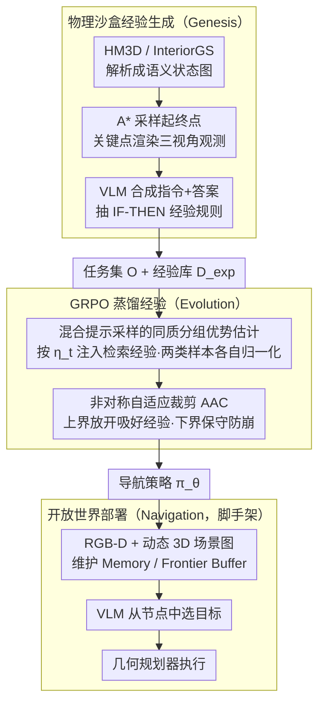

# Plan in Sandbox, Navigate in Open Worlds: Learning Physics-Grounded Abstracted Experience for Embodied Navigation

**会议**: ICML 2026  
**arXiv**: [2605.10118](https://arxiv.org/abs/2605.10118)  
**代码**: 未公开  
**领域**: 具身导航 / VLM 强化学习 / Sim2Real  
**关键词**: 物理沙盒、生成式经验、GRPO、非对称裁剪、A-EQA、GOAT-Bench

## 一句话总结
本文提出 SAGE：在物理约束的语义沙盒里自动合成大量导航任务+IF-THEN 经验规则，用混合提示采样 + 非对称自适应裁剪的 GRPO 把这些经验蒸馏进 VLM 策略，最终在 A-EQA 上把 LLM-Match 成功率从 43.5% 拉到 53.2%（2B）/ 60.2%（4B），并能迁移到真实室内机器人。

## 研究背景与动机
**领域现状**：VLM（GPT-4o、Qwen3-VL 等）在开放世界感知与推理上很强，催生了一波 VLM-driven 具身导航：目标导向（ObjectNav、IIN）和问答导向（A-EQA、OpenEQA）两大范式。RL 方法（SenseAct）尝试端到端学策略，模块化方法（3D-Mem、Explore-EQA）则把 VLM 作为高层规划器。

**现有痛点**：(1) 真实世界对齐的「视觉-机器人控制」数据稀缺，VLM 与连续动作空间之间存在巨大模态鸿沟，从零开始 RL 收敛极慢且严重 Sim2Real 退化；(2) 强行训出来的策略在真实环境（噪声大、布局陌生）里要么失败、要么靠 GPT-4o 这种闭源大模型撑场面，开源中等规模 VLM 实战差距很大。

**核心矛盾**：VLM 有丰富先验但无法在线持续学习低层控制，RL 有学习机制但样本效率太低；二者各取所长的桥梁缺位。光照真实但物理不一致的模拟器或者反过来都不能解决根本问题。

**本文目标**：(1) 在不依赖真实世界大规模采集的前提下，为 VLM 策略提供海量、多样、物理可执行的导航经验；(2) 设计 RL 算法稳定地把这些经验蒸馏进策略；(3) 让 sandbox 学到的策略真的能 zero-shot 转去开放世界。

**切入角度**：人类做计划时是在「头脑沙盒」里先 rehearse 再执行——抽象的物理约束 + 语义场景图就够，并不需要逼真渲染。那让 VLM 在「物理约束 + 语义抽象」的沙盒（HM3D / InteriorGS 解析成离散语义节点 + 碰撞约束的图）里自己生成任务、记录成功路径、抽出 IF-THEN 规则。

**核心 idea**：把 sandbox 当成 VLM 的「经验工厂」生成结构化任务集 $\mathcal O$ 与经验规则库 $\mathcal K_{exp}$，再用 GRPO 配合「区分增强样本和标准样本」的非对称裁剪，把外部检索经验「内化」成 VLM 的参数化策略。

## 方法详解

### 整体框架
SAGE 含三阶段：(1) **Genesis** 在沙盒环境 $\mathcal E_S=(\mathcal S,\mathcal A,\mathcal P)$ 里采样起终点 + A* 规划 + 在关键点渲染三视角观测 $\mathcal V_t=\{v_{t,0°},v_{t,+120°},v_{t,-120°}\}$，用 VLM 把场景图 + 终点描述合成自然语言指令 $I$ 与答案 $a^*$，组成任务 $o=(I,\tau^*,a^*,\mathcal K)$；同时 VLM 把每步的最优视角选择理由编为「IF 任务 X AND 观察 Y THEN 优先路径 Z」规则存入向量库 $\mathcal D_{exp}$。(2) **Evolution** 用 GRPO 在 $\mathcal O$ 上优化策略 $\pi_\theta$，输入按 Bernoulli 概率 $\eta_t$ 决定是否注入检索经验 $\mathcal K_{ret}$，按同质分组（homogeneous group）计算优势，按 mask 决定 PPO clip 上下界。(3) **Navigation** 部署时仍走「检索经验 + VLM 决策 + 几何规划器」三件套：用 RGB-D + 动态 3D 场景图维护 Memory Buffer $\mathcal M_t$（已见对象）与 Frontier Buffer $\mathcal F_t$（未探索边界），VLM 从 $\mathcal F_t\cup\mathcal M_t$ 选目标节点，Habitat-Sim / ROS 规划器执行。

下面三个关键设计中，设计 1 对应 Genesis 阶段（造经验），设计 2、3 共同支撑 Evolution 阶段的 RL 蒸馏（学经验）；Navigation 阶段是把学到的策略接回真实控制的部署脚手架，本身不引入新的训练设计：

### 关键设计

**1. 物理沙盒经验生成（Genesis）：用抽象沙盒当 VLM 的"经验工厂"**

抛弃 photorealistic 模拟器，主要是因为渲染开销大、Sim2Real 退化严重，而且逼真渲染对 VLM 的导航决策并不必要。SAGE 把 HM3D / InteriorGS 解析成"语义状态图"——每个房间拆成离散 navigable 节点，状态转移严格遵守可通行性约束。任务合成走 A* + 关键点三视角渲染 + VLM caption 的流水线，前向视角 $v_{t,0°}$ 作为最优答案 $a^*$；同时让 VLM 把每步"为什么选这个视角"解释成"IF 任务 X AND 观察 Y THEN 优先路径 Z"的 IF-THEN 规则，编码后存进向量库 $\mathcal D_{exp}$。物理约束 + 语义抽象不仅便宜，还和真实部署时的"3D 场景图 + buffer"表示天然对齐，从源头减小了测试时的分布偏移。

**2. 混合提示采样的同质分组优势估计：别让带经验提示的样本污染基线**

GRPO 训练里如果把"带检索经验提示的增强样本"和"不带提示的标准样本"混在一起算优势，会出大问题：增强样本天然 reward 更高（检索到好经验近乎抄答案），混着算 $\mu,\sigma$ 会把标准样本的优势压低甚至变负，把好行为误判成差行为。SAGE 用同质分组隔离两种分布——每条输入 $x_i$ 采 $G$ 个 rollout，但强制同组内 mask $m_i$ 一致：$x_t=[I_t,v_t,\mathcal K_{ret}]$（$m=1$）或 $[I_t,v_t]$（$m=0$），优势 $A_{i,j}=(r_\phi(x_i,a_{i,j})-\mu)/(\sigma+\epsilon)$ 在同组内归一化。注入概率本身也是动态的：

$$\eta_t=\max\Big(\eta_{\min},\ \eta_{init}\cdot\big(1-\min(R_{val}^{(t)},R_{target})/R_{target}\big)\Big)$$

验证奖励越高、$\eta_t$ 越小，策略就从"模仿检索"逐步过渡到"自主探索"，形成一条先模仿后探索的课程。

**3. 非对称自适应裁剪（AAC）：上界放开吸收好经验，下界保守防崩溃**

经典 PPO/GRPO 的对称裁剪意味着"好行为也不能更新太多"，这跟"我们就是想快速吸收高质量经验"的需求直接矛盾。AAC 的做法是上界依 mask 自适应、下界统一保守。定义重要性比 $\rho_{i,t}(\theta)=\pi_\theta(a_{i,t}\mid x_{i,t})/\pi_{\theta_{old}}(a_{i,t}\mid x_{i,t})$，上界 $\epsilon_{up}(m_i)=\epsilon_{exp}$（增强样本）或 $\epsilon_{std}$（标准样本），且 $\epsilon_{exp}\gg\epsilon_{std}$，但下界对所有样本统一为保守的 $1-\epsilon_{std}$：

$$L_{i,t}^{CLIP}=\min\big(\rho_{i,t}A_{i,t},\ \text{clip}(\rho_{i,t},1-\epsilon_{std},1+\epsilon_{up}(m_i))A_{i,t}\big)$$

全目标再加 KL 约束 $J_\phi(\theta)=\mathbb E[L^{CLIP}-\beta\mathbb D_{KL}(\pi_\theta\|\pi_{ref})]$。上界放大让策略大胆吸收高 reward 的增强样本；下界必须保守，否则一个被 reward variance 误标为低 reward 的 golden 样本会被大幅压低概率、导致策略 collapse——消融里 $\epsilon_{exp}=1.0$ 是甜区，1.2 时 100 步后训练就崩盘。

### 损失函数 / 训练策略
Reward $r_\phi(s_t,a_t)=w_f\mathbb I_f+w_{acc}(\mathbb I_m(1+\text{sim}(a_t,a_t^*))-\mathcal P_{err})$，含格式合规指示、图像选择正确指示、文本相似度奖励、错误惩罚。优化器为带 KL 正则的 GRPO 变体（AAC）。训练数据：合成 14,526 条有效轨迹（HM3D 7,988 + InteriorGS 6,538），$\eta_{init}=0.8,\eta_{min}=0,R_{target}=1.5$，$\epsilon_{exp}=1.0$（最优），训 150 步收敛。

## 实验关键数据

### 主实验
两个 benchmark：A-EQA（184 题问答导向，SR†/SPL† 由 Qwen3-235B 自动评分）、GOAT-Bench（278 子任务、目标导向）。

| 方法 | A-EQA SR† | A-EQA SPL† | GOAT SR | GOAT SPL |
|------|-----------|------------|---------|----------|
| SenseAct-NN Skill Chain (RL) | 24.7 | 13.3 | 29.5 | 11.3 |
| Explore-EQA (GPT-4o) | 46.9 | 23.4 | 55.0 | 37.9 |
| 3D-Mem (GPT-4o) | 52.6 | 42.0 | 69.1 | 48.9 |
| 3D-Mem (Qwen3-2B) | 44.3 | 19.4 | 46.4 | 20.3 |
| **SAGE (Qwen3-2B)** | **53.2** | **37.1** | **56.7** | **38.9** |
| **SAGE (Qwen3-4B)** | **60.2** | **47.2** | **64.8** | **44.9** |

SAGE-2B 同 backbone 下 +8.9% A-EQA SR†、+10.3% GOAT SR、SPL 几乎翻倍，甚至 A-EQA SR† 超过 GPT-4o 版 3D-Mem；SAGE-4B 把 A-EQA 推到新 SOTA 60.2%。

### 消融实验
**主组件累积消融（Qwen3-VL-2B → SAGE Full）：**

| 配置 | A-EQA SR† | A-EQA SPL† | GOAT SR |
|------|-----------|------------|---------|
| Zero-shot VLM | 43.51 | 27.53 | 49.17 |
| +$C_{ret}$ 仅检索 | 46.47 | 30.72 | 50.58 |
| +Task 合成任务训练 | 50.71 | 33.68 | 53.72 |
| +Task+Exp 加经验规则 | 51.42 | 34.67 | 54.05 |
| +Task+Exp+AAC | 51.88 | 36.29 | 55.35 |
| **SAGE Full（再加 $C_{ret}$）** | **53.21** | **37.07** | **56.69** |

**导航阶段消融**：训练 Genesis+Evolution 无检索 SR† 已提升 6.29%，加随机经验 +1.93%，加正确检索 +1.48%。

### 关键发现
- 动态 $\eta_t$ 显著优于固定值：固定 $\eta=0.0/0.5/0.8/1.0$ 都不如 validation-driven 退火，验证「先模仿后探索」的课程很必要。
- $\epsilon_{exp}$ 的甜区在 1.0：0.4 时不充分吸收（欠拟合），1.2 时 100 步后训练崩盘；说明 AAC 上界不是「越大越好」。
- Sandbox 数据量 12.5% → 100% 单调上升但有边际递减；12.5% 已能达 44.75% SR†，说明「物理沙盒生成的廉价数据」可大量扩展。
- 输入帧数 $v_t$：2 → 4 显著提升，5 反而轻微下降（视觉 token 稀释 attention），最优 4 帧。
- 真实室内机器人部署成功（附录 J），说明 sandbox 抽象 → 节点选择 → ROS 规划器的解耦确实跨越了 Sim2Real。

## 亮点与洞察
- **「沙盒里 rehearse 再上路」类比心智模拟**：跳出 photorealistic 模拟器思维定式，把抽象的物理 + 语义图当作 VLM 的训练场，既便宜又对齐部署时表示。
- **AAC 是对 GRPO/PPO 一个很有诱惑力的小修改**：「上界自适应、下界统一保守」可以普适地用在任何「带高质量示范的 RLHF / 自迭代」场景，例如代码 RL、数学 RL 引入 expert traces 时。
- **Frontier+Memory Buffer 的离散动作空间**：把连续控制简化为「从可枚举节点里选一个」，让 VLM 的 token-level reasoning 直接作为决策，规避连续动作的不可解释性，是工程上很聪明的解耦。
- **同质分组优势估计**：GRPO 应用到 mixed-distribution data 时这是一个简单但容易遗忘的细节，本文给了清晰示范。

## 局限与展望
- 沙盒环境仅基于已有数据集（HM3D / InteriorGS），新场景泛化仍靠基础 VLM 而非真正 transfer learning；动态环境（人在走动、物体可被搬动）未覆盖。
- 真实机器人实验在附录而非主表，深度部署数据较少，长期可靠性、电池续航等系统级数据未呈现。
- Reward 设计依赖文本相似度，对抽象空间任务（计数、空间关系）可能存在「format hack」风险。
- 经验规则用 IF-THEN 字符串存储，规模一上来检索精度和噪声管理是隐患，未来需要更结构化的知识图谱形式。

## 相关工作与启发
- **vs 3D-Mem (yang2025b)**：同样维护场景记忆，但 3D-Mem 不训练 VLM，靠 GPT-4o 的能力；SAGE 训练中等规模开源 VLM 反超闭源大模型。
- **vs SenseAct-NN (khanna2024)**：纯 RL，没用 VLM 先验，效果差一大截。
- **vs Explore-EQA (ren2024)**：用 GPT-4o 探索，没有显式经验库；SAGE 通过 sandbox 把经验沉淀为可检索结构。
- **vs 普通 GRPO**：SAGE 的 AAC + homogeneous group + 混合提示，可视为 GRPO 在「带先验数据 + RL」场景的更细化版本。

## 评分
- 新颖性: ⭐⭐⭐⭐ 「物理 + 语义抽象沙盒 + 经验规则」是有想法的，但每个组件都是已有思路的精致组合
- 实验充分度: ⭐⭐⭐⭐ A-EQA + GOAT + 5 类 ablation + 真机部署，覆盖完整
- 写作质量: ⭐⭐⭐⭐ 三阶段叙事清晰，公式记号都有，但 reward 设计描述偏简略
- 价值: ⭐⭐⭐⭐ 给中等规模 VLM 上的具身导航提供了 GPT-4o 替代方案，AAC 思路可迁移到通用 RLHF

<!-- RELATED:START -->

## 相关论文

- [\[ICML 2026\] R2R2: Robust Representation for Intensive Experience Reuse via Redundancy Reduction in Self-Predictive Learning](r2r2_robust_representation_for_intensive_experience_reuse_via_redundancy_reducti.md)
- [\[ICLR 2026\] ExoPredicator: Learning Abstract Models of Dynamic Worlds for Robot Planning](../../ICLR2026/robotics/exopredicator_learning_abstract_models_of_dynamic_worlds_for_robot_planning.md)
- [\[ICLR 2026\] OmniEVA: Embodied Versatile Planner via Task-Adaptive 3D-Grounded and Embodiment-aware Reasoning](../../ICLR2026/robotics/omnieva_embodied_versatile_planner_via_task-adaptive_3d-grounded_and_embodiment-.md)
- [\[ICML 2026\] DLO-Lab: Benchmarking Deformable Linear Object Manipulations with Differentiable Physics](dlo-lab_benchmarking_deformable_linear_object_manipulations_with_differentiable_.md)
- [\[ICML 2026\] Dive into the Scene: Breaking the Perceptual Bottleneck in Vision-Language Decision Making via Focus Plan Generation](dive_into_the_scene_breaking_the_perceptual_bottleneck_in_vision-language_decisi.md)

<!-- RELATED:END -->
