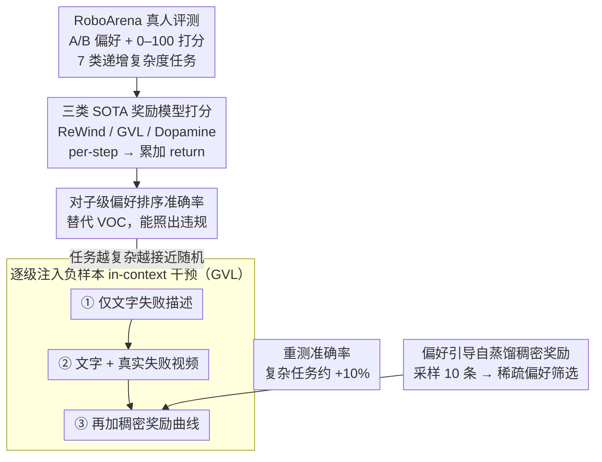

# Position: Good Embodied Reward Models Need Bad Behavior Data

**会议**: ICML 2026 Spotlight  
**arXiv**: [2606.01036](https://arxiv.org/abs/2606.01036)  
**代码**: 无  
**领域**: 具身智能 / 机器人 / 奖励建模  
**关键词**: 具身奖励模型, 失败数据, RoboArena, VLM 奖励, 偏好对齐

## 一句话总结
一篇 position paper：作者用 RoboArena 真人评分实证了三类 SOTA 具身奖励模型（ReWind / GVL / Dopamine）会系统性"高估"实际失败的机器人行为，根因是训练数据几乎只有专家成功示范，并通过把真实"坏"行为视频 + 稠密负向奖励标签塞进 GVL 的 in-context 提示，证明哪怕极少量负样本就能显著修正偏好排序，从而呼吁社区主动收集和发布"坏"机器人数据。

## 研究背景与动机

**领域现状**：VLA（Vision-Language-Action）类具身基础模型近两年快速发展，无论是 RL post-training、test-time best-of-K，还是大规模自动评估，都越来越依赖一个"通用具身奖励模型" $R_\theta(o_{1:T}; c)$ —— 给一段视觉观测序列和语言任务指令打分，替代昂贵的人工评估。目前主流做法分三类：基于偏好的合成负样本训练（ReWind）、零样本 VLM 评分（GVL / GPT-5）、以及在专家数据上 fine-tune 的 VLM 评分器（Dopamine）。

**现有痛点**：这三类奖励模型在"看似成功但实际违规"的行为上一致失灵。作者把它们扔到 RoboArena 真实机器人 rollout + 人评分数据上做偏好排序，发现：在简单 Pick/Place 任务上准确率 0.72–0.77 还算可用，但到了 Pour Liquid 和 Tool Use 这种细粒度任务上，三个模型都掉到只比随机猜测高一点（0.52–0.62）。更糟的是定性结果——奖励模型对"勺子撞到碗""坚果撒到盘外"这类清晰的失败帧依然给出单调上升的奖励曲线，几乎完全忽略了人类用来判优劣的关键瞬间。

**核心矛盾**：所有这三类方法的"负向信号"都是替代品而非真货——ReWind 靠打乱专家轨迹合成 pseudo-negative，GVL 靠 VLM 预训练里的通用先验，Dopamine 靠启发式的进度标签。LLM 的成功离不开互联网上海量自然出现的"坏文本"（错误推理、毒性语言），而具身领域的"坏数据"被两个机制系统性过滤掉：一是硬件安全和 wall-clock 成本让人不敢主动制造失败，二是模仿学习范式天然过滤掉非专家数据（OpenX、DROID 等大数据集都是如此）。结果就是训练分布严重偏向"成功"，奖励模型被校准成过度乐观。

**本文目标**：把"具身奖励模型为什么 fail"诊断到数据层面，并实证哪怕一点点真实失败视频也能显著修正现有 SOTA 模型的判断。

**切入角度**：作者选择 GVL 作为干预对象，因为它支持 in-context learning，可以在不重训的前提下注入不同粒度的负样本（纯文字描述 / 文字 + 视频 / 文字 + 视频 + 稠密奖励），干净地隔离出"负样本本身"vs"负样本表征形式"的贡献。

**核心 idea**：好的具身奖励模型必须见过真"坏"行为；社区应主动发布失败数据集、构建失败数据合成引擎、推动去中心化物理评测、并设计针对奖励模型本身的 benchmark。

## 方法详解

这篇是 position paper，没有提出新模型架构，"方法"主要由两条线组成：(a) 一套量化奖励模型与人类偏好对齐度的评测协议；(b) 一套受控的 in-context 负样本注入实验。两者一起构成立论的实证骨架。

### 整体框架

整个工作可以看成三阶段流水线：第一阶段是把 RoboArena 上的人工 A/B 偏好和连续打分（0–100）当作 ground-truth，按 7 类递增复杂度任务（Pick/Place → Push/Pull → Open/Close → Stack → Reorient → Pour → Tool Use）拆分；第二阶段把三个 SOTA 奖励模型分别对每段 rollout 做 per-step scoring，累加成 trajectory return $\hat{y}^i = \sum_t \hat{r}_t$，再和人类排序算"对子级别"一致率；第三阶段在 GVL 上做受控干预，向 in-context 提示里逐步增加负样本信息量（仅文字 → 文字 + 视频 → 文字 + 视频 + 稠密 reward），重测同一套指标，证明奖励模型质量随负样本表征丰富度单调提升。

### 关键设计

**1. 对子级偏好排序准确率：换一把真正能照出违规的尺子**

之前评测奖励模型常用 Value-Order Correlation——看奖励曲线是否随时间单调递增，但它对"中途撞翻碗、最终却完成任务"这种 case 完全无感，照不出安全和质量违规。作者改用对子级偏好排序：在每个任务 context $c$ 下，把所有人类打分严格不等的 rollout 配成对 $P_c = \{(i,j): i<j, y^i \ne y^j\}$，先算人类与模型偏好方向的不一致率

$$D_c = \frac{1}{|P_c|}\sum_{(i,j)\in P_c}\mathbf{1}[s^{ij}_H \ne s^{ij}_M],\quad s^{ij}_H = \text{sign}(y^i - y^j)$$

再把全局准确率定义为 $A = 1 - \frac{\sum_c |P_c| D_c}{\sum_c |P_c|}$。这把指标直接对齐"人类觉得哪个 rollout 更好"这一终极目标，于是"看似有进展但违规"的失败模式才会被惩罚，奖励模型的真实短板也才暴露出来。

**2. 逐级注入负样本的 in-context 干预（Text → Video → Dense Reward）：隔离出真正起作用的信号**

要论证"问题出在数据缺口"，就得在不重训的前提下，干净地分出"负样本本身"和"负样本表征形式"各自的贡献。作者选支持 in-context learning 的 GVL 当干预对象，把负样本信息量逐级加码：第一级用 LLM 把 RoboArena 评审的文字反馈 distill 成"抓对物体但没松开"这类通用失败描述（对应 Constitutional AI 思路，便宜但抽象）；第二级给每条描述配一段真实失败视频，补上时间维度的细粒度证据；第三级在视频基础上再加一条 per-step 稠密奖励曲线 $r_{1:T}$，直接告诉模型"该在哪一帧开始扣分"。三级实验显示：纯文字几乎没用、加视频只对粗糙错误有效、必须配上时间对齐的稠密奖励才能 catch 到 Tool Use 这类细粒度违规——这恰好证明负样本的"形式"比"数量"更关键，也反衬出 VLM 把抽象准则 grounding 到物理特征的能力仍然薄弱。

**3. 偏好引导的自蒸馏稠密奖励：用稀疏偏好"放大"出稠密监督**

第三级要的 per-step 稠密奖励曲线在物理世界里几乎不可得，RoboArena 只给单个标量评分。作者的巧办法是让奖励模型自己生成、再用人类偏好当筛子：对每对 A/B rollout，用 GVL 在 temperature 0.8 下采样 $m=10$ 条完整 reward 序列 $\{r^{(k)}_{1:T}\}$，每条累加得隐含 return 排序，保留那条隐含排序与人类偏好一致的曲线，把被人类拒绝那侧对应的曲线当作"该如何评价负样本"的 in-context 示范。稀疏偏好标签信息量虽少，却足以充当过滤器挑出符合人类直觉的稠密轨迹，等于把人类标注的信息密度放大了一到两个数量级，避开了从零标注稠密奖励的天文成本——这套"多采样 + 稀疏标签 selector"也能迁移到其他 oracle 奖励缺失的场景。

### 损失函数 / 训练策略

本文核心实验不重训任何模型——三类 baseline 用作者各自原仓库或预训练 checkpoint，干预只通过修改 GVL 的 in-context prompt 完成。唯一涉及训练的 baseline ReWind 在 Open-X embodiment 上按原始目标 $\theta^* = \arg\min_{R_\theta} \mathbb{E}_{c, \tau \sim \mathcal{D}}\left[\sum_t (r_t - t/T)^2 + (r_t^-)^2\right]$ 训练，即同时拟合正样本上的时间进度回归和合成负样本上的零奖励压制。这种"零训练成本"设计本身也强化了立论：问题不是模型能力，而是数据缺口。

## 实验关键数据

### 主实验

| 任务复杂度 | ReWind / GVL / Dopamine 准确率 | 相对随机猜测（0.5） | 关键观察 |
|--------|------|----------|------|
| Pick/Place | 0.72–0.77 | 显著高 | 视觉差异大，三模型可用 |
| Reorient / Pour | mid-0.6 | 中等 | 需要精细执行质量，开始掉点 |
| Tool Use | 0.52–0.62 | 近似随机 | 奖励模型在最复杂任务全面失效 |

定性上，在"用两手抬起盖子放回桌面而不碰到碗"的任务里，机器人盖子明确撞到了碗，但三个奖励模型预测的 per-frame reward 全部呈单调递增；"倒坚果到盘子"任务里坚果撒到盘外，GVL 和 ReWind 依然继续加分——这两个 case 说明问题不是奖励模型"看不到"失败，而是把进展信号过度加权、把负事件低估。

### 干预实验（GVL + in-context 负样本）

| 上下文配置 | 简单任务（Pick/Place、Push/Pull）增益 | 复杂任务（Tool Use、Pour）增益 | 说明 |
|------|---------|---------|------|
| 仅 text 描述失败 | ≈ 0 | ≈ 0 | 抽象描述无法 grounding 到物理行为 |
| text + 真实失败视频 | ≈ +8% | 几无增益 | 视频对"明显失败"有效，对细微违规无效 |
| text + video + 稠密 reward 标签 | ≈ +8% | ≈ +10% | 时间对齐的稠密惩罚信号是细粒度任务的关键 |

### 关键发现

- 三类奖励模型的失效模式高度同构——都偏向"看似有进展"的轨迹，对安全违规和 shortcut 行为系统性低估，差距随任务复杂度单调放大。
- 负样本的"形式"比"数量"重要：纯文字几乎没用，加视频也只对粗糙错误起作用，必须配合时间对齐的稠密奖励标签才能 catch 到 Tool Use 这类细粒度违规。这反过来印证了 VLM backbone 把抽象准则转化为物理 grounding 仍然薄弱。
- 偏好引导自蒸馏构造稠密奖励的设计提供了一条 cheap path：用稀疏人类偏好选 reward 序列，等于把人类标注的信息密度放大了一到两个数量级，是一种值得迁移到其他"oracle 奖励缺失"场景的范式。

## 亮点与洞察

- 立论与实证耦合得紧——不是空喊"我们需要 bad data"，而是用同一套 RoboArena 数据既诊断 SOTA 失效（定量 + 定性），又证明哪怕只把 bad data 当 in-context 例子塞进 GVL 也能修正偏好排序，闭环非常清晰。
- "偏好引导自蒸馏稠密奖励"是可独立复用的小 trick：在任何只有稀疏标签的评测场景里，都可以用"多采样 + 用稀疏标签 selector"把模型自己的中间产物升级成稠密监督，省下绝大部分标注成本。
- 对"Alternative Views"的反驳写得相当扎实：作者并不否认 VLM 预训练见过失败、不否认 observability 是问题、也不否认 UQ 是补救手段，而是逐条解释为什么这些都"不够替代"真正的 embodied bad data，避免了 position paper 常见的"立稻草人"问题。

## 局限与展望

- 实证规模偏小：评测仅覆盖一个机器人 benchmark（RoboArena）和七类桌面操作，缺少导航、长程多步、双臂协作等场景；干预实验只在 GVL 一个模型上做了 in-context 注入，没在 ReWind / Dopamine 上重训验证。
- "稠密奖励标签"构造严重依赖 GVL 自己采样的质量——如果 base 奖励模型在某类任务上 10 次采样都没一条对齐人类偏好，这个 selector 就退化为随机选择，无法获得有效的稠密负样本。
- 作者呼吁的"释放失败数据""合成 bad data"在实操层面绕不开机构合规和隐私问题：失败 rollout 往往伴随硬件损坏、人员介入、甚至安全事故录像，industry 团队的释放意愿很难简单靠"呼吁"撬动；synthetic 路径里 real2sim2real 闭环虽然可行，但 sim-to-real gap 在 contact-rich / deformable 任务上至今没有令人满意的解。

## 相关工作与启发

- **vs ReWind**：ReWind 通过扰动专家轨迹合成 pseudo-negative，本质上是"想象的失败"；本文用 RoboArena 真实失败数据证明合成负样本无法覆盖闭环失败模式，是对"靠扰动制造负样本"路线的强烈警示。
- **vs Constitutional AI**：Constitutional AI 用文字 principle 注入价值观，作者引用并直接对比——纯文字 principle 在物理 grounding 任务上几乎无效，凸显出具身领域必须把"价值观"落到视觉时序数据上。
- **vs GVL / Dopamine（VLM-as-reward 路线）**：本文不否定 VLM 作为奖励 backbone 的价值，但证明零样本/启发式监督不够，必须引入真人评估和真失败视频做 in-context 校准。
- **vs UQ 路线（Leng et al. 2025、Park et al. 2025）**：作者承认 UQ 在 LLM reward modeling 里效果显著，但点出关键不对称——只用正样本无法校准 false positive rate，因为 FP 的定义本就锚定在未观测到的负样本上，因此 UQ 与 bad data 互补而非替代。

<!-- RELATED:START -->

## 相关论文

- [\[ICML 2026\] StableVLA: Towards Robust Vision-Language-Action Models without Extra Data](stablevla_towards_robust_vision-language-action_models_without_extra_data.md)
- [\[ICML 2026\] TimeRewarder: Learning Dense Reward from Passive Videos via Frame-wise Temporal Distance](timerewarder_learning_dense_reward_from_passive_videos_via_frame-wise_temporal_d.md)
- [\[CVPR 2026\] DAWN: Pixel Motion Diffusion is What We Need for Robot Control](../../CVPR2026/robotics/dawn_pixel_motion_diffusion_robot_control.md)
- [\[ICLR 2026\] D2E: Scaling Vision-Action Pretraining on Desktop Data for Transfer to Embodied AI](../../ICLR2026/robotics/d2e_scaling_vision-action_pretraining_on_desktop_data_for_transfer_to_embodied_a.md)
- [\[NeurIPS 2025\] Trust Region Reward Optimization and Proximal Inverse Reward Optimization Algorithm](../../NeurIPS2025/robotics/trust_region_reward_optimization_and_proximal_inverse_reward_optimization_algori.md)

<!-- RELATED:END -->
