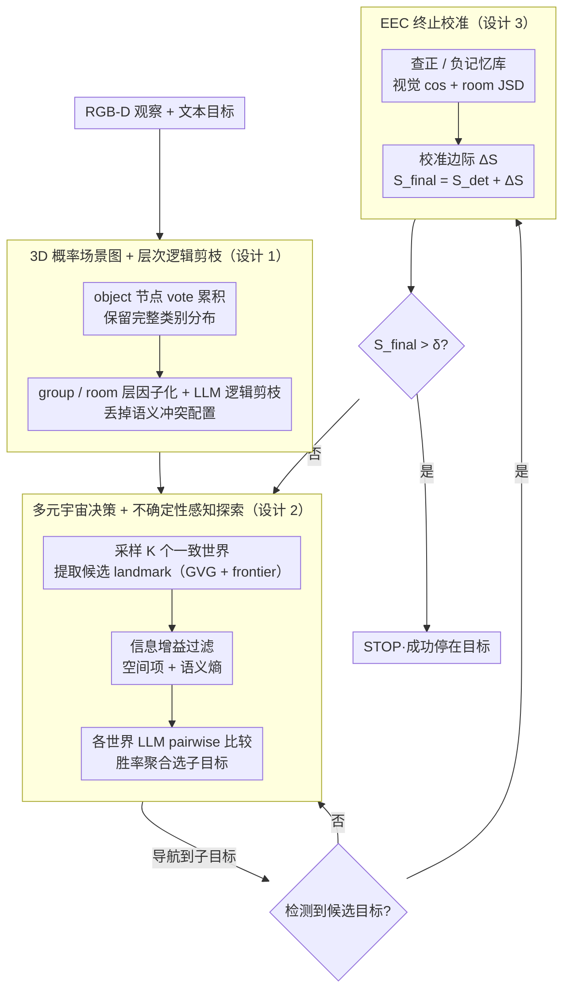

# PSG-Nav: Probabilistic Scene Graph Navigation via Multiverse Decision Making

**会议**: ICML 2026  
**arXiv**: [2606.01313](https://arxiv.org/abs/2606.01313)  
**代码**: https://psg-nav.github.io/  
**领域**: 机器人 / 具身智能 / 开放词汇导航 / 不确定性建模  
**关键词**: ObjectNav, 概率场景图, 多元宇宙采样, 证据校准, 终身适应

## 一句话总结
本文提出 PSG-Nav，用"保留完整类别分布的 3D 概率场景图 + 从联合分布采样多个一致世界做决策 + 用成功/失败记忆库做证据校准"三件套替代传统确定性场景图导航，在 HM3D / MP3D / HSSD 三大 ObjectNav 基准上分别达到 66.1% / 44.8% / 67.9% SR，是新的 SOTA。

## 研究背景与动机

**领域现状**：开放词汇 ObjectNav 主流是模块化方案，用 GLIP / Grounded-SAM 这类开放词汇检测器构建 3D 场景图（SG-Nav、CogNav、ASCENT、ApexNav 等），再用 LLM 做高层规划——给定一句话目标（如 "blue sofa"），agent 要在未见过的室内场景中找到并停在物体附近。

**现有痛点**：现在的主流场景图为了让 LLM 接得住、为了存储效率，把每个物体只赋一个"最高置信度的硬标签"，把完整的类别概率分布直接扔掉。这带来三个连锁灾难：(1) 感知噪声永久写入地图（sofa 误检成 bed 后再也改不回来）；(2) 场景图出现"卧室里有马桶"这种逻辑不一致的布局，下游 LLM 据此推理就崩了；(3) sim-to-real domain shift 下高频假阳性，agent 走到一个错的物体前就 STOP，episode 提前失败。

**核心矛盾**：感知模型本身是带不确定性的（同一物体可能 70% sofa、30% bed），但下游规划需要"确定性"的场景做 LLM prompt——硬截断丢掉概率会失去全局推理能力，但直接对全联合分布做规划又组合爆炸（即使最大概率的全局配置也只占 < 10%）。

**本文目标**：(a) 在地图层保留全分布；(b) 在规划层把概率推理变成可处理的离散决策；(c) 在终止层对抗 sim-to-real 假阳性，做到真正的在线终身适应。

**切入角度**：作者借鉴了 "Multiverse Decision Making" 的思想——既然单一确定性世界要么过自信、要么丢信息，那就从联合分布里采样 $K$ 个"逻辑一致的可能世界"，让 agent 在多个并行宇宙里同时评估同一个 landmark，再用胜率聚合做决策；同时用 RAG 风格的成功/失败记忆库给检测置信度做后验校准。

**核心 idea**：用层次化的概率场景图（object → group → room）做因子化以避免联合爆炸，用蒙特卡洛采样多世界 + LLM pairwise 比较做鲁棒决策，用 EEC 在每个 episode 结束后增量更新记忆库，把"零样本导航"升级成"在线终身学习"。

## 方法详解

### 整体框架
输入是 RGB-D 观察序列 $O_t = \{I_t^{rgb}, I_t^{depth}, p_t\}$ 加自由文本目标 $c$；输出是离散动作 $a_t \in \{\text{MOVE\_FORWARD}, \text{TURN\_LEFT/RIGHT}, \text{LOOK\_UP/DOWN}, \text{STOP}\}$，每步 500 帧预算内走到目标 1m 内并执行 STOP 即成功。pipeline 三件套：(A) **3D-PSG** 在线构建层次化概率场景图，每个 object 节点维护完整类别分布而非硬标签；(B) **Multiverse Decision** 从 3D-PSG 采样 $K$ 个一致世界，对候选 landmark 做 pairwise 比较 + 信息增益评分，选下一个子目标；(C) **EEC** 在检测到候选物体时用成功/失败记忆库做置信度校准，决定是否真的 STOP。三者首尾相接，决策与终止两处都能回到导航循环，构成"建图→规划→走→验证→（不停就继续）"的闭环。

### 关键设计

**1. 3D 概率场景图 + LLM 引导的层次化逻辑剪枝：保留全分布又不让联合推理爆炸**

传统场景图为了喂 LLM 方便，把每个物体砍成一个 argmax 硬标签，等于自废武功——sofa 被误检成 bed 后再没有"备选解释"可以回退。PSG-Nav 在地图层保留完整分布：场景图 $\mathcal{G}_t = (\mathcal{V}, \mathcal{E})$ 分 object / group / room 三层，每个 object 节点维护类别 vote 计数向量 $\mathbf{n}_{i,t}$，置信度归一化为 $P_t(o_i = c_k) = n_{i,t}^{(k)} / \sum_j n_{i,t}^{(j)}$（用 vote 累积而非 Bayesian 更新，因为开放词汇检测器的置信度没校准、Bayesian 更新会发散）；group 节点存子物体的联合配置概率 $P(g_j = s) = \prod_{i=1}^{N_j} P(o_{j,i} = c_{j,i}^s)$，比如 70% table × 80% chair = 56% 的"桌+椅"配置。直接对全联合分布规划会组合爆炸（最大概率的全局配置都占不到 10%），所以关键一步是层次因子化后做 LLM 逻辑剪枝：枚举 group 内 top-$K_g$ 配置，用 LLM 二元过滤 $f_{\text{LLM}}(s) \in \{0,1\}$ 丢掉"客厅里出现马桶"这种逻辑冲突，room 层同理。这样既把组合爆炸压成可枚举，又能滤掉"最高置信但语义不通"的配置、保留"低置信但全局一致"的正确解释——这正是从感知噪声里恢复真相的核心机制。

**2. 多元宇宙决策 + 内在不确定性感知探索：在多个并行世界里给同一 landmark 投票**

单一确定性世界做规划等于"赌一把"，一遇歧义就崩。PSG-Nav 从 3D-PSG 的联合分布采样 $K$ 个逻辑一致的确定性世界 $\mathcal{M} = \{\mathcal{G}^{(1)}, \dots, \mathcal{G}^{(K)}\}$，相当于对感知噪声做边缘化。候选 landmark 从 Generalized Voronoi Graph 和几何 frontier 提取后，先用内在信息增益过滤：

$$U_{\text{gain}}(l_{i,t}) = \alpha \cdot I_{\text{spa}}(l_{i,t}) + I_{\text{sem}}(l_{i,t})$$

空间项 $I_{\text{spa}} = |\mathcal{U}(l_{i,t})| / (\pi r_{\text{max}}^2)$ 衡量"走过去能看到多少未知区域"，语义项 $I_{\text{sem}} = -\sum_{o_i \in \mathcal{O}_p} \sum_c P_t(o_i = c) \log P_t(o_i = c)$ 是邻近物体的 Shannon 熵和，体现"靠近高不确定区能消歧"的直觉。剩下的高潜 landmark 进入随机 pairwise 比较，每个世界 $\mathcal{G}^{(m)}$ 下让 LLM 当 preference oracle $\mathbb{I}(l_i \succ l_j | \mathcal{G}^{(m)})$，最终胜率得分 $S(l_{i,t}) = \frac{1}{M(|\mathcal{L}'_t|-1)} \sum_m \sum_{j \neq i} \mathbb{I}(l_i \succ l_j | \mathcal{G}^{(m)})$，子目标取 $l^* = \arg\max(S(l_{i,t}) + \beta U_{\text{gain}}(l_{i,t}))$。用 pairwise 比较而非 listwise ranking 避开了 LLM 的 position bias，胜率聚合本质是用 Monte Carlo 估计期望效用，而内在信息增益让 agent 不止追目标、还主动消除地图歧义。

**3. EEC：基于成功/失败记忆的 RAG 式终止校准**

sim-to-real domain shift 下高频假阳性会让 agent 走到错物体前就 STOP、episode 提前失败。EEC 维护两个记忆库——正例 $\mathcal{B}^+$（成功识别的目标）和负例 $\mathcal{B}^-$（历史假阳性），每条记忆存 $m = (\mathbf{v}_{\text{vis}}^m, \mathbf{v}_{\text{struct}}^m)$，其中结构嵌入 $\mathbf{v}_{\text{struct}} = (p_R^m, p_G^m)$ 是 room 分布和邻居 group 分布。候选物体 $o_c$ 触发 STOP 前先做混合相似度查询

$$\text{sim}(o_c, m) = \cos(\mathbf{v}_{\text{vis}}, \mathbf{v}_{\text{vis}}^m) + w_1 \cos(p_G, p_G^m) + w_2 (1 - \text{JSD}(p_R, p_R^m))$$

room 分布用 Jensen-Shannon 散度算（符合概率几何），视觉嵌入用 cosine（表示几何）。取 $S_{\text{pos}} = \max_{m \in \mathcal{B}^+} \text{sim}$、$S_{\text{neg}} = \max_{m \in \mathcal{B}^-} \text{sim}$，校准边际 $\Delta S = S_{\text{pos}} - \gamma S_{\text{neg}}$，最终 $S_{\text{final}} = S_{\text{det}} + \Delta S > \delta$ 才 STOP。bank 满了用"对内部平均相似度最高的"做冗余剪枝保留多样性。传统 RAG 只存图像 crop、没有场景上下文，分不清"卧室里的 fireplace 假象"和"客厅里真 fireplace"；EEC 直接复用 3D-PSG 现成的 room + group 概率结构当上下文，多样性剪枝又保证 bank 不被同一错误模式淹没——这把零样本导航升级成了在线终身学习。

### 损失函数 / 训练策略
PSG-Nav 是完全 training-free 的零样本框架，不更新任何网络参数。所有概率更新（vote 累积 / EEC bank 增删）都是 episode 内 / 跨 episode 的在线状态更新。检测用 GLIP，分割用 Grounded-SAM，推理引擎用 Qwen2.5-7B-Instruct。关键超参：multiverse 采样数 $K = 3$，信息增益过滤阈值 $\tau = 0.1$，权重 $\alpha = 1$、$\beta = 0.5$，EEC 容量 $N_{\max} = 10$、负例惩罚 $\gamma = 2$、终止阈值 $\delta = 0.61$，每 episode 最多 500 步，800×800 占用栅格图。

## 实验关键数据

### 主实验

在 HM3D（2000 episodes / 6 类）、MP3D、HSSD（1248 episodes）三大基准上对比 16 个 SOTA：

| 方法 | HM3D SR | HM3D SPL | MP3D SR | MP3D SPL | HSSD SR | HSSD SPL |
|------|---------|----------|---------|----------|---------|----------|
| SG-Nav | 54.0 | 24.9 | 40.2 | 16.0 | — | — |
| BeliefMapNav | 61.4 | 30.6 | 37.3 | 17.6 | 65.2 | 32.1 |
| ApexNav | 59.6 | 33.0 | 39.2 | 17.8 | — | — |
| ASCENT | 65.4 | 33.5 | 44.5 | 15.5 | — | — |
| **PSG-Nav (w/o EEC, 严格零样本)** | 63.5 | 31.2 | 43.3 | 17.6 | 66.1 | 32.2 |
| **PSG-Nav (Adaptive, 含 EEC)** | **66.1** | 32.1 | **44.8** | **17.9** | **67.9** | **33.4** |

PSG-Nav 在 HM3D 上比确定性 baseline SG-Nav 高 12.1 个百分点 SR；零样本变体（不开 EEC 终身学习）已经超过 BeliefMapNav 和 ApexNav；完整版在所有三个数据集 SR 都是 SOTA。作者还在真实机器人上做了室内部署，验证了 sim-to-real 可迁移性。

### 消融实验

| 配置 | HM3D SR | HSSD SR | 说明 |
|------|---------|---------|------|
| Full PSG-Nav | 66.1 | 67.9 | 完整框架 |
| w/o 3D-PSG（退回确定性） | 58.4 | 58.5 | HSSD 掉 9.4 pt，证明保留概率分布是关键 |
| w/o Group 节点 | 58.8 | 59.9 | 几乎等同确定性，证明层次因子化不可省 |
| w/o Room 节点 | 59.7 | 61.7 | 比 w/o Group 稍好，但仍差 6 pt 以上 |
| w/o Spa. & Sem. 信息增益 | 62.1 | — | 内在探索缺失后掉 4 pt |

### 关键发现
- 移除 3D-PSG 退回确定性场景图，HSSD 上 SR 直接掉 9.4 pt（67.9 → 58.5），证明"保留全分布 + 层次推理"不是锦上添花而是性能命脉
- 移除 Group 节点（58.8 SR）几乎等同于完全确定性（58.4 SR）——这非常关键，说明没有层次因子化，扁平的物体联合分布组合爆炸到任何全局配置概率都接近零，多元宇宙采样根本采不到有效样本
- 零样本变体（不开 EEC）就已经超越大多数 SOTA，EEC 带来 2.6 / 1.5 / 1.8 pt 的额外提升——说明 3D-PSG + Multiverse 是性能主体，EEC 是稳健性放大器
- 实测每 episode 5 分钟左右，多元宇宙采样 $K=3$ 已足够，更多 world 收益边际递减
- 真实机器人部署验证：sim 到 real 的迁移成功，这在 ObjectNav 领域是非常罕见的实证

## 亮点与洞察
- **"保留分布而非硬标签"的方法论价值**：感知模型本就输出 logits，下游为方便丢成 argmax 等于自废武功；本文证明只要在地图层做合理的层次因子化 + 在规划层做采样近似，全分布就能被充分利用。这个思路可以直接迁移到任何"感知不确定 + 长程规划"的具身任务
- **多元宇宙决策是 LLM 鲁棒推理的通用范式**：在 $K$ 个一致世界下做 pairwise 比较 + 胜率聚合，本质是用 Monte Carlo 估计期望效用 $E[\mathbb{I}(l^* \succ l_j)]$，既避免 LLM listwise ranking 的 position bias，又自动对感知噪声做边缘化——这套套路可以搬到 LLM agent 的 tool selection、code generation 选优、对话推理等场景
- **EEC 把"零样本"做成"终身在线学习"**：双 bank 设计 + 多样性剪枝 + 双分布上下文相似度，是非常工程化但又有理论支撑的设计——用 JSD 算 room 分布、用 cosine 算视觉嵌入，体现了"概率几何 vs 表示几何"的精细区分
- **LLM 当 commonsense 过滤器**：在 group / room 配置枚举后用 LLM 二元过滤逻辑冲突，把 LLM 用在它最擅长的"判断 yes/no"位置而不是直接做规划，是非常聪明的轻量化用法
- **真实机器人验证**：大多数 ObjectNav 工作只在 Habitat 仿真里跑，本文真的把方法部署到了物理机器人上并 work，对社区有很强的可复现 / 可工程化示范

## 局限与展望
- 作者承认 Bayesian 更新会因开放词汇检测器置信度未校准而发散，所以退到 "vote 累积"——但 vote 累积本质丢掉了置信度量级信息（两次 "70% bed" 和两次 "55% bed" 被视作等价），未来用一个轻量校准头可能进一步提升
- 多元宇宙采样只到 $K = 3$，更大 $K$ 的边际收益和计算成本权衡没做深入分析；大场景 / 多目标任务下可能不够
- EEC bank 容量上限 $N_{\max} = 10$ 在长跑评估下可能不够，"对内部平均相似度最高的"剪枝策略也可能在分布漂移大时丢掉重要模式
- LLM 同时承担 rationale / pairwise oracle / commonsense filter 三重角色，每步多次调用 LLM，real-time 部署可能受限；可以蒸馏出特化的小模型
- 实验局限在室内 ObjectNav，户外 / 多楼层（ASCENT 在这块更强）场景的扩展性还需验证
- 5 个超参 $\alpha, \beta, \gamma, \delta, \tau$ 需要在不同环境上重调，目前看不到自适应机制

## 相关工作与启发
- **vs SG-Nav / CogNav**: 同样用 3D 场景图，但他们的节点是硬标签；PSG-Nav 的概率节点 + 层次剪枝是直接性能升级，HM3D 上 +12.1 pt
- **vs ASCENT**: ASCENT 通过 stair-aware 探索做多楼层（HM3D 65.4 SR），是几何层面的强化；PSG-Nav 走语义不确定性建模，两者正交，可以组合
- **vs BeliefMapNav**: 同样建模 belief，但用的是 3D voxel belief map（连续表示）；PSG-Nav 用离散概率场景图 + 层次结构 + 多世界采样，对 LLM 推理更友好
- **vs Conformal Prediction 类工作**: 提供 rigorous confidence intervals 但通常只在感知层，没把概率显式传递到规划决策；PSG-Nav 把不确定性从感知一路传到 LLM 推理
- **vs 传统 RAG 在导航的应用**: 传统 RAG 只查询图像 crop；EEC 的"双分布上下文嵌入 + JSD"是为概率场景图量身设计的，比 vanilla RAG 更适合具身场景

<!-- RELATED:START -->

## 相关论文

- [\[ICML 2026\] Dive into the Scene: Breaking the Perceptual Bottleneck in Vision-Language Decision Making via Focus Plan Generation](dive_into_the_scene_breaking_the_perceptual_bottleneck_in_vision-language_decisi.md)
- [\[CVPR 2025\] Decision SpikeFormer: Spike-Driven Transformer for Decision Making](../../CVPR2025/robotics/decision_spikeformer_spike-driven_transformer_for_decision_making.md)
- [\[NeurIPS 2025\] ESCA: Contextualizing Embodied Agents via Scene-Graph Generation](../../NeurIPS2025/robotics/esca_contextualizing_embodied_agents_via_scene-graph_generation.md)
- [\[ICML 2026\] Embodied Task Planning via Graph-Informed Action Generation with Large Language Models](embodied_task_planning_via_graph-informed_action_generation_with_large_language_.md)
- [\[NeurIPS 2025\] Spatial-Aware Decision-Making with Ring Attractors in Reinforcement Learning Systems](../../NeurIPS2025/robotics/spatial-aware_decision-making_with_ring_attractors_in_reinforcement_learning_sys.md)

<!-- RELATED:END -->
