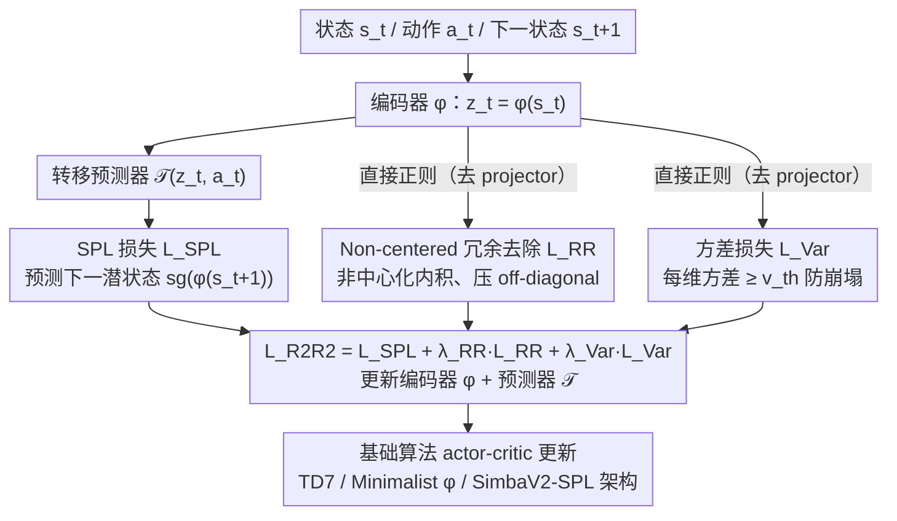

# R2R2: Robust Representation for Intensive Experience Reuse via Redundancy Reduction in Self-Predictive Learning

**会议**: ICML 2026  
**arXiv**: [2605.14026](https://arxiv.org/abs/2605.14026)  
**代码**: 有（github.com/songsang7/R2R2）  
**领域**: 强化学习 / 自预测表示学习 / 高 UTD 训练  
**关键词**: Self-Predictive Learning, Redundancy Reduction, VICReg, 高 UTD, 表征崩塌

## 一句话总结
R2R2 把 VICReg 风格的冗余去除约束加进自预测学习（SPL）以稳定高 UTD 训练，但**关键改动是不做零中心化**——理论上证明 zero-centering 会消除 SPL 谱分解中的常数本征模（即全局动力学信息），实验在 TD7 上 UTD=20 时把分数从 1.02 提到 1.24（+22%），并以新提出的 SimbaV2-SPL 架构刷新连续控制 SOTA。

## 研究背景与动机

**领域现状**：强化学习对样本效率的追求催生了两条线——off-policy 算法重用 replay buffer，model-based / SPL 类方法用辅助任务（预测下一个 latent 状态）从动力学中榨取额外信号。提高 Update-to-Data (UTD) 比是另一种正交手段，但 UTD↑（如 20）几乎必然引发过拟合。当前的高 UTD 工作（REDQ、CrossQ、SimbaV2、BRO）几乎都把火力集中在**价值函数侧**——用 ensemble、BatchNorm、LayerNorm 等手段稳住 critic 的 bias。

**现有痛点**：这些 value-centric 方法没解决**表征层的不稳定性**。当 UTD 拉高时，SPL 编码器与潜在动力学预测器也会过拟合：表征崩塌（subspace collapse）、有效秩持续下降。已有的 SSL 冗余去除方法（Barlow Twins、VICReg）原生为视觉表示设计，**默认要做零中心化**（covariance 矩阵在减均值后算）；如果直接搬到 SPL 里反而会让性能掉。

**核心矛盾**：SPL 的理论分析（Tang et al., 2023）表明，最小化 SPL 损失等价于让表征矩阵 $\Phi$ 张成转移矩阵 $P^\pi$ 的 top-$k$ 右本征向量子空间。马尔可夫链总有本征值 1，对应的本征向量是常数向量 $\mathbf 1$（$P\mathbf 1=\mathbf 1$），承载"全局动力学/概率守恒"信息。**零中心化算子 $H=I_N-\frac{1}{N}\mathbf 1\mathbf 1^\top$ 对任意常数向量都为 0**——也就是说，SSL 套路里那个看似无害的"减均值"会精准地把这个 dominant eigenmode 抹掉，与 SPL 的目标直接冲突。

**本文目标**：(i) 给高 UTD 训练加一个表征层正则化；(ii) 让该正则化与 SPL 的谱性质相容；(iii) 让设计对算法/架构不可知，能即插即用。

**切入角度**：作者从 SPL 谱分解的"常数本征模"这个数学细节切入——这是 SSL 圈完全没碰过的视角——发现 zero-centering 是结构性问题而非简单"超参调一调"。

**核心 idea**：用 **non-centered covariance（直接用内积矩阵，不减均值）**做冗余去除正则化，同时去掉额外 projector，把整个机制直接挂在 SPL 编码器输出上，把"redundancy reduction"和"SPL 谱保持"统一起来。

## 方法详解

### 整体框架
R2R2 在标准 SPL 训练循环里给编码器输出 $z_t=\phi(s_t)$ 加上两项正则：non-centered 冗余去除损失 $\mathcal L_{\text{RR}}$ 和方差损失 $\mathcal L_{\text{Var}}$。SPL 主损失 $\mathcal L_{\text{SPL}}=\mathbb E[\|\mathcal T(\phi(s),a)-\text{sg}(\phi(s'))\|_2^2]$ 不变。每个 environment step 后做 $G$ 次高 UTD 更新，每次：编码状态、算 $\mathcal L_{\text{SPL}}+\lambda_{\text{RR}}\mathcal L_{\text{RR}}+\lambda_{\text{Var}}\mathcal L_{\text{Var}}$ 更新编码器和预测器，再走基础算法（TD7、Minimalist $\phi$、SimbaV2-SPL 等）的 actor-critic 更新。同时论文构造了 SimbaV2-SPL 架构把 SPL 模块（编码器 + 转移预测器）接入 SimbaV2，让 R2R2 能与 SOTA 架构叠加。整条 pipeline 里两个关键改动都体现为「损失挂在哪、怎么算」：冗余去除项用非中心化形式（设计 1），且直接挂在编码器输出上、不经 projector（设计 2）；再加上把整个 SPL 模块塞进 SimbaV2 的架构改造（设计 3）。

### 关键设计

**1. Non-centered Redundancy Reduction Loss：去掉"减均值"，让冗余正则不再误杀常数本征模**

这是全文的命门。SPL 的理论分析表明最小化 SPL 损失等价于让表征张成转移矩阵 $P^\pi$ 的 top-$k$ 右本征向量子空间，而马尔可夫链总有本征值 1、对应常数向量 $\mathbf 1$（$P\mathbf 1=\mathbf 1$），承载着全局动力学信息。VICReg/Barlow Twins 那个看似无害的"减均值"算子 $H=I_N-\frac{1}{N}\mathbf 1\mathbf 1^\top$ 对任意常数向量都为 0——也就是说它会精准地把这个 dominant eigenmode 抹掉。R2R2 的修法极简：把标准 covariance 换成非中心化相关矩阵 $[C(Z)]_{ij}=\frac{1}{N-1}\sum_b z_{b,i}z_{b,j}$（不减均值），损失 $\mathcal L_{\text{RR}}=\frac{1}{d(d-1)}\sum_{i\neq j}[C(Z)]_{ij}^2$ 把 off-diagonal 内积压向 0，强制不同特征维"无关但不去均值"。

Lemma 1 + Proposition 2 严格证明了 $H\mathbf c=\mathbf 0$ 意味着零中心化把表征在 $\mathbf 1$ 方向的投影精确消掉。虽然网络的 bias 参数理论上能补回这部分信号，但那是额外的优化弯路，不如直接在损失里保留它——"理论告诉你哪一行代码不能动"。

**2. Direct Regularization：去掉 projector，把正则直接施加在编码器输出上**

标准 VICReg/Barlow Twins 都先把 $z$ 过一个 projector $g$ 再算冗余损失，但 R2R2 的理论分析揭示 SPL 谱性质约束的是编码器输出 $\phi(s)$ 本身——中间插一个 projector 反而会模糊正则化对"真正被下游使用的表征"的约束。所以 R2R2 直接对 $\phi(s)$ 算 $\mathcal L_{\text{RR}}$ 和 $\mathcal L_{\text{Var}}$，让约束精确落在受 SPL 谱要求的那层表征上。少一个模块还顺手减小了高 UTD 下的过拟合面积。

**3. SimbaV2-SPL 架构：把 SPL 模块装进 SOTA model-free 架构，证明改进对架构正交**

只在单一基线 TD7 上验证容易被质疑"是不是某个特定算法的 trick"。为此作者主动给纯 model-free 的 SimbaV2 装上 SPL 框架：额外加一个编码器 $\phi$ 和转移预测器 $\mathcal T$，并把原始状态做线性投影 + L2 normalization 后与潜表征 $z$ 拼接再喂入 actor/critic——这样既注入了 latent dynamics，又保留 SimbaV2 对原始信号的高频细节。在这个正交架构上叠加 R2R2 仍能涨点，就说明改进与现代架构进步互补，而非依赖某种特定结构。

### 损失函数 / 训练策略
$\mathcal L_{\text{R2R2}}=\mathcal L_{\text{SPL}}+\lambda_{\text{RR}}\mathcal L_{\text{RR}}+\lambda_{\text{Var}}\mathcal L_{\text{Var}}$。所有实验固定 $\lambda_{\text{RR}}=\lambda_{\text{Var}}=0.01$、方差阈值 $v_{th}=1$，**全任务不调参**。基础算法的所有其余超参不变。

## 实验关键数据

### 主实验
11 个连续控制环境（Gym MuJoCo 4 个 + DMC-Hard 7 个），归一化分数（相对 UTD=1 baseline）；UTD=1 和 UTD=20 两套设置；500k 步 budget。

| 算法 | 环境 | UTD=1 | UTD=20 |
|---|---|---|---|
| TD7 | Total | 1.00 | 1.02 |
| TD7 + R2R2 | Total | **1.06** | **1.24** (+22%) |
| TD7 | DMC-Hard | 1.00 | 1.02 |
| TD7 + R2R2 | DMC-Hard | 1.05 | **1.32** |
| Minimalist φ | Gym | 1.00 | 0.41 (崩) |
| Minimalist φ + R2R2 | Gym | 1.00 | **0.57** |
| TD7+LN | Total | 1.00 | 0.88 (倒退) |
| TD7+LN + R2R2 | Total | 1.08 | **1.10** |
| SimbaV2 | Total | 1.00 | 1.20 |
| SimbaV2 + SPL | Total | 1.16 | **1.34** (新 SOTA) |
| SimbaV2 + SPL + R2R2 | Total | 1.15 | **1.38** |

### 消融实验

| 配置 | Dog-Trot at UTD=20 | 结论 |
|---|---|---|
| Full R2R2（non-centered） | 高 | 完整方法 |
| R2R2 + zero-centering | 显著退化 | 验证 Proposition 2 |
| 去 $\mathcal L_{\text{RR}}$ | 退化更严重 | RR 项主贡献 |
| 去 $\mathcal L_{\text{Var}}$ | 退化中度 | Var 项防 collapse |
| TD7 baseline（无 R2R2） | 最低 | 无防护 |

### 关键发现
- **R2R2 与 LayerNorm 互补**：TD7+LN 在高 UTD 下反而比 baseline 还差（0.88），加 R2R2 后回到 1.10，说明架构归一化解决不了表征崩塌。
- **奇异值谱可视化（Humanoid-Stand）**：UTD=1 时 R2R2 把 effective rank 从 76.5 压到 65.0（谱集中、保留 task-relevant 主成分）；UTD=20 时 baseline 出现 tail singular value 急剧塌陷，R2R2 保持重尾分布，防止 subspace collapse。
- **Effective Rank 时间演化**：UTD=20 下 baseline 的 ER 渐进式下降，R2R2 维持稳定高 ER；加 zero-centering 又会跟着 baseline 一起塌——直接实验印证理论分析。

## 亮点与洞察
- **从"谱分解"看 SSL 与 RL 的兼容性**：以前没人想过 VICReg 那个 "减均值" 步骤会精准杀死 Markov 链常数本征模。这个观察把"通用 SSL trick 直接搬到 RL"的乐观假设撕开口子，提醒我们 SSL 的设计前提（数据无序、对均值不敏感）在 RL latent dynamics 这种结构化数据上未必成立。
- **理论指导的极小改动**：只是把 covariance 公式里的"减均值"删掉，配合"去 projector"两个小动作，就在 SOTA 架构上稳定涨点。"理论分析告诉你**哪一行代码不能动**" 这种简洁干净的论文结构值得借鉴。
- **正交性论证扎实**：不仅 TD7、Minimalist φ、TD7+LN 三个不同复杂度的 SPL baseline 都涨，还自己造 SimbaV2-SPL 把 R2R2 接到最强 backbone 上仍涨——四组实验确保不是 TD7-specific trick。
- **零超参调整**：所有任务用同一组 λ，对实际落地非常友好。

## 局限与展望
- 理论分析建立在 Tang et al. 2023 的"SPL ≈ 谱分解"等价上，对非 SimSiam-style 框架（如 BYOL+predictor）的紧度未充分讨论。
- SimbaV2-SPL 的引入混合了"加 SPL"和"加 R2R2"两个变量，纯净比较被部分稀释（论文也确实分开报告了 +SPL 与 +SPL+R2R2）。
- 实验聚焦连续控制（MuJoCo + DMC-Hard），离散动作（Atari）和稀疏奖励、像素输入等场景未验证。
- 训练时间开销约 +12% wall-clock，对极大规模可能仍需优化。

## 相关工作与启发
- **vs VICReg / Barlow Twins**：原生 SSL 冗余去除，零中心化对 SPL 是结构性破坏；R2R2 用 non-centered 形式修复。
- **vs REDQ / CrossQ**：value-centric 高 UTD 方法，解决 critic bias；R2R2 解决正交的表征崩塌，可叠加。
- **vs SimBa / SimbaV2 / BRO**：靠架构归一化（LN）和 dropout 稳定高 UTD；R2R2 证明仅靠架构不够，正则化是补充必要项。
- **vs SPR / TD7（SPL 系）**：原生 SPL 在高 UTD 下表征不稳定；R2R2 注入冗余去除直接稳住编码器。

## 评分
- 新颖性: ⭐⭐⭐⭐⭐ 用谱分析解释"为什么 SSL 中心化与 SPL 不兼容"这个洞察非常新。
- 实验充分度: ⭐⭐⭐⭐⭐ 11 个环境 × 4 个 baseline × 2 个 UTD 设置 + ER/谱分析/wall-clock 全面覆盖。
- 写作质量: ⭐⭐⭐⭐⭐ 理论引理-命题-实验-消融环环相扣，叙事干净。
- 价值: ⭐⭐⭐⭐ 给高 UTD RL 提供新的表征层稳定化机制，且证明能与 SOTA 架构正交叠加。

<!-- RELATED:START -->

## 相关论文

- [\[ICLR 2026\] Experience-based Knowledge Correction for Robust Planning in Minecraft](../../ICLR2026/robotics/experience-based_knowledge_correction_for_robust_planning_in_minecraft.md)
- [\[CVPR 2026\] Learning Predictive Visuomotor Coordination](../../CVPR2026/robotics/learning_predictive_visuomotor_coordination.md)
- [\[ICML 2026\] Plan in Sandbox, Navigate in Open Worlds: Learning Physics-Grounded Abstracted Experience for Embodied Navigation](plan_in_sandbox_navigate_in_open_worlds_learning_physics-grounded_abstracted_exp.md)
- [\[NeurIPS 2025\] Sample-Efficient Tabular Self-Play for Offline Robust Reinforcement Learning](../../NeurIPS2025/robotics/sample-efficient_tabular_self-play_for_offline_robust_reinforcement_learning.md)
- [\[CVPR 2026\] Dejavu: Towards Experience Feedback Learning for Embodied Intelligence](../../CVPR2026/robotics/dejavu_towards_experience_feedback_learning_for_embodied_intelligence.md)

<!-- RELATED:END -->
