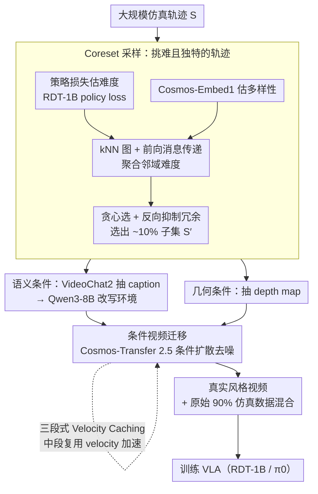

# Seeing Realism from Simulation: Efficient Video Transfer for Vision-Language-Action Data Augmentation

**会议**: ICML 2026  
**arXiv**: [2605.02757](https://arxiv.org/abs/2605.02757)  
**代码**: 公开（论文末附 CODE 链接）  
**领域**: 机器人 / 具身智能 / VLA / 视频生成与数据增广  
**关键词**: Sim-to-Real、VLA、视频扩散、Velocity Caching、Coreset 采样

## 一句话总结
针对 VLA（vision-language-action）模型在简单扰动下性能崩塌的问题，本文用"提取语义/几何条件 → 改写 caption → 条件视频扩散重渲染"的视频迁移流水线给仿真数据补上视觉与环境多样性，同时配以三段式 velocity caching 把生成时间砍掉 61% 以及 difficulty + diversity 双驱动的 coreset 采样仅选 10% 关键轨迹，最终在 Robotwin 2.0、LIBERO-Plus 和真机上让 RDT-1B / $\pi_0$ 涨 5–15%。

## 研究背景与动机

**领域现状**：VLA 模型（RDT、$\pi_0$、$\pi_{0.5}$、OpenVLA、ACT）依靠大规模真实机器人轨迹端到端训练。但真实数据收集贵、慢、难扩；仿真数据便宜可并行，却存在显著视觉/环境 gap，训出来的策略一旦遇到光线/背景/视角扰动就崩。

**现有痛点**：LIBERO-Plus 报告，原本 95% 成功率的策略在轻微扰动下掉到 30% 以下；LIBERO-PRO 在物体位置和指令变化下接近 0% 成功——说明模型在记动作序列而非真正理解任务。简单加随机噪声/颜色扰动没法补出真实环境的语义复杂度。

**核心矛盾**：要让仿真数据"看起来真"，最直接的办法是用条件视频扩散重渲染，但 Cosmos-Transfer 这种模型在 A100 上跑一个 5 秒 720p 视频要 40 分钟，根本无法在百万级仿真轨迹上 scale。

**本文目标**：(1) 设计一个能把仿真视频整段迁移为高保真真实风格、且严格保留动作轨迹的流水线；(2) 把生成成本压到能上规模的水平；(3) 不用全量增广就把每一份计算用在刀刃上。

**切入角度**：作者一边在生成质量上做"加法"——用 caption rewriting + depth 几何控制 + 条件视频扩散造出环境多样的真实化视频；另一边在生成开销上做"减法"——观察到 flow-based 扩散的 velocity field 中段几乎不变，可以缓存复用。

**核心 idea**：把视频增广拆成"生成"与"挑选"两条正交的效率轴。生成侧靠 velocity caching 砍单视频成本，挑选侧靠 difficulty + diversity 的 graph-based coreset 砍要生成的轨迹数。

## 方法详解

### 整体框架
给定一批仿真训练轨迹 $\mathcal{S}=\{s_1,\dots,s_n\}$：(1) coreset 采样选出 $\mathcal{S}'\subset\mathcal{S}$，只对这一小撮做生成；(2) 对每条选中的视频，用 VideoChat2 抽 caption，Qwen3-8B 改写 caption 引入背景/物体颜色等环境变量，同时抽 depth 当几何控制；(3) 用 Cosmos-Transfer 2.5 以新 caption + depth 为条件做条件视频扩散，得到视觉风格大改但动作轨迹不变的"真实化"视频；(4) 把生成的视频和原 90% 仿真数据混着喂给 VLA 训练。整条流水线最关键的两个加速器是 velocity caching（砍单视频生成成本）和 coreset（砍要生成的轨迹数）。

### 关键设计

**1. Difficulty × Diversity 的 Coreset 采样：只挑"难且独特"的轨迹来增广**

整条流水线第一步先解决"对谁做增广"——全量生成成本不可承受，所以只挑值得生成的那一小撮。单看 difficulty 容易扎进某个 hard cluster，单看 diversity 又会把简单水任务拉进来，两者都浪费生成预算。本文把 $\mathbb{D}^2$ Pruning 扩展到视频：难度 $x_i = \frac{1}{|\mathcal{T}_i|}\sum_{t}\mathcal{L}_{\text{policy}}(s_i^{(t)};\theta)$ 用 RDT-1B 的策略损失估（task-aware），多样性用 Cosmos-Embed1 给每条轨迹 768 维嵌入 $\phi(s_i)$、以 RBF 核 $e_{i,j}=\exp(-\gamma_f\|v_i-v_j\|^2)$ 建 kNN 图（task-agnostic）。前向消息传递把邻域难度聚合 $x_i' = x_i + \sum_{j\in\mathcal{N}(i)}e_{i,j}\cdot x_j$，贪心选最高 $x_i'$，再用反向消息 $x_j' \leftarrow x_j' - \exp(-\gamma_r\|v_{s^*}-v_j\|^2)\cdot x_{s^*}'$ 抑制相似邻居的分数避免冗余。用 task-aware 损失估难度、task-agnostic 嵌入估多样性，正好避开了"难的全是相似失败模式"和"多样但都是水任务"两个极端，于是 10% 预算就能逼近全量增广效果。

**2. 条件视频迁移（语义 + 几何双条件）：换环境但不换动作**

选出子集后，对每条视频做迁移。只改 caption 会让物体几何漂移、机械臂关键位姿失真，动作就丢了；只给 depth 又缺语义多样性。所以本文用两个互补条件分头承担"看起来不一样"和"做的事一样"。语义侧：VideoChat2 先抽时序 caption 描述交互、对象与空间关系，Qwen3-8B 再把背景、物体颜色等可变要素改写出多样性、同时保留任务意图。几何侧：从原视频抽 depth map 当稳定几何约束（比 edge/blur/seg 都更保几何）。最后 Cosmos-Transfer 2.5 在"新 caption + depth"上迭代去噪，生成视觉风格大改、动作轨迹不变的真实化视频。这样仿真数据的视觉与环境多样性被补上，但每一帧的机械臂动作仍严格对应原轨迹。

**3. 三段式 Velocity Caching：复用扩散中段几乎不变的 velocity**

迁移里最贵的是 Cosmos-Transfer 的迭代去噪（A100 上一个 5 秒 720p 视频要 40 分钟），velocity 预测占单步运行时间 70%+。通用 caching（如 DeepCache）默认去噪两端都重要，没对准扩散动力学的真实曲线。作者实测 flow-based 视频扩散的 $\|v_{t+1}-v_t\|$ 时序曲线后发现一个三段式动态：初期变化剧烈、中段几乎平稳、末尾再微调，正对应"画轮廓 → 细化 → 收尾"的去噪节奏。于是把 $N$ 步去噪切成三段：初期（$t<t_s$）每步算、稳定期（$t_s\leq t< t_f$）每 $\alpha$ 步算一次其余复用、末期（$t\geq t_f$）每步算，稳定期起点用 $\frac{\|v_t-v_{t+1}\|}{\|v_0-v_1\|} < k$ 阈值检测（论文取 $k=0.4,\alpha=8, m=3$）。因为缓存只发生在 velocity 真正平稳的中段，所以在砍掉 61.2% 生成时间的同时质量基本不掉（消融 26.5 vs 27.0），证明这段计算冗余可以被工程级利用。

### 损失函数 / 训练策略
不改 VLA 本体损失，只是把训练集换成原始仿真 + 由 coreset 采样后增广的真实风格视频。论文比较两种混入策略：mixture（保留所有原数据 + 加入增广）和 replacement（用增广直接替换被选中的 coreset）；发现 $\pi_0$ 更受益于 mixture，更强的 $\pi_{0.5}$ 反而更喜欢 replacement——更强模型能扛得住更大的分布平移。

## 实验关键数据

### 主实验
Robotwin 2.0 单任务（RDT-1B）"Hard" 场景下原始 vs 增广：

| 任务 | Ori. (Hard) | Aug. (Hard) | $\Delta$ |
|------|-------------|-------------|----------|
| adjust_bottle | 72.0 | 82.0 | +10.0 |
| beat_block_hammer | 36.0 | 48.0 | +12.0 |
| place_burger_fries | 26.0 | 38.0 | +12.0 |
| open_laptop | 30.0 | 44.0 | +14.0 |
| **average** | **29.0** | **39.0** | **+10.0** |

LIBERO-Plus spatial suite，$\pi_0$ + 50% coreset 增广：

| 扰动类型 | Ori. | Aug. | $\Delta$ |
|----------|------|------|----------|
| objects layout | 69.6 | 86.2 | +16.6 |
| language instructions | 37.9 | 55.9 | +22.0 |
| background textures | 81.1 | 87.6 | +6.5 |
| robot initial states | 10.3 | 6.3 | −4.0 |
| camera view points | 21.3 | 15.2 | −6.1 |
| **average** | **42.7** | **47.8** | **+5.1** |

真机 AgileX Piper（两任务、三场景、各 10 次）：$\pi_0$ 平均成功率从 60% → 75%（+15%），$\pi_{0.5}$ 60% → 73%（+13%）。

### 消融实验

| 设置 | Robotwin Hard 平均 | 说明 |
|------|--------------------|------|
| 原始仿真 | 29.0 | baseline |
| Aug. w/ velocity cache | 26.5 | 缓存加速 |
| Aug. w/o velocity cache | 27.0 | 全步计算 |
| Aug.（不用 coreset，全量增广） | 39.0 | 上限 |

视频生成质量 vs RoboTransfer（adjust_bottle，越低越好 RMSE/Abs.Rel/Sq.Rel）：

| 方法 | RMSE | Abs.Rel | Sq.Rel | sim$\uparrow$ |
|------|------|---------|--------|---------------|
| RoboTransfer | 0.46 | 0.37 | 0.39 | 21.5 |
| **Ours** | **0.28** | **0.16** | **0.07** | **26.3** |

### 关键发现
- velocity caching 几乎不掉点（26.5 vs 27.0）却把生成时间砍 61%，证明 flow-based 扩散在中段确实存在巨大的计算冗余可以被工程级利用。
- 10% coreset 在 Robotwin 多任务（300 trajectory/任务）上把 RDT-1B 平均从 23% 拉到 31%，说明在重复度高的仿真数据上"挑得准"远比"加得多"更划算。
- 真实机器人实验里增广对 background 和 position 扰动收益最大（"Stack Tape" position 5/10 → 8/10），但对 robot initial states 和 camera viewpoints 反而掉点——本文方法只增广外观，对几何/视角变化无能为力，这是它的明显边界。
- 在 LIBERO（评测分布几乎等于训练分布）上略掉 0.2–0.5 个点，再次印证"过度增广会污染近分布场景"。

## 亮点与洞察
- 双轴效率优化（caching 砍单样本 cost + coreset 砍样本数）的思路相当工程主义，但对所有依赖大模型生成训练数据的领域都适用：先看能不能每个样本生成更便宜，再看能不能根本不生成这部分样本。
- 把 caption rewriting 用作"语义抽象层"是个聪明做法——LLM 来负责"变什么 / 不变什么"，扩散模型只负责渲染，符合各自能力边界。
- coreset 的双信号设计很值得借鉴：用 task-aware 的策略损失估难度 + 用 task-agnostic 的视觉嵌入估多样性，避免了"难度高的全是相似失败模式"或"多样但都是水任务"两种极端。

## 局限与展望
- 只增广外观和环境，几何/视角扰动覆盖不了；要解决得引入 3D scene 或 NeRF/3DGS 级别的相机重投影。
- Cosmos-Transfer 2.5 即便加 caching 仍重，单视频量级在分钟级，离 RL 在线增广还远。
- coreset 估难度依赖一个预训练 RDT-1B，本身就有 bias；对没有 pretrained policy 的任务族可能失效。
- LIBERO 上的轻微下降说明应该有 "task-aware 增广强度调节"，目前一刀切。

## 相关工作与启发
- **vs RoboTransfer**：同样是仿到真视频迁移，本文在几何指标（RMSE / Abs.Rel / Sq.Rel）上普遍 2–6× 改善，且把生成时间从分钟级压到秒级量级。
- **vs Gigaworld / GigaBrain / Embodied Dreamer**：这些做世界模型驱动的数据生成，往往需要全栈仿真器；本文不动仿真器，只在视频层 post-hoc 改写，部署轻。
- **vs $\mathbb{D}^2$ Pruning**：原方法面向纯静态数据，本文把节点从图片换成轨迹嵌入、把难度从分类 loss 换成 policy loss，做了"具身化"的扩展。

## 评分
- 新颖性: ⭐⭐⭐⭐ 单点工程都不算 brand new，但"双轴效率 + 视频迁移 + coreset"的组合非常实用
- 实验充分度: ⭐⭐⭐⭐⭐ 仿真 + 真机、两个策略族、三个 benchmark，外加生成质量对比，覆盖很全
- 写作质量: ⭐⭐⭐⭐ 流程图清晰、公式简洁；个别表格排版略乱
- 价值: ⭐⭐⭐⭐⭐ 给 VLA 社区送了一套可直接抄的"低成本仿到真"增广工具链

<!-- RELATED:START -->

## 相关论文

- [\[ICML 2026\] StableVLA: Towards Robust Vision-Language-Action Models without Extra Data](stablevla_towards_robust_vision-language-action_models_without_extra_data.md)
- [\[ICML 2026\] From Abstraction to Instantiation: Learning Behavioral Representation for Vision-Language-Action Model](from_abstraction_to_instantiation_learning_behavioral_representation_for_vision-.md)
- [\[ICLR 2026\] TwinVLA: Data-Efficient Bimanual Manipulation with Twin Single-Arm Vision-Language-Action Models](../../ICLR2026/robotics/twinvla_data-efficient_bimanual_manipulation_with_twin_single-arm_vision-languag.md)
- [\[ICML 2026\] Spatial Memory for Out-of-Vision Manipulation in Vision-Language-Action](spatial_memory_for_out-of-vision_manipulation_in_vision-language-action.md)
- [\[ICLR 2026\] D2E: Scaling Vision-Action Pretraining on Desktop Data for Transfer to Embodied AI](../../ICLR2026/robotics/d2e_scaling_vision-action_pretraining_on_desktop_data_for_transfer_to_embodied_a.md)

<!-- RELATED:END -->
