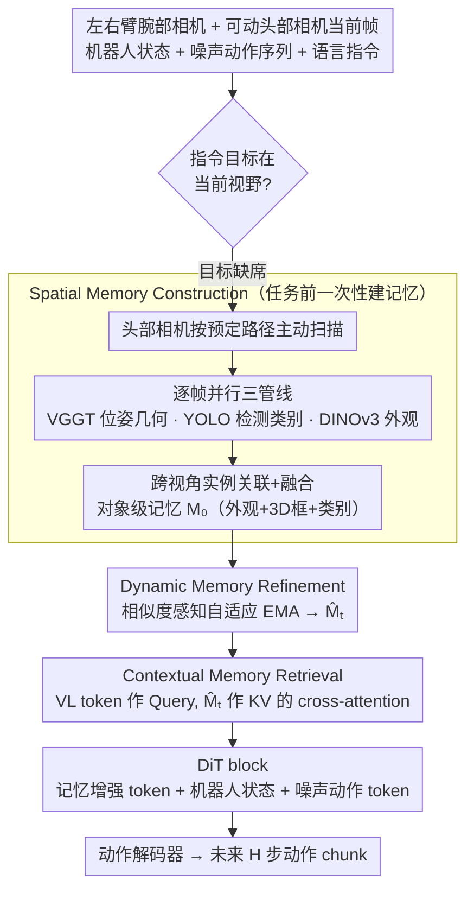

# Spatial Memory for Out-of-Vision Manipulation in Vision-Language-Action

**会议**: ICML 2026  
**arXiv**: [2605.22283](https://arxiv.org/abs/2605.22283)  
**代码**: 待发布  
**领域**: robotics  
**关键词**: VLA、空间记忆、视野外操作、可动头部相机、记忆引导操控

## 一句话总结
SOMA 给 VLA 装上由可动头部相机扫描构建、可在线增量更新、可被指令检索的持久化空间-语义记忆，使机器人能稳定操控当前视野之外的物体，在 5 个真实 OOV 抓取任务上把首次注视时间、头部搜索路径、抓取次数都压缩 40-60%。

## 研究背景与动机
**领域现状**：当前 VLA 主流是在固定的桌面单视角或第三人称视角下，把多模态大模型加一个动作头/动作模块，端到端把图像-语言映射成动作。这种设置便于标定、便于采集大规模数据，所以几乎所有主流 VLA（如 GR00T-N1.5、π0、OpenVLA-OFT、SpatialVLA）都默认任务目标"看得见"。

**现有痛点**：一旦目标暂时被遮挡或落到相机视野之外，纯反应式感知就崩了——模型既无法定位目标，也无法把过去观测到的位置信息再调用回来，于是动作变得盲目搜索，多阶段和双臂任务里失败率急速攀升。

**核心矛盾**：感知-动作环路是严格视野绑定的，但操控的语义对象往往跨越多个视角。要么靠 MLLM 的"空间想象"补全（在目标完全不可见时其空间估计会迅速失真，并把误差传到下游），要么靠主动头部扫描补观测（不存空间记忆，多步任务里照样会忘）。两条路都缺一个"先看再记再用"的统一机制。

**本文目标**：让 VLA 在三个粒度上同时解决 OOV：(1) 任务前能把整个工作空间扫描成一份可查询的空间-语义记忆；(2) 操控过程中能基于新观测增量校正这份记忆；(3) 指令推理时能精准检索到与当前子目标相关的记忆区域。

**切入角度**：作者观察到失败模式不是"看不到所以猜不准"，而是"看到过但没留下"——只要扫描一次把场景实例固化成带 3D 几何的对象级记忆，后续即便目标移出视野，模型仍能从记忆里读出位置/外观/类别。所以核心不是更深的推理，而是更稳定的记忆基质。

**核心 idea**：用可动头部相机做一次主动扫描构建"对象级空间-语义记忆库"，再用相似度感知的 EMA 在线刷新，最后让 VLM token 通过 cross-attention 从记忆库里检索语义相关条目，整套机制无缝嵌进 DiT-based 动作扩散头里。

## 方法详解
SOMA 把感知重新建模为"记忆中心"过程：感知模块发现指令目标不在当前视野时，先触发主动扫描完成记忆初始化；操控过程中头部视图持续把新观测融进记忆；DiT 动作头通过对记忆的检索拿到全局上下文，再去预测动作 chunk。整套框架以 GR00T-N1.5 为底座，额外加了三个轻量记忆模块和一套头部扫描脚本。

### 整体框架
输入包括左/右臂腕部相机、可动头部相机的当前帧、机器人状态、噪声动作序列、自然语言指令，外加一份预先构建的场景记忆 $\mathcal{M}_0$；输出是未来 $H$ 步的动作 chunk。流水线分四段：(1) 头部预扫描→记忆构建；(2) 操控时头视图实时更新→Dynamic Memory Refinement 得到 $\hat{\mathcal{M}}_t$；(3) VLM 编码出的视觉-语言 token 作为 Query 去 $\hat{\mathcal{M}}_t$ 里做 cross-attention，得到记忆增强 token；(4) 增强 token + 机器人状态 + 噪声动作 token 进 DiT block，由动作解码器吐出动作 chunk。整个 VLM 语言解码器在训练中保持冻结，只优化感知/记忆/动作侧的参数。

### 关键设计

**1. Spatial Memory Construction：任务前一次性多视角扫描，把场景固化成对象级、带 3D 几何、可查询的记忆**

OOV 失败的根因不是"看不到所以猜不准"，而是"看到过却没留下"，所以必须用真实多视角观测做地基、而非靠 MLLM 想象。任务开始前，头部相机按预定义路径扫描出视频 $V$，均匀采样得 $\tilde{V}$，每帧并行跑三条互补管线——VGGT 出相机位姿和场景几何、YOLO 出 2D 检测框和类别、DINOv3 出稠密特征。用 2D 框 + 平均池化得到实例外观嵌入 $\mathbf{f}_j^{(i)} \in \mathbb{R}^C$，再用 VGGT 几何把 2D 框抬升到全局 3D 坐标系下的 $\mathbf{b}_j^{(i)} \in \mathbb{R}^{8\times 3}$。跨视角按"DINOv3 余弦相似度 + 3D 框空间一致性"做类内实例关联，超阈值就合并并对外观/几何取平均，得到全局实例集合 $\{(\mathbf{f}_k, c_k, \mathbf{b}_k)\}$，最后拼成记忆 token $\mathbf{m}_k^0 = \Phi_{\text{mem}}(\mathbf{f}_k) + \Phi_{\text{pos}}(\mathbf{b}_k)$。

三条管线缺一不可——YOLO 给语义、DINOv3 给细粒度外观、VGGT 给跨视角对齐的几何；检测漏掉时还注入可学习占位嵌入和伪框，避免记忆稀疏化。正是这份真实观测构成的"地基"，让目标即便后续移出视野，模型仍能从记忆里读出它的位置、外观、类别。

**2. Dynamic Memory Refinement：用相似度感知的自适应 EMA 在线刷新记忆**

操控过程中场景会变（物体被移动、被遮挡、新物体出现），记忆得跟着更新，但固定 EMA 系数两头不讨好——系数大则记忆抖动，系数小则对真实变化反应迟钝。SOMA 让当前帧 $o_h^t$ 走同样的感知管线产出 $\mathcal{M}_t$，按类内匹配（每观测最多匹一个记忆、每记忆每步最多被一个观测更新）后，算两个分数：语义相似度 $s_{kj}^t = \sigma(\Phi_{\text{sim}}([\mathbf{m}_k^{t-1} - \mathbf{m}_j^t]))$ 和动态融合分 $g_{kj}^t = \sigma(\Phi_{\text{fuse}}([\mathbf{m}_k^{t-1}, \mathbf{m}_j^t]))$，相乘得自适应系数 $\alpha_{kj}^t = g_{kj}^t \cdot s_{kj}^t$，再做时间 EMA $\mathbf{m}_k^t = \alpha_{kj}^t \mathbf{m}_j^t + (1 - \alpha_{kj}^t) \mathbf{m}_k^{t-1}$。

由 sigmoid 网络从相似度学出系数，就能在"小视角抖动→保稳"和"物体真被移动→快换"之间自动切换。还有一个对 OOV 至关重要的细节：匹配不上的旧记忆不删而是保留——因为目标只是离视、不是消失，删了就前功尽弃。

**3. Contextual Memory Retrieval：让指令引导的 cross-attention 按需检索记忆，再注入扩散动作头**

直接把全部记忆 token 拼进 VLM 输入会拉长 context、稀释当前观测。SOMA 改成检索式：把 VLM 出的视觉-语言 token $\mathbf{X}_{\text{vl}}$ 当 Query，记忆 $\hat{\mathcal{M}}_t$ 经 $\Phi_{\text{align}}$ 对齐后当 Key/Value，用标准缩放点积注意力 $\mathbf{X}_{\text{boost}} = \text{softmax}(\mathbf{Q}\mathbf{K}^\top / \sqrt{C}) \mathbf{V}$ 得到记忆增强 token，再把它作为全局空间先验注入 DiT block，与原 VL token、机器人状态、噪声动作 token 一起做联合扩散。

把记忆放进 cross-attention 的 KV 而非 prompt context，既保持了当前感知通路的紧凑，又让 DiT 在每一步条件生成时只调用与当前子目标相关的空间证据，天然契合扩散式动作头的工作方式。

### 损失函数 / 训练策略
训练数据：每个真实任务采 400 条 VR 遥操作示范，每条轨迹分扫描阶段（用于离线预构建 $\mathcal{M}_0$）和操控阶段（用于训练所有对比模型）；仿真实验里 $\mathcal{M}_0$ 直接从首帧构建。优化目标沿用 GR00T-N1.5 的扩散动作匹配损失；冻结 VLM 语言解码器，其余全部联合训练。多任务 batch=60、训练 30k steps、32 张 H200。推理时由轻量目标检测器判断指令目标是否在当前视野，缺席就触发头部扫描。

## 实验关键数据

### 主实验
真实 5 个 OOV 抓取任务上的行为指标：SOMA 在所有 5 个任务上一致把"首次注视目标的时间、头部搜索角度、视角校正次数、抓取尝试次数、首抓时间"压到 GR00T-N1.5 的 40-60%。

| 指标（Task 5 双臂场景） | 本文 SOMA | GR00T-N1.5 | 相对降幅 |
|--------|------|----------|------|
| 首次注视时间 (s) | 4.7 | 11.5 | -59% |
| 头部搜索路径 (deg) | 70.4 | 164.0 | -57% |
| 视角校正次数 | 2.3 | 5.3 | -57% |
| 抓取尝试次数 | 1.6 | 3.7 | -57% |
| 首抓时间 (s) | 14.6 | 36.5 | -60% |

仿真 SimplerEnv（Visual Matching 协议，OXE 预训练 + Fractal 微调）：

| 方法 | Pick Coke Can | Move Near | Open/Close Drawer | 平均 |
|------|------|------|------|------|
| OpenVLA-OFT | 72.3 | 69.6 | 47.2 | 63.0 |
| GR00T-N1.5 | 47.0 | 70.0 | 18.1 | 45.0 |
| **SOMA** | **85.0** | **73.0** | 31.5 | **63.2** |

RoboCasa Tabletop GR1（5 类任务、300 条 demo 设置）：SOMA 平均成功率 52.0%，比 GR00T-N1.5 (44.3) 和 Diffusion Policy (39.2) 都明显高，且在 30/100/300/Full 全部数据规模下都保持领先，显示样本效率。

### 消融实验
| 配置 | OOV 平均 SR (%) | 说明 |
|------|---------|------|
| Scan + GR00T | 18.5 | 只有头部扫描，无持久记忆 |
| No-Scan SOMA | 19.8 | 用单帧初始化记忆，没扫描 |
| Scan-only SOMA | 24.1 | 多视角扫描建记忆，但操控时不更新 |
| Full SOMA | **28.3** | 扫描 + 持久记忆 + 动态刷新 |

### 关键发现
- 单纯加扫描动作（Scan+GR00T）几乎不涨——证明 OOV 的瓶颈是"记忆缺失"而非"动作缺失"；持久记忆 + 在线刷新才是收益主源
- 没有多视角扫描、只用首帧 (No-Scan SOMA) 也比 Scan+GR00T 略好，说明显式记忆结构本身就值钱，多视角只是锦上添花
- 行为层面 SOMA 表现出"近一发命中"的抓取——抓取尝试次数从 3.7 降到 1.6，这是反应式策略做不到的
- 任务越难收益越大：单步任务降幅 ~45%、双臂多阶段 Task 5 降幅 ~60%，正好命中跨阶段空间一致性需求最强的场景

## 亮点与洞察
- 把"空间记忆"从隐式 KV cache 抬升成对象级、带 3D 几何、可被语言检索的显式数据结构——这套抽象同样适用于导航、长视频问答、人机协作里的状态追踪
- 用 EMA 自适应系数代替固定平滑系数，是个通用 trick：任何需要"在小扰动下稳定、在真实变化下快速跟进"的在线记忆都可以借
- 触发机制设计巧妙——不是每步都做扫描（贵），而是用轻量检测器判断"目标在不在"再决定要不要花扫描预算；这把感知开销和任务难度自适应耦合
- 把记忆放进 cross-attention 的 KV 而不是 prompt context，保持了 VLM 主路的紧凑性，对扩散动作头友好——同样的范式可以套到 π0/OpenVLA 等不同 backbone

## 局限与展望
- 依赖 VGGT 在短程静态扫描下"位姿漂移可忽略"的假设，在大范围或动态场景里几何对齐会失稳，需要外部 SLAM 或带回环的视觉里程计配合
- 实例关联用类内 DINOv3 + 3D IoU，相同类别多个相似物体（如一堆一样的杯子）容易合并错误，需要更强的实例 ID 机制
- 记忆只到 3D 框 + 全局外观，没记录关节物体的内部状态（如抽屉开合度、瓶盖位置），抽屉-柜门类任务会受限
- 扫描阶段需要预设轨迹，未来希望由策略学到"主动看哪里最划算"的视角规划

## 相关工作与启发
- **vs MemoryVLA / ContextVLA**: 它们存的是 token 级视觉特征或关键帧，属于"感知记忆"；SOMA 存的是对象级 3D 实例，几何先验更强、检索更可解释
- **vs SpatialVLA / RoboBrain 等空间增强 VLA**: 它们靠 MLLM 内部空间先验做隐式推理，目标完全离视就崩；SOMA 用真实多视角观测做显式接地，OOV 鲁棒性明显更强
- **vs SAM2Act / MemER**: SAM2Act 用 SAM2 memory bank + 关键帧动作，MemER 用 VLM 生成语言子目标；SOMA 把记忆建在对象-几何层级、端到端进 DiT 扩散头，不依赖外部规划器或额外 VLM 推理调用

## 评分
- 新颖性: ⭐⭐⭐⭐ 把"扫描-记忆-检索"三段式落到 VLA 上是清晰且实用的组合，单点不算颠覆但系统级很完整
- 实验充分度: ⭐⭐⭐⭐ 真实 5 任务 + 行为级指标 + RoboCasa + SimplerEnv，覆盖到位；缺一个失败案例分析与扫描预算消融
- 写作质量: ⭐⭐⭐⭐ 动机清晰、图示直观、记忆三模块讲解层次分明
- 价值: ⭐⭐⭐⭐ OOV 是 VLA 走向真实长时任务的硬刚需，SOMA 提供了一个可被复用进任何 VLA 底座的记忆插件范式

<!-- RELATED:START -->

## 相关论文

- [\[ICLR 2026\] MemoryVLA: Perceptual-Cognitive Memory in Vision-Language-Action Models for Robotic Manipulation](../../ICLR2026/robotics/memoryvla_perceptual-cognitive_memory_in_vision-language-action_models_for_robot.md)
- [\[ICML 2026\] LangForce: Bayesian Decomposition of Vision-Language-Action Models via Latent Action Queries](langforce_bayesian_decomposition_of_vision_language_action_models_via_latent_act.md)
- [\[ICML 2026\] From Abstraction to Instantiation: Learning Behavioral Representation for Vision-Language-Action Model](from_abstraction_to_instantiation_learning_behavioral_representation_for_vision-.md)
- [\[ICML 2026\] StableVLA: Towards Robust Vision-Language-Action Models without Extra Data](stablevla_towards_robust_vision-language-action_models_without_extra_data.md)
- [\[ICML 2026\] Discrete Diffusion VLA: Bringing Discrete Diffusion to Action Decoding in Vision-Language-Action Policies](discrete_diffusion_vla_bringing_discrete_diffusion_to_action_decoding_in_vision-.md)

<!-- RELATED:END -->
