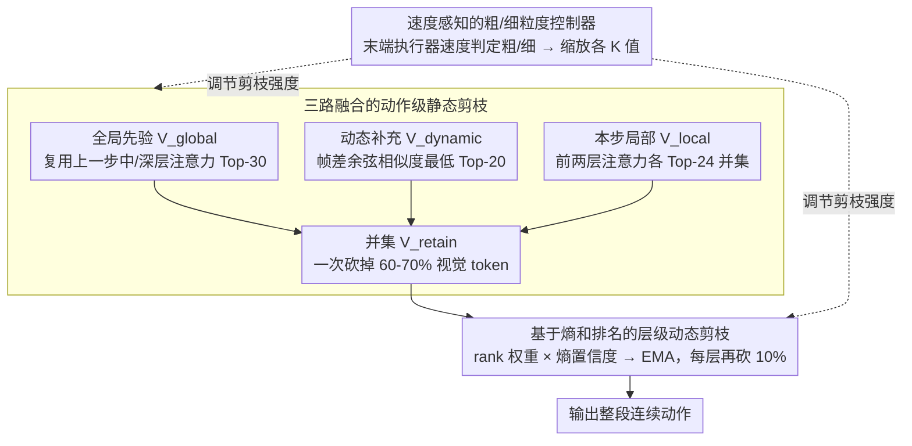

# SpecPrune-VLA: Accelerating Vision-Language-Action Models via Action-Aware Self-Speculative Pruning

**会议**: ICML 2026  
**arXiv**: [2509.05614](https://arxiv.org/abs/2509.05614)  
**代码**: 待确认  
**领域**: 机器人 / VLA / 推理加速 / 视觉 token 剪枝  
**关键词**: VLA 加速、Token 剪枝、自我推测、时空一致性、动作粒度

## 一句话总结
作者发现 VLA 推理是 compute-bound 的，剪枝才是对的路子，且连续动作步之间视觉信息高度重叠 → 提出 SpecPrune-VLA：用上一步的全局注意力 + 本步早期层的局部注意力 + 帧差动态 token 三路融合做静态剪枝，再加层内动态剪枝和速度感知的粗/细粒度切换控制器，免训练地在 LIBERO 上拿到 1.57× / 真机 1.70× 加速且成功率几乎无损。

## 研究背景与动机
**领域现状**：现代 VLA（OpenVLA-OFT、DB-OFT、CogACT 等）越来越多采用单步范式——一次 LLM forward（只跑 prefill）直接预测一整段连续动作。模型由 tokenizer / LLM backbone / action head 组成，其中 LLM backbone 占 end-to-end 延迟的 >70%，是真正的瓶颈。

**现有痛点**：作者在 NVIDIA A800 上把四个代表性 VLA 画在 Roofline 上，发现它们都落在 compute-bound 区——延迟主要来自计算量而非显存访问。这意味着 KV-cache 复用、量化等"省访存"的手段收益有限，**减少计算量的 token 剪枝才是对症下药**。但现有 VLA token 剪枝（EfficientVLA、SP-VLA、VLA-Cache 等）有两类毛病：要么只用单层注意力做局部启发式（容易把全局重要 token 误删，>20% 成功率掉点），要么靠 KV 缓存复用只省 17–25% FLOPs（加速有限）。

**核心矛盾**：本地信息（当前步早期层注意力）便宜但短视，会漏掉真正语义相关的 token；全局信息（模型深层注意力）准确但只有跑完模型才知道，事后剪枝没意义。看似无解。

**本文目标**：(1) 找到一个能让"全局信息可提前用"的物理事实；(2) 把这种事实利用起来设计三路融合的剪枝；(3) 让剪枝率随动作敏感度自适应，避免接触/放置等关键节点失败。

**切入角度**：作者做了两组关键观察。**Insight 1（什么 token 真重要）**：图像→文本注意力在浅/中/深层焦点不同——浅层泛而无用，中层关注语义对象（如柜子），深层关注动作目标（如盘子）；用中+深层注意力做剪枝，能把稀疏度推到 86% 仍几乎不掉点，而单用浅层超过 10% 就崩。**Insight 2（时空一致性）**：连续两步推理之间的视觉场景几乎不变（任务目标恒定 + 时间间隔极短），把上一步选出的 Top-30 全局重要 token 的集合 $V_{t-1}$ 与当前步集合 $V_t$ 求 Recall，$|V_{t-1}\cap V_t|/|V_t|$ 平均 75–88%。这意味着**上一步的全局注意力可以当作本步的全局先验**，绕过"必须跑完模型才知道"的鸡生蛋难题。

**核心 idea**：训练-free 的两级剪枝——动作级用"上一步全局 + 帧差动态 + 本步早期局部"三路融合并集做静态剪枝（一次砍掉 60-70% 视觉 token），层级再做基于注意力熵和排名的动态打分逐层裁掉 10%；外面再套一个用末端执行器速度判定粗/细粒度的轻量控制器，对"接触/放置"这类失败成本极高的精细阶段调小剪枝率。

## 方法详解

### 整体框架
SpecPrune-VLA 是一个外挂在 OpenVLA-OFT / DB-OFT / CogACT 等模型上的 plug-in 加速框架，**不需要任何额外训练**。一次动作推理的流程：(1) **动作级静态剪枝**——在 LLM forward 一开始，融合 $V_{global}$（来自上一步深/中层注意力的 Top-K 集合）、$V_{dynamic}$（与历史帧 patch 余弦相似度最低的 K 个 patch）、$V_{local}$（本步前两层注意力的 Top-K 并集），得到 $V_{retain} = V_{global}\cup V_{dynamic}\cup V_{local}$；(2) **层级动态剪枝**——剩余 token 进入 LLM，在指定的若干"更新层"用基于排名的 sigmoid 权重 × 熵导出的层置信度滚动更新 EMA 分数，每层再砍掉分数最低的 10%；(3) **动作感知控制器**——根据上一时刻输出动作的平移/旋转速度判定本步是粗还是细粒度，相应地按比例 $\alpha$ 缩放所有 $K$ 值（粗粒度更激进、细粒度更保守），实现自适应剪枝强度。

### 关键设计

**1. 三路融合的动作级静态剪枝：用三种正交的重要性来源拼出保留集**

要在 LLM forward 一开始就砍掉 60-70% 视觉 token，关键是不能砍错——但三种现成线索各有盲区：只用 $V_{global}$（上一步全局注意力）会漏掉本步新出现的关键 token，只用 $V_{local}$（本步早期层注意力）就回到现有方法的短视问题，只用 $V_{dynamic}$（帧间变化）又会把静止但重要的背景物体当无效。SpecPrune-VLA 干脆把三路求并集 $V_{retain} = V_{global}\cup V_{dynamic}\cup V_{local}$，覆盖"语义稳定 + 内容变化 + 任务即时"三种正交来源。其中图像→文本注意力分数定义为

$$\text{Score}_l(V_i) = \frac{1}{H\cdot m}\sum_{h=1}^{H}\sum_{j=1}^{m} A_l^h(V_i, t_j)$$

即视觉 token $V_i$ 对所有指令文本 token 的多头平均注意力。$V_{global}$ 取上一步第 15、32 层（中/深层）按此分数排序的 Top-30，$V_{local}$ 取本步前两层各自 Top-24 求并集（前两层足够，第三层边际收益小还加延迟），$V_{dynamic}$ 用余弦相似度 $\text{Sim}(\mathbf{P}_m^{i,j}, \mathbf{P}_n^{i,j})$ 筛出低于阈值 $\tau$ 的、再取最低的 Top-20。dynamic 比的不是相邻帧而是速度自适应的历史帧 $T = \lfloor b + k\cdot v\rfloor + 4$（$k=-1, b=7$）——速度越大回看越近，避免相机噪声和光照变化误判。

**2. 基于熵和排名的层级动态剪枝：让焦点清晰的层主导剪枝决策**

静态剪枝后剩下的 token 还能再精修，但不同 transformer 层的注意力清晰度差别很大，简单平均会被那些 attention 散乱的高熵层拖偏。SpecPrune-VLA 给每个 token 在层 $l$ 算瞬时分数 $s_i^{(l)} = \omega_{\text{rank},i}^{(l)} \times \omega_{\text{conf}}^{(l)}$：rank 权重 $\omega_{\text{rank},i}^{(l)} = \sigma(-k\cdot\text{rank}_i^{(l)}) / \sum_j \sigma(-k\cdot\text{rank}_j^{(l)})$ 用 sigmoid 平滑放大排名靠前的 token；层置信度 $\omega_{\text{conf}}^{(l)} = 1/(\bar{H}^{(l)} + \epsilon)$ 以该层图像→文本注意力的平均熵 $\bar{H}^{(l)}$ 为分母——熵低意味着注意力集中、该层意见更可信、权重就大。token 分数再走 EMA $S_i^{(l)} = (1-\beta) S_i^{(l-1)} + \beta s_i^{(l)}$（$\beta=0.2$），每层砍掉分数最低的 10%（熵在第一步算完后整段任务复用，因为层间相似度高）。用熵当软门控的效果很直接：LIBERO 上 Recall 88% vs 平均加权 66%，成功率 96.1% vs 92.0%。

**3. 速度感知的粗/细粒度控制器：在关键瞬间自动收手**

帧帧观察失败案例会发现错误几乎全集中在接触/放置阶段——平时多剪一点没事，到了抓取的关键瞬间剪多了就抓空。SpecPrune-VLA 用末端执行器速度当开关：平移速度 $v_t = \sqrt{(\Delta x)^2 + (\Delta y)^2 + (\Delta z)^2}$、旋转速度 $v_r = \sqrt{(\Delta\alpha)^2 + (\Delta\beta)^2 + (\Delta\gamma)^2}$，当 $v_t<v_t^{\text{th}}$ 且 $v_r<v_r^{\text{th}}$ 且 $\Delta z\leq 0$（向下接触阶段）时进入 precise 模式，把所有 $K$ 值放大、剪得更保守；离开阈值就回到 coarse 模式激进剪枝。速度本来就是模型输出，所以这个控制器几乎免费（额外延迟约 1.5ms），但它把"任务关键瞬间"和"过场动作"区别对待，消融里把成功率从 96.8% 拉回 97.4%、与 baseline 持平。

### 损失函数 / 训练策略
**完全 training-free**——所有剪枝逻辑都靠注意力分数、熵、帧相似度等推理时统计量驱动，不需要重训或微调原 VLA。超参数：$K_{global}=30$, $K_{local}=24$, $K_{dynamic}=20$（按最大化 Recall 选定），全局剪枝率 $\alpha=0.8$，EMA $\beta=0.2$，层级剪枝率 10%。

## 实验关键数据

### 主实验
LIBERO 四套件（A800 GPU，OpenVLA-OFT 为基座）端到端对比：

| 方法 | Spatial | Object | Goal | Long | Avg SR | Speedup | FLOPs |
|------|---------|--------|------|------|--------|---------|-------|
| OpenVLA-OFT | 97.6 | 96.5 | 97.9 | 94.5 | 96.6 | 1.00× | 100% |
| FastV (ECCV24) | 94.6 | 95.8 | 94.0 | 88.8 | 93.3 | 1.44× | 57% |
| DivPrune (CVPR25) | 92.4 | 91.2 | 89.0 | 84.8 | 89.4 | 1.46× | 54% |
| SparseVLM (ICML25) | 96.8 | 94.2 | 97.6 | 93.6 | 95.6 | 1.28× | 77% |
| VLA-Cache (NIPS25) | 99.0 | 97.7 | 97.4 | 93.6 | 96.9 | 1.07× | 83% |
| EfficientVLA (NIPS25) | 96.5 | 91.1 | 96.0 | 72.1 | 88.9 | 1.52× | 35% |
| **SpecPrune-VLA (α=0.8)** | **97.4** | **95.8** | **97.7** | **93.4** | **96.1** | **1.46×** | **43%** |

在 SimplerEnv 四个视觉匹配任务（DB-OFT 基座）上：平均成功率 70.1%（baseline 70.4%），speedup 1.44×，FLOPs 42%；对比 FastV/DivPrune/SparseVLM 都更准更快。在 NVIDIA RTX 3090 上 LLM 部分 2.09× / 端到端 1.57× 加速；真机 Flexiv Rizon4 四任务平均 1.70× 加速。

### 消融实验
| 配置 | Recall (%) | LIBERO SR (%) | 说明 |
|------|-----------|---------------|------|
| 完整方法 | 92 | 96.1 | 三技术全开 |
| 去掉全局注意力复用 | 84 | 93.4 | 只靠局部，掉 2.7 pt |
| 去掉熵加权（平均权重） | 66 | 92.0 | Recall 暴跌 26 pt |
| 仅 Static + Dynamic（去掉控制器） | – | 96.8 | 控制器找回 0.6 pt |

### 关键发现
- **全局注意力跨步可复用**是整套方法的物理基础：Recall 75-88% 的跨步一致性把"全局信息只能事后拿"这个不可能性拆开了。
- **熵加权 vs 平均加权的差距巨大**（96.1% vs 92.0%），说明 layer-wise attention 质量分布严重不均，盲目平均等于把噪声层的判断当真。
- **接触阶段的剪枝敏感性**是端到端鲁棒性的关键节点，速度感知控制器虽然只引入 1.5ms 延迟，却把整体成功率拉到与 baseline 几乎持平。
- **剪枝率 α 的折中**：α=0.6 加速更高但 SR 掉，α=0.8 是 sweet spot，验证作者"先用 Recall 选 K 再用 α 全局缩放"的两阶段调参法。
- **跨架构 + 跨平台稳定性**：在 OpenVLA-OFT（VLM-based）、DB-OFT（diffusion-based）、CogACT 上都拿到加速；A800/3090 都稳，证明加速来自计算量减少而非特定硬件优化。

## 亮点与洞察
- **把"VLA 是 compute-bound 还是 memory-bound"这个底层问题先做清楚**再选优化方向，这是大量加速论文缺的一步；很多人默认抄 LLM 的 KV-cache 思路，结果发现 VLA 单步推理只有 prefill，加速效果就上不去。Roofline 分析直接锁定 token 剪枝是正解。
- **"时空一致性 Recall"作为先验有效性的可测量代理**：连续步 75-88% 重叠率不仅是定性观察，作者把它当成超参选择的优化目标（最大化 $\text{Recall}(V_{t-1}, V_t)$ 选 K），把启发式方法做成了有指标可调的工程问题。
- **熵作为"层可信度"的软门控**在 transformer 加速里是值得借鉴的通用技巧——任何 layer-wise 重要性聚合的任务都能用熵或类似的不确定性度量去加权，避免简单平均被高方差层污染。
- **速度感知控制器**几乎是免费的（速度本来就是模型输出），但它把"任务关键瞬间"和"过场动作"区分对待，这种利用任务结构本身（而不是单纯压低延迟）的思路在 embodied AI 加速里很有迁移价值。

## 局限与展望
- **启发式控制器在极端动态场景失效**：对接球、拍球等高速场景，速度阈值会一直触发 coarse 模式，导致关键瞬间反而被激进剪枝。作者承认这一点并提议未来用可学习的模式分类器替代。
- **依赖前一步的全局注意力**：第一步推理没有先验，需要降级用满 K 或纯局部策略；任务切换或场景突变后几步会有"冷启动"窗口，论文里没单独评测。
- **超参 K 与 α 仍按任务族经验调定**，跨剧烈不同的机械任务可能需要重调；自动化部署需要再加一层 K 调度。
- **只做视觉 token 剪枝**，没有触及文本 token 或动作 head 内部的优化；DB-OFT 这种多步去噪模型还有更多冗余可挖。
- **真机评测虽有 1.70× 加速，但任务只有 4 个**，与 SOTA 长程任务（如 RT-2 的多日演示集）相比覆盖窄。

## 相关工作与启发
- **vs EfficientVLA (NeurIPS25)**: 也做视觉 token 剪枝，靠单层注意力 + 层 skipping，但只用局部信息+激进 skip，在 LIBERO-Long 上掉到 72.1%；本文用全局复用+保守层剪枝，长程任务上保住 93.4%。
- **vs VLA-Cache (NeurIPS25)**: 走 KV 缓存路线，只省 17-25% FLOPs，加速 1.07×；本文是计算量路线，可省 57% FLOPs。两者其实正交，未来可叠加。
- **vs SP-VLA**: 用视觉编码器 saliency 选 token，保留空间-语义结构但不滤语义冗余；本文用文本-注意力分数更贴近 VLA 任务"指令驱动"的本质。
- **vs FastV (ECCV24) / DivPrune (CVPR25)**: 都是通用 VLM 剪枝。FastV 只用早期层注意力（短视），DivPrune 最大化特征多样性但不考虑任务相关；本文的 layer-wise 熵加权 + 全局复用是 VLA 特定优化。
- **vs SpecEE / LayerSkip 等自我推测解码**: 思想互补——它们针对 decoding 阶段，本文针对单步 prefill 范式；启发：VLA 的"动作步级一致性"可以看作一种新型的"动作维度自我推测"。

## 评分
- 新颖性: ⭐⭐⭐⭐ "上一步全局注意力可复用"+"动作速度做粗/细分类"两个观察都对 VLA 特化，组合起来是新思路
- 实验充分度: ⭐⭐⭐⭐⭐ LIBERO/SimplerEnv 8 任务 + 真机 4 任务 + 2 个 GPU 平台 + 3 种架构，6 个 baseline 对照，消融完整
- 写作质量: ⭐⭐⭐⭐ Insight 章节把动机讲透，公式标号有 latex 渲染瑕疵但整体逻辑清晰
- 价值: ⭐⭐⭐⭐⭐ 训练-free、即插即用、跨架构有效，真机 1.7× 加速对部署侧直接有意义

<!-- RELATED:START -->

## 相关论文

- [\[ICML 2026\] Latent Reasoning VLA: Latent Thinking and Prediction for Vision-Language-Action Models](latent_reasoning_vla_latent_thinking_and_prediction_for_vision-language-action_m.md)
- [\[ICML 2026\] Discrete Diffusion VLA: Bringing Discrete Diffusion to Action Decoding in Vision-Language-Action Policies](discrete_diffusion_vla_bringing_discrete_diffusion_to_action_decoding_in_vision-.md)
- [\[ICML 2026\] LangForce: Bayesian Decomposition of Vision-Language-Action Models via Latent Action Queries](langforce_bayesian_decomposition_of_vision_language_action_models_via_latent_act.md)
- [\[ICML 2026\] Contrastive Representation Regularization for Vision-Language-Action Models](contrastive_representation_regularization_for_vision-language-action_models.md)
- [\[ICML 2026\] Neural Implicit Action Fields: From Discrete Waypoints to Continuous Functions for Vision-Language-Action Models](neural_implicit_action_fields_from_discrete_waypoints_to_continuous_functions_fo.md)

<!-- RELATED:END -->
