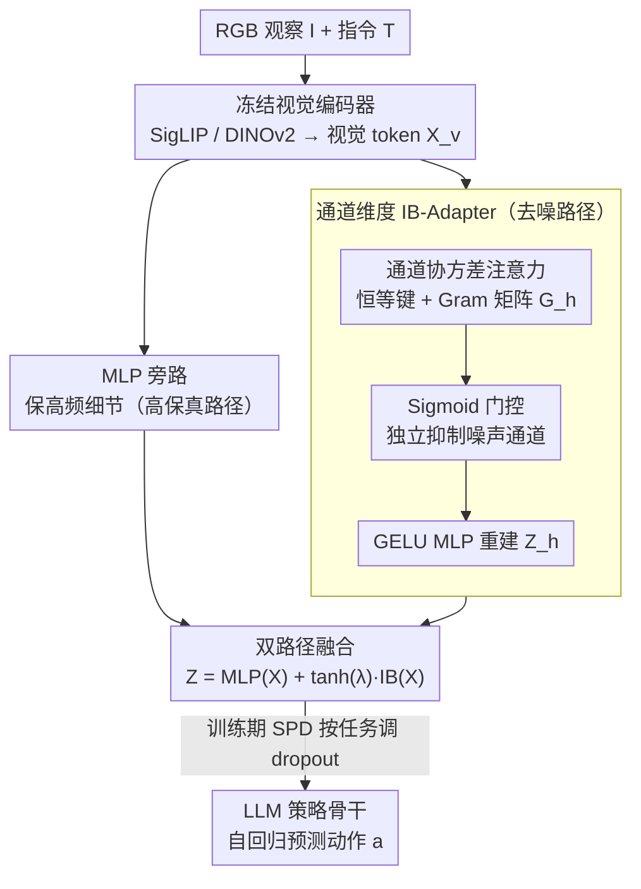

# StableVLA: Towards Robust Vision-Language-Action Models without Extra Data

**会议**: ICML 2026  
**arXiv**: [2605.18287](https://arxiv.org/abs/2605.18287)  
**代码**: https://github.com/DAGroup-PKU/HumanNet/tree/main/src/model/StableVLA (有)  
**领域**: 机器人 / VLA / 鲁棒性 / 信息瓶颈  
**关键词**: VLA、视觉鲁棒性、信息瓶颈、通道注意力、零数据增强

## 一句话总结
针对 VLA 模型在视觉扰动下崩盘的问题，作者发现脆弱的根源在视觉到 LLM 之间的 MLP 投影器，于是用一个不到 10M 参数的"通道维度信息瓶颈适配器（IB-Adapter）"替换它，在不增加任何训练数据或增强策略的前提下让 0.5B 的 StableVLA 在 LIBERO 严重扰动下平均提升约 35%，并在真机抓放任务上比 14× 大的 OpenPi 还稳。

## 研究背景与动机
**领域现状**：当前主流 VLA（OpenVLA、OpenVLA-OFT、π0.5、VLA-Adapter 等）几乎一致地采用「冻结视觉编码器（SigLIP / DINOv2）+ MLP 投影器 + LLM 策略骨干」的范式。基准如 LIBERO、CALVIN 上 SOTA 成功率普遍可以做到 95% 以上。

**现有痛点**：基准是在干净、可控的可视化环境里测的，真机面对的是传感器噪声、运动模糊、雾雪天气、镜头油污遮挡等永远穷举不完的扰动。作者在 LIBERO 上注入 ImageNet-C 风格的合成扰动后发现，原本 96% 成功率的 VLA-Adapter 平均掉到不到 50%，在重度模糊下甚至直接归零；这一脆弱性在 OpenVLA、OpenVLA-OFT、OpenPi-0.5 上同样成立，是 VLA 范式的系统性问题，不是某个模型的偶然。

**核心矛盾**：解决方案的主流路径是「数据中心」式——在训练集里堆扰动样本或大规模数据增强。但这条路有两个根本毛病：一是真实世界扰动的组合空间无限，模拟成本不可承受；二是模型容易记忆特定噪声模式而非学到不变性，对训练时没见过的扰动几乎无泛化。所以真正需要的是**架构层面的内在鲁棒性**。

**本文目标**：定位 VLA 中具体是哪个模块在放大噪声 → 用最小代价的架构改造把它换掉，做到「无额外数据、无额外增强、参数代价可忽略」三条同时成立。

**切入角度**：作者通过逐层探测特征一致性，观察到视觉编码器对扰动的输出尚可，真正发生剧烈退化的位置是视觉编码器到 LLM 之间的那个简单 MLP 投影器——它是个"全通滤波器"，把噪声原样灌进 LLM。再结合理论侧的观察：自注意力等价于高斯假设下的迭代信息瓶颈（IB）优化，能天然把 token 按语义聚类；而 ViT 在空间维度做了这个事情，VLA 投影器却完全没有任何类似的过滤机制。

**核心 idea**：把 VLA 的模态对齐重新建模为一个 IB 问题，在**通道维度**（而不是常见的空间 token 维度）做协方差注意力 + Sigmoid 门控来抑制噪声通道，再用 MLP 旁路保住高频细节，最终得到 Fused IB-Adapter 这一即插即用模块。

## 方法详解

### 整体框架
StableVLA 在结构上沿用 VLA-Adapter 的「冻结 SigLIP/DINOv2 + 适配器 + 0.5B LLM 策略 + 动作头」范式，唯一改动是把原来的 MLP 投影器整体替换为 Fused IB-Adapter。输入是 RGB 观察 $\mathbf{I}$ 和指令 $\mathbf{T}$，视觉编码器给出 $\mathbf{X}_v \in \mathbb{R}^{N \times D_v}$，Fused IB-Adapter 把它映射成 $\mathbf{Z} \in \mathbb{R}^{N \times D}$ 送入 LLM，LLM 再自回归预测动作 $\mathbf{a} = \pi(\text{Concat}(\mathbf{Z}, \mathbf{X}_T))$。训练策略和 VLA-Adapter 完全相同，只在 LIBERO/CALVIN 上从头训，不引入任何扰动数据；因此所有扰动评测都是真·零样本。

形式化目标函数是标准 IB：$\min_{\phi(\mathbf{Z}\mid\mathbf{X}_v)} \mathcal{L}_{IB} = I(\mathbf{X}_v;\mathbf{Z}) - \beta I(\mathbf{Z};\mathbf{S})$，其中 $\mathbf{S}$ 是任务相关的"干净语义码"，$\beta$ 控制压缩-保真的折中。作者证明：在高斯+独立 Bernoulli 隐变量假设下，最优 $\mathbf{Z}$ 的迭代更新可写成通道维度的注意力 $\mathbf{Z} = \mathbf{V} \cdot \sigma(\beta \mathbf{Q}^\top \mathbf{K})$，其中 $\sigma$ 取 Sigmoid（对应独立 Bernoulli 假设）。这就是把"IB 优化"翻译成"可学模块"的桥。

### 关键设计

**1. 通道维度的协方差注意力（IB-Adapter 主体）：在通道而非空间维度做信息瓶颈，识别语义子空间**

诊断指向 MLP 投影器是个"全通滤波器"，把噪声原样灌进 LLM。IB-Adapter 把它换成通道维度的协方差选择：把输入 $\mathbf{X}' \in \mathbb{R}^{N \times D}$ 按头数 $H$ 切成 $\mathbf{X}'_h \in \mathbb{R}^{N \times d}$，每头里查询 $\mathbf{Q}_h = \mathbf{X}'_h \mathbf{W}_q$ 走可学线性变换，但键 $\mathbf{K}_h = \mathbf{X}'_h$ **直接用恒等映射**——这是个反直觉但关键的设计，目的是把协方差锚定在视觉 token 的原始几何流形上，不让冗余投影抹掉高频空间线索。然后沿序列维度求 Gram 矩阵 $\mathbf{G}_h = \mathbf{Q}_h^\top \mathbf{K}_h \in \mathbb{R}^{d \times d}$，每个元素表示通道 $i,j$ 在所有空间 token 上的协方差。

为什么选通道维度而非 ViT 那种空间维度？因为 VLM 输出的语义和噪声在通道维度上是异质分布的——某些通道承载稳定语义，某些通道是无关传感器噪声。把每个通道当作 IB 的信息单元做选择，比空间维度 IB 更契合"投影器"这个特定位置该干的活。

**2. Sigmoid 门控的通道独立选择：用独立 Bernoulli 假设代替 Softmax 的强制竞争**

有了 Gram 矩阵，把它转成门控权重 $\mathbf{A}_h = \sigma(\mathbf{G}_h \cdot \boldsymbol{\tau}_h)$（温度 $\boldsymbol{\tau}_h$ 可学），再用 $\mathbf{Z}_h = \mathbf{V}_h \mathbf{A}_h$ 重建特征（$\mathbf{V}_h$ 由两层 GELU MLP 生成）。噪声通道与语义通道协方差低，门值就趋近 0、被独立抑制。

这里刻意**不**用 Softmax。Softmax 会强制通道间竞争（一个分布归一化），在通道选择场景里反而会扯掉本该并存的多个语义通道；Sigmoid 对应 IB 推导中的"独立 Bernoulli 隐结构"假设，允许"很多通道同时开 + 噪声通道单独关"，与现实里通道语义不互斥的事实匹配。这也是把 IB 的理论最优解 $\mathbf{Z} = \mathbf{V} \cdot \sigma(\beta \mathbf{Q}^\top \mathbf{K})$ 直接落成可学模块的那一步。

**3. 双路径融合架构（Fused IB-Adapter）：用 MLP 旁路保高频细节、IB 路径供鲁棒语义**

纯 IB-Adapter 会衰减高频细节，让精细抓放任务（尤其 long-horizon）轨迹精度下降——单一路径没法同时兼顾"语义鲁棒"和"动作精确"。StableVLA 把两者并联：$\mathbf{Z} = \text{MLP}(\mathbf{X}) + \tanh(\lambda) \cdot \text{IB-Adapter}(\mathbf{X})$，MLP 旁路是高保真路径保留精细操作必需的高频，IB-Adapter 是去噪路径提供协方差过滤后的鲁棒语义，$\lambda$ 可学控制鲁棒信号注入强度。

训练期再叠一个 Stochastic Pathway Dropout，并按任务调强度：对要求空间精度的 pick-and-place（LIBERO-Long）几乎不 dropout（$p_{\text{drop}}\!\approx\!0$），让 IB-Adapter 当残差稳定器；对要求长程语义规划的任务（CALVIN、LIBERO-Object）用中等 dropout（$\approx 0.3$），强迫策略内化 IB 路径的鲁棒特征。统一一档反而两边都不优。

### 损失函数 / 训练策略
完全继承 VLA-Adapter 的训练配方：从头训，只用 LIBERO/CALVIN 自带的轻度几何（裁剪）与色彩抖动增强防过拟合，**不接触任何评测时使用的扰动类型**，也不上任何专门的鲁棒训练技术。这是论文最关键的对照设置——把扰动鲁棒性的提升完全归因于架构本身。

## 实验关键数据

### 主实验
在 LIBERO 四个任务套件（Spatial / Object / Goal / Long）和 CALVIN 上评估，每个任务取 clean + severity 3/4/5 三档扰动，扰动取 ImageNet-C 的 18-19 类。下表给出 severity 5 这一最难档位的对比（成功率%，CALVIN 报告完成任务数 0-5）：

| 模型 | 参数量 | LIB-Spatial S5 | LIB-Object S5 | LIB-Goal S5 | LIB-Long S5 | CALVIN S5 |
|------|--------|---------------|---------------|-------------|-------------|-----------|
| OpenVLA | 7B | 14.7 | 2.7 | 16.3 | 7.0 | – |
| OpenVLA-OFT | 7B | 72.1 | 52.8 | 70.3 | 40.3 | – |
| OpenPi-0.5 | 3B | 62.4 | 76.4 | 64.2 | 47.7 | – |
| VLA-Adapter | 0.5B | 58.5 | 29.3 | 47.3 | 26.2 | 1.44 |
| **StableVLA** | **0.5B** | **82.0** | **70.2** | **71.9** | **45.3** | **1.51** |

只换了一个适配器模块（不到 10M 参数），StableVLA 在 Spatial/Object/Goal 三个套件的 severity-5 上分别比 VLA-Adapter 提升 40.2% – 139.6%；以 0.5B 的体量打平甚至超过 7B 的 OpenVLA-OFT 与 3B 的 OpenPi-0.5。这是不依赖任何额外数据得到的结果。

### 消融实验
| 配置 | LIB-Spatial Clean | LIB-Spatial Avg(扰动) | 说明 |
|------|-------------------|----------------------|------|
| IB-Adapter only | 96.3 | 76.0 | 单 IB 路径，clean 略掉 |
| **Fused IB-Adapter** | **96.6** | **79.1** | 双路径融合，干净/扰动双赢 |

真机抓放任务的鲁棒性对比（相对 clean 的成功率下降 Δ，负数越小越鲁棒）：

| 任务 | 方法 | Clean | Noise Δ | Blur Δ | Oil Δ | Shelter Δ |
|------|------|-------|---------|--------|-------|-----------|
| Pick&Place | π0.5 (3B) | 100 | -63.3 | -16.7 | -10.0 | -30.0 |
| Pick&Place | VLA-Adapter | 80 | -66.7 | -40.0 | -30.0 | -60.0 |
| Pick&Place | **StableVLA (0.5B)** | 80 | **-30.0** | **-10.0** | **-10.0** | **-20.0** |
| Pack Doll | π0.5 (3B) | 80 | -63.3 | -33.3 | -30.0 | -40.0 |
| Pack Doll | **StableVLA (0.5B)** | 60 | **-16.7** | **-10.0** | -20.0 | **-10.0** |

### 关键发现
- **脆弱性根源被实证**：图 3 的逐层特征一致性证明视觉编码器在噪声下输出尚稳，剧烈退化发生在 MLP 投影器，这给"只换投影器"提供了精准的手术位置。
- **通道维度而非空间维度**才是 VLA 投影器的关键 IB 维度——这是与"ViT 自注意力做空间维度 IB"的主要区别。
- **Sigmoid > Softmax**：消融里 Sigmoid 门控允许多通道同时开，避免 Softmax 强行竞争破坏多语义并存。
- **恒等键设计**保住高频空间几何信息，没有它精细操作会掉点。
- **Stochastic Pathway Dropout 任务相关**：长程精细操作要 $p\!\approx\!0$，长程语义规划要 $p\!\approx\!0.3$，统一一档反而两边都不优。

## 亮点与洞察
- **把"哪里出问题"和"怎么改"都用理论同一套语言讲清楚**：脆弱性 → MLP 全通滤波器 → IB 解释 → 通道注意力实例化，从诊断到方案是同一根逻辑链，没有靠经验拼凑。
- **"无额外数据"这条约束几乎是反直觉的鲁棒性论文画风**——大部分鲁棒性工作靠堆扰动数据或增强，本文把所有筹码都押在架构上，反而把研究对比变得非常干净（同样训练配方下只换模块）。
- **K-Means 可视化**展示了 IB-Adapter 输出特征在噪声下仍能保持物体中心的紧凑聚类，给"通道协方差门控真的在抑制无关通道"这件事提供了直观证据，是值得借鉴的解释性可视化套路。
- **通道维度 IB 这个角度是可迁移的**：任何"视觉编码器 + LLM"的中间投影模块（VLM、Audio-LM、Multi-modal Agent）只要面临输入噪声，都可以套这个 Fused IB-Adapter；尤其在算力受限、不允许扩数据的场景里价值很高。

## 局限与展望
- **理论推导依赖 Gaussian + 独立 Bernoulli 假设**，真实视觉 token 分布远比这复杂；Sigmoid 形式选对了，但 $\beta$、$\boldsymbol{\tau}$ 的最优范围仍是经验定。
- **评测扰动主要是 ImageNet-C 风格 + 真机镜头油污/遮挡**，对动态相机抖动、视角剧烈切换、对抗扰动等没覆盖；CALVIN 上 0.5B 模型本身天花板就低，绝对数据看着不显眼。
- **Fused 双路径里 MLP 仍是 all-pass**，理论上噪声还会从 MLP 旁路漏一点过去；如果想做"零噪声泄漏"还得继续设计。
- **SPD 的 $p_{\text{drop}}$ 需要按任务手动调**，对自动化部署不太友好；可以考虑用一个轻量门控网络自适应 $p$，把"任务类型 → SPD 配置"这一步也学进来。

## 相关工作与启发
- **vs VLA-Adapter**: 直接 baseline，本文只换 MLP 投影器为 Fused IB-Adapter，训练配方完全不动；优势是几乎无额外参数（<10M）就拿到 30%+ 鲁棒性提升，劣势是 IB 路径会衰减细节，必须靠 MLP 旁路弥补。
- **vs OpenVLA/OpenVLA-OFT (7B)**: 它们靠大规模 OpenX 预训练拿到鲁棒性，而 StableVLA 用 0.5B + 架构修正打平；劣势是 OpenVLA 系列在 cross-embodiment 通用性上仍占优。
- **vs OpenPi-0.5 (3B)**: π0.5 是数据中心路线代表，靠海量演示数据；本文以小数据、小模型架构路线在扰动下持平甚至更稳，验证"架构层鲁棒性"是独立维度。
- **vs ImageNet-C 数据增强（hendrycks2019, AugMix 等）**: 这些是"穷举式见招拆招"，泛化到未见扰动靠运气；本文是"在结构里装一个 IB 过滤器"，对未见扰动天然适配。
- **vs FAN / XCiT**: 这两个在视觉骨干内做通道协方差注意力，本文把同一个思想搬到 VLM-LLM 的投影器位置，是一次跨场景迁移。

## 评分
- 新颖性: ⭐⭐⭐⭐ 通道维度 IB + 双路径融合在 VLA 投影器场景是新组合，单点机制本身借鉴自 FAN/XCiT
- 实验充分度: ⭐⭐⭐⭐ LIBERO 全套件 + CALVIN + 真机四任务 + 多 baseline，扰动覆盖 19 类 ImageNet-C；缺动态/对抗扰动
- 写作质量: ⭐⭐⭐⭐ 诊断-理论-方法-验证脉络清晰，图 3 的脆弱性定位非常说服力
- 价值: ⭐⭐⭐⭐⭐ 给整个 VLA 社区指出"投影器是脆弱根源"+"无数据增强也能做鲁棒"，0.5B 打平 7B 的工程价值直接

<!-- RELATED:START -->

## 相关论文

- [\[ICML 2026\] LangForce: Bayesian Decomposition of Vision-Language-Action Models via Latent Action Queries](langforce_bayesian_decomposition_of_vision_language_action_models_via_latent_act.md)
- [\[ICML 2026\] Seeing Realism from Simulation: Efficient Video Transfer for Vision-Language-Action Data Augmentation](seeing_realism_from_simulation_efficient_video_transfer_for_vision-language-acti.md)
- [\[ICML 2026\] Neural Implicit Action Fields: From Discrete Waypoints to Continuous Functions for Vision-Language-Action Models](neural_implicit_action_fields_from_discrete_waypoints_to_continuous_functions_fo.md)
- [\[ICML 2026\] Latent Reasoning VLA: Latent Thinking and Prediction for Vision-Language-Action Models](latent_reasoning_vla_latent_thinking_and_prediction_for_vision-language-action_m.md)
- [\[ICML 2026\] Contrastive Representation Regularization for Vision-Language-Action Models](contrastive_representation_regularization_for_vision-language-action_models.md)

<!-- RELATED:END -->
