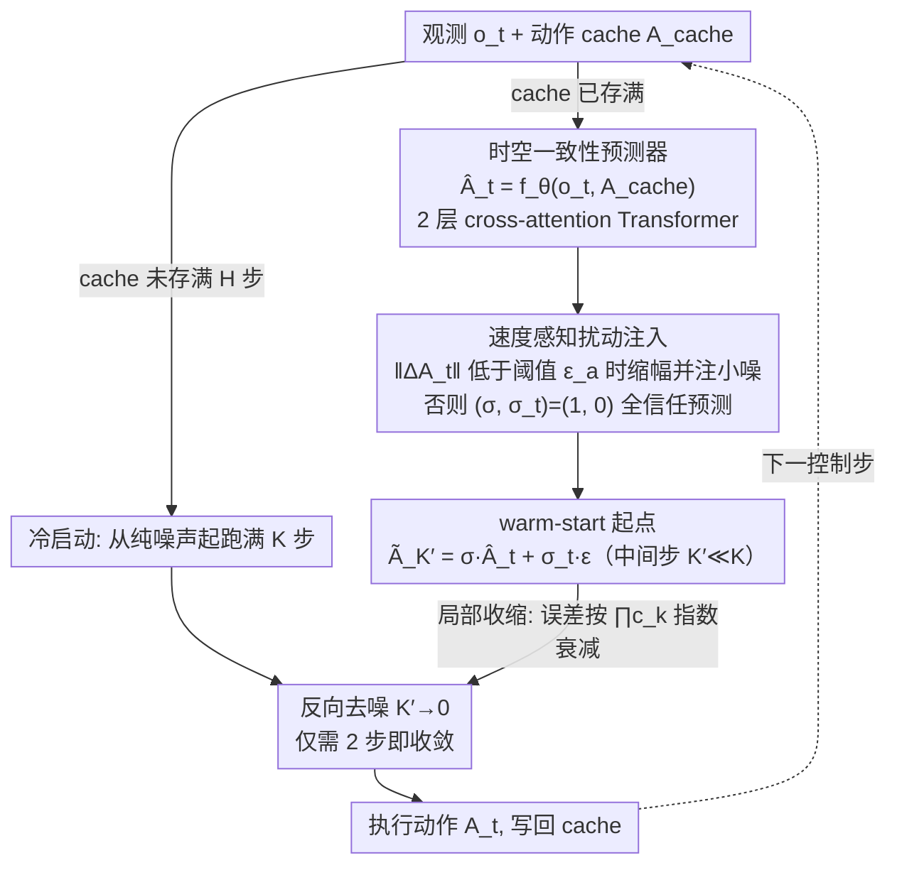

# STEP: Warm-Started Visuomotor Policies with Spatiotemporal Consistency Prediction

**会议**: ICML 2026  
**arXiv**: [2602.08245](https://arxiv.org/abs/2602.08245)  
**代码**: <https://github.com/Kimho666/STEP>  
**领域**: 机器人 / 具身智能 / 扩散策略加速  
**关键词**: diffusion policy, warm-start, 时空一致性, 局部收缩, 速度感知扰动

## 一句话总结
STEP 给 diffusion policy 接了一个轻量的 "前一段历史动作 + 当前观测 → 下一段动作"的 Transformer 预测器, 用它的输出作为去噪起点 (warm-start), 把 100 步去噪压到 2 步, 又附带一个 "动作变化太小就注一点噪声"的执行死锁防御机制, 在 9 个仿真任务和 2 个真机任务上比 BRIDGER / DDIM 平均提 21.6% / 27.5% 成功率。

## 研究背景与动机

**领域现状**: 扩散策略 (Diffusion Policy, DP) 是当前 visuomotor control 的事实标准: 把动作序列建成生成分布, 通过 100 步迭代去噪从高斯噪声逐步生成动作块。它能捕捉多模态、长程依赖, 成功率最高, 但延迟也最高。

**现有痛点**: 已有的 DP 加速分三类——(1) 数值求解器 (DDIM, DPM-Solver 系列) 可以把 100 步压到 4-2 步, 但 2 步时性能崩盘 (Push-T 仅 0.29); (2) 蒸馏 / 直接预测 (CP, OneDP, BRIDGER), 用小预测器替代去噪过程, 但表达力弱, 复杂任务掉点; (3) 动作复用 (RTI-DP, RNR-DP, Falcon) 把上一时刻动作当 warm-start, 时间连续但状态变化快时根本不对路。三类都各自只摸到 "快"或 "准"的半个解。

**核心矛盾**: 加速的关键是 "给去噪一个好的起点", 而好的起点必须**同时**满足两个条件: **空间一致** (与当前状态条件下的目标动作流形接近) 和 **时间一致** (与上一时刻执行动作平滑过渡)。现有方法最多只满足其中一个 (BRIDGER 只空间, Falcon 只时间), 都不够。

**本文目标**: (a) 设计一个保留原 DP 表达力的 warm-start, 让它同时具备空间 + 时间一致性; (b) 哪怕只跑 2 步去噪也要稳; (c) 真机部署时, 防止 warm-start 太 "平滑"导致机器人卡在静摩擦零位上。

**切入角度**: 不替换、不蒸馏原 DP, 而是**外挂一个 light-weight 预测器**, 把 $(\mathbf o_t, \mathbf A_{t-H})$ 映射到 $\hat{\mathbf A}_t$ 作为起点, 然后从去噪轨迹的中间步 $K'<K$ 加少量噪声继续跑——这样既享受 warm-start 的快, 又保留 DP 的多模态生成。

**核心 idea**: 用 "前一动作块 + 当前观测"做条件 Transformer 预测 = 同时获得时间 (条件含前动作) + 空间 (条件含观测) 一致的初始化; 再附加 velocity-aware 扰动机制对抗真机死锁; 最后用 contraction-mapping 理论证明这种起点收敛性更好。

## 方法详解

### 整体框架
推理 pipeline (Algorithm 1): (1) 观察 $\mathbf o_t$, 若动作 cache 已存满 $H$ 步, 用预测器算 $\hat{\mathbf A}_t=f_\theta(\mathbf o_t,\mathbf A_{cache})$; (2) 构造 warm-start $\tilde{\mathbf A}_{K'}=\sigma\hat{\mathbf A}_t+\sigma_t\boldsymbol\epsilon_t$, 其中 $K'\ll K$ 是从中间步开始去噪, 缩放系数 $\sigma$ 与噪声幅 $\sigma_t$ 由速度感知扰动机制按"是否停滞"在两档间切换; (3) 跑 $K'\to 0$ 的反向扩散得到最终动作 $\mathbf A_t$ 并执行; (4) cache 更新为 $\mathbf A_t$ 供下次循环用。训练时, 预测器和 DP 解耦训练: DP 按 Eq. 5 的标准 noise prediction 训练, 预测器按 MSE 训练; 推理时把两者级联。

### 关键设计

**1. 时空一致性预测器 (Spatiotemporal Consistency Predictor)：一次 forward 拿到时间 + 空间双一致的起点**

去噪要提速, 关键是给一个好起点, 而 STEP 主张好起点必须同时满足两件事: 时间一致性 (与上一时刻执行动作平滑过渡, $\|\tilde a_t-a_{t-1}\|\le\epsilon_t$) 和空间一致性 (落在当前状态条件下的目标动作流形附近, $\mathrm{dist}(\tilde a_t,\mathcal M(s_t))\le\epsilon_s$)。它的做法极简: 定义预测器 $f_\theta:\mathcal O\times\mathcal A^H\to\mathcal A^H$, 把当前观测 $\mathbf o_t$ 和上一段动作 $\mathbf A_{t-H}$ 一起喂进去得到 $\hat{\mathbf A}_t$。条件里带 $\mathbf A_{t-H}$ 自然换来时间一致, 条件里带 $\mathbf o_t$ 自然换来空间一致——两个一致性不靠任何额外正则项, 全靠"喂什么条件"得到。预测器是个 2 层 cross-attention Transformer (动作作 query, 观测作 key/value, 128 维 embedding), 训练目标只是 MSE $\mathcal L_{pred}=\mathbb E\|\hat{\mathbf A}_t-\mathbf A_t\|^2$, 学的就是条件期望 $\mathbb E[\mathbf A_t\mid\mathbf o_t,\mathbf A_{t-H}]$。为什么用 cross-attention 而非 self-attention？因为要混合"动作 + 观测"两个异构序列, 让动作去"查询"观测更贴切。Fig. 3 显示 2 个 block 性能就饱和, 再加只涨延迟不涨分, 所以最终定在 2 block——一个工程上"踩到甜点"的取舍。

**2. 速度感知扰动注入 (Velocity-Aware Perturbation Injection)：只在机器人快卡死时才注一点随机性**

预测器学到的动作在仿真里很"准", 但真机部署有个隐蔽坑: 当连续两段动作变化极小时, 电机扭矩不足以跨过静摩擦和控制死区, 机器人会卡在原地 (execution deadlock)。有意思的是, vanilla DDPM 全程带随机噪声反而不会卡——随机性帮它越过了死区。STEP 把这个观察做成"按需开关": 计算两步前后的动作差 $\Delta\mathbf A_t=\mathbf A_{cache}-\mathbf A_{t-2H}$, 用指示函数 $\mathbb I_t=\mathbb I(\|\Delta\mathbf A_t\|<\epsilon_a)$ 检测停滞 (Eq. 14)。正常时 $(\sigma,\sigma_t)=(1,0)$ 完全信任预测、不加噪; 一旦判定停滞就切到 $(\sigma_{scale},\sigma_{stall})$, 把幅值缩小并注入一点高斯噪声把机器人"推"过死区 ($\epsilon_a=0.01$, 仿真 $\sigma_{stall}=0.1$, 真机摩擦更大需更大的 $\sigma_{stall}$)。和全程加噪相比, 这种"只在需要时注入随机性"既保住了正常段的精度, 又靠扰动把真机平均 episode 执行时间降了 59%。

**3. 基于局部收缩映射的收敛性证明：解释"好起点 + 少量步"为什么稳收敛**

前两个设计是工程机制, 这一条把它升格成可推广的理论。作者把 DDPM、DDIM、DPM-Solver 的反向更新统一写成 $\mathbf A_{k-1}=\mu_k(\mathbf A_k,\mathbf o_t)+\boldsymbol\xi_k$ (Eq. 15), 并假设去噪网络 $\epsilon_\theta$ 在数据流形邻域 $\mathcal U$ 内 Lipschitz 常数为 $L$, 由此推出 reverse mean $\mu_k$ 也是 Lipschitz 的、且收缩系数 $c_k<1$ (Eq. 16)。沿去噪步骤递推就得到 $\|\tilde{\mathbf A}_0-\mathbf A_0\|\le\prod_{k=1}^{K'}c_k\,\|\tilde{\mathbf A}_{K'}-\mathbf A_{K'}\|$ (Eq. 18): 只要预测器把起点拉进邻域 $\mathcal U$, 初始误差就会沿去噪步以指数速率衰减, 所以从中间步 $K'$ 起跑、只跑 2 步也能收敛到正确动作。关键是这套推导不依赖具体求解器, 对 DDIM / DPM-Solver 都成立——这正是把"中间步 warm-start"这个 trick 升格为通用方法的依据。

### 损失函数 / 训练策略
- 预测器: $\mathcal L_{pred}=\mathbb E\|\hat{\mathbf A}_t-\mathbf A_t\|^2$, 100k step。
- DP: 沿用原 codebase 默认配置, 不动。
- 推理超参: $K'$ = 起始去噪步 (即 STEP = 2 / 4); $\sigma=1, \sigma_t=0.1$ 仿真默认; 真机 $\sigma_{stall}$ 更大以克服死区。

## 实验关键数据

### 主实验

**State-based RoboMimic / Push-T (Table 2 部分)**: Score (越大越好) / Time (ms, 越小越好)。

| Method | Step | Push-T | Square | ToolHang |
|---|---|---|---|---|
| Vanilla DDPM | 100 | 0.94 | 0.94 | 0.68 |
| DDIM | 2 | 0.29 | 0.84 | 0.06 |
| DPM-Solver++ | 2 | 0.20 | 1.00 | 0 |
| BRIDGER | 2 | 0.37 | 0.84 | 0.08 |
| Falcon | 2 | 0.21 | 1.00 | 0 |
| **STEP (Ours)** | **2** | **0.49** | **0.96** | **0.64** |

**Image-based RoboMimic (Table 3 部分)**: 视觉输入下 ToolHang 这种长程任务对比尤其明显。

| Method | Step | Square | ToolHang |
|---|---|---|---|
| DDIM | 2 | 0.74 | 0.5 |
| BRIDGER | 2 | 0.92 | 0.72 |
| **STEP (Ours)** | **2** | – (>BRIDGER, 见原文) | – |

论文核心结论: STEP 2 步在 RoboMimic 上相对 BRIDGER 平均 +21.6%, 相对 Falcon (temporal-only) 平均 +48.8%; 真机相对 DDIM 平均 +27.5% 成功率; 真机平均 episode 执行时间靠 velocity-aware 扰动降低 59%。

### 消融实验

| 配置 | 关键指标 | 说明 |
|------|---------|------|
| 完整 STEP (2 step) | Push-T 0.49 / Lift 1.0 / Square 0.96 | 时空一致 + 扰动 + 中间步起噪 |
| 去预测器 (= DDIM) | Push-T 0.29 / Lift 0.80 / Square 0.84 | 时空起点退化为纯噪声, 性能崩 |
| 仅空间 (BRIDGER) | Push-T 0.37 / Lift 1.0 / Square 0.84 | 没有时间连续性, 长程任务掉 |
| 仅时间 (Falcon) | Push-T 0.21 / Square 1.00 / ToolHang 0 | 完全无空间一致, ToolHang 直接 0 |
| Cross-attn block 1/2/4 | 2 是 sweet spot | Fig 3, 4 block 涨延迟不涨分 |

### 关键发现
- **2 步推理是 STEP 的核心 selling point**: 别的方法 2 步时几乎全崩 (Falcon ToolHang=0), STEP 仍能维持接近 100-step DDPM 的成功率, 直接把 Pareto 前沿 (latency vs success) 拉到右下角。
- **时空一致缺一不可**: 表 1 的对比表显示, 任何只有 TC 或只有 SC 的方法在 2 步下都至少有一个任务掉到 0, 只有 STEP 在所有任务上不崩。
- **真机 vs 仿真差距**: $\sigma_{stall}$ 在仿真 0.1 即可, 真机需要更大, 揭示了 sim-to-real 中 "摩擦 / 死区"是个被忽略的瓶颈。
- **预测器很小**: 只用 128-dim, 2 个 cross-attention block, 训练 100k step, 工程上极轻量, 易嵌入。

## 亮点与洞察
- **观点很清晰**: 第一次把 "warm-start 必须 spatiotemporal 一致"显式提出并形式化 (Eq. 7-8 + Table 1), 给整个 DP 加速领域提供了一个简单的分析维度。
- **预测器 + DP 解耦训练**这条工程路线: 既保留原 DP 的多模态生成能力 (不蒸馏不替换), 又能轻量加速, 是非常实用的 design pattern——不论以后换哪种 DP backbone 都能套。
- **velocity-aware 扰动**这种 "按需注入随机性"的思路, 可迁移到任何需要在确定性预测和探索之间动态切换的领域 (如 imitation + RL 混合训练, 模型预测控制)。
- **contraction 证明**简单但是结论强: 给所有 "中间步 warm-start"方法提供了统一的理论解释, 而不是讲个故事。

## 局限与展望
- 时间一致性靠 "前一段 $\mathbf A_{t-H}$"作为条件, 在突发状态切换 (突然遇到障碍) 时可能反而成为偏置, 需要靠扰动机制兜底, 但扰动的触发只看动作变化幅度, 没有看观测变化, 比较粗糙。
- 预测器是单 forward, 没有显式建模多模态; 如果当前状态对应多个等价动作模式, 期望预测器会 "中和"出无意义动作 (论文也承认 BRIDGER 这一类问题)。
- 仅在 imitation learning 场景验证, 真正的 closed-loop RL 训练下 warm-start 与 policy 漂移的兼容性未测。
- 真机 $\sigma_{stall}$ 需要手调, 缺少自适应策略; 可以接一个学习型 critic 给出 "是否需要扰动"的判别。

## 相关工作与启发
- **vs DDIM / DPM-Solver++**: 它们只动求解器, 不引入 warm-start, 2 步下完全崩; STEP 是正交的, 可以套在任意求解器上。
- **vs BRIDGER (空间-only)**: BRIDGER 用预测器作起点但只看当前状态, 没建时间; STEP 仅多加一段 $\mathbf A_{t-H}$ 就拿到 21.6% 的平均提升。
- **vs Falcon / RTI-DP (时间-only)**: 它们假设动力学平滑, 实测 ToolHang / Push-T 这种状态变化快的任务直接 0 分; STEP 用观测条件抓住了状态突变。
- **vs CP / OneDP (蒸馏)**: 蒸馏破坏了原 DP 的多模态生成能力; STEP 保留 DP, 因此可以 "任务复杂时给更多去噪步, 任务简单时 2 步搞定"。

## 评分
- 新颖性: ⭐⭐⭐⭐ 时空一致性二分维度 + 中间步 warm-start + velocity-aware 扰动, 三件套都不复杂但都到位。
- 实验充分度: ⭐⭐⭐⭐⭐ 9 仿真任务 + 2 真机任务 × 8 个 baseline × state/image 两种输入, ablation 表非常齐。
- 写作质量: ⭐⭐⭐⭐ 概念图 (Fig 1) + 一致性表 (Table 1) 帮读者迅速建立框架, contraction 证明短小精悍。
- 价值: ⭐⭐⭐⭐⭐ 直接可用的工程方案, 代码已开源, 对所有部署 diffusion policy 的机器人团队都是开盒即用的提速利器。

<!-- RELATED:START -->

## 相关论文

- [\[CVPR 2026\] Learning Predictive Visuomotor Coordination](../../CVPR2026/robotics/learning_predictive_visuomotor_coordination.md)
- [\[ICML 2026\] Latent Reasoning VLA: Latent Thinking and Prediction for Vision-Language-Action Models](latent_reasoning_vla_latent_thinking_and_prediction_for_vision-language-action_m.md)
- [\[ICML 2026\] RoboMME: Benchmarking and Understanding Memory for Robotic Generalist Policies](robomme_benchmarking_and_understanding_memory_for_robotic_generalist_policies.md)
- [\[ICML 2026\] Lagrangian Perturbation Diffusion Steering: Latent Reinforcement Learning for Generative Policies](lagrangian_perturbation_diffusion_steering_latent_reinforcement_learning_for_gen.md)
- [\[ICML 2026\] Discrete Diffusion VLA: Bringing Discrete Diffusion to Action Decoding in Vision-Language-Action Policies](discrete_diffusion_vla_bringing_discrete_diffusion_to_action_decoding_in_vision-.md)

<!-- RELATED:END -->
