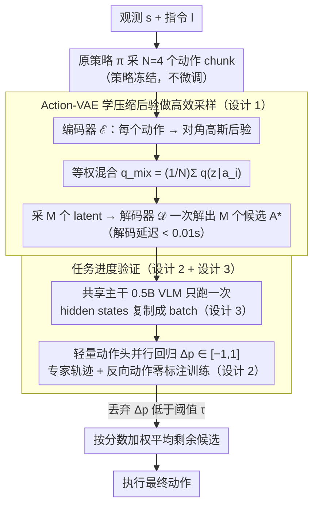

# TapSampling: Inference-Time Sampling with a Task-Progress-Understanding Verifier for Robotic Manipulation

**会议**: ICML 2026  
**arXiv**: [2605.25547](https://arxiv.org/abs/2605.25547)  
**代码**: 项目主页（论文末尾标注，未在正文给出仓库地址）  
**领域**: 机器人
**关键词**: 推理时采样, Action-VAE, 任务进度验证器, 通用机器人策略, 即插即用  

## 一句话总结
TapSampling 提出一个与策略无关、即插即用的推理时采样框架：先用 Action-VAE 从策略生成的少量动作里学一个低维后验、再高效地采出大量候选动作，再用"预测任务进度变化"的语义可解释 verifier 给候选动作打分并加权融合，在 CALVIN/LIBERO 和真机上无需微调原策略就能稳定提升 Diffusion Policy、OpenVLA、VPP、$\pi_0$、$\pi_{0.5}$ 等多种通用机器人策略的成功率。

## 研究背景与动机

**领域现状**：当前主流的通用机器人策略大多基于 VLM/视频扩散模型，通过扩散动作头或 next-token-prediction 输出动作（如 OpenVLA、$\pi_0$、VPP、Diffusion Policy）。它们靠扩大数据与模型规模刷成绩，但都遵循 **single-shot inference** 范式——一次决策只出一个动作。

**现有痛点**：扩散和自回归这两种非确定性范式天然带有方差，同一环境同一指令下，策略时灵时不灵；single-shot 没有任何机制纠正这种随机失败。LLM/扩散图像社区已经验证：在推理时多采样 + verifier 选择能稳定涨点，机器人侧却几乎没有原则化的方案。

**核心矛盾**：在机器人上做 inference-time sampling 卡在两件事上——
（1）**采样**侧：直接从策略反复采太慢（延迟数量级增长），而像 RoboMonkey 那样从高斯分布采又忽略 action chunk 内的维度间相关性，候选偏离真实动作分布；
（2）**验证**侧：低层动作（关节角/末端位姿/夹爪状态）没有现成的 VLM 评估器，已有 verifier 多用手工 reward、preference learning、offline RL 训练，分数缺乏可解释性，而且和具体策略架构耦合，无法即插即用。

**本文目标**：构造一个**策略无关**的 inference-time sampling 框架，同时解决"采样高效且分布保真"和"verifier 语义可解释且高吞吐"两个子问题。

**切入角度**：作者观察到人在判断机器人动作好坏时其实在估计"这一段动作会让任务进度推进多少"——这是一个**带语义**的连续值，而专家轨迹本身就隐含一条单调上升的进度曲线，可以零成本造正负样本来训这个进度预测器。同时，对于采样侧，与其从策略反复跑，不如学一个 VAE 来压缩动作分布，把策略动作编码到低维后验上再批量解码。

**核心 idea**：用 **Action-VAE 学到的后验**做高效保真采样，用 **任务进度变化预测**做语义可解释的 verifier，二者拼成 plug-and-play 的 TapSampling。

## 方法详解

### 整体框架
输入是当前观测 $s$ 与指令 $l$。Pipeline 走三步：
1. **少量策略采样**：调原策略 $\pi(a\mid s,l)$ 拿 $N$（默认 $N=4$）个初始动作 chunk $A_\pi=\{a_i\}_{i=1}^N$；
2. **后验混合 + 解码**：把每个 $a_i$ 过 Action-VAE 编码器 $\mathcal{E}$ 得到一个高斯 $q_\mathcal{E}(z\mid a_i)$，混成 $q_\text{mix}(z\mid A_\pi)=\frac{1}{N}\sum_i q_\mathcal{E}(z\mid a_i)$，从中采 $M$ 个 latent，解码得 $M$ 个候选动作 $A^*=\{\mathcal{D}(z_i)\}_{i=1}^M$（解码只跑一次小 transformer，延迟 $<0.01$s）；
3. **进度验证 + 加权融合**：verifier $\mathcal{V}(s,l,a)$ 对每个候选给出"任务进度变化" $\Delta p\in[-1,1]$，丢掉 $\Delta p$ 低于阈值的候选，剩下的按分数加权平均得到最终执行动作。

### 关键设计

**1. Action-VAE 学压缩后验做高效采样：又快又贴近策略真分布地采候选动作**

inference-time sampling 的采样侧卡在两难：直接从策略反复采太慢（实测 $k=16$ 时延迟增加约 $8\times$），而像 RoboMonkey 那样从独立高斯采又会破坏 action chunk 内部不同时间步、不同维度间的相关性，候选偏离真分布。Action-VAE 用一个低维后验把两头都接住。编码器、解码器都是 transformer：编码器吃 action chunk $a$、吐对角高斯 $q_\mathcal{E}(z\mid a)=\mathcal{N}(z;\mu_\mathcal{E}(a),\mathrm{diag}(\sigma_\mathcal{E}^2(a)))$，解码器从 latent 重建动作，训练目标 $\mathcal{L}_{avae}=\mathcal{L}_{rec}+\lambda_{KL}\mathcal{L}_{KL}$ 把后验拉向标准正态先验。

推理时只调原策略 $N=4$ 次拿到 $N$ 个动作，各自编码后做等权混合 $q_\text{mix}(z\mid A_\pi)=\frac{1}{N}\sum_i q_\mathcal{E}(z\mid a_i)$，再从这个混合后验里采 $M$ 个 latent 一次性解码（小 transformer 解码延迟 $<0.01$s）。于是"快"（4 次策略调用 + 一次轻量解码就能放大到 $M$ 个候选）和"贴分布"（Table 5 显示 MMD 在所有 RBF 带宽下都比高斯采样降约一半，如 $\gamma=2$ 时 0.064 vs 0.098）被同时拿到。

**2. 基于专家轨迹时序性的进度预测 verifier：用零标注数据训出语义可解释的打分器**

低层动作（关节角/末端位姿/夹爪状态）没有现成的 VLM 评估器，已有 verifier 要么靠手工 reward/preference learning，分数无语义，要么和具体策略架构绑死。这里抓住一个朴素假设——任务进度沿专家轨迹线性增长，给第 $i$ 步赋 $p_i=i/t$，正负样本就能从轨迹本身零成本造出来：正样本是顺向片段 $(l,s_i,a_{i:i+k-1})\mapsto k/t$，负样本是**反向播放动作** $(l,s_i,a_{i:i-k+1}^r)\mapsto -k/t$（动作是关节角/位姿，时间反向有明确物理意义）。verifier 用 VLA-Adapter 架构（Qwen2.5-0.5B 主干 + learnable queries，动作头改成把 query action 当输入回归 $\Delta p$），损失就是 $\mathcal{L}_{tap}=\lVert \mathcal{V}(s,l,a)-\Delta p\rVert_1$。

这套设计一举三得：训练数据零人工标注，任何模仿学习数据集直接拿来用；输出是 $[-1,1]$ 的连续进度值（负数=妨碍任务、小正数=稳但慢、大正数=快速推进），比 0/1 reward 信息量大得多，可设阈值再加权融合；与原策略完全解耦，跨 Diffusion Policy/OpenVLA/VPP/$\pi_{0.5}$ 通用。

**3. 共享主干的批量并行验证：把 $M$ 个候选的验证延迟压到接近单个**

verifier 用 0.5B VLM 已不算轻，若每个候选都重跑一遍主干，它会立刻成为 inference 瓶颈——对照组 RoboMonkey 用 LLaVA-7B 做 reward head，延迟随候选数线性增长正是栽在这。TapSampling 利用所有候选共享同一 $(s,l)$ 上下文这一点：VLM 主干只跑一次得到 hidden states，再把它复制成 batch，和 $M$ 个候选动作一起送进轻量动作头并行回归 $\Delta p$。这样主干复杂度可以做大、单次验证延迟却近乎常数，实测 $k=16$ 时比 RoboMonkey 快约 $12\times$，让 inference-time sampling 在机器人这种实时控制场景里真正可用。

### 损失函数 / 训练策略
两阶段独立训练：(1) Action-VAE 用 $\mathcal{L}_{rec}+\lambda_{KL}\mathcal{L}_{KL}$ 在动作数据上单独训重建后验；(2) verifier 用 L1 回归 $\Delta p$。原策略**完全冻结、无需微调**。推理时阈值 $\tau$ 和候选数 $M$ 是两个关键超参。

## 实验关键数据

### 主实验

CALVIN ABC→D（zero-shot 长时序操作，指标为连续完成 1~5 任务的成功率与平均成功长度 Avg.Len）：

| 策略 | Avg.Len（原） | Avg.Len（+TapSampling） | 第 5 任务成功率提升 |
|------|---------------|--------------------------|-----|
| Diffusion Policy | 2.41 | 2.58 (+0.17) | +4.2 |
| OpenVLA | 3.30 | 3.51 (+0.21) | +6.4 |
| VPP（已较强基线） | 4.39 | 4.46 (+0.07) | +2.8 |

LIBERO-Long（最难子集）：$\pi_{0.5}$ 平均成功率 96.8% → 98.0%；真机 7-DoF Franka 三类任务（Knock Down/Pick & Place/Stack，含 Seen/Unseen 物体）：$\pi_0$ 78.3% → 83.3%（Unseen Stack 涨 +10）。

### 消融实验

CALVIN 上以 VPP 为底，比较三种采样策略（候选数 $k=16$）：

| 采样策略 | Avg.Len | 第 5 任务 | 单步延迟 (s) |
|---------|---------|-----------|---------------|
| VPP 原策略 | 4.39 | 78.3 | 0.136 |
| Gaussian Sampling | 4.43 (+0.04) | 79.9 (+1.6) | 0.465 |
| Learned Posterior（本文） | 4.46 (+0.07) | 81.1 (+2.8) | 0.488 |
| Policy Sampling（上界） | 4.50 (+0.11) | 82.4 (+4.1) | 2.638 |

分布保真度（MMD，越小越贴策略分布，多带宽 RBF）：

| 带宽 $\gamma$ | 2 | 4 | 6 | 8 | 10 |
|------|------|------|------|------|------|
| Gaussian | 0.098 | 0.155 | 0.187 | 0.204 | 0.212 |
| Ours | 0.064 | 0.082 | 0.095 | 0.104 | 0.112 |

### 关键发现
- **Verifier 比 sampler 更关键**：即使最弱的 Gaussian Sampling 加上本文 verifier 也能涨点；而把 Policy Sampling 换成 Learned Posterior，性能损失很小但延迟降 $5\times$，说明瓶颈在"分布保真度"与"延迟"的折中。
- **Verifier 分数确实有语义**：作者做了个反向实验——每步选 verifier 分**最高**的动作 vs 选**最低**的动作，前者步数显著减少、后者步数显著增加甚至失败，证明 $\Delta p$ 不是噪声而是真实进度估计。
- **越弱的基础策略涨幅越大**：Diffusion Policy/OpenVLA 涨幅 $\sim$+0.2 Avg.Len，VPP 这种已经很强的只涨 +0.07，符合"verifier 主要帮策略避免随机失败"的直觉。

## 亮点与洞察
- **把 inference-time scaling 思路成功迁移到机器人**：LLM/Diffusion 上"多采样 + verifier"几乎是 free lunch，但机器人侧之前一直卡在没有可解释 verifier 和高效 sampler 上，本文用 VAE 后验 + 进度预测 verifier 把两块短板都补齐。
- **"反向播放动作 = 负样本"是非常巧的零成本数据构造**：利用机器人动作的物理可逆性（关节角/末端位姿）从专家轨迹自动生成有信号的负样本，省掉了 preference annotation 和 RL rollout。
- **共享主干 + 批量动作头**是 verifier 设计上的工程亮点，让 verifier 的复杂度可以加大（用 0.5B VLM）同时保持单次验证延迟近常数，可以迁移到其他需要 score-and-select 的具身任务（如 reward modeling、安全过滤）。
- **加权平均（不是 argmax）输出动作**也是个值得借鉴的小 trick：把 verifier 当成软投票而非硬选择，比单独执行最高分动作更稳。

## 局限与展望
- 进度线性假设 $p_i=i/t$ 对**长时序、阶段性任务**可能失真（如先拿物体再放置，两阶段中间进度可能突变），需要更细的非线性进度建模。
- 候选动作通过加权平均融合在**多模态动作分布**下可能造成"平均到无效动作"——例如同时存在两条可行轨迹时，平均后落到中间无效区域；本文用阈值过滤缓解但未系统讨论。
- Verifier 用 Qwen2.5-0.5B 已经不算特别轻，在 Franka 真机上单步延迟约 0.5 s，对 high-frequency control（>100Hz）仍偏重。
- 实验全在桌面操作场景，**移动操作 / 双手协作 / 接触富集任务** 上的有效性未验证。
- 反向动作的物理可逆性假设在含**碰撞、摩擦、非保守约束**的真实任务里不严格成立，反向轨迹是否真的"减少任务进度"需要更严格的因果分析。

## 相关工作与启发
- **vs RoboMonkey** (Kwok et al., 2025)：RoboMonkey 用高斯采样 + LLaVA-7B preference 训出来的 reward head。本文两侧都赢——sampler 端 MMD 显著低（0.064 vs 0.098 @ $\gamma=2$），verifier 端 batch 并行实测快 $12\times$，而且分数自带语义可解释。
- **vs TACO** (Yang et al., 2025a)：TACO 用 state-count 优化训练 verifier，与策略耦合较强；TapSampling 提倡 plug-and-play，在 LIBERO-Long 上 $\pi_{0.5}$ 涨幅与 TACO 接近但跨策略通用性更强。
- **vs 任务进度估计类工作** (Zhai/Zhang 2025；Ghasemipour 2025) ：他们的 progress 函数只看状态 $s$，被用作 RL reward；本文的 verifier 显式 condition 在候选动作 $a$ 上预测 $\Delta p$，因此能直接在 inference-time 给动作打分而非用于训练。
- **vs LLM/扩散侧 verifier-guided sampling**（PRM、Best-of-N、Inference-time scaling）：思想一脉相承——增加推理算力换性能，但本文证明在物理执行场景里关键是"verifier 的可解释性"与"延迟可控"，对 LLM Agent / 自动驾驶里类似的 score-and-select 流程都有启发。

## 评分
- 新颖性: ⭐⭐⭐⭐ 把成熟的 inference-time scaling 移植到机器人，sampler/verifier 两个组件都有清晰针对性创新（反向动作做负样本、共享主干批量评分）。
- 实验充分度: ⭐⭐⭐⭐ 三个 sim 策略 + LIBERO + 真机 Franka 三类任务，涵盖采样延迟、分布保真度（MMD）、verifier 选最高/最低对比，体系完整。
- 写作质量: ⭐⭐⭐⭐ 三个 Q 串起 motivation/method/experiments，公式与图表对照清晰。
- 价值: ⭐⭐⭐⭐ 即插即用、不动原策略就能给所有主流 VLA 涨点，工程上很容易复用；对 inference-time scaling 在具身领域的范式有推广价值。

<!-- RELATED:START -->

## 相关论文

- [\[ICML 2026\] Drift is a Sampling Error: SNR-Aware Power Distributions for Long-Horizon Robotic Planning](drift_is_a_sampling_error_snr-aware_power_distributions_for_long-horizon_robotic.md)
- [\[ICML 2026\] RoboMME: Benchmarking and Understanding Memory for Robotic Generalist Policies](robomme_benchmarking_and_understanding_memory_for_robotic_generalist_policies.md)
- [\[ICML 2026\] Decompose and Recompose: Reasoning New Skills from Existing Abilities for Cross-Task Robotic Manipulation](decompose_and_recompose_reasoning_new_skills_from_existing_abilities_for_cross-t.md)
- [\[CVPR 2026\] CycleManip: Enabling Cyclic Task Manipulation via Effective Historical Perception and Understanding](../../CVPR2026/robotics/cyclemanip_enabling_cyclic_task_manipulation_via_effective_historical_percepti.md)
- [\[CVPR 2026\] Adaptive Action Chunking at Inference-time for Vision-Language-Action Models](../../CVPR2026/robotics/adaptive_action_chunking_at_inference-time_for_vision-language-action_models.md)

<!-- RELATED:END -->
