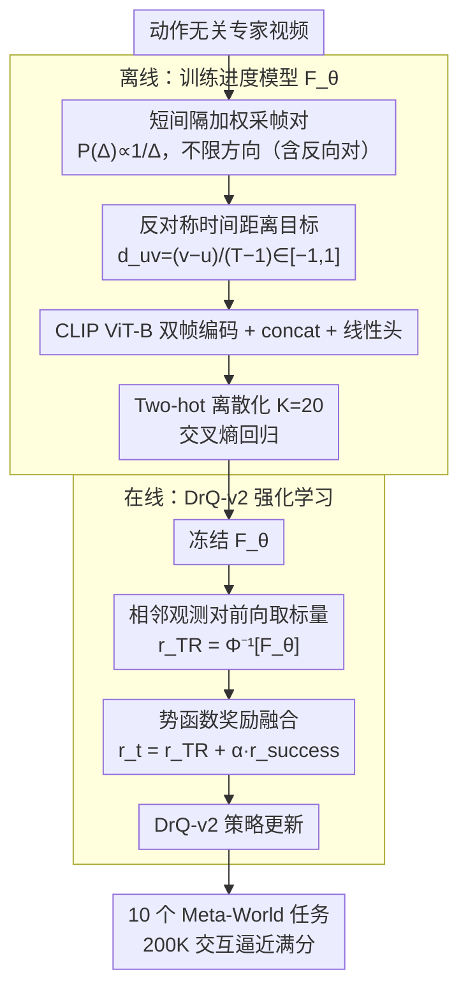

# TimeRewarder: Learning Dense Reward from Passive Videos via Frame-wise Temporal Distance

**会议**: ICML 2026  
**arXiv**: [2509.26627](https://arxiv.org/abs/2509.26627)  
**代码**: timerewarder.github.io（项目页）  
**领域**: 机器人 / 强化学习 / 模仿学习  
**关键词**: 稠密奖励学习, 时间距离, 被动视频, Meta-World, DrQ-v2

## 一句话总结
TimeRewarder 把"任务进度"形式化为视频帧对之间的归一化时间距离，仅用动作无关的专家视频自监督训练一个 ViT 距离回归器，并将相邻帧距离作为稠密奖励喂给 DrQ-v2，在 10 个 Meta-World 任务上以 200K 交互逼近 9/10 满分，甚至超过手工设计的环境稠密奖励。

## 研究背景与动机
**领域现状**：机器人强化学习在稀疏奖励下样本效率极差，主流补救手段是手工设计稠密奖励或者用 GAIfO、OT、VIP 等方法从专家轨迹中蒸馏代理奖励。手工奖励依赖大量领域知识、特权状态访问和反复调参，难以规模化；从视频学习奖励虽有进展，但 VIP 这类目标条件 value 函数难以收敛，Rank2Reward 只建模相邻帧顺序信息量有限，PROGRESSOR 等基于三元组的目标过于复杂。

**现有痛点**：进度类奖励方法存在三个具体毛病——一是 VIP 的隐式时间对比目标在理论上无界（作者在附录 A.3 给出证明），优化不稳；二是 Rank2Reward 只判断"哪个帧更靠后"而不输出距离，无法区分"差一步"和"差十步"；三是 GVL 依赖 VLM 推理顺序，输出不一致导致奖励噪声大。

**核心矛盾**：reward 必须同时满足两个看似冲突的性质——既要在专家分布内对"进度"有细粒度区分，又要在 RL 探索阶段对未见的次优行为（卡住、回退、伪动作）输出合理低分。已有目标要么只学正向进度而忽略次优样本，要么依赖目标图像导致脱离 goal 时表征退化。

**本文目标**：从被动视频里学一个 $F_\theta(o_u, o_v)$，要求它（1）能给 RL rollout 中的进步行为打高分、给停滞和回退打低分；（2）对相邻帧具备步级分辨率；（3）不依赖目标图像、不依赖动作标注。

**切入角度**：作者注意到在最优策略下 $\mathcal{V}^*(s_t^e) = -\sum_{k=t}^{T-1}\gamma^{k-t}$ 是"剩余时间 $T-t$"的单调变换，因此专家视频帧的时间索引天然就是 potential function。这把"奖励学习"约化成了"自监督回归归一化时间差"。

**核心 idea**：让模型预测两帧的归一化时间距离 $d_{uv} = (v-u)/(T-1) \in [-1, 1]$，把相邻帧的预测距离当作 dense reward，再叠加稀疏成功信号即可驱动 DrQ-v2。

## 方法详解

### 整体框架
TimeRewarder 由两阶段组成：(1) 离线训练进度模型 $F_\theta: \mathcal{O} \times \mathcal{O} \to \mathbb{R}^K$，输入是 CLIP-预训练 ViT-B 编码后再 concat 的一对帧特征，过线性头输出 $K=20$ 维 logits，目标是预测归一化时间距离的两热分布；(2) 在 DrQ-v2 在线探索阶段，把相邻观测对 $(o_t, o_{t+1})$ 喂给冻结的 $F_\theta$，把预测距离 $\hat{d}_{t,t+1}$ 当成 step-wise reward，再以可调的 $\alpha$ 系数叠加二值成功信号 $r_{\text{success}}$。整个 pipeline 不需要动作标签、不需要目标图像、不需要环境稠密奖励。

### 关键设计

**1. Implicit Negative Sampling + 归一化时间距离回归：用反对称结构让模型天然学会"前进给正、后退给负"**

奖励既要在专家分布内细分进度，又要在 RL 探索时对卡住、回退、伪动作打合理低分。TimeRewarder 不显式构造失败轨迹，而是把负样本"埋进"采样分布：训练时随机采的帧对 $(o_u, o_v)$ 不限定 $u < v$，于是目标 $d_{uv}=(v-u)/(T-1)\in[-1,1]$。当 RL rollout 撞墙、抓空、回手时，相邻帧的视觉差异更像"轨迹倒放"的子段，模型自然回归出小或负值，等价于把次优行为当训练时见过的反向片段处理。这就是论文反复强调的"反对称结构"——它堵死了"两帧都见过 = 高分"的捷径。

消融印证了它的关键性：把目标改成 $[0,1]$ 的纯前向进度后，stick-push 和 basketball 直接崩溃，因为抓空被误判成"已经抓到一半"。免费午餐之处在于，用对称结构当负样本来源，省掉了显式构造失败轨迹的工程负担。

**2. Weighted Pair Sampling（短间隔加权）：把训练曝光偏向相邻帧，让每一步反馈更准**

RL 的 reward 是 step-wise 的，相邻帧距离预测的精度直接决定每一步反馈是否真的"指向前进"。若用均匀采样，模型大部分梯度会花在 $\Delta=T/2$ 左右的中等距离对上，而这些对对 step reward 几乎无用。TimeRewarder 按 $P(\Delta)\propto 1/\Delta$ 抽采样间隔 $\Delta=|v-u|$，把曝光偏向 $\Delta=1,2,3$ 的短间隔对，同时保留长间隔覆盖以维持全局进度感。配合 Two-hot 离散化（把 $[-1,1]$ 均匀切 $K=20$ 个 bin，目标只对两个最近 bin 赋质量，损失是 cross-entropy），模型既学到全局单调性又在 bin 边界上保持锐利。

消融里改成均匀采样后 stick-push、window-open 明显掉点；Two-hot 比直接回归在 basketball、disassemble 这类"长准备 + 短决定性动作"任务上提升尤为明显，因为离散化保住了完成瞬间的尖锐过渡。

**3. Potential-based dense reward + sparse success 融合：把距离回归器变成保最优策略不变的 shaping 奖励**

训练好的 $F_\theta$ 怎么变成 RL 用的 step reward？TimeRewarder 定义 $r_{\text{TR}}(o_t, o_{t+1}) = \Phi^{-1}[F_\theta(o_t, o_{t+1})]$（$\Phi^{-1}$ 把两热向量映回 $[-1,1]$ 标量），最终训练奖励 $r_t = r_{\text{TR}}(o_t, o_{t+1}) + \alpha \cdot r_{\text{success}}(o_t)$，$\alpha$ 自适应平衡两项尺度。理论上以 $V(o)=F_\theta(o_0,o)$ 为 potential 函数：在确定性 MDP + 单步惩罚 $r(s)=-1$ 假设下，$V^*(s)$ 恰是"剩余步数 $T-t$"的单调变换，所以 $r_{\text{TR}}$ 是 potential-based shaping 的自然实例，保留最优策略不变。

这么融合的理由是两者各补一短板：稀疏成功信号可由人或 VLM 廉价标注但无法引导探索，稠密 $r_{\text{TR}}$ 又可能尺度漂移让优化器忽略真正完成任务的那一刻。相加既不增加 DrQ-v2 的工程复杂度（一行替换），又保证完成态有强信号，且性能对 $\alpha$ 不敏感、鲁棒性高。

### 损失函数 / 训练策略
训练损失是离散化两热分布的交叉熵：$\min_\theta \mathbb{E}[-\mathbf{y}_{uv}^\top \log\text{softmax}(\hat{\mathbf{y}}_{uv})]$，其中 $\mathbf{y}_{uv} = \Phi(d_{uv})$ 是真值的两热向量，$K = 20$。骨干是 CLIP 预训练的 ViT-B（可训练），两帧独立编码后 concat 过线性层。下游 RL 用 DrQ-v2，$F_\theta$ 全程冻结，每个任务跑 200K 环境交互、8 个随机种子。

## 实验关键数据

### 主实验
Meta-World 10 个操作任务的奖励学习对比（每任务 100 个动作无关专家视频）：

| 方法 | 信息源 | 9/10 任务 SR ≈ 100% | 备注 |
|------|--------|---------------------|------|
| TimeRewarder | 帧对时间距离 | ✅ | 200K 交互、CLIP ViT-B |
| VIP | 隐式 time-contrastive + 目标帧 | ❌（少数任务接近） | 表征在 OOD 退化 |
| Rank2Reward | 相邻帧顺序二分类 | ❌ | 无显式距离 |
| PROGRESSOR | 三元组高斯位置估计 | ❌ | 仅前向进度 |
| GAIfO / OT / ADS | rollout-expert 对齐 | ❌ | 在线计算开销大 |
| Env dense reward | 手工特权稠密奖励 | 9/10 被 TimeRewarder 反超 | 通常被视为上界 |
| BC | 专家动作监督 | 参照线 | 需动作标签 |

TimeRewarder 在 9/10 任务上同时拿下最高最终成功率与最佳样本效率，且在 9 个任务上超过被视为上界的环境手工稠密奖励，作者归因于手工奖励常在 pre-contact 阶段几乎没有梯度，而 TimeRewarder 能从视频里读出细微推进。

### 消融实验
三个核心模块的逐项移除（8 seeds，Meta-World）：

| 配置 | 退化最严重的任务 | 退化症状 | 解释 |
|------|------------------|----------|------|
| Full TimeRewarder | — | 9/10 接近 100% | 完整模型 |
| w/o Implicit Negative Sampling | stick-push、basketball | 抓空被误判为半成功 | 反对称结构失效 |
| w/o Weighted Sampling（改均匀） | stick-push、window-open | 短间隔分辨率不足 | 缺局部精细监督 |
| w/o Two-hot Discretization（改回归） | basketball、disassemble | 完成瞬间被平滑 | 长准备+短决定性任务受损 |
| only-from-init / single-frame / order-prediction | 多任务下降 | 时间表达力弱或目标复杂 | 三个替代设计均输 |

### 关键发现
- VOC（Value-Order Correlation）指标上 TimeRewarder 在所有任务的 held-out 专家视频上都拿最高分，证明它不是在死记硬背训练集，而是学到了真正的时间单调性；GVL（Gemini-1.5-Pro）在 few-shot 设置下也明显落后，说明 VLM 推理顺序对奖励建模不够稳。
- 在 basketball 抓而未举、window-open 空中模仿这两个典型 OOD 失败上，VIP 与 Rank2Reward 都被视觉相似性误导，PROGRESSOR 在抓握后饱和或在早期给伪尖峰；TimeRewarder 是唯一能"看到接触才升值"的方法，PCA 可视化显示其特征空间对训练、held-out 和 RL rollout 都形成一致的进度曲面，失败轨迹明显偏离。
- 跨域人手视频实验：3 个任务、每任务 20 段真实人类示范 + 1 段 Meta-World 内域示范，单独训练人手或单独训练 Meta-World 都只能拿到很低成功率，而两者混合反而拉到高位，验证了 TimeRewarder 能融合异源被动视频做奖励学习，是"看视频学技能"方向上的实用增量。

## 亮点与洞察
- 把"被动视频学奖励"这个看似哲学的问题，约化成"自监督回归归一化时间索引"，几乎所有复杂模块（VLM、三元组、目标条件 value、对抗判别器）都被一招打平。简洁度类似当年用对比学习替换大量手工自监督任务的味道。
- 反对称 $d_{uv} \in [-1, 1]$ 设计是免费午餐：不需要额外构造失败轨迹、不需要采负样本，就把"模型该怎么看待 OOD 次优行为"内嵌进训练目标。这种"用对称结构充当负样本来源"的技巧可以迁移到很多需要 robust OOD 行为的回归任务。
- 在 9 个任务上反超环境手工稠密奖励是相当反直觉的结果——它说明工程师手写的 shaping 函数往往在"够不到物体"的早期阶段近乎平坦，而视频学到的进度对预接触阶段反而更敏感，对 RL 探索更友好。

## 局限与展望
- 单帧观测会在视觉混叠（back-and-forth 运动）下把不同任务阶段映射到同一进度值，作者在理论分析里坦言这是 POMDP 下的根本困难，建议用窗口帧拼接缓解，但实验里没做大规模验证。
- 评测全部在 Meta-World + 简化真实场景下完成，没有触及多技能长程任务、动态场景或多物体并发；reward 是否会被 reward hacking（如模型固定动作刷高进度）拿下，需要更长程的实验。
- 训练假设专家视频"近最优"，对策略只演示中等水平或带噪声的视频会怎样退化、$F_\theta$ 是否需要鲁棒目标，论文未深入。

## 相关工作与启发
- **vs VIP**: 都从时间结构里学 value，但 VIP 是隐式时间对比 + 目标条件，距离脱离 goal 时表征退化、目标无界难优化；TimeRewarder 不依赖目标图像，距离回归目标有界、训练稳定，作者在附录 A.3 给出 VIP 目标无界的形式化证明。
- **vs Rank2Reward / PROGRESSOR**: Rank2Reward 只判 pair 顺序、不输出尺度；PROGRESSOR 用三元组高斯估计相对位置但只看前向进度且目标较复杂。TimeRewarder 同时拿到"距离"与"反对称次优感知"，目标却更简单。
- **vs GAIfO / OT / ADS**: 这些在线 rollout-对齐方法把"匹配 expert"当奖励来源，每步要计算分布距离，工程开销大且训练不稳；TimeRewarder 把所有重计算放进离线训练，在线只需一次 ViT 前向 + 标量映射。
- **vs GVL（VLM 推理顺序）**: GVL 直接让 VLM 输出帧序作为 reward，对 prompt 与模型版本敏感；TimeRewarder 用小模型 + 自监督把"时序"内嵌成连续可微的距离，规模化和复现性都更好。

## 评分
- 新颖性: ⭐⭐⭐⭐ 时间距离回归不算全新概念（TCN/Rank2Reward 系），但反对称 + 短间隔加权 + 两热离散化的组合把这条线推到了"超过手工稠密奖励"的临界点。
- 实验充分度: ⭐⭐⭐⭐ 10 任务 ×8 seeds 主结果 + 跨域人手 + 消融三件套 + VOC + PCA 可视化覆盖到位；缺多技能长程与对抗鲁棒性。
- 写作质量: ⭐⭐⭐⭐ 五问驱动的实验章节读起来顺畅，理论与失败模式分析清楚；公式编号与符号一致性较好。
- 价值: ⭐⭐⭐⭐⭐ 让"看视频学稠密奖励"在 Meta-World 量级上真正可用，并且可吸纳异源人手视频，对机器人 RL 工程是直接可插拔的提升。

<!-- RELATED:START -->

## 相关论文

- [\[ICCV 2025\] Weakly-Supervised Learning of Dense Functional Correspondences](../../ICCV2025/robotics/weakly-supervised_learning_of_dense_functional_correspondences.md)
- [\[ICML 2026\] Position: Good Embodied Reward Models Need Bad Behavior Data](position_good_embodied_reward_models_need_bad_behavior_data.md)
- [\[ICLR 2026\] MVR: Multi-view Video Reward Shaping for Reinforcement Learning](../../ICLR2026/robotics/mvr_multi-view_video_reward_shaping_for_reinforcement_learning.md)
- [\[CVPR 2026\] CoMo: Learning Continuous Latent Motion from Internet Videos for Scalable Robot Learning](../../CVPR2026/robotics/como_learning_continuous_latent_motion_from_internet_videos_for_scalable_robot_l.md)
- [\[NeurIPS 2025\] STAIR: Addressing Stage Misalignment through Temporal-Aligned Preference Reinforcement Learning](../../NeurIPS2025/robotics/stair_addressing_stage_misalignment_through_temporal-aligned_preference_reinforc.md)

<!-- RELATED:END -->
