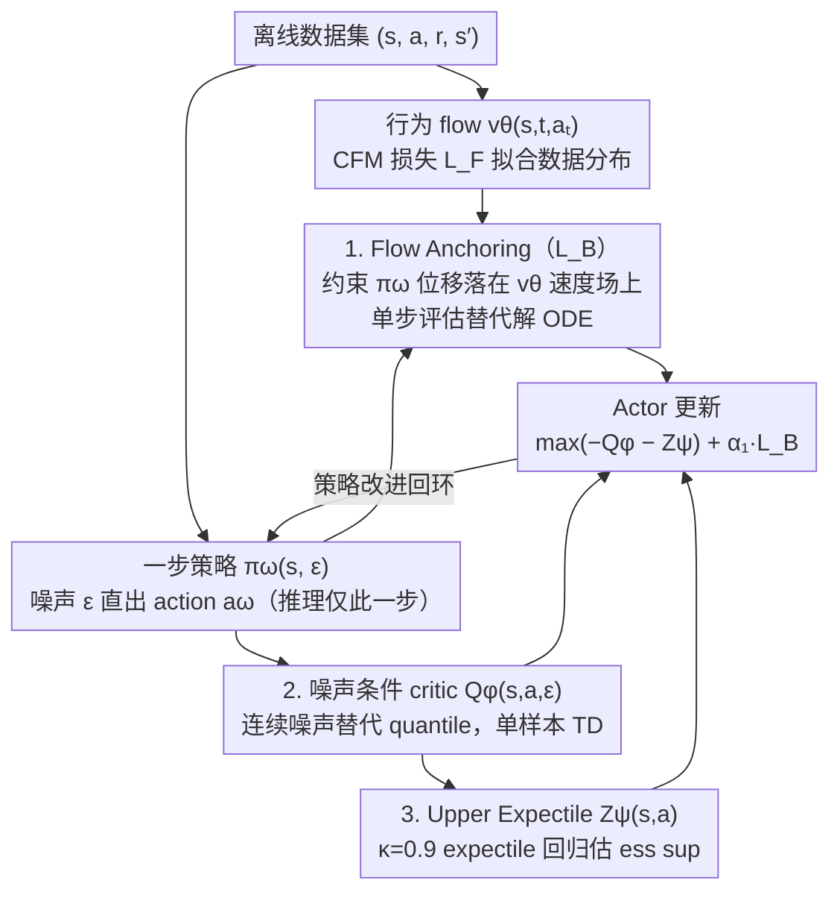

# Towards Efficient and Expressive Offline RL via Flow-Anchored Noise-conditioned Q-Learning

**会议**: ICML 2026  
**arXiv**: [2605.01663](https://arxiv.org/abs/2605.01663)  
**代码**: https://github.com/brianlsy98/FAN (有)  
**领域**: 强化学习 / 离线 RL / 生成式策略  
**关键词**: 离线RL, Flow Matching策略, 分布式critic, 噪声条件Q学习, 行为正则化

## 一句话总结
本文提出 FAN：把"昂贵的生成式策略 + 分布式 critic"压缩到"单步 flow 锚定 + 单噪声样本 critic"——用 Flow Anchoring 在一次 flow 评估内完成行为正则化，用 noise-conditioned critic 把 quantile 多样本替换成单 Gaussian 噪声样本，在 D4RL/OGBench 上做到 SOTA 性能同时训练比同类分布式方法快 5-14×。

## 研究背景与动机

**领域现状**：离线 RL 核心挑战是约束策略在数据集行为分布内以避免 OOD 高估。最近两类高表达力工具被广泛采用：(1) **flow / 扩散策略**用 flow matching 建模多模态行为分布，比 Gaussian 策略表达力强（FQL、IDQL、Diffusion-QL 等）；(2) **分布式 critic** 通过 quantile 等机制学习整个回报分布而非期望值（IQN、CODAC、Value Flows）。两者结合能拿到 SOTA，但代价巨大。

**现有痛点**：(i) flow 策略每生成一个 action 都要解 ODE，迭代 10 步 = 10× 单步前向开销；训练时若用 flow 做 behavior regularization（如 FQL 的 $\mathcal{L}_P$）需要解 ODE 拿到 $a_\theta$ 再算 $\|a_\omega-a_\theta\|^2$，把 flow 步数乘进训练成本。(ii) 分布式 critic 通常需要在 16-32 个 quantile 上同时计算 loss，再做 ess sup 类操作时还会引入额外的 max-over-samples 步骤，计算和方差都堆上去。

**核心矛盾**：表达力（多模态行为 + 完整回报分布）和效率（单次前向 + 单样本估计）天然冲突；前人为了表达力牺牲了几倍到十几倍的训练/推理速度。

**本文目标**：在保留 flow 策略 + 分布式 critic 表达力的前提下，回答两个具体技术问题——(1) flow 策略能不能只用单次迭代做行为正则？(2) 分布式 critic 能不能只用单个 Gaussian 噪声样本训练？

**切入角度**：观察到行为正则化本质上要约束策略分布贴近行为分布，不一定需要 sample 真实行为 action——一个等价目标是约束策略 "落在 behavior flow 的速度场轨迹上"，这只需要单步 flow 评估。同理，分布式信息可以用一个连续噪声变量 $\epsilon$ 编码（而非离散 quantile $\tau$），critic 写成 $Q(s,a,\epsilon)$ 后单噪声样本就能学。

**核心 idea**：用 Flow Anchoring 替换 ODE 解算——通过 flow matching 损失 $\|(\pi_\omega(s,\epsilon)-\epsilon)-v_\theta(s,t,a_{t,\omega})\|^2$ 让一步策略的"位移"被 behavior flow 速度场约束；用 noise-conditioned critic + upper expectile regression 把分布信息压缩到单个 Gaussian 噪声样本，配合 $\kappa\approx 1$ 的非对称 expectile 估计 $\mathrm{ess\,sup}$。

## 方法详解

### 整体框架
FAN 是一个 behavior-regularized actor-critic 框架，含四个网络：

- 一步策略 $\pi_\omega(s,\epsilon)$：输入状态和噪声直接输出 action；
- 行为 flow 策略 $v_\theta(s,t,a_t)$：用 flow matching 拟合数据集 $(s,a)$ 分布；
- 噪声条件 critic $Q_\phi(s,a,\epsilon)$：对一个 Gaussian 噪声样本评估 Q；
- 上分位估计器 $Z_\psi(s,a)$：用 $\kappa=0.9$ 的 expectile regression 估计 $\mathrm{ess\,sup}_\epsilon Q_\phi(s,a,\epsilon)$。

整个 actor-critic 循环：行为 flow 用 BC 损失 $\mathcal{L}_F$ 维持；critic 用 TD loss 训练并加入 Flow Anchoring 正则项 $\alpha_2 R$ 进入 target；策略 update 同时受 $-Q_\phi-Z_\psi$（最大化回报）和 $\alpha_1\mathcal{L}_B$（Flow Anchoring 行为正则）约束。

### 关键设计

**1. Flow Anchoring：用单步 flow 替代 ODE 行为正则**

FQL 做行为正则要先解 ODE 拿到 behavior flow 的终态 $a_\theta$，再算 $\|a_\omega-a_\theta\|^2$，每次梯度更新都得跑 N 步 forward，把 flow 步数乘进训练成本。FAN 的关键观察是：约束策略贴近行为分布，不一定要 sample 真实 action，等价目标是约束策略的"位移"落在 behavior flow 的速度场轨迹上——这只需一次 flow 评估。行为 flow $v_\theta$ 用标准 CFM 损失 $\mathcal{L}_F(\theta)=\mathbb{E}[\|v_\theta(s,t,a_t)-(a-\epsilon)\|^2]$（$a_t=(1-t)\epsilon+ta$）训练，Actor 端的 Flow Anchoring 损失为

$$\mathcal{L}_B(\omega)=\mathbb{E}\big[\|(\pi_\omega(s,\epsilon)-\epsilon)-v_\theta(s,t,a_{t,\omega})\|^2\big],\quad a_{t,\omega}=(1-t)\epsilon+t\pi_\omega(s,\epsilon)$$

critic 端把同样的 anchoring 项 $-\alpha_2\mathbb{E}_t[\|\cdot\|^2]$ 也加进 target。定理 B.3 证明这个损失是策略与行为分布间 Wasserstein-2 距离的上界，所以最小化它就是在最小化分布距离。这是"用积分上界替代积分本身"的经典 trick——绕过 ODE 解算这个中间产物，把训练成本从 $O(N_\text{flow})$ 降到 $O(1)$，理论保证还在。

**2. Noise-conditioned Critic + 算子 $\mathcal{T}_n^\pi$：用连续噪声替代离散 quantile**

标准分布式 critic（IQN/CODAC）要在 16-32 个 quantile 上同时算 loss，ess sup 还得 max-over-samples，计算和方差都堆上去。FAN 把分布信息编码进一个连续噪声变量 $\epsilon$，critic 写成 $Q(s,a,\epsilon)$，再定义新算子

$$\mathcal{T}_n^\pi Q(s,a,\epsilon')\overset{d}{=} r+\gamma\,\mathrm{ess\,sup}_{\epsilon\sim\mathcal{N}(0,I_d)}Q(s',\pi(s',\epsilon'),\epsilon)$$

定理 4.1 证明它在 $d_\infty$ 度量下是 $\gamma$-contraction，Banach 不动点存在唯一，所以 critic 可以用 TD 稳定地学。因为 $\epsilon$ 是连续变量，它在数学上等价编码了完整分布信息，单噪声样本训练在期望意义下无偏，省掉了 quantile 多样本的开销。这里保留 ess sup 而非取 mean，是为了延续 Q-learning 的 greedy 哲学，避免 expected SARSA 这类方法在 OOD 上的低估。

**3. Upper Expectile Regression：用单样本估 ess sup，不显式取 max**

$\mathcal{T}_n^\pi$ 里那个 $\mathrm{ess\,sup}_\epsilon Q$ 若用 Monte Carlo 直接采多个 $\epsilon$ 取最大值，会推高 overestimation。FAN 改用 $\kappa\approx 1$ 的非对称 expectile 回归来估它：

$$\mathcal{L}_2^\kappa(\hat x-x)=|\kappa-\mathbb{1}((\hat x-x)<0)|(\hat x-x)^2$$

定理 4.2 证明 $\kappa\to 1^-$ 时其最小元收敛到 ess sup，于是 $Z_\psi(s,a)$ 用 $\mathcal{L}_Z(\psi)=\mathbb{E}_{(s,a),\epsilon}[\mathcal{L}_2^\kappa(Q_{\hat\phi}(s,a,\epsilon)-Z_\psi(s,a))]$ 训练（固定 $\kappa=0.9$），actor 的值最大化损失 $\mathcal{L}_P(\omega)=\mathbb{E}[-Q_\phi(s,a_\omega,\epsilon')-Z_\psi(s,a_\omega)]$ 同时吃 noise-conditioned Q 和 upper expectile。本质是把 IQL 的 in-sample max 思想从"对 action 取最大"扩展到"对 noise 取最大"——单样本拟合分位数等价值，bias 和方差都比直接取 max 更可控。

### 损失函数 / 训练策略
- $\mathcal{L}_F(\theta)+\alpha_1\mathcal{L}_B(\omega)+\mathcal{L}_P(\omega)+\mathcal{L}_Q(\phi)+\mathcal{L}_Z(\psi)$ 五项联合优化，actor/value 交替更新。
- $\kappa=0.9$、$\tau=0.995$（target network 软更新）、$\alpha_1,\alpha_2$ 调行为正则强度（OGBench/D4RL 各自调）。
- 推理只用一步 $\pi_\omega(s,\epsilon)$ 采样，无 ODE 解算。

## 实验关键数据

### 主实验
D4RL（4 antmaze + 12 adroit）和 OGBench（25 state + 4 pixel）共 9 个任务类别：

| Benchmark | Task Group | ReBRAC | IDQL | FQL | IQN | CODAC | Value Flows | **FAN** |
|-----------|-----------|--------|------|-----|-----|-------|-------------|---------|
| D4RL | antmaze (4) | 73 | 75 | **79±8** | 46±4 | 46±3 | 17±4 | **76±4** |
| D4RL | adroit (12) | 59 | 52±4 | 52±3 | 50±3 | 52±1 | 50±2 | **53±4** |
| OGBench | antsoccer (5) | 16±1 | 33±6 | **60±2** | 24±7 | 33±14 | 27±7 | **60±8** |
| OGBench | puzzle-3x3 (5) | 22±2 | 19±1 | 30±4 | 15±1 | 20±5 | 87±13 | **100±1** |
| OGBench | puzzle-4x4 (5) | 14±3 | 25±8 | 17±5 | 27±4 | 20±18 | 27±4 | **42±10** |
| OGBench | cube-double (5) | 15±6 | 14±5 | 29±6 | 42±8 | 61±6 | 69±4 | 46±11 |
| OGBench | scene (5) | 45±5 | 30±4 | 56±2 | 40±1 | 55±1 | **59±4** | 58±1 |
| OGBench | vis-locomotion (2) | 28±11 | 44±4 | 17±2 | 32±4 | **49±2** | 44±4 | **49±4** |
| OGBench | vis-manipulation (2) | 16±4 | 8±11 | 28±5 | 6±3 | 2±1 | 30±4 | **33±16** |

FAN 在 9 个任务类里 7 个达 SOTA（95%最优范围内），尤其在 puzzle-3x3 等复杂多模态行为分布上的 100% 成功率远超所有基线。

### 消融实验

| 配置 | 5 OGBench 任务平均 | 说明 |
|------|-------------------|------|
| FAN 完整版 | 最优 | Flow Anchoring + $\mathcal{T}_n^\pi$ |
| NBRAC（用 ReBRAC 的标准 BC 代替 Flow Anchoring） | 4/5 任务输 | 没用 flow 表达多模态行为 |
| NFQL（用 FQL 的 flow ODE BC 代替 Flow Anchoring） | 4/5 任务输 | 表达力相当但计算贵 |
| FAQL（保 Flow Anchoring，换成非分布式 Bellman） | 4/5 任务输 | 丢掉分布信息 |
| Value Flows / CODAC（分布式 critic） | 训练慢 5-14× | quantile 多样本 |

### 关键发现
- **Flow Anchoring vs 标准 BC**：在多模态行为分布任务（OGBench puzzle/cube）上，flow-based 行为约束显著优于 Gaussian BC，因为 Gaussian 拟合多模态会被强行平均化产生中间区域的 OOD action。
- **$\mathcal{T}_n^\pi$ vs 非分布式 Bellman**：FAN 在 4/5 任务上超过 FAQL（只去掉分布式），说明 noise-conditioned critic 的分布信息确实有用，不只是 Flow Anchoring 一个组件功劳。
- **训练效率**：FAN 比 IQN/CODAC/Value Flows 训练时间快 5-14×（cube-double-play 实测）；推理速度甚至超过所有非分布式 baseline（因为 $\pi_\omega$ 是单步，且 $Z_\psi$ 不参与推理）。
- **Offline-to-Online**：从离线训完降低 $\alpha_1,\alpha_2$ 进 online fine-tune，FAN 在 5 个 OGBench 任务上 4 个 SOTA（puzzle-3x3 99→100、puzzle-4x4 17→100），说明 Flow Anchoring 自然兼容 online 探索——不像直接采样行为 action 会限制 exploration。
- **理论 + 实验闭环**：定理 4.1（$\mathcal{T}_n^\pi$ 在 $d_\infty$ 下 $\gamma$-contraction）+ 定理 4.2（$\kappa\to 1$ 时 expectile 收敛到 ess sup）+ 定理 B.3（Flow Anchoring 控 Wasserstein-2 距离）三个理论给出了"简化不损失正确性"的保证。

## 亮点与洞察
- **"积分上界替代积分本身"是个值得 mark 的元技巧**：FQL 解 ODE 是为了得到 $a_\theta$ 用于 BC 距离；Flow Anchoring 直接约束策略的位移落在速度场上——绕过了 ODE 解算这一中间产物，而理论上界仍然成立。类似思路完全可以迁移到其他需要 simulate forward dynamics 才能算 loss 的场景（如 reverse SDE 训练、ODE-based generative model 训练）。
- **noise variable 作为 quantile 的连续替代**：把分布式 critic 的离散 quantile 索引换成连续 Gaussian noise，让单样本训练在期望意义下无偏；这是把"分布式 RL"从 quantile 范式跳到 "noise-conditioned" 范式的关键。expectile 估计 ess sup 又是 IQL 思想的优雅复用。
- **三件套均有理论支撑**：Flow Anchoring（定理 B.3）、$\mathcal{T}_n^\pi$ contraction（定理 4.1）、upper expectile 收敛（定理 4.2）——少见在追求工程效率的同时所有"压缩 trick"都有严格证明，作者明显是为了避免被审稿人怀疑"简化是不是凭运气"才写得这么细。
- **Offline-to-Online 友好**：FAN 不直接 sample 数据集 action（与 IDQL/FQL 不同），而是约束策略空间，于是 online 阶段降低 $\alpha$ 后探索能力天然解禁，与 online RL 兼容性优异。
- **整套设计的工程导向**：从"训练效率"和"推理效率"两个用户实际关心的指标倒推算法设计，最终拿到 SOTA + 5-14× 提速 + 推理超快，这种"工程驱动 + 理论保底"的研究范式很值得借鉴。

## 局限与展望
- 假设 deterministic transition/reward 用于 $\mathcal{T}_n^\pi$ 推导，stochastic environment 下还需要更复杂的 noise + state-transition 解耦，论文未讨论。
- ess sup + $\kappa=0.9$ 的非对称 expectile 在 reward 尺度变化大的任务上敏感性如何缺乏分析；某些 task group（如 D4RL adroit）FAN 仅与 baseline 持平不显优，可能与 reward shaping/dimension 相关。
- Flow Anchoring 的 Wasserstein-2 上界等号成立需要 "所有 flow 轨迹是直线" + Lipschitz 条件，实际中 $v_\theta$ 的 flow 轨迹未必直；论文给出 Lipschitz 假设但未对"轨迹直性"的偏差做量化分析。
- 没有大规模或长 horizon 任务（Atari/Procgen 等）实验，仅在 D4RL/OGBench 这类相对简单的 robotics 场景；扩展到更复杂环境是否仍 SOTA 待验证。
- 推理时还是只用单噪声样本，没探索 multi-sample policy improvement 路径——若想拿 Pareto 最优在 inference 阶段，可能需要在 quality vs latency 间再权衡。

## 相关工作与启发
- **vs FQL（Park et al. 2025c）**：FQL 用 flow ODE 做 BC 距离 → 训练每步要解 N 次 flow；FAN 用 Flow Anchoring 单步评估 → 训练 5-14× 加速，且 OGBench 多个任务超过 FQL。
- **vs IDQL/Diffusion-QL**：用扩散策略 + Q-weighted 采样，需要多步 reverse diffusion；FAN 用一步 $\pi_\omega$ + 行为约束，推理快得多。
- **vs IQN/CODAC（quantile 分布式）**：固定 quantile 网格上算 loss → 多样本开销；FAN 用连续 noise + expectile → 单样本搞定，且 ess sup 比 mean-based 更适合 Q-learning greedy 哲学。
- **vs Value Flows（Dong et al. 2025）**：同样是 distributional + flow，但 Value Flows 训练时需要 Jacobian-vector products，wall-clock 慢；FAN 用更直接的 noise-conditioned 设计，效率高出一截。
- **vs IQL (Kostrikov et al. 2021)**：IQL 的 in-sample max 思想被 FAN 借用到 noise 维度——把 "max over OOD action" 换成 "max over noise"，思路一脉相承。

## 评分
- 新颖性: ⭐⭐⭐⭐ Flow Anchoring 和 noise-conditioned $\mathcal{T}_n^\pi$ 两个简化方向都是有原创性的设计，但都建立在 FQL/IQL/IQN 等前人工作之上的组合创新。
- 实验充分度: ⭐⭐⭐⭐⭐ 29 个任务横跨 D4RL/OGBench state-based/pixel-based、消融拆 Flow Anchoring 和 $\mathcal{T}_n^\pi$ 各一遍、offline-to-online 验证、FLOPs + wall-clock 双重测量，非常完整。
- 写作质量: ⭐⭐⭐⭐⭐ 动机 → 算子设计 → 理论保证 → 实验呼应一条线下来，三个核心定理对应三个核心 trick；伪代码清晰，附录推导完整。
- 价值: ⭐⭐⭐⭐⭐ 把"表达力 + 效率"在离线 RL 上拉到了一个新平衡点，对生产环境部署（机器人、自动驾驶）非常有用；offline-to-online 友好也开了一个潜在的好方向。

<!-- RELATED:START -->

## 相关论文

- [\[NeurIPS 2025\] Sample-Efficient Tabular Self-Play for Offline Robust Reinforcement Learning](../../NeurIPS2025/robotics/sample-efficient_tabular_self-play_for_offline_robust_reinforcement_learning.md)
- [\[ICLR 2026\] Statistical Guarantees for Offline Domain Randomization](../../ICLR2026/robotics/statistical_guarantees_for_offline_domain_randomization.md)
- [\[ICLR 2026\] On Entropy Control in LLM-RL Algorithms](../../ICLR2026/robotics/on_entropy_control_in_llm-rl_algorithms.md)
- [\[ICLR 2026\] Cross-Embodiment Offline Reinforcement Learning for Heterogeneous Robot Datasets](../../ICLR2026/robotics/cross-embodiment_offline_reinforcement_learning_for_heterogeneous_robot_datasets.md)
- [\[ICML 2026\] HDFlow: Hierarchical Diffusion-Flow Planning for Long-horizon Tasks](hdflow_hierarchical_diffusion-flow_planning_for_long-horizon_tasks.md)

<!-- RELATED:END -->
