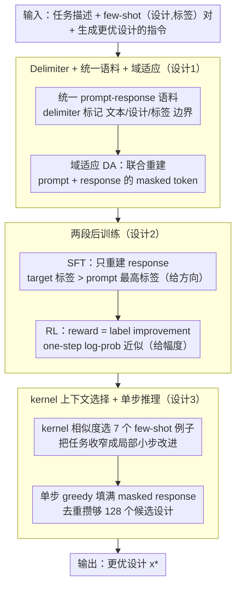

# DiBO: 用扩散语言模型做离线黑盒优化（DNA + 机器人形态）

**会议**: ICML 2026  
**arXiv**: [2603.17919](https://arxiv.org/abs/2603.17919)  
**代码**: 论文页提供（here 链接）  
**领域**: 黑盒优化 / 扩散语言模型 / 设计生成  
**关键词**: 离线 BBO, 扩散 LLM, 双向建模, 域适应, 离线 RL

## 一句话总结
DiBO 把扩散语言模型 LLaDA-8B 适配到离线黑盒优化场景，用 delimiter token 统一 prompt/design/label 三类异构信号，再走「域适应 → masked-response SFT → label-improvement RL」三段后训练，让模型能在 500 条标注样本下学到 Design-Bench 多个任务的 SOTA（DNA 任务上 +8% 归一化分），单 H100 1.5 小时就能跑完一个离散任务。

## 研究背景与动机

**领域现状**：黑盒优化（BBO）在 DNA 序列、机器人形态、材料发现等领域很关键，但实验标注昂贵，没法做在线优化。离线 BBO 假设给定 $\mathcal{D} = \{(\bm{x}_i, y_i)\}$ 静态数据集，想找出比数据集更优的新设计 $\bm{x}^*$。传统做法有两条路线——(a) 学个代理 $f_\theta(\bm{x})$ 然后梯度上升（COMs、ICT、MATCH-OPT），但 OOD 时代理梯度不可靠；(b) 学逆向生成模型（CbAS、MIN、BONET、DDOM）直接 sample 高分设计。

**现有痛点**：(1) 自回归 LLM（OPRO、UniSO-T）虽然能直接生成 token 设计但是单向的——DNA 等设计任务里每个位点同时受前缀和后缀约束，左到右生成抓不住双向依赖；(2) 现有扩散 BBO 方法（DDOM、GTG）多数是任务特化架构在连续空间跑，没法自然融入文本任务描述；(3) 现有的离线 BBO 方法在 small-data setting（$N \approx 500$）下严重过拟合，缺乏大模型 prior 救济。

**核心矛盾**：要兼顾双向建模（适合 DNA/形态）+ 文本任务描述融合（适合通用 BBO）+ 利用 LLM pretrain prior，单一架构很难做到。扩散 LLM 天生双向，但是它在自然文本上预训练，跟「设计 token + 数值 label」这种异构信号有 domain gap。

**本文目标**：把扩散 LLM 适配到 BBO，让它既能保留双向建模优势，又能在 small-data 下学到「prompt→更优 design」的映射，并且能用 RL 信号做精细对齐。

**切入角度**：用 delimiter token + 统一 prompt-response 语料解决「设计/标签 vs 自然文本」的语义角色冲突；用「先 masked joint reconstruction，再 SFT，再 RL」三段后训练逐步对齐。

**核心 idea**：把扩散 LLM 的「同时预测被 mask 的 prompt token + response token」当作 BBO 域适应目标，把「response label 大于 prompt 全部 label」的样本对当 SFT 数据，再把「response label - prompt label」当 reward 走 one-step log-prob RL，三段串行就能让 8B 扩散 LLM 在 500 个样本上把 BBO 做到 SOTA。

## 方法详解

### 整体框架

输入：(1) 一段自然语言任务描述（含设计语义、格式、优化目标）+ (2) 一组 few-shot 的（设计，标签）对 + (3) 一个让模型「生成更优设计」的指令。输出：一段被 delimiter 包起来的设计 + 标签 token 序列。

DiBO 在冻结扩散 LLM 之上加四件事：(a) tokenizer 扩展两组 delimiter `|design-start|/|design-end|` 和 `|label-start|/|label-end|`；(b) 域适应 DA 阶段在统一 prompt-response 语料上联合预测 prompt 和 response 的 masked token；(c) SFT 阶段只预测 response 的 masked token，以「prompt 之外的最高标签设计」作为 target；(d) RL 阶段用 label improvement 作 reward，one-step unmask 近似 log prob。推理时用一次性 greedy unmask 填满 masked response。整条链路是 DA→SFT→RL 三段串行后训练，再接单步推理；三段后训练对应「认识格式 → 给方向 → 给幅度」的递进。

### 关键设计

**1. Delimiter token + 统一 prompt-response 语料的域适应：把异构信号塞进同一序列，让扩散 LLM 学会角色边界**

扩散 LLM 在自然文本上预训练，直接把"设计 token + 数值标签"当普通文本喂进去，它会把标签当噪声、抓不住 segmentation。DiBO 先扩展 tokenizer 加 4 个 delimiter（`|design-start|/|design-end|`、`|label-start|/|label-end|`），每条样本写成 `[prompt 文本][few-shot (design, label) 对][生成更优设计的指令]` + `[response design][response label]` 的统一序列，每个 design/label 都被 delimiter 包起来。域适应目标对 prompt 和 response 的 masked token 同时重建：

$$\mathcal{L}_{\mathrm{DA}} = -\mathbb{E}\Big[\tfrac{1}{t} \textstyle\sum_{i=1}^{L} \mathbf{1}[q_t^i=[M], o_t^i=[M]] \log p_\theta(q_0^i, o_0^i | q_t, o_t)\Big].$$

few-shot 上下文 design 用 kernel 相似度从 offline pool 里挑跟 response design 相近的，避免模型学到"prompt 和 response 毫无关系"的退化映射。比起 DDOM 那种任务特化架构，这套纯语料方案能直接复用扩散 LLM 的预训练 prior 和双向注意力。

**2. 两段后训练：masked-response SFT 给方向、label-improvement RL 给幅度**

域适应只教会了格式，还得让模型真正生成"比上下文更优"的设计。SFT 阶段冻结 prompt、只在 response 上做 masked reconstruction，loss $\mathcal{L}_{\mathrm{SFT}} = -\mathbb{E}[\frac{1}{t} \sum_i \mathbf{1}[o_t^i=[M]] \log p_\theta(o_0^i | q_0, o_t)]$，且 target 必须满足 $y(o) > \max y(\text{prompt})$——给模型一个"response 一定更优"的硬归纳偏置。RL 阶段把约束放松成连续 reward $r(q, o) = y(o) - y(q)$（有正有负，不强求 strict improvement），loss $\mathcal{L}_{\mathrm{RL}} = -\mathbb{E}[\frac{1}{|o|} \sum_k p_\theta(o_k | q, o_{\text{fullmask}}) \cdot \frac{r(q,o)}{\sigma}]$。

这里的关键是分工：SFT 给"方向"（应该更优），RL 给"幅度"（更优多少）。而让 RL 在 8B 扩散 LLM 上单卡可跑的 trick 是 one-step unmask 近似 token-wise log prob——传统扩散 log-prob 要 iterative denoising 才稳，但 BBO 的设计序列很短，one-step 就够用且省约 50× 算力；行为策略假设均匀分布，还顺手省掉了 ratio clipping 和 KL 正则。

**3. kernel-similarity 上下文选择 + 单步 greedy 推理：把"improve over prompt"限制成"小步改进"**

"生成比 prompt 更优的设计"这个假设在 prompt 全落在低分区时会崩——模型很难一步从垃圾跳到高分区。DiBO 在构造训练数据时，给定 target response design $o$，用 kernel similarity $k(o, x_i)$ 从 offline pool 选 top-7 作 few-shot prompt，保证 prompt 例子和 target 在 design space 局部接近，相当于把任务收窄成模型擅长的"小步改进"。

推理同样用 $n_{few}=7$ 个 in-context examples，对 masked response 做一次 forward 然后 greedy fill，丢弃重复输出直到攒够 128 个 unique candidate。单步 greedy 正是扩散 LLM 相对 AR LLM 在 BBO 上的额外便宜——AR 要 $K$ 步才能生成 $K$-token 设计，扩散一次性出。

### 损失函数 / 训练策略

三段串行：DA 1024 步（连续 2048 步）→ SFT 1024 步 → RL 128 步。所有阶段都用 PagedAdamW8bit + Bfloat16 + 100 步 linear warmup + 常数学习率。学习率：DA 和 SFT 用 $2 \times 10^{-5}$，RL 用 $1 \times 10^{-6}$（防止 RL 把 SFT 学到的「先验」拉散）。每任务有 500 样本的 offline pool，nfew=7 个 in-context 例子。

## 实验关键数据

### 主实验：Design-Bench（100th percentile 归一化分，8 seed 平均）

| 方法 | Ant Morphology | D'Kitty Morphology | TF Bind 8 | TF Bind 10 | 平均 | Rank Mean ↓ |
|------|----------------|---------------------|-----------|------------|------|-------------|
| $\mathcal{D}$(best) | 0.565 | 0.884 | 0.439 | 0.511 | — | — |
| Grad-mean | 0.709 | 0.920 | 0.843 | 0.736 | 0.802 | 4.25 |
| COMs | 0.647 | 0.934 | 0.843 | 0.709 | 0.783 | 4.5 |
| ExPT | **0.929** | 0.950 | 0.810 | 0.703 | 0.848 | 4.0 |
| OPRO（AR LLM） | 0.517 | 0.856 | 0.758 | 0.500 | 0.658 | 14.0 |
| DDOM（扩散） | 0.590 | 0.929 | 0.739 | 0.497 | 0.689 | 11.25 |
| MCTS-transfer | 0.648 | 0.910 | 0.857 | 0.628 | 0.761 | 7.25 |
| **DiBO (ours)** | **0.932** | 0.912 | **0.946** | **0.741** | **0.883** | **3.5** |

DiBO 在 4 个任务中 3 个夺冠（Ant、TF8、TF10），TF Bind 8 上比最强基线领先 0.082；D'Kitty 上略输 ExPT 0.038 但仍属第一梯队；Rank Mean 3.5 + Rank Median 1.0 全场最优。

### 关键消融：扩散 vs 自回归 backbone（同样的 DA→SFT→RL 流程）

| 任务 | 阶段 | 自回归（LLaMA-3.1-8B-Instruct） | DiBO（扩散） | 提升 |
|------|------|------------------------------|--------------|------|
| TF Bind 8 | DA | 0.803 | 0.883 | +0.080 |
| TF Bind 8 | SFT | 0.875 | 0.939 | +0.064 |
| TF Bind 8 | RL | 0.915 | 0.946 | +0.031 |
| TF Bind 10 | DA | 0.623 | 0.644 | +0.021 |
| TF Bind 10 | SFT | 0.633 | 0.704 | +0.071 |
| TF Bind 10 | RL | 0.682 | 0.741 | +0.059 |
| Ant | RL | 0.930 | 0.932 | +0.002 |
| D'Kitty | RL | 0.912 | 0.912 | 0.000 |

离散 DNA 任务（TF8/TF10）上扩散 backbone 在所有三个阶段都显著领先 AR backbone，验证「双向建模对 DNA 等强双向依赖任务有真实帮助」；连续机器人任务上差距收敛到 0，说明 6D/60D 连续设计本身没那么强的双向依赖，扩散优势主要来自离散+双向场景。

### 关键发现

- **小数据 + 大模型 prior 的甜区**：在 $N=500$ 样本上做出 SOTA 是论文亮点——传统 BBO 在这个数据量下严重过拟合，扩散 LLM 8B 参数的 pretrain prior 充当了正则。
- **三段后训练的累积收益**：DA → SFT → RL 每一段都涨分（TF Bind 8 从 0.883 → 0.939 → 0.946），证明它们提供互补信号——DA 教格式，SFT 教方向，RL 教幅度。
- **OPRO 的失败说明 prompting 不够**：同样的 LLM-for-BBO 思路，OPRO 只 prompt 不微调，平均 0.658 远低于 DiBO 0.883，说明 LLM 必须经过域内适应才能真正利用 pretrain prior。
- **训练成本**：单 H100、1.5 GPU 小时跑完 TF Bind 8 全流程，对 8B 模型来说极其便宜，说明扩散 LLM + 短设计序列在算力上完全可行。

## 亮点与洞察

- **delimiter token + 统一语料是简单但有效的桥**：相比专门设计架构，扩展 tokenizer 几个 token 就把异构信号问题解决了，方法上极轻量且可迁移到其他「文本 + 数值 + 结构」混合的场景（如金融、化学）。
- **三段后训练对应「prior → 方向 → 幅度」的认知层级**：DA 让模型识别格式，SFT 给「应该更优」的硬约束，RL 用 reward 细调。这种「先粗后细」的策略对所有 LLM 适配新任务（医学问答、代码补全、科学发现）都有借鉴价值。
- **扩散 LLM 在离散设计任务上对 AR LLM 的真正优势**：消融表清晰显示在 DNA（强双向）上扩散胜出明显、在机器人形态（连续、弱双向）上扩散和 AR 几乎平手。这给「什么时候该用扩散 LLM」一个非常具体的判别准则。
- **one-step unmask 近似 log prob**：把扩散模型的 RL 训练成本从 N 步 denoising 降到 1 步，对所有扩散类 RL 工作都有方法论意义。
- **小数据 BBO 上 8B 模型可行**：开源 BBO 工具普遍用 100M 以下小模型，本文证明 8B 模型在 500 样本上也能稳定训练，给 LLM-for-science 路线注入信心。

## 局限与展望

- **设计空间有限**：实验只覆盖了 8/10 长 DNA 和 60D/56D 连续机器人形态，对几百维以上的设计空间（蛋白质序列、电路设计）能否扩展未验证。
- **行为策略均匀假设的合理性**：RL 阶段假设老策略是均匀分布，省掉 IS ratio——但当 offline 数据有明显非均匀分布时这个近似可能引入 bias，作者承认是简化。
- **kernel similarity 选 prompt 例子的脆弱性**：选 top-7 接近 target 的例子，相当于偷偷把 target 信息泄漏给 prompt（虽然 design 还是要模型生成）；是否构成「数据泄漏」需要更严格讨论。
- **TF Bind 10 上的相对优势小**：DiBO 在 TF10 上的 +0.005 比 TF8 上的 +0.082 小很多，可能跟 ddG label 翻转 + 任务噪声有关，论文没深究。
- **没和 inference-time MCTS 类方法（dLLM）正面比**：MCTS-transfer + dLLM 这类纯推理时方法和 DiBO 的 train-time 方法的算力-性能 tradeoff 没系统讨论。

## 相关工作与启发

- **vs OPRO（AR LLM 直接 prompting）**：他们只用 prompt 不微调；DiBO 证明微调是必须的，并给出三段式 recipe。
- **vs DDOM / GTG（扩散 BBO）**：那些方法用任务特化扩散在连续空间跑，没法接文本指令；DiBO 用通用扩散 LLM 把文本+设计+标签放一起。
- **vs dLLM（Yuan et al. 2026，prompt 扩散 LLM + MCTS）**：他们冻结扩散 LLM 走 inference-time search；DiBO 直接微调，证明 train-time 适配能拿更优结果，省 inference 算力。
- **vs PV-Tuning / DiscQuant**：思路上都属于「post-training 把基础模型适配到约束子空间」，可见这种范式正在跨领域普及。
- **启发**：对任何「需要 LLM 处理结构化非文本信号」的领域（电路、分子、电力调度），「delimiter token + 统一语料 + 三段后训练」是一个通用 recipe；对 LLM-for-science，small-data + pretrain prior 的甜区是一个值得长期投入的方向。

## 评分

- 新颖性: ⭐⭐⭐⭐ 把扩散 LLM 系统地适配到 BBO 是新的研究范式，delimiter + 三段后训练的设计实用且 elegant。
- 实验充分度: ⭐⭐⭐⭐ Design-Bench 4 任务 + 10+ 基线 + 扩散/AR backbone 严格对照消融 + Top-K/RNA 等附录扩展，覆盖全面。
- 写作质量: ⭐⭐⭐⭐ 流程图 1 简明易懂，loss 数学表达清晰，appendix 详细。略遗憾的是「为什么扩散 LLM 在连续 ant/d'kitty 上没有相对 AR 的优势」缺乏深入分析。
- 价值: ⭐⭐⭐⭐⭐ small-data BBO 实用场景（药物、材料、机器人），1.5 H100 小时跑完单任务 + 代码开源，对工业 R&D 直接可用。

<!-- RELATED:START -->

## 相关论文

- [\[ICML 2026\] The Lie We Tell: Correcting the Euclidean Fallacy in Vision-Language-Action Policies via Score Matching on Tangent Space](the_lie_we_tell_correcting_the_euclidean_fallacy_in_vision_language_action_polic.md)
- [\[ICML 2026\] StableVLA: Towards Robust Vision-Language-Action Models without Extra Data](stablevla_towards_robust_vision-language-action_models_without_extra_data.md)
- [\[ICML 2026\] Towards Efficient and Expressive Offline RL via Flow-Anchored Noise-conditioned Q-Learning](towards_efficient_and_expressive_offline_rl_via_flow-anchored_noise-conditioned_.md)
- [\[ICML 2026\] Position: Good Embodied Reward Models Need Bad Behavior Data](position_good_embodied_reward_models_need_bad_behavior_data.md)
- [\[ICML 2026\] Neural Low-Discrepancy Sequences](neural_low-discrepancy_sequences.md)

<!-- RELATED:END -->
