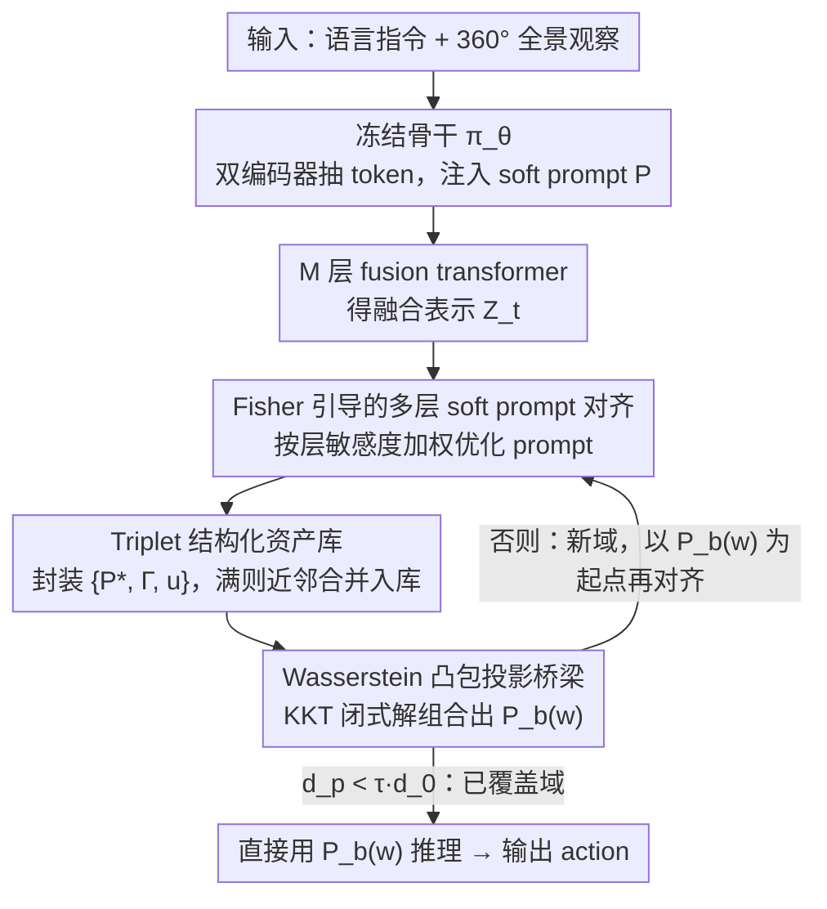

# Turning Adaptation into Assets: Cross-Domain Bridging for Online Vision-Language Navigation

**会议**: ICML 2026  
**arXiv**: [2605.23257](https://arxiv.org/abs/2605.23257)  
**代码**: 无  
**领域**: 多模态VLM / 视觉语言导航 / 测试时自适应  
**关键词**: VLN, Test-Time Adaptation, 软提示, Fisher信息, 凸包投影

## 一句话总结
针对在线视觉语言导航中环境分布不断漂移的问题，本文提出 IDEA 框架，把每次测试时自适应学到的 soft prompt 连同域坐标和不确定度封装为可复用"资产"，再用 Wasserstein 凸包投影把目标域映射到历史资产的组合上，得到一条免训练的跨域捷径，在 REVERIE / R2R 上平均 +2.5% SR、+1.9% SPL。

## 研究背景与动机

**领域现状**：视觉语言导航 (VLN) 要求 embodied agent 根据语言指令在 3D 环境中找到目标位置，主流做法是先用大规模模仿学习训出一个 Transformer 策略，然后在新环境里直接部署。当遇到分布漂移时，最近一波研究开始把测试时自适应 (Test-Time Adaptation, TTA) 引入 VLN，主要分两类：基于熵最小化的不确定性自训练（FSTTA、ReCAP）和基于 foundation model / 人类反馈的奖励驱动调整。

**现有痛点**：现有方法把每个 episode 的环境当成一个孤立的迁移任务来处理。每次 online update 都在原参数上覆盖，导致两个具体后果：一是**灾难性遗忘**——重访相似场景时已经学会的适应被新一次更新冲掉；二是**负迁移**——把当前域学到的更新盲目套到风格完全不同的下一个域上，引入错配的先验反而掉点。

**核心矛盾**：把适应视为"瞬时、孤立的参数更新"和"VLN 实际频繁出现相关/重复场景"这两件事是根本冲突的。前者无法把历史经验沉淀下来形成可复用的资产，所有努力都在一个 episode 结束后清零。

**本文目标**：让 TTA 在 VLN 中从"一次性更新"变成"知识的持续累积与组合"，并且要做到 plug-and-play、可检索、训练免费。

**切入角度**：作者把 adaptation 重新定义为 asset 的积累过程——每次 TTA 不再是改全局参数，而是产出一个带"域坐标"的轻量资产，存到一个有限容量的库里；当面对新域时，与其再从零优化，不如在历史资产的**凸包**上找一个最优的线性组合作为初始化。这条思路有希望，是因为相邻 episode 在视觉风格和语义先验上经常高度重叠，凸组合天然能复用部分相关而非全部相关的历史。

**核心 idea**：用 Fisher 信息加权的多层 prompt 对齐把每个域的适应固化成 triplet 资产 $\{P^*, \Gamma, u\}$，再用 Wasserstein 凸包投影的闭式解把目标域写成历史资产的线性组合，作为免训练的跨域桥梁。

## 方法详解

### 整体框架
策略骨干 $\pi_\theta$ 全程冻结。输入是一段语言指令 $I$ 加 360° 全景观察，输出是 action 序列。IDEA 在 visual token 序列前 prepend 一组可学习 soft prompt $P = \{p_i\}_{i=1}^{L}$，把 prompt 后的 token 送进原 fusion transformer 的 $M$ 层得到融合表示 $\mathcal{Z}_t^{(\ell)}$。每一步导航时，IDEA 先用历史资产库 $\mathcal{M}$ 构造一个组合 prompt $P_b(w)$ 作为初始化，再根据"加 prompt 后是否显著缩小与源域统计距离"决定是直接用这个 bridge 推理，还是把它当作起点继续优化成新资产存回库里。三大设计串成一个互补回环：资产库越长越丰富，凸包桥梁就有越多基底可组合；桥梁给出的好初始化又反过来加速下一次资产优化。

### 关键设计

**1. Fisher 引导的多层 soft prompt 对齐：只让真正影响决策的层来对齐**

把当前域的适应固化成 prompt 时，会撞上一个隐患——某一层 prompt 也许把统计分布拉齐了，却完全不改变动作概率，说明它只是在拟合与任务无关的噪声。IDEA 用 Fisher 信息把这种"虚假对齐"压下去。它先用源域 128 个样本预计算每层的 $(\mu_S^{(\ell)}, \sigma_S^{(\ell)})$，在线时把当前 batch 的 $(\mu_t^{(\ell)}, \sigma_t^{(\ell)})$ 往源统计对齐，逐层损失为

$$d^{(\ell)}(P) = \|\mu_S^{(\ell)} - \mu_t^{(\ell)}(P)\|_2 + \|\sigma_S^{(\ell)} - \sigma_t^{(\ell)}(P)\|_2$$

各层权重 $\alpha_\ell$ 不是手工设的，而是用 Fisher 信息矩阵的 trace $\mathrm{Tr}(\Phi(\mathcal{Z}_t^{(\ell)}))$ 归一化后做 EMA 更新（$\beta = 0.1$）。Fisher 矩阵用策略对数似然的一阶梯度近似 Hessian，省掉了二阶计算成本。这样权重会自动集中到对动作真正敏感的层上，prompt 编码的才是可迁移的任务先验，而不是无关统计。

**2. Triplet 结构化资产库：给每个 prompt 配一张"域指纹 + 质量分"**

要让适应知识能复用，光存 prompt 不够，还得知道它属于哪个域、有多可信。IDEA 把每次优化结果封装成三元组 $\mathcal{A} := \{P^*, \Gamma, u\}$：$P^*$ 是优化后的 prompt，$\Gamma$ 是**不加 prompt** 时最后一层 fusion 的 $(\mu, \sigma)$ 统计（充当与 prompt 解耦的环境描述符），$u$ 是用 $P^*$ 推理时的预测熵（反映资产可信度）。用"不加 prompt 的统计"做域坐标是关键——检索时不会被 prompt 本身的扰动污染，不同资产之间才能公平比较。库容量上限 $K_{\max}$，满了之后不是丢最早的，而是把新资产和最近邻 1:1 平均合并（$\mathcal{A}_k \leftarrow \frac{1}{2}(\mathcal{A}_k + \mathcal{A}^*)$），这样库不会随时间漂移到只剩近期资产，能保住对早期场景的覆盖。

**3. Wasserstein 凸包投影的闭式桥梁：在历史资产的凸包上找新域的初始化**

面对新域时，硬检索单个最近邻很容易错配——目标域往往和多个历史域部分重叠。IDEA 改成在历史 $K$ 个资产的凸包上找一个最优线性组合。它用一组共享权重 $w \in \mathbb{R}^K$ 同时在 prompt 空间和统计空间做插值：$P_b(w) = \sum_j w_j P_j$，$\Gamma_b(w) = \sum_j w_j \Gamma_j$。$w$ 通过最小化目标统计与 $\Gamma_b(w)$ 的 2-Wasserstein 距离求得，再加不确定性正则 $\lambda \sum u_j w_j^2$ 压制不可靠资产，整个问题归约为单纯形约束下的二次规划

$$\min_w \|Aw - b\|_2^2 + \lambda w^\top U w \quad \text{s.t.}\quad \mathbf{1}^\top w = 1,\; w \geq 0$$

作者用 KKT 条件推出闭式解 $w^* = \mathcal{H}^{-1}(g - \nu \mathbf{1})$，其中 $\mathcal{H} = A^\top A + \lambda U$，$\nu = \frac{\mathbf{1}^\top \mathcal{H}^{-1} g - 1}{\mathbf{1}^\top \mathcal{H}^{-1} \mathbf{1}}$。凸组合天然支持"借一部分 A 的风格 + 一部分 B 的布局"，闭式解又省掉了迭代优化，让这座 bridge 真正成为训练免费的捷径。

### 损失函数 / 训练策略
单步流程：先用 Eq. 12 算出 $w$ 和 bridge $P_b(w)$；测量加 prompt 前后统计距离 $d_p$ 与 $d_0$，若 $d_p < \tau \cdot d_0$ 视为已覆盖域，直接用 $P_b(w)$ 推理；否则视为新域，以 $P_b(w)$ 为初始化做多层对齐优化，得到新资产并按容量策略入库。理论侧给出两条结论：凸包投影权重收紧了目标域泛化误差的上界；闭式解关于统计估计扰动是 Lipschitz 稳定的。

## 实验关键数据

### 主实验

| 数据集 (评测) | 指标 | 本文 IDEA | 之前 SOTA | 提升 |
|---------------|------|-----------|-----------|------|
| REVERIE Val unseen (HAMT) | SR | 34.92 | 33.06 (ReCAP) | +1.86 |
| REVERIE Val unseen (HAMT) | SPL | 31.52 | 30.51 (FSTTA) | +1.01 |
| REVERIE Test unseen (HAMT) | SR | 32.81 | 30.51 (ReCAP) | +2.30 |
| REVERIE Val seen (HAMT) | OSR | 50.67 | 48.49 (ReCAP) | +2.18 |
| REVERIE Val seen (HAMT) | RGSPL | 26.82 | 25.81 (Tent) | +1.01 |

跨四个 backbone（HAMT / DUET 等）和三个 benchmark（REVERIE / R2R / R2R-CE）保持一致优势。

### 消融实验

| 配置 | 关键效果 | 说明 |
|------|---------|------|
| Full IDEA | 完整 SR=34.92 | Fisher 加权 + 资产库 + 凸包桥梁 |
| 等权多层对齐 (w/o Fisher) | 掉点 | 不再区分策略敏感层，prompt 拟合无关噪声 |
| 硬最近邻检索 (w/o 凸包) | 掉点 | 单一历史资产无法覆盖部分重叠的新域 |
| 每步从零优化 (w/o bridge 初始化) | 推理时延显著上升 | 失去训练免费捷径 |

### 关键发现
- HAMT 上 IDEA 推理时延 245.8ms，比 SAR (197ms) 高一点但远低于 ViDA ($5.49 \times 10^3$ ms) 和 FSTTA (613ms)，证明闭式 KKT 解的额外开销可以接受。
- 在更难的 Test unseen split 上提升幅度（+2.30 SR）大于 Val unseen（+1.86 SR），说明 asset library 在真正陌生的环境里收益更大——这正是历史复用应该擅长的场景。
- 论文验证了"资产库可移植"——一个 agent 学到的库可以直接给新 agent 用来跳过冷启动期，这是 plug-and-play 设计带来的副产物。

## 亮点与洞察
- **把 TTA 从"参数级更新"重新抽象为"知识级累积"**：这是观念上的转换，使得 online VLN 第一次有了真正可复用的中间产物，而不是每个 episode 结束就蒸发的梯度步。
- **Fisher trace 当成"功能性 vs 虚假性"对齐的判别器**：直接用一阶梯度近似 Hessian，避开二阶计算成本，思路在其它需要区分"统计匹配是否影响决策"的任务里很通用。
- **凸包 + KKT 闭式解的组合**：把一个看似昂贵的几何投影问题压成几次矩阵运算，是把理论工具落地到实时系统的典型做法，可以迁移到其它"用历史 prototype 组合表达新输入"的场景（如 few-shot 检索、模型合并）。
- **以"不加 prompt 的统计"作为域坐标**：把检索键与可学习内容解耦，这个 trick 在任何 prompt-based continual learning 里都值得借鉴，能避免库内不同资产因为各自 prompt 不同而无法公平比较。

## 局限与展望
- 资产库容量 $K_{\max}$ 的合并策略只是简单的最近邻 1:1 平均，长期下去可能让资产逐渐"模糊化"，丢失对极少数稀有场景的精确刻画；可以考虑基于使用频率或不确定性的更精细合并/淘汰策略。
- 凸包投影假设目标域必然落在历史资产的凸组合内，对真正完全未见过的极端场景（库覆盖之外）退化为最近邻效果，论文没充分讨论这种 OOD-of-library 情况下的失败模式。
- Fisher trace 的 EMA 系数 $\beta = 0.1$ 和不确定性正则 $\lambda$ 都是固定超参，是否对不同 backbone / 不同 benchmark 普适仍需更系统的敏感性分析。
- 理论结果建立在"特征服从多元高斯"假设上，VLN 的真实 fusion 特征是否满足这一假设缺乏经验验证。

## 相关工作与启发
- **vs FSTTA / ReCAP**: 都是 VLN 上的在线 TTA，他们做的是"在固定参数上做一致性 / 熵最小化更新"，本文则把每次更新冻结成资产存起来；区别是前者一旦 episode 结束所有更新归零，后者沉淀为长期可复用的库。本文优势是显著缓解 catastrophic forgetting，劣势是引入了库存储和检索的额外组件。
- **vs Tent / SAR**: 经典 TTA 的 batch norm 校准 / 熵正则，本文把它们升级到 prompt 级别 + 多层加权 + Fisher 引导。区别是把"该改哪些参数"从全部 BN 缩到一组 prompt，把"怎么衡量更新有效"从熵换成了对策略真正敏感的层。
- **vs ViDA**: 同样用 prompt 做 TTA，但 ViDA 是每步重新优化、不复用，本文用凸包投影把多个 prompt 组合起来跳过优化；本文在时延上比 ViDA 快了一个数量级。

## 评分
- 新颖性: ⭐⭐⭐⭐⭐ 把 TTA 重新框定为"资产累积 + 凸包桥梁"是真正新的抽象，不是常见的 trick 堆砌。
- 实验充分度: ⭐⭐⭐⭐ 跨四个 backbone、三个 benchmark、和多个 TTA baseline 比较充分，但消融对 $K_{\max}$ 和 Fisher 替代方案的扫描可以更细。
- 写作质量: ⭐⭐⭐⭐ 整体逻辑链清晰，方法图分三栏对应三大设计，但 KKT 推导和 Fisher 近似部分对非 TTA 背景读者门槛偏高。
- 价值: ⭐⭐⭐⭐⭐ 提出的 plug-and-play 资产库可在不同 agent 间共享，对 embodied AI 真实部署有直接意义。

<!-- RELATED:START -->

## 相关论文

- [\[ICLR 2026\] All-day Multi-scenes Lifelong Vision-and-Language Navigation with Tucker Adaptation](../../ICLR2026/robotics/all-day_multi-scenes_lifelong_vision-and-language_navigation_with_tucker_adaptat.md)
- [\[ICCV 2025\] Bridging Domain Generalization to Multimodal Domain Generalization via Unified Representations](../../ICCV2025/robotics/bridging_domain_generalization_to_multimodal_domain_generalization_via_unified_r.md)
- [\[CVPR 2026\] Bridging the 2D-3D Gap: A Hierarchical Semantic-Geometric Map for Vision Language Navigation](../../CVPR2026/robotics/bridging_the_2d-3d_gap_a_hierarchical_semantic-geometric_map_for_vision_language.md)
- [\[CVPR 2026\] Cross from Left to Right Brain: Adaptive Text Dreamer for Vision-and-Language Navigation](../../CVPR2026/robotics/cross_from_left_to_right_brain_adaptive_text_dreamer_for_vision-and-language_nav.md)
- [\[CVPR 2026\] Cross-Domain Demo-to-Code via Neurosymbolic Counterfactual Reasoning](../../CVPR2026/robotics/cross-domain_demo-to-code_via_neurosymbolic_counterfactual_reasoning.md)

<!-- RELATED:END -->
