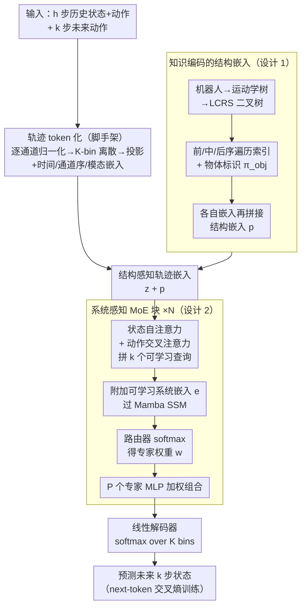

# WestWorld: 知识编码的可扩展轨迹世界模型

**会议**: ICML 2026 Spotlight  
**arXiv**: [2603.14392](https://arxiv.org/abs/2603.14392)  
**代码**: https://github.com/511205787/WestWorld  
**领域**: 机器人学 / 具身智能 / 世界模型  
**关键词**: 世界模型, 知识编码, 轨迹预测, 机器人多样化, 跨具身

## 一句话总结
WestWorld 用系统感知 MoE（Sys-MoE）+ 知识编码的结构嵌入，把多种异构机器人的轨迹动力学统一进一个可扩展世界模型：在 89 个仿真+真实环境上预训练后，零样本/少样本轨迹预测的 MAE/MSE 显著优于 MLP Ensemble、TDM、TrajWorld，并提升下游 MPPI 控制、成功部署到真实 Unitree Go1。

## 研究背景与动机

**领域现状**：轨迹世界模型（trajectory world model）直接在底层状态-动作（关节位置/速度、力矩等）上建模动力学，是机器人动力学学习、规划与控制的基础组件；与之相对的是用视频生成隐式建模观测的视频世界模型。要把轨迹世界模型推广到多种异构机器人，最大障碍是不同机器人的传感器/执行器维度、采样率、运动学结构差异巨大。

**现有做法与痛点**：近期工作（TDM、TrajWorld 等）把各系统的连续状态/动作量化成 token、用灵活的 Transformer 联合训练，从而在单一稠密模型里做多系统预训练。但这类方法有两个根本局限：（1）**可扩展性**——强行让差异巨大的动力学共享同一套稠密参数，会引发梯度冲突与负迁移，机器人种类一多性能就明显下降；（2）**零样本泛化**——把轨迹纯当 token 序列、忽略机器人形态结构信息，缺乏物理归纳偏置，迁到没见过的新机器人时泛化很差。（早期把输入零填充到统一最大维度的做法则受维度上限制约、还会损害跨环境泛化。）

**本文目标**：用单一模型学习 n 个不同机器人系统的动力学，做到既能随机器人数量可扩展地预训练、又能零样本/少样本泛化到新系统。

**核心 idea**：模型由两个核心组件构成——（1）**知识编码嵌入模块（KNEE）**，把机器人形态连接结构作为归纳偏置注入轨迹表示，提升零样本泛化；（2）**系统感知混合专家（Sys-MoE）**，用可学习的系统嵌入动态路由/组合专家来隐式学习各系统动力学、隔开跨机器人干扰，提升可扩展性。底层假设是：复杂系统动力学可由一组“基础动力学”按系统相关系数组合近似，因此让专家各学一部分、按系统组合即可。

## 方法详解

### 整体框架
WestWorld 要用一个模型为多种异构机器人（机械臂、四足、人形等）做轨迹世界模型预测，正面对上两个矛盾：一是不同机器人的传感器/执行器维度、动力学差异巨大，若把它们塞进同一套共享的稠密参数训练，会引发梯度冲突与负迁移，机器人种类一多就扩不动；二是把轨迹纯当 token 序列建模会丢掉机器人的形态结构信息，缺乏物理归纳偏置，零样本迁到没见过的新机器人时泛化很差。

整条流水线是这样走的：先把每条轨迹的每个状态/动作维度当成一个标量**通道**，逐通道做 min–max 归一化、离散成 $K$ 个 bin 的类别向量，再投影成 $d$ 维嵌入并叠加时间步、通道序、模态（状态/动作）三种嵌入，得到 token 化表示（这一步沿用 TrajWorld 的做法，属脚手架）；接着用**知识编码的结构嵌入**把机器人形态连接结构作为归纳偏置注入这些 token；随后送入堆叠的若干个**系统感知 MoE 块（Sys-MoE）**，块内先用注意力聚合状态-动作信息、再用一个可学习的系统嵌入驱动专家路由，按机器人系统动态组合专家来建模各自动力学；最后线性解码器输出对未来 $k$ 步状态在 $K$ 个 bin 上的分布，用 next-token 交叉熵训练，推理时一次前向并行预测 $k$ 步。两个核心贡献正好对应下面两个关键设计——结构嵌入管"零样本泛化"，Sys-MoE 管"可扩展性"。

### 关键设计

**1. 知识编码的结构嵌入：把机器人形态当归纳偏置注入轨迹表示**

现有轨迹世界模型几乎都是纯数据驱动，只看状态-动作观测，忽略了"不同形态的机器人本应遵守不同物理约束"这条领域知识——缺了显式结构信息，模型既难抓住系统底层动力学，也很难零样本泛化到新机器人。作者的洞察是：连接结构相似的机器人往往共享高层动力学行为（如 SLIP 式弹跳运动），所以应把形态连接关系当成归纳偏置写进模型。具体做法：把每个有关节物体建模成一棵有根运动学树，用 LCRS（左孩子-右兄弟）变换转成二叉树；对每个 body 节点取前序/中序/后序三套遍历索引来唯一定位它在树中的位置，多物体场景再加一个物体标识 $\pi_{\text{obj}}$（机器人记为 0，其余物体按到机器人的欧氏距离从近到远排序）。把这组索引各自嵌入成 $d/4$ 维向量后拼接成结构嵌入：

$$\bm{p}^{(i,j)} = \mathrm{Concat}\big(\bm{e}_{\text{obj}}(\pi_{\text{obj}}^{i}),\, \bm{e}_{\text{pre}}(\pi_{\text{pre}}^{i,j}),\, \bm{e}_{\text{in}}(\pi_{\text{in}}^{i,j}),\, \bm{e}_{\text{post}}(\pi_{\text{post}}^{i,j})\big)$$

再把 $\bm{p} \in \mathbb{R}^{d}$ 加到对应的状态/动作 token 上。这样形态结构信息直接进入轨迹表示，模型可借结构相似性把已学到的动力学迁移到没见过的机器人，正是零样本泛化能力的来源。

**2. 系统感知混合专家（Sys-MoE）：用系统嵌入路由专家，避免跨机器人互相干扰**

形态各异的机器人动力学差别很大，逼它们共享同一套参数训练会梯度冲突、任务互相干扰，机器人种类一多就扩不动。作者的洞察是：复杂系统动力学可以用一组"基础动力学"按系统相关的系数组合来近似——于是让专家各学一部分基础动力学、用系统嵌入算组合权重。Sys-MoE 块内分两步：

（i）**注意力聚合**——先对状态通道做自注意力捕捉状态变量间的相关，再用交叉注意力把动作嵌入注入状态表示（这种按通道做注意力的方式天然兼容不同机器人变化的状态/动作维度），并拼接 $k$ 个可学习查询嵌入，以便一次前向就预测未来 $k$ 步：

$$\hat{\bm{S}}_t = \mathrm{LN}\big(\tilde{\bm{S}}_t + \text{Cross-Atten}(\tilde{\bm{S}}_t, \bm{A}_t)\big)$$

（ii）**系统感知路由**——把一个可学习的系统嵌入 $\bm{e}$ 拼到注意力输出后过一层 Mamba 式选择性 SSM，取系统嵌入位置的 SSM 输出 $\bm{U}_{L+1}$ 经路由器 softmax 得到 $P$ 个专家上的混合权重，再用它对各专家（MLP）输出加权求和：

$$\bm{w} = \mathrm{Softmax}(\mathrm{Router}(\bm{U}_{L+1})), \qquad \bm{Y}_{1:L}^{(m)} = \sum_{p=1}^{P} w_p\, E_p(\bm{U}_{1:L}^{(m)})$$

与 LLM 里直接对每个 token 路由不同，这里的路由由"系统"决定——同一机器人的所有通道共享同一套专家组合权重，不同机器人各得其所。这样既隔开了不同机器人之间的梯度冲突、又能随机器人数量平滑扩展，是模型可扩展性的来源。多个 Sys-MoE 块堆叠以增强对复杂动力学的表达力。

## 实验关键数据

**预训练数据**：在 89 个复杂环境上预训练——80 个来自 UniTraj 的仿真机器人环境 + 9 个来自 Open X-Embodiment 的真实机械臂数据集；评测覆盖零样本、少样本、可扩展性、下游控制四类。基线为 MLP Ensemble（PETS 式概率动力学集成）、TDM（Gato 架构、把时空特征拉平成一维序列做自回归）、TrajWorld（时序-变量注意力的 Transformer 轨迹模型）；所有基线均在同一数据上从头预训练以保证公平。预测设定统一为：50 步历史窗口输入、预测未来 100 步。

### 零样本轨迹预测（Table 1，归一化空间 MAE/MSE ×10⁻²，越低越好）

| 方法 | Walker2D MAE | Walker2D MSE | Hopper MAE | Hopper MSE | Franka MAE | Franka MSE |
|------|------|------|------|------|------|------|
| MLP Ensemble | 26.006 | 12.028 | 19.987 | 7.216 | 12.164 | 4.271 |
| TDM | 20.122 | 6.428 | 17.634 | 5.076 | 23.686 | 8.435 |
| TrajWorld | 22.261 | 8.623 | 17.388 | 5.441 | 13.102 | 5.127 |
| **WestWorld** | **16.350** | **5.064** | **13.731** | **3.368** | **7.737** | **2.539** |

三个未见但结构相近的环境（Hopper、Walker2D 来自 D4RL；移动 Franka 操作铰接物体的真实数据）上，WestWorld 在 100 步长程预测的 MAE/MSE 全面最优。

### 少样本适应（Table 2，仅用 10 条 episode 微调，3 个种子均值，MAE/MSE ×10⁻²）

| 方法 | Cassie MAE | A1 MAE | UR5 MAE |
|------|------|------|------|
| MLP Ensemble | 14.369 | 14.357 | 15.181 |
| TDM | 14.510 | 10.624 | 18.578 |
| TrajWorld | 7.834 | 5.138 | 8.066 |
| **WestWorld** | **5.316** | **4.227** | **4.925** |

在与预训练分布有显著域差的三个真实数据集（Cassie 双足跳跃、Unitree A1 四足行走、UR5 桌面操作）上，WestWorld 始终优于全部基线。

### 下游基于模型的控制（Table 3，MPPI 累计回报，越高越好）

| 方法 | 预训练 | Walker2D | Hopper | Go1 |
|------|------|------|------|------|
| TrajWorld | ✓ | 1933.52 | 534.32 | 0.49 |
| **WestWorld** | ✗ | 707.61 | 554.92 | 0.43 |
| **WestWorld** | ✓ | **2134.60** | **2253.51** | **2.20** |

把学到的动力学模型嵌入 MPPI（采样式 MPC，Walker2D/Hopper 规划步长 100、Go1 为 40）：预训练几乎对所有方法/系统都提升控制表现，且 WestWorld 在"从头训练 / 预训练微调"两种设定、三个系统上均最优，预训练后增益尤其大。

### 消融（Table 4，零样本 MAE ×10⁻²）

| 配置 | Walker2D MAE | Hopper MAE | Franka MAE |
|------|------|------|------|
| 去掉 Sys-MoE（换等参数稠密 SSM） | 18.707 | 15.978 | 9.392 |
| 去掉结构嵌入（KNEE） | 21.156 | 16.227 | 7.897 |
| **完整 WestWorld** | **16.350** | **13.731** | **7.737** |

去掉结构嵌入对形态更复杂的 Hopper/Walker2D 损害明显、对 Franka 较小，说明结构嵌入对未见复杂系统的零样本泛化尤其关键；用等参数稠密 SSM 替换 Sys-MoE 则各任务普遍变差，说明 Sys-MoE 对联合建模多样动力学、缓解任务间干扰至关重要。

### 真实部署
把 WestWorld 蒸馏成两层轻量学生模型、用仿真 Go1 控制数据微调后嵌入 MPPI 部署到真实 Unitree Go1：蒸馏版 WestWorld 能稳定完成朝目标直行的行走任务，而同样协议蒸馏的 TrajWorld 则无法可靠站立前进。

### 关键发现
- 可扩展性（Fig. 4）：环境数从 1 增到 89，WestWorld 误差基本不随之上升；TrajWorld 则随环境增多显著退化（共享稠密模型的梯度干扰/负迁移）。
- Sys-MoE 路由权重（Fig. 3，6 层×4 专家）呈近似稀疏、按系统区分的专家特化，印证"复杂动力学≈基础动力学按系统系数组合"的假设。

## 亮点与洞察
- **用 MoE 解多机器人扩展性**：以系统嵌入路由专家替代"单一稠密大模型硬扛所有动力学"，把跨机器人的梯度冲突隔开，随机器人数量平滑扩展（环境数 1→89 误差几乎不涨）。
- **把形态结构当显式归纳偏置**：用运动学树 + LCRS 二叉树遍历索引编码连接结构，让结构相似的机器人共享高层动力学，零样本泛化由此而来。
- **端到端打通预测→控制→真机**：不仅刷低 MAE/MSE，还在 MPPI 下游控制全面领先，并蒸馏部署到真实 Unitree Go1。
- **可解释的专家特化**：路由权重的系统相关稀疏模式为"基础动力学组合"假设提供了直接证据。

## 局限与展望
- **仅建模轨迹、不含视觉**：当前只在底层状态-动作轨迹上建模，未引入视觉观测；作者明确将下一步定为融合视觉+轨迹的多模态世界模型。
- **依赖形态结构先验**：结构嵌入需要机器人的运动学连接结构（运动学树），对结构未知或难以刻画的系统适用性受限。
- **真机部署需蒸馏+仿真微调**：实时部署到 Go1 时要先蒸馏成轻量学生模型并用仿真数据微调，仍受 sim-to-real 差距（执行器/接触失配、地面摩擦、电量相关力矩上限、状态估计噪声）影响。
- **下游只隔离了"预训练对动力学建模的作用"**：控制实验固定 MPPI、不联合优化控制器/策略，二者的联合优化留待后续。

## 相关工作与启发
- **vs TrajWorld**：同为 Transformer 轨迹世界模型，但 TrajWorld 用单一共享稠密模型 + 时序-变量注意力，环境一多就因梯度干扰退化；WestWorld 用 Sys-MoE 按系统路由专家，可扩展性更好。
- **vs TDM**：TDM 基于 Gato、把时空特征拉平成一维序列做自回归；WestWorld 按通道做注意力并显式注入形态结构。
- **vs MLP Ensemble（PETS 式）**：传统概率动力学集成是单机器人范式；WestWorld 面向多机器人统一预训练。
- **视频 vs 轨迹世界模型**：另一条路线用视频生成模型隐式捕捉动力学；本文聚焦底层轨迹世界模型，二者互补。
- **启发**：把"领域结构知识（形态/运动学）"作为显式归纳偏置 + "MoE 隔离异构子任务"的组合，是统一多形态机器人模型的有效范式，可推广到操作、导航等任务。

## 评分
- 新颖性: ⭐⭐⭐⭐⭐  Sys-MoE（系统嵌入路由专家）+ 知识编码结构嵌入的组合，针对多形态机器人世界模型的扩展性与零样本泛化。
- 实验充分度: ⭐⭐⭐⭐⭐  89 环境预训练 + 零样本/少样本/可扩展性/下游 MPPI 控制四类评测 + 消融 + 真机 Go1 部署。
- 写作质量: ⭐⭐⭐⭐  问题动机清晰，方法与实验组织完整。
- 价值: ⭐⭐⭐⭐⭐  为多形态机器人统一世界模型提供可扩展方案，且打通到真机控制。

<!-- RELATED:START -->

## 相关论文

- [\[ICML 2026\] DiBO: 用扩散语言模型做离线黑盒优化（DNA + 机器人形态）](training_diffusion_language_models_for_black-box_optimization.md)
- [\[ICML 2026\] Position: Good Embodied Reward Models Need Bad Behavior Data](position_good_embodied_reward_models_need_bad_behavior_data.md)
- [\[ICML 2026\] Optimal and Scalable MAPF via Multi-Marginal Optimal Transport and Schrödinger Bridges](optimal_and_scalable_mapf_via_multi-marginal_optimal_transport_and_schrödinger_b.md)
- [\[ICML 2026\] HDFlow: Hierarchical Diffusion-Flow Planning for Long-horizon Tasks](hdflow_hierarchical_diffusion-flow_planning_for_long-horizon_tasks.md)
- [\[ICML 2026\] Dual-Stream Diffusion for World-Model Augmented Vision-Language-Action Model](dual-stream_diffusion_for_world-model_augmented_vision-language-action_model.md)

<!-- RELATED:END -->
