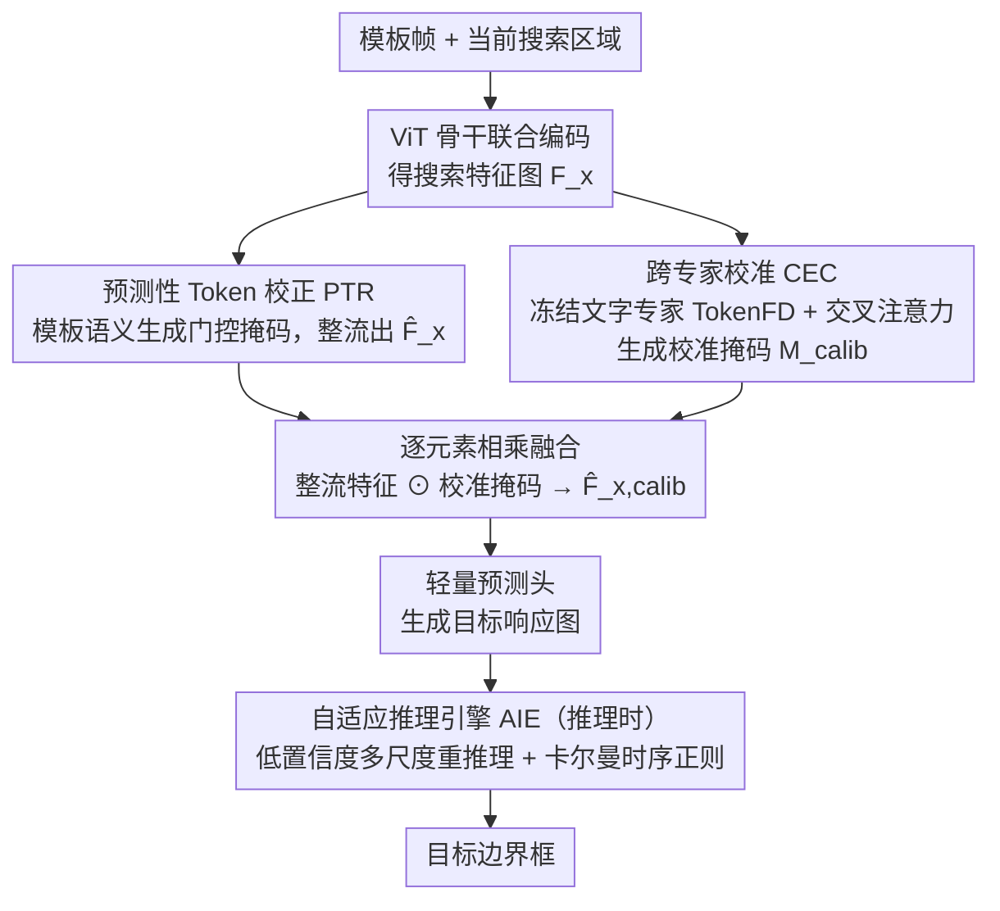

# Beyond Detection: A Structure-Aware Framework for Scene Text Tracking

**会议**: ICML2026  
**arXiv**: [2605.17270](https://arxiv.org/abs/2605.17270)  
**代码**: https://github.com/EdisonYCM/SymTrack  
**领域**: 视频理解  
**关键词**: 场景文字跟踪, 视觉目标跟踪, 双分支架构, 文字特征校准, 自适应推理  

## 一句话总结
提出 SymTrack，一个无需检测的双分支场景文字跟踪框架，通过预测性 Token 校正（PTR）解决透视畸变导致的特征瓶颈，跨专家校准（CEC）消除文字实例间的高视觉歧义，自适应推理引擎（AIE）稳定细粒度定位，在三个基准上大幅刷新 SOTA（最高 +12.32% AUC）。

## 研究背景与动机

**领域现状**：视频中的文字跟踪当前主要由视频文字检测（VTS）框架附带完成——VTS 对每帧做检测 + 识别 + 关联，计算量大且对检测失败极为敏感，一旦某帧漏检就会导致轨迹断裂。另一条路线是直接套用通用视觉目标跟踪器（如 OSTrack、ODTrack），但这些模型缺乏文字特有的特征建模能力。

**现有痛点**：通用跟踪器面临三大挑战：(1) **透视畸变**——文字的平面结构在视角变化下发生剧烈形变，模板与搜索区域特征严重错位，浅层预测头难以从高熵特征中提取目标；(2) **高视觉歧义**——相邻文字字符结构相似，通用模型缺乏文字特征判别力，极易发生跟踪漂移；(3) **细粒度结构敏感性**——文字定位的微小偏差就会改变语义内容，但主流逐帧匹配方案的时序建模不足以抑制抖动。

**核心矛盾**：强大的 ViT 骨干搭配浅层预测头形成**信息瓶颈**——编码器足够强但解码器太弱，导致目标与干扰项在特征空间中无法有效区分；同时通用跟踪器没有文字领域先验，无法利用文字特有的高频结构特征。

**切入角度**：作者主张 "tracking-first, detection-free" 范式转换——不依赖逐帧检测，而是直接在连续帧中建模文字结构，同时引入文字专用特征专家作为正交补充。

**核心 idea**：用协同双分支架构同时做特征校正（空间 + 时序）和文字语义校准（跨模态先验），再用自适应推理引擎在测试时动态调节搜索区域和时序平滑，三管齐下解决场景文字跟踪的三大挑战。

## 方法详解

### 整体框架
SymTrack 的输入是第一帧模板和当前搜索区域，经 ViT 骨干联合编码后得到搜索特征图 $F_x$。随后进入协同双分支结构：**上分支 PTR** 利用模板语义对 $F_x$ 做空间校正，**下分支 CEC** 利用冻结的文字专家提供文字先验校准掩码。两支输出逐元素相乘融合后送入轻量预测头，推理阶段由 AIE 进一步稳定输出。最终输出目标边界框。

### 关键设计

**1. 预测性 Token 校正（PTR）：在特征层面预先整流搜索图，疏通骨干和浅层头之间的信息瓶颈**

强 ViT 骨干配浅层预测头会形成信息瓶颈——编码器够强但解码器太弱，透视畸变一来，模板与搜索区域特征严重错位，浅头从高熵特征里挑不出目标。PTR 不在几何层面重采样（那会引入噪声），而是在特征层面做软整流：从模板 token $\mathcal{Z}$ 取语义查询 $\mathbf{q}_{\text{sem}} = \frac{1}{N_z}\sum_{i=1}^{N_z}z_i$，经 MLP 映射成通道级调制权重 $\mathbf{w}_m \in \mathbb{R}^C$，与搜索特征做深度相关得到概率门控掩码 $M = \sigma(\text{Conv}_{1\times1}(F_x \circledast \mathbf{w}_m))$，最后 $\hat{F}_x = F_x \odot M$。模板语义驱动的门控能自适应抑制透视畸变产生的干扰激活，单独就贡献了 +4.96% AUC。

**2. 跨专家校准（CEC）：注入文字领域先验，消解相邻字符的高视觉歧义**

通用跟踪器没有文字判别力，相邻字符结构相似时极易漂移。CEC 并行挂一个冻结的文字专用高分辨率骨干（TokenFD 视觉编码器），分别提取模板和搜索区域的文字特征 $\mathcal{Z}_{txt}$、$\mathcal{X}_{txt}$，线性投影对齐维度后以搜索特征为 query、模板特征为 key/value 做多头交叉注意力 $\mathcal{E}_{txt} = \mathcal{A}_{cross}(\mathcal{X}'_{txt}, \mathcal{Z}'_{txt}, \mathcal{Z}'_{txt})$，残差 + LayerNorm 后经卷积头生成校准掩码 $M_{calib} \in [0,1]^{H\times W}$。冻结专家保留了大规模文字数据上学到的细粒度辨别力，交叉注意力让校准聚焦于与模板文字一致的区域、有效压住背景和相似文字干扰；它在 PTR 之上再加 +2.12% AUC，与 PTR 协同而非简单叠加。

**3. 自适应推理引擎（AIE）：测试时无训练地调搜索区域、平滑轨迹**

文字定位的微小偏差就会改变语义，但逐帧匹配的时序建模不足以抑制抖动，且透视下文字尺度剧变、静态搜索窗口容易丢目标。AIE 在推理阶段两手并用：动态搜索区域——当预测置信度 $c(S)$ 低于阈值 $\tau_{\text{uncert}}=0.98$ 时，按缩放因子 $\{0.95, 1.05\}$ 重新推理选最佳尺度；时序正则化——建一个常速度线性状态空间模型 $s_t = [c_x, c_y, v_x, v_y]^T$，以融合权重 $\alpha_{kalman}=0.5$ 把运动预测和视觉跟踪输出滤波融合。卡尔曼正则利用运动连续性抑制抖动和长期漂移，引入 AIE 后平均搜索区域覆盖率从 83.27% 提升到 95.25%。

## 实验关键数据

| 基准 | 指标 | SymTrack | 最佳对比方法 | 提升 |
|------|------|---------|------------|------|
| ArTVideoSOT | AUC | **77.74%** | ROMTrack 70.62% | +7.12% |
| DSTextSOT | AUC | **70.66%** | ODTrack 62.71% | +7.95% |
| BOVTextSOT | AUC | **77.06%** | ODTrack 64.74% | +12.32% |
| ArTVideoSOT | Precision | **95.88%** | ROMTrack 87.13% | +8.75% |

| 消融实验（ArTVideoSOT） | AUC | 增量 |
|------------------------|-----|------|
| 基线（无 PTR/CEC/AIE） | 69.50% | — |
| +PTR | 74.46% | +4.96% |
| +PTR+CEC | 76.58% | +2.12% |
| +PTR+CEC+AIE（完整） | **77.74%** | +1.16% |

| 模型 | AUC | 参数量 | 速度 |
|------|-----|--------|------|
| SymTrack（完整） | 77.74% | 395.9M | 22 fps |
| SymTrack w/o TokenFD | 75.45% | 92.7M | 89 fps |
| SeqTrack | 64.35% | 306.5M | 16 fps |

关键发现：即使将最强对比方法 ODTrack 在文字跟踪数据上 fine-tune，SymTrack 仍以 +9.83% AUC 领先（BOVTextSOT），证明性能差距源于架构而非数据领域。

## 亮点与洞察
- **范式转换价值**：VTS 方法在 SOT 格式评估下几乎完全失效（TransDETR 仅 9.18% AUC vs SymTrack 77.74%），彻底论证了 "detection-free" 对文字跟踪的必要性
- **双分支协同非简单叠加**：PTR 贡献 +4.96%，CEC 在 PTR 基础上再加 +2.12%，两者协同效果显著优于单独使用
- **AIE 的搜索区域覆盖率**：引入 AIE 后平均搜索区域覆盖率（SRC）从 83.27% 提升至 95.25%（+11.98%），是处理透视畸变下文字尺度剧变的关键
- **去掉 TokenFD 后仍有竞争力**：轻量版（92.7M, 89fps）依然达到 75.45% AUC，超越所有对比方法，适合实时场景

## 局限性 / 可改进方向
- TokenFD 文字专家冻结引入约 300M 额外参数，推理速度从 89fps 降至 22fps，实时性受限
- 基准数据集由 VTS 标注转换而来，缺乏专门为 SOT 设计的长期遮挡和极端运动标注
- AIE 的超参数（$\tau_{\text{uncert}}$、$\alpha_{kalman}$）为手工设定，未探索自适应学习
- 仅在英文/中文文字上验证，对阿拉伯语等复杂书写系统的泛化性未知

## 相关工作与启发
- **通用跟踪器演进**：SiamRPN++ → TransT → OSTrack（one-stream）→ ODTrack（token 序列时序建模），但均缺乏文字特征建模
- **VTS 范式**：TransVTSpotter、TransDETR 将跟踪作为检测副产品，单帧检测失败即导致不可恢复的轨迹断裂
- **文字特征专家**：TokenFD 在大规模文字数据上预训练的视觉编码器，为 CEC 提供高保真文字先验
- **启发**：该工作表明在特定域跟踪任务中，"领域专家 + 通用骨干" 的双分支融合范式优于纯通用模型或纯端到端系统，可推广到其他细粒度跟踪场景（如乐谱、条码、车牌跟踪）

## 评分
- 新颖性: 8/10 — 首次系统化定义场景文字跟踪任务并提出专用框架，双分支协同设计有新意
- 实验充分度: 9/10 — 三个基准全面对比 + fine-tune 对照实验 + 详尽消融 + 可视化分析
- 写作质量: 8/10 — 问题分析清晰，方法动机充分，但部分公式符号较冗余
- 价值: 7/10 — 开辟了新任务和基准，但应用场景相对小众，实时性有待提升

<!-- RELATED:START -->

## 相关论文

- [\[CVPR 2026\] Beyond Appearance: Camouflaged Object Detection via Geometric Structure](../../CVPR2026/segmentation/beyond_appearance_camouflaged_object_detection_via_geometric_structure.md)
- [\[ECCV 2024\] EAFormer: Scene Text Segmentation with Edge-Aware Transformers](../../ECCV2024/segmentation/eaformer_scene_text_segmentation_with_edge-aware_transformers.md)
- [\[CVPR 2025\] A Distractor-Aware Memory for Visual Object Tracking with SAM2](../../CVPR2025/segmentation/a_distractor-aware_memory_for_visual_object_tracking_with_sam2.md)
- [\[CVPR 2026\] Structure-Aware Representation Distillation for Tiny-Dense Object Segmentation](../../CVPR2026/segmentation/structure-aware_representation_distillation_for_tiny-dense_object_segmentation.md)
- [\[CVPR 2026\] SAM2Text: Towards Prompt-Free and Multi-Resolution Video Scene Text Segmentation](../../CVPR2026/segmentation/sam2text_towards_prompt-free_and_multi-resolution_video_scene_text_segmentation.md)

<!-- RELATED:END -->
