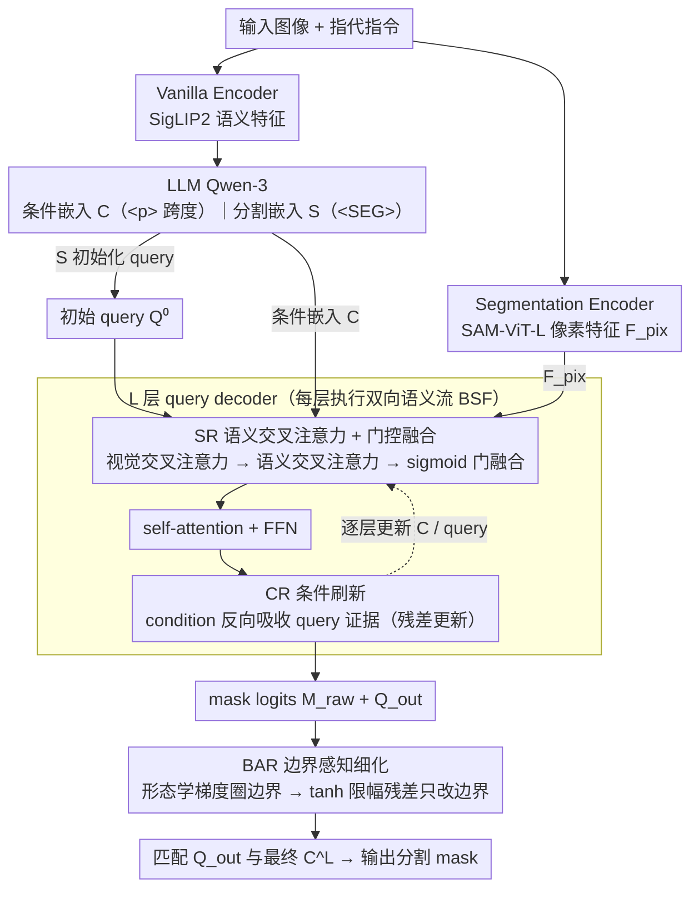

# FlowSeg: Dynamic Semantic Guidance for LLM-Conditioned Segmentation

**会议**: ICML 2026  
**arXiv**: [2605.29461](https://arxiv.org/abs/2605.29461)  
**代码**: https://zkzhang98.github.io/FlowSeg_page  
**领域**: 分割 / LLM 条件分割 / 视觉-语言对齐  
**关键词**: LLM-conditioned segmentation, 双向语义流, 指代分割, 推理分割, 边界细化

## 一句话总结
本文指出当前基于 query 的 LLM-conditioned 分割是"propose-then-select"——候选 mask 往往已经够准，错就错在选不对；为此提出 FlowSeg，让 LLM 条件嵌入在 decoder 每一层都参与 query refinement 并被新的视觉证据持续更新，再叠一个轻量边界细化模块，在 RefCOCO/+/g 和 ReasonSeg 上一致刷点。

## 研究背景与动机
**领域现状**：LLM-conditioned segmentation 把大语言模型与像素级分割解码器（SAM 风、Mask2Former 风的 query decoder）耦合，已经形成 LISA → PSALM → HyperSeg → Sa2VA → X-SAM 这条快速演进的主线。主流框架几乎都是 query-based propose-then-select：一组可学 query 经过 $L$ 层 decoder 从视觉特征解码出 candidate masks，最后用 LLM 给的条件嵌入与 query 做相似度匹配，选出最像目标的那一个。

**现有痛点**：作者系统地分析了 X-SAM 等 SOTA 在 RefCOCO/+/g 上的失败案例，发现"很多失败不是 mask 质量不够，而是匹配错了"——绝大部分错样本里至少有一个 candidate mask 已经和 GT 有高 IoU 重合，但被打分模块判得过低没选上。这种"语义错配"在含模糊属性或关系描述的指代里尤其普遍。

**核心矛盾**：当前 pipeline 里语义和视觉是浅层、单向地交互的——LLM 算出的条件嵌入要么作为 cross-attention 的固定 key/value 注入，要么完全留到匹配阶段；query 的迭代轨迹仍主要受视觉特征驱动，语言只在"末端打分"那一刻才发挥作用，且条件嵌入从头到尾都不更新，无法吸收 decoder 解出来的视觉证据。

**本文目标**：在不动 LLM-segmentor 骨架的前提下重构 decoder 内部交互——让语义从 layer 0 起就参与 mask 生成动力学，并允许条件嵌入随解码过程被新的视觉信号修正，从而把"semantic misalignment"从架构层面解决。

**切入角度**：oracle 实验给出强信号——若按 oracle 选 candidate，X-SAM 与 FlowSeg 在 RefCOCO/+/g 上的 cIoU 上界都接近 91%，几乎相同。这说明 candidate generation 已经差不多到顶，瓶颈在 selection。把 selection 问题"提前到"decoding 过程中去解，比训一个更强的事后打分器更直接。

**核心 idea**：用"双向语义流" (Bidirectional Semantic Flow, BSF) 让 condition 与 query 在每层 decoder 都互相更新，再叠一个"只动不确定边界、不动自信内部"的轻量 Boundary-Aware Refinement (BAR)。

## 方法详解

### 整体框架
FlowSeg 继承 LISA / X-SAM 那套双视觉编码 + LLM + query decoder 的标准 scaffold：(1) 一个 Vanilla Encoder（SigLIP2-so400m）抽语义特征送进 LLM，(2) 一个 Segmentation Encoder（SAM-ViT-L）抽像素特征 $\mathbf{F}_{\text{pix}}$ 给分割 decoder。LLM 用 Qwen-3，输入指令里嵌 `
...
` 标短语跨度、`<SEG>` 标分割输出位。从 LLM 隐藏态取两类向量：条件嵌入 $\mathbf{C}_{\text{LLM}}$（来自 `
` 跨度）和分割嵌入 $\mathbf{S}_{\text{LLM}}$（来自 `<SEG>` 位置），各自经投影 $\phi_{\text{llm}}$ 得到 $\mathbf{C},\mathbf{S}$。$\mathbf{S}$ 加到初始 query $\mathbf{Q}^{(0)}$ 上提供全局多模态上下文。Decoder 采用 Mask2Former 架构 + $N=200$ query，但 FlowSeg 把每层 decoder 的内部流程换成双向语义流 BSF——它由两条子流组成：SR（语言流进视觉）与 CR（视觉反过来刷新条件）；输出阶段对 mask 概率做 BAR 细化；最终用 $L$ 层后的 $\mathbf{Q}_{\text{out}}$ 与最终 $\mathbf{C}^L$ 匹配出 mask。三个贡献模块 SR / CR / BAR 即下面的三个关键设计。

### 关键设计

**1. 双向语义流之 SR（语义交叉注意力 + 自适应融合）：在每层 decoder 注入语言条件，但不抢视觉的主导权**

旧 pipeline 里语言只在末端打分时出场，query 的迭代几乎全靠视觉驱动。SR 把语言提前到每一层：先照常做视觉交叉注意力 $\mathbf{Q}_{\text{vis}}^{(l)}=\mathrm{MHA}(\mathbf{Q}^{(l-1)},\mathbf{F},\mathbf{F})$，再让它对 LLM 条件嵌入做一次语义交叉注意力 $\mathbf{Q}_{\text{sem}}^{(l)}=\mathrm{MHA}(\mathbf{Q}_{\text{vis}}^{(l)},\mathbf{C}^{(l-1)},\mathbf{C}^{(l-1)})$，两路再用一个 sigmoid 门 $\mathbf{g}^{(l)}=\sigma(\mathbf{W}_g\cdot[\mathbf{Q}_{\text{vis}}^{(l)}\|\mathbf{Q}_{\text{sem}}^{(l)}])$ 自适应融合 $\mathbf{Q}_{\text{fused}}^{(l)}=\mathbf{g}^{(l)}\odot\mathbf{Q}_{\text{vis}}^{(l)}+(1-\mathbf{g}^{(l)})\odot\mathbf{Q}_{\text{sem}}^{(l)}$，后接标准 self-attention 与 FFN。两处用心很关键：门控让浅层多用视觉、深层多用语义，正好对上「先建粗空间假设再用语言收敛」的解码节奏；语义注入放在视觉交叉注意力之后而不是之前，是为了让语言在已有空间候选的基础上去「修剪 / 否决」假设，而不是从零驱动注意力——直接拼接或硬替换两路会破坏视觉主干学到的空间先验。

**2. 双向语义流之 CR（条件刷新）：让条件嵌入也随解码被视觉证据更新**

只让语言流进视觉还不够——条件嵌入从头到尾是 LLM 给的静态向量，吸收不了 decoder 解出来的新视觉证据，而这正是「selection 错配」的根。CR 在每层结束前做一次反向交叉注意力，让 condition 反过来吸收当前 query 状态：$\mathbf{C}^{(l)}=\mathbf{C}^{(l-1)}+\mathrm{MHA}(\mathbf{C}^{(l-1)},\mathbf{Q}_{\text{s}}^{(l)},\mathbf{Q}_{\text{s}}^{(l)})$（$\mathbf{Q}_{\text{s}}^{(l)}$ 是 self-attended 之后的融合 query），残差形式保证条件不被覆盖、只在视觉确证下被增量修正。它的分量在消融里看得最清楚：仅加 SR（单向）只 +0.5%，补上 CR 闭合反馈后才跳到 +1.5%。直觉是——当候选 mask 把「红色」区域的视觉证据收齐后，condition 才能从抽象的「红色」具体成「我要的是某个红色物体的某个部位」，最终匹配自然打分更准。

**3. 边界感知细化（BAR）：全局选对之后，只动不确定的边界、不碰自信的内部**

BSF 把全局语义错配解决了，但残余错误几乎都集中在物体轮廓上。BAR 遵循「增强而非替换」原则：先用形态学梯度从 mask 概率图里圈出边界像素 $\mathbf{B}=\mathbb{I}[(\mathrm{dilate}(\mathbf{M}_{\text{prob}})-\mathrm{erode}(\mathbf{M}_{\text{prob}}))>\epsilon]$（$\epsilon=0.1$），再让一个轻量网络只在 $\mathbf{B}$ 内输出 $\tanh$ 限幅的残差 $\Delta\mathbf{M}=\tanh(f_{\text{refine}}([\mathbf{M}_{\text{raw}}\|f_{\text{comp}}(\mathbf{F}_{\text{pix}})]))\cdot\alpha$（$\alpha$ 可学），最终 $\mathbf{M}_{\text{refined}}=\mathbf{M}_{\text{raw}}+\Delta\mathbf{M}\odot\mathbf{B}$。乘上 $\mathbf{B}$ 这个 mask 把修改严格关在不确定带内——如果放开让它改任意像素，反而会破坏 decoder 已经稳定的内部预测；形态学边界提取又免训练、对模糊边界容忍。整套 BSF+BAR 只多 5.93M 参数（+0.12%）和 4.28ms 延迟（+1.39%），几乎无感。

### 训练策略
端到端三阶段：(1) segmentor 预训 36 epoch；(2) 视觉-语言对齐 1 epoch；(3) 多任务联合训 2 epoch，AdamW lr=$4\times 10^{-5}$，wd=0.05，bs=8/GPU × 8 GPU (H20)。损失为 LLM 的 next-token 损失加分割损失 $\mathcal{L}_{\text{seg}}=\mathcal{L}_{\text{CE}}+\lambda_{\text{dice}}\mathcal{L}_{\text{dice}}+\lambda_{\text{mask}}\mathcal{L}_{\text{mask}}$（$\lambda_{\text{dice}}=\lambda_{\text{mask}}=5.0$，$\lambda_{\text{cls}}=2.0$），所有 decoder 层加深监督帮助语义在层间传播。

## 实验关键数据

### 主实验

RefCOCO / RefCOCO+ / RefCOCOg 三套指代分割（cIoU）+ ReasonSeg（gIoU/cIoU），对比 LISA、PixelLM、GSVA、SAM4MLLM、PSALM、HyperSeg、Sa2VA-8B、X-SAM 等 SOTA。

| 数据集 | LISA-7B | HyperSeg | X-SAM | **FlowSeg** | vs X-SAM |
|--------|---------|----------|-------|-------------|----------|
| RefCOCO val | 74.9 | 84.8 | 85.1 | **85.8** | +0.7 |
| RefCOCO+ val | 65.1 | 79.0 | 78.0 | **80.2** | +2.2 |
| RefCOCOg val | 67.9 | 79.4 | 83.8 | **86.5** | +2.7 |
| RefCOCOg test | 70.6 | 78.9 | 83.9 | **86.1** | +2.2 |
| ReasonSeg test cIoU | 34.1 | – | 41.0 | **54.7** | +13.7 |
| ReasonSeg test gIoU | 36.8 | – | 57.8 | **60.5** | +2.7 |

ReasonSeg 上 +13.7% cIoU 的巨大跳跃印证了"需要复杂推理的指代"恰好最依赖语义在解码中的持续参与。Backbone-controlled 消融（表 4）显示，把 X-SAM 的 LLM 升级到 Qwen3 只带来边缘提升，而 FlowSeg 即使用回 X-SAM 原本的 Phi-3-3.8B 仍超过 X-SAM，证明增益来自架构而非更强 LLM。

### 消融实验

| 配置 | RefCOCO | RefCOCO+ | RefCOCOg | Avg. |
|------|---------|----------|----------|------|
| Baseline | 85.0 | 78.3 | 84.1 | 82.4 |
| + SR (semantic refinement) | 85.4 | 79.0 | 84.3 | 82.9 (+0.5) |
| + SR + CR (= 完整 BSF) | 85.6 | 79.9 | 86.2 | 83.9 (+1.5) |
| + SR + CR + BAR (Full) | **85.8** | **80.2** | **86.5** | **84.2 (+1.8)** |

### 关键发现
- 单向语义注入 (SR only) 收益较小 (+0.5%)，加上 CR 后才跳到 +1.5%——闭合反馈才是关键，单方向"语言指导视觉"远不够。
- Oracle 上界实验（表 5）：FlowSeg 与 X-SAM 的 oracle cIoU 都在 91% 左右，差距来自 selection 而非 generation，验证 motivation。
- 在 X-SAM 的失败子集 (cIoU<0.5) 上，FlowSeg 把这些 case 的平均 IoU 从 4.6 拉到 49.2（+44.6），rescue 率 44.6%；在更难的 cIoU<0.2 子集仍能 rescue +43.4，说明 BSF 主要修的就是语义错配类失败。
- BAR 单独贡献 +0.3% avg cIoU——边界细化是锦上添花，但确保它"只动边界"才不会反噬 BSF 已经稳定的内部预测。
- 仅 +5.93M 参数 / +4.28ms 延迟，工程友好。

## 亮点与洞察
- **诊断驱动的架构改造**：先用 oracle 实验明确"问题在 selection 而非 generation"，再有针对性地设计 BSF——这套"先量化瓶颈再开方"的方法论非常值得在 LLM-条件 dense prediction 任务中复用。
- **双向流 vs 单向注入**：cross-modal attention 这么多年的经验是"加一路 text-to-vision"，但本文用消融证明只有 condition 也被刷新才真正解锁性能。这给所有 query-based 多模态 decoder（detection、HOI、视频指代）一个明确改进方向。
- **enhancement-not-replacement 的边界细化**：用形态学梯度无监督地圈出"该改的地方"，再加 $\tanh$ 限幅的残差，是一种避免重训坏内部表示的稳妥范式，可以套到任何需要"局部修复"的输出头上。
- **轻量、可插**：BSF 只是把 decoder 层换内部模块，不改 LLM 也不改 visual encoder，可以无痛接到任何 Mask2Former-类 head 上。

## 局限与展望
- 评测仍局限于"单个指代表达一次"的 expression-level 协议，多目标 / 多 mask / 共指消歧场景没覆盖（X-SAM 在表 1 中正是覆盖这类的，但本文没扩展到那边的多任务设置）。
- ReasonSeg val 集太小（340 例），结果波动大，本文也明示"以 test 为准"；val 上 cIoU 反而比 X-SAM 低 (49.2 vs 32.9，方向是好的)，但 gIoU 高很多，需要更标准化的评测。
- BSF 在每层都做两次额外 attention，虽然总参数和延迟仍低，但若 query 数 $N$ 进一步加大（如视频指代分割），condition refinement 的 $O(|C|\cdot N)$ 开销值得重新评估。
- BAR 用了固定阈值 $\epsilon=0.1$ 的形态学操作，自适应阈值或者可学的边界检测器可能进一步提升复杂边界场景。
- LLM 与 decoder 之间的语义流只通过 `
` 跨度和 `<SEG>` token 一次性中转，更细的层级（如每个 token 流到不同 decoder 层）是潜在扩展。

## 相关工作与启发
- **vs LISA / HyperSeg / X-SAM**：这些工作都属于"propose-then-select" + LLM 给静态条件嵌入，FlowSeg 在不改 LLM 主干的前提下把 decoder 内部交互从单向变双向，因此可以视为对该家族的通用增益。
- **vs PSALM / Sa2VA**：这些工作主要扩展任务空间（视频、多任务），但 decoder 仍是被动接收语言；FlowSeg 的 BSF 完全正交，可以叠到它们之上。
- **vs Mask2Former / DETR 系**：传统 query decoder 完全忽视语言侧迭代，FlowSeg 等价于在 Mask2Former decoder 中增加一条"语言侧的迭代"，对 query 设计是范式补全。
- **vs cross-modal attention (e.g. PSALM 里把 text 当 KV)**：差别在"text 是不是固定 KV"——以往工作让 text 单向流入 vision；FlowSeg 让 text 也被 vision 更新，形成 co-evolution。

## 评分
- 新颖性: ⭐⭐⭐⭐ 双向流 + 边界细化都非全新概念，但组合方式和针对"semantic misalignment"的诊断–设计闭环是新的。
- 实验充分度: ⭐⭐⭐⭐ 主实验 + backbone-controlled + oracle + failure case rescue + 组件消融 + 开销分析齐全，可惜没拓展到多 mask / 视频指代。
- 写作质量: ⭐⭐⭐⭐⭐ Section 1 motivation 推得很清，Algorithm 1 把 BSF 写成 14 行伪码极易复现。
- 价值: ⭐⭐⭐⭐ ReasonSeg +13.7 cIoU 是显著进步；BSF 模块小巧可移植，给后续 LLM-条件 dense prediction 提供了通用改造思路。

<!-- RELATED:START -->

## 相关论文

- [\[CVPR 2026\] GeoGuide: Hierarchical Geometric Guidance for Open-Vocabulary 3D Semantic Segmentation](../../CVPR2026/segmentation/geoguide_hierarchical_geometric_guidance_for_open-vocabulary_3d_semantic_segment.md)
- [\[ECCV 2024\] Cs2K: Class-Specific and Class-Shared Knowledge Guidance for Incremental Semantic Segmentation](../../ECCV2024/segmentation/cs2k_class-specific_and_class-shared_knowledge_guidance_for_incremental_semantic.md)
- [\[ICCV 2025\] Enhancing Transformers Through Conditioned Embedded Tokens](../../ICCV2025/segmentation/enhancing_transformers_through_conditioned_embedded_tokens.md)
- [\[CVPR 2026\] CrackSSM: Reviving SSMs for Crack Segmentation via Dynamic Scanning](../../CVPR2026/segmentation/crackssm_reviving_ssms_for_crack_segmentation_via_dynamic_scanning.md)
- [\[CVPR 2026\] Efficient Video Object Segmentation and Tracking with Recurrent Dynamic Submodel](../../CVPR2026/segmentation/efficient_video_object_segmentation_and_tracking_with_recurrent_dynamic_submodel.md)

<!-- RELATED:END -->
