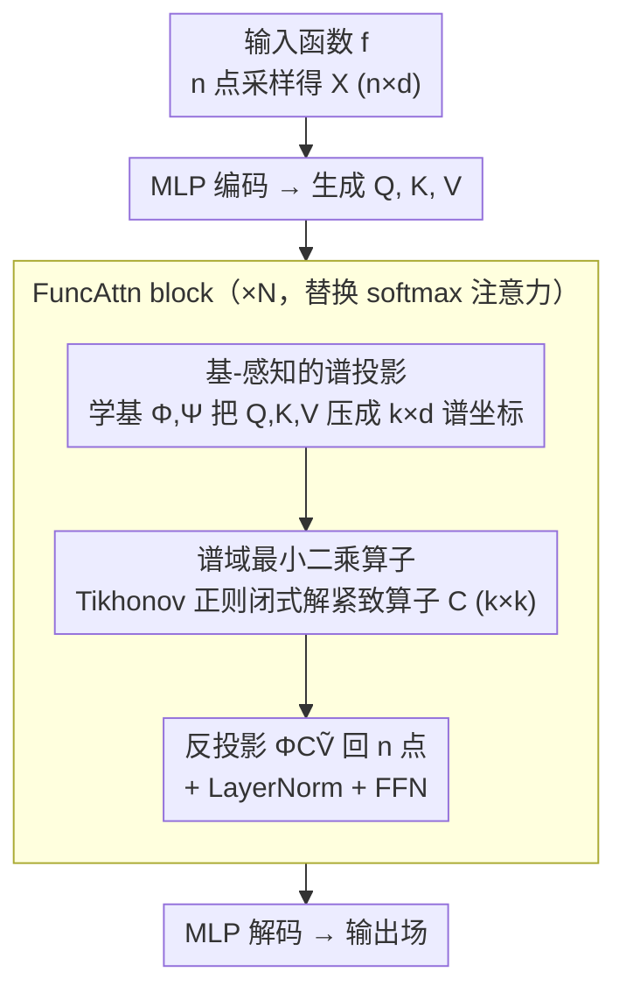

# Functional Attention: From Pairwise Affinities to Functional Correspondences

**会议**: ICML 2026  
**arXiv**: [2605.31559](https://arxiv.org/abs/2605.31559)  
**代码**: https://github.com/xjffff/FUNCATTN  
**领域**: 科学计算 / 算子学习 / 注意力机制  
**关键词**: 算子学习, 函数映射, 谱注意力, PDE 求解, 几何对应

## 一句话总结
本文把 Transformer 里的 softmax 注意力重新解释为"两个学得到的函数基之间的最小二乘线性算子"，借用形状匹配里的 functional maps 思想，把 $n\times n$ 的点对亲和矩阵压缩成 $k\times k$ 的紧致谱算子，在 PDE 求解、3D 点云分割和 OOD 推广上同时拿到 SOTA。

## 研究背景与动机
**领域现状**：算子学习关心如何在两个无穷维函数空间 $\mathcal{F},\mathcal{G}$ 之间学一个映射 $\mathcal{O}:\mathcal{F}\to\mathcal{G}$，主流方向有两类：一是 FNO/U-NO/WMT 这类把映射放进固定谱域（Fourier、Wavelet、Laplacian 特征基）里求解的方法；二是 Galerkin Transformer、OFormer、GNOT、Transolver 这类把场离散成 token 后套 attention 的方法。

**现有痛点**：固定基方法依赖网格结构，遇到非矩形域或不规则 mesh 就退化；token 化的 attention 虽然灵活，但要么是 $O(n^2)$ 的稠密亲和、要么用线性 attention 在 token 空间近似，两条路都把"函数"当成"一堆采样点"来处理，忽视了背后的全局函数结构，参数冗余且对分辨率敏感。

**核心矛盾**：注意力的真实作用是在 value 空间上诱导一个线性算子，而当前主流做法把它具体化成 $n\times n$ 的点对亲和矩阵——这层中间表征既把复杂度绑死在 token 数上，又让"函数级别上一模一样的算子"被无穷多个不同的点级亲和矩阵冗余地表达。

**本文目标**：跳过点对亲和，直接在"学得到的函数基"之间估计一个紧致的线性算子 $\mathbf{C}\in\mathbb{R}^{k\times k}$，要求它 (i) 与离散化无关 (ii) 数值稳定、可证 Lipschitz (iii) 既适配规则 PDE 也适配点云 / 不规则几何。

**切入角度**：几何处理领域 2012 年的 functional maps（Ovsjanikov 等）已经给出过一个范式——把两个 3D 形状之间的对应关系不写成 $n\times n$ 的点对匹配，而写成两个 Laplace-Beltrami 谱基之间的小尺寸线性映射，靠正则化最小二乘求解。本文把同一套思路搬到 attention 里：query 和 key-value 分别学一组自适应基，attention 就是把 $\mathbf{K}$ 推到 $\mathbf{Q}$ 谱坐标的最佳线性算子。

**核心 idea**：用 Tikhonov-regularized 最小二乘解出的 $k\times k$ 算子 $\mathbf{C}^*=\tilde{\mathbf{Q}}\tilde{\mathbf{K}}^\top(\tilde{\mathbf{K}}\tilde{\mathbf{K}}^\top+\lambda\mathbf{I}_k)^{-1}$ 替换 softmax 亲和矩阵，得到 FuncAttn。

## 方法详解

### 整体框架
FuncAttn 沿用标准 Transformer 主干：输入函数 $f$ 在 $n$ 个点上采样得到 $\mathbf{X}\in\mathbb{R}^{n\times d}$，由 MLP 编码后送入 $N$ 个 FuncAttn block，再由 MLP 解码回输出场。每个 FuncAttn block 内部把传统 $\mathrm{Softmax}(\mathbf{Q}\mathbf{K}^\top/\sqrt{d_k})\mathbf{V}$ 替换成三步流水线：(a) 用学习到的基 $\mathbf{\Phi},\mathbf{\Psi}\in\mathbb{R}^{n\times k}$ 把 $\mathbf{Q},\mathbf{K},\mathbf{V}$ 投影到谱坐标 $\tilde{\mathbf{Q}},\tilde{\mathbf{K}},\tilde{\mathbf{V}}\in\mathbb{R}^{k\times d}$；(b) 在谱空间里通过 Tikhonov 正则最小二乘解出紧致算子 $\mathbf{C}\in\mathbb{R}^{k\times k}$；(c) 用 $\mathbf{\Phi}\mathbf{C}\tilde{\mathbf{V}}$ 反投影回 $n$ 个空间点。后接 LayerNorm + FFN 与标准 Transformer 一致。由于 $\mathbf{C}$ 的尺寸 $k\times k$ 完全独立于采样点数 $n$，整条流水线在不同分辨率下都天然定义良好（关键设计 3 的分辨率不变性即由此而来）。

### 关键设计

**1. 基-感知的谱投影：把离散采样压成不依赖固定基的谱坐标**

固定的 Fourier 基要求规则网格、对几何不敏感，遇到不规则 mesh 就退化。FuncAttn 改成让 query / key-value 各自学一组基 $\mathbf{\Phi},\mathbf{\Psi}$，构造方式是 $\mathcal{B}=\mathrm{Softmax}(\mathrm{Linear}(\mathbf{X}))\in\mathbb{R}^{n\times k}$，沿 $k$ 维做 softmax；投影写成 $\tilde{\mathbf{Q}}=\mathbf{\Phi}^\dagger\mathbf{Q}$，实现时用转置 $\mathbf{\Phi}^\top$ 替伪逆换取数值稳定，把 $n\times d$ 的采样压到 $k\times d$ 的谱坐标。softmax 归一化天然保证 partition-of-unity、避免基退化；论文还给出 Proposition 4.3：温度 $\tau\to 0$ 时每个基函数退化成 $\mathbf{1}_{\Lambda_j}$，恢复有限元里的 $P_0$ 分片常数元素，普通温度下则是"学到的软分片"。Tab. 7 证实自由学到的基比"学到 + 正交约束"和"Fourier 基"都好，因为在正交群上做梯度优化比欧氏空间更难找到好的局部极小。

**2. 谱域最小二乘算子：把 $\mathbf{K}\to\mathbf{Q}$ 的传输解成一个 $k\times k$ 的紧致算子**

注意力的真实作用是在 value 空间诱导一个线性算子，但主流做法把它具体成 $n\times n$ 点对亲和，既把复杂度绑死在 token 数上、又让"函数级一样的算子"被无穷多点级矩阵冗余表达。借 functional maps 的观察——点级匹配组合复杂，到谱基里就变成可凸求解的小问题——这里直接求 $\min_\mathbf{C}\|\tilde{\mathbf{Q}}-\mathbf{C}\tilde{\mathbf{K}}\|_F^2+\lambda\|\mathbf{C}\|_F^2$，闭式解 $\mathbf{C}^*=\tilde{\mathbf{Q}}\tilde{\mathbf{K}}^\top(\tilde{\mathbf{K}}\tilde{\mathbf{K}}^\top+\lambda\mathbf{I}_k)^{-1}$，代回得到完整 attention $\mathbf{\Phi}\mathbf{C}^*\tilde{\mathbf{V}}$。和 softmax 不同，$\mathbf{C}$ 的元素可正可负，相当于隐式获得"对比性"。$k\ll n$ 的低秩既显式压复杂度、又作为隐式正则提升结构化数据泛化；Tikhonov 项 $\lambda\|\mathbf{C}\|_F^2$ 保证求逆数值稳定，Proposition 4.5 更证明整层 Lipschitz 上界是 $C_1/\lambda+C_2/\lambda^2$，从理论上把 $\lambda$ 和稳定性锁在一起。

**3. 资源开销与分辨率不变性：同一组参数跨 mesh 分辨率直接迁移**

softmax 的 $n\times n$ 矩阵把模型和分辨率绑死，但算子学习的本意应当是"学算子而不是学采样"。因为 $\mathbf{C}\in\mathbb{R}^{k\times k}$ 完全独立于 $n$、谱投影 $\mathbf{\Phi}^\top\mathbf{Q}$ 只对 $n$ 维做线性投影，整条 attention 在不同 $n$ 下都天然定义良好：训练时用粗网格（如 1D Burgers $n=2048$）、测试时换 8192 直接前向，无需 finetune。分辨率不变性因此成了架构层面的免费收益，Tab. 5 在 1D Burgers 上 zero-shot 4× 超分仍保持最低误差。

### 训练策略
和 Transolver 同设定：单卡 A40，重复 3 次。$k$ 的实际取值按数据复杂度调：光滑场 (Darcy / Pipe) 用 $k\in[32,64]$，高频场 (Elasticity / Navier-Stokes) 用 $k\in[128,256]$，论文推荐默认 $k=64$，离最优值不超过 5%。$\lambda$ 的敏感性见附录 D.3。

## 实验关键数据

### 主实验

6 个 PDE 基准（Elasticity / Airfoil / Darcy / Pipe / Navier-Stokes / Plasticity）上和频域系（FNO / WMT / U-FNO / Geo-FNO / U-NO / F-FNO / LSM）+ 注意力系（Galerkin / HT-Net / OFormer / GNOT / FactFormer / ONO / LNO / Transolver）共 14 个基线对比，相对 $L_2$ 损失 $\times 100$。

| 数据集 | Galerkin | Transolver | LNO | **Ours** | vs Transolver |
|--------|----------|------------|------|---------|----------|
| Elasticity | 2.40 | 0.64 | 0.73 | **0.50** | -21.9% |
| Airfoil | 1.18 | 0.53 | 0.54 | **0.43** | -18.9% |
| Darcy | 0.84 | 0.57 | 0.60 | **0.42** | -26.3% |
| Pipe | 0.98 | 0.31 | **0.25** | 0.29 | -6.5% |
| Navier-Stokes | 14.01 | 9.44 | 8.45 | **8.00** | -15.3% |
| Plasticity | 1.20 | 0.13 | 0.31 | **0.11** | -15.4% |

6 个数据集里 5 个 SOTA，对 Transolver 的相对提升 6%–26%。其他亮点：RNA 3D 点云分割 (xyz 输入) 89.0% 对 Transolver 87.5%、DiffusionNet 85.1%；AirfRANS OOD Reynolds 上相对升力误差 23.4% 对 Transolver 32.2%（-27%），OOD Angles 13.3% 对 22.8%（-42%）；三角缺口域 2D Darcy 相对 $L_2$ 0.64% 对专门为复杂几何设计的 WNO 0.92%。

### 消融实验

| 配置 | Elasticity | Darcy | Airfoil | 备注 |
|------|-----------|-------|---------|------|
| $k=16$ | 0.65 | 0.49 | 0.51 | 基过少表达受限 |
| $k=32$ | 0.55 | 0.45 | 0.52 | 光滑场已足够 |
| $k=64$ | **0.50** | 0.42 | 0.43 | 推荐默认值 |
| $k=128$ | 0.49 | 0.44 | **0.42** | 高频场略好 |
| $k=256$ | 0.48 | 0.43 | 0.47 | 增益变小 |
| $k=512$ | 0.56 | 0.41 | 0.48 | 开始过拟合 |
| Fourier 基 | / | / | 0.51 | 固定基次于学到 |
| Learnable + 正交 | / | / | 0.50 | 正交约束反而拖累 |
| Learnable (自由) | / | / | **0.43** | 自由学最好 |

### 关键发现
- $k$ 不是越大越好：超过某阈值后过拟合，且推理开销上升；$k=64$ 是"性能/成本"最佳折中点。
- 自由学习的基 > 加正交约束的基 > 固定 Fourier 基。作者认为正交流形上的梯度优化困难，而欧氏空间里 SGD 容易找到好局部最优。
- 即使把 FuncAttn 换成 Fourier 基也仍超过所有 baseline（Airfoil 0.51 vs Galerkin 0.65），说明优势来自"谱域 + 最小二乘算子"这套范式本身，而不是仅靠基的灵活性。
- OOD 提升幅度（27%–42%）显著大于 in-distribution（6%–26%），暗示函数级表征捕捉到的物理结构比 token 级 attention 更可迁移。

## 亮点与洞察
- **范式级重解释**：把 attention 这种被反复"压缩 / 近似"的对象，第一次系统地拉回到 functional maps 的语境下——不再把 attention 看作"近似 softmax"，而是看作"两个函数空间之间的线性算子估计问题"。这条线打开了一个新的设计空间。
- **闭式最小二乘 + 学到的基**：把 Galerkin Transformer 当年"列向量是 Hilbert 空间函数"的纸上观察落地成可执行的算法，关键缺口是显式把 $\mathbf{C}$ 当成最小二乘解算出来，而不是隐式让网络学。
- **可证稳定性**：Proposition 4.5 把整层的 Lipschitz 常数和 Tikhonov $\lambda$ 直接联系起来，使得 attention 的"温度类超参"第一次有显式数学含义。
- **签名亲和的额外能力**：解出的 $\mathbf{C}$ 元素可正可负，与 softmax 强制非负相比，提供了 RNA 分割里区分细粒度功能类别所需的对比性，这点作者归因为 3D 任务上 +1.5% 提升的来源。

## 局限与展望
- 学到的基只用了单层线性 + softmax，论文也承认这是最简单的实现；引入 attention/MLP-mixer/GNN 等结构化基有空间。
- 缺少近似误差与泛化界的形式化分析；当前 Lipschitz 仅是稳定性，没有 expressivity bound，也没把压缩比 $k/n$ 与误差挂起来。
- $\lambda$ 当前是固定超参，依赖经验和附录扫描；可考虑数据自适应 $\lambda$ 或学习曲率自相关的正则。
- NLP 等没有自然函数空间解释的领域是否能受益，是开放问题——本文 6 个数据集全是物理 / 几何场。

## 相关工作与启发
- **vs Galerkin Transformer (Cao 2021)**：Galerkin 是隐式把 $\mathbf{Q}/\mathbf{K}/\mathbf{V}$ 当 Hilbert 空间函数，但 attention 还是 $\mathbf{K}^\top\mathbf{V}$ 的内积；本文显式分离"函数"和"基"，把 attention 写成谱域最小二乘解。
- **vs Transolver (Wu 2024)**：Transolver 的 "slice-and-attend" 也学了一组分片，但在 slice token 上仍跑标准 softmax；本文用通用谱框架替换 slicing，并把 attention 本身换成 LS，在所有共同基准上更优。
- **vs FNO 家族**：FNO 把映射放进固定 Fourier 基里 FFT，受规则网格 + 周期边界假设限制；本文同样用"在谱域里参数化"的思路，但谱基是学到的、非格点 friendly，适配任意几何。
- **vs functional maps (Ovsjanikov 2012)**：本文几乎一比一把 functional maps 框架搬进 attention，但把 LB 谱基换成数据自适应基、把 shape descriptor 换成 query/key，使原本只用于离线形状匹配的工具变成可端到端训练的网络模块。

## 评分
- 新颖性: ⭐⭐⭐⭐⭐ functional maps × attention 这条跨领域桥架得很漂亮，属于"重新解释一个旧概念"的高质量工作。
- 实验充分度: ⭐⭐⭐⭐ 6 PDE + 3D 分割 + OOD + 超分 + 复杂几何 + 基选择消融都覆盖到了，缺 NLP / 图像分类的探索。
- 写作质量: ⭐⭐⭐⭐⭐ Section 3 的动机推导和 Section 4 的算法构造层次清晰，几乎没有冗余。
- 价值: ⭐⭐⭐⭐ 给科学计算和算子学习社区提供了一个新的 attention 模板，未来 PDE / 几何 / 多物理场 surrogate 都有可能基于此扩展。

<!-- RELATED:START -->

## 相关论文

- [\[ECCV 2024\] Self-supervised Co-salient Object Detection via Feature Correspondences at Multiple Scales](../../ECCV2024/segmentation/self-supervised_co-salient_object_detection_via_feature_correspondences_at_multi.md)
- [\[NeurIPS 2025\] Attention (as Discrete-Time Markov) Chains](../../NeurIPS2025/segmentation/attention_as_discrete-time_markov_chains.md)
- [\[CVPR 2026\] DeBias-CLIP: CLIP Is Shortsighted — Paying Attention Beyond the First Sentence](../../CVPR2026/segmentation/clip_shortsighted_beyond_first_sentence.md)
- [\[CVPR 2026\] MixerCSeg: An Efficient Mixer Architecture for Crack Segmentation via Decoupled Mamba Attention](../../CVPR2026/segmentation/mixercseg_an_efficient_mixer_architecture_for_crack_segmentation_via_decoupled_m.md)
- [\[NeurIPS 2025\] Interpreting ResNet-based CLIP via Neuron-Attention Decomposition](../../NeurIPS2025/segmentation/interpreting_resnet-based_clip_via_neuron-attention_decomposition.md)

<!-- RELATED:END -->
