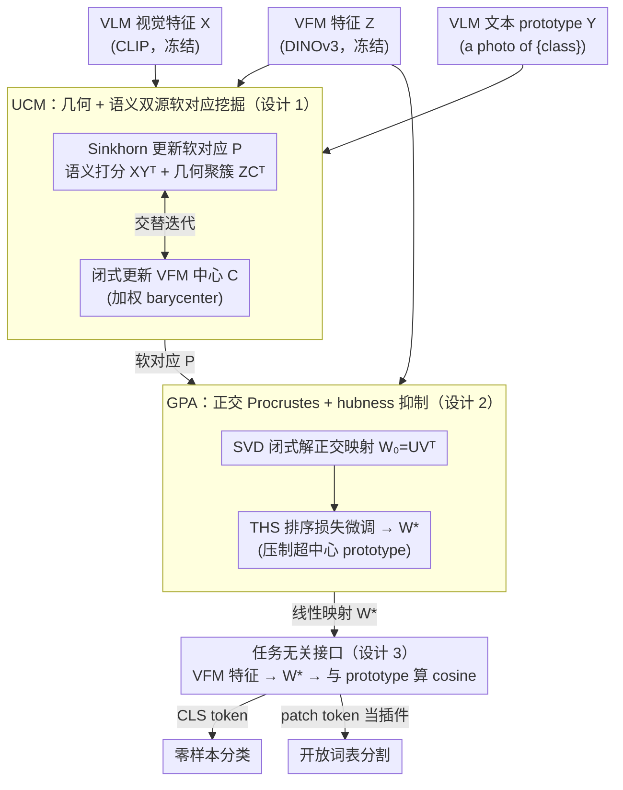

# Geometry-Preserving Unsupervised Alignment for Heterogeneous Foundation Models

**会议**: ICML 2026  
**arXiv**: [2606.04385](https://arxiv.org/abs/2606.04385)  
**代码**: https://github.com/Yuteam14/GPUA (有)  
**领域**: 自监督 / 表示学习 / 多模态对齐  
**关键词**: 视觉基础模型, VFM-VLM 融合, 跨语言对齐, 正交 Procrustes, Sinkhorn, hubness

## 一句话总结
GPUA 把 CLIP 这种语义有余而局部精度不足的 VLM 和 DINOv3 这种细粒度足但缺语义的 VFM 看作两种"视觉语言"，用最优传输挖软对应再解正交 Procrustes 学一个保几何的线性映射，把 VFM 翻译进 VLM 空间——全程无监督、不更新任何预训练参数，零样本分类平均涨 11.8%。

## 研究背景与动机
**领域现状**：计算机视觉的两大基础模型阵营各有所长：CLIP 等 **VLM** 借大规模图文对比预训练，给出语言对齐的语义空间，天然支持开放词表识别；DINOv3 等 **VFM** 走自监督路线，patch-level 特征结构清晰、局部判别力强，但完全没有语言锚点。把两者一起用是社区的共识方向，最典型的就是开放词表分割管线里把 CLIP 的语义和 DINO 的细粒度对接。

**现有痛点**：现有融合方案普遍有两个硬伤：(1) **依赖深度访问**——要么提中间层 feature，要么发 dense mask query，对闭源模型、API、受限部署完全行不通；(2) **任务/结构耦合**——融合机制都是围绕 pixel-level 预测、mask 生成、空间后处理设计的，没法迁到 image-level 的 zero-shot 分类这种"全局语义决策"任务上。

**核心矛盾**：要让异构基础模型"在表征层就直接兼容"，就必须找到一种**任务无关、只看 feature、不动参数**的对齐机制。但跨模型的表征空间维度不同、尺度不同、几何不同，常规的 alignment 要么靠监督学一个 projection，要么走 alternating optimization，对初始化高度敏感、很容易塌到 trivial 解。

**本文目标**：(1) 找到一种"把 VFM feature 翻译到 VLM 语义空间"的形式化定义；(2) 在完全无监督、不动参数的前提下解出这个映射；(3) 抑制 VLM 空间常见的 modality gap 和 hubness 问题，让翻译后的特征真能用于 zero-shot 分类和分割。

**切入角度**：作者把这个问题类比成 NLP 里的**跨语言词嵌入对齐**——不同语言的词向量空间靠**正交 Procrustes** 解一个保几何的线性映射就能对齐 (Lample et al., 2018; Artetxe et al., 2018)，"isomorphism hypothesis"已经被验证。视觉里 VFM 特征就是"视觉语言"的 word vector，VLM 文本端则提供"目标语言词典"——只要能挖出可靠的"伪词典"对应，就能直接 SVD 出最优映射。

**核心 idea**：把 VFM-VLM 对齐拆成两段：先用 **Sinkhorn 风格的最优传输**在 VLM 语义结构和 VFM 几何结构双重约束下挖软对应矩阵 $P$，再把 $P$ 喂进正交 Procrustes 解出闭式映射 $W$，最后用一个 hubness-aware 排序损失微调 $W$ 去掉超中心 prototype。

## 方法详解

### 整体框架
输入：VFM 视觉特征 $Z\in\mathbb{R}^{N\times d_v}$、VLM 视觉特征 $X\in\mathbb{R}^{N\times d_t}$、VLM 文本 prototype $Y\in\mathbb{R}^{K\times d_t}$（"a photo of {class}"等 prompt 经文本编码器得到，$K$ 是类别数）。

阶段一（**UCM**, Unsupervised Correspondence Mining）：交替更新软对应矩阵 $P\in\mathbb{R}^{N\times K}_+$ 和潜在 VFM 中心 $C\in\mathbb{R}^{K\times d_v}$，让 $P$ 同时反映"VLM 语义打分"和"VFM 几何聚簇"，用 Sinkhorn 解熵正则化的传输问题。

阶段二（**GPA**, Geometry-Preserving Alignment）：用阶段一吐出的 $P$ 通过 SVD 闭式解一个正交映射 $W_0=UV^\top$，使 $Z W$ 尽量贴近 prototype 混合 $PY$；再用 topology-aware hubness suppression 损失 $\mathcal{L}_{\text{THS}}$ 微调 $W_0$ 得到 $W^*$。

推理：图像 $\to$ VFM 出 CLS / patch token $\to$ 应用 $W^*$ 映射到 VLM 语义空间 $\to$ 和文本 prototype 算 cosine 出分类 / 分割结果。**预训练 VFM 和 VLM 都保持冻结，整个管线只学一个轻量的线性变换**。

### 关键设计

**1. UCM：几何 + 语义双源软对应挖掘**

要给正交 Procrustes 喂一本「伪字典」，就得在无标签下挖出「VFM 样本 → VLM 文本 prototype」的可靠软指派 $P$。作者先点破一个隐患：只在 VLM 空间里把每张图指派到最近文本 prototype（$\min_P \|X-PY\|_F^2$）等价于「以文本为固定中心的 K-means assignment 步」，在 domain shift 下噪声极大。于是引入 VFM 端的潜在中心 $C$ 和 $P$ 共享：$\min_{P,C} (1-\lambda)\|Z-PC\|_F^2 + \lambda\|X-PY\|_F^2$，几何聚簇和语义指派被同一个 $P$ 锁在一起、必须同时成立。把 $P$ 松弛到带行/列边际约束的非负矩阵 $\Pi(r,c)$ 并加熵正则 $-\varepsilon H(P)$ 后，$P$ 子问题变成 $\max_{P\in\Pi(r,c)}\langle P,(1-\lambda)ZC^\top+\lambda XY^\top\rangle+\varepsilon H(P)$，Sinkhorn-Knopp 几次迭代直接出解；$C$ 子问题是封闭式 barycenter $C_k=\sum_i P_{ik}Z_i / \sum_i P_{ik}$。这样设计有三重好处：VLM 给「是哪个类」的语义先验、VFM 给「哪些样本该同簇」的几何先验，两者互补；Sinkhorn 的稠密软指派不像硬指派那样在边界样本上震荡；更重要的是它先把 $P$ 完全求好再单独求 $W$，彻底解耦掉经典 alternating optimization 对初始化的高度敏感。

**2. GPA：正交 Procrustes + 拓扑感知的 hubness 抑制**

拿到 $P$ 后要学一个「保几何」的从 VFM 到 VLM 的线性翻译 $W$。以 $P$ 为软词典求 $\min_W \|ZW - PY\|_F^2$ s.t. $W^\top W=I$ 正是经典正交 Procrustes，闭式解 $W_0=UV^\top$，其中 $U\Sigma V^\top=\text{SVD}(Z^\top PY)$；正交约束保证 $W$ 近似等距、不塌缩不剪切，VFM 的邻域几何被完整搬进 VLM 空间。但 VLM 空间天然有 hubness——少数 prototype 当了大量样本的最近邻，扭曲局部判别力。于是在 $W_0$ 基础上再跑几步梯度优化一个拓扑感知排序损失 $\mathcal{L}_{\text{THS}}=\frac{1}{NK}\sum_i\sum_{c\in\mathcal{N}_i^K}(d_i^++m_{i,c}^{\text{base}}+h_c-d_{i,c})_+$，其中 $d_i^+$ 是样本到正确 prototype 的距离、$d_{i,c}$ 到第 $c$ 个竞争 prototype 的距离、$m_{i,c}^{\text{base}}=(1-y_{\ell_i}^\top y_c)/s$ 是语义 margin、$h_c=\frac{1}{N}\sum_i \mathbb{I}(c\in\mathcal{N}_i^K)$ 是 hubness penalty——某个 prototype 越频繁当邻居，就要求样本和它拉得越开。正交闭式解给了一个高质量起点（整篇方法稳定性的核心），hubness loss 再去掉正交映射后仍存在的超中心 prototype，而用 $K$ 近邻 + ranking 形式也比直接降一个 hubness 标量信号更稠密。

**3. 任务无关接口：feature-level 即插即用**

同一套对齐框架要同时服务 image-level 的零样本分类和 patch-level 的开放词表分割。零样本分类直接拿 VFM 的 CLS token 走完整 UCM+GPA，推理时把 $W^*$ 应用到全局 feature、和文本 prototype 算 cosine；开放词表分割则在 patch level 跑——把 DINOv3 patch feature 翻译到 MaskCLIP/SCLIP/SC-CLIP 的语义空间，当这些现成分割框架的插件，不改它们的 head/loss/训练。所以同一个 GPUA 既能补 VLM 全局表征的判别力、又能补 patch 级分割的细粒度边界。它对部署的唯一要求只是「能取到 feature」——闭源模型、API、受限部署都能用，alignment 和 task head 完全解耦、与任意下游框架正交可叠加。

### 损失函数 / 训练策略
$\mathcal{L}=\underbrace{(1-\lambda)\|Z-PC\|_F^2+\lambda\|X-PY\|_F^2-\varepsilon H(P)}_{\text{Stage 1: UCM}}+\underbrace{\|ZW-PY\|_F^2 \text{ s.t. } W^\top W=I + \eta\mathcal{L}_{\text{THS}}}_{\text{Stage 2: GPA}}$。Stage 1 通过 Sinkhorn 和封闭式 barycenter 交替；Stage 2 先 SVD 出 $W_0$，再用小学习率几步梯度修一下。GPUA 用全训练集；GPUA* 仅每类 16 样本。

## 实验关键数据

### 主实验
零样本图像分类（11 个数据集，CLIP protocol，DINOv3 作 VFM）：

| 方法 | Flowers | Pets | Caltech | FGVC | EuroSAT | UCF101 | DTD | Food | Cars | SUN | ImageNet | Avg |
|------|---------|------|---------|------|---------|--------|-----|------|------|-----|----------|-----|
| CLIP | 70.7 | 89.1 | 93.2 | 24.7 | 48.3 | 67.5 | 43.5 | 85.9 | 65.6 | 62.5 | 66.6 | 65.2 |
| ZLaP | 73.5 | 87.1 | 93.1 | 25.4 | 55.6 | 71.5 | 48.6 | 86.9 | 65.6 | 67.4 | 70.0 | 67.7 |
| DPE | 75.1 | 91.1 | 94.8 | 29.0 | 55.8 | 70.4 | 54.2 | 86.2 | 67.3 | 70.1 | 71.9 | 69.6 |
| StatA | 75.2 | 92.4 | 94.2 | 24.7 | 67.3 | 73.5 | 48.4 | 87.1 | 68.0 | 68.7 | 69.9 | 69.9 |
| COSMIC | 82.1 | 94.2 | 96.8 | 31.4 | 58.8 | 76.2 | 58.2 | 86.6 | 71.3 | 72.3 | 78.2 | 73.3 |
| GPUA* (16-shot) | 86.6 | 94.5 | 98.1 | 34.7 | **80.3** | 78.4 | 56.7 | 87.9 | 77.4 | 72.6 | 74.3 | 76.5 |
| **GPUA (full)** | **83.8** | **95.0** | **95.3** | **33.8** | **88.2** | **80.4** | **58.5** | **89.5** | **77.7** | **74.2** | **75.4** | **77.4** |
| Δ vs CLIP | +14.0 | +6.0 | +3.8 | +5.5 | **+34.9** | +13.2 | +14.7 | +3.0 | +11.7 | +11.7 | +10.5 | **+11.8** |

GPUA 平均涨 11.8 个点；EuroSAT（遥感）和 Flowers（细粒度）等 VLM 弱项数据集涨幅最猛（+34.9 / +14.0），说明 **VFM 的几何细节真正补进了 VLM 的语义空间**。GPUA* 仅 16-shot 也比所有 baseline 高，数据效率优秀。

开放词表语义分割（mIoU，CLIP→MaskCLIP/SCLIP/SC-CLIP 上当插件）：

| 框架 | ADE20K | VOC20 | C59 |
|------|--------|-------|-----|
| CLIP (raw) | 3.1 | 49.1 | 11.1 |
| MaskCLIP | 11.9 | - | - |
| **+ GPUA** | 全面提升（详见原文 Table 2） | | |

### 消融实验
| 配置 | 关键发现 | 说明 |
|------|---------|------|
| Full GPUA | 完整版 | UCM + GPA + THS |
| w/o VFM 项（$\lambda=1$，纯 VLM 指派） | 退化到 LFA 风格 | 验证几何先验必要性 |
| w/o VLM 项（$\lambda=0$，纯 VFM 聚簇） | 失去语义对齐 | 验证语义先验必要性 |
| 直接 SVD 不加 THS | hubness 严重，几个超中心 prototype 拉走大量样本 | $\mathcal{L}_{\text{THS}}$ 有效 |
| w/o 正交约束（一般线性映射） | 训练塌缩 / 几何崩坏 | 正交约束保几何 |
| 替换 VFM（DINOv2 / DINOv3） | DINOv3 更强 | VFM 越强，alignment 收益越大 |
| 替换 VLM 框架 (MaskCLIP / SCLIP / SC-CLIP) | 一致涨 mIoU | 框架无关性 |

### 关键发现
- VFM 端的几何信号（$Z-PC$ 项）是关键；只用 VLM 自打分挖对应在 domain shift 下会噪声爆表。
- 正交约束是稳定性的来源——没有它整个 SVD 路径就退化成普通最小二乘，过拟合到伪标签噪声。
- t-SNE 可视化（Pets 数据集）显示：CLIP 原始空间存在明显 modality gap，GPUA 后视觉簇被精准拉到对应语义 anchor 上、类内结构保留。

## 亮点与洞察
- **跨语言对齐 → 跨模型对齐**的类比非常漂亮：把"VFM feature 视为视觉语言"是一个简洁有力的归纳偏置，让一票 NLP 里成熟的正交 Procrustes / Sinkhorn / hubness loss 工具都能直接搬过来，节省大量重发明。
- **两阶段（先 $P$ 后 $W$）解耦** vs 经典 alternating——大多数无监督对齐工作（LFA、MUSE 风格）都是 P/W 交替，对初始化高度敏感；本文先把 $P$ 解到位再单独求 $W$，是稳定性上的实用工程升级，值得在类似"软对应 + 线性映射"的问题里复用。
- **任务无关、参数不动、只学一个矩阵** 三点组合让 GPUA 几乎是"零成本插件"——闭源 API（CLIP / 商业 VLM）也能用，只要能取 feature 就行；这在工业落地里比"端到端微调 1B 模型"实用得多。
- **THS 损失里把 hubness 频率 $h_c$ 直接写进 margin** 这个 trick 简单粗暴但有效，可以推广到任何 prototype-based 分类（few-shot / metric learning）。

## 局限与展望
- 整个推理依赖一个**单一线性映射** $W$——对极度非线性的模态差异（比如 LLM 文本端 vs 视觉端）可能不够；但作者证明对 CLIP/DINO 这个组合够用。
- UCM 当前用 ImageNet 等数据集做"训练池"（实际是无标签 calibration set），并未真正完全 zero-shot——需要从对应数据集采样无标签图。这相对纯 CLIP zero-shot 多了一步 calibration 成本。
- 正交约束意味着 $d_v$ 和 $d_t$ 不等时只能用截断 / 投影，对超高维 VFM (e.g., 4096维 DINOv3) 在低维 VLM 文本端会有信息损失。
- 实验主体集中在 CLIP+DINOv3 组合，对 SigLIP / EVA / SAM-style 这些异构能扩展到什么程度还需更多验证。
- 论文未与最近的"用 LoRA / Linear Probing 微调 CLIP"系列做端到端比较，公平性论证略浅。

## 相关工作与启发
- **vs LFA / Ouali et al. 2023**：LFA 也用了无监督跨语言对齐的思想 ($\min_{P,W}\|XW-PY\|_F^2$)，但 P/W 交替优化；本文换成 UCM 解 $P$ + GPA 解 $W$ 两阶段，并在 UCM 里同时引入 VFM 几何先验，更稳定、收益更高。
- **vs 多模型融合分割管线** (MaskCLIP / SCLIP / SC-CLIP / Wysoczanska 2024)：那些方法把 VFM 当 patch refiner 嵌进分割流水线，深耦合于分割任务；GPUA 是任务无关的 feature-level 翻译器，可以作为这些框架的插件。
- **vs Cross-lingual word embedding 对齐** (Lample et al., 2018; Artetxe et al., 2018)：直接照搬 NLP 的"orthogonal Procrustes + adversarial / Sinkhorn 配对"框架到视觉跨模型，核心创新是把 VFM 端结构信息显式拉进 correspondence mining。
- **vs Test-time adaptation** (TDA / DPE / StatA)：那些方法在测试时调 CLIP 的内部表示；GPUA 完全不动 CLIP，只在外面接一个 $W$，部署更轻。

<!-- RELATED:START -->

## 相关论文

- [\[CVPR 2026\] GKD: Generalizable Knowledge Distillation from Vision Foundation Models for Semantic Segmentation](../../CVPR2026/segmentation/gkd_generalizable_knowledge_distillation_vfm.md)
- [\[CVPR 2026\] From 2D Alignment to 3D Plausibility: Unifying Heterogeneous 2D Priors and Penetration-Free Diffusion for Occlusion-Robust Two-Hand Reconstruction](../../CVPR2026/segmentation/from_2d_alignment_to_3d_plausibility_unifying_heterogeneous_2d_priors_and_penetr.md)
- [\[CVPR 2026\] Unsupervised Multi-Scale Segmentation of 3D Subcellular World with Stable Diffusion Foundation Model](../../CVPR2026/segmentation/unsupervised_multi-scale_segmentation_of_3d_subcellular_world_with_stable_diffus.md)
- [\[CVPR 2026\] Metric-Guided Feature Fusion of Visual Foundation Models for Segmentation Tasks](../../CVPR2026/segmentation/metric-guided_feature_fusion_of_visual_foundation_models_for_segmentation_tasks.md)
- [\[CVPR 2025\] Uni4D: Unifying Visual Foundation Models for 4D Modeling from a Single Video](../../CVPR2025/segmentation/uni4d_unifying_visual_foundation_models_for_4d_modeling_from_a_single_video.md)

<!-- RELATED:END -->
