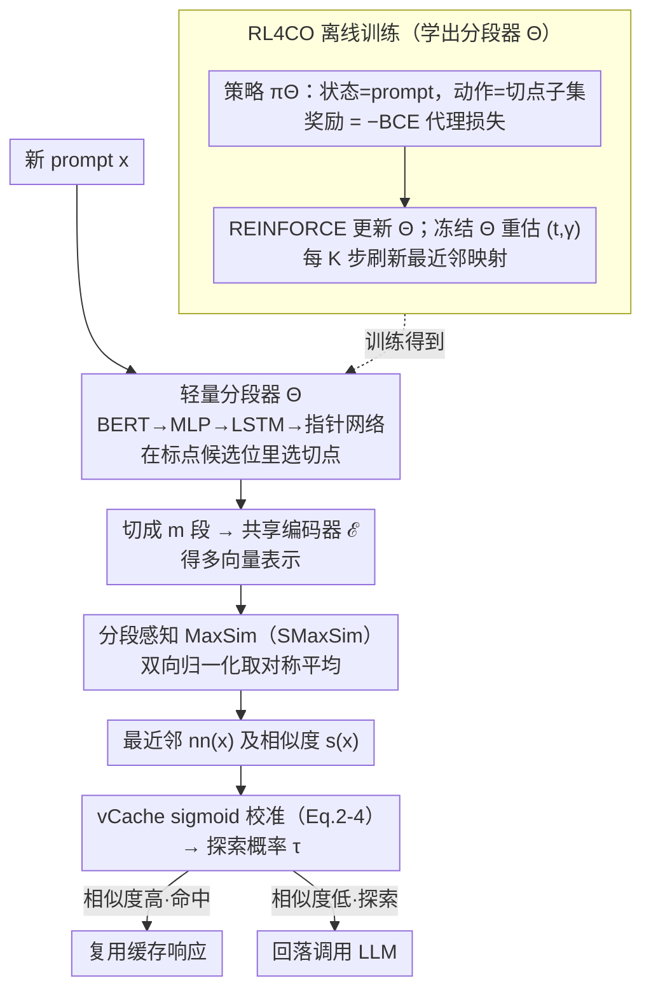

# MVR-cache: Optimizing Semantic Caching via Multi-Vector Retrieval and Learned Prompt Segmentation

**会议**: ICML 2026  
**arXiv**: [2605.24914](https://arxiv.org/abs/2605.24914)  
**代码**: https://github.com/PKU-SDS-lab/MVR-Cache (有)  
**领域**: LLM效率 / 语义缓存 / 多向量检索  
**关键词**: 语义缓存, Multi-Vector Retrieval, MaxSim, 提示分段, 强化学习, vCache

## 一句话总结
MVR-cache 把 LLM 语义缓存的相似度度量从"单向量 cosine"升级为"可学习分段后的多向量 MaxSim"，并用 REINFORCE 训练一个轻量分段模型，在保证错误率上界 $\delta$ 不变的前提下把缓存命中率最多再抬 37%。

## 研究背景与动机
**领域现状**：LLM 推理又贵又慢，语义缓存（semantic cache）是降本的主流手段——把历史 prompt 嵌入到向量空间，新 prompt 只要和某条历史 prompt"足够像"就直接复用其响应。Azure / LiteLLM / GPTCache 等生产系统都在用，最新的 vCache (Schroeder et al., 2025) 还能为每条 prompt 学一个自适应阈值，从而对最终错误率给出 $1-\delta$ 的理论保证。

**现有痛点**：所有这些方法的"相似度"几乎一律是 **整 prompt 的 cosine**。对于稍复杂一些的 prompt，单一全局向量根本捕捉不到决定 LLM 响应是否一致的那个**关键子片段**。论文 Figure 1 给的反例非常直观：一条正面影评 $x$ 和另一条负面影评 $x_1$ 在共享"crime drama"等显著关键词的情况下 cosine 极高，但因为情感极性相反、LLM 响应完全不一致，被错误判定为命中后会直接污染输出。

**核心矛盾**：cache 是否应命中，本质上由"两条 prompt 是否会得到等价 LLM 响应"决定，这种等价往往依赖**局部段落的精细匹配**；而单向量 cosine 把整段语义压扁成一个点，**精细差异被平均掉**。于是要么提阈值——命中率掉到不可用；要么放阈值——错误率撞破 $\delta$ 上限。

**本文目标**：在不改 vCache 的"自适应阈值 + 错误率证书"框架前提下，把相似度度量换成更细粒度的版本，目标是**同等 $\delta$ 下显著提命中率**。子问题拆成三块：(1) 用什么相似度结构；(2) 如何把它和 vCache 的 sigmoid 校准 / 阈值学习无缝接上；(3) 如何端到端学一个**轻量、变长输出**的分段模型而不破坏在线推理延迟。

**切入角度**：信息检索（IR）社区早有结论——把 query/doc 拆成多个向量再做 MaxSim（ColBERT），比单向量 cosine 检索准。但 IR 里的分段粒度（token-level）拿到 caching 里既低效又次优，最近的 POQD 用 LLM 来分段又把推理延迟拉爆。作者的观察是：分段策略本身可以**直接以"缓存命中率（在 $\delta$ 约束下）"为奖励学出来**，而不是套用 IR 里的现成切分。

**核心 idea**：训练一个 BERT+LSTM+Pointer Network 的轻量分段器 $\Theta$，输入 prompt 输出一组分段位置；用分段后的多向量 MaxSim 替换 vCache 内部的相似度；通过理论上等价于"最大化命中率"的代理 BCE 损失 + REINFORCE 解决"组合 + 不可微"的训练难题。

## 方法详解

### 整体框架
在线路径：新 prompt $x$ 进来 → 分段模型 $\Theta$ 在候选切分位置（标点）里挑出若干切分点，把 $x$ 切成 $m$ 个 segment → 共享 encoder $\mathcal{E}$ 把每段嵌成一个向量，得到多向量表示 → 与缓存中每条 prompt 计算**对称化 segmentation-aware MaxSim**（SMaxSim）→ 取最近邻 $nn_\Theta(x)$ 及其分数 $s_\Theta(x)$ → 喂给 vCache 的 sigmoid 校准模块 (Eq. 2-4) 得到探索概率 $\tau$ → 决定复用缓存响应还是回落到 LLM。

离线训练路径：把分段模型当成一个 RL4CO 的策略 $\pi_\Theta$，状态是 prompt，动作是"切分点子集"，奖励是用当前分段算出的"相似度对齐 BCE 损失"的负值；用 REINFORCE 优化期望奖励，期间周期性刷新最近邻映射。

### 关键设计

**1. 轻量变长 Pointer-Network 分段器 $\Theta$：在线把 prompt 切成可变数量的语义片段**

决定缓存能否命中的，往往是 prompt 里某个关键子片段是否对得上，而不是整段语义的平均——单向量 cosine 把整段压成一个点，正面影评和负面影评只要共享"crime drama"就能 cosine 极高、被错判命中。要做这种细粒度匹配，第一步得把 prompt 切成语义片段，而切法直接决定后续多向量表示的质量。IR 里的 token-level 切分拿到 caching 里既低效又次优，用 LLM 来分段（POQD）又把在线延迟拉爆。$\Theta$ 把候选切分位置限制在标点 $\mathcal{P}_x$ 上、只在这个受限集合里选子集——既不至于切太碎、又保证切点落在自然语义边界。架构是 BERT encoder $\Theta_1$ 出 token 嵌入 → MLP $\Theta_2$ → 单层 LSTM $\Theta_3$ 出上下文向量 $d_1$ → Pointer-Network 注意力 $\Theta_4$ 算 $u_{1j}=v^\top\tanh(W_1 h_j + W_2 d_1)$，用 mask $\mathbf{I}(j\in\mathcal{P}_x)$ 把非候选位置概率清零；选出第一个切点后用 $d_1'$ 反馈给 LSTM 得 $d_2$ 再选下一个，掩掉已选位置，直到吐出 `<stop>`。Pointer Network 天然处理"输出长度依赖输入"的设定，正好匹配"每条 prompt 切几段都不一样"；整个模型仅 500-600 MB GPU 内存、相对 LLM 几乎可忽略，在线延迟主要还是花在 LLM 调用而非分段上。

**2. 分段感知 MaxSim (SMaxSim)：用对称多向量匹配替换整 prompt 的 cosine**

拿到每段的向量后，怎么把两条 prompt 的多向量比成一个分数？最直接的是 ColBERT 的多向量 MaxSim，但它不对称：$\text{MaxSim}(x,x_j)$ 只保证 $x$ 的每段在 $x_j$ 里找到匹配、反方向不一定，会出现"短 prompt 寄生在长 prompt 上"的假阳性。SMaxSim 做两件事补上：计算双向 MaxSim 并按 segment 数归一化，再取对称平均 $\text{SMaxSim}_\Theta(x_i,x_j)=0.5\cdot[\tfrac{1}{|x_i|}\text{MaxSim}(x_i,x_j)+\tfrac{1}{|x_j|}\text{MaxSim}(x_j,x_i)]$。然后 $s_\Theta(x)=\text{SMaxSim}_\Theta(x,nn_\Theta(x))$ 直接喂入 vCache 的 sigmoid 校准式 $\Pr(c=1\mid s)=1/(1+e^{-\gamma(s-t)})$，校准参数 $(t,\gamma)$ 用 MLE 估、置信区间求保守的 $\tau$。这样既保留多向量"精细局部匹配"的优势、又用对称化补上"互相都得对得上"的语义要求，尺度无关化让长短 prompt 可比，而且接口完全不变——vCache 的 $1-\delta$ 错误率证书自动继承、不用重证。

**3. 以"命中率"为目标的 RL4CO 训练：让分段策略直接最大化 $\delta$ 约束下的命中率**

分段策略要学到的切分得直接服务下游目标，而不是一些和命中率脱节的启发式。论文先给出等价定理（Thm 3.3，假设 $\Pr(s\mid c)\sim\mathcal{N}(\mu_c,\sigma^2)$ 且类别平衡）：最小化 BCE 代理损失 $\sum \ell_{\mathrm{BCE}}(\mathcal{L}(\text{SMaxSim}_\Theta(x_i,x_j);t_i,\gamma_i),c_j)$ 严格等价于最大化 vCache 命中率（类别不平衡时用 Lemma 3.4 的类重平衡版）。但 $\Theta$ 输出是离散切点集合、既组合爆炸又不可微，于是把分段视为策略 $\pi_\Theta(\vec{p}\mid x)$，reward 取 BCE 的负数，用 REINFORCE 优化 $\max_\Theta \mathbb{E}_{\vec{p_{x_i}},\vec{p_{x_j}}\sim\pi_\Theta}[\text{Reward}]$，每步内部 freeze $\Theta$ 重新 MLE 出对应 $(t_i,\gamma_i)$，最近邻映射 $nn_\Theta(\cdot)$ 每 $K$ 步刷新一次摊薄开销。直接拿命中率做奖励无法回传梯度，BCE 代理既有理论保证、又给出稠密 reward signal，REINFORCE + 周期性最近邻刷新把"组合优化 + 全局耦合"在工程上跑得起来。

### 损失函数 / 训练策略
代理目标是 $\sum_i\sum_{nn_\Theta(x_j)=x_i}\ell_{\mathrm{BCE}}(\mathcal{L}(\text{SMaxSim}_\Theta(x_i,x_j);t_i,\gamma_i),c_j)$，其中 $c_j$ 是"$x_j$ 与其当前最近邻 $x_i$ 的 LLM 响应是否完全相同"的二值标签，通过 exact string match 得到。每数据集只用 **3K** 训练样本，足以训出一个 segmentation model。

## 实验关键数据

### 主实验
四个数据集：**SemCacheClassification (45K)**、**SemCacheSearchQueries (150K)**、**PromptBench (38K，含 SQUAD-V2 perturbation)**、**QNLI (29K)**；embedding 用 BGE，LLM 用 GPT-4o-mini；默认 $\delta=0.01$；两种插入协议：cache-on-miss only 和 always-cache。基线：vCache、ColBert 接 vCache、POQD 接 vCache。

| 数据集 | 协议 | MVR-cache 命中率提升 vs vCache | 错误率 |
|--------|------|-------------------------------|--------|
| SemCacheSearchQueries | always-cache | **+37%** (最高增益) | $<\delta=0.01$ |
| SemCacheClassification | cache-on-miss | +9% (≈ 节约 4.1K 次 GPT-4 调用) | $<\delta$ |
| PromptBench | cache-on-miss | 累积命中率明显领先所有基线 | $<\delta$ |
| QNLI | cache-on-miss | 显著高于基线 | $<\delta$ |

端到端延迟（Table 1，分钟，括号内为不含 LLM 调用的算法开销）：

| 方法 | SemCacheClassification | SemCacheSearchQueries | PromptBench | QNLI |
|------|------------------------|-----------------------|-------------|------|
| vCache | 408.49 (23.21) | 6361.52 (69.77) | 1870.57 (19.58) | 1536.00 (14.10) |
| ColBert | 501.46 (25.84) | 6521.89 (130.00) | 2294.38 (150.32) | 1626.37 (39.28) |
| POQD | 971.51 (492.92) | 6990.08 (628.33) | 2945.20 (959.60) | 2648.80 (1048.48) |
| **MVR-cache** | **383.32 (34.14)** | **6345.61 (111.26)** | **1866.58 (27.49)** | **1504.43 (17.62)** |

MVR-cache 的"算法侧"开销比 vCache 多十几秒，但因为命中率更高省下了 LLM 调用，端到端反而更快（最多 6% 总延迟下降）；POQD 因为要 LLM 做分段，纯算法开销甚至超过 LLM 本身。

### 消融实验
| 配置 | 关键发现 | 说明 |
|------|---------|------|
| MVR-cache (full) | 命中率最高 | 含分段模型 + SMaxSim + RL 训练 |
| w/ ColBERT token-level 分段 | 落后 MVR-cache 一截 | 证明"学出来的语义分段" > "token-level" |
| w/ POQD LLM 分段 | 命中率接近但延迟爆炸 | 在线时延不可接受 |
| 单向 MaxSim（不对称） | 假阳性增多 | 验证 SMaxSim 双向归一化的必要性 |
| 训练集 3K → 更大 | 提升微乎其微 | 3K 标注足够 |
| 弱监督（GPT-4o-mini 当代理标注，confidence 低才回 GPT-4） | 在 SemCacheClassification 上省 **80.4%** GPT-4 调用，proxy-labeled 样本上 **97.1%** 一致率 | 训练标注成本可大幅压缩 |
| PromptBench 训 → QNLI 测（跨分布） | 仍然好过所有基线 | 分段器有跨数据集泛化能力 |

### 关键发现
- 分段粒度才是 MVR 在 caching 上的决定因素：token-level 太碎、整 prompt 太粗、LLM 分段太慢——可学习的语义级标点分段是甜点。
- vCache 的"自适应阈值 + 错误率证书"框架是即插即用的容器：只要把里面的相似度 $s$ 升级，误差保证自动跟着升级。
- 训练数据需求极少（3K），加上弱监督方案，落地时一次性人力成本很低，被随后省下的 LLM 调用费用迅速回本。

## 亮点与洞察
- **把"命中率最大化"转写成"BCE 最小化"的等价定理**，是连接 RL reward 和最终系统指标的关键桥梁——这种"理论代理损失 + RL 反传"的写法在很多"指标不可微"的系统优化场景都能复用（如缓存淘汰策略、调度策略）。
- **Pointer Network + mask 到候选位置**是处理"在受限语义边界内做可变长度选择"的极简方案，比 BIO 标注或 token 二分类更贴合"分段"任务的归纳偏置。
- **对称归一化 MaxSim** 这一笔很轻——只是加一项除以 segment 数、做平均——但解决了 MVR 直接搬到 caching 时最致命的"长短 prompt 假命中"问题；在所有用到 MaxSim 的下游任务（不只是 caching）里都值得抄。

## 局限与展望
- 分段位置只在标点边界采样，对中文、代码、长无标点指令这类场景可能不够灵活，需要更通用的候选边界生成器（如 sentence-piece / chunk-level）。
- 训练阶段仍然依赖"两条 prompt 的 LLM 响应是否 exact string match"作为监督——对 open-ended generation 这种响应高度多样的任务，标签噪声会很大，需要更鲁棒的等价性判定（embedding 相似度或 LLM-as-judge）。
- 缓存增长后周期性刷新最近邻 ($K$ 步一次) 的开销会随 cache 规模增大，未来需要 incremental nearest-neighbor 维护。
- 文中的理论保证依赖 $\Pr(s\mid c)$ 是高斯的假设，论文只用 Appendix 实证 justify，理论上对极端非高斯分布是否仍单调是开放问题。

## 相关工作与启发
- **vs vCache** (Schroeder et al., 2025)：vCache 把"阈值"从全局变成 per-prompt 学习，给出错误率证书；MVR-cache 不改这套外壳，只把里面的"相似度"换成可学的多向量 MaxSim。两者正交可叠加。
- **vs ColBERT** (Khattab & Zaharia, 2020)：ColBERT 的分段粒度是 token，MaxSim 不对称；MVR-cache 学语义级分段 + 双向对称，更贴合 caching 的"命中是双向语义等价"语义。
- **vs POQD** (Liu et al., 2025)：POQD 用 LLM 做 query 分段并以检索精度作监督，是离线检索场景；MVR-cache 强调在线低延迟，用轻量 Pointer Network 取代 LLM 分段，并把 reward 换成"caching 命中率代理"。
- **vs GPTCache / Wallmartcache** (Bang 2023; Dasgupta 2024)：传统静态阈值方案，本文 + vCache 是新一代自适应方案的代表，差距在"是否能在保证错误率上界的同时显著抬命中率"。

<!-- RELATED:START -->

## 相关论文

- [\[CVPR 2026\] Love Me, Love My Label: Rethinking the Role of Labels in Prompt Retrieval for Visual In-Context Learning](../../CVPR2026/segmentation/love_me_love_my_label_rethinking_the_role_of_labels_in_prompt_retrieval_for_visu.md)
- [\[CVPR 2025\] Semantic Library Adaptation: LoRA Retrieval and Fusion for Open-Vocabulary Semantic Segmentation](../../CVPR2025/segmentation/semantic_library_adaptation_lora_retrieval_and_fusion_for_open-vocabulary_semant.md)
- [\[CVPR 2026\] MatAnyone 2: Scaling Video Matting via a Learned Quality Evaluator](../../CVPR2026/segmentation/matanyone_2_scaling_video_matting_via_a_learned_quality_evaluator.md)
- [\[AAAI 2026\] Guideline-Consistent Segmentation via Multi-Agent Refinement](../../AAAI2026/segmentation/guideline-consistent_segmentation_via_multi-agent_refinement.md)
- [\[CVPR 2026\] GeomPrompt: Geometric Prompt Learning for RGB-D Semantic Segmentation Under Missing and Degraded Depth](../../CVPR2026/segmentation/geomprompt_rgbd_segmentation.md)

<!-- RELATED:END -->
