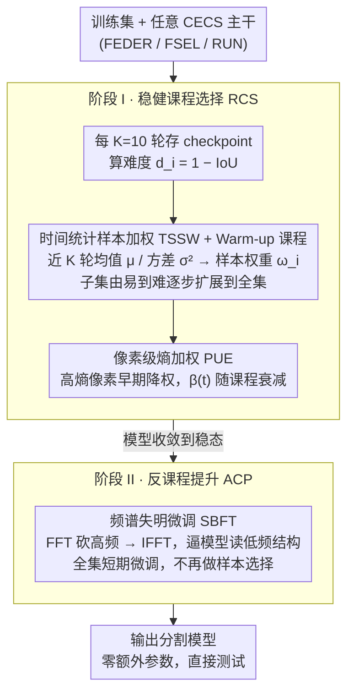

# Refining Context-Entangled Content Segmentation via Curriculum Selection and Anti-Curriculum Promotion

**会议**: ICML 2026  
**arXiv**: [2602.01183](https://arxiv.org/abs/2602.01183)  
**代码**: https://github.com/ChunmingHe/CurriSeg  
**领域**: 图像分割 / 伪装目标检测 / 课程学习  
**关键词**: 伪装目标分割, 课程学习, 反课程学习, 频域微调, 样本可靠性

## 一句话总结
CurriSeg 不动分割网络结构，只换训练计划：先用"时间损失统计 + 像素熵加权"的稳健课程把模型推到稳态，再用反课程的"频谱失明"微调（砍掉高频迫使模型读结构语义），就让 FEDER / FSEL / RUN 在 CHAMELEON / CAMO / COD10K / NC4K 等伪装/息肉分割基准上稳定涨 2–4%，零额外参数、训练时间还更短。

## 研究背景与动机

**领域现状**：上下文纠缠内容分割 (CECS) 是一类目标与背景在纹理、颜色、形状上高度重合的分割任务，典型代表是伪装目标检测 (COD)、息肉分割、医学病灶分割等。主流方法都在卷网络架构：多尺度聚合 (SINet, FEDER)、注意力精修 (Pang, FSEL)、边缘/不确定性分支、Transformer 上下文、频域模块……每一篇都在调结构。

**现有痛点**：所有这些方法的训练范式几乎都是"打乱-小批量-标准监督"，从来不在乎"样本顺序、样本难度、像素难度"这些学习动力学层面的事。在 CECS 这种特征极度模糊的场景里，这种统一对待会出两类坏事：(1) "容易样本"经常带有虚假相关——比如背景纹理太显眼、目标轮廓清晰，模型一上来就靠这些表层捷径活下去；(2) "难样本"里同时混着真正有信息的 hard sample 和噪声/标注模糊的 ambiguous sample，统一上权重等于让脏样本拖坏优化。

**核心矛盾**：标准课程学习 (CL) 想"从易到难"恰恰会把模型推进"高频纹理偏置"的懒区——因为容易样本恰好是高频纹理最显眼的那批，于是模型在轮到难样本时再也学不动了；可如果完全不做课程，又会被高方差/标签噪声样本带偏。同时 segmentation 本身有像素级的内部异质性——边界/低对比像素本身就难，把它们和均质像素同等对待，梯度会被不可靠区域劫持。

**本文目标**：(1) 在 CECS 上设计一个真正稳健的课程，能把 hard-but-informative 样本和 noisy/ambiguous 样本区分开；(2) 同时治理像素级的不确定性，让早期训练不被边界噪声主导；(3) 在模型进入稳态之后，再反向"加难度"，逼模型放弃高频捷径、转去看低频结构。

**切入角度**：作者从生物学习类比切入——捕食者先在简单场景固化基本技能，再去对抗复杂环境。对应到机器学习就是 "stabilize-then-perturb" 两段式：先用稳健课程让模型在干净子集上收敛到可靠基本特征，再用反课程主动剥夺高频信息，把模型从纹理捷径里逼出来。

**核心 idea**：用样本损失的时间序列统计 (mean + variance) 来判别"难但有用"vs"噪声/异常"，配上像素熵软加权得到第一阶段稳健课程；进入第二阶段用频谱失明微调 (SBFT) 抑制高频，强迫模型用低频结构与上下文做决策。整个过程不改网络结构、不加参数。

## 方法详解

### 整体框架
CurriSeg 是一个套在任意 CECS 网络外层的训练调度框架，依次跑两个阶段：

- **阶段 I — 稳健课程选择 (Robust Curriculum Selection, RCS)**：每 $K=10$ 轮保存一份历史 checkpoint $f_{\theta^{(k)}}$，用它对所有样本算难度分 $d_i=1-\mathrm{IoU}(f_{\theta^{(k)}}(x_i), y_i)$；按百分位扩展训练子集（warm-up 课程），同时用每个样本最近 $K$ 轮难度的均值/方差做样本级权重 $\omega_i$，用像素熵做像素级软权重 $W_{h,w}(t)$。
- **阶段 II — 反课程提升 (Anti-Curriculum Promotion, ACP)**：在模型已经稳定的基础上跑频谱失明微调 (SBFT)，把输入图像的高频成分按一个固定截止频率压掉，逼模型只能依赖低频结构与上下文。

完成两阶段后输出的分割模型不需要任何架构改动，直接拿到原始测试集上跑。

### 关键设计

**1. 时间统计样本加权 (TSSW) + Warm-up 课程：在样本级把「难但有用」和「噪声/异常」分开**

CECS 里特征极度模糊，难样本里同时混着真正有信息的 hard sample 和噪声/标注模糊的 ambiguous sample，传统 CL 用静态难度根本分不清。TSSW 改用时间维统计当「样本可靠性探针」：每轮用历史 checkpoint 算难度 $d_i=1-\mathrm{IoU}$，在每个样本上维护长度 $K$ 的循环 buffer，取均值 $\mu_i=\frac{1}{K}\sum_k d_i^{(k)}$ 和方差 $\sigma_i^2=\frac{1}{K}\sum_k(d_i^{(k)}-\mu_i)^2$，min-max 归一化后转两个权重——$\omega_i^\mu=1-\tilde\mu_i$ 偏好容易学的低均值损失，$\omega_i^\sigma=\exp(-(\tilde\sigma_i^2-\sigma^*)^2/(2\gamma^2))$（$\sigma^*=0.5,\gamma=0.2$）用钟形函数偏好「中等方差」：方差太低说明一直学不会（疑似标注噪声）、太高说明在决策边界震荡（疑似 ambiguous）。最终权重 $\omega_i=W^s_{\min}+(1-W^s_{\min})\cdot\omega_i^\mu\cdot\omega_i^\sigma\cdot(1-\tilde\mu_i(1-\tilde\sigma_i^2))$，末项专压「高均值-低方差」的离群模式。样本子集再叠一个 warm-up：开始只用最容易的 60% 子集 $\mathcal{S}_t=\{i\mid d_i\le \mathrm{Per}(\{d_n\},p(t))\}$，$p(t)$ 在 $T_c$ 轮内线性增到 100%。核心直觉是：稳定的高损失才是真异常、振荡的高损失才是该好好学的；而且这套加权和课程子集解耦，可叠加到任何主干的标准训练里。

**2. 像素级熵加权 (PUE)：在单图内部抑制不确定像素的梯度**

segmentation 有像素级的内部异质性——边界/低对比像素本身就难，把它们和均质像素同等对待，梯度会被不可靠区域劫持。PUE 对每个像素的预测概率 $p_{h,w}=\sigma(\hat y_{h,w})$ 算二分类熵 $H_{h,w}=-p\log_2 p-(1-p)\log_2(1-p)\in[0,1]$（$p=0.5$ 取最大），再定义软权重 $W_{h,w}(t)=W_{\min}+(1-W_{\min})\cdot(1-\beta(t)\cdot H_{h,w})$，其中 $\beta(t)=1-t/T_c$ 随课程衰减、$W_{\min}=0.1$ 保住下限：早期 $\beta$ 大、高熵像素几乎被压平，越到后期 $\beta$ 越小、全像素监督逐步恢复。和过往用不确定性「过滤伪标签」不同，这里的目的不是把不确定区域藏起来，而是不让它们一开始就主导梯度，保留下限是为了始终留一点信号、避免完全屏蔽边界反而学不到。它和 TSSW 组合，正好把图间（样本）和图内（像素）两个维度的噪声一起治了。

**3. 频谱失明微调 (SBFT) 反课程：模型稳态后主动剥夺高频，逼它转读低频结构**

标准 CL「从易到难」恰恰会把模型推进「高频纹理偏置」的懒区——容易样本正是高频纹理最显眼的那批，等轮到难样本就再也学不动。SBFT 反其道而行：在模型已稳态的基础上，把图像做 2D FFT、按一个固定截止频率把高频系数置零（或按概率衰减高频幅度），再 IFFT 回空间域当微调输入，模型只能靠剩下的低频亮度/形状/上下文来分割。这一阶段不再用 RCS 的样本选择，直接在全集上短期 fine-tune，但训练时间被前面跳过的简单样本省回来、整体成本反而更低。它的字面意思就是「反课程」——故意提高难度、把模型从纹理捷径里赶出来；CECS 任务里目标和背景纹理高度重合、高频本就是干扰，逼模型把决策推到更鲁棒的低频通道。TSSW、PUE、SBFT 三件合起来就是「stabilize-then-perturb」的完整闭环。

### 损失函数 / 训练策略
- 阶段 I：在原始分割损失 (基线网络自带的 BCE+IoU 等) 前面乘上样本权重 $\omega_i$ 和像素权重 $W_{h,w}(t)$，$T_c$ 等于阶段 I 总轮数。
- 阶段 II：保持原分割损失，但前向输入换成 SBFT 频域过滤后的图像；这阶段不再用 RCS 的子集选择和加权。
- 完全不改基线网络架构，也不引入新可训练参数；唯一额外开销是周期保存 checkpoint 和算 $\mu_i,\sigma_i^2$ 的 buffer（轻量）。

## 实验关键数据

### 主实验
四个伪装目标检测数据集 (CHAMELEON / CAMO / COD10K / NC4K)，三种 backbone (ResNet50 / Res2Net50 / PVT V2)，把 CurriSeg 套在 FEDER / FSEL / RUN 三个 SOTA 上：

| 基线 → 加 CurriSeg | Backbone | CHAMELEON $F_\beta\uparrow$ | CAMO $F_\beta\uparrow$ | COD10K $F_\beta\uparrow$ | NC4K $F_\beta\uparrow$ | 综合 $\Delta$ |
|---|---|---|---|---|---|---|
| FEDER | ResNet50 | 0.850 | 0.775 | 0.715 | 0.808 | — |
| **FEDER+ (Ours)** | ResNet50 | **0.858** | **0.790** | **0.736** | **0.825** | **+2.46%** |
| FSEL | ResNet50 | 0.847 | 0.779 | 0.722 | 0.807 | — |
| **FSEL+ (Ours)** | ResNet50 | **0.856** | **0.792** | **0.742** | **0.823** | **+2.22%** |
| RUN | Res2Net50 | 0.879 | 0.815 | 0.764 | 0.830 | — |
| **RUN+ (Ours)** | Res2Net50 | **0.891** | **0.820** | **0.785** | **0.852** | **+2.23%** |
| RUN | PVT V2 | 0.877 | 0.861 | 0.810 | 0.868 | — |
| **RUN+ (Ours)** | PVT V2 | **0.893** | **0.879** | **0.828** | **0.889** | **+3.94%** |

息肉分割上同样起作用：在 CVC-ColonDB / ETIS / PIS 三个数据集上把 PolypPVT、CoInNet 等基线统一往上拉，$\Delta$ 也是 2% 量级。注意全部 $F_\beta$ 提升是 net gain：三个 backbone × 四个 COD 数据集 × 多个基线统统涨，没有一个负向例子。

### 消融实验
作者拆每个模块在 FEDER (ResNet50) 上的贡献：

| 配置 | CHAMELEON $F_\beta\uparrow$ | COD10K $F_\beta\uparrow$ | 说明 |
|---|---|---|---|
| FEDER baseline | 0.850 | 0.715 | 标准训练 |
| + 标准 CL | ~0.846 | ~0.711 | 反而轻微掉点，验证朴素 CL 在 CECS 有害 |
| + RCS (TSSW + PUE + warm-up) | 0.854 | 0.726 | 稳健课程主导大半提升 |
| + ACP / SBFT (在 RCS 之上) | 0.858 | 0.736 | 反课程再加一档 |
| Full FEDER+ | **0.858** | **0.736** | 全套 +2.46% |

训练开销表 (batch=2) 同样关键：

| Metric | FEDER | FEDER+ | FSEL | FSEL+ | RUN | RUN+ |
|---|---|---|---|---|---|---|
| Training Time (h) | 9.62 | **6.84** | 11.54 | **5.96** | 12.64 | **8.32** |
| GPU Mem (G) | 1.53 | 1.62 | 2.83 | 2.92 | 3.66 | 3.75 |
| Perf. Gain (%) | — | +2.46↑ | — | +2.22↑ | — | +2.13↑ |

### 关键发现
- **朴素 CL 在 CECS 真的会掉点**：图 1 的雷达图明确显示 "+ vanilla CL" 几乎全方位差于基线，验证了作者的核心动机——简单的"由易到难"会被虚假纹理相关引到捷径上。
- **RCS 是涨点主力，ACP 是锦上添花**：单独叠 RCS 就能拿到 ~70% 的总提升，SBFT 在已经稳态的模型上再挤出最后一档；说明稳健性收益 > 反课程收益。
- **训练时间反而下降**：因为 RCS 的 warm-up 课程在前期跳过最难的 40% 样本，加上整体收敛更快，FEDER+ 训练时间从 9.62h 降到 6.84h，参数没增加、显存几乎不变。这是少见的"训练更快 + 测试更准"的双赢。
- **PVT V2 上提升最大 (+3.94%)**：更强的 backbone 反而对训练调度更敏感；说明 Transformer 主干天生容易钻高频捷径，反课程的纠偏效益更明显。

## 亮点与洞察
- 整套方法零参数、零架构改动，纯训练 schedule 改造就能涨 2–4 个点，这种"插件式"的工作在分割社区里极少见——大部分 SOTA 都在卷模块。
- 把 CL 失败原因清晰归结到"虚假纹理相关→懒区→读高频"这条因果链，并用一个反课程模块 (SBFT) 对症下药，方法论上闭环。
- TSSW 的"均值-方差联合判异"思想可以平移到任何带标注噪声/数据模糊的监督任务（伪标签训练、半监督、医学影像）；钟形 $\omega_i^\sigma$ 比传统单调权重函数更细腻。
- 像素熵 + 课程衰减 $\beta(t)$ 的组合给"软掩码"加入了时间维度，避免了一刀切硬掩码——既保护早期梯度稳定，又不让模型永远逃避难像素。
- 训练时间下降这个副作用非常 underrated：相当于附赠了一份隐式数据筛选，在工业落地时尤其有价值。

## 局限与展望
- 验证集中在伪装目标检测和息肉分割两类 CECS 任务，对 generic semantic segmentation (Cityscapes / ADE20K) 是否也能涨点没回答；如果跨任务可迁移性弱，论文的"通用训练框架"定位就要打折扣。
- SBFT 的截止频率是固定超参，缺少自适应机制；对不同数据集/不同 backbone 最优截止频率应该不同，论文没给敏感性分析。
- 历史 checkpoint $f_{\theta^{(k)}}$ 评估全部样本难度的开销随数据集线性增长，在 100K+ 样本量级的训练上代价不可忽略。
- 反课程阶段没显式校验"模型是不是真的从高频转去看低频"，只有最终指标在涨；如果能加 frequency attribution / Grad-CAM 频谱分析，故事会更扎实。
- 训练时间下降一半的现象很有意思，但缺少消融——到底是 warm-up 跳过样本贡献的，还是收敛变快贡献的，目前没法拆开。

## 相关工作与启发
- **vs 标准 Curriculum Learning (Bengio et al. 2009)**：经典 CL 假设"易样本可靠 + 难度=学习效用"；CurriSeg 在 CECS 上明确反驳——易样本带虚假纹理、难样本混杂噪声，并用时间统计区分两类难样本。
- **vs Self-Paced Learning (Kumar 2010)**：自适应 SPL 用当前损失定义难度，是"瞬时快照"；TSSW 用最近 $K$ 轮的均值+方差，等于一阶 + 二阶时间统计，更能识别震荡型 ambiguous 样本。
- **vs 不确定性伪标签过滤 (He 2024/2025)**：以前的 uncertainty 工作主要用来在半监督里筛伪标签；CurriSeg 把它直接用在监督预测上做软加权，目的从"决定要不要学"变成"学多少"。
- **vs 频域增强 / 数据增广 (HighFreq / RandAug)**：传统频域方法是数据增广视角，把高频当作扰动加进训练；SBFT 是反课程视角，故意"信息匮乏"，强迫模型转换决策依赖通道，目标层级不同。
- **vs FEDER / FSEL / RUN 等 CECS SOTA**：这些工作全靠改架构 (frequency module、edge branch、Transformer)；CurriSeg 与它们完全正交，可以无缝叠加，是"训练调度 vs 网络结构"两条路线的互补样本。

## 评分
- 新颖性: ⭐⭐⭐⭐ 把课程 + 反课程做成 stabilize-then-perturb 两段式，并配套 TSSW / PUE / SBFT 三件套，思路在 CECS 子领域是第一次。
- 实验充分度: ⭐⭐⭐⭐ 三 backbone × 四 COD 数据集 + 三息肉数据集 + 训练成本表，覆盖面够；但缺通用分割任务和 SBFT 截止频率敏感性。
- 写作质量: ⭐⭐⭐⭐⭐ 动机-反例-诊断-设计的叙事链非常清晰，从"vanilla CL 反而掉点"的诚实观察起步，节奏漂亮。
- 价值: ⭐⭐⭐⭐ 完全插件式、训练更快、零参数，工业部署友好；如果能验证跨任务迁移，会成为 CL 在分割上的新基线。

<!-- RELATED:START -->

## 相关论文

- [\[AAAI 2026\] JoDiffusion: Jointly Diffusing Image with Pixel-Level Annotations for Semantic Segmentation Promotion](../../AAAI2026/segmentation/jodiffusion_jointly_diffusing_image_with_pixel-level_annotations_for_semantic_se.md)
- [\[ICML 2025\] ConText: Driving In-context Learning for Text Removal and Segmentation](../../ICML2025/segmentation/context_driving_in-context_learning_for_text_removal_and_segmentation.md)
- [\[CVPR 2026\] RS-SSM: Refining Forgotten Specifics in State Space Model for Video Semantic Segmentation](../../CVPR2026/segmentation/rs-ssm_refining_forgotten_specifics_in_state_space_model_for_video_semantic_segm.md)
- [\[CVPR 2026\] INSID3: Training-Free In-Context Segmentation with DINOv3](../../CVPR2026/segmentation/insid3_training-free_in-context_segmentation_with_dinov3.md)
- [\[CVPR 2026\] Pointer-CAD: Unifying B-Rep and Command Sequences via Pointer-based Edges & Faces Selection](../../CVPR2026/segmentation/pointer-cad_unifying_b-rep_and_command_sequences_via_pointer-based_edges_faces_s.md)

<!-- RELATED:END -->
