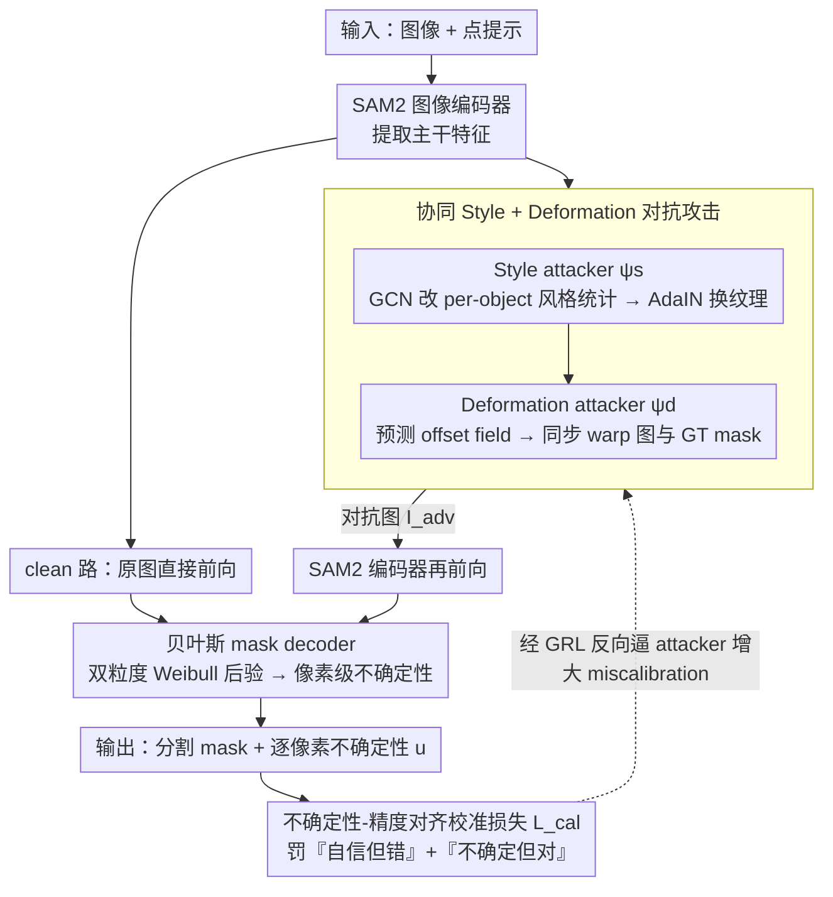

# Segment Anything with Robust Uncertainty-Accuracy Correlation

**会议**: ICML 2026  
**arXiv**: [2605.10603](https://arxiv.org/abs/2605.10603)  
**代码**: https://github.com/HongyouZhou/ruac.git  
**领域**: 分割 / SAM / 不确定性估计 / 鲁棒训练  
**关键词**: SAM2、Mask Confidence Confusion、Bayesian decoder、对抗校准、域泛化

## 一句话总结
针对 SAM 系列只输出 mask-level 单一置信度、在域漂移下出现"Mask-level Confidence Confusion"的问题，本文给 SAM2 接上 Weibull 双粒度贝叶斯 mask decoder 做像素级 epistemic 估计，并配以受人类视觉启发的 style + deformation 协同对抗扰动 + 校准损失，让 uncertainty 在 23 个 zero-shot 目标域始终与误差对齐，平均 J&F 达 79.87 同时不确定性图变得显著可信。

## 研究背景与动机

**领域现状**：SAM 系列把 promptable segmentation 推到了基础模型时代，zero-shot 表现强；但在医疗、显微、科学图像等域上仍然崩。研究者要么去做域特定 fine-tune（医学 SAM），要么去做特定任务适配（视频 SAM2、概念 SAM3）。

**现有痛点**：SAM 输出的 IoU score 是 mask-level 的——整个 mask 共享一个置信度，前景和背景的置信差还很小。一旦域漂移导致"masked 区域内某些像素其实是错的"，模型根本无法告诉用户哪些像素不可信。作者把这个失败模式命名为 Mask-level Confidence Confusion (MCC)。简单地接一个 Bayesian decoder 又会出现新问题：source domain 上学到的 uncertainty-accuracy 相关性在 OOD 退化（Uncertainty-Accuracy shift, UA shift）。

**核心矛盾**：要让 SAM 既保持"Segment Anything"的通用性（不能为每个目标域做有标注的 fine-tune），又要在 OOD 上的 uncertainty 始终能挑出错的像素。两者一起需要"在 source domain 上训练阶段就主动模拟 OOD"。

**本文目标**：(1) 解决 MCC，给出像素级、双粒度不确定性；(2) 解决 UA shift，让 uncertainty 在 23 个目标域都与误差对齐；(3) 坚持单源域泛化（SDG），不引入额外的目标域标注。

**切入角度**：作者借鉴 cognitive science——人识物靠 shape bias，神经网络更多靠 texture bias（Geirhos 等）。因此把 OOD variation 拆成两个正交子问题：appearance（style/texture）变化和 non-rigid deformation（shape）变化，分别用两个对抗 attacker 来 stress-test 模型。

**核心 idea**：用 style + deformation 双 attacker 协同生成最 stress 的训练样本，再用一个把 "certain & wrong" 与 "uncertain & correct" 一起惩罚的校准损失，强制 uncertainty 即便在对抗扰动下也覆盖真实误差。

## 方法详解

### 整体框架
RUAC 把 SAM2 的确定性 mask decoder 替换成 Bayesian Mask Decoder (UE)；同时挂上两个 attacker：Style Adversarial Network $\psi_s$ 和 Deformation Adversarial Network $\psi_d$，通过 Gradient Reversal Layer (GRL) 与 segmentation 模型做端到端 min-max 训练。每个 iteration 包含 clean 与 adversarial 两路 forward：clean 路保留 in-domain 性能，adversarial 路负责把模型推到 calibration 失效边缘并再训回来。推理时 attacker 全部丢掉，只跑 UE，因此部署成本仅是给 SAM2 加一个轻量贝叶斯 head。

### 关键设计

**1. 贝叶斯 mask decoder（双粒度 Weibull 后验）：把 mask 级置信度下放到像素级**

SAM 输出的 IoU score 是 mask 级的——整张 mask 共享一个置信度、前景背景的置信差还很小，一旦域漂移让 masked 区域里某些像素其实是错的，模型根本说不出哪些像素不可信（即 MCC）。RUAC 在 SAM2 原 decoder 位置改用 Weibull 分布同时建模图像 token $\mathbf{f}\in\mathbb{R}^{H\times W\times C}$ 和 mask token $\mathbf{m}_k\in\mathbb{R}^C$ 的不确定性：用一个 conv head 预测空间变化的 $(\lambda_f,\kappa_f)$、一个共享 MLP 预测 per-channel 的 $(\lambda_{m,c},\kappa_{m,c})$，通过重参数化 $w_i = \lambda_i \cdot (-\ln(1-u))^{1/\kappa_i}$ 采样，两支 reparametrized 特征做内积出 logits，把权重不确定性闭式传到 mask 概率；推理可走 analytic 模式（用 $\mathbb{E}[w_i]=\lambda_i\Gamma(1+1/\kappa_i)$ 加 MacKay probit 近似得逐像素 Bernoulli 熵）或 Monte Carlo 模式。选 Weibull 是因为它非负且形状柔性，比 Gaussian 更适合建 token 强度；图像 token 与 mask token 双粒度恰好覆盖「边界局部不确定」和「目标识错」两类失败。

**2. 协同 Style + Deformation 对抗攻击：在线造同时扰动纹理和形状的硬样本来模拟 OOD**

只加贝叶斯 decoder 会冒出新问题：source 上学到的 uncertainty-accuracy 相关性在 OOD 退化（UA shift）。要在 source 训练阶段就主动模拟 OOD，作者借认知科学把 OOD variation 拆成两个正交轴——appearance（texture）和 non-rigid deformation（shape），各派一个对抗 attacker：Style attacker 从 mask 区域抽 per-object RGB 均值/方差 $(\boldsymbol\mu_k,\boldsymbol\sigma_k)$，用 GCN 在 object graph 上协同预测残差 $(\Delta\boldsymbol\mu_k,\Delta\boldsymbol\sigma_k)$，经 AdaIN 替换风格统计量得 stylized image；Deformation attacker 把 backbone 特征加 mask embedding 后预测 per-pixel offset field $\boldsymbol\delta_k$，再用可微 grid sampling 把图和 GT mask 一起 warp 保持监督一致。两支共用主干、只跑一次 backbone forward，并通过梯度反转层（GRL）在反传时翻符号、自动朝「更难」方向更新，免去 PGD 的 inner loop。相比 $\ell_p$-bounded 对抗只追 worst-case error，这种 style/deformation 拆解直接对应被生物视觉文献验证过的 texture bias 和 shape bias 两个鲁棒性轴，GRL 又让 min-max 单次反向就完成、训练效率高得多。

**3. 不确定性-精度对齐校准损失：逼 uncertainty 在对抗样本上始终盖住真实误差**

光造硬样本还不够，得明确告诉系统「什么叫 calibration 失效」。校准损失定义为 $\mathcal{L}_{\text{cal}} = e\cdot\exp(-\text{sg}[u]) + (1-e)\cdot\exp(\text{sg}[u])$，其中 $e=|\hat{\mathbf{M}}-\mathbf{M}^*|$ 是逐像素误差、$u$ 是 analytic uncertainty、$\text{sg}[\cdot]$ 是 stop-gradient：第一项惩罚「自信但错」，第二项惩罚「不确定但对」。妙处在于它不直接监督分割主网（被 stop-gradient 切开），而是经 GRL 反向去更新 attacker，让 attacker 拼命最大化 miscalibration，主网则用 segmentation + KL 去抵抗。这么绕一圈是为了避开陷阱——若直接拿 calibration loss 当主网监督，模型会为了「看起来 calibrated」而牺牲精度；让 calibration 来自数据生成端而非显式正则，才能精度和校准两头都保住。

### 损失函数 / 训练策略
主优化目标：$\min_{\theta_{\text{dec}}}\mathcal{L}_\theta = (\mathcal{L}_{\text{seg}}+\beta\mathcal{L}_{\text{KL}}) + \gamma(\mathcal{L}_{\text{seg}}^{\text{adv}}+\beta\mathcal{L}_{\text{KL}}^{\text{adv}})$，其中 $\mathcal{L}_{\text{seg}}=\mathcal{L}_{\text{focal}}+\mathcal{L}_{\text{dice}}+\mathcal{L}_{\text{IoU}}$。Attacker 隐式最大化 $\mathcal{L}_{\text{seg}}^{\text{adv}}+\beta\mathcal{L}_{\text{KL}}^{\text{adv}}+\lambda\mathcal{L}_{\text{cal}}$。$\gamma$ 用 curriculum 慢慢升上去，避免训练早期被对抗噪声打垮。训练 source 仅用 MOSE 数据集单帧。

## 实验关键数据

### 主实验
23 个 zero-shot 目标域上的 J&F 平均（部分代表性列）：

| 方法 | 平均 J&F | TrashCan | LVIS | Cityscapes | Hypersim | IBD | EgoHOS |
|------|---------|----------|------|------------|----------|-----|--------|
| SAM2 | 67.75 | 44.9 | 75.2 | 64.2 | 46.7 | 80.9 | 84.0 |
| SAM2-FT | 79.75 | 72.4 | 75.9 | 65.1 | 54.6 | 88.9 | 86.3 |
| SAM2-FT-LoRA | 79.13 | 71.3 | 75.6 | 61.6 | 54.6 | 88.9 | 83.6 |
| Bayes-SAM2（只加 UE） | 79.87 | 74.9 | 75.1 | 55.4 | 57.5 | 90.3 | 90.4 |
| **RUAC (Full)** | **80.81+** | **74.4+** | 74.8 | **64.2** | **61.8** | **90.2** | **91.3** |

（最后一行采用 Random Noise 行作为含 Bayesian decoder 的 baseline 参照；RUAC 完整数据见 paper Tab. 1）

### 消融实验

| 配置 | 平均 J&F | 说明 |
|------|---------|------|
| SAM2（无 UE） | 67.75 | 完全 baseline |
| Bayes-SAM2（仅 UE） | 79.87 | 加贝叶斯 decoder |
| Bayes-SAM2 + Random Noise 增广 | 80.81 | 普通增广 |
| Bayes-SAM2 + PGD | 87.5（部分域）* | $\ell_\infty$ 对抗 |
| **RUAC（UE + Style + Deformation + Cal）** | 论文 Tab.1 最强 | 完整方法 |

UR-ERN 等纯 uncertainty baseline 平均 73.40，明显低于 Bayes-SAM2 的 79.87，说明它们对基础模型适配能力不足。

### 关键发现
- 单靠 UE 已经把平均 J&F 从 67.75 拉到 79.87，说明 mask-level confidence confusion 这件事在域漂移下被严重低估，把 confidence 从 mask 级下放到像素级本身就解决了相当一部分问题。
- 加入 AUE（style + deformation 协同攻击）后，方法对 scene/scientific 这种几何与材质都不一样的域增益最大，比如 Hypersim 从 57.5 → 61.8，Cityscapes 从 55.4 → 64.2，验证了"texture bias + shape bias 分别治理"的设想。
- 对比 PGD 这种纯 worst-case 对抗，本文的 style/deformation 在保留高精度的同时拿到更好的校准曲线，证明"对抗目标应该是 miscalibration 而非 max-loss"。
- 训练只用 MOSE 这一个域，却能在 23 个不同性质（自然物体、街景、显微、第一人称）的域上都通用，说明 calibration 与 robustness 通过 bio-inspired 攻击得到的是任务无关的归纳偏置。

## 亮点与洞察
- "把 mask-level confidence 拆成像素级 + 把 OOD 拆成 texture/shape" 这两个拆解都非常清晰，每一拆都对得上一个具体失败模式，方法叙述也按拆解走，一脉相承。
- 用 GRL 替代 PGD 内层循环把对抗训练做成单次反向，是工程上对扩展到基础模型尺度的关键——PGD 多步 backward 对 SAM2 这种规模成本太高。
- Calibration loss 用 stop-gradient 把"惩罚 attacker 而不直接训分割"做出来，避免了"calibrated but bad"陷阱。这一设计模式对其它"主任务 + 辅助校准"的研究有借鉴价值。
- PAC-Bayes 视角的解读把方法连接到"损失景观展平 + 不确定性-风险耦合"，给经验性的对抗校准提供了理论锚点。

## 局限与展望
- AUE 的攻击模型本身要训练，且依赖 GCN 协同 object graph，对单 object 或无 mask 提示的场景不够直接适用。
- 训练 source 只用 MOSE 单一域，虽强调 SDG 的便利，但当 source 与 target 差距巨大（如 mode 完全不同的医学体绘）时增益是否仍然成立未给出。
- Weibull 假设非负、形状自由但仍是单峰的；面对真正的多峰歧义（多个合理 mask），还是会被压成一个均值估计。
- Inference 默认走 analytic mode，比 SAM2 多了一个轻量 head 的开销，论文没系统对比 MC mode 在精细任务上的额外收益与代价。

## 相关工作与启发
- **vs Bayes-SAM2 / BNDL**：本文继承 Weibull 后验形式，但把"训 + 评"环境从 source domain 推广到对抗校准下的 OOD。
- **vs AdvStyle / DG-Font**：作者明确指出 style attacker 借自 AdvStyle、deformation attacker 借自 DG-Font；区别在于他们目标是 domain generalization 的 worst-case，本文目标是 uncertainty-accuracy 对齐。
- **vs PGD / Madry**：经典 $\ell_p$ 对抗追求最大 loss，本文追求最大 miscalibration——这种"语义化对抗 + 校准目标"的组合是近期可见的、对 calibration 友好的训练范式。

## 评分
- 新颖性: ⭐⭐⭐⭐ MCC 命名 + AUE 双攻击 + UA alignment 三件套组合新颖，单件技术多有源流
- 实验充分度: ⭐⭐⭐⭐⭐ 23 个目标域 zero-shot + 多组 baseline + 各类增广对比非常彻底
- 写作质量: ⭐⭐⭐⭐ 概念命名清晰，但记号繁多，初读需要花时间区分 $\psi_s/\psi_d/\theta_{\text{dec}}$
- 价值: ⭐⭐⭐⭐⭐ 给 SAM 系列加上"知道自己不知道"的能力，对安全关键应用极其重要

<!-- RELATED:START -->

## 相关论文

- [\[AAAI 2026\] Segment Anything Across Shots: A Method and Benchmark](../../AAAI2026/segmentation/segment_anything_across_shots_a_method_and_benchmark.md)
- [\[AAAI 2026\] Segment and Matte Anything in a Unified Model (SAMA)](../../AAAI2026/segmentation/segment_and_matte_anything_in_a_unified_model.md)
- [\[AAAI 2026\] SAQ-SAM: Semantically-Aligned Quantization for Segment Anything Model](../../AAAI2026/segmentation/saq-sam_semantically-aligned_quantization_for_segment_anything_model.md)
- [\[CVPR 2026\] SAMosaic3D: Modular Scene Assembly for Real-Time 3D Segment Anything](../../CVPR2026/segmentation/samosaic3d_modular_scene_assembly_for_real-time_3d_segment_anything.md)
- [\[ICCV 2025\] OmniSAM: Omnidirectional Segment Anything Model for UDA in Panoramic Semantic Segmentation](../../ICCV2025/segmentation/omnisam_omnidirectional_segment_anything_model_for_uda_in_panoramic_semantic_seg.md)

<!-- RELATED:END -->
