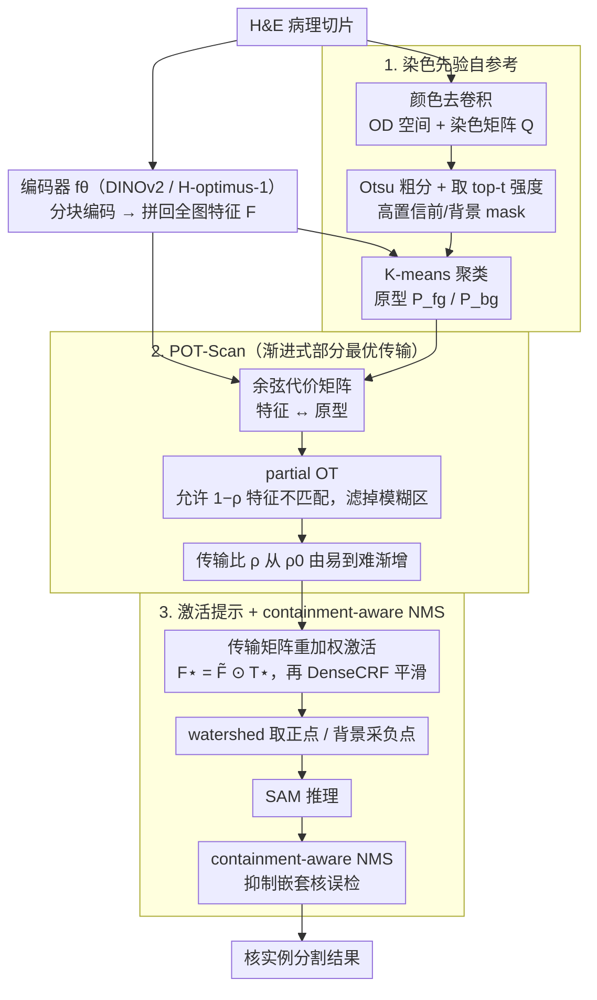

# SPROUT: Supervise Less, See More — Training-free Nuclear Instance Segmentation with Prototype-Guided Prompting

**会议**: ICML 2026  
**arXiv**: [2511.19953](https://arxiv.org/abs/2511.19953)  
**代码**: https://github.com/Y-Research-SBU/SPROUT  
**领域**: 医学图像 / 病理 / SAM 提示工程  
**关键词**: 核分割, SAM 提示, H&E 染色先验, 部分最优传输, 训练无关

## 一句话总结
SPROUT 是首个完全训练无关、零标注的病理核分割框架——用 H&E 染色先验在每张切片上自构高置信度前景/背景区域→提取原型→用部分最优传输（POT）做特征-原型软对齐→输出 SAM 的正/负点提示；在 MoNuSeg 等基准上 AJI 比训练方法高 8.2%。

## 研究背景与动机

**领域现状**：病理 H&E 切片的核实例分割是 cancer prognosis/diagnosis 的基础。已有方法按监督程度分四档——全监督（HoVer-Net 等，需密集标注）、半监督、弱监督（点/voronoi）、自监督；SAM 出现后兴起 SAM-based 路线（MedSAM、PromptNucSeg、UN-SAM 等）多需 fine-tune 或训练 prompter。

**现有痛点**：（1）病理图像窄色谱 + 染色不一 + 单 patch 数千密集核 + 弱边界 + 像素标注极贵；（2）SAM 直接零样本表现差因病理域与 SA-1B 分布差异大；（3）现有 SAM-adapter 方法仍需医学标注 + 训练；（4）reference-based 训练无关方法（Matcher / Bridge / SAT）依赖外部 reference 图，对密集小目标（thousands of nuclei per patch）失效——few-shot 在 staining / density / morphology 高变异下无法找到合适 reference

**核心矛盾**：要不监督 + 不训练就分割核，需要好的 SAM 提示；好的提示需要图-参考的语义对应；但病理图找不到稳定 reference，外部 backbone（DINOv2 / H-optimus-1）特征又不够精准——传统 reference-based 思路在病理上闭环不上。

**本文目标**：完全训练无关 + 零外部 reference，从图像自身构造可靠 prompt，让 SAM 在没有任何标注或参数更新下做出精准核分割。

**切入角度**：跳出"外部 reference"框架——用 H&E 染色的生物化学先验（hematoxylin 染核为深蓝/紫，eosin 染胞质为粉）做颜色去卷积，自构高置信前景/背景区域作"自参考"；这种 self-reference 利用了病理染色的物理性质，绕开 reference 不稳定问题。

**核心 idea**：stain prior → 自参考 mask → 聚类 prototype → 部分最优传输（POT）做特征-原型对齐 → 转 SAM 点提示，整个 pipeline 不训练不标注。

## 方法详解

### 整体框架

SPROUT 要解决的是「零标注、零训练地分割一张病理切片里成千上万个细胞核」。它的核心思路是：既然在病理图上找不到稳定的外部 reference，就让每张切片自己当自己的 reference。整条管线分三段——先用 H&E 染色的物理先验在图上自构高置信前景/背景区域、从中提取原型（**染色先验自参考**）；再用渐进式部分最优传输把原型语义稳定地传播到全图特征上、顺手过滤掉模糊特征（**POT-Scan**）；最后把对齐结果翻译成 SAM 的正/负点提示，跑一遍 SAM 并用 containment-aware NMS 收尾（**激活提示 + containment-aware NMS**）。具体串起来就是：分块编码（DINOv2 或 H-optimus-1）拼回全图特征 → 颜色去卷积（OD 空间 + Otsu）取高置信前景/背景 mask → K-means 聚出原型 $\mathcal{P}_{fg}, \mathcal{P}_{bg}$ → POT-Scan 软对齐 → 激活 + watershed 取点 → SAM 推理 → NMS。全程不更新任何参数、不需要任何标注。

### 关键设计

**1. 染色先验自参考：用 H&E 的生物化学性质替代外部 reference**

reference-based 训练无关方法在病理上集体失效，根因是病理图在染色、密度、形态上变异太大，根本找不到一张能当 reference 的图。SPROUT 的破法是回到 H&E 染色本身——hematoxylin 把核染成深蓝/紫、eosin 把胞质染成粉，这种颜色差异是物理决定的、每张切片都成立。于是先做颜色去卷积：把图变换到光密度空间 $OD = -\log(x/x_0)$，用归一化染色矩阵 $Q = [Q_H, Q_E]$ 解出浓度图 $S = Q^+ \cdot OD$，再用 Otsu 阈值粗分前/背景，在每个区域里取染色强度 top-$t$ 的像素当作高置信 mask $\bm M_{fg}, \bm M_{bg}$，最后只在这些可靠区域里聚类特征得到原型 $\mathcal{P}_{fg}, \mathcal{P}_{bg}$。这样构造出来的「自参考」比任何外部 reference 都准，因为它天生适配每张切片各自的染色差异。消融里把自参考换成外部 reference 图，AJI 直接掉 14.4 个点，是全篇贡献最大的一块。

**2. 部分最优传输扫描（POT-Scan）：让原型语义稳定地传到全图，而不把噪声特征也硬配进去**

有了原型还要把它的语义传播到所有特征上，但标准 OT 会强制把全部质量都运输出去——连模糊、噪声的特征也被硬配到某个原型，反而污染结果。POT-Scan 改用 partial OT：代价矩阵取余弦距离 $C_{ij} = 1 - \tilde F P^\top / (\|\tilde F\|\|P\|)$，允许 $1-\rho$ 部分特征保持 unmatched，目标写成 $\min_T \langle T, C\rangle_F + \lambda KL(T^\top \bm 1_N \| \tfrac{\rho}{M} \bm 1_M)$，s.t. $T \bm 1_M \leq \tfrac{1}{N}\bm 1_N$，再用一个附加 slack 列把 partial 问题转成标准 Sinkhorn 来解。更关键的是 progressive 这一步：把传输比 $\rho$ 从一个很小的 $\rho_0$ 逐步增大，先匹配容易的特征、再慢慢纳入困难特征，相当于一种「软课程学习」，避免一开始就处理模糊区把噪声放大。消融显示标准 OT 替 partial 掉 7.1 个点、单次 OT 替 progressive 再掉 3.4 个点，证明「忽略不确定特征」和「由易到难」两件事都不可省。

**3. 激活提示 + containment-aware NMS：把对齐结果翻译成 SAM 点提示并收尾**

SAM 对 point prompt 的数量和位置很敏感，所以最后一段要把对齐结果精确地转成「每个核一个正点」。做法是先用传输矩阵给特征重加权激活 $F^\star = \tilde F \odot T^\star$，DenseCRF 平滑后阈值二值化，与初始高置信 mask 结合，再用 watershed 在每个连通块上取一个正点；负点从扩张后的背景 mask 上均匀采样。watershed 的停止规则是「多个紧凑区开始融合就停」——继续下去会把不同核合并成一个。SAM 推理之后还有一道 containment-aware NMS：对存在包含关系的候选用更严格的非极大抑制，专门解决密集核场景里普通 NMS 误删嵌套小核的问题。

## 实验关键数据

### 主实验：MoNuSeg 与 CPM17（多监督级别对比）

| 方法 | SAM | 监督 | MoNuSeg AJI↑ | MoNuSeg PQ↑ | CPM17 AJI↑ | CPM17 PQ↑ |
|------|----|----|------|------|------|------|
| U-Net | ✗ | 全监督 | 0.421 | 0.403 | 0.477 | 0.435 |
| HoVer-Net | ✗ | 全监督 | 0.589 | 0.510 | 0.617 | 0.547 |
| TopoSeg | ✗ | 全监督 | 0.604 | 0.522 | 0.625 | 0.561 |
| Voronoi 弱监督 | ✗ | 弱 | 0.501 | 0.443 | 0.531 | 0.475 |
| 自监督 baseline | ✗ | 自监督 | 0.452 | 0.385 | 0.495 | 0.432 |
| MedSAM (fine-tuned) | ✓ | 全监督 | 0.595 | 0.517 | 0.618 | 0.554 |
| PromptNucSeg | ✓ | 训练 prompter | 0.610 | 0.531 | 0.627 | 0.563 |
| Matcher（reference-based 训练无关）| ✓ | 无 | 0.523 | 0.456 | 0.548 | 0.482 |
| **SPROUT** | ✓ | **无** | **0.692** | **0.601** | **0.687** | **0.617** |

SPROUT 在零监督零训练下超过所有训练方法（包括全监督 TopoSeg），AJI 比 PromptNucSeg +8.2%。

### POT-Scan 关键超参鲁棒性

| 配置 | AJI |
|------|------|
| $\rho_0 = 0.1, K = 8$ | 0.687 |
| $\rho_0 = 0.2, K = 8$ | **0.692** |
| $\rho_0 = 0.3, K = 8$ | 0.689 |
| $K = 4$ | 0.673 |
| $K = 16$ | 0.685 |

主要超参（起始传输比 $\rho_0$、原型数 $K$）扰动下 AJI 都在 0.67-0.69 区间，鲁棒。

### 关键组件消融

| 配置 | AJI | Δ |
|------|------|---|
| 完整 SPROUT | 0.692 | – |
| 用 reference 图替代 self-reference | 0.548 | −0.144 |
| 标准 OT 替代 partial OT | 0.621 | −0.071 |
| 单次 OT 替代 progressive scan | 0.658 | −0.034 |
| 去 containment-aware NMS | 0.661 | −0.031 |

自参考策略贡献最大（+14.4 AJI），证明"图像自身染色先验比外部 reference 更可靠"是论文核心创新。

### 关键发现
- **自参考 > 外部 reference**：染色先验自构 mask 比任何外部 reference 都准，因为它适配每张切片的染色差异
- **partial OT 是关键技术**：标准 OT 强制全匹配把噪声放大；partial 让模糊区不参与
- **训练无关 + 零标注 + SOTA**：颠覆"必须训练 / 必须标注"的传统假设
- **跨数据集鲁棒**：MoNuSeg / CPM17 / TNBC / PanNuke 四个数据集一致领先

## 亮点与洞察
- **"图像自身就是最好的 reference"洞察**：解决了 reference-based 方法在病理上的根本困境——病理图变异太大找不到外部 reference 但每张图自己的染色物理一致；这套思路可推广到其他有强物理先验的医学影像（如荧光显微的特异性标记、PET 的 tracer 分布）
- **partial OT 把"软对齐"做对**：以往用 OT 做特征对齐都默认全运输，本文用 partial + progressive 把"忽略不确定特征"作为一等公民——这对噪声敏感任务通用
- **完全训练无关的 SOTA**：在医学影像普遍依赖标注的现状下，本文证明零标注零训练也能 SOTA，对低资源场景（资源缺乏地区、罕见病、新染色协议）有巨大实用价值
- **SAM 提示工程的范例**：把 SAM 当通用 segmentor，所有领域知识注入到 prompt 生成——这种解耦设计让基础模型与领域知识各做各擅长的事

## 局限性 / 可改进方向
- 依赖 H&E 染色的物理性质——其他染色（IHC、Masson 三色等）需重写 stain decomposition；非 H&E 病理（如电镜、免疫荧光）不直接适用
- SAM 推理本身仍有计算开销，密集核场景下数千次 SAM 调用可能慢
- containment-aware NMS 是启发式，对嵌套核结构（如细胞核内核仁）可能误抑制
- 自参考策略对染色极差的低质量切片（过曝/欠染）可能失效，未量化失败 case
- 没与 H-optimus-1 等病理基础模型直接 head-to-head（用了但作为 backbone）

## 相关工作与启发
- **vs 全/弱/自监督核分割（HoVer-Net / Voronoi 等）**：那些都需训练 + 标注；SPROUT 零成本超它们
- **vs SAM 病理 fine-tuning（MedSAM / PromptNucSeg）**：那些需医学标注 + 训练；SPROUT 直接用通用 SAM
- **vs reference-based 训练无关（Matcher / Bridge / SAT）**：那些需外部 reference，病理上找不到稳定 reference；SPROUT 自参考突破
- **启发**：把"领域物理先验 → 自参考 → 基础模型提示"作为零样本医学影像的通用范式；OT + partial 软对齐对所有"特征-原型对齐 + 噪声过滤"任务都适用

## 评分
- 新颖性: ⭐⭐⭐⭐⭐ "染色先验自参考 + partial OT" 是真正全新的训练无关范式
- 实验充分度: ⭐⭐⭐⭐⭐ 4 数据集 × 多监督级别基线 × 详尽消融 × 超参鲁棒性，覆盖完整
- 写作质量: ⭐⭐⭐⭐ 框架清晰，POT-Scan 的数学推导扎实；提供理论保证（附录有 POT 收敛证明）
- 价值: ⭐⭐⭐⭐⭐ 病理标注极贵且变异大，零标注 SOTA 直接降低医学 AI 部署门槛

<!-- RELATED:START -->

## 相关论文

- [\[CVPR 2026\] INSID3: Training-Free In-Context Segmentation with DINOv3](../../CVPR2026/segmentation/insid3_training-free_in-context_segmentation_with_dinov3.md)
- [\[CVPR 2026\] The Power of Prior: Training-Free Open-Vocabulary Semantic Segmentation with LLaVA](../../CVPR2026/segmentation/the_power_of_prior_training-free_open-vocabulary_semantic_segmentation_with_llav.md)
- [\[CVPR 2026\] B³-Seg: Camera-Free, Training-Free 3DGS Segmentation via Analytic EIG and Beta-Bernoulli Bayesian Updates](../../CVPR2026/segmentation/b3-seg_camera-free_training-free_3dgs_segmentation_via_analytic_eig_and_beta-ber.md)
- [\[ECCV 2024\] VISAGE: Video Instance Segmentation with Appearance-Guided Enhancement](../../ECCV2024/segmentation/visage_video_instance_segmentation_with_appearance-guided_enhancement.md)
- [\[CVPR 2026\] PEARL: Geometry Aligns Semantics for Training-Free Open-Vocabulary Semantic Segmentation](../../CVPR2026/segmentation/pearl_geometry_aligns_semantics_for_training-free_open-vocabulary_semantic_segme.md)

<!-- RELATED:END -->
