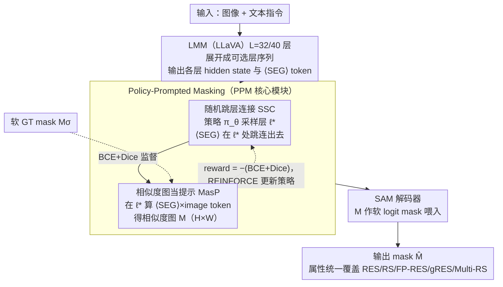

# UGround: Towards Unified Visual Grounding with Unrolled Transformers

**会议**: ICML 2026  
**arXiv**: [2510.03853](https://arxiv.org/abs/2510.03853)  
**代码**: https://github.com/rui-qian/UGround (有)  
**领域**: 分割 / 多模态VLM / 视觉定位  
**关键词**: 视觉定位, 推理分割, 相似度图, 强化学习层选, SAM

## 一句话总结
UGround 把 LMM-based 视觉定位从"用最后一层 $\langle\text{SEG}\rangle$ token 当 prompt"的范式翻转为"用动态选中的中间层相似度图当 prompt"，通过强化学习策略 SSC 让 $\langle\text{SEG}\rangle$ 滑过所有 transformer 层、把相似度图同时当作 SAM 的软 logit mask 和反向监督信号，首次在单一框架内统一了 RES / RS / FP-RES / gRES / Multi-RS 五种视觉定位任务，并在 ReasonSeg test 上 cIoU +9.0%、gRefCOCO val N-acc +12.1%。

## 研究背景与动机

**领域现状**：视觉定位（visual grounding）正从显式 referring expression segmentation（RES）演化到隐式 reasoning segmentation（RS）、单目标到多目标（gRES、Multi-RS）、纯肯定查询到拒绝假设（FP-RES）。现有 SOTA 如 LISA、SESAME、GLaMM、GSVA、PixelLM 各自只能覆盖其中 2-3 个 attribute，没有方法能一次性满足所有 5 个。

**现有痛点**：(1) **固定最后层**——LMM 有 32-40 层 transformer，但所有方法都只用最后一层的 $\langle\text{SEG}\rangle$ embedding 喂给 SAM，像"传话游戏"一样把累积误差全堆到最后一层；(2) **$\langle\text{SEG}\rangle$ 作 prompt 缺乏空间线索**——$\langle\text{SEG}\rangle$ 是文本占位符，本质上是通过一个 MLP 把文本嵌入隐式映射到视觉空间，没有坐标、没有 mask 形状，全靠 SAM "猜"。

**核心矛盾**：LMM 的中间层其实蕴含了更具判别力的语义（实验证明 10-40 层的 cIoU 都比最后层高），但传统范式让 SAM 完全没机会看到这些中间表示；同时 $\langle\text{SEG}\rangle$ token 与 image token 之间的相似度图本身就是一张 H×W 的"软 mask"，比 $\langle\text{SEG}\rangle$ embedding 携带更显式的空间信息。

**本文目标**：(i) 在一个统一架构内同时处理 RES + RS + FP-RES + gRES + Multi-RS 五种任务；(ii) 解决"固定最后层"和"$\langle\text{SEG}\rangle$ 缺空间线索"两大缺陷；(iii) 让 SAM 能"作弊"——提前拿到中间层的语义线索。

**切入角度**：把分层结构看作 unrolled transformers，让每一层都成为 SAM 的潜在输入端口；用相似度图作为既能 prompt SAM 又能反向监督的"双向 mask"。

**核心 idea**：用"policy-prompted masking = 强化学习选层 + 相似度图当 prompt"代替"固定最后层 + $\langle\text{SEG}\rangle$ 当 prompt"，把 visual grounding 重构为带跳层连接的可微 segmentation pipeline。

## 方法详解

### 整体框架
输入图像 $\mathbf{x}_{img}$ 经 LMM（LLaVA）的 $L=32$ 或 $40$ 层 transformer 处理，得到每一层的 hidden state $\mathcal{H}^{(\ell)}$，其中第 $t^*$ 位置是 $\langle\text{SEG}\rangle$ token。核心模块 PPM（Policy-Prompted Masking）在每次 forward $\mathcal{T}_t$ 做两件事：(1) **SSC** 从策略分布 $\pi_\theta(\ell|\mathcal{H}_{t^*})$ 中采样一个层 $\ell^*$，让 $\langle\text{SEG}\rangle$ 在第 $\ell^*$ 层直接跳连到 SAM；(2) **MasP** 在第 $\ell^*$ 层计算 $\langle\text{SEG}\rangle$ 与所有 image token 之间的相似度图 $\mathcal{M}\in[0,1]^{H\times W}$，把 $\mathcal{M}$ 作为 soft logit mask 喂给 SAM 解码器 $\mathcal{G}_\mathcal{V}^{dec}(\mathbf{f}, \bm{h}_{seg}, \mathcal{M})$ 生成最终 mask $\hat{\mathbf{M}}$。整个过程中 $\mathcal{M}$ 同时承担三种角色：prompt（喂 SAM）、constraint（被 BCE+Dice 监督）、signal（作为 REINFORCE 的 reward）。

### 关键设计

**1. 随机跳层连接 (SSC)：让每个 $\langle\text{SEG}\rangle$ 自己选「在哪一层跳出去接 SAM」**

传统范式固定用最后一层的 $\langle\text{SEG}\rangle$ embedding 喂 SAM，像传话游戏一样把 32-40 层的累积误差全堆到最后；可实验证明 10-40 层的 cIoU 几乎都比最后层高。SSC 干脆把「在哪层连出去」建成一个可学的策略分布 $\pi_\theta(\ell|\mathcal{H}_{t^*})=\frac{\exp(s_\ell)}{\sum_j\exp(s_j)}$，打分 $s_\ell=\bm{h}_{t^*}^{(\ell)}\cdot\mathbf{w}_\ell$ 每层有自己的权重 $\mathbf{w}_\ell$；训练时按 $\ell^*\sim\pi_\theta$ 采样以允许探索，reward 取 $r=-(\mathcal{L}_{bce}(\mathcal{M}, M_\sigma)+\mathcal{L}_{dice}(\mathcal{M}, M_\sigma))$（$M_\sigma$ 是 GT mask 经高斯平滑的软标签），配 EMA baseline $b_t=\alpha b_{t-1}+(1-\alpha)r$ 减方差，REINFORCE 损失 $\mathcal{L}_{policy}=-(r-b_t)\log\pi_\theta(\ell^*|\mathcal{H}_{t^*})$。这个结构有两副面孔：单次 forward 看像跳过 $L-\ell^*$ 层直连 SAM 的 skip connection，多次 forward 看像每次激活不同路径的 dropout，等价于一种 Monte Carlo 不确定性估计——既缓解误差累积、又靠 ensemble 提鲁棒性。

**2. 相似度图当提示 (MasP)：把 $\langle\text{SEG}\rangle$ 与图像 token 的相似度图直接喂给 SAM 当软 logit mask**

$\langle\text{SEG}\rangle$ 本质是文本占位符，靠一个 MLP 隐式映射到视觉空间，没坐标没形状，全靠 SAM 猜；但 $\langle\text{SEG}\rangle$ 与 image token 之间的相似度图本身就是一张 $H\times W$ 的软 mask，空间信息显式得多。MasP 在选中的层 $\ell^*$ 对每个 image token 算 $\mathcal{S}_i^{(\ell^*)}=(\bm{h}_{z_i}^{(\ell^*)})^\top\bm{h}_{t^*}^{(\ell^*)}$，按 2D 网格排布插值到 $H\times W$ 得 $\mathcal{M}$，再调用改写后的 SAM $\hat{\mathbf{M}}=\mathcal{G}_\mathcal{V}^{dec}(\mathbf{f}, \bm{h}_{seg}, \mathcal{M})$。$\mathcal{M}$ 连续可微，梯度既能通过 SAM 反传、又被显式监督 $\mathcal{L}_\mathcal{M}=\lambda_{bce}\mathcal{L}_{bce}(\mathcal{M}, M_\sigma)+\lambda_{dice}\mathcal{L}_{dice}(\mathcal{M}, M_\sigma)$ 进一步约束。一个有力的实证：即便完全不训练，把相似度图直接当 prompt 喂原始 SAM 都能拿到 17% cIoU，说明 LMM 内部早已隐式编码了空间分布，显式当 prompt + 显式监督只是把这种隐式能力放大。

**3. 属性统一架构：一个模型同时支持 RES / RS / FP-RES / gRES / Multi-RS 五种任务**

之前没有方法能一次满足全部五个属性——LISA 只覆盖 RES+RS，GSVA 到 gRES 但不支持 Multi-RS，PixelLM 支持 Multi-RS 却不能拒绝空目标。UGround 靠 PPM 本身的灵活性把五种一锅端：多目标场景下每个目标配一个 $\langle\text{SEG}\rangle$、各自独立采样层 $\ell^*$；false premise 场景下若所有层的相似度图都低响应、模型就可以拒绝；reasoning 场景下中间层的语义本就比最后层强，正好适合处理隐式描述。于是它成了首个 5/5 全覆盖的统一框架。

### 损失函数 / 训练策略
总损失四项加权：$\mathcal{L}=\lambda_{txt}\mathcal{L}_{txt}+\lambda_{mask}\mathcal{L}_{mask}+\lambda_\mathcal{M}\mathcal{L}_\mathcal{M}+\lambda_{policy}\mathcal{L}_{policy}$。其中 $\mathcal{L}_{txt}$ 是 LMM 标准文本生成损失，$\mathcal{L}_{mask}$ 是 SAM 输出的 mask 监督（BCE+Dice），$\mathcal{L}_\mathcal{M}$ 是相似度图对软 GT 的 BCE+Dice，$\mathcal{L}_{policy}$ 是 REINFORCE 策略梯度。base model 是 LLaVA1.5-7B/13B，分割解码用 SAM，在 ReasonSeg train 上微调 239 sample。

## 实验关键数据

### 主实验

ReasonSeg 测试集（推理分割）：

| 方法 | val gIoU | val cIoU | test gIoU | test cIoU |
|------|----------|----------|-----------|-----------|
| LISA-7B-LLaVA1.5 (ft) | 61.3 | 62.9 | 55.6 | 56.9 |
| READ-7B-LLaVA1.5 (ft) | 59.8 | 67.6 | 58.5 | 58.6 |
| LISA++-7B-LLaVA1.5 (ft) | 64.2 | 68.1 | 57.0 | 59.5 |
| RSVP-GPT | 64.7 | 63.1 | 60.3 | 60.0 |
| **UGround-7B-LLaVA1.5 (ft)** | **66.1** | **72.1** | **63.6** | **65.4** |
| LISA-13B-LLaVA1.5 (ft) | 65.0 | 72.9 | 61.3 | 62.2 |
| **UGround-13B-LLaVA1.5 (ft)** | **67.9** | **74.9** | **65.0** | **65.5** |

相比 LISA-7B（48.4 cIoU on test）提升 **+17 cIoU**，相比同 ft 的 READ-7B（58.6）提升 **+6.8 cIoU**，论文宣传的"+9% cIoU"对应于 RSVP-GPT 这种更强基线。

### 消融实验

| 配置 | ReasonSeg test cIoU | 说明 |
|------|---------------------|------|
| 固定最后层 + $\langle\text{SEG}\rangle$ prompt（LISA 范式） | ~48.4 | baseline |
| 动态选层 + $\langle\text{SEG}\rangle$ prompt | 提升中间层 cIoU（layers 10-40 均超过 last layer） | SSC 单独贡献 |
| 固定最后层 + 相似度图 prompt | 35.0 (`SESAME`) → 30.7 提升 4.3% | MasP 单独效果 |
| 完整 UGround (PPM = SSC + MasP) | 65.4 | 完整模型 |

来自论文 Table 2 的相似度图分析：原始未训练 SAM 用相似度图 prompt 可达 17% cIoU，把相似度图直接转 binary mask 可达 35.0%（甚至超过 SESAME 训练的 30.7%）。

### 关键发现
- **中间层比最后层强**：所有 10-40 层的预测 cIoU 都高于固定最后层策略（Fig 2a），中间层从 layer 19 开始收敛，最后层要到 layer 28，说明 dynamic layer selection 既提升上限又加速收敛。
- **相似度图本身就有空间语义**：未训练的 SAM 仅靠相似度图 prompt 就能给出合理输出，证明 LMM 内部的相似度结构已经编码了 spatial cue，传统方法只是没去用它。
- **FP-RES 任务上 N-acc +12.1%**：在 gRefCOCO 上拒绝假前提（空目标）的能力远超基线，归功于策略采样产生的 layer ensemble 提供 uncertainty 估计。

## 亮点与洞察
- **"展开 transformer"这个 framing 非常优雅**：把固定的 stacked transformer 看作 unrolled 可选路径的序列，让原本不可被 SAM 看到的 39 层中间表示统统变成可候选 prompt 源，这种"打开黑盒"的视角可以迁移到任何需要中间层信息的下游任务。
- **相似度图三重角色复用**：同一张 $\mathcal{M}$ 既是 SAM 的 prompt、又是损失的监督目标、又是 RL 的 reward，三种用途共享同一份计算量，极度高效。
- **REINFORCE + LMM 中间层选择**：把"在哪一层连出去"建模为离散动作的 policy gradient，给"组合式可微 + 离散 layer selection"提供了一个干净的实现范式。
- **统一性的工程价值**：5-attribute 全覆盖意味着部署时不再需要 task-specific 模型，可作为通用 grounding 后端。

## 局限与展望
- 训练计算量：策略每步要从 $L=32$ 或 $40$ 层中采样，加上 REINFORCE 高方差，理论上需要多次 forward 才能稳定，论文未充分披露训练时间开销。
- $\langle\text{SEG}\rangle$ 与 image token 计算相似度仍受限于 SAM 的输入分辨率，$H\times W$ 网格的插值可能在小目标上失真。
- REINFORCE baseline 用 EMA，缺少 critic network 的实验对比，方差控制可能仍有提升空间。
- 只在 LLaVA1.5 上验证，对 Qwen-VL、InternVL 等更新 LMM 的兼容性未知。
- 训练时层 ensemble 起到 uncertainty 估计的作用，但推理时若只采样一条路径会丢失这个收益——论文未明确说明 inference 时是否做 MC 平均。

## 相关工作与启发
- **vs LISA / SESAME / READ**：都用固定最后层 + $\langle\text{SEG}\rangle$ prompt，UGround 用动态层 + 相似度图 prompt，属于范式升级。
- **vs GSVA / PixelLM**：前者覆盖 4 个属性、后者覆盖 4 个，UGround 是 5/5 完整覆盖。
- **vs HyperSeg / OMG-LLaVA**：HyperSeg 是 versatility-oriented（统一不同模态任务），UGround 是 attribute-oriented（统一同一任务的不同属性），两者正交、可组合。
- **vs Mask2Former**：Mask2Former 在视觉端做 unified segmentation；UGround 在语言-视觉接口处做 unified grounding，是 LMM 时代的对应物。
- **启发**：(a) "中间层比最后层强"在很多 LMM 下游任务中都可能成立，值得系统性研究；(b) 把 attention map / similarity map 当 prompt 而非 hidden state 当 prompt 的思路，可以推广到 detection、tracking、open-vocab segmentation。

## 评分
- 新颖性: ⭐⭐⭐⭐⭐ unrolled transformers + policy-prompted masking 是清晰的新视角，5-attribute 全覆盖也是首次
- 实验充分度: ⭐⭐⭐⭐ ReasonSeg / RefCOCO / gRefCOCO 三个 benchmark 全覆盖，消融详尽，但推理时单条路径 vs MC 平均的对比缺失
- 写作质量: ⭐⭐⭐⭐ Sec 3 的 "telephone game" 比喻和 Fig 1/2/5 的可视化都很到位，但策略梯度部分公式略密集
- 价值: ⭐⭐⭐⭐⭐ 既给出 SOTA 结果又开放代码，"中间层 + similarity map" 范式有长期影响力

<!-- RELATED:START -->

## 相关论文

- [\[ICCV 2025\] ReferDINO: Referring Video Object Segmentation with Visual Grounding Foundations](../../ICCV2025/segmentation/referdino_referring_video_object_segmentation_with_visual_grounding_foundations.md)
- [\[CVPR 2025\] DA-VPT: Semantic-Guided Visual Prompt Tuning for Vision Transformers](../../CVPR2025/segmentation/da-vpt_semantic-guided_visual_prompt_tuning_for_vision_transformers.md)
- [\[CVPR 2026\] RealVLG-R1: A Large-Scale Real-World Visual-Language Grounding Benchmark for Robotic Perception and Manipulation](../../CVPR2026/segmentation/realvlg-r1_a_large-scale_real-world_visual-language_grounding_benchmark_for_robo.md)
- [\[AAAI 2026\] EAGLE: Episodic Appearance- and Geometry-Aware Memory for Unified 2D-3D Visual Query Localization](../../AAAI2026/segmentation/eagle_episodic_appearance-_and_geometry-aware_memory_for_unified_2d-3d_visual_qu.md)
- [\[NeurIPS 2025\] UniPixel: Unified Object Referring and Segmentation for Pixel-Level Visual Reasoning](../../NeurIPS2025/segmentation/unipixel_unified_object_referring_and_segmentation_for_pixel-level_visual_reason.md)

<!-- RELATED:END -->
