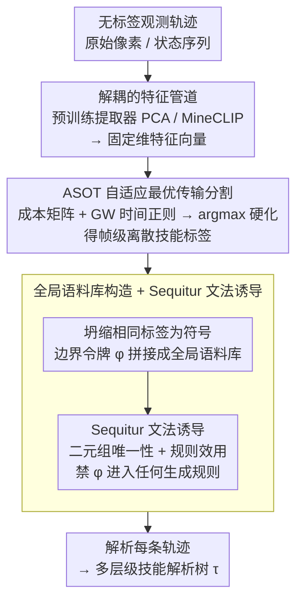

# 无监督层级技能发现

**会议**: ICML 2026  
**arXiv**: [2601.23156](https://arxiv.org/abs/2601.23156)  
**代码**: https://github.com/dmhHarvey/hisd  
**领域**: 强化学习  
**关键词**: 技能发现, 层级结构, 无监督学习, 文法诱导, Minecraft

## 一句话总结
HiSD 从无标签观测轨迹出发——通过最优传输进行技能分割，再用 Sequitur 文法诱导发现多层级技能层次，无需动作标签或奖励信号。

## 研究背景与动机

**领域现状**：人类规划本质上是层级化的，通过目标和子任务推理。强化学习社区也发现，在高维环境（如 Minecraft）中，层级分解能显著提升学习效率和策略复用。然而手工定义的层级（如 HTN）需要大量人力和领域知识。

**现有痛点**：现有技能发现方法高度依赖于动作标签、奖励信号或在线交互。CompILE 和 OMPN 等方法要求已知技能顺序和完整状态-动作轨迹，而不是仅从观测数据学习。这些方法通常只产生平面分割而非深层组合层次。

**核心矛盾**：技能发现和层次结构学习通常耦合在一起，但若将观测特征作为唯一输入，则无法利用动作/奖励信息指导发现过程。

**本文目标**：设计完全无监督框架——仅从观测数据提取可复用的多层级技能层次，并能处理高维真实环境。

**切入角度**：将技能发现解耦为两阶段——（1）技能分割：用最优传输找视觉上一致的行为单元；（2）层次诱导：用 Sequitur 文法压缩发现可复用子程序。

**核心 idea**：通过最优传输 + 文法诱导的两阶段流水线，从纯观测轨迹中无监督地发现既能分割出语义单元、又能组织成层级结构的技能体系。

## 方法详解

### 整体框架

HiSD 要解决的是「只靠无标签的观测轨迹，不用动作标签也不用奖励，就发现可复用的多层级技能」。它把问题拆成两阶段：先把轨迹切成语义一致的技能单元，再把这些单元压缩成可复用的层级。具体四步：（1）输入原始观测轨迹和特征向量；（2）用 ASOT 最优传输对轨迹做帧级技能分割，得离散技能标签序列；（3）把多条轨迹拼接成全局语料库，用 Sequitur 文法诱导发现可复用中层子程序；（4）生成最终的层级解析树。

### 关键设计

**1. 自适应最优传输分割 (ASOT)：把连续观测序列离散成语义一致的技能单元**

要从纯观测轨迹里切出「行为单元」，难点是没有动作/奖励信号、还得保证切出来的段在时间上连贯。ASOT 构造成本矩阵 $C_{tk}$ 衡量观测 $X_t$ 与第 $k$ 个技能原型的视觉差异，最小化加权目标 $\langle C,\Gamma\rangle + \alpha\mathcal{R}_{\text{temp}}(\Gamma) + \lambda D_{\text{KL}}(\Gamma^\top\mathbf{1}_n \| q)$ 求最优分配 $\Gamma^*$，最后硬化成离散标签 $z_t = \arg\max_k \Gamma^*_{tk}$。关键在时间正则项 $\mathcal{R}_{\text{temp}}$：它用 Gromov-Wasserstein 距离约束相邻帧的时间一致性，通过半径参数 $r$ 直接控制最小段长——对 $nr$ 步内相邻帧被分到不同技能施加惩罚，从而自动产生连贯技能段，而不是像纯聚类那样频繁跳变。

**2. 全局语料库构造 + Sequitur 文法诱导：自动发现可跨轨迹复用的中层子程序和层级**

切完段只是平面标签序列，还要找出哪些片段能在不同轨迹间复用、并组织成层次。做法是先把相邻相同标签的帧坍缩成单个符号，再用边界令牌 $\phi$ 把所有轨迹拼成全局语料库 $\mathcal{S}_{\text{corp}} = S^{(1)} \oplus \phi \oplus S^{(2)} \oplus \cdots$，然后跑 Sequitur 算法，维护两个不变量——二元组唯一性和规则效用，并显式禁止 $\phi$ 出现在任何生成规则里以防跨轨迹错误拼接。选 Sequitur 是因为它线性时间、天然支持递归结构和任意深度，可以同时学出多层级和跨轨迹复用的子程序，不用预先指定层深或段数。

**3. 解耦的特征管道：换个特征提取器就能扩展到任意观测类型**

ASOT 和 Sequitur 都只吃固定维度的特征向量，所以把「用什么特征」从核心算法里解耦出来：在 ASOT 之前用一个预训练特征提取器（如 PCA、CLIP）把原始像素映射到固定维特征空间即可。正因为这层解耦，同一套 HiSD 既能处理完全可观测的环境（Craftax+PCA）、也能处理部分可观测的真实环境（Minecraft+MineCLIP），核心算法一行不用改。

## 实验关键数据

### 主实验

在 Craftax 的 Wood-Stone Random 和 Stone Pickaxe Static 任务上的分割性能：

| 任务 | 方法 | mIoU Full | F1 Full | 说明 |
|------|------|-----------|---------|------|
| WS Random | HiSD | 58% (±16) | 74% (±11) | 无动作/奖励 |
| WS Random | CompILE | 74% (±4) | 94% (±3) | 有动作+段数 |
| WS Random | OMPN | 72% (±11) | 91% (±9) | 有动作+层深 |
| Stone Pickaxe Static | HiSD | 65% (±17) | 82% (±13) | 无监督 |
| Stone Pickaxe Static | CompILE | 40% (±18) | 67% (±20) | 有监督但仍不稳定 |
| Stone Pickaxe Static | OMPN | 26% (±4) | 56% (±4) | 有监督但失败 |

### 消融

Minecraft 44-skill 数据集层级质量指标：

| 配置 | Unique Trees | Avg Depth | Avg Size | Mean Branching |
|------|--------------|-----------|----------|-----------------|
| HiSD (Full) | 12 | 3.2 | 47 | 2.8 |
| OMPN（监督） | 156 | 2.1 | 51 | 3.9 |
| CompILE (flat) | 500 | 1.0 | 44 | 5.2 |
| 真值文法 | 1 | 3.5 | 48 | 2.7 |

### 关键发现
- Stone Pickaxe Static——CompILE/OMPN F1 从 94% 跌至 56-67%，HiSD 因不依赖动作/顺序保持稳定（82%）。
- 层级复用性——HiSD 12 棵树接近真值 1 棵；OMPN 156 棵，CompILE 500 棵。
- 层深匹配——HiSD 平均深度 3.2（真值 3.5）明显优于 OMPN 2.1 和 CompILE 1.0。
- 下游 RL 加速——HiSD 层级相比平面策略加速训练 1.5-2.3 倍。

## 亮点与洞察
- **真正的无监督范式**：只用观测特征，彻底摆脱动作标签/奖励/在线交互的依赖。
- **两阶段解耦设计**：将分割和层次诱导分开，简化问题且使分割算法可插拔。
- **文法诱导的优雅性**：Sequitur 的两大不变量天然诱导出稀疏的、可复用的层次。
- **跨轨迹泛化**：通过边界令牌约束，确保发现的子程序是真正的跨轨迹模式。

## 局限与展望
- 特征依赖性——方法性能很大程度依赖特征质量（PCA/MineCLIP）。
- 技能数 $K$ 敏感性——欠估时会合并不同技能。
- 长序列可扩展性——Sequitur 在极长序列（>10k 帧）上的计算和内存代价未充分讨论。
- 改进：与聚类或深度生成模型结合自动估计 $K$；在线/流式版的 Sequitur；文法的稀疏性和层级质量的显式约束。

## 相关工作与启发
- **vs CompILE**：CompILE 需动作监督且段数已知；HiSD 完全无监督。
- **vs OMPN**：OMPN 需动作 + 已知层深；HiSD 仅需观测 + 技能数 $K$。
- **vs 纯聚类（DEC、VQ-VAE）**：无时间约束容易产生频繁跳变；HiSD 用 Gromov-Wasserstein 强制时间平滑性。

## 评分
- 新颖性: ⭐⭐⭐⭐⭐  首次将完全无监督技能发现与文法诱导深度结合。
- 实验充分度: ⭐⭐⭐⭐  Craftax + Minecraft 双环境 + 多指标 + 下游 RL 验证。
- 写作质量: ⭐⭐⭐⭐⭐  逻辑清晰，流程图直观。
- 价值: ⭐⭐⭐⭐  对无标注演示学习、层级 RL、视频理解领域有明显启发。

<!-- RELATED:START -->

## 相关论文

- [\[ICML 2026\] Segment Anything with Robust Uncertainty-Accuracy Correlation](segment_anything_with_robust_uncertainty-accuracy_correlation.md)
- [\[ICML 2026\] SPROUT: Supervise Less, See More — Training-free Nuclear Instance Segmentation with Prototype-Guided Prompting](supervise_less_see_more_training-free_nuclear_instance_segmentation_with_prototy.md)
- [\[ICML 2026\] UGround: Towards Unified Visual Grounding with Unrolled Transformers](uground_towards_unified_visual_grounding_with_unrolled_transformers.md)
- [\[ICML 2026\] LightAVSeg: Lightweight Audio-Visual Segmentation](lightavseg_lightweight_audio-visual_segmentation.md)
- [\[ICML 2026\] Functional Attention: From Pairwise Affinities to Functional Correspondences](functional_attention_from_pairwise_affinities_to_functional_correspondences.md)

<!-- RELATED:END -->
