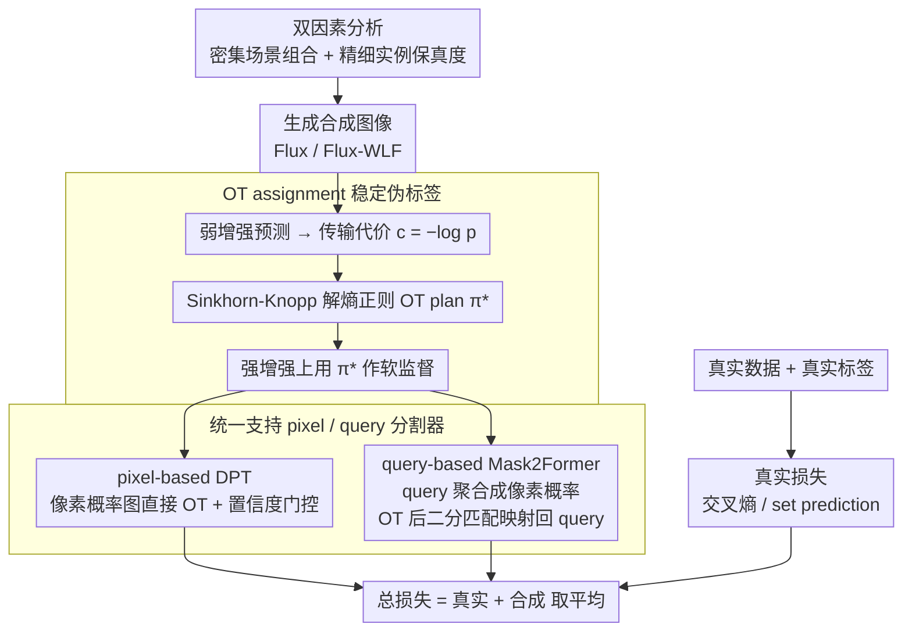

# What Makes Synthetic Data Effective in Image Segmentation

**会议**: ICML2026  
**arXiv**: [2605.19289](https://arxiv.org/abs/2605.19289)  
**代码**: https://github.com/zhang0jhon/SENSE  
**领域**: 语义分割 / 合成数据  
**关键词**: 语义分割, 合成数据, 扩散模型, 最优传输, 伪标签  

## 一句话总结
这篇论文系统分析了合成图像对语义分割有效的两个关键因素：复杂场景组合和高实例保真度，并提出 SENSE 用最优传输稳定合成图像的伪标签分配，从而在 Cityscapes、COCO、ADE20K 上稳定提升 DPT 和 Mask2Former。

## 研究背景与动机
**领域现状**：扩散模型和 flow matching 图像生成模型已经能合成高质量图像，因此合成数据被广泛用于分类、检测、分割和机器人等任务。语义分割尤其依赖像素级标注，真实标注成本高、长尾类别难收集，所以用生成模型扩充训练集是一个很自然的方向。

**现有痛点**：过去很多工作证明“合成数据有用”，但很少回答“什么样的合成数据有用”。如果只追求图像好看，模型可能学不到真实场景中的多对象共现和边界细节；如果直接使用 ControlNet 等条件生成模型的输入 mask 当标签，生成图像和条件 mask 之间又可能出现局部语义错位，导致伪标签噪声。

**核心矛盾**：分割任务同时需要全局语义上下文和局部像素边界。合成数据如果只有单物体或稀疏场景，难以训练模型处理真实街景和室内场景中的复杂布局；如果实例边缘、纹理和高频细节不够，模型又难以学习精确边界。即便图像质量足够好，标签分配也必须能适应生成随机性，而不能死板相信原始条件。

**本文目标**：作者先用控制实验识别合成数据有效性的关键因素，再基于这些发现设计一个模型无关的 SENSE 框架，在固定真实数据上加入由高质量生成模型产生的合成图像，并通过 OT assignment 缓解伪标签不一致。

**切入角度**：论文把问题拆成“图像本身是否适合分割”和“标签监督是否可靠”两部分。前者通过稀疏/密集场景、粗糙/精细实例的对照实验来分析；后者通过熵正则最优传输，把每个像素到类别的分配作为全局优化问题，而不是逐像素独立硬分配。

**核心 idea**：有效的分割合成数据应同时具备密集场景组合和精细实例保真度，而 SENSE 用 OT 把不完美合成图像转化为稳定、可扩展的半监督分割信号。

## 方法详解
SENSE 的方法主线很清楚：先确定应该生成什么样的合成图像，再决定如何给这些图像产生可靠监督。作者发现，Flux/Flux-WLF 这类生成模型能够产生多对象、空间关系丰富、边界细节较好的图像，因此用它们生成 Cityscapes、COCO、ADE20K 对应规模的合成样本。训练时，真实图像使用真实标签，合成图像则通过当前分割模型预测得到 soft class probability，再经 OT 全局重分配成更稳的 pseudo label。

### 整体框架
输入包括有标签真实数据 $\mathcal{D}_R=\{(x_i,y_i)\}$ 和无标签合成图像 $\mathcal{D}_S=\{\tilde{x}_i\}$。SENSE 在 mini-batch 内同时训练真实样本和合成样本：真实样本走标准交叉熵或 Mask2Former set prediction loss；合成样本先做 weak augmentation 得到预测概率，构造从像素到类别的 transport cost，再用 Sinkhorn-Knopp 求解熵正则 OT plan，最后在 strong augmentation 上用 OT plan 作为软监督训练。这个流程同时支持 DPT 这类 pixel-based 模型和 Mask2Former 这类 query-based 模型。

### 关键设计
**1. 双因素分析：把“什么样的合成数据有用”变成可测量的目标**
过去的合成数据工作大多只证明“合成数据有用”，却没回答“哪种合成数据有用”——只追求画面好看的图像，模型学不到真实场景里的多对象共现和清晰边界。为此作者做了一组控制实验，把有效性拆成两个可量化的因素。第一是场景组合复杂度：构造 sparse composition（少数主体、背景稀疏）和 dense composition（多对象共现、空间关系丰富）两类数据，控制 prompt 与生成模型，并用 GroundingDINO 检出的平均实例数作为全局语义密度的代理指标。第二是实例保真度：在场景组合统计接近的前提下，构造 coarse fidelity（Flux，高频纹理偶尔被抹平）和 fine fidelity（Flux-WLF，显式保留高频细节和锐利边缘）两类数据，用 GLCM Score 与 Compression Ratio 近似衡量局部高频信息。为排除标注器偏差，所有合成图像都由一个只在真实数据上训练的 teacher 统一打标。结论是密集场景组合与精细实例保真度对分割各有独立贡献，这把合成数据设计从凭经验调 prompt 变成了有明确测量目标的工程。

**2. OT assignment：用全局最优传输把不可靠的伪标签稳下来**
即便图像质量够好，标签监督仍可能不可靠：用 ControlNet 等条件生成时，图像与输入条件 mask 之间常有局部语义错位（如本该是 sidewalk 的区域被画成 road），直接拿条件 mask 当真值并不安全；而标准 pseudo-labeling 对每个像素独立取最大概率，又容易把局部 hallucination 固化成错误监督（confirmation bias）。SENSE 改为把标签分配建模成最优传输：对合成图像每个像素 $(h,w)$ 到类别 $j$ 构造代价 $c_{ij}(h,w)=-\log p_\theta(j\mid \tilde{x}_i(h,w))$，把所有像素展平成 $n\times k$ 矩阵后求解熵正则化问题 $\min_{\pi}\langle \pi,c\rangle+\beta H(\pi)$。约束上不用经验边际，而是采用均匀边际先验，相当于隐式重加权来缓解合成分布的长尾偏差。该凸问题用 Sinkhorn-Knopp 迭代高效求得近似解 $\pi^*=\mathrm{diag}(u)\,K\,\mathrm{diag}(v)$，其中 $K=\exp(-c/\beta)$。训练时在弱增强图像上算出 $\pi^*$，再配合置信度门控，把它当软标签去监督强增强图像。这样标签分配满足全局类别质量约束、而非逐像素硬分类，因此在有噪声的合成图像上能给出更平滑、更抗噪的监督。

**3. 统一支持 pixel-based 与 query-based 分割器：把 OT 推广到 set prediction**
已有的 OT 半监督方法大多只适用于 dense pixel classifier，但现代强分割器（如 Mask2Former）用的是 query set prediction，两者结构不同。SENSE 的关键泛化点是承认：query 模型最终仍定义了一个密集像素语义决策面，因此可以先把它投影回像素空间再做全局 assignment。具体地，对 DPT 这类 pixel-based 模型，直接在像素概率图上算 OT plan，并用置信阈值 $\gamma=0.95$ 在强增强上训练；对 Mask2Former 这类 query-based 模型，先按 $p_\theta(j\mid \tilde{x}_i(h,w))=\sum_q s_q(j)\,m_q(h,w)$ 把各 query 的 class-mask 对聚合成 per-pixel 类别概率，在像素空间求出 $\pi^*$ 后，再通过 bipartite matching 把修正后的 class-mask 目标映射回 query 监督。由此同一套合成数据利用策略就能同时适配两类主流架构，且不增加推理开销。

### 损失函数 / 训练策略
Pixel-based 分割器的合成损失为带置信度门控的 OT soft-label 交叉熵，真实损失为标准 pixel-wise cross entropy，总损失取两者平均。Query-based 分割器的合成损失包含分类项和 mask 项；为了稳定，合成数据的 Dice loss 权重设为 0，只保留 BCE 类 mask 监督，避免少量错误区域严重扭曲 query 梯度。训练使用 AdamW、mixed precision、EMA 和弱/强增强；Cityscapes/ADE20K 每批 8 张真实 + 8 张合成，COCO 每批 16 + 16；OT 正则系数 $\beta=0.05$，伪标签置信阈值 $\gamma,\delta$ 均为 0.95。

## 实验关键数据

### 主实验
| 数据集 | 指标 | 本文 | 之前 / 真实数据基线 | 提升 |
|--------|------|------|----------|------|
| Cityscapes, DPT DINOv2-S | mIoU s.s. | 80.65 | 78.11 real only | +2.54 |
| Cityscapes, Mask2Former DINOv3-L | mIoU m.s. | 84.88 | 83.29 real only | +1.59 |
| COCO, DPT DINOv2-S | mIoU m.s. | 64.96 | 63.40 real only | +1.56 |
| ADE20K, Mask2Former DINOv3-L | mIoU s.s. | 59.09 | 57.45 real only | +1.64 |
| ADE20K scalable synthetic methods | mIoU m.s. | 60.81 | SegGen 58.7 | +2.11 |
| ADE20K Swin-L fair comparison | mIoU | 58.27 | JoDiffusion 57.46 / SDS 57.23 | +0.81 / +1.04 |

### 消融实验
| 配置 | 关键指标 | 说明 |
|------|---------|------|
| Dense vs Sparse composition, Flux | Cityscapes 66.56 vs 61.81 mIoU | 平均实例数从 11.48 到 22.21，密集场景显著更有利 |
| Fine vs Coarse fidelity | Cityscapes 68.17 vs 66.56 mIoU | 实例数接近时，高频边界和纹理保真度继续带来 +1.61 |
| Synthetic scale on Cityscapes | 79.80 → 81.27 mIoU | 合成数据从 1× 增至 6×，性能持续提升但边际收益递减 |
| w/o OT vs OT, Cityscapes | 79.50 → 80.65 mIoU | OT assignment 带来 +1.15 mIoU |
| w/o OT vs OT, COCO / ADE20K | 62.74→63.30 / 49.62→50.23 | OT 在三个数据集上均稳定增益 |
| 合成数据质量阶梯 | 78.98 → 79.49 → 79.80 | 从稀疏低保真到密集高保真，SENSE 内部也验证双因素结论 |

### 关键发现
- 合成图像的全局语义密度非常关键。Flux dense split 的平均实例数 22.21、mIoU 66.56，明显高于 sparse split 的 11.48、61.81。
- 在控制场景组合后，局部实例保真度仍然有效。Flux-WLF 的 fine fidelity 数据把 mIoU 从 66.56 提到 68.17，说明边界和高频纹理对分割有独立贡献。
- SENSE 的提升不是单一架构现象：DPT、Mask2Former、DINOv2-S/B、DINOv3-L 上都有收益，且没有增加推理时开销。
- 与 FreeMask、SegGen 相比，SENSE 只用 2× 合成数据就超过 20×/50× 合成数据方法，说明“数据质量 + 标签分配”比盲目扩大合成规模更重要。

## 亮点与洞察
- 论文先回答“什么数据有用”，再提出框架，这比直接堆一个合成数据 pipeline 更扎实。dense composition 和 fine fidelity 两个因素都可被量化，能指导后续生成模型和 prompt 策略。
- OT assignment 是方法上最关键的桥。它承认合成图像和条件/伪标签之间会有错位，不再把局部最大概率当作真值，而是用全局约束让监督更平滑、更抗噪。
- SENSE 对 query-based 模型的扩展很实用。很多半监督分割方法停留在像素分类器，本文把 Mask2Former 的 query 输出重新投到像素空间做 OT，再映射回 set prediction loss，兼容当前强架构。
- 合成数据 scale 消融显示性能可以随数据量继续涨，但双因素分析也提示不能只靠数量。低质量或低语义密度数据可能增加训练成本，却不给模型提供真正稀缺的空间结构。

## 局限与展望
- 生成成本没有完全展开讨论。Flux/Flux-WLF 质量高，但大规模为 COCO、ADE20K 生成 2× 合成图像仍然需要可观算力，实际部署要权衡生成预算和标注预算。
- 论文主要评估 closed-set semantic segmentation。对于 open-vocabulary、panoptic 或 instance segmentation，dense composition 与 fidelity 的作用可能不同，OT 约束也需要重新设计类别边际。
- 合成图像仍由 MLLM prompt 和生成模型分布决定，可能引入隐性偏差。比如某些类别共现关系或地域场景被过度生成，长期训练可能影响模型公平性和鲁棒性。
- OT 使用均匀边际有助于缓解长尾，但也可能在真实类别分布高度不均衡时过度平滑。未来可学习或估计更贴近数据集的类别先验。

## 相关工作与启发
- **vs DatasetDM / DiffuMask**: 这些方法关注如何生成图像和感知标注，但类别覆盖和扩展性有限；SENSE 更强调大规模可扩展合成图像和稳健伪标签分配。
- **vs FreeMask / SegGen**: FreeMask、SegGen 使用更多合成数据提升分割，SENSE 用更少合成量取得更高 ADE20K mIoU，说明数据选择和监督质量是瓶颈。
- **vs SLA / OTAMatch**: 这些 OT 半监督方法主要面向 pixel-wise 架构，SENSE 把 OT 推广到 query-based segmentation，使其适配 Mask2Former。
- **启发**: 对其他 dense prediction 任务，如深度估计、法线估计和遥感分割，也可以先诊断合成数据的任务相关属性，再用全局 assignment 减少生成-标签错配。

## 评分
- 新颖性: ⭐⭐⭐⭐ “合成数据 + 半监督分割”不是新题，但双因素分析和 query-based OT 扩展组合得很好。
- 实验充分度: ⭐⭐⭐⭐⭐ Cityscapes、COCO、ADE20K、多架构、多 backbone、合成规模和 OT 消融都覆盖到了。
- 写作质量: ⭐⭐⭐⭐ 主线清晰，表格数据充分；少数生成模型和附录细节较多，初读需要整理。
- 价值: ⭐⭐⭐⭐⭐ 对想用扩散模型扩充分割数据集的人非常直接：先追求复杂场景和实例细节，再用稳健标签分配，而不是简单扩大合成数量。

<!-- RELATED:START -->

## 相关论文

- [\[CVPR 2026\] UnrealPose: Leveraging Game Engine Kinematics for Large-Scale Synthetic Human Pose Data](../../CVPR2026/segmentation/unrealpose_leveraging_game_engine_kinematics_for_large-scale_synthetic_human_pos.md)
- [\[ICCV 2025\] LEGION: Learning to Ground and Explain for Synthetic Image Detection](../../ICCV2025/segmentation/legion_learning_to_ground_and_explain_for_synthetic_image_detection.md)
- [\[CVPR 2026\] A Mixed Diet Makes DINO An Omnivorous Vision Encoder](../../CVPR2026/segmentation/a_mixed_diet_makes_dino_an_omnivorous_vision_encoder.md)
- [\[ICCV 2025\] Learn2Synth: Learning Optimal Data Synthesis Using Hypergradients for Brain Image Segmentation](../../ICCV2025/segmentation/learn2synth_learning_optimal_data_synthesis_using_hypergradients_for_brain_image.md)
- [\[CVPR 2025\] Effective SAM Combination for Open-Vocabulary Semantic Segmentation](../../CVPR2025/segmentation/effective_sam_combination_for_open-vocabulary_semantic_segmentation.md)

<!-- RELATED:END -->
