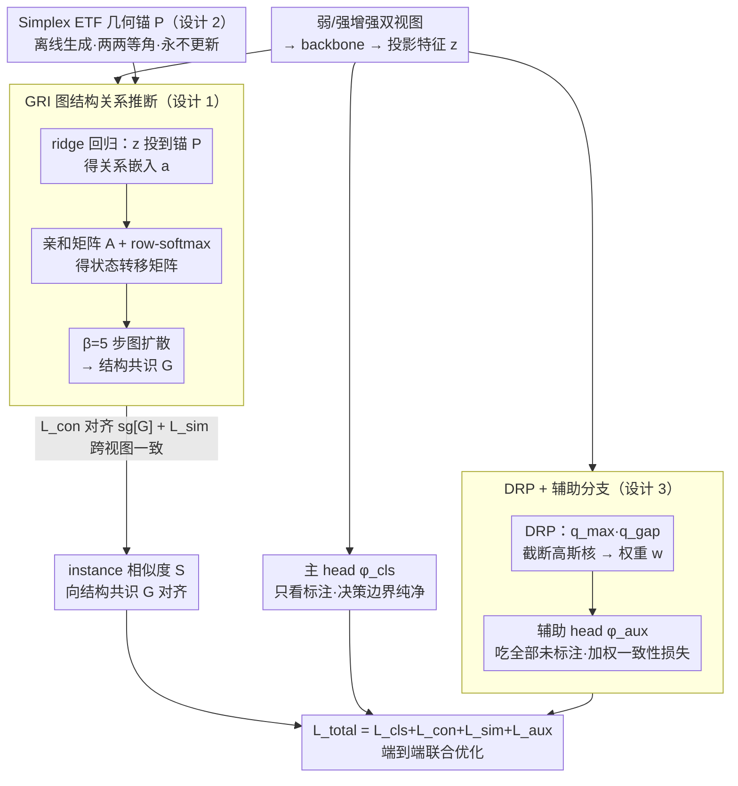

# Beyond Distribution Estimation: Simplex Anchored Structural Inference Towards Universal Semi-Supervised Learning

**会议**: ICML 2026  
**arXiv**: [2605.07557](https://arxiv.org/abs/2605.07557)  
**代码**: https://github.com/Yaxin-ML/SAGE  
**领域**: 半监督学习 / 表示学习  
**关键词**: 通用半监督学习, 等角紧框架, 图结构推断, 伪标签可靠性

## 一句话总结
本文提出 SAGE，把"估计未标注数据分布"换成"在表征空间做结构推断"，用 simplex ETF 几何锚 + 高阶图传播 + 分布无关可靠性加权三件套，在极端标签稀缺且未标注分布任意的 UniSSL 设定下取得平均 8.52% 的准确率提升。

## 研究背景与动机
**领域现状**：主流半监督学习（SSL）走的是"FixMatch 系"路线——给未标注样本打高置信度伪标签，再做一致性正则。后来 LTSSL 把场景扩展到长尾，ReaLTSSL 进一步允许未标注数据和标注数据分布不一致。

**现有痛点**：FreeMatch / SoftMatch 这类方法**默认未标注数据是均匀分布**，靠分布对齐或熵最大化强行把伪标签拉成均匀，遇到真实的任意分布就大量产生假阳。CPG / SimPro 这类"动态估计分布"的方法在标签极少时（每类只有 4 个甚至 1 个标注样本）根本估不准，伪标签崩坏后会引发表征塌缩（t-SNE 上类簇互相混叠，silhouette 系数骤降）。

**核心矛盾**：所有现有方法都把"伪标签 → 表征"这条信号链当成主线，但伪标签本身就不可靠，且越是 long-tail / 任意分布越不可靠，越想"对齐分布"就越偏。作者通过一个诊断实验发现：**样本之间的关系比伪标签本身可靠得多**——在训练过程中，错误伪标签被"邻居关系"纠正回正确类别的比例稳步上升并稳定在很高的水平。

**本文目标**：在极端标签稀缺 + 未标注分布完全未知的 UniSSL 设定下，绕开"先估分布再生成伪标签"的死循环，让模型能在不知道 $\gamma_u$ 的情况下学到判别性表征。

**切入角度**：把焦点从"分布估计"挪到"表征级结构推断"——用样本之间的高阶关系建立"结构共识"作为监督信号，再配一组固定几何锚强行把不同类的表征推到最大等角间距。

**核心 idea**：用 simplex 等角紧框架（ETF）作为坐标系做 ridge 回归得到关系嵌入 → 在关系图上做 $\beta$ 步 graph diffusion 得到"结构共识矩阵" → 用它代替伪标签去对齐 instance-wise 相似度。

## 方法详解

### 整体框架
SAGE 在 FixMatch 类的双视图（弱/强增强）SSL 框架上加了三个模块：(1) **GRI 图结构关系推断**——把每个样本的投影特征 $\mathbf{z}_i$ 投到固定的 simplex ETF 锚 $\mathbf{P}$ 上得到关系嵌入 $\mathbf{a}_i$，由 $\mathbf{a}_i$ 间内积构造亲和矩阵 $\mathbf{A}$，再用 $\beta$ 步 Markov 传播得结构共识 $\mathbf{G}=\hat{\mathbf{P}}^\beta$，作为"软监督"指导 instance-wise 相似度 $\mathbf{S}$；(2) **Simplex ETF 锚生成**——一次性离线构造 $K=d+1$ 个零中心、单位范数、两两等角的固定向量作为类无关坐标系；(3) **DRP 分布无关可靠性加权 + 辅助分支**——用 max-confidence 和 top-2 margin 两个分布无关统计量结合 EMA 给伪标签加权，并把伪标签流量隔离到辅助 head $\phi_{aux}$，主 head $\phi_{cls}$ 只看标注数据保证决策边界纯净。最终目标 $\mathcal{L}_{total}=\mathcal{L}_{cls}+\mathcal{L}_{con}+\mathcal{L}_{sim}+\mathcal{L}_{aux}$ 端到端联合优化。

### 关键设计

**1. Graph-state Relational Inference (GRI)：用样本间高阶关系替代不可靠的伪标签**

UniSSL 的死结是"伪标签 → 表征"这条主线，但伪标签本身就不可靠，越是 long-tail / 任意分布越离谱。作者的诊断实验给出一个出路——样本之间的关系比伪标签可靠得多（训练中错误伪标签被"邻居关系"纠正回正确类的比例稳步升到很高水位）。GRI 就把监督信号换成这个关系。每个样本的投影特征 $\mathbf{z}_i$ 通过 ridge 回归 $\min_{\mathbf{a}_i}\|\mathbf{z}_i-\mathbf{a}_i\mathbf{P}\|_2^2+\lambda\|\mathbf{a}_i\|_2^2$ 得到闭式关系嵌入 $\mathbf{a}_i=(\mathbf{z}_i\mathbf{P}^\top)(\mathbf{P}\mathbf{P}^\top+\lambda\mathbf{I})^{-1}$；亲和矩阵 $\mathbf{A}_{ij}=\langle\mathbf{a}_i,\mathbf{a}_j\rangle$ 经 row-softmax 得 $\hat{\mathbf{P}}$，做 $\beta=5$ 步 diffusion 得到结构共识 $\mathbf{G}=\hat{\mathbf{P}}^\beta$。

对比损失 $\mathcal{L}_{con}=\text{BCE}(\mathbf{S},\text{sg}[\mathbf{G}])$ 把当前 instance 相似度 $\mathbf{S}_{ij}=\sigma(\langle\mathbf{z}_i,\mathbf{z}_j\rangle)$ 对齐到 $\mathbf{G}$，再加 $\mathcal{L}_{sim}$ 让弱/强增强视图的特征跨视图相似。用高阶传播而非单步邻居，是因为多步扩散能把分散的局部关系汇成稳定的全局共识，对噪声更鲁棒；stop-gradient 则防止结构信号被自身梯度污染。

**2. Simplex 等角紧框架几何锚：用与类频率无关的固定坐标系对抗塌缩**

long-tail 下可学习的 prototype 会被多数类拽偏，导致类簇互相混叠、silhouette 骤降。SAGE 改用一组一次性离线生成、永不更新的固定锚来强制类间最大等角分离。构造上取随机 Gaussian 矩阵 QR 分解得正交 $\mathbf{Q}$，中心化矩阵 $\mathbf{O}=\mathbf{I}_K-\frac{1}{K}\mathbf{1}_K\mathbf{1}_K^\top$ 的 $d$ 个非零特征向量组成 $\mathbf{V}$，最终锚阵 $\mathbf{P}=\sqrt{\frac{K}{K-1}}\mathbf{V}\mathbf{Q}^\top$，满足 $\mathbf{P}^\top\mathbf{1}_K=\mathbf{0}$、每行单位范数、$\mathbf{p}_i^\top\mathbf{p}_j=-\frac{1}{K-1}$——这正是 $\mathbb{R}^d$ 上 $K$ 个向量能达到的最大等角间距。

这组 ETF 锚一旦固定就提供与样本数无关的几何不变性，把表征学习从分布先验里解耦出来；它也正是 GRI 里 ridge 回归的坐标系，于是"等角性"自然从锚传递到关系嵌入空间。

**3. Distribution-agnostic Reliability Prioritization (DRP) + 辅助分支：选可靠伪标签并隔离错误**

不知道未标注分布 $\gamma_u$ 时，怎么挑可靠伪标签又不让错误污染主分类器？DRP 用两个分布无关统计量打分：对每个未标注样本算 $q_{max}=\max(\mathbf{q}_w)$（绝对确定性）和 $q_{gap}=q_w^{(1)}-q_w^{(2)}$（相对判别性），各维护 EMA 均值 $\mu_\kappa$ 和方差 $\sigma_\kappa^2$，用截断高斯核 $\mathcal{W}(q_\kappa;\mu_\kappa,\sigma_\kappa)=\exp(-\frac{[\min(0,q_\kappa-\mu_\kappa)]^2}{2\sigma_\kappa^2})$ 给样本加权（高于均值满分 1，低于按距离指数衰减），最终权重 $w=\mathcal{W}_{max}\cdot\mathcal{W}_{gap}$。

这两个量都不依赖任何类别分布假设，是真正"协议无关"的可靠性度量。架构上再加一个辅助 head $\phi_{aux}$ 处理所有未标注数据，主 head $\phi_{cls}$ 只吃标注样本——把伪标签梯度限制在 $\phi_{aux}$ 内，几乎零成本地保证主分类边界不被噪声外溢污染。

### 损失函数 / 训练策略
$\mathcal{L}_{total}=\mathcal{L}_{cls}+\mathcal{L}_{con}+\mathcal{L}_{sim}+\mathcal{L}_{aux}$；backbone 用 WRN-28-2，SGD + 0.9 momentum + 5e-4 weight decay，cosine 学习率从 0.03 衰减，共训 $2^{18}$ 步；$\lambda=0.1$、$\beta=5$ 固定不调；标注 batch 64，未标注 batch $7\times64$；单卡 RTX 4090。

## 实验关键数据

### 主实验
在 CIFAR-10/100、SVHN、STL-10、Food-101 五个数据集、Uniform/Long-tailed/Arbitrary 三种未标注分布下与 9 个 baseline 对比。

| 数据集 / 设定 | 指标 | SAGE | 最强 baseline | 提升 |
|---------------|------|------|----------------|------|
| CIFAR-10 平均 (9 设定) | Acc% | 见表 | CGMatch 58.38 / CPG 系列 | 平均 **+8.52 pp** |
| CIFAR-10, $N=40, \gamma_u=150$, Arbitrary | Acc% | 显著优于 | FreeMatch 45.38 / SoftMatch 42.82 / CGMatch 49.92 | 大幅领先 |
| SVHN $(N_{max},M_{max},\gamma_l,\gamma_u)=(4,4996,1,150)$ | Silhouette↑ | 高 | FreeMatch / CPG 显著低 | 表征显著更分离 |

对比可见：(i) FreeMatch 类 SSL 在 long-tailed/arbitrary 设定下退化到 50% 上下；(ii) SimPro 在极端标签稀缺（$N=40$）下完全崩盘，准确率仅 ~16%（基本随机），证明它的分布估计模块在没足够监督时失效；(iii) SAGE 跨所有设定稳定领先。

### 消融实验
原文图 9 + Appendix 给出关键模块去除后的表现（数值需参考文中可视化）：

| 配置 | 关键现象 | 说明 |
|------|----------|------|
| Full SAGE | 高 Acc + 高 silhouette | 完整模型 |
| w/o GRI (去结构推断) | 退化到 baseline 水平 | 失去高阶关系监督，伪标签噪声直接污染表征 |
| w/o Simplex ETF 锚（用学习 prototype 替代） | long-tail 下类簇被多数类拽偏 | 几何锚是抗塌缩关键 |
| w/o DRP + 辅助分支 | Acc 下降，错误伪标签外溢到主 head | 隔离机制+加权两件套缺一不可 |
| 伪标签纠正率（GRI 监督） | 随训练单调上升至高水位 | 证实"关系比伪标签可靠" |

### 关键发现
- "**inter-sample 关系比伪标签可靠**"这个观察在所有设定下都成立，这是整篇方法的奠基石。
- Simplex ETF 锚带来的 silhouette 提升非常明显，说明 long-tail 下表征塌缩的根因确实是缺乏几何先验，而不仅仅是伪标签噪声。
- 把 $\phi_{cls}$ 和 $\phi_{aux}$ 解耦是一个非常便宜的设计，几乎零成本地把噪声梯度限制住。
- 方法对 $\lambda$、$\beta$ 不敏感（Appendix D），$\beta=5$ 是合理的扩散步数——太少不足以传播，太多趋向平凡稳态分布。

## 亮点与洞察
- **范式转换**：从"估分布 → 生成伪标签 → 学表征"切换到"建几何锚 → 推关系图 → 学表征 → 反推伪标签"，把信号链条反过来，让稳定的几何结构成为主轴。这种 reframing 在 ReaLTSSL 文献里相当少见。
- **ETF 锚 + 关系嵌入**：用 ridge 回归 $\mathbf{a}_i=(\mathbf{z}_i\mathbf{P}^\top)(\mathbf{P}\mathbf{P}^\top+\lambda\mathbf{I})^{-1}$ 解释成"把样本投到几何坐标系下的坐标"是非常巧妙的——既保证关系嵌入有解析解（不需要额外学习参数），又把几何锚的"等角性"自然传递到关系空间。
- **分布无关统计量**：$q_{max}$ 和 $q_{gap}$ 的组合避开了任何对类别分布的假设，是真正"协议无关"的可靠性度量，可以无缝迁移到任何未知分布场景。

## 局限与展望
- 类数 $C$ 大时 simplex ETF 要求嵌入维度 $d\geq C-1$，对小模型/小投影头是约束。
- 图传播步数 $\beta$ 在大 batch 下计算量随 $|\mathbf{B}|^2$ 增长，scale 到 ImageNet 级别需要 mini-batch 内传播或采样近似。
- 方法把 batch 内所有未标注样本视为"关系图节点"，没有考虑 cross-batch / cross-epoch 的全局结构，可能漏掉远距离 manifold 拓扑。
- 几何锚是固定的，没探索"任务相关的自适应锚生成"，未来可结合 prompt-learning 给文本/多模态 SSL 用。

## 相关工作与启发
- **vs FreeMatch / SoftMatch**：他们靠动态 confidence threshold 选样本，本文用 GJS 不需要的几何 + 结构监督完全替代了 confidence-based 选择，对未知分布更鲁棒。
- **vs CPG / SimPro**：他们显式/隐式估计未标注分布，在极端标签稀缺下崩坏；SAGE 完全绕开分布估计这一步。
- **vs Neural Collapse / DR-DSN 系**：那些工作用 ETF 作为分类器权重的目标，SAGE 把 ETF 用作"关系坐标系"和"对比锚"，用法更上游、更抗噪声。
- **启示**：在伪标签不可靠的任何任务（开放集 SSL、噪声标签学习、long-tail 检测），"换信号源"的策略值得借鉴——找到比标签更稳健的信号（结构、几何、关系）作为主导监督。

## 评分
- 新颖性: ⭐⭐⭐⭐⭐ 把"分布估计"换成"结构推断"的范式转换在 ReaLTSSL 文献里属于真正的新角度
- 实验充分度: ⭐⭐⭐⭐ 五数据集 + 多种 imbalance ratio + 9 baseline，但缺 ImageNet-scale 验证
- 写作质量: ⭐⭐⭐⭐ 动机层层递进，从诊断实验到方法的逻辑链非常顺；公式略密
- 价值: ⭐⭐⭐⭐ 提出 UniSSL 这一更现实的 setting + 平均 +8.52 pp 的稳定提升，对真实场景 SSL 有直接落地价值

<!-- RELATED:START -->

## 相关论文

- [\[ICML 2026\] Understanding Self-Supervised Learning via Latent Distribution Matching](understanding_self-supervised_learning_via_latent_distribution_matching.md)
- [\[AAAI 2026\] Explanation-Preserving Augmentation for Semi-Supervised Graph Representation Learning](../../AAAI2026/self_supervised/explanation-preserving_augmentation_for_semi-supervised_graph_representation_lea.md)
- [\[ICML 2026\] InfoAtlas: A Foundation Model for Zero-Shot Statistical Dependence Estimation](infoatlas_a_foundation_model_for_zero-shot_statistical_dependence_estimate.md)
- [\[AAAI 2026\] Let the Void Be Void: Robust Open-Set Semi-Supervised Learning via Selective Non-Alignment](../../AAAI2026/self_supervised/let_the_void_be_void_robust_open-set_semi-supervised_learning_via_selective_non-.md)
- [\[ICML 2026\] Can Local Learning Match Self-Supervised Backpropagation?](can_local_learning_match_self-supervised_backpropagation.md)

<!-- RELATED:END -->
