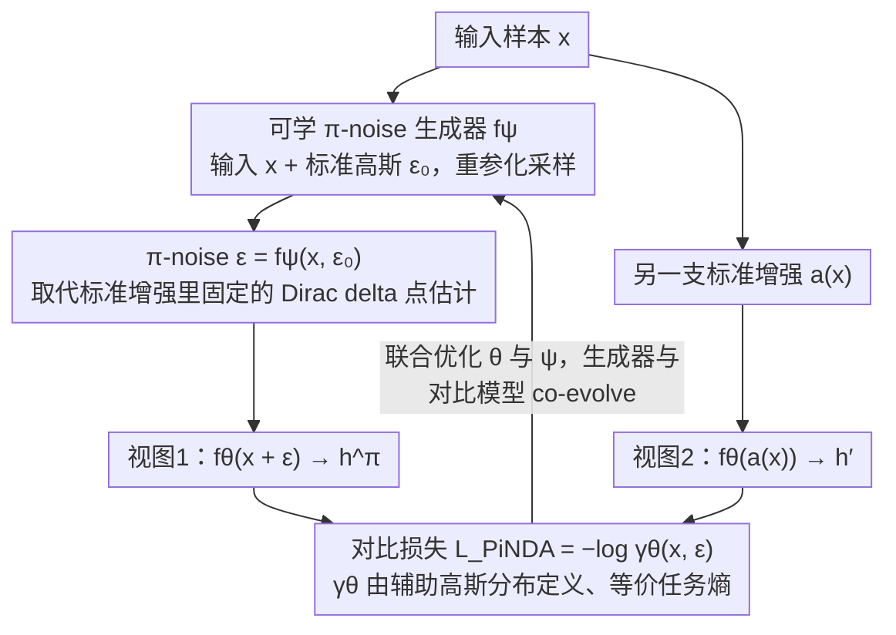

# Data Augmentation of Contrastive Learning is Estimating Positive-incentive Noise

**会议**: ICML 2026  
**arXiv**: [2408.09929](https://arxiv.org/abs/2408.09929)  
**代码**: https://github.com/hyzhang98/PiNDA  
**领域**: 自监督 / 对比学习 / 噪声学习  
**关键词**: Positive-incentive Noise, 数据增强, 任务熵, 可学习噪声生成器, 信息论

## 一句话总结
作者证明对比学习里的"预定义数据增强 (旋转/裁剪/翻转)"等价于对 Positive-incentive Noise (π-noise) 的点估计, 然后把 π-noise 从"点估计"升级为可学习分布, 训练一个 π-noise 生成器在原图上加可学噪声当增强 (PiNDA), 使 SimCLR / BYOL / SimSiam / MoCo / DINO 在 vision 上稳定涨点, 且天然适配 HAR / Reuters / Epsilon 等无人工增强的非视觉数据。

## 研究背景与动机
**领域现状**：自监督对比学习 (SimCLR / MoCo / BYOL / DINO / CLIP) 已是表示学习主流, 核心机制是用 InfoNCE 拉近 positive pair (同一张图的两种增强) 同时推开 negative。在视觉上有一套经过 100+ 篇论文锤炼的强增强 (随机裁剪、颜色抖动、blur、灰度等), SimCLR 论文也明确指出增强是性能"最关键的杠杆"。

**现有痛点**：(1) 视觉增强严重依赖人工设计, 换到 graph (随机丢边/节点) 或纯向量数据 (HAR、文本特征) 立刻失效或极不稳定; (2) DACL / MODALS / SimCL 等尝试在向量上加"随机噪声"做增强, 但噪声超参全靠人工或 policy search, 没有原理性指导; (3) CLAE 用对抗扰动 maximize 损失, 是启发式的"反向利用"; 整个领域缺少一个统一的"什么噪声对对比学习有益"的理论框架。

**核心矛盾**：对比学习需要"扰动后语义不变"的增强, 但语义不变性本身不可测; 既无法穷举所有可能扰动, 又无法形式化"哪种扰动是好的", 不得不退回到人工/启发式。

**本文目标**：(1) 给对比学习里的"数据增强"一个信息论解释, (2) 把 π-noise 框架嫁接进来, (3) 设计一个可学的增强生成器, 适配所有数据模态。

**切入角度**：作者注意到 Pi-Noise 框架定义了"对任务有益的噪声"$\mathcal{E}$ 即满足 $\text{MI}(\mathcal{T}, \mathcal{E}) > 0$ 的噪声; 而对比学习的损失本身就是一种"任务难度度量"。如果能把对比损失嫁接到 π-noise 的"任务熵 $H(\mathcal{T})$"定义里, 就能把"数据增强"重新表述为"对 $\mathcal{E}$ 的某种估计"。

**核心 idea**：定义辅助 Gaussian 分布 $p(\alpha|x) = \mathcal{N}(0, \gamma_{\theta^*}(x)^{-1})$, 其中 $\gamma_{\theta^*}(x) = \exp(-\ell(x; \theta^*))$ 是对比损失指数化, 让 $H(\mathcal{T})$ 与对比损失一一对应; 然后证明预定义增强等价于把噪声分布 $p(\varepsilon|x)$ 当成 Dirac delta (即点估计); 最后用可学的 π-noise 生成器替换点估计, 得到 PiNDA。

## 方法详解

### 整体框架
PiNDA 由两个网络组成: (1) 对比模型 $f_\theta$ (如 ResNet-18, 任意 SimCLR/BYOL backbone), (2) π-noise 生成器 $f_\psi$ —— 用重参化技巧 $\varepsilon = f_\psi(x, \epsilon)$ 从标准 Gaussian $\epsilon$ 出发生成 $\varepsilon$。训练时, 对每个样本 $x$: (a) 从 $f_\psi$ 采 $\varepsilon$ 作为增强, 算 $h^\pi = f_\theta(x + \varepsilon)$, (b) 用另一标准增强 $a(\cdot)$ 得 $h' = f_\theta(a(x))$, (c) 用 $(h^\pi, h')$ 作 positive pair 算 InfoNCE 风格的 $\mathcal{L}_{\text{PiNDA}}$, 同时更新 $\theta$ 与 $\psi$。PiNDA 完全兼容已有增强: 若有标准 $\mathcal{A}$, 把 PiNDA 作为 $\mathcal{A}$ 中的一个候选随机采样即可; 没有 $\mathcal{A}$ 时退化为"原图 vs 噪声增强"。

### 关键设计
1. **辅助 Gaussian 分布 → 把对比损失转成"任务熵"**:

    - 功能: 给"对比学习有多难"一个可形式化的概率量, 把它接入 π-noise 框架的信息论计算。
    - 核心思路: 对每个样本定义辅助变量 $\alpha | x \sim \mathcal{N}(0, \gamma_{\theta^*}(x)^{-1})$, 其中 $\gamma_{\theta^*}(x) = \ell_{\text{pos}} / (\ell_{\text{pos}} + \ell_{\text{neg}}) = \exp(-\ell(x; \theta^*))$。损失越小 → $\gamma$ 越大 → 方差 $1/\gamma$ 越小 → Gaussian 熵越小 → 任务越简单。任务熵 $H(\mathcal{T}) = \mathbb{E}_{x \sim p(x)} H(\mathcal{N}(0, \gamma_{\theta^*}(x)^{-1}))$, 下界为 $H(\mathcal{N}(0, 1))$ (因为 $\gamma \in [0, 1]$)。
    - 设计动机: π-noise 框架原始定义用 $p(y|x)$ 算 $H(\mathcal{T})$, 在无监督场景下无 $y$; 这里用对比损失替代, 使框架在自监督场景同样可用。Gaussian 选择简洁可解析, 任意单调映射 $\kappa$ 都行, 不影响理论结果。

2. **证明"预定义增强 = π-noise 点估计"**:

    - 功能: 给出"为什么标准 SimCLR 实际上就是在做 π-noise 优化"的理论桥梁, 把整个对比学习社区已有工作纳入框架。
    - 核心思路: 在条件熵 $H(\mathcal{T}|\mathcal{E})$ 的 Monte Carlo 估计里, 若令 $p(\varepsilon|x) = \delta_{\varepsilon_0}(\varepsilon)$ (Dirac delta, 即固定一个预定义增强 $\varepsilon_0$), 化简后 $-H(\mathcal{T}|\mathcal{E}) \approx \frac{1}{n}\sum_x \log \gamma_\theta(x, \varepsilon_0) - \frac{1}{2}$。这与最大化 $\sum \log \gamma_\theta = -\mathcal{L}_{\text{InfoNCE}}$ 等价 —— 即"最大化 $\text{MI}(\mathcal{T}, \mathcal{E})$"在点估计下退化为"最小化 InfoNCE"。
    - 设计动机: 这是论文最关键的理论结论 —— 它告诉我们 SimCLR 早就在隐式做 π-noise 估计, 只不过用了 Dirac delta 这个最粗的点估计, 自然限制了表达力; 这就给"扩展到 learnable distribution"提供了天然的改进方向, 而不只是又一篇启发式增强。

3. **可学习 π-noise 生成器 + 重参化训练**:

    - 功能: 把 Dirac delta 升级为 $p_\psi(\varepsilon | x)$ 可学分布, 让网络自己发现"什么噪声对当前对比任务最有益"。
    - 核心思路: $f_\psi$ 输入 $x$ 与标准 Gaussian $\epsilon$, 输出参数化噪声 $\varepsilon = f_\psi(x, \epsilon)$ (论文实验用 mean=0, 学方差 $\Sigma$ 的 Gaussian, 也试了 mean 非零和 uniform); 通过重参化技巧让梯度反传到 $\psi$。Monte Carlo 估计的 PiNDA 损失 $\mathcal{L}_{\text{PiNDA}} = -\frac{1}{n}\sum_x \mathbb{E}_{\epsilon} \log \gamma_\theta(x, \varepsilon)$ 与 InfoNCE 形式一致, 但 $\varepsilon$ 是可学的。两个网络 $\theta, \psi$ 联合优化, 端到端。
    - 设计动机: 让生成器和对比模型 co-evolve, 模型变难 → 生成器学更具挑战性的 $\varepsilon$; 模型变强 → 生成器更精细。Figure 1 的可视化显示, 学到的 $\Sigma$ 在 STL-10 上呈现"style transfer 风格"的纹理, 即生成器自发学到了类似传统视觉增强的扰动。

### 损失函数 / 训练策略
$\mathcal{L}_{\text{PiNDA}} = -\frac{1}{n}\sum_x \mathbb{E}_{\epsilon \sim p(\epsilon)} \log \frac{\ell_{\text{pos}}(x, \varepsilon; \theta)}{\ell_{\text{pos}}(x, \varepsilon; \theta) + \ell_{\text{neg}}(x, \varepsilon; \theta)}$。算法 1 描述单一 PiNDA 增强场景, 算法 2 描述与 SimCLR 标准增强混合 (PiNDA 作为 $\mathcal{A}$ 的一个候选, 采到时才走 $f_\psi$, 反传梯度到 $\psi$)。非视觉数据 backbone 用 3-layer MLP (hidden 1024, embed 256), 视觉用 ResNet-18 / ResNet-50。

## 实验关键数据

### 主实验
4 个非视觉 + 5 个视觉数据集, 用 kNN 与 Softmax Regression 评 representation 质量。

| 数据集 | 方法 | kNN Acc | SR Acc |
|--------|------|---------|--------|
| HAR (传感器) | Random Noise | 77.76 | 77.62 |
| HAR | SimCL | 61.12 | 63.92 |
| HAR | **PiNDA (μ=0)** | 77.14 | **86.20** |
| HAR | CLAE (对抗) | 85.71 | 90.80 |
| HAR | **PiNDA + CLAE** | **86.34** | **91.10** |
| Reuters | Random Noise | 82.84 | 77.30 |
| Reuters | SimCL | 64.20 | 73.63 |
| Reuters | **PiNDA (μ≠0)** | **86.37** | 82.50 |
| Epsilon | SimCL | 50.90 | 59.49 |
| Epsilon | **PiNDA (μ=0)** | **53.20** | **61.53** |
| MSLR-WEB30K | SimCL | 64.21 | 47.13 |
| MSLR-WEB30K | **PiNDA (μ=0)** | **69.62** | 49.55 |
| MSLR-WEB30K | PiNDA + CLAE | 68.66 | 52.18 |

PiNDA 在所有 4 个非视觉数据集上稳超 SimCL (随机噪声 baseline) 与 Random Noise; HAR 上 SR Acc 从 77.62 → 86.20 (+8.6); Reuters kNN 从 82.84 → 86.37 (+3.5); MSLR 上 kNN 64.21 → 69.62 (+5.4)。与 CLAE 叠加后多数情况进一步涨点, 证明 PiNDA 与其他增强正交。

### 消融实验

| 配置 | CIFAR-10 / 100 | 说明 |
|------|----------------|------|
| Full PiNDA (μ=0, learn Σ) | 涨点 | 主配置, 仅学方差 |
| PiNDA (μ≠0, learn μ 和 Σ) | 类似 | 学均值带来视觉化更明显 |
| PiNDA (uniform) | 弱涨 | 噪声分布选择不太敏感 |
| Random Noise (固定) | 不涨 / 跌 | SimCL baseline, 验证"可学"是关键 |
| 无 PiNDA (纯 SimCLR) | 持平 | base |

### 关键发现
- PiNDA 在非视觉数据上贡献最大 (因为没人工增强), HAR 上 +8.6, MSLR 上 +5.4; 视觉数据上贡献较小但仍稳定为正 (CIFAR / STL-10), 因为视觉的强增强已经接近 π-noise 的"最佳点估计"。
- 学到的 $\Sigma$ 可视化在 STL-10 上呈现"style transfer"风格的彩色 mask (Figure 1 第二行), 加到原图后第四行像是色彩与风格变化 —— 生成器自发学到接近视觉增强的扰动模式。
- $\mu = 0$ (仅学 $\Sigma$) 与 $\mu \neq 0$ (学均值与方差) 性能接近, 但前者视觉化更直观, 论文倾向前者; uniform 分布也能涨点, 说明分布选择不太敏感, 关键是"可学"本身。
- 与 CLAE (对抗增强) 叠加几乎总能再涨, 因为 CLAE 是"启发式 π-noise" (maximize loss), PiNDA 是"原理性 π-noise", 两者互补。

## 亮点与洞察
- **理论桥梁的优雅**: "预定义增强 = π-noise 的 Dirac delta 点估计" 这条 reduction 直接给整个 SimCLR/BYOL 文献提供了信息论解释, 又自然引出"升级到 distribution"的方向, 这种"理论-工程双轨道"的论文风格非常值得学习。
- **辅助 Gaussian 分布的设计**: 用 $\gamma_{\theta^*}^{-1}$ 当方差, 让对比损失与熵自然挂钩; 这种"把损失变成概率密度参数"的技巧可推广到任何"用损失度量任务难度"的场景 (例如 RL 的 value, distillation 的 teacher-student gap)。
- **数据模态无关性**: $f_\psi$ 不假设输入数据形状, 在 vector / image / 理论上 graph 都能用; 这是论文最实用的卖点, 因为 graph contrastive / time series contrastive 现有增强都不稳定, PiNDA 是潜在的统一答案。
- **与现有方法正交**: 算法 2 把 PiNDA 设计成"$\mathcal{A}$ 的一个候选", 而不是替换全部增强, 这种工程化思维让 PiNDA 极易嵌入现有 SimCLR / BYOL 训练 pipeline, 几乎零迁移成本。

## 局限与展望
- 论文承认 vision 数据上提升幅度较小, 因为人工增强已经接近"最优 π-noise"; 真正的应用价值在非视觉数据, 但论文非视觉 backbone 仅用 3-layer MLP, 没在 GNN / Transformer 上验证 graph / 文本 / 时间序列 contrastive 的提升。
- $f_\psi$ 加在原图 pixel 空间上学方差, 高分辨率图上参数量爆炸 (例如 ImageNet 224×224×3 ≈ 150K 个独立方差); 论文虽然在 ImageNet 上验证, 但没讨论 $f_\psi$ 的参数化设计。
- 训练成本增加: 每步需多跑一次 $f_\psi$ + reparameterization + 联合反传, 论文没给具体训练时间/吞吐对比。
- "$\gamma_{\theta^*}$ 用 optimal $\theta^*$ 定义"是个理想化假设, 实际只能用当前 $\theta$ 近似; 早期训练 $\theta$ 还不好时, $\gamma_\theta$ 噪声大可能让 $f_\psi$ 学到无效噪声, 论文没分析 early training 的稳定性。
- 把 π-noise 框架嫁接到对比学习需要"任务熵"定义, 论文做了一个具体选择 (辅助 Gaussian), 但不同选择是否影响实证结果未系统对比。

## 相关工作与启发
- **vs SimCL / DACL / MODALS (噪声 / mixup 启发式增强)**: 这些方法把噪声当超参或用 policy search 选, PiNDA 用梯度直接学; HAR / MSLR 上 PiNDA 全面胜出, 验证"梯度学习 > policy search"在增强上的有效性。
- **vs CLAE (对抗增强)**: CLAE 用 maximize loss 启发式, 是"反 π-noise" (最难的扰动); PiNDA 学"刚好降低任务难度"的扰动, 与 CLAE 互补, 实验上叠加涨点。
- **vs SimCLR / BYOL (人工增强)**: 论文证明它们是 PiNDA 的特例 (Dirac delta 点估计), 在视觉上 PiNDA 提升较小说明人工增强已接近最优; 但在非视觉模态 PiNDA 直接拉开差距。
- **vs VPN / PiNI (π-noise 监督场景)**: 同框架, PiNI/VPN 用 label 算 $H(\mathcal{T})$, PiNDA 用对比损失, 适用范围更广 (无监督), 对 π-noise 框架的扩展。

## 评分
- 新颖性: ⭐⭐⭐⭐ "预定义增强 = π-noise 点估计" 的归纳是清晰原创理论; 工程上用 reparameterization 学增强思想已有 (CLAE / MODALS), 但首次给出原理性框架。
- 实验充分度: ⭐⭐⭐ 5 非视觉 + 5 视觉数据集, 与 5+ baseline 对比 + 可视化, 但 backbone 偏简单 (3-layer MLP / ResNet-18), 训练成本与稳定性分析欠缺。
- 写作质量: ⭐⭐⭐⭐ 理论推导清晰严密 (Eq. 6 → 17 一条线), figure 1/3 可视化直观; 部分公式排版略乱影响阅读。
- 价值: ⭐⭐⭐⭐ 给对比学习数据增强提供原理性框架, 对非视觉模态 (向量 / 表格 / 时序) 自监督学习实用价值大; 对理论社区也是 π-noise 框架的重要扩展。

<!-- RELATED:START -->

## 相关论文

- [\[CVPR 2026\] Global-Graph Guided and Local-Graph Weighted Contrastive Learning for Unified Clustering on Incomplete and Noise Multi-View Data](../../CVPR2026/self_supervised/global-graph_guided_and_local-graph_weighted_contrastive_learning_for_unified_cl.md)
- [\[NeurIPS 2025\] Hybrid Autoencoders for Tabular Data: Leveraging Model-Based Augmentation in Low-Label Settings](../../NeurIPS2025/self_supervised/hybrid_autoencoders_for_tabular_data_leveraging_model-based_augmentation_in_low-.md)
- [\[ICML 2026\] Statistical Consistency and Generalization of Contrastive Representation Learning](statistical_consistency_and_generalization_of_contrastive_representation_learnin.md)
- [\[CVPR 2026\] Temporal Imbalance of Positive and Negative Supervision in Class-Incremental Learning](../../CVPR2026/self_supervised/temporal_imbalance_of_positive_and_negative_supervision_in_class-incremental_lea.md)
- [\[ICML 2026\] Inconsistency-Aware Minimization: Improving Generalization with Unlabeled Data](inconsistency-aware_minimization_improving_generalization_with_unlabeled_data.md)

<!-- RELATED:END -->
