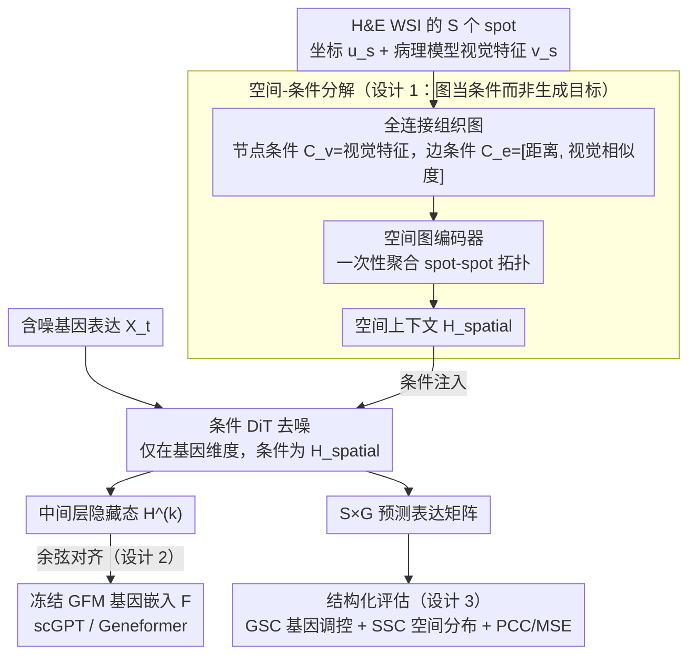

# FLAG: Foundation Model Representation with Latent Diffusion Alignment via Graph for Spatial Gene Expression Prediction

**会议**: ICML 2026  
**arXiv**: [2605.18055](https://arxiv.org/abs/2605.18055)  
**代码**: https://github.com/darkflash03/FLAG  
**领域**: 医学图像 / 空间转录组 / 扩散模型  
**关键词**: 空间转录组, 病理 H&E, 潜在扩散, 图编码器, 基因基础模型对齐

## 一句话总结
FLAG 把"从 H&E 病理图预测空间基因表达"重新表述为结构化分布生成问题，用一个固定的空间图编码器把组织拓扑压成条件向量，再用 DiT 在基因维度去噪，并通过基因基础模型 (GFM) 的中间层对齐注入基因-基因调控先验，从而在保持 PCC/MSE 竞争力的同时把基因结构相关性 (GSC) 和空间结构相关性 (SSC) 拉到新的高度。

## 研究背景与动机

**领域现状**：空间转录组 (ST) 测序昂贵且通量低，但 H&E 全切片图 (WSI) 在临床中随手可得，因此"从 H&E 预测每个 spot 的基因表达"成为热门方向。主流做法是把它当成逐基因的标量回归：HisToGene、BLEEP、TRIPLEX 直接最小化 MSE，或者 Stem、STFlow 用扩散/flow-matching 沿基因维度生成。

**现有痛点**：所有这些方法都用 PCC / MSE 这种逐点指标评估，完全忽略了两类对下游通路分析和空间域识别真正重要的结构性质——基因-基因调控关系 (gene-gene network) 和基因-空间分布 (Moran's I)。结果是逐点指标看起来还行，但生成的表达图缺乏连贯的内部结构：要么过度平滑、要么基因之间的协同模式被打散。

**核心矛盾**：把任务建模成"独立标量回归"和"想恢复完整的多变量分布"之间存在根本冲突。组织→表达的映射本身是一对多的随机映射，回归会把这种方差平均掉。一个自然的修补思路是 graph-diffusion，把 spot 当节点、相关性当边联合扩散；但作者实证发现这条路有一个致命的 **Gene Dimension Curse**：当基因数 $G$ 从 50 涨到 800，联合 node-edge 扩散的 PCC 从 $>0.8$ 一路崩到接近 0，远比 node-only 扩散垮得快。

**本文目标**：(1) 解释为什么联合扩散在高维基因下必然崩溃；(2) 设计一个能同时尊重 spot-spot 拓扑和 gene-gene 调控、又能扩到 200/800 基因的生成框架；(3) 给出能反映生物结构而非只是逐点精度的评估指标。

**切入角度**：作者的关键观察是——当 $G$ 增大时，spot 之间相关性的经验估计会迅速集中到种群值附近，导致"节点-边一致流形" $\{(\mathbf{X},\mathbf{A}):\mathbf{A}=\mathrm{corr}(\mathbf{X})\}$ 急剧变薄，要拟合这个流形上的得分场需要近乎奇异的梯度幅度，远超有限宽度网络的表达能力。所以问题不在网络架构本身，而在于"把高维相关矩阵也当成扩散目标"这个建模选择。

**核心 idea**：不要把图当成生成目标，把它当成空间编码器；用固定拓扑的图编码器把 spot-spot 关系一次性压成空间上下文 $\mathbf{H}_{\text{spatial}}$，让 DiT 只在基因维度去噪；再用预训练 GFM 的基因嵌入对中间表征做表征对齐，把 gene-gene 先验从外部 single-cell 大数据迁过来。

## 方法详解

### 整体框架
输入：一张 H&E WSI 上的 $S$ 个 spot，每个 spot 有 2D 坐标 $u_s$、病理基础模型抽出的视觉特征 $v_s$、以及目标基因表达向量 $x_s\in\mathbb{R}^G$。整条 pipeline 分两个相对独立的支路：

- **左侧（确定性，一次性编码）**：把所有 spot 串成一张全连接图，节点条件 $\mathbf{C}_v$ 是视觉特征，边条件 $\mathbf{C}_e=[d_{ij}, s_{ij}]$ 拼物理距离和视觉相似度；图编码器输出每个 spot 的空间上下文向量 $\mathbf{H}_{\text{spatial}}=\mathrm{GraphEncoder}(\mathbf{C}_v,\mathbf{C}_e)$。
- **右侧（生成式，迭代去噪）**：以 $\mathbf{H}_{\text{spatial}}$ 为条件，在基因维度上跑 DiT 扩散：$\hat\epsilon=\epsilon_\theta(\mathbf{X}_t\mid \mathbf{H}_{\text{spatial}}, t)$。每隔若干 DiT block 取出隐藏态 $\mathbf{H}^{(k)}\in\mathbb{R}^{B\times G\times d_h}$，与从 Geneformer / scGPT 离线抽好的 per-gene 嵌入 $\mathbf{F}\in\mathbb{R}^{G\times d_e}$ 做余弦对齐。

去噪结束就拿到 $S\times G$ 的预测表达矩阵，可以同时算 PCC / MSE 和 GSC / SSC。

### 关键设计

**1. 从联合 node-edge 扩散到空间-条件分解：把图从生成目标改成条件信号**

最自然的修补思路是 graph-diffusion——把 spot 当节点、相关性当边一起扩散。作者真的先做了这个 motivating 方案：把节点 $\mathbf{X}$ 和潜在边 $\mathbf{A}=\mathrm{corr}(\mathbf{X})$ 一起放进扩散，用 Edge-Modulated Attention 让边状态以"结构门控 $1+\mathrm{Linear}(\mathbf{A}_{t,ij})+\alpha\mathrm{Linear}(\mathbf{C}_{e,ij})$"和结构偏置两路调制注意力分数，再加一致性损失 $\mathcal{L}_{\text{cons}}=\mathbb{E}_t\|\hat{\mathbf{A}}_0-\mathrm{Corr}(\hat{\mathbf{X}}_0)\|_1$ 强行让边和节点算出的相关阵闭合。$G=50$ 时配合 Oracle 相关边确实显著涨 PCC，说明"潜在功能拓扑有价值"。

但形式化分析给出 $\mathcal{L}^*_{\text{joint}}(G)-\mathcal{L}^*_{\text{node}}\ge\Omega(G)$ 的下界——随基因数线性增长的优化惩罚躲不掉，这就是 Gene Dimension Curse 的根。FLAG 的对策是反过来用图：不让图当生成目标，而当空间编码器。固定拓扑只做一次性编码，把 spot-spot 关系聚合成空间上下文 $\mathbf{H}_{\text{spatial}}$，让 DiT 只在基因维度去噪。这等于把高维联合分布分解成 $p(\mathbf{X}\mid\mathbf{H}_{\text{spatial}})$——空间结构由图编码器吸收，扩散模型只专心做 gene-gene 分布，既保住了空间正则化，又避开了相关矩阵的曲率爆炸。

**2. Gene Foundation Model 表征对齐：把外部 single-cell 先验注入中间层**

ST slide 数据量小、基因覆盖窄，只看几千个 spot 上的几百个基因，根本估不准基因-基因协方差。FLAG 借 scGPT / Geneformer 这些在数千万 single-cell 上训过的 GFM 来补：离线抽好 per-gene 嵌入 $\mathbf{F}$ 并冻结（推理时完全不用），训练时在某个中间 DiT block 取 hidden $\mathbf{H}^{(k)}$，过一个轻量 MLP 映射到 GFM 嵌入空间，用余弦相似度的负值当损失 $\mathcal{L}_{\text{align}}=-\langle\mathrm{MLP}(\mathbf{H}^{(k)}),\mathbf{F}\rangle / (\|\cdot\|\|\cdot\|+\epsilon)$。

选在中间层对齐而非输入侧拼接是有讲究的：输入侧硬拼会限死去噪自由度，中间层对齐则像给扩散过程加一个"软约束"，既保留它自己的生成能力，又把通路和调控先验灌进去。这条思路本质上是把视觉扩散里 REPA / SVG "用冻结编码器特征对齐扩散状态"那一脉平移到生物领域。

**3. 结构化评估指标 GSC / SSC：让生物结构成为可优化的一阶目标**

过去所有 ST 论文只看 PCC / MSE 这种逐点指标，结果"逐基因数字漂亮但表达图全是糊的"成了通病——基因协同模式被打散、空间分布过度平滑，而这些恰恰是下游通路分析和空间域识别真正依赖的。FLAG 把"结构忠实度"显式量化成两个指标：GSC 比较预测与真值在基因维上的相关矩阵，衡量基因-基因调控完整度；SSC 用每个基因的 Moran's I 衡量空间自相关是否保住，直接对应空间域聚类和 marker 发现。最终目标 $\mathcal{L}_{\text{total}}=\mathcal{L}_{\text{score}}+\lambda_{\text{align}}\mathcal{L}_{\text{align}}$ 里 $\mathcal{L}_{\text{score}}$ 是标准 DDPM 得分匹配。有了 GSC / SSC，病理学家真正关心的结构质量第一次变成了能被直接优化和排名的目标。

### 损失函数 / 训练策略
- 主损失：标准 $\epsilon$-prediction 得分匹配 $\mathcal{L}_{\text{score}}$。
- 辅助损失：GFM 余弦对齐 $\mathcal{L}_{\text{align}}$，权重 $\lambda_{\text{align}}$ 较小（数量级 $10^{-1}\sim 10^{0}$）。
- 数据：HEST-1k 中的 HER2ST / KIDNEY / PRAD 三个 cohort，按 slide 级 7:2:1 分；目标基因用 High-Mean & High-Variance Gene (HMHVG) 选 Top-200。
- 硬件：单卡 NVIDIA H800。

## 实验关键数据

### 主实验
HEST-1k 三个数据集上的 Top-200 HMHVG 评估，按 slide 级 mean ± std 报：

| 数据集 | 指标 | 之前 SOTA (生成式) | 之前 SOTA (判别式) | FLAG | 关键提升 |
|---|---|---|---|---|---|
| HER2ST | PCC ↑ | STFlow 0.706 | TRIPLEX 0.691 | 0.684 | 与最强基线相当 |
| HER2ST | GSC ↑ | Stem 0.832 | TRIPLEX 0.559 | **0.893** | 结构相关性 +6 pt |
| HER2ST | SSC ↑ | Stem 0.381 | TRIPLEX 0.071 | **0.639** | Moran's I 一致性 +26 pt |
| KIDNEY | PCC ↑ | STFlow 0.315 | TRIPLEX 0.374 | **0.392** | 高出判别式最强基线 |
| KIDNEY | GSC ↑ | Stem 0.845 | BLEEP 0.533 | **0.871** | 调控结构最优 |
| PRAD | SSC ↑ | STFlow 0.564 | TRIPLEX 0.634 | **0.751** | 空间分布最忠实 |

读出来三条主要信号：FLAG 的逐点精度 (PCC/MSE) 和最强判别式/生成式基线咬得很紧、互有胜负；但 GSC 和 SSC 几乎在所有数据集都拿到第一，差距明显（HER2ST SSC 0.639 vs STFlow 0.289），证明结构忠实度才是真正被推动的维度。

### 消融实验
HER2ST 上拆解三大组件：

| 配置 | PCC ↑ | MSE ↓ | GSC ↑ | SSC ↑ | 说明 |
|---|---|---|---|---|---|
| Full FLAG | 0.684 | 0.734 | 0.893 | 0.639 | 完整模型 |
| w/o GFM Alignment | 0.668 | 0.794 | 0.871 | 0.589 | 去掉生物先验，PCC/SSC 都掉，证明 GFM 是生物保真度的关键 |
| w/o Spatial Graph | 0.630 | 0.850 | 0.903 | 0.340 | 砍掉图编码器，SSC 几乎腰斩 (0.64→0.34)，说明图就是空间结构来源 |
| w/o Diffusion (Supervised) | 0.675 | 0.786 | 0.322 | 0.569 | 用确定性回归替换扩散主干，PCC 几乎不掉但 GSC 直接崩 (0.89→0.32) |

### 关键发现
- **扩散是反过平滑的关键**：拿掉扩散换成有监督回归后，GSC 从 0.89 暴跌到 0.32，证明 PCC 看不出来的"基因调控结构崩塌"被生成式建模拦下来了——这是对"判别式模型为什么生不出结构"的最直接证据。
- **图和 GFM 是正交的两套先验**：图主管 SSC（空间），GFM 主管 GSC（基因），二者去掉任一项掉点方向不同；说明 FLAG 的因子分解干净，不是把同一个信号绕一遍。
- **Gene Dimension Curse 实证**：随 $G\in\{10,50,100,200,400,800\}$ 增大，joint node-edge diffusion 的 PCC 从 $>0.8$ 一路掉到接近 0；node-only 从 0.8 掉到 0.2；FLAG 在 $G=800$ 仍然保持显著更高的 PCC，对维度的鲁棒性是质变。
- **下游任务才是真考验**：在 HER2ST 上 DEG (Differentially Expressed Gene) Top-50 重合率 0.500、空间域聚类 ARI 0.845 / NMI 0.914，全面碾压所有基线（次优 STFlow ARI 0.600）——结构性指标的提升直接翻译成可用的生物发现。

## 亮点与洞察
- 把"图当生成目标 vs 图当条件信号"提到方法论层面来对比，并给出 $\Omega(G)$ 下界证明为什么前者必败，是很罕见的"先用理论给自己之前的尝试判死刑、再据此设计 v2"的诚实写作。
- GFM 中间层对齐这个 trick 是从 REPA / SVG 那一脉视觉扩散里偷过来的，把"frozen encoder 当生成模型的语义裁判"从 ImageNet 迁到 single-cell，未来很可能在分子设计、蛋白结构生成里被反复 cite。
- 提出 GSC / SSC 几乎是给整个 WSI→ST 子领域换了一套评估语言；如果被采纳，过去靠 PCC 排名的 SOTA 排行榜会被洗一遍。
- 整套框架是"图编码器 + 条件扩散 + 外部基础模型对齐"的非常清晰的三段式结构，技术上几乎每一块都可以平移到别的"高维多变量 + 弱标注 + 有相邻基础模型"场景（如 scRNA-seq 模态对齐、多组学融合、空间蛋白组）。

## 局限与展望
- 评估只在 HEST-1k 三个 cohort，同一组织内 split，没做 zero-shot 跨组织泛化；GFM 嵌入对未见组织的迁移性是开放问题。
- 扩散模型的推理迭代代价较高，没有给出与 STFlow（flow matching 通常更快）公平的延迟对比；临床部署还需要做蒸馏或一致性模型。
- GFM 嵌入是离线、冻结、per-gene 单向量，没有显式建模基因在不同组织/细胞类型下的语境差异；未来可以替换为 context-aware 的细胞-基因联合嵌入。
- HMHVG Top-200 是"挑容易的基因评估"，对超低表达 / 高噪声基因的性能未必同样亮眼；扩到全基因组 (~20K) 是不是还能保持 Gene Dimension Curse 的免疫力，论文只跑到 $G=800$，没给出最终答案。

## 相关工作与启发
- **vs Stem (条件扩散 on H&E)**：Stem 在每个 spot 内做 gene-gene attention 但忽略 spot-spot；FLAG 用图编码器先吃掉空间结构、再让 DiT 专心做基因维度，因此 SSC 大幅领先（HER2ST 0.64 vs 0.38）。
- **vs STFlow (flow matching)**：STFlow 用 graph attention backbone 整体生成，spot-spot 容易"超相关"，Moran's I 散点偏向对角线上方；FLAG 解耦后散点紧贴对角线，定量上 SSC 提升一档。
- **vs 判别式 TRIPLEX**：TRIPLEX 是 PCC 最强的判别式基线，但其 GSC 仅 0.56，过度平滑导致基因调控网络坍塌；FLAG PCC 与其相当，但 GSC / SSC 全面胜出，说明生成式 + 结构先验在"结构保真度"上对判别式有结构性优势。
- **vs REPA / SVG (视觉扩散表征对齐)**：FLAG 把同一套"对齐冻结预训练表征"的思想从图像扩散迁到 ST 任务，并把对齐对象换成 GFM；提供了一个跨模态借鉴的好范例。

## 评分
- 新颖性: ⭐⭐⭐⭐⭐ 把"graph as condition + GFM alignment"组合首次系统化用在 WSI→ST，并配套提出 Gene Dimension Curse 与 GSC/SSC 两个一手概念。
- 实验充分度: ⭐⭐⭐⭐ 三数据集 + 完整消融 + Gene Dimension 扫描 + 两个下游任务 (DEG / 空间聚类)，但未跨组织 / 未到全基因组。
- 写作质量: ⭐⭐⭐⭐⭐ 从 motivating attempt 到失败分析到 v2 设计的叙事链非常清晰，几乎是 ICML 标准教学范本。
- 价值: ⭐⭐⭐⭐⭐ 同时推动了方法 (扩散+图+GFM) 和评估 (GSC/SSC)，对计算病理学社区有重塑评估标准的潜力。

<!-- RELATED:START -->

## 相关论文

- [\[ICML 2026\] Learning Graph Foundation Models on Riemannian Graph-of-Graphs](learning_graph_foundation_models_on_riemannian_graph-of-graphs.md)
- [\[ICLR 2026\] Regularized Latent Dynamics Prediction is a Strong Baseline for Behavioral Foundation Models](../../ICLR2026/self_supervised/regularized_latent_dynamics_prediction_is_a_strong_baseline_for_behavioral_found.md)
- [\[ICML 2026\] NumLeak: Public Numeric Benchmarks as Latent Labels in Foundation Models](numleak_public_numeric_benchmarks_as_latent_labels_in_foundation_models.md)
- [\[ICML 2026\] How 'Neural' is a Neural Foundation Model?](how_neural_is_a_neural_foundation_model.md)
- [\[ICML 2025\] Griffin: Towards a Graph-Centric Relational Database Foundation Model](../../ICML2025/self_supervised/griffin_towards_a_graph-centric_relational_database_foundation_model.md)

<!-- RELATED:END -->
