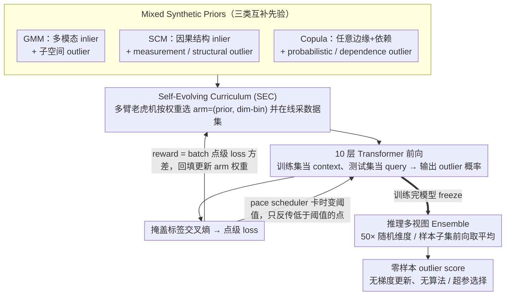

# From Zero to Hero: Advancing Zero-Shot Foundation Models for Tabular Outlier Detection

**会议**: ICML 2026  
**arXiv**: [2602.03018](https://arxiv.org/abs/2602.03018)  
**代码**: https://github.com/psorus/Outformer  
**领域**: 表格基础模型 / 异常检测 / 上下文学习  
**关键词**: 零样本异常检测, Prior-Fitted Networks, 合成数据先验混合, 自演化课程, 多臂老虎机

## 一句话总结
本文提出 OutFormer —— 一个用 GMM/SCM/Copula 三类合成先验混合预训练、靠多臂老虎机自演化课程稳定多任务训练的表格 PFN，做到零样本表格异常检测：上下文 (in-context) 吃训练数据、前向一步给标签，在 ADBench 与两个新 1500+ 数据集 benchmark 上同时拿到 SOTA 排名和接近 shallow 模型的推理延迟。

## 研究背景与动机

**领域现状**：表格异常检测 (OD) 长期被"模型选择 + 超参选择"困住 —— 现实里几乎没有标注的 outlier，shallow 方法 (kNN/LOF/IForest) 要试一堆超参、deep 方法 (DeepSVDD/ICL/DDPM) 还要训模型，每来一份新表都得从头折腾。TabPFN 这条 Prior-Fitted Network 路线证明：在大量合成数据上 pretrain 一个 Transformer，下游只要把训练集当 in-context 喂进去前向一次就能预测，彻底绕开训练和调参，这条思路被 FoMo-0D (Shen et al. 2025) 第一个搬到 OD 上。

**现有痛点**：FoMo-0D 虽然在 ADBench 上排到第二，但 (1) 只用 GMM 一种先验，对真实表里的非高斯边缘分布、因果结构、长尾依赖完全建模不到；(2) 试图换成更丰富的先验时反而比 GMM-only 更差（论文 Table 5：在 ADBench 上 mixed-prior 0.898 < GMM-only 0.920），因为不同先验梯度尺度差太大，GMM 信号被压住；(3) ADBench 才 57 张表，统计显著性不足。

**核心矛盾**：要让 PFN 真在 OD 上"通"，需要 (a) 更丰富的合成先验覆盖真实表的生成机制；但 (b) 朴素混合训练会因 prior 间难度差异导致梯度互相挤兑，反而退化。也就是说"多样性 vs 可训性"必须同时解决，光堆 prior 没用。

**本文目标**：构造能覆盖 inlier/outlier 多种 archetype 的合成 prior 混合，并设计一个不需要人工指定难度顺序的训练课程，让模型在所有 prior 上都学得动，同时把 ADBench/OddBench/OvRBench (合计 1500+ 数据集) 的 SOTA 都吃下来，且推理延迟维持在 shallow 方法水平。

**切入角度**：作者发现这其实是个"非平稳多任务学习"问题 —— 不同 (prior, dimensionality) 组合就是不同的"臂"，每个臂的难度随训练动态变化。这天然适合多臂老虎机框架；进一步如果选取一个能区分"过难/过易/可学"的 reward，就能让模型自己挑当下最值得学的任务，不靠人写课程。

**核心 idea**：三件套——(1) Mixed Prior：GMM (多模态)+ SCM (因果)+ Copula (任意边缘 + 依赖)，对每个 inlier prior 设计与之匹配的多种 outlier archetype；(2) Self-Evolving Curriculum (SEC)：把每个 (prior, dim-bin) 当 MAB 的一个 arm，reward 用 batch 内点级 loss 的方差，自动避开"全错/全对/不确定"的 batch；(3) 推理 ensemble：在 in-context 采样维度+样本上多次前向取平均，绕开 context 长度限制。

## 方法详解

### 整体框架
OutFormer 是 10 层 Transformer (512 hidden, 8 head, 45.1M params)。训练时：每一步先用 MAB 按当前权重选一个 task category $c=(\text{prior}, \text{dim-bin})$，从对应 prior 在线采一份合成数据集 $(\mathcal{D}_{\text{train}},\mathcal{D}_{\text{test}})$，每个数据集含若干 inlier 与 outlier 并带 binary label；模型把 $\mathcal{D}_{\text{train}}$ 当 context、$\mathcal{D}_{\text{test}}$ 当 query，cross-attention 后输出每个 query 是 outlier 的概率，loss 为掩盖标签上的交叉熵；点级 loss 再回填给 MAB 做 reward 更新，决定下一步采哪个 arm；最后按 pace scheduler 只反传低于动态阈值的点。推理时模型完全 freeze，对新真实表把所有训练样本 (默认全部 inlier) 当 context、测试样本当 query 走一次前向，然后用 50 次随机维度/样本子集 ensemble 取平均得到 outlier score —— 整个过程没有梯度更新、没有 OD 算法/超参选择。

### 关键设计

**1. Mixed Synthetic Priors（GMM + SCM + Copula）：覆盖真实表的三类生成机制**

FoMo-0D 只用 GMM 一种先验，对真实表里的非高斯边缘、因果结构、长尾依赖建模不到。OutFormer 把先验扩成三类互补，并为每类配上匹配的 outlier archetype。GMM 模多模态 inlier，并产 contextual subspace outlier（沿子空间放大方差把点推到 90 百分位外）；SCM 用一个随机连边的 MLP 当因果图，按结构方程 $X_j = f_j(X_{Pa(X_j;G)},\epsilon_j)$ 沿拓扑序采样得 inlier，再设计两种 outlier——"measurement outlier"给某变量注入 $\epsilon_j\sim\mathcal{N}(0,s)$ 大方差扰动并沿因果传播，"structural outlier"直接把某条边权置零或反向制造因果突变；Copula 由 Sklar 定理 $F(x_1,\dots,x_d)=C(F_1(x_1),\dots,F_d(x_d))$ 解耦边缘与依赖，边缘从 Gaussian/Beta/Exp/Student-t/Power-law/Log-logistic 池里采，依赖用 Gaussian/Vine copula，outlier 分把 $u_j$ 推向 $\{0,1\}$ 边界的"probabilistic"与翻转 $u_j:=1-u_j$ 或维度置换打破依赖的"dependence"两类。

这三类不是随便堆的：对角实验显示训 Copula 测 SCM 只有 0.76、反之 0.77，而对角线全在 0.92 以上，说明三者既"非平凡"又互补，单用任一种都会丢覆盖。

**2. Self-Evolving Curriculum (SEC) 多臂老虎机：自动把训练压在"可学习"的任务上**

光堆先验反而掉点——朴素 mixed-prior 在 ADBench 上 0.898 比 GMM-only 0.920 还差，因为不同先验梯度尺度差太大，GMM 信号被大梯度先验淹没。作者把这定位成"非平稳多任务学习"问题：每个 (prior, dim-bin) 组合是一个 arm，难度随训练动态变化，天然适合 MAB。每步按温度缩放的当前权重采一个 arm，reward 用 batch 内点级 centered cross-entropy 的方差 $r(c)=\tfrac{1}{n_c}\sum(l_i-\text{mean}(l))^2$——当 batch 里一半"高置信对"一半"高置信错"时最大，当所有点概率都 0.5 时为零；reward 回传更新 arm 权重，再用 pace scheduler 卡一个时变 loss 阈值，只对低于阈值的点反传。

这个 reward 的妙处在于它把"data uncertainty（全 0.5）"判成低优先级而非高难度，同时给"过简单（全对）"和"过难（全错）"都降权，恰好命中 PFN 多任务训练所需的"learnable"信号。问题的根在任务采样分布而非单步几何，所以 SAM 类正则解决不了，MAB 调度才对症——最终把 GMM/Mixed/ADBench 三栏从 (0.87/0.94/0.90) 拉到 (0.93/0.97/0.93)。

**3. 推理时多视图 Ensemble：绕开 context 长度墙并顺手涨点**

PFN 的 Transformer 受 attention 二次复杂度限制，无法把任意大表一次塞进 context（$n>5K, d>100$ 就超）。OutFormer 对每个测试样本做 50 次前向，每次随机抽不同的 in-context inlier 子集（subsampling）和不同维度子集（feature bagging），把 outlier score 取平均。两个维度的随机化降低了"某个特定 context/feature 子集偶然不利"的方差，既把大表拆成可处理的片段，又借了 OD 里经典的 ensemble 涨点。而且因为只做前向、不用反复训练 base learner，这是真正的低成本 ensemble。

### 损失函数 / 训练策略
预训练目标是合成 query 上的二元交叉熵 $\mathcal{L}=\mathbb{E}_{(\mathbf{x},y,\mathcal{D}_{\text{train}})\sim p(\mathcal{D})}[-\log q_\theta(y\mid \mathbf{x}, \mathcal{D}_{\text{train}})]$，相当于近似 PPD $p(y\mid \mathbf{x},\mathcal{D}_{\text{train}})$ 的 KL；SEC 在外层调度数据 prior 与维度，pace scheduler 卡 loss 阈值过滤难点。配置上：1500 batch × 每 batch 1K 合成数据集 × 单数据集最多 5K context inlier + 10K query，4 张 A6000 训完。推理时 frozen 模型 50 次 ensemble 取平均，无任何梯度更新、无 OD 算法/超参选择。

## 实验关键数据

### 主实验 (ADBench, 57 datasets)

| 模型 | Avg. Rank ↓ | ELO ↑ | Winrate ↑ | rAUC ↑ | $C_\Delta$ ↓ | vs OutFormer p-val. |
|------|-------------|-------|-----------|--------|--------------|---------------------|
| DTE-NP (前 SOTA) | 5.12 | 1043 | 0.61 | 0.939 | 0.39 | 0.06 |
| kNN | 5.05 | 1001 | 0.61 | 0.938 | 0.36 | 0.06 |
| LOF | 6.04 | 961 | 0.53 | 0.913 | 0.43 | 0.00 |
| IForest | 8.46 | 794 | 0.32 | 0.879 | 0.52 | 0.00 |
| DDPM | 7.12 | 943 | 0.43 | 0.904 | 0.48 | 0.00 |
| DeepSVDD | 9.81 | 788 | 0.20 | 0.796 | 0.63 | 0.00 |
| TabPFN-OD | 4.74 | 1227 | 0.65 | 0.945 | 0.34 | 0.12 |
| FoMo-0D (前 FM 基线) | 6.00 | 1084 | 0.54 | 0.928 | 0.41 | 0.01 |
| **OutFormer** | **4.02** | **1235** | **0.71** | **0.956** | **0.32** | – |

在合计 1500+ 数据集 (ADBench+OddBench+OvRBench) 的合并榜上 OutFormer 同样拿到 Avg. Rank 5.0 左右的最佳档位 (论文 Table 1, AUROC 排名第一)。AUPRC 全榜对所有 baseline 的 $p\le 0.00$ 显著优胜 (Appx. Table 22)。

### 消融实验 (SEC × Prior 组合, Table 5)

| 配置 | GMM only (test) | Mixed (test) | ADBench (real) | 说明 |
|------|-----------------|--------------|----------------|------|
| GMM-only train | 0.941 | 0.935 | 0.920 | FoMo-0D 原配 |
| Mixed (w/o SEC) | 0.873 | 0.937 | 0.898 | 朴素混合先验，反而掉 ADBench |
| Mixed (w/ SEC) | **0.930** | **0.968** | **0.926** | 完整 OutFormer 方案 |

朴素 mixed 在 GMM 测试集上 0.873 < GMM-only 0.941，量化了"prior 互相挤兑"。加 SEC 后 GMM 回弹到 0.930，同时 Mixed 与 ADBench 都涨，证明 SEC 不是简单 reweight 而是真正解锁了多 prior 的协同。

### 关键发现
- 三类 prior 之间真有"训 A 测 B 掉点"的现象 (Table 4 对角线 vs 非对角线差最多 ~25 个 AUROC 点)，说明真实表里同时存在 multi-modality、因果结构、长尾边缘三种生成机制，单一 prior 在 ADBench 这种异质 benchmark 上必然受限。
- SEC 的关键收益在于"挽救 GMM 信号"：作者在 Appx. Fig. 13 显示 naïve mixed-prior 训练时 GMM 的 loss 反而比 GMM-only 高，意味着大梯度先验抢走了优化器注意力。SEC 通过 batch-loss-variance reward 自动把当下"已经学得动"的 GMM 任务权重抬上去，从而恢复对 ADBench 中 Gaussian-noise-like outlier 的拟合能力。
- 推理延迟方面 (Fig. 2) OutFormer 与 shallow 方法在同一量级 (q10–q90 跨度小)，比 DDPM/DeepSVDD 这类需要训练的 deep 方法快 1–2 个数量级，且因为没有"每个表都要重训"的开销，跨 1500+ 数据集摊销下来的总成本上是无可比的。

## 亮点与洞察
- "三类先验互补"这个观察是工程上很有指导意义的结论：GMM 抓多模态、SCM 抓因果突变、Copula 抓任意边缘 + 依赖结构，三者覆盖了表格数据的主要生成机制，几乎可以当作"做表格 PFN 的标准菜谱"。后来人可以直接复用这套 prior 库做监督表格分类或缺失值填充的 PFN。
- 把 mixed-task pretraining 当 MAB 来调度，是从 LLM 课程学习借鉴到 PFN 的一个简洁迁移。Reward 选 batch loss 方差而不是单点 loss 极有意思 —— 它天然把"内在 data uncertainty"和"模型能学的不确定"区分开，避免课程把全是噪声的任务排到前面。这套 reward 设计可以原样搬到其它需要混合先验训练的 PFN/GFN 模型。
- "零样本 + 速度持平 shallow" 是这篇真正改变工程范式的点：以往跑 OD 要选算法/调超参/训模型，OutFormer 直接前向一次出 score，意味着可以做 OD 的"即开即用云端 API"，而不再需要每个用户自己跑 AutoML。

## 局限与展望
- Context 长度仍是硬墙：单次最多吃 5K context inlier + 10K query × 100 维。对大表 (>100 维或 >10K inlier) 必须用 ensemble 拼接，会带来 50 倍前向开销，且对相关性极强的特征 (feature bagging 后丢信息) 表现可能下降，论文未做高维 (d>500) 的系统实验。
- Prior 设计仍是手工 —— GMM/SCM/Copula 三类是作者选的，并没证明这就是"最优互补集"。如果真实表里出现完全不在这三类生成范围内的分布 (如时序、文本嵌入聚类)，OutFormer 可能仍要重训。
- SEC 的 reward 是 batch-loss variance，对极端不平衡 batch（如 outlier 比例极低或极高）的鲁棒性论文没系统报告；同时 MAB 的 temperature 等超参对效果敏感 (Appx. G.3.1)，"自演化"在工程上仍需调几个超参。
- 训练数据是 binary inlier/outlier label，无法做 outlier score 校准 (calibration) 或细粒度异常类别。下游需要"哪种 anomaly"的场景仍需额外 head。

## 相关工作与启发
- **vs FoMo-0D (Shen et al., 2025)**：前作只用 GMM 一种 prior、无 curriculum，本文把 prior 从 1 类扩到 3 类 + 5 种 outlier archetype，并用 SEC 解决"扩了反而掉点"的副作用，在 ADBench 上 ELO 从 1084 涨到 1235，是同条 PFN 路线上的明显进化版本。
- **vs TabPFN (Hollmann et al., 2023) / TabPFN-OD**：TabPFN 是有标签的表格分类 PFN，本文把它扩展到只有 normal class 标签的 OD setting；论文也复用 TabPFN 做了一个 baseline (TabPFN-OD: 把每个 feature 当预测目标，error 取平均当 outlier score)，OutFormer 仍优于这个适配版，说明专门为 OD 设计的 prior + 课程是必要的。
- **vs DTE-NP (Livernoche et al., 2024)**：DTE-NP 是 ADBench 上的前 SOTA (deep model)，需要每个数据集都训。OutFormer 零样本一次前向就把 Avg. Rank 从 5.12 降到 4.02，证明"换训为预训"在 OD 上行得通。
- **vs unsupervised model selection (Zhao 2021/2022, Ding 2024)**：这条线靠 meta-learning 在历史 OD 任务上学 surrogate 来选模型；本文等价于把"选模型"内化到 PFN 的 ICL 推理里，规模化的合成 prior pretraining 直接吃掉了 meta-OD 这件事。

## 评分
- 新颖性: ⭐⭐⭐⭐ Prior 混合 + MAB 课程的具体组合是新的，单看 PFN/MAB 都是已知组件。
- 实验充分度: ⭐⭐⭐⭐⭐ ADBench + 两个 1500+ 新 benchmark + 11 个 baseline，5 个相对排名指标 + 置换检验，是 OD 领域近年最大规模的对比。
- 写作质量: ⭐⭐⭐⭐ 三个 prior + SEC 讲得清晰，但 Table 编号比较跳（部分关键消融在附录），主文有时要跳到 Appx 验证。
- 价值: ⭐⭐⭐⭐⭐ 直接交付一个开源 plug-and-play 表格 OD 模型，对工业界 OD 选型问题是杀手级方案；同时 prior 库可被其它表格 PFN 复用。

<!-- RELATED:START -->

## 相关论文

- [\[ICML 2026\] InfoAtlas: A Foundation Model for Zero-Shot Statistical Dependence Estimation](infoatlas_a_foundation_model_for_zero-shot_statistical_dependence_estimate.md)
- [\[ICML 2026\] LimiX-2M: Mitigating Low-Rank Collapse and Attention Bottlenecks in Tabular Foundation Models](limix-2m_mitigating_low-rank_collapse_and_attention_bottlenecks_in_tabular_found.md)
- [\[AAAI 2026\] Robust Tabular Foundation Models](../../AAAI2026/self_supervised/robust_tabular_foundation_models.md)
- [\[ICCV 2025\] CObL: Toward Zero-Shot Ordinal Layering without User Prompting](../../ICCV2025/self_supervised/cobl_toward_zero-shot_ordinal_layering_without_user_prompting.md)
- [\[ECCV 2024\] Rethinking Unsupervised Outlier Detection via Multiple Thresholding](../../ECCV2024/self_supervised/rethinking_unsupervised_outlier_detection_via_multiple_thresholding.md)

<!-- RELATED:END -->
