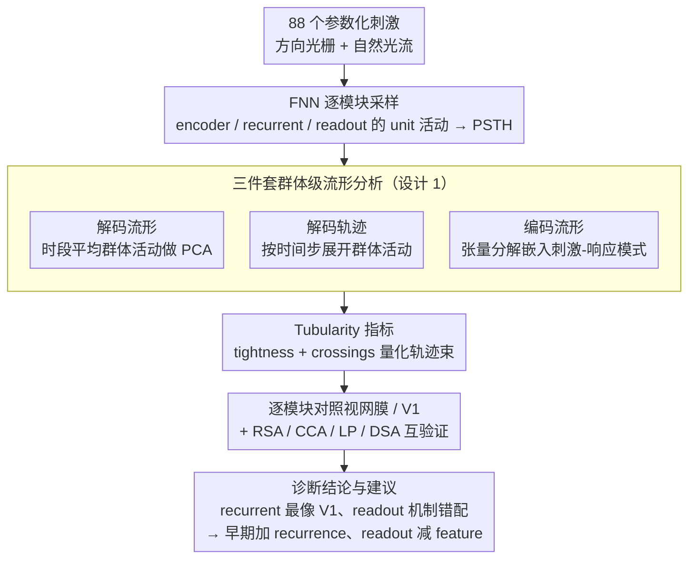

# How 'Neural' is a Neural Foundation Model?

**会议**: ICML 2026  
**arXiv**: [2601.21508](https://arxiv.org/abs/2601.21508)  
**代码**: 无（基于已公开 FNN + 已公开 manifolds pipeline 复用）  
**领域**: 神经科学基础模型 / 可解释性 / 表示学习  
**关键词**: Neural Foundation Model, 解码流形, 编码流形, tubularity 指标, 数字孪生

## 一句话总结
作者把一只"小白鼠视觉皮层的 SOTA 基础模型（FNN）"当成生理学实验对象，用解码流形 / 编码流形 / 解码轨迹三件套挨个分析它的 encoder / recurrent / readout，发现 FNN 的拟合精度主要靠 readout 那一堆同质 feature map 撑起来，而真正"像大脑"的只有 recurrent 模块；并用新提出的 tubularity 指标定量地说"早期编码层缺少生物级时间结构"，给未来神经基础模型给出"早期加 recurrence、readout 减少 feature 维度"的明确建议。

## 研究背景与动机

**领域现状**：数字孪生时代的神经科学涌现出一批"神经基础模型"，能从输入视频直接预测小白鼠初级视觉皮层 V1 等区域的 spike 序列。FNN 在 MICrONS 这种最大规模的 functional connectomics 数据上达到 SOTA（normalized 响应相关性接近 70%），常被当作"硅基双胞胎"用于做干预性脑科学实验。

**现有痛点**：响应相关性是一个"前向预测"指标，它无视"反向问题"——同一个输出能对应多少不同输入。再加上 FNN 内部有上百万 unit、且只能做 pairwise RSA 类分析，目前的对齐评估并不能保证它在 OOD 数据上仍像大脑那样工作。换句话说，"拟合好"不等于"机制对"。

**核心矛盾**：你既需要把模型当黑盒去算对齐分数，又必须"看进黑盒"去验证机制；可现有解释性工具（RSA / CCA / Linear Predictivity / DSA）都是 pairwise 或单层的，捕捉不到群体级时间动力学。

**本文目标**：(a) 在不重新训练 FNN 的前提下，逐模块做生理学风格的群体分析；(b) 引入定量指标比较"模型时间结构 vs. 真实视网膜/V1 时间结构"；(c) 提出对架构的可行改进建议。

**切入角度**：作者从控制论的"可辨识性"观点出发——没有完美前向模型时，必须打开盒子。他们借用神经科学家的三件套：解码流形（看刺激如何在群体活动空间分簇）、编码流形（看神经元在刺激-响应空间如何聚类）、解码轨迹（看群体活动随时间如何演化），第一次把这三者合用到同一个基础模型上。

**核心 idea**：用 "decoding manifold + encoding manifold + decoding trajectory + tubularity metric" 四件套，把 FNN 的每个模块当作一个候选脑区去检查它和真实视网膜 / V1 的群体级动力学是否一致。

## 方法详解

### 整体框架
对 FNN 的 encoder（10 层卷积，含 3D 卷积捕捉 12 步时序）、recurrent（带 attention 的 Conv-LSTM）、readout（Gaussian readout + 每只鼠一个线性映射）三个模块挨个采样 unit 活动；用一组参数化刺激（8 个方向的 drifting square-wave gratings + naturalistic optical flow，共 88 个序列）激发 PSTH。然后在每个模块上做：① 用全时段平均后的群体活动做 PCA，得到解码流形；② 用按时间步展开的群体活动得到解码轨迹；③ 用张量分解（Williams et al., 2018）把神经元按"对 88 种刺激的时空响应模式"嵌入二维，得到编码流形；④ 把上面的对比量化成 tubularity（tightness + crossings），并与既有 RSA / CCA / LP / DSA 互验证。

### 关键设计

**1. 三件套群体级流形分析：把编码、解码、动力学一次性摊开看**

传统 RSA 只能算一对一相似性，看不见"群体几何"，更看不见随时间的演化。本文借神经科学家的三件套来替代它。解码流形里每个点是一次刺激试验，坐标是群体活动 PCA 降维后的位置，同一刺激本该聚成簇（说明可读出）；编码流形里每个点是一个 unit，坐标由张量分解出的"刺激-响应"特征构成，功能相似的 unit 本该邻近；解码轨迹则把每次刺激试验沿时间展开成一条曲线，沿轨迹积分又回到解码流形。

三者合用，恰好对应神经科学家最关心的"编码—解码—动力学"三问：群体的全局拓扑、神经元的局部相似度、活动的时间演化一次性可视化出来，而这正是 pairwise RSA 给不了的视角。

**2. Tubularity 指标（tightness + crossings）：把"像不像生物时间结构"变成数**

要比较"模型时间结构 vs 生物时间结构"，得有可量化的尺子。Tubularity 给每个刺激类的轨迹束定义两个量：$S_{\text{tight}}$ 衡量同一刺激的轨迹是否紧紧聚成一根"管子"（生物视网膜 $S_{\text{tight}} \approx 1.99$，而 FNN encoder L8 仅 $\approx 0.07$，等于完全不成管）；$S_{\text{cross}}$ 衡量不同刺激轨迹之间的交叉次数（生物的交叉显著更多，$p < 0.005$）。两者合起来回答"群体是否像神经一样按刺激展开成稳定却又彼此交互的束"。

它的针对性在于戳穿 DSA 的盲区——DSA 这类动力学相似度会把"原因不同但形状相似"的两条轨迹判成对齐，作者发现 L1 仅靠卷积平移等变性就能自然形成 loop，被 DSA 误判成高度对齐。Tubularity 把"形状对"和"语义对"分开评估，因此能识破这种伪对齐。

**3. 逐模块对照视网膜 vs V1：给每一阶段配一个生物 counterpart**

光有指标还需要参照系，本文用真实脑区当 anchor 逐层对账。视网膜被当作"早期 + 强离散簇"的范例（编码流形高度聚类），V1 当作"晚期 + 平滑连续"的范例（编码流形连续过渡），然后按"该像哪个脑区就比哪个脑区"逐层检查 FNN：encoder 早期应像视网膜，recurrent 应像 V1，readout 应延续 V1 风格。

对账结果很说明问题：encoder 既不像视网膜也不像 V1，还多出一条生物里完全没有的"非选择性强度臂" $\gamma$；recurrent 才首次出现方向选择和管状轨迹，最像 V1；readout 反而塌成大量高度同质的离散簇，离 V1 的连续性最远；output 作为 readout 的线性组合看似平滑，但 PSTH 多为 transient，仍不像 V1。这种逐模块对账能把"哪一层贡献真实生物相关性、哪一层只是在拟合个体差异"切得很清楚，而端到端的高拟合分数完全掩盖了这一点。

### 损失函数 / 训练策略
本论文不训练新模型，全部分析在 Wang et al. 2025 公开的 FNN checkpoint 上完成；只新增一组 tubularity 计算流程，参数都是描述性几何统计，无需训练。

## 实验关键数据

### 主实验

| Region | Enc L1 | Enc L2 | Enc L4 | Enc L5 | Enc L7 | Enc L8 | Rec | Readout | Output |
|---|---|---|---|---|---|---|---|---|---|
| 与 Retina 的平均对齐 (RSA/CCA/LP/DSA) | 0.26 | 0.26 | 0.30 | 0.33 | 0.28 | 0.28 | **0.40** | 0.34 | 0.34 |
| 与 V1 的平均对齐 | 0.29 | 0.21 | 0.32 | 0.30 | 0.30 | 0.32 | **0.53** | 0.38 | 0.48 |

| Stage | Decoding Acc | $S_{\text{tight}}$ (越大越成管) | $S_{\text{cross}}$ (生物显著更高) |
|---|---|---|---|
| Retina (生物) | — | 1.99 | $1.8\times 10^{-6}$ |
| V1 (生物) | — | 0.33 | $4.0\times 10^{-6}$ |
| FNN Encoder L8 | 0.74 | 0.07 | $1.3\times 10^{-5}$ |
| FNN Recurrent | **0.89** | 0.12 | $2.7\times 10^{-7}$ |
| FNN Readout | 0.88 | 0.15 | $3.5\times 10^{-6}$ |
| FNN Output | 0.77 | 0.14 | $4.1\times 10^{-5}$ |

### 消融实验

| 移除项 | 现象 |
|---|---|
| Encoder L8 中的"非选择性强度臂" $\gamma$ | 解码轨迹立刻变成高度稳态、几乎不随时间动，证明前面那点"伪时间结构"完全来自强度上升而非真时间编码 |
| 仅看编码流形 / 仅看解码流形 | 任一单视角都给不出 readout"高度聚簇但 output 又像 V1"这种矛盾结论；三件套合用才看清"output 通过线性组合 readout 的丰富 PSTH 假装连续" |
| DSA 单指标 vs tubularity | DSA 错把 L1 也评成"高度对齐"（因为卷积平移等变性使刺激天然循环），tubularity 戳穿这个伪对齐 |

### 关键发现
- FNN 的分类精度在 recurrent 处达到峰值（0.89），之后反而下降——这非常违反"层越深越好"的直觉，意味着 readout 和 output 主要在做"为每只鼠个性化拟合 spike"，而不是在做更高阶的编码。
- 视网膜的编码流形是"明显聚类"，V1 是"平滑连续"；FNN 的 readout 偏偏走到反面——大量高度同质的离散簇，这是它和生物最大的机制错配；output 看似回归连续却是靠线性组合大量 feature map 的 transient 实现的，并不来自真正的群体动力学。
- 生物轨迹的"$S_{\text{cross}}$"显著大于 FNN：即便都成管，生物群体还有更多群体级交互（可能源自 traveling wave、clique 互作），FNN 缺这部分动力学复杂度。
- 早期 encoder 完全没有 tubular 时间结构，意味着即便加了 3D 卷积，FNN 的早期处理也只是"提取强度特征"而非"形成时间编码"——这条对未来架构改进的提示极强。

## 亮点与洞察
- 把生理学家"做切片实验"的思路移植到基础模型上：不是问"对齐分数多少"，而是问"哪一层在做哪件事、和哪个脑区像"——这种诊断式可解释性比单一对齐数字有意义得多。
- tubularity 是一个简单但很锋利的几何指标，专门戳"形状对但语义不对"的伪对齐；它揭示 DSA 的盲区是这篇论文最实在的方法贡献。
- 把 readout 当"appendage 模块"暴露出来——它扛了大部分拟合精度但用了不像 V1 的机制，提示未来神经基础模型不应再继续堆 feature map，而要把神经多样性的归纳偏置塞进更早的层。
- "早期加 recurrence 模拟 amacrine 连通性、readout 减小 feature 数"两条改进建议直接来自数据观察而非空想，很容易被后续工作落地验证。

## 局限与展望
- 只分析了一个 FNN 模型，跨模型一致性未验证；如果其他视频神经基础模型也表现出类似的"recurrent 才像 V1"模式，结论才更稳。
- 刺激集被限制在 88 个参数化序列以匹配生物对照，覆盖范围仍窄于 FNN 训练时的自然视频；OOD 行为没法完全推断。
- Tubularity 是新指标，没建立 baseline、未做合成数据的鲁棒性测试；和 RSA/DSA 一样可能存在自身偏差。
- 未给出"如果按建议把架构改了，对齐分数能涨多少"的实证——这是工程上最关心的下一步。

## 相关工作与启发
- **vs RSA / CCA / Linear Predictivity / DSA**：传统对齐指标都是 pairwise 或单层 summary，无法看群体动力学；本文用"流形 + tubularity"补上群体几何视角，并且发现 DSA 会被卷积循环结构骗过。
- **vs Doerig et al. 2023 等"用 DNN 解释脑"综述**：综述强调"端到端拟合做得好就证明 DNN 是脑模型"，本文反过来从"机制对账"角度泼冷水，指出预测精度高 ≠ 内部表示像脑。
- **vs Klindt et al. / Lurz et al. 关于 readout 的工作**：Gaussian readout 这种设计长期被当成"既高效又有解释性"，但本文证明它产生的 readout 表示其实远离 V1 流形结构，挑战了这条流行做法。
- 启发：基础模型可解释性可以更"生物化"——用真实脑数据的群体流形当 ground-truth，把模型每层和某个脑区"对账"，比让 LLM-as-judge 或自定义打分都更稳；这条路可以反过来用到 LLM（用人类 fMRI 当 anchor）。

## 评分
- 新颖性: ⭐⭐⭐⭐ 把三件套合用到基础模型 + 提出 tubularity 是少见的方法学贡献；但单个组件均有先例。
- 实验充分度: ⭐⭐⭐⭐ 跨多个层 + 多种指标 + 标准对齐方法对照，但只覆盖一个模型。
- 写作质量: ⭐⭐⭐⭐⭐ 每张流形 / 轨迹图都和生物 ground-truth 并排呈现，可读性极佳。
- 价值: ⭐⭐⭐⭐ 给出可执行的架构改进建议，对神经数字孪生方向有直接推动。

<!-- RELATED:START -->

## 相关论文

- [\[NeurIPS 2025\] Manifolds and Modules: How Function Develops in a Neural Foundation Model](../../NeurIPS2025/self_supervised/manifolds_and_modules_how_function_develops_in_a_neural_foundation_model.md)
- [\[AAAI 2026\] Spikingformer: A Key Foundation Model for Spiking Neural Networks](../../AAAI2026/self_supervised/spikingformer_a_key_foundation_model_for_spiking_neural_networks.md)
- [\[ICLR 2026\] Maximizing Asynchronicity in Event-based Neural Networks](../../ICLR2026/self_supervised/maximizing_asynchronicity_in_event-based_neural_networks.md)
- [\[ICML 2026\] InfoAtlas: A Foundation Model for Zero-Shot Statistical Dependence Estimation](infoatlas_a_foundation_model_for_zero-shot_statistical_dependence_estimate.md)
- [\[ICML 2026\] FLAG: Foundation Model Representation with Latent Diffusion Alignment via Graph for Spatial Gene Expression Prediction](flag_foundation_model_representation_with_latent_diffusion_alignment_via_graph_f.md)

<!-- RELATED:END -->
