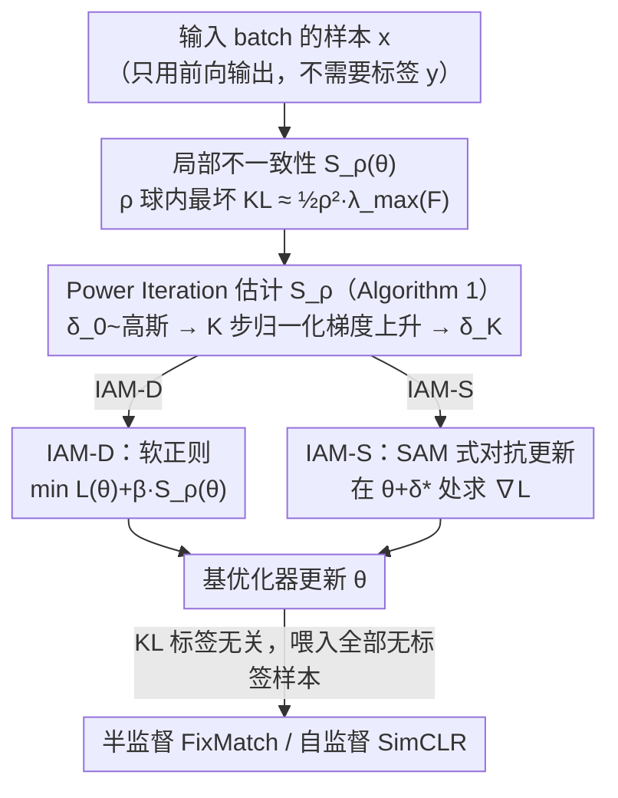

# Inconsistency-Aware Minimization: Improving Generalization with Unlabeled Data

**会议**: ICML 2026  
**arXiv**: [2605.31324](https://arxiv.org/abs/2605.31324)  
**代码**: https://github.com/heesung-k/IAM  
**领域**: 优化与正则化 / 半监督 / 自监督  
**关键词**: 泛化界, Fisher 信息矩阵, 锐度感知优化, KL 散度正则, 无标签数据

## 一句话总结
本文提出一种只用无标签数据就能计算的"局部不一致性" $S_\rho(\theta)$ —— 即参数球内 KL 散度的最坏值 —— 并把它当作训练正则项，得到 IAM 优化器，在监督任务上和 SAM/ASAM 持平甚至更好，在半监督 (FixMatch) 与自监督 (SimCLR) 场景下因能吃无标签批量数据而带来额外提升。

## 研究背景与动机

**领域现状**：深度网络的泛化研究目前主要沿两条线展开 —— 一是以 SAM/ASAM 为代表的锐度感知优化器，把 loss Hessian 的最大特征值 $\lambda_{\max}(H)$ 当作"平坦度"代理量来逼近最小值附近的几何；二是 Jiang 等人提出的 disagreement、Johnson–Zhang 的 inconsistency 这类基于"输出差异"的度量，把多模型/多数据划分之间的 KL 当作泛化代理。

**现有痛点**：两条线各有硬伤。锐度类度量在不同权重衰减、不同数据增广组合下，会出现"局部正相关、全局负相关"的反常现象，被 Andriushchenko 等指出其本质是和训练超参纠缠而非真泛化。Disagreement/inconsistency 虽然只用无标签数据就能算，但定义上要训多套模型再取期望，单模型场景下既不可微也不可正则化，工程上不可用。

**核心矛盾**：作者把矛盾点定位到——能不能找到一个"既只依赖单个模型、又可微、又只需无标签数据"的几何度量，让它既能预测泛化差，又能直接塞进训练 loss 当成正则项？锐度类满足前两条但要训练数据；inconsistency 类只满足"无标签"。

**本文目标**：构造一个新度量 $S_\rho(\theta)$，同时具备 (i) 单模型可算 (ii) 可微 (iii) 只需无标签数据 三条性质；并基于它设计一个能同时服务监督、半监督、自监督的统一正则器。

**切入角度**：从信息几何视角看，KL 散度在参数空间的二阶展开恰好是 Fisher 信息矩阵的二次型 $\tfrac12\delta^\top F(\theta)\delta$，而 Gauss–Newton 近似又让 $F$ 与 loss Hessian $H$ 在交叉熵下重合。如果把"输出分布对参数扰动的最坏 KL"作为度量，那它既继承了锐度类的 Hessian 含义，又因为 KL 是输出空间的量、不需要真实标签，所以无标签可算。

**核心 idea**：定义 $S_\rho(\theta)=\max_{\|\delta\|\le\rho}\mathbb{E}_x[\mathrm{KL}(f(x;\theta)\|f(x;\theta+\delta))]$，证明它近似 $\tfrac12\rho^2\lambda_{\max}(F(\theta))$，再用一步 Power Iteration 算它的梯度，把它当作 SAM 的"KL 替身"塞进训练目标。

## 方法详解

### 整体框架
方法分两层：度量层定义并估计 $S_\rho(\theta)$，优化层把它接入训练目标。度量估计走 Algorithm 1：从各向同性高斯采初始扰动 $\delta_0$，迭代 $K$ 步 normalized gradient ascent —— 因为 KL 对 $\delta$ 的二阶近似是 $F\delta$，所以归一化梯度上升一步等价于 Power Iteration 一步，可以以 $K$ 次反传的代价逼近 $F$ 的主特征向量。优化层提供两种变体：IAM-D 把 $\beta S_\rho(\theta)$ 直接加到训练 loss 上做软正则；IAM-S 仿 SAM，在估计出的扰动点 $\theta+\delta^*$ 处算训练 loss 的梯度，得到 KL 驱动的对抗式更新。整套 pipeline 与 SAM 在每步开销上几乎一致（都需要一次额外的梯度计算），但 KL 那一支只看模型输出分布，不接触 $y$，因此可以在 FixMatch、SimCLR 这类有大批无标签数据的 pipeline 中天然吃进所有无标签样本。

### 关键设计

**1. 局部不一致性 $S_\rho(\theta)$ 与 FIM 的联系：把锐度搬到输出空间**

锐度类度量要标签、inconsistency 类要训多模型，作者要破的就是这个"二选一"。办法是在输出空间而非 loss 空间做几何：定义

$$S_\rho(\theta)=\max_{\|\delta\|\le\rho}\mathbb{E}_x[\mathrm{KL}(f(x;\theta)\|f(x;\theta+\delta))]$$

对 $\delta$ 做二阶 Taylor 展开后它变成 $\max\tfrac12\delta^\top F(\theta)\delta=\tfrac12\rho^2\lambda_{\max}(F(\theta))$，即 Fisher 信息矩阵主特征值乘上半径。关键是 $F$ 只用到 $\nabla_\theta z$ 和 softmax 输出 $f$，整个过程不出现真实标签 $y$；而交叉熵下又有 $H\approx G=F$，所以 $S_\rho$ 在解的邻域里几何上等同于"无标签版的最大特征值锐度"。这一步用 KL 的二阶展开把"输出敏感度"翻译回 FIM 主轴，既继承了锐度的 Hessian 含义又摆脱了对标签的依赖；论文还用 Theorem 4.1 把 $\lambda_{\max}(F_S)$ 嵌进 Luo 等的泛化界，论证近插值时用 $S_\rho$ 替换 $\lambda_{\max}(H)$ 不掉精度。

**2. Power Iteration 一步估计 $S_\rho$：把不可解的 $\max$ 变成便宜的特征向量问题**

$S_\rho$ 定义里那个 $\max_{\|\delta\|\le\rho}$ 在百万维参数空间里直接解不可行，但二阶近似帮了大忙：KL 对 $\delta$ 的梯度恰好是 $F(\theta)\delta$，于是"在 $\rho$ 球内找最大化 KL 的扰动"就退化成"找 $F$ 的主特征向量"。Algorithm 1 据此做归一化梯度上升：从各向同性高斯 $\delta_0\sim\mathcal{N}(0,\tfrac{\sigma^2}{m}I)$ 起步，迭代 $\delta_{k+1}=\rho\,g_k/\|g_k\|$（$g_k=\nabla_\delta\mathbb{E}_x\mathrm{KL}(f(x;\theta)\|f(x;\theta+\delta))$），每一步正好等价于对 $F$ 做一次 Power Iteration，所以 $K=1$ 就能逼近主特征方向、拿到 $\delta_K\approx\delta^*$。代价是 $K$ 次额外反传，取 $K=1$ 时恰好和 SAM 的一步对抗扰动同开销，使两者在"每步成本"上公平可比。

**3. IAM-D 与 IAM-S：把 $S_\rho$ 注入训练的两个接口**

拿到扰动 $\delta_K$ 后，Algorithm 2 给出两种把局部不一致性写进参数更新的方式。IAM-D 走软正则路线，直接最小化 $L(\theta)+\beta S_\rho(\theta)$，让模型在拟合数据的同时主动压低输出分布对扰动的最坏移动量。IAM-S 走 SAM 路线，在扰动点 $\theta+\delta^*$ 处求训练 loss 的梯度 $\nabla_\theta L|_{\theta+\delta^*}$ 来更新——区别在于扰动方向 $\delta^*$ 来自最坏 KL 而非 SAM 的训练梯度。由于 $\pm\delta$ 等概率被采到，一阶项 $\delta^\top\nabla_\theta L$ 在期望下相互抵消，使 IAM-S 实际隐式压制的正是 $G(\theta)=F(\theta)$ 的主特征值。经验上 IAM-S 在纯监督任务上更稳，IAM-D 因为是一个独立可加的正则项、更容易即插即用地拼到 FixMatch/SimCLR 里。

**4. 无标签数据的天然适配**

$S_\rho$ 的估计只要前向拿 $f(x;\theta)$、反向求 $\nabla_\delta \mathrm{KL}$，全程不碰 $y$，于是半监督、自监督里的所有无标签样本都能喂进来。FixMatch 中把 $\beta S_\rho(\theta)$ 直接加到原目标上，KL 期望在整个 batch（labeled+unlabeled）上取；SimCLR 中 KL 期望在投影头输出上取，同样无需标签。这一点之所以关键，是因为"在稀疏标签集上量平坦度"根本反映不出整个数据流形的真实平坦度——把 SAM 直接套到 FixMatch 的 labeled loss 上反而无提升（Appx. E.4）。IAM 借 KL 的标签无关性把二阶几何信号铺到无标签分布上，这正是它在半/自监督上能超过 SAM 的来源。

### 损失函数 / 训练策略
监督目标为 $L_{\text{IAM-D}}=L(\theta)+\beta S_\rho(\theta)$ 或 $L_{\text{IAM-S}}=L(\theta+\delta^*)$，每步用 Algorithm 1 取 $K=1$ 估扰动。CIFAR-10 用 $\beta=1.0,\rho=0.1$，CIFAR-100 取 $\beta=10.0,\rho=0.1$（IAM-D）或 $\rho=0.5$（IAM-S）；ImageNet 用 $\rho=0.2$ (S) / $0.1$ (D)。半监督里 KL 在 labeled+unlabeled 整个 batch 上取期望，自监督里 KL 在投影头输出分布上算。

## 实验关键数据

### 主实验

| 数据集 | 模型 | 指标 | SGD | SAM | ASAM | IAM-D | IAM-S |
|--------|------|------|------|------|------|-------|-------|
| CIFAR-10 | WRN-16-8 | Test Error | 3.68 | 3.31 | 3.15 | 3.28 | 3.28 |
| CIFAR-100 | WRN-16-8 | Test Error | 19.17 | 17.63 | 17.15 | 17.16 | **16.82** |
| F-MNIST | WRN-28-10 | Test Error | 4.45 | 4.13 | 4.11 | 4.13 | **4.10** |
| SVHN | WRN-28-10 | Test Error | 3.82 | 3.47 | 3.24 | **3.13** | **3.13** |
| ImageNet | ResNet-50 | Top-1 Err | 22.66 | 21.80 | – | **21.36** | 21.72 |
| ImageNet | ResNet-50 | Top-5 Err | 6.51 | 5.99 | – | **5.70** | 5.90 |

监督场景下 IAM 在小数据集上和 ASAM/SAM 同档，在更难的 CIFAR-100 上 IAM-S 反超 SAM 0.81%；ImageNet 上 IAM-D 直接打过更强的 SAM 基线。

### 消融实验

| 配置 | CIFAR-10 (250 labels) | CIFAR-10 (4000 labels) | CIFAR-100 (2500 labels) | CIFAR-100 (10000 labels) | 说明 |
|------|----------------------|------------------------|--------------------------|---------------------------|------|
| SGD | 63.82 | 22.45 | 68.91 | 45.94 | 无几何正则 |
| SAM (labeled only) | 63.91 | 19.95 | 69.53 | 43.30 | 锐度只见标签子集 |
| IAM-D (labeled+unlabeled) | 61.77 | 15.07 | 66.98 | 40.02 | KL 吃整 batch |
| FixMatch | 6.26 | 4.10 | 32.84 | 22.93 | 强半监督基线 |
| FixMatch + IAM-D | **5.30** | **3.88** | **28.95** | **21.99** | 即插即用提升 |

可以看到在 250 labels 的极端稀缺设置下，SAM 反而比 SGD 略差（63.91 vs 63.82），印证作者关于"小标签集上的平坦度不可靠"的论断；而 IAM-D 把信号扩展到无标签批次后稳定降到 61.77，叠加 FixMatch 后再压到 5.30，是该设置下相对 FixMatch 最大的相对降幅。

### 关键发现
- 在 6CNN 这种小模型上，$S_\rho$、$\mathrm{Tr}(H)$、$\lambda_{\max}(H)$ 与泛化差的 Kendall $\tau$ 都在 0.51–0.54，差别不大；但在 WRN28-2 加大数据增广和权重衰减后，$\mathrm{Tr}(H)$ 和 $\lambda_{\max}(H)$ 的全局相关性翻到负值 ($-0.04$、$-0.12$)，而 $S_\rho$ 保持正相关 ($0.37$)。这说明 KL 度量对训练超参的尺度效应更鲁棒。
- IAM-D 在训练动态图里明显压制了 $S_\rho$ 的上升，并且学习率衰减后没出现 SGD 那种"测试精度回落 + inconsistency 反弹"的过拟合行为，说明它确实把模型限在输出更稳的参数区域。
- 把 SAM 直接套在 FixMatch 的 labeled loss 上无提升（Appx. E.4），但换成 IAM-D 在整 batch 上算 KL 就有显著提升，反推论证了"标签无关 + 用上无标签数据"是这个增益的关键来源，不是单纯"加个 KL 项"。

## 亮点与洞察
- 把 KL 散度的二阶展开当作"输出空间锐度"来用，是这篇论文最干净的一步。它一次解决了三个问题：单模型可算（不像 inconsistency 要训多套模型）、可微（disagreement 不可微）、无标签（锐度需要标签）。这种"重新选坐标"的思路很值得在其它正则量上复用。
- 论文用 Power Iteration 视角解释为什么 $K=1$ 就够：单步归一化梯度上升等价于一次 Power Iteration，已能逼近 FIM 主特征向量；同时 $\pm\delta$ 对称采样让一阶项在期望下消失，使 IAM-S 隐式做的就是主特征值最小化。这把 SAM 的成功解释为"FIM 主轴上的压制"，给出了一个更几何的解释。
- 半监督里 IAM-D + FixMatch 的提升告诉我们：很多 SSL 方法只压一致性损失，没有压"参数扰动下输出分布的最坏移动量"。后者其实可以作为新的 SSL 正则套件，适用于任何输出概率分布的网络（分类、对比学习投影头、扩散模型 score head 等）。

## 局限与展望
- 估计 $S_\rho$ 仍然要一次额外的全模型反传，与 SAM 同代价但是是 SGD 的 2 倍。论文承认未来需要更便宜的版本（如低秩近似 FIM 或 Hutchinson 估计）。
- 理论部分（Theorem 4.1）依赖近插值假设 $\varepsilon_R\approx 0$，离插值较远的中间阶段 $\lambda_{\max}(F)$ 与 $\lambda_{\max}(H)$ 的差距没被覆盖。
- 论文只在 CV 与 ResNet/WRN/ViT 上做了实验，对 LLM、扩散模型、回归任务尚未验证；当输出不是 categorical softmax（如连续高斯输出）时，KL 二阶展开形式会改变，需要重新推导对应的 $F$。
- 自监督部分只测了 SimCLR + ResNet-18 + linear probe，没在 MAE/DINO/MoCo 等更强的 SSL 上验证；且自监督的 $\rho$、$\beta$ 调参敏感性论文里没系统报告，工程落地仍需调参。

## 相关工作与启发
- **vs SAM (Foret et al., 2021)**：SAM 在训练 loss 的最坏扰动点求梯度，需要 $y$。本文把 KL 的最坏扰动点拿来求 $L$ 的梯度（IAM-S）或直接做软正则（IAM-D），不需要 $y$。两者每步成本相同但 IAM 在 CIFAR-100/ImageNet/半监督上更强。
- **vs ASAM (Kwon et al., 2021)**：ASAM 用 adaptive sharpness 解决 SAM 的尺度不变性问题，但仍依赖训练 loss。本文从输出 KL 出发自然就有尺度不变性（softmax 输出对线性重参数化不变），不需要额外 reweighting。
- **vs Johnson & Zhang (2023) Inconsistency**：他们的 inconsistency 要训多个模型再取 KL 期望，论文证明在各向同性后验假设下 $S_\rho$ 与他们的条件 inconsistency 成比例（系数 $m/(2C)$ 到 $m/2$）。也就是说 IAM 本质上是把多模型 inconsistency 压缩成单模型可微版本，去掉了 ensembling 代价。
- **vs Explicit Jacobian Regularization (Lee et al., 2023)**：他们证明"随机噪声经 Jacobian 列空间投影后变成有意义扰动"，本文的 $F(\theta)\varepsilon$ 实际上就是该机制在 FIM 主特征空间上的实例化，给 EJR 提供了输出空间的解释。

## 评分
- 新颖性: ⭐⭐⭐⭐ KL 的二阶展开当输出空间锐度并接到无标签 SSL 是清晰的新视角，但单看任一组件（FIM/SAM/inconsistency）都不算新。
- 实验充分度: ⭐⭐⭐⭐ 覆盖了 CIFAR/F-MNIST/SVHN/ImageNet + 半监督 + 自监督，缺 LLM 与扩散模型，且自监督只一个基线。
- 写作质量: ⭐⭐⭐⭐ 理论与算法描述都很清晰，公式与算法伪代码完整，但中间几个 figure 描述较散。
- 价值: ⭐⭐⭐⭐ 对 SSL 工程师有立即可用价值，可作为 FixMatch/SimCLR 的 plug-in 正则；对锐度泛化理论方向也提供了输出空间的新坐标。

<!-- RELATED:START -->

## 相关论文

- [\[ICML 2026\] Statistical Consistency and Generalization of Contrastive Representation Learning](statistical_consistency_and_generalization_of_contrastive_representation_learnin.md)
- [\[ICML 2026\] A Refined Generalization Analysis for Extreme Multi-class Supervised Contrastive Representation Learning](a_refined_generalization_analysis_for_extreme_multi-class_supervised_contrastive.md)
- [\[ICML 2026\] Data Augmentation of Contrastive Learning is Estimating Positive-incentive Noise](data_augmentation_of_contrastive_learning_is_estimating_positive-incentive_noise.md)
- [\[CVPR 2026\] Learning by Analogy: A Causal Framework for Compositional Generalization](../../CVPR2026/self_supervised/learning_by_analogy_a_causal_framework_for_compositional_generalization.md)
- [\[AAAI 2026\] Improving Sustainability of Adversarial Examples in Class-Incremental Learning](../../AAAI2026/self_supervised/improving_sustainability_of_adversarial_examples_in_class-incremental_learning.md)

<!-- RELATED:END -->
