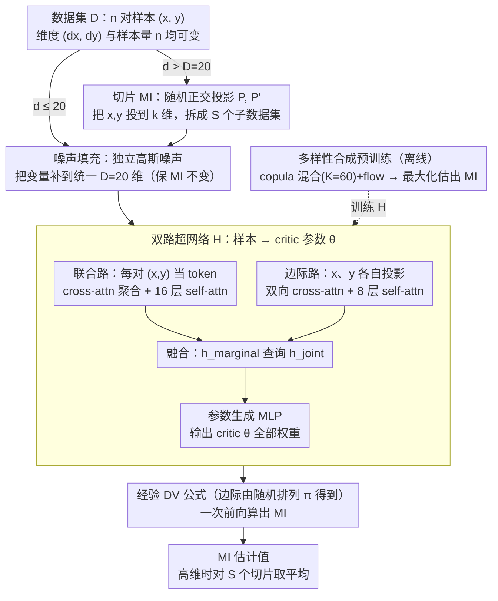

# InfoAtlas: A Foundation Model for Zero-Shot Statistical Dependence Estimation

**会议**: ICML 2026  
**arXiv**: [2606.00241](https://arxiv.org/abs/2606.00241)  
**代码**: 论文提及 InfoAtlas-project 页面（项目页链接见论文）  
**领域**: 自监督 / 基础模型 / 互信息估计  
**关键词**: 互信息, 基础模型, 超网络, 切片互信息, 合成数据预训练

## 一句话总结
InfoAtlas 把互信息估计从"每个数据集都要从头训一个评估网络"的优化问题，改造成一个用大规模合成数据预训练好的超网络的"一次前向推理"问题，做到与 MINE/MINDE 等神经估计器相当的精度同时 100× 提速。

## 研究背景与动机

**领域现状**：互信息 (MI) 是衡量两组多维变量统计依赖的标准工具，主流神经估计器 MINE / InfoNCE / MINDE 用 Donsker-Varadhan (DV) 等变分下界把 MI 估计写成 $\mathbb{I}(\mathbf{x}, \mathbf{y}) \coloneqq \sup_\theta \mathbb{E}_{p_{xy}}[\theta] - \log(\mathbb{E}_{p_x \otimes p_y}[e^\theta])$，再用神经网络逼近最优 critic $\theta$。

**现有痛点**：所有神经 MI 估计器都共享一个致命问题——每来一个新数据集都要从头训一个 critic 网络，几千步梯度下降才能收敛，单次估计复杂度 $\mathcal{O}(T)$；这让高频金融相关性监控、大规模基因筛查等实时场景几乎不可用。前作 InfoNet (Hu et al. 2024) 试图通过查表绕开训练，但只能处理 1 维输入，扩到 $d$ 维需要 $\mathcal{O}(e^d)$ 的查表空间，$d=8$ 就已经吃不消，且无法处理变维度数据。

**核心矛盾**：神经 MI 估计的精度依赖于"为这份数据训一个专属 critic"，但训练成本和数据数量成正比；要想做到"一次前向出 MI"，必须找到一种方式让 critic 参数本身成为数据集的函数 $\theta^* = \mathcal{H}(\mathcal{D})$，并且这种映射要能在未见的真实数据上泛化。

**本文目标**：把 MI 估计降级为一次推理任务——一个统一模型处理任意维度、任意样本量的多变量数据，跳过 per-dataset 优化，且需要对真实场景（CLIP、视频、机器人）也有强泛化。

**切入角度**：作者借鉴 TabPFN / Chronos 等基础模型在表格预测和时序预测上的成功——大规模合成数据预训练 + 一次前向推理。本文把同样的思路引到 MI 估计：合成一个"依赖结构空间"，让模型在上面学会"从样本反推 critic 参数"。

**核心 idea**：用一个超网络 $\mathcal{H}$ 把数据集映射为 DV critic 的全部参数，在巨量合成（copula 混合 + flow 变换）依赖结构上预训练，使其零样本泛化到未见分布；高维数据用 sliced MI 拆成多个低维投影，靠 transformer 批并行处理 $S$ 个切片。

## 方法详解

### 整体框架

InfoAtlas 的核心是一个 attention-based 超网络 $\mathcal{H}: \mathcal{D} \mapsto \Theta$，输入是 $n$ 对样本 $\{(\mathbf{x}^i, \mathbf{y}^i)\}_{i=1}^n$，输出是 DV critic $\theta$ 的全部参数（包括所有权重和偏置 flattened 成一个向量）。拿到 $\theta$ 后用经验 DV 公式 $\hat{\mathbb{I}}_\theta(\mathbf{x}, \mathbf{y}) = \frac{1}{n}\sum_i \theta(\mathbf{x}^i, \mathbf{y}^i) - \log(\frac{1}{n}\sum_j e^{\theta(\mathbf{x}^j, \mathbf{y}^{\pi(j)})})$ 一步算出 MI，其中 $\pi$ 是随机排列得到的边际样本。整套预训练在合成的 copula 混合分布上做，跑一次前向就出 MI；维度 $d > D = 20$ 时切换到 $k$-sliced MI，把高维问题拆成 $S$ 个 $k$ 维子问题并 batch 喂给同一个 $\mathcal{H}$。

### 关键设计

**1. 双路超网络：直接生成 critic 参数，跳过梯度下降**

传统神经 MI 估计的瓶颈是"每来一个数据集都要从头训一个 critic"，InfoAtlas 把这一步换成一次推理——超网络 $\mathcal{H}$ 看完样本就吐出 critic $\theta$ 的全部参数。架构刻意对齐 DV 公式的两个期望项（一个在联合分布上、一个在边际乘积上），拆成两路独立编码。联合路径把每对样本 $[\mathbf{x}^i; \mathbf{y}^i]$ 当 token，用可学习查询做 cross-attention 聚合（权重 $\alpha_i = \mathrm{softmax}(\mathbf{q}_{joint}^\top \mathbf{W}_K [\mathbf{x}^i; \mathbf{y}^i]/\sqrt{d_{model}})$ 自动加重相关性强的样本），再过 16 层 self-attention 得 $\mathbf{h}_{joint}$；边际路径把 $\{\mathbf{x}^i\}$、$\{\mathbf{y}^i\}$ 各自投影后做双向 cross-attention、8 层 self-attention 得 $\mathbf{h}_{marginal}$。最后 $\mathbf{h}_{fused} = \mathrm{CrossAttention}(\mathbf{h}_{marginal}, \mathbf{h}_{joint}, \mathbf{h}_{joint})$ 经 MLP 输出 $\theta$。

这样设计有两个好处：架构与 DV 结构同构，联合/边际两支各管一个期望项，物理意义清晰；attention 天然 permutation invariant（样本顺序无关），又能按数据动态聚焦最相关的样本对，而不是平等对待所有点。

**2. 噪声填充：让一个模型吃下任意维度的输入**

不同数据集的 $(d_x, d_y)$ 各不相同，若为每种维度组合训一个模型代价太大。InfoAtlas 对维度 $d < D$ 的输入，用独立高斯噪声 $\mathcal{N}(0, \mathbf{I})$ 把变量补到统一的 $D$ 维。关键是这个 padding 不改变 MI：命题 A.3 证明当 $\mathbf{n}_x, \mathbf{n}_y$ 相互独立且与 $\mathbf{x}, \mathbf{y}$ 独立时，$\mathbb{I}(\mathbf{x}, \mathbf{y}) = \mathbb{I}([\mathbf{x}; \mathbf{n}_x], [\mathbf{y}; \mathbf{n}_y])$。比起常见的零填充会引入虚假对称性，噪声填充提供的是真正 MI-preserving 的增强，让架构保持统一的同时不污染估计目标。

**3. 切片 MI + 批并行推理：把高维数据 scale 到 $D=20$ 维以上**

超网络原生只支持维度 $\le D=20$ 的输入，但 CLIP embedding（512 维）、视频轨迹、机器人状态这些真实场景动辄上百维。InfoAtlas 借切片互信息（sliced MI）把高维依赖拆成多个低维"切片"来看：在 Stiefel 流形上随机采正交投影矩阵 $\mathbf{P}_i, \mathbf{P}'_i \in \mathbb{R}^{k\times d}$，把 $\mathbf{x}, \mathbf{y}$ 投到 $k$ 维，估计 $S$ 个投影方向上的 MI 再平均：$\hat{\mathbb{SI}}_k = \frac{1}{S}\sum_i \hat{\mathbb{I}}(\mathbf{P}_i\mathbf{x}, \mathbf{P}'_i\mathbf{y})$，理论上仍保留 $\mathbb{I}=0 \Leftrightarrow \mathbb{SI}=0$ 等关键性质。真正让这招实用的是 InfoAtlas 的 transformer 架构能把 $S$ 个切片打包成一个 batch、一次前向同时吐出 $S$ 个 critic（$\{\theta_1^*,\dots,\theta_S^*\} = \mathcal{H}(\{\mathcal{D}_j\})$）；而传统神经估计器要为每个投影方向单独训一个网络、复杂度 $O(ST)$，InfoAtlas 直接砍到 $O(1)$。实验也证实切片维度 $k$ 比切片数 $S$ 更关键——$k=5, S=25$ 远好于 InfoNet 的 $k=1, S=128$，因为 1 维投影丢失了太多结构。

**4. 多样性合成预训练：copula 混合 + flow 变换，喂出零样本泛化**

零样本能力的前提是预训练 distribution 要尽量覆盖真实场景的统计模式，InfoAtlas 用两层多样性来铺这张"atlas"。依赖结构上用 copula 混合 $\mathbf{x}, \mathbf{y} \sim \sum_{i=1}^K \pi_i c_i$，$c_i$ 取自 Gaussian copula（任意相关矩阵）和 Student-$t$ copula（不同尾依赖），$K=60$（远多于前作的 32，按 vector copula 理论足以逼近任意依赖）；边际形状上用随机初始化的可逆 flow $f_X, f_Y$（双射保持 MI 不变），再加 softrank 把边际拉近均匀。预训练直接最大化估出来的 MI：$\mathcal{L}(\mathcal{H}) = -\mathbb{E}_{\mathcal{D} \sim p(\mathcal{D})}[\hat{\mathbb{I}}_{\mathcal{H}(\mathcal{D})}(\mathbf{x}_\mathcal{D}, \mathbf{y}_\mathcal{D})]$，在 DV 框架下等价于最小化负 DV 下界。合成数据"无限量"还顺带解决了常规估计器的老毛病——单数据集样本少导致的高方差/高偏差（McAllester & Stratos 2020），这里 batch 和样本数都能任意大。

### 损失函数 / 训练策略

预训练目标如上 $\mathcal{L}(\mathcal{H}) = -\mathbb{E}_{\mathcal{D} \sim p(\mathcal{D})}[\hat{\mathbb{I}}_{\mathcal{H}(\mathcal{D})}]$；命题 A.1 给出一致性结论：在温和条件下该目标的最优解就是 ground-truth MI 对应的最优 critic。高维数据的切片推理细节见上文关键设计 3。

## 实验关键数据

### 主实验

| 任务 / 数据集 | 指标 | InfoAtlas | 主要 Baseline | 备注 |
|--------|------|------|----------|------|
| BMI Mn-dense 5-5-0.5 (GT=0.59) | MI 估计 | $\mathbf{0.60}$ | MINE 0.60 / MINDE 0.58 | 与最佳神经估计器相当 |
| BMI Asinh@St 5-5-2 (GT=0.45) | MI 估计 | $\mathbf{0.41}$ | MINE 0.53 / MINDE 0.43 | 更接近 GT |
| BMI 总耗时 | 秒 | $\mathbf{0.09}$ | MINE 25.9 / InfoNCE 67.6 / KNIFE 48.4 | ~300× 提速 |
| CLIP 512D 图文 MI | 噪声敏感性 | 误差带清晰可分 | InfoNet 误差大 | 5-sliced, $S=25$ |
| PointOdyssey 轨迹分割 | AUC-PR | 与神经方法相当 | MINE 同水平但慢 orders | 数秒完成全部点对 |
| ManiSkill 2 Pick Cube Seen | Success Rate | $\mathbf{94.2\%}$ | MINE-1000 81.2 / InfoNet 91.0 / No-MI 66.0 | 25 slices |
| ManiSkill 2 Peg Insertion Seen | Success Rate | $\mathbf{72.4\%}$ | MINE-1000 65.4 / InfoNet 46.4 | 25 slices |
| ManiSkill 2 关键状态提取耗时 | 秒 | 2.17 | MINE-1000 6.01 | 同 batch 下 |

可以看到 InfoAtlas 在精度上稳定追平 MINE / MINDE 等需要梯度优化的方法，在速度上甩开 100×–300×；相比同样追求速度的 InfoNet 又能处理多维和变维数据，下游任务（机器人策略训练）成功率更高。

### 消融 / 分析实验

| 配置 | 说明 |
|------|------|
| InfoAtlas (5-sliced, $S=25$) | 完整设置，CLIP/机器人任务的默认配置 |
| InfoNet (1-sliced, $S=128$) | 切片维度只有 1，信息丢失严重 |
| MINE-100 / MINE-1000 | 用 100 或 1000 步训 MINE，越多步越准但越慢，仍弱于 InfoAtlas |
| No-MI-Loss | 提取关键状态时不做 MI 最大化，机器人成功率显著下降（Pick Cube 66.0 vs 94.2） |
| KNIFE (KDE-based) | 高维数据上崩坏（Mn-dense 估到 0.93 而 GT=0.59） |

### 关键发现

- 单一模型不需要任何微调就能在 CLIP / 视频 / 机器人这些差异很大的真实场景上工作，说明合成 copula + flow 的预训练 distribution 确实覆盖了真实分布族，pretraining diversity 假说成立。
- 切片维度 $k$ 比切片数 $S$ 更关键：InfoAtlas 用 $k=5, S=25$ 比 InfoNet 用 $k=1, S=128$ 显著好，1 维投影确实丢失太多结构。
- KSG 等传统非参方法在低维 (1-1) 上仍可与神经方法竞争，但维度一高（5-5 以上）就完全不行；这印证了"高维 MI 必须靠参数化估计 + 学习先验"的判断。
- 把 MI 估计当 plug-in 模块用到下游任务（机器人 key state extraction）时，速度的优势会被放大成训练效率的优势——MINE 跑 1000 步太贵，工程上很难用；InfoAtlas 让"逐 step 估 MI 做 reward shaping"成为可能。

## 亮点与洞察

- "Hypernetwork outputs critic parameters" 把 MI 估计变成了 amortized inference，这个范式可以推广到任何"per-dataset 优化"的统计任务（Bayesian 推断、density ratio estimation、conditional independence test），是基础模型思路在统计计算领域的一次清晰示范。
- 噪声 padding 这一招非常聪明——既保 MI 不变又解了变维度难题，比常见的 zero-padding 或 dimensionality-wise modeling 都干净；这种"用噪声做对齐"的技巧在序列建模里也可复用（如对齐不同长度的输入）。
- 双路对应 DV 公式的两个期望项，体现了 architecture-aligned-with-objective 的设计哲学；这种"先看损失函数结构再设计网络"的思路在 score-based / contrastive / DV 各类目标上都成立，值得做类似设计的研究者借鉴。
- Sliced MI 的批并行处理让 transformer 的 batch 优势发挥到极致——一次前向出 $S$ 个 critic，相比 $S$ 次独立训练的 $O(ST)$ 直接砍到 $O(1)$，这是基础模型 + 切片技术的协同效应。

## 局限与展望

- **上限受预训练分布 cover 范围限制**：作者承认离散数据、极重尾分布、长程依赖等没在 atlas 里出现的结构可能泛化不好；扩 atlas 需要更多元的合成分布族（如 vine copula、Lévy 过程边际）。
- **Sliced MI 非全 MI 的替代品**：切片会丢失某些只在高维特定方向上才显著的依赖（如稀有但信息量大的投影方向），有限 $S$ 也无法保证覆盖全部相关方向；高 stakes 场景仍需慎用。
- **模型容量与精度的 trade-off**：当前架构 $D=20$ 已经吃 16+8 层 self-attention，扩到更高 $D$ 会让超网络输出 $|\Theta|$ 急剧膨胀，存在 scaling 难题；可考虑用 LoRA / 低秩分解输出 critic。
- **可改进方向**：把超网络做 conditional（按数据类型/维度条件化），或把 critic 架构本身参数化为 graph（让 $\mathcal{H}$ 输出 graph 结构而非固定 MLP 权重）；也可探索 in-context MI（不输出参数而是直接预测 MI 值），进一步降低中间表示成本。

## 相关工作与启发

- **vs MINE / InfoNCE / MINDE**：他们都属于"per-dataset 训 critic"的神经估计器，靠新颖的下界提精度；InfoAtlas 走正交方向——不动下界结构，把 critic 训练换成超网络推理，本质是用"训练时间"换"推理时间"。
- **vs InfoNet (Hu et al. 2024)**：同样是预训练范式的先驱，但 InfoNet 只能处理 1 维输入且靠查表 ($O(e^d)$ 不可扩)；InfoAtlas 用 attention 超网络支持多维和变维，是更彻底的"foundation model for MI"实现。
- **vs TabPFN / Chronos**：相同基础模型范式（合成大规模预训练 + 一次前向出预测），InfoAtlas 把这个 pattern 延展到"两个变量集之间的关系"任务，相比单向预测难度更高。
- **vs Copula-based MI 估计**：传统 copula 方法假设固定 copula 族（如 Gaussian），灵活性差；InfoAtlas 用 60 个 copula 的随机混合 + flow 变换合成数据，间接让模型学会处理任意 copula。

## 评分
- 新颖性: ⭐⭐⭐⭐⭐ 首个真正多维变维度的"零样本 MI 估计基础模型"，超网络 + DV 对齐的架构清晰原创。
- 实验充分度: ⭐⭐⭐⭐⭐ 从 BMI sanity check 到 CLIP / 视频 / 机器人下游，覆盖广且对比公平。
- 写作质量: ⭐⭐⭐⭐ 概念引入清楚，"atlas / slice" 类比形象；少量段落（slicing 失败模式）压在附录略可惜。
- 价值: ⭐⭐⭐⭐⭐ 让 MI 估计真正可作为下游模块插入实时系统，对表示学习、机器人、生物信号分析都有立即用处。

<!-- RELATED:START -->

## 相关论文

- [\[ICML 2026\] From Zero to Hero: Advancing Zero-Shot Foundation Models for Tabular Outlier Detection](from_zero_to_hero_advancing_zero-shot_foundation_models_for_tabular_outlier_dete.md)
- [\[ICML 2026\] Statistical Consistency and Generalization of Contrastive Representation Learning](statistical_consistency_and_generalization_of_contrastive_representation_learnin.md)
- [\[ICML 2026\] How 'Neural' is a Neural Foundation Model?](how_neural_is_a_neural_foundation_model.md)
- [\[CVPR 2026\] Zero-Ablation Overstates Register Content Dependence in DINO Vision Transformers](../../CVPR2026/self_supervised/zero_ablation_overstates_register_content_dependence_in_dino_vision_transformers.md)
- [\[ICML 2025\] Foundation Model Insights and a Multi-Model Approach for Superior Fine-Grained One-shot Subset Selection](../../ICML2025/self_supervised/foundation_model_insights_and_a_multi-model_approach_for_superior_fine-grained_o.md)

<!-- RELATED:END -->
